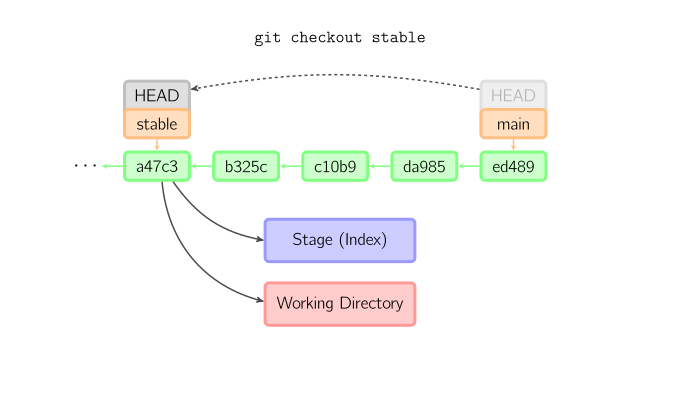
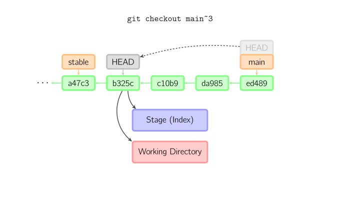

# 图解Git

## 基本用法


上面的四条命令在工作目录、暂存目录(也叫做索引)和仓库之间复制文件。

- `git add *files*` 把当前文件放入暂存区域。
- `git commit` 给暂存区域生成快照并提交。
- `git reset -- *files*` 用来撤销最后一次`git add *files*`，你也可以用`git reset` 撤销所有暂存区域文件。
- `git checkout -- *files*` 把文件从暂存区域复制到工作目录，用来丢弃本地修改。

你可以用 `git reset -p`, `git checkout -p`, or `git add -p`进入交互模式。

也可以跳过暂存区域直接从仓库取出文件或者直接提交代码。


- `git commit -a `相当于运行 `git add` 把所有当前目录下的文件加入暂存区域再运行`git commit`。
- `git commit *files*` 进行一次包含最后一次提交加上工作目录中文件快照的提交，并且文件被添加到暂存区域。
- `git checkout HEAD -- *files*` 回滚到复制最后一次提交。

## 约定


绿色的5位字符表示提交的ID，分别指向父节点。分支用橘色显示，分别指向特定的提交。当前分支由附在其上的*HEAD*标识。 这张图片里显示最后5次提交，*ed489*是最新提交。 *main*分支指向此次提交，另一个*stable*分支指向祖父提交节点。

## 命令详解

### Diff

有许多种方法查看两次提交之间的变动。下面是一些示例。


### Commit

提交时，git用暂存区域的文件创建一个新的提交，并把此时的节点设为父节点。然后把当前分支指向新的提交节点。下图中，当前分支是*main*。 在运行命令之前，*main*指向*ed489*，提交后，*main*指向新的节点*f0cec*并以*ed489*作为父节点。


即便当前分支是某次提交的祖父节点，git会同样操作。下图中，在*main*分支的祖父节点*stable*分支进行一次提交，生成了*1800b*。 这样，*stable*分支就不再是*main*分支的祖父节点。此时，[合并](http://marklodato.github.io/visual-git-guide/index-zh-cn.html#merge) (或者 [衍合](http://marklodato.github.io/visual-git-guide/index-zh-cn.html#rebase)) 是必须的。


如果想更改一次提交，使用 `git commit --amend`。git会使用与当前提交相同的父节点进行一次新提交，旧的提交会被取消。


另一个例子是[分离HEAD提交](http://marklodato.github.io/visual-git-guide/index-zh-cn.html#detached),后文讲。

### Checkout

checkout命令用于从历史提交（或者暂存区域）中拷贝文件到工作目录，也可用于切换分支。

当给定某个文件名（或者打开-p选项，或者文件名和-p选项同时打开）时，git会从指定的提交中拷贝文件到暂存区域和工作目录。比如，`git checkout HEAD~ foo.c`会将提交节点*HEAD~*(即当前提交节点的父节点)中的`foo.c`复制到工作目录并且加到暂存区域中。（如果命令中没有指定提交节点，则会从暂存区域中拷贝内容。）注意当前分支不会发生变化。


当不指定文件名，而是给出一个（本地）分支时，那么*HEAD*标识会移动到那个分支（也就是说，我们“切换”到那个分支了），然后暂存区域和工作目录中的内容会和*HEAD*对应的提交节点一致。新提交节点（下图中的a47c3）中的所有文件都会被复制（到暂存区域和工作目录中）；只存在于老的提交节点（ed489）中的文件会被删除；不属于上述两者的文件会被忽略，不受影响。



如果既没有指定文件名，也没有指定分支名，而是一个标签、远程分支、SHA-1值或者是像*main~3*类似的东西，就得到一个匿名分支，称作*detached HEAD*（被分离的*HEAD*标识）。这样可以很方便地在历史版本之间互相切换。比如说你想要编译1.6.6.1版本的git，你可以运行`git checkout v1.6.6.1`（这是一个标签，而非分支名），编译，安装，然后切换回另一个分支，比如说`git checkout main`。然而，当提交操作涉及到“分离的HEAD”时，其行为会略有不同，详情见在[下面](http://marklodato.github.io/visual-git-guide/index-zh-cn.html#detached)。



### HEAD标识处于分离状态时的提交操作

当*HEAD*处于分离状态（不依附于任一分支）时，提交操作可以正常进行，但是不会更新任何已命名的分支。(你可以认为这是在更新一个匿名分支。)


一旦此后你切换到别的分支，比如说*main*，那么这个提交节点（可能）再也不会被引用到，然后就会被丢弃掉了。注意这个命令之后就不会有东西引用*2eecb*。


但是，如果你想保存这个状态，可以用命令`git checkout -b *name*`来创建一个新的分支。


### Reset

reset命令把当前分支指向另一个位置，并且有选择的变动工作目录和索引。也用来在从历史仓库中复制文件到索引，而不动工作目录。

如果不给选项，那么当前分支指向到那个提交。如果用`--hard`选项，那么工作目录也更新，如果用`--soft`选项，那么都不变。


如果没有给出提交点的版本号，那么默认用*HEAD*。这样，分支指向不变，但是索引会回滚到最后一次提交，如果用`--hard`选项，工作目录也同样。


如果给了文件名(或者 `-p`选项), 那么工作效果和带文件名的[checkout](http://marklodato.github.io/visual-git-guide/index-zh-cn.html#checkout)差不多，除了索引被更新。


### Merge

merge 命令把不同分支合并起来。合并前，索引必须和当前提交相同。如果另一个分支是当前提交的祖父节点，那么合并命令将什么也不做。 另一种情况是如果当前提交是另一个分支的祖父节点，就导致*fast-forward*合并。指向只是简单的移动，并生成一个新的提交。


否则就是一次真正的合并。默认把当前提交(*ed489* 如下所示)和另一个提交(*33104*)以及他们的共同祖父节点(*b325c*)进行一次[三方合并](http://en.wikipedia.org/wiki/Three-way_merge)。结果是先保存当前目录和索引，然后和父节点*33104*一起做一次新提交。


### Cherry Pick

cherry-pick命令"复制"一个提交节点并在当前分支做一次完全一样的新提交。


### Rebase

衍合是合并命令的另一种选择。合并把两个父分支合并进行一次提交，提交历史不是线性的。衍合在当前分支上重演另一个分支的历史，提交历史是线性的。 本质上，这是线性化的自动的 [cherry-pick](http://marklodato.github.io/visual-git-guide/index-zh-cn.html#cherry-pick)


上面的命令都在*topic*分支中进行，而不是*main*分支，在*main*分支上重演，并且把分支指向新的节点。注意旧提交没有被引用，将被回收。

要限制回滚范围，使用`--onto`选项。下面的命令在*main*分支上重演当前分支从*169a6*以来的最近几个提交，即*2c33a*。


同样有`git rebase --interactive`让你更方便的完成一些复杂操作，比如丢弃、重排、修改、合并提交。

# Git介绍 — 1.版本控制系统介绍

在具体了解Git之前，首先需要我们了解一下VCS——版本控制系统（version control system）

## 1、什么是版本控制系统

版本控制是一种记录一个或若干个文件内容变化，以便将来查阅特定版本修订情况的系统。版本控制系统不仅可以应用于软件源代码的文本文件，而且可以对任何类型的文件进行版本控制。

有了它你就可以将某个文件回溯到之前的状态，甚至将整个项目都回退到过去某个时间点的状态，你可以比较不同版本文件的变化细节，查出最后是谁修改了哪个地方。也就是无论文件最后被修改成什么样子，你都可以轻松恢复到原先的样子，但是额外增加的工作量却微乎其微。

## 2、我们为什么要用版本控制

一个最简单的开发团队，也许就两三个人，他们共同完成一个软件的开发。每个人都在修改、添加、删除着自己本地硬盘上的代码，当他们把这些代码汇总起来时，麻烦出现了。到底谁改了哪些文件？具体是文件里的哪部分被改动过？A人员修改的内容会不会把B人员的修改的内容覆盖掉，汇总工作就变得很危险，需要非常小心，一旦出错后果不堪设想。显然此时效率将会是无比的低下，如果某个地方出错，可能整个汇总工作就要重来一遍。这只是两三人的小团队，如果是几十人几百人的大团队呢？那将会是噩梦。

如果这个团队采用了版本控制，那么版本控制软件在每次提交文件的时候，都会主动合并所有人的修改，并解决可能发生的冲突。每个人手里一直都是汇总好的代码，当开发进行到一定阶段，可以直接拿去测试，不需要再有额外的工作来浪费时间。

## 3、版本管理系统的演变

### （1）本地版本控制系统

许多人习惯用复制整个项目目录的方式来保存不同的版本，或许还会改名加上备份时间以示区别。 这么做唯一的好处就是简单，但是特别容易犯错。 有时候会混淆所在的工作目录，一不小心会写错文件或者覆盖意想外的文件。

为了解决这个问题，人们很久以前就开发了许多种本地版本控制系统，大多都是采用某种简单的数据库来记录文件的历次更新差异。


这种形式主要实现了基本的代码版本管理，但缺点是无法让多人同时对一个版本库进行修改。这个也和当时软件规模不够大有关，也没有这样的需求。

### （2）集中化版本控制系统

接下来人们又遇到一个问题，如何让在不同系统上的开发者协同工作？ 于是，集中化的版本控制系统（Centralized Version Control Systems，简称 CVCS）应运而生。 这类系统，诸如 CVS、Subversion等，都有一个单一的集中管理的服务器，保存所有文件的修订版本，而协同工作的人们都通过客户端连到这台服务器，取出最新的文件或者提交更新。 多年以来，这已成为版本控制系统的标准做法。


这种做法带来了许多好处，特别是相较于老式的本地 VCS 来说。 现在，每个人都可以在一定程度上看到项目中的其他人正在做些什么。 而管理员也可以轻松掌控每个开发者的权限，并且管理一个 CVCS 要远比在各个客户端上维护本地数据库来得轻松容易。

事分两面，有好有坏，集中管理的服务器最显而易见的缺点是中央服务器的单点故障问题。 如果宕机一小时，那么在这一小时内，谁都无法提交更新，也就无法协同工作。 如果中心数据库所在的磁盘发生损坏，又没有做恰当备份，毫无疑问你将丢失所有数据，包括项目的整个变更历史，只剩下人们在各自机器上保留的单独快照。 

集中式版本控制系统另外一个大的问题就是必须联网才能工作，如果不能连接到中央服务器上，就不能对文件进行提交，还原，对比等操作。

### （3）分布式版本控制系统

于是分布式版本控制系统（Distributed Version Control System，简称 DVCS）面世了。 在这类系统中，像 Git、Mercurial、Bazaar 以及 Darcs 等，客户端并不只提取最新版本的文件快照，而是把代码仓库完整地镜像下来。 这么一来，任何一处协同工作用的服务器发生故障，事后都可以用任何一个镜像出来的本地仓库恢复。 因为每一次的克隆操作，实际上都是一次对代码仓库的完整备份。


# Git介绍 — 2.Git的协作模式

### 1、集中式工作流

Git为了便于客户机之间的协同工作，Git版本控制系统一般会设置一个中央版本库服务器，目的是让所有客户机都从该主机更新版本，提交最新版本，该工作模式下的客户机地位都平等。

集中式工作流以中央仓库作为项目所有修改的单点实体，所有修改都提交到 `Master分支`上。

如下图：


上图说明：

- 一个远程仓库，
- 一个主分支master，
- 团队每个成员都有一个本地仓库，在本地仓库中进行代码的编辑、暂存和提交工作。

**集中式工作流总结：**

- 适用人群：小型开发小团队。
- 工作方式：
  - 团队组长创建远程仓库，创建一个master分支，组员可读可写。
  - 每个开发人员都`git clone`远程仓库到本地仓库，在master分支上开发。
  - 每次开发都要`git pull`更新远程仓库的master分支版本到本地。
  - 每次开发完成就`git commit`到本地仓库， 接着`git push`到远程仓库。
- 缺点：
  - 忘了`git push`，一直会提交到本地仓库，没有推送到远程仓库。
  - 忘了`git pull`，导致本地仓库与中央仓库不一致，发生文件冲突。
  - 大量操作`git pull`，导致增加Git分支合并次数，增加了Git变基次数，降低了Git的性能。

### 2、分支工作流

功能分支工作流在集中式工作流的基础上，为各个新功能分配一个专门的分支来开发，即在master主分支外在创建一个分支，程序员开发的新功能全部push到此分支上，等到功能成熟的时候，再把此分支合并到主分支master上。

如下图：


**分支工作流总结：**

- 适用人群：小型开发团队，熟悉Git分支的团队。
- 工作方式：
  - 团队组长创建远程仓库，创建一个master分支，组员可读不可写。
  - 每个开发人员都`git clone`远程仓库到本地仓库。
  - 每个开发人员创建自己的feature分支，在feature分支上开发。（记住，feature分支是基于master分支）
  - 每个开发人员每次开发完成就`git commit`到本地仓库中自己的feature分支， 接着`git push`到远程仓库。
  - 通过`pull request`提醒团队组长，浏览组员提交feature分支。
  - 组长把feature分支拉下来，然后合并到自己本地仓库的master分支上测试。
  - 组长测试feature分支通过之后，由组长负责把feature分支合并到远程仓库的master分支上。
  - 组长在远程仓库把合并过的feature分支删除。
  - 组员在本地仓库把合并过的feature分支删除。
  - 组员将本地仓库分支切换为master分支，然后`git pull`将本地仓库的master分支更新到远程仓库的master分支版本。
- 缺点：
  - 增加团队组长的工作量。
  - 增加团队组员提交步骤。

> PS：`Pull Request`作用是可以让其他组员或组长可以查看你的代码，并可以提出代码修改意见或者讨论。

### 3、GitFlow 工作流(最流行)

**Gitflow工作流**没有用超出上面**功能分支工作流**的概念和命令，而是为不同的分支，分配一个很明确的角色，并定义分支之间如何交互，和什么时候进行交互。

- 除了有master主分支（用于存储正式发布的历史版本）外，还有一个作为功能集成分支的develop分支。

  当初始化完成后，某个程序员想要开发一个功能，并不是直接从master分支上拉出新分支，而是使用develop分支作为父分支来拉出新分支。

  当新功能完成后，再合并回父分支，**新功能的提交并不与master分支直接交互**。

- 一旦develop分支上有了做一次发布（或者说快到了既定的发布日）的足够功能，就从develop分支上checkout一个发布分支。

  新建的发布分支用于开始发布循环，所以从这个时间点开始之后新的功能，不能再加到这个分支上，该分支只应该做Bug修复、文档生成和其它面向发布任务。

  一旦对外发布的工作都完成了，发布分支合并到master分支，并分配一个版本号打好Tag。

  另外，这些从新建发布分支以来的做的修改，要合并回develop分支上。

- 维护分支或说是热修复（hotfix）分支用于，快速给产品发布版本（production releases）打补丁，这是唯一可以直接从master分支fork出来的分支。

  修复完成，修改应该马上合并回master分支和develop分支（当前的发布分支），master分支应该用新的版本号打好Tag。

  为Bug修复使用专门分支，让团队可以快速处理掉问题，而不用打断其它工作或是等待下一个发布循环。

  你可以把维护分支想成是一个直接在master分支上处理的临时发布。

**总结就是**：`Gitflow` 工作流通过为**功能开发**、**发布准备**和**维护**设立了独立的分支，让发布迭代过程更流畅，充分的利用了分支的特点。严格的分支模型也为大型项目提供了一些非常必要的结构。

下图是完整的`Gitflow` 工作流开发方式图，但实际开发工作环境可能会精简：


**Gitflow工作流总结：**

- 适用人群：任何开发团队，熟悉Git分支的团队。
- 工作方式：
  - 项目维护者创建项目维护者的远程仓库，创建master分支与develop分支，贡献者可读不可写。
  - 每个贡献者`git clone`远程仓库中的develop分支到本地仓库。（记住，develop分支相当于master的分支，包括功能开发，修改，测试。master分支相当于最终分支）
  - 每个贡献者在本地仓库创建自己的feature分支，在feature分支上开发。
  - 在feature分支又可以创建多个feature分支，继续开发项目。
  - 每个贡献者每次开发完成就`git commit`到本地仓库中自己的feature分支， 接着`git push`到远程仓库。
  - 通过`pull request`提醒项目维护者，浏览贡献者提交feature分支。
  - 项目维护者把feature分支拉下来，然后合并到自己本地仓库的develop分支上测试。
  - 组长测试feature分支通过之后，由组长负责把feature分支合并到远程仓库的develop分支上。
  - 项目维护者会release分支上`git tag`打上版本号。
  - 项目维护者可以从develop分支创建release分支，接着把release分支合并到master分支上，同时master分支同步到develop分支。
  - 项目维护者在远程仓库把合并过的feature分支删除。
  - 每个贡献者在本地仓库把合并过的feature分支删除。
  - 每个贡献者将本地仓库分支切换为develop分支，然后`git pull`将本地仓库的master分支更新到远程仓库的develop分支版本。

> PS：Gitflow工作流是`Vincent Driessen`工程师提出的多分支工作流。

### 4、Forking 工作流(偶尔使用)

分叉(Forking)工作流也可以叫做分布式工作流，是在 GitFlow工作流的基础上的衍生，充分利用了Git在分支和克隆上的优势，再加上`pull request` 的功能，以达到代码审核的目的。既可以管理大团队的开发者（developer）的提交，也可以接受不信任贡献者（contributor）的提交。

**这种工作流使得每个开发者都有一个服务端仓库（此仓库只有自己可以push推送，但是所有人都可以pull拉取修改）**，每个程序员都push代码到自己的服务端仓库，但不能push到正式仓库，只有项目维护者才能push到正式仓库，这样项目维护者可以接受任何开发者的提交，但无需给他正式代码库的写权限。

这种工作流适合开源社区的开源项目，大家统一对项目做贡献，但是有一个人或一个团队作为开发者来管理项目，所有的贡献者的代码由开发者审核，其功能完善之后再由开发者push到正式仓库中。

**总结：**

- 分叉(Forking)工作流更适合安全可靠地管理大团队的开发者，而且能接受不信任贡献者的提交。
- 在实际工作中，如果偶尔有需要团队外的成员帮我们解决问题时，可能会用到。
- 这种工作流程并不常用，只有当项目极为庞杂，或者需要多级别管理时，才会体现出优势。 利用这种方式，项目总负责人（即主管）可以把大量分散的集成工作，委托给不同的小组负责人分别处理，然后在不同时刻将大块的代码子集统筹起来，用于之后的整合。


> 提示：
>
> - 每个成员都可以从中央版本库中拉取代码。
> - 每级成员都只能向上一级提交代码。
> - 上一级合并代码之后继续向上级提交代码。
> - 最后只有独裁者才能向中央版本库提交代码。

**分叉工作流（分布式仓库工作流）总结：**

- 适用人群：大型开发团队，熟悉Git分支的团队。
- 工作方式：
  - 主项目维护者创建远程仓库，创建一个master分支，从项目维护者可读不可写。
  - 从项目维护者通过fork主项目维护者的远程仓库的副本，到自己的远程仓库，包括master分支。（记住，从项目维护者的远程仓库独立于主项目维护者的远程仓库）
  - 从项目维护者`git clone`主项目维护者的远程仓库的副本到本地仓库。
  - 从项目维护者创建自己的feature分支，在feature分支上开发。
  - 从项目维护者每次开发完成就`git commit`到本地仓库中自己的feature分支， 接着`git push`到远程仓库。
  - 通过`pull request`命令，从项目维护者合并自己feature分支，到从项目维护者的远程仓库的master分支上。
  - 从项目维护者在远程仓库把合并过的feature分支删除。
  - 从项目维护者在本地仓库把合并过的feature分支删除。
  - 从项目维护者在远程仓库通过`pull request`向主项目维护者的远程仓库的推送。
  - 主项目维护者通过`pull request`获取从项目维护者的远程仓库的推送。
  - 主项目维护者进行从项目维护者的远程仓库代码审查，测试。
  - 主项目维护者确认无误后，可以直接合并到主项目维护者的远程仓库。

# Git介绍 — 3.Git操作流程

1. 初始化一个本地版本库，每个版本库仅需要执行一次。

2. 将中央版本库内容克隆到本地版本库，每个客户机仅需要执行一次。

3. 添加指定文件到版本控制管理（这一步只是添加到Git暂存区）。

4. 将添加、修改等操作，提交到本地版本库（将暂存区的内容提交到本地版本库）。

   如果远程仓库的内容被别人修改了，需要先同步远程的内容，直接`git pull`就可以更新本地的文件，然后再提交。再这过程中可能需要解决冲突。

   在修改完成后，如果发现错误，可以撤回提交并再次修改并提交。

5. 将本地版本库中的修改内容“推送”到中央版本库，客户机需要在一阶段性工作完成之后，或在某些时间点（下班，周五），将修改过的内容备份到中央版本库，方便他人更新到最新的代码。

6. 将中央版本库中的变化内容“拉取”本地版本库，客户机需要不定时的更新才可以获取最新的内容。

> 提示：实际工作中的很多功能和操作都在第3、4步中。

如下图：


**说明：**

上面内容涉及到Git中的几个区域：

- `workspace`：工作区。
- `staging area`：暂存区/缓存区。
- `local repository`：版本库或本地仓库。
- `remote repository`：远程仓库。

# Git操作 — 4.Git基本操作

## 1.将文件从暂存区撤回到工作区

执行`git rm --cached`命令，将`readme.txt`文件从暂存区撤回到工作区。

并执行`git status`命令查看工作区、暂存区状态。

```bash
L@DESKTOP-T2AI2SU MINGW64 /j/git-repository/learngit (master)
$ git rm --cached readme.txt
rm 'readme.txt'

L@DESKTOP-T2AI2SU MINGW64 /j/git-repository/learngit (master)
$ git status
On branch master

No commits yet

Untracked files:
  (use "git add <file>..." to include in what will be committed)
        readme.txt  # 文件名为红色

nothing added to commit but untracked files present (use "git add" to track)
```

可以看到结果，`readme.txt`文件又成为了一个未被Git追踪的文件。

## 2.git diff

1. 比较工作区与暂存区：

   `git diff`命令，不加参数即默认比较工作区与暂存区。

2. 比较暂存区与最新本地版本库（本地库中最近一次commit的内容）：

   `git diff --cached`命令或者`git diff --staged`命令

3. 比较工作区与最新本地版本库：

   `git diff HEAD`

4. 比较工作区与指定commit提交的差异：

   `git diff commit-id`

5. 比较暂存区与指定commit提交的差异：

   `git diff --cached commit-id`

6. 比较两个commit提交之间的差异：

   `git diff [<commit-id>] [<commit-id>]`

7. 使用`git diff`命令打补丁

## 3.git mv

重命名之后再add也行，但是日常工作中就用`git mv`重命名文件

运行`git mv readme.txt test.txt`命令就相当于运行了下面三条命令：

- `mv readme.txt test.txt`
- `git rm readme.txt`
- `git add test.txt`

# Git操作 — 5.撤销操作

1. 仅仅是工作区中内容进行了修改，还未添加到暂存区。
2. 文件已经添加到暂存区，但是还未提交到本地版本库。
3. 文件已经提交到本地版本库。

前两种可以叫撤销操作，后面一种叫回退版本，不同的情况具有不同的撤销方式。

## 1、撤销工作区中文件的修改

如果工作区的某个文件被改乱了，但还没有提交，可以用`git restore`或者`git checkout`命令找回本次修改之前的文件。

> 说明：`git checkout -- file`命令中的`--`很重要，没有`--`，就变成了“切换到另一个分支”的命令，我们在后面的分支管理中会再次遇到`git checkout`命令。

**总结**

1. `git restore <file>...`和`git checkout -- <file>...`命令原理：

   这里有两种情况：

   一种是`test.txt`自修改后还没有被放到暂存区，现在的撤销修改就回到和版本库一模一样的状态；

   一种是`test.txt`已经添加到暂存区后，又作了修改，现在的撤销修改就回到添加到暂存区后的状态。

2. 撤销命令是一个危险的命令，这个很重要，你对该文件做的任何修改都会消失。原理是你拷贝了该文件在暂存区或者本地版本库中的副本，来覆盖工作区的该文件。

   即：工作区的文件变化一旦被撤销，就无法找回了，除非你确实不想要这个文件了。

## 2、撤销暂存区中文件的修改

> 早期的Git中`git checkout`命令承载了分支操作和文件恢复的部分功能，有点复杂，并且难以使用和学习，所以社区解决将这两部分功能拆分开，Git 2.23.0版本中中引入了两个新的命令`git switch`和`git restore`。
>
> 早期的Git中，文件恢复涉及到两个命令，一个是`git checkout`命令，一个是`git reset`命令。`git reset`命令除了重置分支之外，还提供了恢复文件的能力。
>
> 而新的`git restore`命令，代替了`checkout`命令和`reset`命令专门用来恢复暂存区和工作区的文件。

- `git restore --staged <file>...`：该命令表示取消暂存，把暂存区中的文件撤回到工作区。
- `git reset HEAD <file>...`命令的执行效果和`git restore --staged`命令执行的效果是一样的

# Git操作 — 6.删除文件

- `git ls-files`：查看暂存区中的文件列表。
- `git ls-files --with-tree=HEAD`：查看本地版本库中的文件列表。（文中有使用说明）
- `git rm --cached filename`：仅删除暂存区中的文件。
- `git rm filename`：删除工作区和暂存区的文件。

# Git后悔药 — 7.reset版本回退说明

### 1、什么版本回退

版本回退也可以叫**回滚**。

若修改过的文件，不仅添加到了暂存区，还提交到了本地版本库，还能撤销吗？
 已经无法撤销修改了，但是可以回退到修改前的版本。

版本回退也是撤销操作的一种，但我更愿意和前两种撤销操作分开理解。

> 每当你觉得文件修改到一定程度的时候，就可以“保存一个快照”，这个快照在Git中被称为`commit`。一旦你把文件改乱了，或者误删了文件，还可以从最近的一个`commit`恢复，然后继续工作，而不是把几个月的工作成果全部丢失。

### 2、需要了解两个知识点

#### （1）HEAD是什么

HEAD也可以称为HEAD指针。

Git仓库初始化之后，会默认创建一个master分支，即主分支。这是Git对版本进行管理的时间线，即Git的每次提交，都会自动把它们串成一条时间线，这条时间线就是一个分支。

如果没有新建分支，那么就只有一条时间线，即只有一个分支，master分支（主分支）。在这条master时间线上有很多版本的时间节点（提交commit），而HEAD指针则指向的是当前分支上，刚刚提交的版本时间节点。


#### （2）HEAD指针用法

上面说了，HEAD指针代表的就是当前工作分支上最新一次的提交。换句话说`HEAD`这个词就等同于当前工作分支上最新一次提交的别名。

HEAD指针可以表示相对位置，有几种表示方法：

- 单写`HEAD`，表示当前工作分支的最新提交版本。
- 可以通过`^`表示前一个版本，例如`HEAD^`。
- `HEAD~100`表示为最新版本的往前第100个版本。
- `HEAD@{0}`等于`HEAD`。`HEAD@{1}`等于`HEAD^`。

HEAD指针的作用示意图：


### 3、`git reflog`命令介绍

`git reflog`命令是用来恢复本地错误操作很重要的一个命令，他和`git log`命令一样都可以查看本地版本库的历史提交信息。

但是不同的是，`git reflog`命令能够查看可引用历史提交版本。

可引用历史提交版本，什么意思？

- 使用`git log`命令只可以查看到HEAD指针及其之前的版本信息，如果版本发生过回退操作，则可能会出现，HEAD指针之后仍存在历史提交版本的情况，而这些提交版本信息通过`git log`命令是看不到的。
- 我们可以通过使用`git reflog`命令，就可查看到所有历史版本信息。由于查看所有历史版本信息的目的，大多是为了进行版本回退或恢复操作所使用，从中找到所需的commit索引，所以该命令被命名为`reflog`，即：引用日志。

`git log`命令与`git reflog`命令作用范围示意图：


# Git后悔药 — 8.版本回退操作

## 1.`git reset --soft`

`git reset --soft commit-id`命令：回退到指定版本。（soft：柔软的）

该命令仅仅修改分支中的HEAD指针的位置，不会改变工作区与暂存区中的文件的版本。实现上是只做了一件事情，就是移动HEAD指针的指向，指向了指定的提交版本。

示例开始：

首先在版本库中的`readme.txt`文件中添加一行内容，并提交该内容。我们的目的就是要再回退到该版本。

**1）查看本地版本库日志**


```bash
# 1.使用git log查看历史版本记录
$ git log --oneline
f4da0ae (HEAD -> master) 第3次提交，新增内容：readme.txt file v3
05f5ff9 第2次提交，新增内容：readme.txt file v2
75b4466 第1次提交，创建readme.txt文件

# 2.使用git reflog查看历史版本记录
$ git reflog
f4da0ae (HEAD -> master) HEAD@{0}: commit: 第3次提交，新增内容：readme.txt file v3
05f5ff9 HEAD@{1}: commit: 第2次提交，新增内容：readme.txt file v2
75b4466 HEAD@{2}: commit (initial): 第1次提交，创建readme.txt文件

# 3.查看readme.txt文件的内容
$ cat readme.txt
readme.txt file v1
readme.txt file v2
readme.txt file v3
```

**2）向`readme.txt`文件中新增一行数据，并提交到本地版本库**

```bash
# 1.新增数据
$ echo "readme.txt file v4" >> readme.txt

# 2.查看readme.txt文件内容
$ cat readme.txt
readme.txt file v1
readme.txt file v2
readme.txt file v3
readme.txt file v4

# 3.提交到本地版本库
$ git commit -a -m '第4次提交，新增内容：readme.txt file v4'
[master 2c4401f] 第4次提交，新增内容：readme.txt file v4
 1 file changed, 1 insertion(+)
 
# 4.现在查看此时本地版本库日志
$ git log --oneline
2c4401f (HEAD -> master) 第4次提交，新增内容：readme.txt file v4
f4da0ae 第3次提交，新增内容：readme.txt file v3
05f5ff9 第2次提交，新增内容：readme.txt file v2
75b4466 第1次提交，创建readme.txt文件
```

**3）现在比对工作区与暂存区、暂存区与本地版本库的差异**

```bash
# 1.比对工作区与暂存区中文件的差异
$ git diff readme.txt

# 2.比对暂存区与本地版本库中文件的差异
$ git diff --cached readme.txt
```

我们可以看到此时，工作区、暂存区与本地版本库中的`readme.txt`文件状态无差异。

**4）开始回退操作，退回到V3版本**

使用`git reset --soft HEAD^`命令，退回到前一个版本。

```bash
# 1.回退一个提交版本
$ git reset --soft HEAD^
```

**5）回退后，对比工作区、暂存区与本地库中版本中文件的差异**

```bash
# 1.比对工作区与暂存区中文件的差异
$ git diff readme.txt

# 2.比对暂存区与本地版本库中文件的差异
$ git diff --cached readme.txt
diff --git a/readme.txt b/readme.txt
index 1e6534a..47b238c 100644
--- a/readme.txt
+++ b/readme.txt
@@ -1,3 +1,4 @@
 readme.txt file v1
 readme.txt file v2
 readme.txt file v3
+readme.txt file v4

# 3.比对工作区与本地版本库中文件的差异
$ git diff HEAD readme.txt
diff --git a/readme.txt b/readme.txt
index 1e6534a..47b238c 100644
--- a/readme.txt
+++ b/readme.txt
@@ -1,3 +1,4 @@
 readme.txt file v1
 readme.txt file v2
 readme.txt file v3
+readme.txt file v4
```

回退后，我们再次对比了工作区、暂存区与本地库中版本中文件的差异：

- 发现工作区与暂存区内容没有差异，
- 暂存区与本地库中的版本出现了差异，
- 工作区与本地库中的版本出现了差异。

说明：工作区和暂存区中的内容没有回退，但是本地库中的内容回退到了之前的版本。（重要）

**6）查看本地版本库的提交日志信息**

```bash
# 1.使用git log查看历史版本记录
$ git log --oneline
f4da0ae (HEAD -> master) 第3次提交，新增内容：readme.txt file v3
05f5ff9 第2次提交，新增内容：readme.txt file v2
75b4466 第1次提交，创建readme.txt文件

# 2.使用git reflog查看历史版本记录
$ git reflog
f4da0ae (HEAD -> master) HEAD@{0}: reset: moving to HEAD^
2c4401f HEAD@{1}: commit: 第4次提交，新增内容：readme.txt file v4
f4da0ae (HEAD -> master) HEAD@{2}: commit: 第3次提交，新增内容：readme.txt file v3
05f5ff9 HEAD@{3}: commit: 第2次提交，新增内容：readme.txt file v2
75b4466 HEAD@{4}: commit (initial): 第1次提交，创建readme.txt文件
```

从上我们可以看到：（重点）

- 使用`git log`命令查看历史版本记录，发现已经看不到第4次提交了。
- 使用`git reflog`命令查看历史版本记录，第四次提交这个版本仍然存在的。

**7）恢复到回退前版本**

因为前面说了，`git reset --soft`命令回退，只是移动HEAD指针，也就是本地版本库进行退回，而工作区和暂存区的内容都不回退。

所以若要恢复到回退之前的版本，可以直接将暂存区中的数据commit提交到本地版本库即可。

```bash
# 1.查看工作目录中文件的状态
$ git status
On branch master
Changes to be committed:
  (use "git restore --staged <file>..." to unstage)
        modified:   readme.txt
# 我们可以看到readme.txt文件是修改已暂存状态，提交即可。
# 即当前的Git状态为暂存区中的版本尚未提交时的状态。

# 2.提交操作
$ git commit -m '第5次提交，append v4 again!'
[master 4399da4] 第5次提交，append v4 again!
 1 file changed, 1 insertion(+)
 
# 3.查看工作目录中文件状态
$ git status
On branch master
nothing to commit, working tree clean
 
# 4.使用git log查看历史版本记录
$ git log --oneline
4399da4 (HEAD -> master) 第5次提交，append v4 again!
f4da0ae 第3次提交，新增内容：readme.txt file v3
05f5ff9 第2次提交，新增内容：readme.txt file v2
75b4466 第1次提交，创建readme.txt文件
# 已经看不到第四次提交了。所以git log命令是看不到全部历史版本的。

# 5.使用git reflog查看历史版本记录
$ git reflog
4399da4 (HEAD -> master) HEAD@{0}: commit: 第5次提交，append v4 again!
f4da0ae HEAD@{1}: reset: moving to HEAD^
2c4401f HEAD@{2}: commit: 第4次提交，新增内容：readme.txt file v4
f4da0ae HEAD@{3}: commit: 第3次提交，新增内容：readme.txt file v3
05f5ff9 HEAD@{4}: commit: 第2次提交，新增内容：readme.txt file v2
75b4466 HEAD@{5}: commit (initial): 第1次提交，创建readme.txt文件
# 使用git reflog命令，可以看到全部的历史版本记录。
```

提示：我们可以通过`git reset --soft`命令，回退到第4次提交。

执行命令：`$ git reset --soft 2c4401f`

也会生成一个新的commit提交，日志信息如下：

```
2c4401f (HEAD -> master) HEAD@{0}: reset: moving to 2c4401f
```

看到最前的的`2c4401f`和第四次提交的commit一致，说明已经退回到第四次提交了。

## 2.`git reset --mixed`

`git reset --mixed commit-id`命令：回退到指定版本。（soft：混合的，即：中等回退。）

**该命令不仅修改了分支中HEAD指针的位置，还将暂存区中数据也回退到了指定版本。**

**但是工作区中的版本仍是回退前的版本。**

`--mixed`参数是`git reset`命令的默认选项。

示例开始：

首先在版本库中的`readme.txt`文件中添加一行内容，并提交该内容。我们的目的就是要再回退到该版本。

**1）查看本地版本库日志**

```bash
# 1.使用git log查看历史版本记录
$ git log --oneline
bcd2726 (HEAD -> master) 第3次提交，新增内容：readme.txt file v3
b2de20c 第2次提交，新增内容：readme.txt file v2
40212c3 第1次提交，创建readme.txt文件

# 2.使用git reflog查看历史版本记录
$ git reflog
bcd2726 (HEAD -> master) HEAD@{0}: commit: 第3次提交，新增内容：readme.txt file v3
b2de20c HEAD@{1}: commit: 第2次提交，新增内容：readme.txt file v2
40212c3 HEAD@{2}: commit (initial): 第1次提交，创建readme.txt文件

# 3.查看readme.txt文件的内容
$ cat readme.txt
readme.txt file v1
readme.txt file v2
readme.txt file v3
```

**2）向`readme.txt`文件中新增一行数据，并提交到本地版本库**

```bash
# 1.新增数据
$ echo "readme.txt file v4" >> readme.txt

# 2.查看readme.txt文件内容
$ cat readme.txt
readme.txt file v1
readme.txt file v2
readme.txt file v3
readme.txt file v4

# 3.提交到本地版本库
$ git commit -a -m '第4次提交，新增内容：readme.txt file v4'
[master 68701fc] 第4次提交，新增内容：readme.txt file v4
 1 file changed, 1 insertion(+)

# 4.现在查看此时本地版本库日志
$ git log --oneline
68701fc (HEAD -> master) 第4次提交，新增内容：readme.txt file v4
bcd2726 第3次提交，新增内容：readme.txt file v3
b2de20c 第2次提交，新增内容：readme.txt file v2
40212c3 第1次提交，创建readme.txt文件
```

**3）现在比对工作区与暂存区、暂存区与本地版本库的差异**

```bash
# 1.比对工作区与暂存区中文件的差异
$ git diff readme.txt

# 2.比对暂存区与本地版本库中文件的差异
$ git diff --cached readme.txt
```

我们可以看到此时，工作区、暂存区与本地版本库中的`readme.txt`文件状态无差异。

**4）开始回退操作，退回到V3版本**

使用`git reset --mixed HEAD^`命令，退回到前一个版本。

```bash
# 回退一个提交版本
$ git reset --mixed HEAD^
Unstaged changes after reset:
M       readme.txt
```

说明：

- `Unstaged changes after reset`：意思是回退后，有为被追踪的文件。
- `M readme.txt`：表示`readme.txt`文件修改后，未被追踪，也就是修改后未添加到暂存区的状态。

**5）回退后，对比工作区、暂存区与本地库中版本中文件的差异**

```bash
# 1.比对工作区与暂存区中文件的差异
$ git diff readme.txt
warning: LF will be replaced by CRLF in readme.txt.
The file will have its original line endings in your working directory
diff --git a/readme.txt b/readme.txt
index 1e6534a..47b238c 100644
--- a/readme.txt
+++ b/readme.txt
@@ -1,3 +1,4 @@
 readme.txt file v1
 readme.txt file v2
 readme.txt file v3
+readme.txt file v4

# 2.比对暂存区与本地版本库中文件的差异
$ git diff --cached readme.txt

# 3.比对工作区与本地版本库中文件的差异
$ git diff HEAD readme.txt
warning: LF will be replaced by CRLF in readme.txt.
The file will have its original line endings in your working directory
diff --git a/readme.txt b/readme.txt
index 1e6534a..47b238c 100644
--- a/readme.txt
+++ b/readme.txt
@@ -1,3 +1,4 @@
 readme.txt file v1
 readme.txt file v2
 readme.txt file v3
+readme.txt file v4
```

回退后，我们再次对比了工作区、暂存区与本地库中版本中文件的差异：

- 发现工作区与暂存区内容出现了差异，
- 暂存区与本地库中的版本没有差异，
- 工作区与本地库中的版本出现了差异。

说明：工作区中的内容没有回退，但是暂存区和本地库中的内容回退到了之前的版本。（重要）

**6）查看本地版本库的提交日志信息**

```bash
# 1.使用git log查看历史版本记录
$ git log --oneline
bcd2726 (HEAD -> master) 第3次提交，新增内容：readme.txt file v3
b2de20c 第2次提交，新增内容：readme.txt file v2
40212c3 第1次提交，创建readme.txt文件

# 2.使用git reflog查看历史版本记录
$ git reflog
bcd2726 (HEAD -> master) HEAD@{0}: reset: moving to HEAD^
68701fc HEAD@{1}: commit: 第4次提交，新增内容：readme.txt file v4
bcd2726 (HEAD -> master) HEAD@{2}: commit: 第3次提交，新增内容：readme.txt file v3
b2de20c HEAD@{3}: commit: 第2次提交，新增内容：readme.txt file v2
40212c3 HEAD@{4}: commit (initial): 第1次提交，创建readme.txt文件
```

从上我们可以看到：（重点）

- 使用`git log`命令查看历史版本记录，发现已经看不到第4次提交了。
- 使用`git reflog`命令查看历史版本记录，第四次提交这个版本仍然存在的。

**7）恢复到回退前版本**

上面说了，使用`git reset --mixed`命令回退，做了两个操作

1. 移动HEAD指针（版本库的回退）。
2. 暂存区的内容也回退到HEAD指针指向的版本。

而工作区内容不回退。

我们现在来查看一下工作目录中的文件状态。

```bash
$ git status
On branch master
Changes not staged for commit:
  (use "git add <file>..." to update what will be committed)
  (use "git restore <file>..." to discard changes in working directory)
        modified:   readme.txt

no changes added to commit (use "git add" and/or "git commit -a")
```

我们可以看到`readme.txt`文件是修改未暂存状态。

所以若要恢复到回退之前的版本，也是两种方式：

1. 把工作区的`readme.txt`文件添加到暂存区，在commit提交到本地版本库中。
2. 使用`git reset --mixed 68701fc`命令，退回到第四次提交版本。

> 提示（重要）：就本例而言，虽然可以通过先add到暂存区，再commit提交到本地版本库的方式，就可以恢复回退前的版本。但若回退的版本是很多版本之前的版本，最好不要使用该方式，而是使用版本跳转命令的方式（也就是第二种方式）。

第一种常规操作，这里就不演示了。下面演示一下第二种方式：

```bash
# 1.查看可回退的历史版本
$ git reflog
bcd2726 HEAD@{1}: reset: moving to HEAD^
68701fc (HEAD -> master) HEAD@{2}: commit: 第4次提交，新增内容：readme.txt file v4
bcd2726 HEAD@{3}: commit: 第3次提交，新增内容：readme.txt file v3
b2de20c HEAD@{4}: commit: 第2次提交，新增内容：readme.txt file v2
40212c3 HEAD@{5}: commit (initial): 第1次提交，创建readme.txt文件

# 2.回退到第四次提交
$ git reset --mixed 68701fc

# 3.查看工作目录中文件状态
$ git status
On branch master
nothing to commit, working tree clean

# 4.查看版本历史
$ git log --oneline
68701fc (HEAD -> master) 第4次提交，新增内容：readme.txt file v4
bcd2726 第3次提交，新增内容：readme.txt file v3
b2de20c 第2次提交，新增内容：readme.txt file v2
40212c3 第1次提交，创建readme.txt文件

# 5.查看可回退的历史版本
$ git reflog
68701fc (HEAD -> master) HEAD@{0}: reset: moving to 68701fc
bcd2726 HEAD@{1}: reset: moving to HEAD^
68701fc (HEAD -> master) HEAD@{2}: commit: 第4次提交，新增内容：readme.txt file v4
bcd2726 HEAD@{3}: commit: 第3次提交，新增内容：readme.txt file v3
b2de20c HEAD@{4}: commit: 第2次提交，新增内容：readme.txt file v2
40212c3 HEAD@{5}: commit (initial): 第1次提交，创建readme.txt文件

# 6.查看readme.txt内容
$ cat readme.txt
readme.txt file v1
readme.txt file v2
readme.txt file v3
readme.txt file v4
```

我们查看到，`readme.txt`文件的内容已经完全恢复。

## 3.`git reset --hard`

**该命令不仅移动了分支中HEAD指针的位置，还将工作区和暂存区中数据也回退到了指定的版本。**

首先在版本库中的`readme.txt`文件中添加一行内容，并提交该内容。我们的目的就是要再回退到该版本。

**1）查看本地版本库日志**

```bash
# 1.使用git log查看历史版本记录
$ git log --oneline
529ad74 (HEAD -> master) 第3次提交，新增内容：readme.txt file v3
1b23cae 第2次提交，新增内容：readme.txt file v2
2612adf 第1次提交，创建readme.txt文件

# 2.使用git reflog查看历史版本记录
$ git reflog
529ad74 (HEAD -> master) HEAD@{0}: commit: 第3次提交，新增内容：readme.txt file v3
1b23cae HEAD@{1}: commit: 第2次提交，新增内容：readme.txt file v2
2612adf HEAD@{2}: commit (initial): 第1次提交，创建readme.txt文件

# 3.查看readme.txt文件的内容
$ cat readme.txt
readme.txt file v1
readme.txt file v2
readme.txt file v3
```

**2）向`readme.txt`文件中新增一行数据，并提交到本地版本库**

```bash
# 1.新增数据
$ echo "readme.txt file v4" >> readme.txt

# 2.查看readme.txt文件内容
$ cat readme.txt
readme.txt file v1
readme.txt file v2
readme.txt file v3
readme.txt file v4

# 3.提交到本地版本库
$ git commit -a -m '第4次提交，新增内容：readme.txt file v4'
warning: LF will be replaced by CRLF in readme.txt.
The file will have its original line endings in your working directory
[master e72b30f] 第4次提交，新增内容：readme.txt file v4
 1 file changed, 1 insertion(+)

# 4.现在查看此时本地版本库日志
$ git log --oneline
e72b30f (HEAD -> master) 第4次提交，新增内容：readme.txt file v4
529ad74 第3次提交，新增内容：readme.txt file v3
1b23cae 第2次提交，新增内容：readme.txt file v2
2612adf 第1次提交，创建readme.txt文件
```

**3）现在比对工作区与暂存区、暂存区与本地版本库的差异**

```bash
# 1.比对工作区与暂存区中文件的差异
$ git diff readme.txt

# 2.比对暂存区与本地版本库中文件的差异
$ git diff --cached readme.txt
```

我们可以看到此时，工作区、暂存区与本地版本库中的`readme.txt`文件状态无差异。

**4）开始回退操作，退回到V3版本**

使用`git reset --hard HEAD^`命令，退回到前一个版本。

```bash
# 回退一个提交版本
$ git reset --hard HEAD^
HEAD is now at 529ad74 第3次提交，新增内容：readme.txt file v3
```

说明：

```
HEAD is now at 529ad74 第3次提交，新增内容：readme.txt file v3
```

意思：HEAD现在位于commit-id为`529ad74`的提交，提交说明为：`第3次提交，新增内容：readme.txt file v3`。

**5）回退后，对比工作区、暂存区与本地库中版本中文件的差异**

```bash
# 1.比对工作区与暂存区中文件的差异
$ git diff readme.txt

# 2.比对暂存区与本地版本库中文件的差异
$ git diff --cached readme.txt

# 3.比对工作区与本地版本库中文件的差异
$ git diff HEAD readme.txt
```

回退后，我们再次对比了工作区、暂存区与本地库中版本中文件的差异：没有内容差异，完全一样。

说明：工作区、暂存区和本地库中的内容，都回退到了之前的版本。（重要）

**6）查看本地版本库的提交日志信息**

```bash
# 1.使用git log查看历史版本记录
$ git log --oneline
529ad74 (HEAD -> master) 第3次提交，新增内容：readme.txt file v3
1b23cae 第2次提交，新增内容：readme.txt file v2
2612adf 第1次提交，创建readme.txt文件

# 2.使用git reflog查看历史版本记录
$ git reflog
529ad74 (HEAD -> master) HEAD@{0}: reset: moving to HEAD^
e72b30f HEAD@{1}: commit: 第4次提交，新增内容：readme.txt file v4
529ad74 (HEAD -> master) HEAD@{2}: commit: 第3次提交，新增内容：readme.txt file v3
1b23cae HEAD@{3}: commit: 第2次提交，新增内容：readme.txt file v2
2612adf HEAD@{4}: commit (initial): 第1次提交，创建readme.txt文件
```

从上我们可以看到：（重点）

- 使用`git log`命令查看历史版本记录，发现已经看不到第4次提交了。
- 使用`git reflog`命令查看历史版本记录，第四次提交这个版本仍然存在的。

**7）恢复到回退前版本**

上面说了，使用`git reset --hard`命令回退，做了三个操作：

1. 移动HEAD指针（版本库的回退）。
2. 暂存区的内容回退到HEAD指针指向的版本。
3. 工作区的内容也回退到HEAD指针指向的版本。

我们现在来查看一下工作目录中的文件状态。

```bash
$ git status
On branch master
nothing to commit, working tree clean
```

可以看到工作目录中是非常干净的。

所以若要恢复到回退之前的版本，只能使用`git reset --hard`命令回退。

```bash
# 1.查看可回退的历史版本
$ git reflog
529ad74 (HEAD -> master) HEAD@{0}: reset: moving to HEAD^
e72b30f HEAD@{1}: commit: 第4次提交，新增内容：readme.txt file v4
529ad74 (HEAD -> master) HEAD@{2}: commit: 第3次提交，新增内容：readme.txt file v3
1b23cae HEAD@{3}: commit: 第2次提交，新增内容：readme.txt file v2
2612adf HEAD@{4}: commit (initial): 第1次提交，创建readme.txt文件

# 2.回退到第四次提交
$ git reset --hard e72b30f
HEAD is now at e72b30f 第4次提交，新增内容：readme.txt file v4

# 3.查看工作目录中文件状态
$ git status
On branch master
nothing to commit, working tree clean

# 4.查看版本历史
$ git log --oneline
e72b30f (HEAD -> master) 第4次提交，新增内容：readme.txt file v4
529ad74 第3次提交，新增内容：readme.txt file v3
1b23cae 第2次提交，新增内容：readme.txt file v2
2612adf 第1次提交，创建readme.txt文件

# 5.查看可回退的历史版本
$ git reflog
e72b30f (HEAD -> master) HEAD@{0}: reset: moving to e72b30f
529ad74 HEAD@{1}: reset: moving to HEAD^
e72b30f (HEAD -> master) HEAD@{2}: commit: 第4次提交，新增内容：readme.txt file v4
529ad74 HEAD@{3}: commit: 第3次提交，新增内容：readme.txt file v3
1b23cae HEAD@{4}: commit: 第2次提交，新增内容：readme.txt file v2
2612adf HEAD@{5}: commit (initial): 第1次提交，创建readme.txt文件

# 6.查看readme.txt内容
$ cat readme.txt
readme.txt file v1
readme.txt file v2
readme.txt file v3
readme.txt file v4
```

我们查看到，`readme.txt`文件的内容已经完全恢复。

## reset版本回退总结

以前面文章中的示例为例，当我准备在V4版本，回退到V3版本的时候，分支中的提交和工作目录中文件的状态如下图：


### `git reset --soft`

当我在V4版本的时候，执行`git reset --soft HEAD^`命令回退到V3版本。


依据上图，理解一下发生的事情：本质上就发生了，把HEAD指针指向了V3版本。而工作区和暂存区中的`readme.txt`文件是没有做任何变动的。

所以你查看本地版本库中的`readme.txt`文件是V3版本，工作区和暂存区中的`readme.txt`文件是V4版本。

就等于回滚到了`git commit`之前的状态。

**拓展：**

当我继续修改`readme.txt`文件之后，再次提交，会在V3版本之上在创建一个新的commit提交，并移动HEAD指针指向的分支来使其指向该commit提交，这样依次提交下去，如下图：


如果我们使用`git log`命令查看本地版本库的历史提交信息的时候，就不会出现V4版本提交的信息。会是`V1`、`V2`、`V3`、`V5`。（我们从前面文章中已经演示了）

但是V4版本是不会在Git中删除的，会永远的存储在Git的本地版本库中。我们可以使用`git reflog`命令，可以查看该V4版本的提交信息。

> 提示：只要是本地版本库中`HEAD`有过的变化，那么`git reflog`命令就能够显示出来。

（关于这点，下面同理，所以下面就不说了。）

### `git reset --mixed`

当我在V4版本的时候，执行`git reset --mixed HEAD^`命令回退到V3版本。


理解一下发生的事情，我们可以看到上图中，完成了两步操作：

1. 把HEAD指针指向了V3版本（也就是版本库回退了）。
2. 把暂存区中的`readme.txt`文件也回退到了V3版本。

而只有工作区中的`readme.txt`文件内容没有变化。

这说明`git reset --mixed`命令比`git reset --soft`命令，多回退了暂存区中的内容。

就等于回滚到了`git commit`和`git add`之前的状态。

> 提示：因为`--mixed`参数是`git reset`命令的默认选项，也就是不写任何参数就默认使用`--mixed`参数。即`git reset HEAD^`等同于`git reset --mixed HEAD^`命令

### `git reset --hard`

当我在V4版本的时候，执行`git reset --hard HEAD^`命令回退到V3版本。


理解一下发生的事情，我们可以看到上图中，完成了三步操作：

1. 把HEAD指针指向了V3版本（也就是版本库回退了）。
2. 把暂存区中的`readme.txt`文件也回退到了V3版本。
3. 把工作区中`readme.txt`文件的修改也复原了。

所以执行完`git reset --hard HEAD^`命令，是完全回退一个版本。

此时工作区、暂存区、本地版本库中的文件状态都是一致的，都是V3版本。

就等于回滚了一个“编辑文件，添加到暂存区，提交版本库”的整个流程。

### 注意点

必须注意，`--hard`参数是`git reset`命令唯一的危险用法，是能够使Git会真正地销毁数据的仅有的几个操作之一。

其他任何形式的`git reset`操作都可以轻松撤消，但是`--hard`选项不能，因为它强制覆盖了工作目录中的文件。

在这种特殊情况下，我们的Git数据库中的一个提交内，还留有该文件的v4版本，我们可以通过`git reflog`来找回它。但是若该文件还未提交，Git仍会覆盖它从而导致无法恢复。

## 通过路径进行重置

### 1.通过路径来重置修改说明

假如我们运行 `git reset file.txt` ，这其实是 `git reset --mixed HEAD file.txt` 的简写形式。

他会做如下操作：

1. 移动 HEAD 分支的指向 （已跳过）：实际上命令中写的是HEAD，就是当前commit，所以显示的效果是跳过了这一步。
2. 让暂存区中的`file.txt`文件进行撤销。
3. 而工作区中的`file.txt`文件的修改，保持不变。

大家想一下这个场景：我在工作区修改完文件，然后添加到了暂存区中，但是我还没有提交到本地版本库中。这个时候我发现有内容写错了，我此时执行 `git reset file.txt`命令，即`git reset --mixed HEAD file.txt` 命令。

就会发生表面现象，只是从暂存区中把`file.txt`文件，撤回到工作区了，且工作区中的修改保持不变，同时暂存区中其它文件不改变。

这样的效果，也就相当于是`git add filename`命令和`git reset filename`命令，是相互的反操作。

### 2.图解说明

**1）步骤1：**

现在有一个V1版本的`file.txt`文件，进行修改后，变成V2版本，添加到暂存区中。


**2）步骤2：**

我发现刚刚修改`file.txt`文件有错误，需要从暂存去中撤回到工作区中，进行重新修改。

执行命令：`git reset filename`


说明：

它本质做的是，是将 `file.txt` 文件从 HEAD 复制到暂存区中，进行单文件的覆盖。

这样就有了"取消暂存文件"的实际效果。 然后再想想 `git add` 命令所做的事，就会发现它们正好相反。

这就是为什么 `git status` 命令的输出提示中，会建议运行此命令来取消暂存一个文件。

### 3.拓展

我们可以不让 Git 从 HEAD 拉取数据，而是通过具体指定的某一个提交，来拉取该文件的对应版本。

如下：现在Git的工作目录中，工作区、暂存区和本地版本库中的`file.txt`文件都是V3版本，我需要把暂存区中的`file.txt`文件恢复成V1版本。

只需执行命令：`git reset eb43bf -- file.txt` 即可。

即执行了`git reset --mixed eb43bf -- file.txt`命令。


（到这里我也没有，没有具体的底层操作流程是什么。我只知道，只要这样执行命令，工作区和本地版本库中的文件都不会改变，只有暂存区中的文件会回退到指定的版本。）

下面我们通过命令行演示：

```bash
# 1.查看历史提交信息
$ git log --oneline
e72b30f (HEAD -> master) 第4次提交，新增内容：readme.txt file v4
529ad74 第3次提交，新增内容：readme.txt file v3
1b23cae 第2次提交，新增内容：readme.txt file v2
2612adf 第1次提交，创建readme.txt文件

# 2.查看可回退的历史提交信息
$ git reflog
e72b30f (HEAD -> master) HEAD@{0}: reset: moving to e72b30f
529ad74 HEAD@{1}: reset: moving to HEAD^
e72b30f (HEAD -> master) HEAD@{2}: commit: 第4次提交，新增内容：readme.txt file v4
529ad74 HEAD@{3}: commit: 第3次提交，新增内容：readme.txt file v3
1b23cae HEAD@{4}: commit: 第2次提交，新增内容：readme.txt file v2
2612adf HEAD@{5}: commit (initial): 第1次提交，创建readme.txt文件

# 3.查看工作目录中文件状态，很干净
$ git status
On branch master
nothing to commit, working tree clean

# 4.查看readme.txt文件内容
$ cat readme.txt
readme.txt file v1
readme.txt file v2
readme.txt file v3
readme.txt file v4

# 5.把暂存区中的readme.txt文件回退到V1版本。
$ git reset 2612adf -- readme.txt
Unstaged changes after reset:
M       readme.txt

# 6.比较工作区和暂存区中readme.txt文件的差别
$ git diff readme.txt
diff --git a/readme.txt b/readme.txt
index 0d065f4..47b238c 100644
--- a/readme.txt
+++ b/readme.txt
@@ -1 +1,4 @@
 readme.txt file v1
+readme.txt file v2
+readme.txt file v3
+readme.txt file v4

# 7.比较暂存区与本地版本库中readme.txt文件的差别
$ git diff --cached readme.txt
diff --git a/readme.txt b/readme.txt
index 47b238c..0d065f4 100644
--- a/readme.txt
+++ b/readme.txt
@@ -1,4 +1 @@
 readme.txt file v1
-readme.txt file v2
-readme.txt file v3
-readme.txt file v4

# 8.查看暂存区readme.txt文件的内容如下：
# 查看暂存区中文件的信息
$ git ls-files -s
100644 0d065f480e5ac0200f678ff99a206729d47d808f 0       readme.txt

# 查看tree对象的内容
$ git cat-file -p 0d065f480e5ac0200f678ff99a206729d47d808f
readme.txt file v1
```

如上已确认，工作区和本地版本库中都是V4版本，而暂存区回退到V1版本。（这个示例比图片中多一个提交）

那我们查看一下，当前工作目录中文件的状态，还有历史提交信息。

```bash
# 1.查看当前工作目录中文件的状态
$ git status
On branch master
Changes to be committed:
  (use "git restore --staged <file>..." to unstage)
        modified:   readme.txt

Changes not staged for commit:
  (use "git add <file>..." to update what will be committed)
  (use "git restore <file>..." to discard changes in working directory)
        modified:   readme.txt

# 2.再次查看历史提交版本
$ git log --oneline
e72b30f (HEAD -> master) 第4次提交，新增内容：readme.txt file v4
529ad74 第3次提交，新增内容：readme.txt file v3
1b23cae 第2次提交，新增内容：readme.txt file v2
2612adf 第1次提交，创建readme.txt文件

$ git reflog
e72b30f (HEAD -> master) HEAD@{0}: reset: moving to e72b30f
529ad74 HEAD@{1}: reset: moving to HEAD^
e72b30f (HEAD -> master) HEAD@{2}: commit: 第4次提交，新增内容：readme.txt file v4
529ad74 HEAD@{3}: commit: 第3次提交，新增内容：readme.txt file v3
1b23cae HEAD@{4}: commit: 第2次提交，新增内容：readme.txt file v2
2612adf HEAD@{5}: commit (initial): 第1次提交，创建readme.txt文件
# 发现日志信息和最开始一样，没有变动。
```

我们可以看到，暂存区中有一个已修改状态的`readme.txt`文件，工作区中有一个未被追踪的`readme.txt`文件。

同是也还发现了一个现象，就是这样操作不会生成新的commit。不像之前使用`git reset`命令后，会自动生成一个commit提交。

看到这里我就大概明白了，`git reset --mixed eb43bf -- readme.txt`命令，它其实做了同样的事情：

1. 因为`--mixed`后边加了路径（包括文件和目录），所以会跳过第1步，也就是HEAD指针不进行移动。
2. 然后继续执行第2步，把暂存区中的`readme.txt`文件回退到V1版本。
3. 然后工作区中的`readme.txt`文件，在使用`--mixed`参数进行回退的时候，内容不会变动。

所以工作区和暂存区中的`readme.txt`文件内容不一样，才会出现暂存区中有已修改状态的`readme.txt`文件，和工作区中有一个未被追踪的`readme.txt`文件。

这时如果我们直接执行`git commit`命令进行提交，暂存区中V1版本的`readme.txt`文件就会被提交到本地版本库中，会新生成一个commit提交，它就会记录一条“将该文件恢复到 **v1** 版本”的更改。

> 提示：在这种情况下，如果把工作区的`readme.txt`文件，先添加到暂存区中，然后在提交，当前版本库的历史提交信息，是不会有任何变化的。
>
> 分析原因：
>
> 我之前一直以为只要有`git commit`提交操作，就应该有一个commit提交生成。我是这样想的，当我把工作区的`readme.txt`文件，添加到暂存区后。这个时候工作区，暂存区和本地版本库中`readme.txt`文件都是一样的，等于我没有做任何的修改。然后我直接提交新的commit，应该这个操作会被Git忽略。Git也给你提示`nothing to commit, working tree clean`：没有可提交的内容，暂存区中的树对象没改变。

> 说明：还有一点同 `git add` 一样，就是 `reset` 命令也可以接受一个 `--patch` 选项，来一块一块地取消暂存的内容。 这样你就可以根据选择，来取消暂存或恢复内容了。

