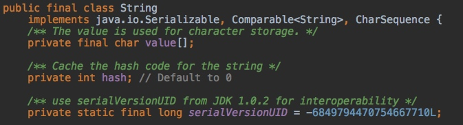
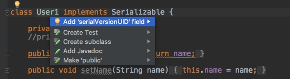
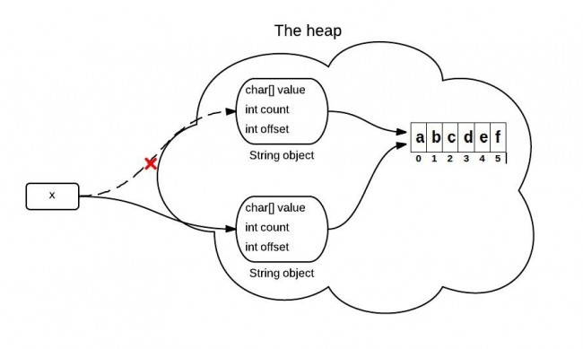
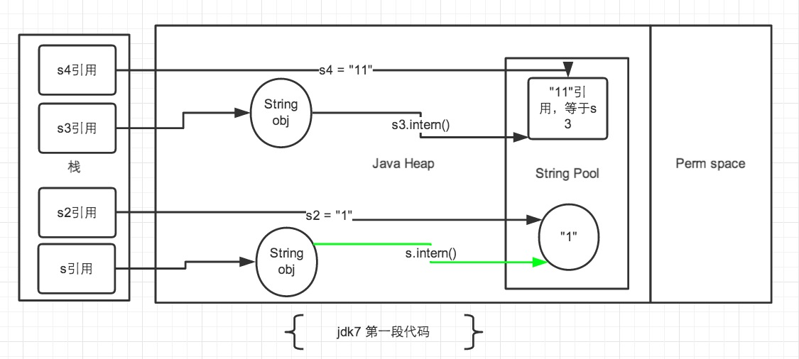

# java基础

## 面向对象三大特征

#### 1. 封装

> 封装是指把一个对象的状态信息（也就是属性）隐藏在对象内部，不允许外部对象直接访问对象的内部信息。但是可以提供一些可以被外界访问的方法来操作属性。

#### 2. 继承

> [**通过使用继承，可以快速地创建新的类，可以提高代码的重用，程序的可维护性，节省大量创建新类的时间**]() ，提高我们的开发效率。

子类拥有父类对象所有的属性和方法（包括私有属性和私有方法），[但是父类中的私有属性和方法子类是无法访问，**只是拥有**]()。

#### 3. 多态

> 父类的引用指向子类的实例。

例如：

```java
Person p=new Docter("zhangsan");
```

## 什么是JDK什么是JRE

**什么是字节码?采用字节码的好处是什么?**

> 在 Java 中，JVM 可以理解的代码就叫做`字节码`（即扩展名为 `.class` 的文件）
>
> Java 程序无须重新编译便可在多种不同操作系统的计算机上运行。

我们需要格外注意的是 .class -> 机器码 这一步。在这一步 JVM 类加载器首先加载字节码文件，然后通过解释器逐行解释执行，这种方式的执行速度会相对比较慢。而且，有些方法和代码块是经常需要被调用的(也就是所谓的热点代码).

所以后面引进了 JIT 编译器，而 JIT 属于运行时编译。当 JIT 编译器完成第一次编译后，其会将字节码对应的机器码保存下来，下次可以直接使用。而我们知道，机器码的运行效率肯定是高于 Java 解释器的。

这也解释了我们为什么经常会说 Java 是编译与解释共存的语言。

####  JDK 和 JRE

> JDK 是 Java Development Kit 缩写，它是功能齐全的 Java SDK。它拥有 JRE 所拥有的一切，还有[**编译器（javac）和工具（如 javadoc 和 jdb）**]()。它能够创建和编译程序。

> JRE 是 Java 运行时环境。它是运行已编译 Java 程序所需的所有内容的集合，包括 Java 虚拟机（JVM），Java 类库，java 命令和其他的一些基础构件。但是，它[**不能用于创建新程序**]()。

## Oracle JDK 和 OpenJDK 的对比

1. OpenJDK 是一个参考模型并且是完全开源的，而 Oracle JDK 是 OpenJDK 的一个实现，并不是完全开源的；
2. Oracle JDK 比 OpenJDK 更稳定。OpenJDK 和 Oracle JDK 的代码几乎相同，但 [**Oracle JDK 有更多的类和一些错误修复。**]()
3. 在响应性和 JVM **性能方面**，Oracle JDK 与 OpenJDK 相比提供了更好的性能；

## Java 和 C++的区别?

- 都是面向对象的语言，都支持封装、继承和多态

- Java **不提供指针来直接访问内存**，程序内存更加安全

- Java 的类是**单继承**的，C++ 支持多重继承；虽然 Java 的类不可以多继承，但是接口可以多继承。

- Java 有自动内存管理**垃圾回收**机制(GC)，不需要程序员手动释放无用内存

- **在 C 语言中，字符串或字符数组最后都会有一个额外的字符`'\0'`来表示结束。但是，Java 语言中没有结束符这一概念。** 

  > String类里面有方法length()可以确定字符串的长度，有直接的大小可以判断字符串的边界。

## 面向对象和面向过程的区别

- **面向过程** ：[**面向过程性能比面向对象高。**]() 因为类调用时需要实例化，开销比较大，比较消耗资源，所以当性能是最重要的考量因素的时候，比如单片机、嵌入式开发、Linux/Unix 等一般采用面向过程开发。
- **面向对象** ：[**面向对象易维护、易复用、易扩展。**]() 因为面向对象有封装、继承、多态性的特性，所以可以设计出低耦合的系统，使系统更加灵活、更加易于维护。

> Java 性能差的主要原因并不是因为它是面向对象语言，而是 Java 是半编译语言，最终的执行代码并不是可以直接被 CPU 执行的二进制机械码。
>
> 面向过程语言大多都是直接编译成机械码在电脑上执行，并且其它一些面向过程的脚本语言性能也并不一定比 Java 好。

## Java 中的基本数据类型

Java**中**有 8 种基本数据类型，分别为：

1. 6 种数字类型 ：byte、short、int、long、float、double
2. 1 种字符类型：char
3. 1 种布尔型：boolean

| 基本类型 | 位数 | 字节 | 默认值  |
| -------- | ---- | ---- | ------- |
| int      | 32   | 4    | 0       |
| short    | 16   | 2    | 0       |
| long     | 64   | 8    | 0L      |
| byte     | 8    | 1    | 0       |
| char     | 16   | 2    | 'u0000' |
| float    | 32   | 4    | 0f      |
| double   | 64   | 8    | 0d      |
| boolean  | 1    |      | false   |

对于 boolean，官方文档未明确定义，它依赖于 JVM 厂商的具体实现。逻辑上理解是占用 1 位，但是实际中会考虑计算机高效存储因素。

## ==和 equals 的区别

**`==`** : 它的作用是判断两个对象的地址是不是相等。即判断两个对象是不是同一个对象。

[(**基本数据类型==比较的是值，引用数据类型==比较的是内存地址**)]()

> 因为 Java 只有值传递，所以，对于 == 来说，不管是比较基本数据类型，还是引用数据类型的变量，其本质比较的都是值，只是引用类型变量存的值是对象的地址。

**`equals()`** : 它的作用也是判断两个对象是否相等，它不能用于比较基本数据类型的变量。

`Object`类`equals()`方法：

```java
public boolean equals(Object obj) {
     return (this == obj);
}
```

`equals()` 方法存在两种使用情况：

- 情况 1：类没有覆盖 `equals()`方法。则通过`equals()`比较该类的两个对象时，等价于通过“==”比较这两个对象。使用的默认是 `Object`类`equals()`方法。
- 情况 2：类覆盖了 `equals()`方法。一般，我们都覆盖 `equals()`方法来两个对象的内容相等；若它们的内容相等，则返回 true(即，认为这两个对象相等)。

## hashCode()与 equals()

### 1.hashCode()介绍

`hashCode()` 的作用是获取哈希码。 `Object` 的 hashcode 方法是本地方法，用 c 语言或 c++ 实现，将[对象的内存地址]()返回。

```java
public native int hashCode();
```

### 2.为什么要有 hashCode？

[**hashCode()效率是比equals()效率高的。**]()
HashSet判断元素是否相等时先用hashCode()判断，如果hashCode()不同，则对象不等，如果hashCode()相同，再比较equals() ，大大提高了效率。所以我们要保证如果重写了equals()，也要重写hashCode()。

### 3.为什么重写 `equals` 时必须重写 `hashCode` 方法？

hashCode：是一个native方法，返回的是对象的内存地址，

equals：对于基本数据类型，==比较的是两个变量的值。对于引用对象，==比较的是两个对象的地址。

接下来我们看下hashCode的注释

```
1.在 Java 应用程序执行期间，在对同一对象多次调用 hashCode 方法时，必须一致地返回相同的整数。
2.如果根据 equals(Object) 方法，两个对象是相等的，那么对这两个对象中的每个对象调用 hashCode 方法都必须生成相同的整数结果。    
3.如果根据 equals(java.lang.Object) 方法，两个对象不相等，那么两个对象不一定必须产生不同的整数结果。但是，程序员应该意识到，为不相等的对象生成不同整数结果可以提高哈希表的性能。
```

即

> equals()相等的两个对象，hashcode()一定相等；
> equals()不相等的两个对象，hashcode()有可能相等。
> hashcode()不等，一定能推出equals()也不等；
> hashcode()相等，equals()可能相等，也可能不等。

如果只重写了equals方法，而不重写hashcode的方法:

> 在Java中的一些容器中，不允许有两个完全相同的对象，插入的时候，如果判断相同则会进行覆盖。
>
> 这时候如果只重写了equals（）的方法，而不重写hashcode的方法，这时候就有可能因为没有重写hashcode方法，造成相同的对象散列到不同的位置而造成对象不能覆盖的问题。

如果只重写了hashcode方法，而不重写equals也是一个道理。（equals判断同一个对象但是hashcode判断不是）

### 4.为什么不同的对象hashcode可能相同

因为当输入数据量太大，哈希值却是固定32长度的，这意味着哈希值是一个有限集合，无法建立一对一关系，所以hashcode相等是有可能会发生的。

## 为什么 Java 中只有值传递？

很多程序设计语言（特别是，C++和 Pascal)提供了两种参数传递的方式：值调用和引用调用。

```java
public class Test {

	public static void main(String[] args) {
		// TODO Auto-generated method stub
		Student s1 = new Student("小张");
		Student s2 = new Student("小李");
		Test.swap(s1, s2);
		System.out.println("s1:" + s1.getName());
		System.out.println("s2:" + s2.getName());
	}

	public static void swap(Student x, Student y) {
		Student temp = x;
		x = y;
		y = temp;
		System.out.println("x:" + x.getName());
		System.out.println("y:" + y.getName());
	}
}
```

**结果：**

```
x:小李
y:小张
s1:小张
s2:小李
```

**解析：**

交换之前：

[](https://camo.githubusercontent.com/513c21abd7aa74f29610968795fac651c43118d0e3a9e74328b52759ca31059f/687474703a2f2f6d792d626c6f672d746f2d7573652e6f73732d636e2d6265696a696e672e616c6979756e63732e636f6d2f31382d392d32372f38383732393831382e6a7067)

交换之后：

[](https://camo.githubusercontent.com/8daaeed5b14a5233a93555d30964edbabec994f347a1bf120c3bfb4423df397d/687474703a2f2f6d792d626c6f672d746f2d7573652e6f73732d636e2d6265696a696e672e616c6979756e63732e636f6d2f31382d392d32372f33343338343431342e6a7067)

通过上面两张图可以很清晰的看出： 方法并没有改变存储在变量 s1 和 s2 中的对象引用。swap 方法的参数 x 和 y 被初始化为两个对象引用的拷贝，这个方法交换的是这两个拷贝

> **总结**

Java 程序设计语言对对象采用的不是引用调用，实际上，对象引用是按值传递的。

下面再总结一下 Java 中方法参数的使用情况：

- 一个方法不能修改一个基本数据类型的参数（即数值型或布尔型）。
- 一个方法可以改变一个对象参数的状态。
- 一个方法不能让对象参数引用一个新的对象。

## 重载和重写的区别

> 重载就是同样的一个方法能够根据输入数据的不同，做出不同的处理
>
> 重写就是当子类覆盖父类方法

## 深拷贝 vs 浅拷贝

> 1. **浅拷贝**：对基本数据类型进行值传递，对引用数据类型进行引用传递般的拷贝，此为浅拷贝。
> 2. **深拷贝**：对基本数据类型进行值传递，对引用数据类型，创建一个新的对象，并复制其内容，此为深拷贝。


## String StringBuffer 和 StringBuilder 的区别

**可变性**

`private final char value[]`，`String` 对象是不可变的。

> 在 Java 9 之后，String 、`StringBuilder` 与 `StringBuffer` 的实现改用 byte 数组存储字符串 `private final byte[] value`

而 `StringBuilder` 与 `StringBuffer` 都继承自 `AbstractStringBuilder` 类，在 `AbstractStringBuilder` 中也是使用字符数组保存字符串`char[] value` 但是没有用 `final` 关键字修饰，所以这两种对象都是可变的。

**线程安全性**

`String` 中的对象是不可变的，也就可以理解为常量，线程安全。

`StringBuffer` 对方法加了同步锁或者对调用的方法加了同步锁，所以是线程安全的。

`StringBuilder` 并没有对方法进行加同步锁，所以是非线程安全的。

**性能**

每次对 `String` 类型进行改变的时候，都会生成一个新的 `String` 对象，然后将指针指向新的 `String` 对象。

`StringBuffer` 每次都会对 `StringBuffer` 对象本身进行操作，而不是生成新的对象并改变对象引用。

相同情况下使用 `StringBuilder` 相比使用 `StringBuffer` 仅能获得 10%~15% 左右的性能提升，但却要冒多线程不安全的风险。

**对于三者使用的总结：**

1. 操作少量的数据: 适用 `String`
2. 单线程操作字符串缓冲区下操作大量数据: 适用 `StringBuilder`
3. 多线程操作字符串缓冲区下操作大量数据: 适用 `StringBuffer`

## 获取用键盘输入常用的两种方法

方法 1：通过 Scanner

```java
Scanner input = new Scanner(System.in);
String s  = input.nextLine();
input.close();
```

方法 2：通过 BufferedReader

```java
BufferedReader input = new BufferedReader(new InputStreamReader(System.in));
String s = input.readLine();
```

## Java 的流式处理

### Stream介绍

Stream API可以极大提高Java程序员的生产力，**让程序员写出高效率、干净、简洁的代码**。

> 将要处理的元素集合看作一种流，流在管道中传输，并且可以在管道的节点上进行处理，比如筛选，排序，聚合等。
>

Stream有以下特性及优点：

- **无存储**。Stream不是一种数据结构，它只是某种数据源的一个视图，数据源可以是一个数组，Java容器或I/O channel等。
- **为函数式编程而生。**对Stream的任何修改都不会修改背后的数据源，比如对Stream执行过滤操作并不会删除被过滤的元素，而是会产生一个不包含被过滤元素的新Stream。
- **惰式执行**。Stream上的操作并不会立即执行，只有等到用户真正需要结果的时候才会执行。
- **可消费性**。Stream只能被“消费”一次，一旦遍历过就会失效，就像容器的迭代器那样，想要再次遍历必须重新生成。

我们举一个例子，来看一下到底Stream可以做什么事情：



如上图，对于流的处理，主要有三种关键性操作：分别是流的创建、中间操作（intermediate operation）以及最终操作(terminal operation)。

### Stream的创建

**1、通过已有的集合来创建流**

```java
List<String> strings = Arrays.asList("Hollis", "HollisChuang", "hollis", "Hello", "HelloWorld", "Hollis");
Stream<String> stream = strings.stream();
```

**2、通过Stream创建流**

```java
Stream<String> stream = Stream.of("Hollis", "HollisChuang", "hollis", "Hello", "HelloWorld", "Hollis");
```

### Stream中间操作

Stream有很多中间操作，多个中间操作可以连接起来形成一个流水线，每一个中间操作就像流水线上的一个工人，每个工人都可以对流进行加工，加工后得到的结果还是一个流。


以下是常用的中间操作列表:


**filter**

> 返回表达式为true的元素

```java
List<String> strings = Arrays.asList("Hollis", "", "HollisChuang", "H", "hollis");
strings.stream().filter(string -> !string.isEmpty()).forEach(System.out::println);
//Hollis,HollisChuang, H, hollis
```

**map**

```java
List<Integer> numbers = Arrays.asList(3, 2, 2, 3, 7, 3, 5);
numbers.stream().map( i -> i*i).forEach(System.out::println);
//9,4,4,9,49,9,25
```

**limit/skip**

limit 返回 Stream 的前面 n 个元素；skip 则是扔掉前 n 个元素。以下代码片段使用 limit 方法保理4个元素：

```java
List<Integer> numbers = Arrays.asList(3, 2, 2, 3, 7, 3, 5);
numbers.stream().limit(4).forEach(System.out::println);
//3,2,2,3
```

**sorted**

```java
List<Integer> numbers = Arrays.asList(3, 2, 2, 3, 7, 3, 5);
numbers.stream().sorted().forEach(System.out::println);
//2,2,3,3,3,5,7
```

**distinct**

```java
List<Integer> numbers = Arrays.asList(3, 2, 2, 3, 7, 3, 5);
numbers.stream().distinct().forEach(System.out::println);
//3,2,7,5
```

接下来我们通过一个例子和一张图，来演示下，当一个Stream先后通过filter、map、sort、limit以及distinct处理后会发生什么。

代码如下：

```java
List<String> strings = Arrays.asList("Hollis", "HollisChuang", "hollis", "Hello", "HelloWorld", "Hollis");
Stream s = strings.stream().filter(string -> string.length()<= 6).map(String::length).sorted().limit(3).distinct();
```


### Stream最终操作

Stream的中间操作得到的结果还是一个Stream，那么如何把一个Stream转换成我们需要的类型呢？比如计算出流中元素的个数、将流装换成集合等。这就需要最终操作（terminal operation）

最终操作会消耗流，产生一个最终结果。也就是说，在最终操作之后，不能再次使用流，也不能在使用任何中间操作，否则将抛出异常：

```java
java.lang.IllegalStateException: stream has already been operated upon or closed
```

常用的最终操作如下图：


**forEach**

```java
Random random = new Random();
random.ints().limit(10).forEach(System.out::println);
```

**count**

```java
List<String> strings = Arrays.asList("Hollis", "HollisChuang", "hollis","Hollis666", "Hello", "HelloWorld", "Hollis");
System.out.println(strings.stream().count());
//7
```

**collect**

```java
List<String> strings = Arrays.asList("Hollis", "HollisChuang", "hollis","Hollis666", "Hello", "HelloWorld", "Hollis");
strings  = strings.stream().filter(string -> string.startsWith("Hollis")).collect(Collectors.toList());
System.out.println(strings);
//Hollis, HollisChuang, Hollis666, Hollis
```

接下来，我们还是使用一张图，来演示下，前文的例子中，当一个Stream先后通过filter、map、sort、limit以及distinct处理后会，在分别使用不同的最终操作可以得到怎样的结果：

## JDK新特性

### jdk9新特性

#### 1、集合加强

jdk9为所有集合（List/Set/Map）都增加了of和copyOf方法，用来[创建不可变集合]()，即一旦创建就无法再执行添加、删除、替换、排序等操作，否则将报java.lang.UnsupportedOperationException异常。

> 一般在特定场景下用还是可以的，不过如果引用了guava库的话推荐还是使用guava吧hhhh

```java
List strs = List.of("Hello", "World");
 
List strsCopy = List. copyOf(strs);
 
Set strs = Set.of("Hello", "World");
 
Map maps = Map.of("Hello", 1, "World", 2);
```

#### 2、私有接口方法

jdk8提供了接口的默认方法（default）和静态方法，打破了之前接口只能定义方法而不能存在行为。

**[jdk9则是允许接口定义私有方法，私有方法可以作为通用方法放在默认方法中调用]()**

#### 3、垃圾收集机制

**[jdk9把G1作为默认的垃圾收集器实现，替换了jdk7和jdk8的默认垃圾收集器实现：Parallel Scavenge（新生代）+Parallel Old（老年代）。]()**

#### 4、I/O流加强

java.io.InputStream 中增加了新的方法来读取和复制 InputStream 中包含的数据：

readAllBytes：读取 InputStream 中的所有剩余字节

readNBytes： 从 InputStream 中读取指定数量的字节到数组中

transferTo：读取 InputStream 中的全部字节并写入到指定的 OutputStream 中 

#### 5、JShell工具

jdk9引入了jshell这个交互性工具，让Java也可以像脚本语言一样来运行，可以从控制台启动 jshell ，在 jshell 中直接输入表达式并查看其执行结果。**[当需要测试一个方法的运行效果，或是快速的对表达式进行求值时]()**，jshell 都非常实用。

### jdk10新特性

#### 1、局部变量类型推断

局部变量类型推断可以说是jdk10中最值得注意的特性，这是Java语言开发人员为了简化Java应用程序的编写而采取的又一步，举个例子：

原先我们需要这么定义一个list

List<String> list = new ArrayList<>();
使用局部类型推断var关键词定义

var list = new ArrayList<String>();
不过局部变量类型推断仅仅适用在：

> 有初始化值的局部变量
>
> 增强 for 循环中的索引
>
> 传统 for 循环中声明的局部变量

Oracle 的 Java 团队申明，以下不支持局部变量类型推断：

> 方法参数
>
> 构造函数参数
>
> 方法返回类型
>
> 字段
>
> catch 代码块（或任何其他类型的变量声明）

#### 2、线程本地握手

jdk10将引入一种在线程上执行回调的新方法，因此这[将会很方便能停止单个线程而不是停止全部线程或者一个都不停。]()

#### 3、GC改进和内存管理

jdk10中有2个JEP专门用于改进当前的垃圾收集元素。

第一个垃圾收集器接口是（JEP 304），它将引入一个纯净的垃圾收集器接口以帮助改进不同垃圾收集器的源代码隔离。

预定用于Java 10的第二个JEP是针对G1的并行完全GC（JEP 307），其重点在于通过完全GC并行来改善G1最坏情况的等待时间。G1是Java 9中的默认GC，并且此JEP的目标是使G1平行。

 

### jdk11新特性

#### 1、字符串加强

```java
// 判断字符串是否为空白
" ".isBlank(); // true
// 去除首尾空格
" Javastack ".strip(); // "Javastack"
// 去除尾部空格 
" Javastack ".stripTrailing(); 
// 去除首部空格 
" Javastack ".stripLeading(); // "Javastack "
// 复制字符串
"Java".repeat(3); // "JavaJavaJava"
// 行数统计
"A\nB\nC".lines().count(); // 3
```

#### 2、HttClient Api

这是 Java 9 开始引入的一个处理 HTTP 请求的的孵化 HTTP Client API，该 API 支持同步和异步，而在 Java 11 中已经为正式可用状态，你可以在java.net包中找到这个 Api

#### 3、用于 Lambda 参数的局部变量语法

用于 Lambda 参数的局部变量语法简单来说就是支持类型推导：

```java
var x = new A();

for (var x : xs) { ... }

try (var x = ...) { ... } catch ...
```

#### 4、ZGC

从JDK 9开始，JDK使用G1作为默认的垃圾回收器。G1可以说是GC的一个里程碑，G1之前的GC回收，还是基于固定的内存区域，而G1采用了一种“细粒度”的内存管理策略，不在固定的区分内存区域属于surviors、eden、old，而我们不需要再去对于年轻代使用一种回收策略，老年代使用一种回收策略，取而代之的是一种整体的内存回收策略。这种回收策略在我们当下cpu、内存、服务规模都越来越大的情况下提供了更好的表现，而这一代ZGC更是有了突破性的进步。

从原理上来理解，[ZGC可以看做是G1之上更细粒度的内存管理策略。]()

由于内存的不断分配回收会产生大量的内存碎片空间，因此需要整理策略防止内存空间碎片化，在整理期间需要将对于内存引用的线程逻辑暂停，这个过程被称为"Stop the world"。只有当整理完成后，线程逻辑才可以继续运行，一般而言，主要有如下几种方式优化"Stop the world"：

> 使用多个线程同时回收（并行回收）
> 回收过程分为多次停顿（增量回收）
> 在程序运行期间回收，不需要停顿或只停顿很短时间（并发回收）
> 只回收内存而不整理内存

ZGC主要采用的是并发回收的策略，相较于G1 ZGC最主要的提升是使用Load Barrier技术实现，引用R大对于ZGC的评价：

与标记对象的传统算法相比，ZGC在指针上做标记，在访问指针时加入Load Barrier（读屏障），比如当对象正被GC移动，指针上的颜色就会不对，这个屏障就会先把指针更新为有效地址再返回，也就是，[永远只有单个对象读取时有概率被减速，而不存在为了保持应用与GC一致而粗暴整体的Stop The World。]()

 

### jdk12新特性

#### 1、Switch Expressions

这是一个为开发者准备的特性，我们可以利用具体代码快速了解一下，下面是传统 statement 形式的 switch 语法：

switch (day) {
case MONDAY:
case FRIDAY:
case SUNDAY:
System.out.println(6);
break;
case TUESDAY:
System.out.println(7);
break;
case THURSDAY:
case SATURDAY:
System.out.println(8);
break;
case WEDNESDAY:
System.out.println(9);
break;
}
如果有编码经验，你一定知道，switch 语句如果漏写了一个 break，那么逻辑往往就跑偏了，这种方式既繁琐，又容易出错。如果换成 switch 表达式，Pattern Matching 机制能够自然地保证只有单一路径会被执行，请看下面的代码示例：

switch (day) {
case MONDAY, FRIDAY, SUNDAY -> System.out.println(6);
case TUESDAY -> System.out.println(7);
case THURSDAY, SATURDAY -> System.out.println(8);
case WEDNESDAY -> System.out.println(9);
}
更进一步，下面的表达式，为我们提供了优雅地表达特定场合计算逻辑的方式

int numLetters = switch (day) {
case MONDAY, FRIDAY, SUNDAY -> 6;
case TUESDAY -> 7;
case THURSDAY, SATURDAY -> 8;
case WEDNESDAY -> 9;
};
Switch Expressions 或者说起相关的 Pattern Matching 特性，为我们提供了勾勒出了 Java 语法进化的一个趋势，将开发者从复杂繁琐的低层次抽象中逐渐解放出来，以更高层次更优雅的抽象，既降低代码量，又避免意外编程错误的出现，进而提高代码质量和开发效率。

#### 2、Shenandoah GC

新增了一个名为 Shenandoah 的 GC 算法，通过与正在运行的 Java 线程同时进行 evacuation 工作来减少 GC 暂停时间。使用 Shenandoah 的暂停时间与堆大小无关，这意味着无论堆是 200 MB 还是 200 GB，都将具有相同的暂停时间。

JDK13新特性
JDK13于9月17日正式发布。目前该版本包含的特性已经全部固定，主要包含以下五个：


下面来逐一介绍下这五个重要的特性。

Dynamic CDS Archives

这一特性是在JEP310：Application Class-Data Sharing基础上扩展而来的，Dynamic CDS Archives中的CDS指的就是Class-Data Sharing。

那么，这个JEP310是个啥东西呢？

我们知道在同一个物理机／虚拟机上启动多个JVM时，如果每个虚拟机都单独装载自己需要的所有类，启动成本和内存占用是比较高的。所以Java团队引入了CDS的概念，通过把一些核心类在每个JVM间共享，每个JVM只需要装载自己的应用类，启动时间减少了，另外核心类是共享的，所以JVM的内存占用也减少了。

CDS 只能作用于 Boot Class Loader 加载的类，不能作用于 App Class Loader 或者自定义的 Class Loader 加载的类。

在 Java 10 中，则将 CDS 扩展为 AppCDS，顾名思义，AppCDS 不止能够作用于 Boot Class Loader了，App Class Loader 和自定义的 Class Loader 也都能够起作用，大大加大了 CDS 的适用范围。也就说开发自定义的类也可以装载给多个JVM共享了。

Java 10中包含的JEP310的通过跨不同Java进程共享公共类元数据来减少了内存占用和改进了启动时间。

但是，JEP310中，使用AppCDS的过程还是比较复杂的，需要有三个步骤：

这一次的JDK 13中的JEP 350 ，在JEP310的基础上，又做了一些扩展。允许在Java应用程序执行结束时动态归档类，归档类将包括默认的基础层 CDS（class data-sharing）存档中不存在的所有已加载的应用程序类和库类。

也就是说，在Java 13中再使用AppCDS的时候，就不在需要这么复杂了。

ZGC: Uncommit Unused Memory

在讨论这个问题之前，想先问一个问题，JVM的GC释放的内存会还给操作系统吗？

GC后的内存如何处置，其实是取决于不同的垃圾回收器的。因为把内存还给OS，意味着要调整JVM的堆大小，这个过程是比较耗费资源的。

在JDK 11中，Java引入了ZGC，这是一款可伸缩的低延迟垃圾收集器，但是当时只是实验性的。并且，ZGC释放的内存是不会还给操作系统的。


而在Java 13中，JEP 351再次对ZGC做了增强，本次 ZGC 可以将未使用的堆内存返回给操作系统。之所以引入这个特性，是因为如今有很多场景中内存是比较昂贵的资源，在以下情况中，将内存还给操作系统还是很有必要的：

1、那些需要根据使用量付费的容器

2、应用程序可能长时间处于空闲状态并与许多其他应用程序共享或竞争资源的环境。

3、应用程序在执行期间可能有非常不同的堆空间需求。例如，启动期间所需的堆可能大于稍后在稳定状态执行期间所需的堆。

Reimplement the Legacy Socket API

使用易于维护和调试的更简单、更现代的实现替换 java.net.Socket 和 java.net.ServerSocket API。

java.net.Socket和java.net.ServerSocket的实现非常古老，这个JEP为它们引入了一个现代的实现。现代实现是Java 13中的默认实现，但是旧的实现还没有删除，可以通过设置系统属性jdk.net.usePlainSocketImpl来使用它们。

运行一个实例化Socket和ServerSocket的类将显示这个调试输出。这是默认的(新的).


上面输出的sun.nio.ch.NioSocketImpl就是新提供的实现。

如果使用旧的实现也是可以的（指定参数jdk.net.usePlainSocketImpl）：


上面的结果中，旧的实现java.net.PlainSocketImpl被用到了。

Switch Expressions (Preview)

在JDK 12中引入了Switch表达式作为预览特性。JEP 354修改了这个特性，它引入了yield语句，用于返回值。这意味着，switch表达式(返回值)应该使用yield, switch语句(不返回值)应该使用break。

在以前，我们想要在switch中返回内容，还是比较麻烦的，一般语法如下：


在JDK13中使用以下语法：


或者

在这之后，switch中就多了一个关键字用于跳出switch块了，那就是yield，他用于返回一个值。和return的区别在于：return会直接跳出当前循环或者方法，而yield只会跳出当前switch块。

Text Blocks (Preview)

在JDK 12中引入了Raw String Literals特性，但在发布之前就放弃了。这个JEP在引入多行字符串文字（text block）在意义上是类似的。

text block，文本块，是一个多行字符串文字，它避免了对大多数转义序列的需要，以可预测的方式自动格式化字符串，并在需要时让开发人员控制格式。

我们以前从外部copy一段文本串到Java中，会被自动转义，如有一段以下字符串：


将其复制到Java的字符串中，会展示成以下内容：


使用“”“作为文本块的开始符合结束符，在其中就可以放置多行的字符串，不需要进行任何转义。看起来就十分清爽了。

如常见的SQL语句：


看起来就比较直观，清爽了。

 

JDK13中包含的5个特性，能够改变开发者的编码风格的主要有Text Blocks和Switch Expressions两个新特性，但是这两个特性还处于预览阶段。

而且，JDK13并不是LTS（长期支持）版本，如果你正在使用Java 8（LTS）或者Java 11（LTS），暂时可以不必升级到Java 13.

# 关键字

## Java中各种关键字

### transient

在关于java的集合类的学习中，我们发现`ArrayList`类和`Vector`类都是使用数组实现的，但是在定义数组`elementData`这个属性时稍有不同，那就是`ArrayList`使用`transient`关键字

```java
private transient Object[] elementData;  

protected Object[] elementData;
```

那么，首先我们来看一下**transient**关键字的作用是什么。

> 简单点说，就是被transient修饰的成员变量，在序列化的时候其值会被忽略，在被反序列化后， transient 变量的值被设为初始值， 如 int 型的是 0，对象型的是 null。
>

### instanceof

instanceof 是 Java 的一个二元操作符。

instanceof 是 Java 的保留关键字。它的作用是[**测试它左边的对象是否是它右边的类的实例**]()，返回 boolean 的数据类型。

```java
public static void displayObjectClass(Object o) {
  if (o instanceof Vector)
     System.out.println("对象是 java.util.Vector 类的实例");
  else if (o instanceof ArrayList)
     System.out.println("对象是 java.util.ArrayList 类的实例");
  else
    System.out.println("对象是 " + o.getClass() + " 类的实例");
}
```

### volatile

#### volatile的用法

和`synchronized`不同，`volatile`是一个变量修饰符，只能用来修饰变量。无法修饰方法及代码块等。

```java
public class Singleton {  
    private volatile static Singleton singleton;  
    private Singleton (){}  
  
    public static Singleton getSingleton() {  
    if (singleton == null) {  
        synchronized (Singleton.class) {  
        if (singleton == null) {  
            singleton = new Singleton();  
        }  
        }  
    }  
    return singleton;  
    }  
}
```

#### volatile的原理

为了提高处理器的执行速度，在处理器和内存之间增加了多级缓存来提升。但是由于引入了多级缓存，就存在缓存数据不一致问题。

但是，对于`volatile`变量，当对`volatile`变量进行写操作的时候，JVM会向处理器发送一条lock前缀的指令，将这个缓存中的变量回写到系统主存中。

但是就算写回到内存，如果其他处理器缓存的值还是旧的，再执行计算操作就会有问题，所以在多处理器下，为了保证各个处理器的缓存是一致的，就会实现`缓存一致性协议`

**缓存一致性协议**：每个处理器通过嗅探在总线上传播的数据来检查自己缓存的值是不是过期了，当处理器发现自己缓存行对应的内存地址被修改，就会将当前处理器的缓存行设置成无效状态，当处理器要对这个数据进行修改操作的时候，会强制重新从系统内存里把数据读到处理器缓存里。

所以，如果一个变量被`volatile`所修饰的话，在每次数据变化之后，其值都会被强制刷入主存。而其他处理器的缓存由于遵守了缓存一致性协议，也会把这个变量的值从主存加载到自己的缓存中。这就保证了一个`volatile`在并发编程中，其值在多个缓存中是可见的。

#### volatile与可见性

> Java中的`volatile`关键字提供了一个功能，那就是被其修饰的变量在被修改后可以立即同步到主内存，被其修饰的变量在每次使用之前都从主内存刷新。因此，可以使用`volatile`来保证多线程操作时变量的可见性。

#### volatile与有序性

`volatile`除了可以保证数据的可见性之外，还有一个强大的功能，那就是他**可以禁止指令重排优化**等。

volatile可以禁止指令重排，这就保证了代码的程序会严格按照代码的先后顺序执行。这就保证了有序性。被`volatile`修饰的变量的操作，会严格按照代码顺序执行，`load->add->save` 的执行顺序就是：load、add、save。

#### volatile与原子性

原子性是指一个操作是不可中断的，要全部执行完成，要不就都不执行。

线程是CPU调度的基本单位。CPU有时间片的概念，会根据不同的调度算法进行线程调度。当一个线程获得时间片之后开始执行，在时间片耗尽之后，就会失去CPU使用权。所以在多线程场景下，由于时间片在线程间轮换，就会发生原子性问题。

[**为了保证原子性，需要通过字节码指令`monitorenter`和`monitorexit`**]()，但是`volatile`和这两个指令之间是没有任何关系的。

**所以，`volatile`是不能保证原子性的。**

在以下两个场景中可以使用`volatile`来代替`synchronized`：

> 1、运算结果并不依赖变量的当前值，或者能够确保只有单一的线程会修改变量的值。
>
> 2、变量不需要与其他状态变量共同参与不变约束。

除以上场景外，都需要使用其他方式来保证原子性，如`synchronized`或者`concurrent包`。

我们来看一下volatile和原子性的例子：

```java
public class Test {
    public volatile int inc = 0;

    public void increase() {
        inc++;
    }

    public static void main(String[] args) {
        final Test test = new Test();
        for(int i=0;i<10;i++){
            new Thread(){
                public void run() {
                    for(int j=0;j<1000;j++)
                        test.increase();
                };
            }.start();
        }

        while(Thread.activeCount()>1)  //保证前面的线程都执行完
            Thread.yield();
        System.out.println(test.inc);
    }
}
```

以上代码比较简单，就是创建10个线程，然后分别执行1000次`i++`操作。正常情况下，程序的输出结果应该是10000，但是，多次执行的结果都小于10000。这其实就是`volatile`无法满足原子性的原因。

为什么会出现这种情况呢，那就是因为虽然volatile可以保证`inc`在多个线程之间的可见性。[**但是无法`inc++`的原子性**]()。

### synchronized

#### synchronized的实现原理

`synchronized`，是Java中用于解决并发情况下数据同步访问的一个很重要的关键字。**当我们想要保证一个共享资源在同一时间只会被一个线程访问到时**，我们可以在代码中使用`synchronized`关键字对类或者对象加锁。

我们对上面的代码进行反编译，可以得到如下代码：

```java
public synchronized void doSth();
    descriptor: ()V
    flags: ACC_PUBLIC, ACC_SYNCHRONIZED
    Code:
      stack=2, locals=1, args_size=1
         0: getstatic     #2                  // Field java/lang/System.out:Ljava/io/PrintStream;
         3: ldc           #3                  // String Hello World
         5: invokevirtual #4                  // Method java/io/PrintStream.println:(Ljava/lang/String;)V
         8: return

  public void doSth1();
    descriptor: ()V
    flags: ACC_PUBLIC
    Code:
      stack=2, locals=3, args_size=1
         0: ldc           #5                  // class com/hollis/SynchronizedTest
         2: dup
         3: astore_1
         4: monitorenter
         5: getstatic     #2                  // Field java/lang/System.out:Ljava/io/PrintStream;
         8: ldc           #3                  // String Hello World
        10: invokevirtual #4                  // Method java/io/PrintStream.println:(Ljava/lang/String;)V
        13: aload_1
        14: monitorexit
        15: goto          23
        18: astore_2
        19: aload_1
        20: monitorexit
        21: aload_2
        22: athrow
        23: return
```

通过反编译后代码可以看出：对于同步方法，JVM采用`ACC_SYNCHRONIZED`标记符来实现同步。 对于同步代码块。JVM采用`monitorenter`、`monitorexit`两个指令来实现同步。

无论是`ACC_SYNCHRONIZED`还是`monitorenter`、`monitorexit`都是基于Monitor实现的，[**在Java虚拟机(HotSpot)中，Monitor是基于C++实现的，由ObjectMonitor实现**]()。

ObjectMonitor类中提供了几个方法，如`enter`、`exit`、`wait`、`notify`、`notifyAll`等。`sychronized`加锁的时候，会调用objectMonitor的enter方法，解锁的时候会调用exit方法。

#### synchronized与原子性

在Java中，为了保证原子性，提供了两个高级的字节码指令`monitorenter`和`monitorexit`。

通过`monitorenter`和`monitorexit`指令，可以保证被`synchronized`修饰的代码在同一时间只能被一个线程访问，在锁未释放之前，无法被其他线程访问到。因此，在Java中可以使用`synchronized`来保证方法和代码块内的操作是原子性的。

> 线程1在执行`monitorenter`指令的时候，会对Monitor进行加锁，加锁后其他线程无法获得锁，除非线程1主动解锁。即使在执行过程中，由于某种原因，比如CPU时间片用完，线程1放弃了CPU，但是，他并没有进行解锁。而由于`synchronized`的锁是可重入的，下一个时间片还是只能被他自己获取到，还是会继续执行代码。直到所有代码执行完。这就保证了原子性。

#### synchronized与可见性

> 前面我们介绍过，被`synchronized`修饰的代码，在开始执行时会加锁，执行完成后会进行解锁。而为了保证可见性，**有一条规则是这样的：对一个变量解锁之前，必须先把此变量同步回主存中。**这样解锁后，后续线程就可以访问到被修改后的值。

#### synchronized与有序性

> 由于`synchronized`修饰的代码，同一时间只能被同一线程访问。那么也就是单线程执行的。所以，可以保证其有序性。
>

#### synchronized与锁优化

`synchronized`其实是借助Monitor实现的，在加锁时会调用objectMonitor的`enter`方法，解锁的时候会调用`exit`方法。事实上，只有在JDK1.6之前，synchronized的实现才会直接调用ObjectMonitor的`enter`和`exit`，这种锁被称之为重量级锁。

### final

final是Java中的一个关键字，它所表示的是“这部分是无法修改的”。

使用 final 可以定义 ：变量、方法、类。

#### final变量

如果将变量设置为final，则不能更改final变量的值(它将是常量)。

```java
class Test{
     final String name = "Hollis";

}
```

#### final方法

如果任何方法声明为final，则不能覆盖它。

```java
class Parent {
    final void name() {
        System.out.println("Hollis");
    }
}
```

当我们定义以上类的子类的时候，无法覆盖其name方法，会编译失败。

#### final类

如果把任何一个类声明为final，则不能继承它。

```java
final class Parent {

}
```

### static

#### 静态变量

我们用static表示变量的级别，一个类中的静态变量，不属于类的对象或者实例。因为静态变量与所有的对象实例共享，因此他们不具线程安全性。

通常，静态变量常用final关键来修饰，表示通用资源或可以被所有的对象所使用。如果静态变量未被私有化，可以用“类名.变量名”的方式来使用。

```java
//static variable example
private static int count;
public static String str;
```

#### 静态方法

与静态变量一样，静态方法是属于类而不是实例。

一个静态方法只能使用静态变量和调用静态方法。通常静态方法通常用于想给其他的类使用而不需要创建实例。

```java
//static method example
public static void setCount(int count) {
    if(count &gt; 0)
    StaticExample.count = count;
}

//static util method
public static int addInts(int i, int...js){
    int sum=i;
    for(int x : js) sum+=x;
    return sum;
}
```

从Java8以上版本开始也可以有接口类型的静态方法了。

#### 静态代码块

Java的静态块是一组指令在类装载的时候在内存中由Java ClassLoader执行。

静态块常用于初始化类的静态变量。大多时候还用于在类装载时候创建静态资源。

Java不允许在静态块中使用非静态变量。一个类中可以有多个静态块，尽管这似乎没有什么用。静态块只在类装载入内存时，执行一次。

```java
static{
    //can be used to initialize resources when class is loaded
    System.out.println(&quot;StaticExample static block&quot;);
    //can access only static variables and methods
    str=&quot;Test&quot;;
    setCount(2);
}
```

#### 静态类

Java可以嵌套使用静态类，但是静态类不能用于嵌套的顶层。

静态嵌套类的使用与其他顶层类一样，嵌套只是为了便于项目打包。

### const

const是Java预留关键字，用于后期扩展用，用法跟final相似，不常用

## 标识符和关键字

在我们编写程序的时候，需要大量地为程序、类、变量、方法等取名字，于是就有了标识符，简单来说，标识符就是一个名字。

但是有一些标识符，Java 语言已经赋予了其特殊的含义，只能用于特定的地方，这种特殊的标识符就是关键字。

## Java 中有哪些常见的关键字

| 访问控制             | private  | protected  | public   |              |            |           |        |
| -------------------- | -------- | ---------- | -------- | ------------ | ---------- | --------- | ------ |
| 类，方法和变量修饰符 | abstract | class      | extends  | final        | implements | interface | native |
|                      | new      | static     | strictfp | synchronized | transient  | volatile  |        |
| 程序控制             | break    | continue   | return   | do           | while      | if        | else   |
|                      | for      | instanceof | switch   | case         | default    |           |        |
| 错误处理             | try      | catch      | throw    | throws       | finally    |           |        |
| 包相关               | import   | package    |          |              |            |           |        |
| 基本类型             | boolean  | byte       | char     | double       | float      | int       | long   |
|                      | short    | null       | true     | false        |            |           |        |
| 变量引用             | super    | this       | void     |              |            |           |        |
| 保留字               | goto     | const      |          |              |            |           |        |

# 反射与代理

## 反射机制

> JAVA 反射机制是在运行状态中，
>
> 对于任意一个类，都能够知道这个类的所有属性和方法；
>
> 对于任意一个对象，都能够调用它的任意一个方法和属性；
>
> [这种动态获取的信息以及动态调用对象的方法的功能](https://mp.weixin.qq.com/s/-IPfWPS1WQMEgcIu0Ak2VQ)称为 java 语言的反射机制。

### 1.反射机制优缺点

- **优点：** 提高代码灵活度。
- **缺点：** 
  1. 性能瓶颈：反射相当于一系列解释操作，通知 JVM 要做的事情，[**性能比直接的 java 代码要慢很多**]()。
  2. 安全问题，让我们可以动态操作改变类的属性,但同时也[**增加了类的安全隐患**]()。

### 2.反射的应用场景

**反射是框架设计的灵魂。**

在我们平时的项目开发过程中，基本上很少会直接使用到反射机制，但这不能说明反射机制没有用，实际上有很多设计、开发都与反射机制有关。

> 例如模块化的开发，通过反射去调用对应的字节码；
>
> [动态代理设计模式也采用了反射机制。](https://mp.weixin.qq.com/s/-IPfWPS1WQMEgcIu0Ak2VQ)
>
> 还有我们日常使用的 [Spring／Hibernate 等框架也大量使用到了反射机制](https://mp.weixin.qq.com/s/-IPfWPS1WQMEgcIu0Ak2VQ)。

举例：

1. 我们在使用 JDBC 连接数据库时使用 `Class.forName()`通过反射加载数据库的驱动程序；
2. Spring 框架的 IOC（动态加载管理 Bean）创建对象以及 AOP（动态代理）功能都和反射有联系；
3. 动态配置实例的属性；

## 静态代理与动态代理

### 静态代理

> **所谓静态代理，就是代理类是由程序员自己编写的，在编译期就确定好了的。**
>
> 需要接口类，目标类，代理类

```java
// 接口类
public interface HelloSerivice {
    public void say();
}

//目标类
public class HelloSeriviceImpl implements HelloSerivice{

    @Override
    public void say() {
        System.out.println("hello world");
    }
}
```

```java
// 代理类
public class HelloSeriviceProxy implements HelloSerivice{

    private HelloSerivice target;
  
    public HelloSeriviceProxy(HelloSerivice target) {
        this.target = target;
    }

    @Override
    public void say() {
        System.out.println("记录日志");
        target.say();
        System.out.println("清理数据");
    }
}
```

```java
public class Main {
    @Test
    public void testProxy(){
        //目标对象
        HelloSerivice target = new HelloSeriviceImpl();
        //代理对象
        HelloSeriviceProxy proxy = new HelloSeriviceProxy(target);
        proxy.say();
    }
}
```

静态代理的用途：

1. **控制真实对象的访问权限** 通过代理对象控制对真实对象的使用权限。

2. **增强真实对象的功能** 

### 动态代理

静态代理存在一些局限性，比如[**使用静态代理模式需要程序员手写很多代码**]()。一旦需要代理的类中方法比较多，或者需要同时代理多个对象的时候，这无疑会增加很大的复杂度。

动态代理中的代理类并不要求在编译期就确定，而是可以在运行期动态生成，从而实现对目标对象的代理功能。反射是动态代理的一种实现方式。

#### 动态代理的几种实现方式

#### Java实现动态代理的大致步骤

1、定义一个委托类和公共接口。

2、自己定义一个类（调用处理器类，即实现 InvocationHandler 接口），这个类的目的是指定运行时将生成的代理类需要完成的具体任务（包括Preprocess和Postprocess），即代理类调用任何方法都会经过这个调用处理器类

3、生成代理对象（当然也会生成代理类），需要为他指定(1)委托对象(2)实现的一系列接口(3)调用处理器类的实例。因此可以看出一个代理对象对应一个委托对象，对应一个调用处理器实例。

#### Java 实现动态代理

`java.lang.reflect.Proxy`: 这是生成代理类的主类，通过 Proxy 类生成的代理类都继承了 Proxy 类，即 DynamicProxyClass extends Proxy。

`java.lang.reflect.InvocationHandler`: 这里称他为"调用处理器"，他是一个接口，我们动态生成的代理类需要完成的具体内容需要自己定义一个类，而这个类必须实现 InvocationHandler 接口。

#### 动态代理实现

```java
public class UserServiceImpl implements UserService {
    @Override
    public void add() {
        System.out.println("--------------------add----------------------");
    }
}
```

##### jdk动态代理

```java
public class MyInvocationHandler implements InvocationHandler {

    private Object target;

    public MyInvocationHandler(Object target) {
        super();
        this.target = target;
    }

    @Override
    public Object invoke(Object proxy, Method method, Object[] args) throws Throwable {
        PerformanceMonior.begin(target.getClass().getName()+"."+method.getName());
        System.out.println("begin "+method.getName()+"");
        Object result = method.invoke(target, args);
        System.out.println("end "+method.getName()+"");
        PerformanceMonior.end();
        return result;
    }

    public Object getProxy(){
        return Proxy.newProxyInstance(Thread.currentThread().getContextClassLoader(), target.getClass().getInterfaces(), this);
    }

}

public static void main(String[] args) {
  UserService service = new UserServiceImpl();
  MyInvocationHandler handler = new MyInvocationHandler(service);
  UserService proxy = (UserService) handler.getProxy();
  proxy.add();
}
```

##### cglib动态代理

```java
public class CglibProxy implements MethodInterceptor{  
  
 private Enhancer enhancer = new Enhancer();  
  
 public Object getProxy(Class clazz){  
  //设置需要创建子类的类  
  enhancer.setSuperclass(clazz);  
  enhancer.setCallback(this);   
  return enhancer.create();  
 }  
 //实现MethodInterceptor接口方法  
 public Object intercept(Object obj, Method method, Object[] args,  
   MethodProxy proxy) throws Throwable {  
   System.out.println("前置代理");  
   Object result = proxy.invokeSuper(obj, args);  
   System.out.println("后置代理");  
   return result;  
  }  
}  

public class DoCGLib {  
 public static void main(String[] args) {  
  CglibProxy proxy = new CglibProxy();  
  UserServiceImpl proxyImp = (UserServiceImpl)proxy.getProxy(UserServiceImpl.class);  
  proxyImp.add();  
 }  
}
```

### 静态代理和动态代理的对比

1. **灵活性** ：动态代理更加灵活，不需要必须实现接口，可以直接代理实现类，并且可以[**不需要针对每个目标类都创建一个代理类**]()。另外，静态代理中，接口一旦新增加方法，目标对象和代理对象都要进行修改，这是非常麻烦的！
2. **JVM 层面** ：静态代理在编译时就将接口、实现类、代理类这些都变成了一个个实际的 class 文件。**[而动态代理是在运行时动态生成类字节码，并加载到 JVM 中的。]()**

### JDK 动态代理和 CGLIB 动态代理对比

1. **JDK 动态代理只能只能代理实现了接口的类或者直接代理接口，而 CGLIB 可以代理未实现任何接口的类。** 另外， CGLIB 动态代理是通过生成一个被代理类的子类来拦截被代理类的方法调用，因此不能代理声明为 final 类型的类和方法。
2. 就二者的效率来说，大部分情况都是 JDK 动态代理更优秀，随着 JDK 版本的升级，这个优势更加明显。

|                  |                            Cglib                             |                             JDK                              |
| :--------------: | :----------------------------------------------------------: | :----------------------------------------------------------: |
| 是否提供子类代理 |                              是                              |                              否                              |
| 是否提供接口代理 |                         是（可强制）                         |                              是                              |
|       区别       | 必须依赖于CGLib的类库，但是它需要类来实现任何接口代理的是指定的类生成一个子类，覆盖其中的方法 | 实现InvocationHandler 使用Proxy.newProxyInstance产生代理对象 被代理的对象必须要实现接口 |

Spring如何选择是用JDK还是cglib？

```
1、当bean实现接口时，会用JDK代理模式

2、当bean没有实现接口，用cglib实现

3、可以强制使用cglib（在spring配置中加入<aop:aspectj-autoproxy proxyt-target-class=”true”/>）
```

# 异常

##  Java 异常类层次结构图


`Exception` 和 `Error` 二者都是 Java 异常处理的重要子类，各自都包含大量子类。

- **`Exception`** :程序本身可以处理的异常，可以通过 `catch` 来进行捕获。`Exception` 又可以分为 受检查异常(必须处理) 和 不受检查异常(可以不处理)。
- **`Error`** ：`Error` 属于程序无法处理的错误 ，我们没办法通过 `catch` 来进行捕获 。例如，Java 虚拟机运行错误（`Virtual MachineError`）、虚拟机内存不够错误(`OutOfMemoryError`)、类定义错误（`NoClassDefFoundError`）等 。这些异常发生时，Java 虚拟机（JVM）一般会选择线程终止。

## try-catch-finally

- **`try`块：** 用于捕获异常。其后可接零个或多个 `catch` 块，如果没有 `catch` 块，则必须跟一个 `finally` 块。
- **`catch`块：** 用于处理 try 捕获到的异常。
- **`finally` 块：** 无论是否捕获或处理异常，`finally` 块里的语句都会被执行。当在 `try` 块或 `catch` 块中遇到 `return` 语句时，`finally` 语句块将在方法返回之前被执行。

**在以下 3 种特殊情况下，`finally` 块不会被执行：**

1. 在 `try` 或 `finally `块中用了 `System.exit(int)`退出程序。但是，如果 `System.exit(int)` 在异常语句之后，`finally` 还是会被执行
2. 程序所在的线程死亡。
3. 关闭 CPU。

**注意：** 当 try 语句和 finally 语句中都有 return 语句时，在方法返回之前，finally 语句的内容将被执行，并且 finally 语句的返回值将会覆盖原始的返回值。如下：

```java
public class Test {
    public static int f(int value) {
        try {
            return value * value;
        } finally {
            if (value == 2) {
                return 0;
            }
        }
    }
}
```

如果调用 `f(2)`，返回值将是 0，[**因为 finally 语句的返回值覆盖了 try 语句块的返回值**]()。

# 自动拆装箱

## 基本数据类型

基本类型，或者叫做内置类型，是 Java 中不同于类(Class)的特殊类型。它们是我们编程中使用最频繁的类型。

Java 是一种强类型语言，第一次申明变量必须说明数据类型，第一次变量赋值称为变量的初始化。

Java 基本类型共有八种，基本类型可以分为三类：

> 字符类型 `char`
>
> 布尔类型 `boolean`
>
> 数值类型 `byte`、`short`、`int`、`long`、`float`、`double`。

Java 中的数值类型不存在无符号的，[**它们的取值范围是固定的，不会随着机器硬件环境或者操作系统的改变而改变。**]()

实际上，Java 中还存在另外一种基本类型 `void`，它也有对应的包装类 `java.lang.Void`，不过我们无法直接对它们进行操作。

### 基本数据类型有什么好处

我们都知道在 Java 语言中，`new` 一个对象是存储在堆里的，我们通过栈中的引用来使用这些对象；所以，对象本身来说是比较消耗资源的。

对于经常用到的类型，如 int 等，如果我们每次使用这种变量的时候都需要 new 一个 Java 对象的话，就会比较笨重。所以，和 C++ 一样，Java 提供了基本数据类型，这种数据的变量不需要使用 new 创建，他们不会在堆上创建，[而是直接在栈内存中存储，因此会更加高效。]()

### 整型的取值范围

Java 中的整型主要包含`byte`、`short`、`int`和`long`这四种，表示的数字范围也是从小到大的，之所以表示范围不同主要和他们存储数据时所占的字节数有关。

先来个简答的科普，1 字节= 8 位（bit）。Java 中的整型属于有符号数。

先来看计算中 8 bit 可以表示的数字：

```java
最小值：10000000 （-128）(-2^7)
最大值：01111111（127）(2^7-1)
```

整型的这几个类型中，

- byte：byte 用 1 个字节来存储，范围为 -128(-2^7) 到 127(2^7-1)，在变量初始化的时候，byte 类型的默认值为 0。
- short：short 用 2 个字节存储，范围为 -32,768(-2^15) 到 32,767(2^15-1)，在变量初始化的时候，short 类型的默认值为 0，一般情况下，因为 Java 本身转型的原因，可以直接写为 0。
- int：int 用 4 个字节存储，范围为 -2,147,483,648(-2^31) 到 2,147,483,647(2^31-1)，在变量初始化的时候，int 类型的默认值为 0。
- long：long 用 8 个字节存储，范围为 -9,223,372,036,854,775,808(-2^63) 到 9,223,372,036, 854,775,807(2^63-1)，在变量初始化的时候，long 类型的默认值为 0L 或 0l，也可直接写为 0。

### 超出范围

上面说过了，整型中，每个类型都有一定的表示范围，但是，在程序中有些计算会导致超出表示范围，即溢出。

```java
    int i = Integer.MAX_VALUE;
    int j = Integer.MAX_VALUE;

    int k = i + j;
    System.out.println("i (" + i + ") + j (" + j + ") = k (" + k + ")");
```

输出结果：`i (2147483647) + j (2147483647) = k (-2)`

这就是发生了溢出，溢出的时候并不会抛异常，也没有任何提示。 

## 包装类型

Java 语言是一个面向对象的语言，但是 Java 中的基本数据类型却是不面向对象的，这在实际使用时存在很多的不便。

包装类均位于 `java.lang` 包

| 基本数据类型 | 包装类    |
| ------------ | --------- |
| byte         | Byte      |
| boolean      | Boolean   |
| short        | Short     |
| char         | Character |
| int          | Integer   |
| long         | Long      |
| float        | Float     |
| double       | Double    |

## 拆箱与装箱

把基本数据类型转换成包装类的过程就是打包装，英文对应于 boxing，中文翻译为装箱。

反之，把包装类转换成基本数据类型的过程就是拆包装，英文对应于 unboxing，中文翻译为拆箱。

在 Java SE5 之前，要进行装箱，可以通过以下代码：

```java
    Integer i = new Integer(10);
```

## 自动拆箱与自动装箱

在 Java SE5 中，为了减少开发人员的工作，Java 提供了自动拆箱与自动装箱功能。

```java
    Integer i = 10;  //自动装箱
    int b = i;       //自动拆箱
```

## 自动装箱与自动拆箱的实现原理

```java
    public static  void main(String[]args){
        Integer integer=1; //装箱
        int i=integer;     //拆箱
    }
```

对以上代码进行反编译后可以得到以下代码：

```java
    public static  void main(String[]args){
        Integer integer=Integer.valueOf(1);
        int i=integer.intValue();
    }
```

从上面反编译后的代码可以看出，int 的自动装箱都是通过 `Integer.valueOf()` 方法来实现的，Integer 的自动拆箱都是通过 `integer.intValue` 来实现的。

> 自动装箱都是通过包装类的 `valueOf()` 方法来实现的.
>
> 自动拆箱都是通过包装类对象的 `xxxValue()` 来实现的。

## 哪些地方会自动拆装箱

### 场景一、将基本数据类型放入集合类

```java
    List<Integer> li = new ArrayList<>();
    for (int i = 1; i < 50; i ++){
        li.add(i);
    }
```

将上面代码进行反编译，可以得到以下代码：

```java
    List<Integer> li = new ArrayList<>();
    for (int i = 1; i < 50; i += 2){
        li.add(Integer.valueOf(i));
    }
```

### 场景二、包装类型和基本类型的大小比较

```java
    Integer a = 1;
    System.out.println(a == 1 ? "等于" : "不等于");
    Boolean bool = false;
    System.out.println(bool ? "真" : "假");
```

对以上代码进行反编译，得到以下代码：

```java
    Integer a = 1;
    System.out.println(a.intValue() == 1 ? "等于" : "不等于");
    Boolean bool = false;
    System.out.println(bool.booleanValue ? "真" : "假");
```

### 场景三、包装类型的运算

```java
    Integer i = 10;
    Integer j = 20;

    System.out.println(i+j);
```

反编译后代码如下：

```java
    Integer i = Integer.valueOf(10);
    Integer j = Integer.valueOf(20);
    System.out.println(i.intValue() + j.intValue());
```

### 场景四、三目运算符的使用

这是很多人不知道的一个场景，作者也是一次线上的血淋淋的 Bug 发生后才了解到的一种案例。看一个简单的三目运算符的代码：

```java
    boolean flag = true;
    Integer i = 0;
    int j = 1;
    int k = flag ? i : j;
```

很多人不知道，其实在 `int k = flag ? i : j;` 这一行，会发生自动拆箱（ JDK1.8 之前，详见：[《阿里巴巴Java开发手册-泰山版》提到的三目运算符的空指针问题到底是个怎么回事？](https://www.hollischuang.com/archives/4749) ）。

反编译后代码如下：

```java
    boolean flag = true;
    Integer i = Integer.valueOf(0);
    int j = 1;
    int k = flag ? i.intValue() : j;
    System.out.println(k);
```

这其实是三目运算符的语法规范。当第二，第三位操作数分别为基本类型和对象时，其中的对象就会拆箱为基本类型进行操作。

因为例子中，`flag ? i : j;` 片段中，第二段的 i 是一个包装类型的对象，而第三段的 j 是一个基本类型，所以会对包装类进行自动拆箱。如果这个时候 i 的值为 `null`，那么就会发生 NPE。（**[自动拆箱导致空指针异常](http://www.hollischuang.com/archives/435)**）

### 场景五、函数参数与返回值

```java
    //自动拆箱
    public int getNum1(Integer num) {
     return num;
    }
    //自动装箱
    public Integer getNum2(int num) {
     return num;
    }
```

## 自动拆装箱与缓存

Java SE 的自动拆装箱还提供了一个和缓存有关的功能，我们先来看以下代码，猜测一下输出结果：

```java
    public static void main(String... strings) {

        Integer integer1 = 3;
        Integer integer2 = 3;

        if (integer1 == integer2)
            System.out.println("integer1 == integer2");
        else
            System.out.println("integer1 != integer2");

        Integer integer3 = 300;
        Integer integer4 = 300;

        if (integer3 == integer4)
            System.out.println("integer3 == integer4");
        else
            System.out.println("integer3 != integer4");
    }
```

我们普遍认为上面的两个判断的结果都是 false。虽然比较的值是相等的，但是由于比较的是对象，而对象的引用不一样，所以会认为两个 if 判断都是 false 的。在 Java 中，`==` 比较的是对象引用，而 `equals` 比较的是值。所以，在这个例子中，不同的对象有不同的引用，所以在进行比较的时候都将返回 false。奇怪的是，这里两个类似的 if 条件判断返回不同的布尔值。

上面这段代码真正的输出结果：

```java
integer1 == integer2
integer3 != integer4
```

原因就和 Integer 中的缓存机制有关。在 Java 5 中，在 Integer 的操作上引入了一个新功能来节省内存和提高性能。整型对象通过使用相同的对象引用实现了缓存和重用。

> 适用于整数值区间 -128 至 +127。(1byte表示范围)
>
> [**只适用于自动装箱。使用构造函数创建对象不适用。**]()

我们只需要知道，当需要进行自动装箱时，如果数字在 -128 至 127 之间时，会直接使用缓存中的对象，而不是重新创建一个对象。

其中的 Javadoc 详细的说明了缓存支持 -128 到 127 之间的自动装箱过程。最大值 127 可以通过 `-XX:AutoBoxCacheMax=size` 修改。实际上这个功能在 Java 5 中引入的时候,范围是固定的 -128 至 +127。后来在 Java 6 中，可以通过 `java.lang.Integer.IntegerCache.high` 设置最大值。

这使我们可以根据应用程序的实际情况灵活地调整来提高性能。

到底是什么原因选择这个 -128 到 127 范围呢？[**因为这个范围的数字是最被广泛使用的**]()。 在程序中，第一次使用 Integer 的时候也需要一定的额外时间来初始化这个缓存。

在 Boxing Conversion 部分的 Java 语言规范(JLS)规定如下：

如果一个变量 p 的值是：

- -128 至 127 之间的整数
- true 和 false 的布尔值 
- `\u0000` 至 `\u007f` 之间的字符

范围内的时，将 p 包装成 a 和 b 两个对象时，可以直接使用 a == b 判断 a 和 b 的值是否相等。

## 自动拆装箱带来的问题

当然，自动拆装箱是一个很好的功能，大大节省了开发人员的精力，不再需要关心到底什么时候需要拆装箱。但是，他也会引入一些问题。

> 包装对象的数值比较，不能简单的使用 `==`，虽然 -128 到 127 之间的数字可以，但是这个范围之外还是需要使用 [`equals`]() 比较。
>
> 由于自动拆箱，如果[**包装类对象为 null**]() ，那么自动拆箱时就有可能抛出 NPE。
>
> 如果一个 for 循环中有[**大量拆装箱**]()操作，会浪费很多资源。

# Integer的缓存机制

## Java中Integer的缓存实现

在Java 5中，在Integer的操作上引入了一个新功能来节省内存和提高性能。整型对象通过使用相同的对象引用实现了缓存和重用。

> 适用于整数值区间-128 至 +127。
>
> 只适用于自动装箱(也就是使用valueOf)。使用构造函数（new Integer()）创建对象不适用。

Java的编译器把基本数据类型自动转换成封装类对象的过程叫做`自动装箱`，相当于使用`valueOf`方法：

```java
Integer a = 10; 
Integer b = Integer.valueOf(10);
```

现在我们知道了这种机制在源码中哪里使用了，那么接下来我们就看看JDK中的`valueOf`方法。

```java
    public static Integer valueOf(int i) {
        if (i >= IntegerCache.low && i <= IntegerCache.high)
            return IntegerCache.cache[i + (-IntegerCache.low)];
        return new Integer(i);
    }
```

在创建对象之前先从IntegerCache.cache中寻找。如果没找到才使用new新建对象。

## IntegerCache Class

IntegerCache是Integer类中定义的一个`private static`的内部类。接下来看看他的定义。

```java
  /**
     * Cache to support the object identity semantics of autoboxing for values between
     * -128 and 127 (inclusive) as required by JLS.
     *
     * The cache is initialized on first usage.  The size of the cache
     * may be controlled by the {@code -XX:AutoBoxCacheMax=} option.
     * During VM initialization, java.lang.Integer.IntegerCache.high property
     * may be set and saved in the private system properties in the
     * sun.misc.VM class.
     */

    private static class IntegerCache {
        static final int low = -128;
        static final int high;
        static final Integer cache[];

        static {
            // high value may be configured by property
            int h = 127;
            String integerCacheHighPropValue =
                sun.misc.VM.getSavedProperty("java.lang.Integer.IntegerCache.high");
            if (integerCacheHighPropValue != null) {
                try {
                    int i = parseInt(integerCacheHighPropValue);
                    i = Math.max(i, 127);
                    // Maximum array size is Integer.MAX_VALUE
                    h = Math.min(i, Integer.MAX_VALUE - (-low) -1);
                } catch( NumberFormatException nfe) {
                    // If the property cannot be parsed into an int, ignore it.
                }
            }
            high = h;

            cache = new Integer[(high - low) + 1];
            int j = low;
            for(int k = 0; k < cache.length; k++)
                cache[k] = new Integer(j++);

            // range [-128, 127] must be interned (JLS7 5.1.7)
            assert IntegerCache.high >= 127;
        }

        private IntegerCache() {}
    }
```

```java
static final Integer cache[];
```

 缓存通过一个for循环实现。[**从低到高并创建尽可能多的整数并存储在一个整数数组中**]()。**这个缓存会在Integer类第一次被使用的时候被初始化出来。**以后，就可以使用缓存中包含的实例对象，而不是创建一个新的实例(在自动装箱的情况下)。

## 其他缓存的对象

这种缓存行为不仅适用于Integer对象。我们针对所有的整数类型的类都有类似的缓存机制。

> 有ByteCache用于缓存Byte对象
>
> 有ShortCache用于缓存Short对象
>
> 有LongCache用于缓存Long对象
>
> 有CharacterCache用于缓存Character对象

`Byte`, `Short`, `Long`有固定范围: -128 到 127。对于`Character`, 范围是 0 到 127。除了`Integer`以外，这个范围都不能改变。

# 注解

## 元注解

说简单点，就是 定义其他注解的注解 。 比如Override这个注解，就不是一个元注解。而是通过元注解定义出来的。

```java
@Target(ElementType.METHOD)
@Retention(RetentionPolicy.SOURCE)
public @interface Override {
}
```

这里面的 @Target @Retention 就是元注解。

元注解有六个:

```java
@Target:
		表示该注解可以用于什么地方

@Retention:
		表示在什么级别保存该注解信息

@Documented:
		将此注解包含在javadoc中

@Inherited:
		允许子类继承父类中的注解

@Repeatable:
		1.8新增，允许一个注解在一个元素上使用多次

@Native:
		1.8新增，修饰成员变量，表示这个变量可以被本地代码引用，常常被代码生成工具使用
```

## Java中常用注解使用

@Override 

> 表示当前方法覆盖了父类的方法

@Deprecated 

> 表示方法已经过时,方法上有横线，使用时会有警告。

@SuppressWarnings

>  表示关闭一些警告信息([**通知java编译器忽略特定的编译警告**]())

@SafeVarargs 

> (jdk1.7更新) 表示：专门为抑制“堆污染”警告提供的。

@FunctionalInterface

>  (jdk1.8更新) 表示：[**用来指定某个接口必须是函数式接口，否则就会编译出错。**]()

## Spring常用注解

@Configuration

> 把一个类作为一个IoC容器，它的某个方法头上如果注册了@Bean，就会作为这个Spring容器中的Bean。

@Scope

> 作用域

@Lazy(true) 

> 表示延迟初始化

@Service

> 用于标注业务层组件

@Controller

> 用于标注控制层组件@Repository用于标注数据访问组件，即DAO组件。

@Component

> 泛指组件，当组件不好归类的时候，我们可以使用这个注解进行标注。

@PostConstruct

> 用于指定初始化方法（用在方法上）

@PreDestory

> 用于指定销毁方法（用在方法上）

@DependsOn

> 定义Bean初始化及销毁时的顺序

@Primary

> 自动装配时当出现多个Bean候选者时，被注解为@Primary的Bean将作为首选者，否则将抛出异常

@Autowired 

> 默认按类型装配，如果我们想使用按名称装配，可以结合@Qualifier注解一起使用。如下： @Autowired @Qualifier("personDaoBean") 存在多个实例配合使用

@Resource

> 默认按名称装配，当找不到与名称匹配的bean才会按类型装配。

@PostConstruct 

> 初始化注解

@PreDestroy 

> 摧毁注解 默认 单例 启动就加载

## 注解与反射的结合

注解和反射经常结合在一起使用，在很多框架的代码中都能看到他们结合使用的影子

可以通过反射来判断类，方法，字段上是否有某个注解以及获取注解中的值, 获取某个类中方法上的注解代码示例如下：

```java
Class<?> clz = bean.getClass();
Method[] methods = clz.getMethods();
for (Method method : methods) {
    if (method.isAnnotationPresent(EnableAuth.class)) {
        String name = method.getAnnotation(EnableAuth.class).name();
    }
}
```

通过isAnnotationPresent判断是否存在某个注解，通过getAnnotation获取注解对象，然后获取值。

### 示例

自己写了一个例子，实现功能如下：

```
一个类的某些字段上被注解标识，在读取该属性时，将注解中的默认值赋给这些属性，没有标记的属性不赋值
```

```java
@Retention(RetentionPolicy.RUNTIME)
@Target(ElementType.FIELD)
@Documented
@Inherited
public @interface MyAnno {
    String value() default "有注解";
}
```

定义一个类

```java
@Data
@ToString
public class Person {
    @MyAnno
    private String stra;
    private String strb;
    private String strc;
}
```

这里给str1加了注解，并利用反射解析并赋值：

```java
public class MyTest {
    public static void main(String[] args) {
        Person person = new Person("无注解","无注解","无注解");
        doAnnoTest(person);
        System.out.println(person.toString());
    }

  private static void doAnnoTest(Object obj) {
        Class clazz = obj.getClass();
        Field[] declareFields = clazz.getDeclaredFields();
        for (Field field:declareFields) {
            //检查该字段是否使用了某个注解
            if(field.isAnnotationPresent(MyAnno.class)){
                MyAnno anno = field.getAnnotation(MyAnno.class);
                if(anno!=null){
                    String fieldName = field.getName();
                    try {
                        Method setMethod = clazz.getDeclaredMethod("set" + fieldName.substring(0, 1).toUpperCase() + fieldName.substring(1),String.class);
                        //获取注解的属性
                        String annoValue = anno.value();
                        //将注解的属性值赋给对应的属性
                        setMethod.invoke(obj,annoValue);
                    }catch (NoSuchMethodException e){
                        e.printStackTrace();
                    } catch (IllegalAccessException e) {
                        e.printStackTrace();
                    } catch (InvocationTargetException e) {
                        e.printStackTrace();
                    }

                }
            }
            
        }
    }

}
```

运行结果：

```java
Person(stra=有注解, strb=无注解, strc=无注解)
```

> 当开发者使用了Annotation 修饰了类、方法、Field 等成员之后，这些 Annotation 不会自己生效，必须由开发者提供相应的代码来提取并处理 Annotation 信息。
>
> 这些处理提取和处理 Annotation 的代码统称为 APT（Annotation Processing Tool)。
>
> 注解的提取需要借助于 Java 的反射技术，[**反射比较慢，所以注解使用时也需要谨慎计较时间成本**]()。

## 如何自定义一个注解？

在Java中，类使用class定义，接口使用interface定义，注解和接口的定义差不多，增加了一个@符号，即@interface，代码如下：

```java
public @interface EnableAuth {
}
```

注解中可以定义成员变量，用于信息的描述，跟接口中方法的定义类似，代码如下：

```java
public @interface EnableAuth {
    String name();
}
```

还可以添加默认值：

```java
public @interface EnableAuth {
    String name() default "猿天地";
}
```

上面的介绍只是完成了自定义注解的第一步，开发中日常使用注解大部分是用在类上，方法上，字段上，示列代码如下：

```java
@Target(ElementType.METHOD)
@Retention(RetentionPolicy.RUNTIME)
@Documented
public @interface EnableAuth {

}
```

Target

> 用于指定被修饰的注解修饰哪些程序单元，也就是上面说的类，方法，字段

Retention

> 用于指定被修饰的注解被保留多长时间
>
> [SOURCE]()（注解仅存在于源码中，在class字节码文件中不包含）
>
> [CLASS]()（默认的保留策略，注解会在class字节码文件中存在，但运行时无法获取）
>
> [RUNTIME]()（注解会在class字节码文件中存在，在运行时可以通过反射获取到）
>
> 如果想要在程序运行过程中通过反射来获取注解的信息需要将Retention设置为RUNTIME

Documented

> 用于指定被修饰的注解类将被javadoc工具提取成文档

Inherited

> 用于指定被修饰的注解类将具有继承性

# 泛型

## 什么是泛型

Java泛型（ generics） 是JDK 5中引⼊的⼀个新特性， 允许在定义类和接口的时候使用类型参数（ type parameter） 。

声明的类型参数在使用时用具体的类型来替换。

泛型最⼤的好处是可以[**提⾼代码的复⽤性**]()。 以List接⼜为例，我们可以将String、 Integer等类型放⼊List中， 如不⽤泛型， 存放String类型要写⼀个List接口， 存放Integer要写另外⼀个List接口， 泛型可以很好的解决这个问题。

**常用的通配符为： T，E，K，V，？**

- ？ 表示不确定的 java 类型
- T (type) 表示具体的一个 java 类型
- K V (key value) 分别代表 java 键值中的 Key Value
- E (element) 代表 Element

## 类型擦除

### 一、各种语言中的编译器是如何处理泛型的

通常情况下，一个编译器处理泛型有两种方式：

1.`Code specialization`。在实例化一个泛型类或泛型方法时都产生一份新的目标代码（字节码or二进制代码）。例如，针对一个泛型`List`，可能需要 针对`String`，`Integer`，`Float`产生三份目标代码。

2.`Code sharing`。对每个泛型类只生成唯一的一份目标代码；该泛型类的所有实例都映射到这份目标代码上，在需要的时候执行类型检查和类型转换。

**C++** 中的模板（`template`）是典型的`Code specialization`实现。**C++** 编译器会为每一个泛型类实例生成一份执行代码。执行代码中`Integer List`和`String List`是两种不同的类型。这样会导致**代码膨胀（code bloat）**。

 **Java**语言中的泛型则不一样，它只在程序源码中存在，在编译后的字节码文件中，就已经被替换为原来的原生类型（Raw Type，也称为裸类型）了，并且在相应的地方插入了强制转型代码，因此对于运行期的Java语言来说，`ArrayList<Integer>`与`ArrayList<String>`就是同一个类。所以说泛型技术实际上是Java语言的一颗语法糖，Java语言中的泛型实现方法称为**类型擦除**，基于这种方法实现的泛型被称为`伪泛型`。

`C++`和`C#`是使用`Code specialization`的处理机制，前面提到，他有一个缺点，那就是**会导致代码膨胀**。另外一个弊端是在引用类型系统中，浪费空间，因为引用类型集合中元素本质上都是一个指针。没必要为每个类型都产生一份执行代码。而这也是Java编译器中采用`Code sharing`方式处理泛型的主要原因。

`Java`编译器通过`Code sharing`方式为每个泛型类型创建唯一的字节码表示，并且将该泛型类型的实例都映射到这个唯一的字节码表示上。

[将多种泛型类形实例映射到唯一的字节码表示是通过**类型擦除**（`type erasue`）实现的]()。

------

### 二、什么是类型擦除

类型擦除指的是通过类型参数合并，将泛型类型实例关联到同一份字节码上。编译器只为泛型类型生成一份字节码，并将其实例关联到这份字节码上。

类型擦除的关键在于从泛型类型中清除类型参数的相关信息，并且在必要的时候添加类型检查和类型转换的方法。

 类型擦除可以简单的理解为将泛型java代码转换为普通java代码，只不过编译器更直接点，将泛型java代码直接转换成普通java字节码。 类型擦除的主要过程如下： 

**[1.将所有的泛型参数用其最左边界（最顶级的父类型）类型替换。]()**

[**2.移除所有的类型参数。**]()

------

### 三、Java编译器处理泛型的过程

**code 1:**

```java
public static void main(String[] args) {  
    Map<String, String> map = new HashMap<String, String>();  
    map.put("name", "hollis");  
    map.put("age", "22");  
    System.out.println(map.get("name"));  
    System.out.println(map.get("age"));  
} 
```

**反编译后的code 1:**

```java
public static void main(String[] args) {  
    Map map = new HashMap();  
    map.put("name", "hollis");  
    map.put("age", "22"); 
    System.out.println((String) map.get("name"));  
    System.out.println((String) map.get("age"));  
}  
```

------

**code 2:**

```java
interface Comparable<A> {
    public int compareTo(A that);
}

public final class NumericValue implements Comparable<NumericValue> {
    private byte value;

    public NumericValue(byte value) {
        this.value = value;
    }

    public byte getValue() {
        return value;
    }

    public int compareTo(NumericValue that) {
        return this.value - that.value;
    }
}
```

**反编译后的code 2:**

```java
 interface Comparable {
  public int compareTo( Object that);
} 

public final class NumericValue implements Comparable
{
    public NumericValue(byte value)
    {
        this.value = value;
    }
    public byte getValue()
    {
        return value;
    }
    public int compareTo(NumericValue that)
    {
        return value - that.value;
    }
    public volatile int compareTo(Object obj)
    {
        return compareTo((NumericValue)obj);
    }
    private byte value;
}
```

第2个泛型类`Comparable <A>`擦除后 A被替换为最左边界`Object`。

`Comparable<NumericValue>`的类型参数`NumericValue`被擦除掉，但是这 接导致`NumericValue`没有实现接口`Comparable的compareTo(Object that)`方法，于是编译器充当好人，添加了一个**桥接方法**

------

**code 3:**

```java
public class Collections {
    public static <A extends Comparable<A>> A max(Collection<A> xs) {
        Iterator<A> xi = xs.iterator();
        A w = xi.next();
        while (xi.hasNext()) {
            A x = xi.next();
            if (w.compareTo(x) < 0)
                w = x;
        }
        return w;
    }
}
```

**反编译后的code 3:**

```java
public class Collections
{
    public Collections()
    {
    }
    public static Comparable max(Collection xs)
    {
        Iterator xi = xs.iterator();
        Comparable w = (Comparable)xi.next();
        while(xi.hasNext())
        {
            Comparable x = (Comparable)xi.next();
            if(w.compareTo(x) < 0)
                w = x;
        }
        return w;
    }
}。 
```

第3个示例中限定了类型参数的边界`<A extends Comparable<A>>A`，A必须为`Comparable<A>`的子类，[按照类型擦除的过程，先将所有的类型参数 ti换为最左边界`Comparable<A>`，然后去掉参数类型`A`]()，得到最终的擦除后结果。

------

### 四、泛型带来的问题

**一、当泛型遇到重载：**

```java
public class GenericTypes {  

    public static void method(List<String> list) {  
        System.out.println("invoke method(List<String> list)");  
    }  

    public static void method(List<Integer> list) {  
        System.out.println("invoke method(List<Integer> list)");  
    }  
} 
```

上面这段代码，有两个重载的函数，因为他们的参数类型不同，一个是`List<String>`另一个是`List<Integer>` ，但是，这段代码是编译通不过的。因为我们前面讲过，参数`List<Integer>`和`List<String>`编译之后都被擦除了，变成了一样的原生类型List，擦除动作导致这两个方法的特征签名变得一模一样。

**二、当泛型遇到catch:**

如果我们自定义了一个泛型异常类GenericException，那么，不要尝试用多个catch取匹配不同的异常类型，例如你想要分别捕获GenericException、GenericException，这也是有问题的。

三、当泛型内包含静态变量

```java
public class StaticTest{
    public static void main(String[] args){
        GT<Integer> gti = new GT<Integer>();
        gti.var=1;
        GT<String> gts = new GT<String>();
        gts.var=2;
        System.out.println(gti.var);
    }
}
class GT<T>{
    public static int var=0;
    public void nothing(T x){}
}
```

答案是——2！[**由于经过类型擦除，所有的泛型类实例都关联到同一份字节码上，泛型类的所有静态变量是共享的。**]()

------

### 五、总结

1.虚拟机中没有泛型，只有普通类和普通方法,所有泛型类的类型参数在编译时都会被擦除,泛型类并没有自己独有的Class类对象。比如并不存在`List<String>`.class或是`List<Integer>.class`，而只有`List.class`。 

2.创建泛型对象时请指明类型，让编译器尽早的做参数检查（**Effective Java，第23条：请不要在新代码中使用原生态类型**） 

3.不要忽略编译器的警告信息，那意味着潜在的`ClassCastException`等着你。

4.静态变量是被泛型类的所有实例所共享的。对于声明为`MyClass<T>`的类，访问其中的静态变量的方法仍然是 `MyClass.myStaticVar`。不管是通过`new MyClass<String>`还是`new MyClass<Integer>`创建的对象，都是共享一个静态变量。 

5.泛型的类型参数不能用在`Java`异常处理的`catch`语句中。因为异常处理是由JVM在运行时刻来进行的。由于类型信息被擦除，`JVM`是无法区分两个异常类型`MyException<String>`和`MyException<Integer>`的。对于`JVM`来说，它们都是 `MyException`类型的。也就无法执行与异常对应的`catch`语句。

# 枚举

### 1 背景

在`java`语言中还没有引入枚举类型之前，表示枚举类型的常用模式是声明一组具有`int`常量。之前我们通常利用`public final static` 方法定义的代码如下，分别用1 表示春天，2表示夏天，3表示秋天，4表示冬天。

```java
public class Season {
    public static final int SPRING = 1;
    public static final int SUMMER = 2;
    public static final int AUTUMN = 3;
    public static final int WINTER = 4;
}
```

这种方法称作int枚举模式。可这种模式有什么问题呢，我们都用了那么久了，应该没问题的。通常我们写出来的代码都会考虑它的**安全性**、**易用性**和**可读性**。 

首先我们来考虑一下它的类型**安全性**。当然**这种模式不是类型安全的**。比如说我们设计一个函数，要求传入春夏秋冬的某个值。但是使用int类型，我们无法保证传入的值为合法。代码如下所示：

```java
private String getChineseSeason(int season){
        StringBuffer result = new StringBuffer();
        switch(season){
            case Season.SPRING :
                result.append("春天");
                break;
            case Season.SUMMER :
                result.append("夏天");
                break;
            case Season.AUTUMN :
                result.append("秋天");
                break;
            case Season.WINTER :
                result.append("冬天");
                break;
            default :
                result.append("地球没有的季节");
                break;
        }
        return result.toString();
    }

    public void doSomething(){
        System.out.println(this.getChineseSeason(Season.SPRING));//这是正常的场景
        System.out.println(this.getChineseSeason(5));//这个是不正常的场景，导致类型不安全问题
    }
```

程序`getChineseSeason(Season.SPRING)`是我们预期的使用方法。可`getChineseSeason(5)`显然就不是了，而且编译会通过，在运行时会出现什么情况，我们就不得而知了。这显然就不符合`Java`程序的类型安全。

接下来我们来考虑一下这种模式的**可读性**。使用枚举的大多数场合，我都需要方便得到枚举类型的字符串表达式。如果将枚举常量打印出来，我们所见到的就是一组数字，这没什么太大的用处。

我们可能会想到使用`String`常量代替`int`常量。虽然它为这些常量提供了可打印的字符串，但是它会导致性能问题，因为它依赖于字符串的比较操作，所以这种模式也是我们不期望的。 

从[**类型安全性**和**程序可读性**]()两方面考虑，`int`和`String`枚举模式的缺点就显露出来了。

### 2 定义

枚举类型（`enum type`）是指由一组固定的常量组成合法的类型。`Java`中由关键字`enum`来定义一个枚举类型。下面就是`java`枚举类型的定义。

```java
public enum Season {
    SPRING, SUMMER, AUTUMN, WINTER;
}
```

### 3 特点

`Java`定义枚举类型的语句很简约。它有以下特点：

> 1. 使用关键字`enum` 
> 2. 类型名称，比如这里的`Season` 
> 3. 一串允许的值，比如上面定义的春夏秋冬四季 
> 4. 枚举可以单独定义在一个文件中，也可以嵌在其它`Java`类中

除了这样的基本要求外，用户还有一些其他选择

> 1. 枚举可以实现一个或多个接口（Interface） 
> 2. 可以定义新的变量 
> 3. 可以定义新的方法 
> 4. 可以定义根据具体枚举值而相异的类

### 4 应用场景

以在背景中提到的类型安全为例，用枚举类型重写那段代码。代码如下：

```java
public enum Season {
    SPRING(1), SUMMER(2), AUTUMN(3), WINTER(4);

    private int code;
    private Season(int code){
        this.code = code;
    }

    public int getCode(){
        return code;
    }
}
public class UseSeason {
    /**
     * 将英文的季节转换成中文季节
     * @param season
     * @return
     */
    public String getChineseSeason(Season season){
        StringBuffer result = new StringBuffer();
        switch(season){
            case SPRING :
                result.append("[中文：春天，枚举常量:" + season.name() + "，数据:" + season.getCode() + "]");
                break;
            case AUTUMN :
                result.append("[中文：秋天，枚举常量:" + season.name() + "，数据:" + season.getCode() + "]");
                break;
            case SUMMER : 
                result.append("[中文：夏天，枚举常量:" + season.name() + "，数据:" + season.getCode() + "]");
                break;
            case WINTER :
                result.append("[中文：冬天，枚举常量:" + season.name() + "，数据:" + season.getCode() + "]");
                break;
            default :
                result.append("地球没有的季节 " + season.name());
                break;
        }
        return result.toString();
    }

    public void doSomething(){
        for(Season s : Season.values()){
            System.out.println(getChineseSeason(s));//这是正常的场景
        }
        //System.out.println(getChineseSeason(5));
        //此处已经是编译不通过了，这就保证了类型安全
    }

    public static void main(String[] arg){
        UseSeason useSeason = new UseSeason();
        useSeason.doSomething();
    }
}
```

[中文：春天，枚举常量:SPRING，数据:1] 

[中文：夏天，枚举常量:SUMMER，数据:2]

[中文：秋天，枚举常量:AUTUMN，数据:3] 

[中文：冬天，枚举常量:WINTER，数据:4]

### 5 总结

那么什么时候应该使用枚举呢？每当需要[**一组固定的常量**]()的时候，如一周的天数、一年四季等。或者是在我们编译前就知道其包含的所有值的集合。枚举的[**简明，易用**]()的特点是很突出的。

### 6 用法

### 用法一：常量

```java
public enum Color {  
  RED, GREEN, BLANK, YELLOW  
} 
```

### 用法二：switch

```java
enum Signal {  
    GREEN, YELLOW, RED  
}  
public class TrafficLight {  
    Signal color = Signal.RED;  
    public void change() {  
        switch (color) {  
        case RED:  
            color = Signal.GREEN;  
            break;  
        case YELLOW:  
            color = Signal.RED;  
            break;  
        case GREEN:  
            color = Signal.YELLOW;  
            break;  
        }  
    }  
}
```

### 用法三：向枚举中添加新方法

```java
public enum Color {  
    RED("红色", 1), GREEN("绿色", 2), BLANK("白色", 3), YELLO("黄色", 4);  
    // 成员变量  
    private String name;  
    private int index;  
    // 构造方法  
    private Color(String name, int index) {  
        this.name = name;  
        this.index = index;  
    }  
    // 普通方法  
    public static String getName(int index) {  
        for (Color c : Color.values()) {  
            if (c.getIndex() == index) {  
                return c.name;  
            }  
        }  
        return null;  
    }  
}
```

### 用法四：覆盖枚举的方法

```java
public enum Color {  
    RED("红色", 1), GREEN("绿色", 2), BLANK("白色", 3), YELLO("黄色", 4);  
    // 成员变量  
    private String name;  
    private int index;  
    // 构造方法  
    private Color(String name, int index) {  
        this.name = name;  
        this.index = index;  
    }  
    //覆盖方法  
    @Override  
    public String toString() {  
        return this.index+"_"+this.name;  
    }  
}  
```

### 用法五：实现接口

```java
public interface Behaviour {  
    void print();  
    String getInfo();  
}  

public enum Color implements Behaviour{  
    RED("红色", 1), GREEN("绿色", 2), BLANK("白色", 3), YELLO("黄色", 4);  
    // 成员变量  
    private String name;  
    private int index;  
    // 构造方法  
    private Color(String name, int index) {  
        this.name = name;  
        this.index = index;  
    }  
    //接口方法  
    @Override  
    public String getInfo() {  
        return this.name;  
    }  
    //接口方法  
    @Override  
    public void print() {  
        System.out.println(this.index+":"+this.name);  
    }  
}
```

### 用法六：使用接口组织枚举

```java
public interface Food {  
    enum Coffee implements Food{  
        BLACK_COFFEE,DECAF_COFFEE,LATTE,CAPPUCCINO  
    }  
    enum Dessert implements Food{  
        FRUIT, CAKE, GELATO  
    }  
}
```

# 序列化

## 什么是序列化和反序列化？

序列化是将对象转换为可传输格式的过程。 是一种数据的持久化手段。一般广泛应用于网络传输，RMI和RPC等场景中。

[序列化是将对象的状态信息转换为可存储或传输的形式的过程。一般是以字节码或XML格式传输]()。而字节码或XML编码格式可以还原为完全相等的对象。这个相反的过程称为反序列化。

## Java如何实现序列化与反序列化

### Java对象的序列化与反序列化

在Java中，我们可以通过多种方式来创建对象，并且只要对象没有被回收我们都可以复用该对象。但是，我们创建出来的这些Java对象都是存在于JVM的堆内存中的。只有JVM处于运行状态的时候，这些对象才可能存在。一旦JVM停止运行，这些对象的状态也就随之而丢失了。

但是在真实的应用场景中，我们需要将这些对象持久化下来，并且能够在需要的时候把对象重新读取出来。Java的对象序列化可以帮助我们实现该功能。

对象序列化机制（object serialization）是Java语言内建的一种对象持久化方式，通过对象序列化，[**可以把对象的状态保存为字节数组，并且可以在有需要的时候将这个字节数组通过反序列化的方式再转换成对象**]()。对象序列化可以很容易的在JVM中的活动对象和字节数组（流）之间进行转换。

### 相关接口及类

Java为了方便开发人员将Java对象进行序列化及反序列化提供了一套方便的API来支持。其中包括以下接口和类：

> java.io.Serializable
>
> java.io.Externalizable
>
> ObjectOutput
>
> ObjectInput
>
> ObjectOutputStream
>
> ObjectInputStream

### Serializable 接口

类通过实现 `java.io.Serializable` 接口以启用其序列化功能。未实现此接口的类将无法使其任何状态序列化或反序列化。[**可序列化类的所有子类型本身都是可序列化的**]()。**序列化接口没有方法或字段，仅用于标识可序列化的语义。** 

当试图对一个对象进行序列化的时候，如果遇到不支持 Serializable 接口的对象。在此情况下，将抛出 `NotSerializableException`。

如果要序列化的类有父类，要想同时将在父类中定义过的变量持久化下来，那么父类也应该集成`java.io.Serializable`接口。

下面是一个实现了`java.io.Serializable`接口的类

```java
import java.io.Serializable;

public class User1 implements Serializable {
    private String name;
    private int age;
}
```

通过下面的代码进行序列化及反序列化

```java
import org.apache.commons.io.FileUtils;
import org.apache.commons.io.IOUtils;
import java.io.*;

public class SerializableDemo1 {

    public static void main(String[] args) {
        User1 user = new User1();
        user.setName("hollis");
        user.setAge(23);
        System.out.println(user);

        //Write Obj to File
        ObjectOutputStream oos = null;
        try {
            oos = new ObjectOutputStream(new FileOutputStream("tempFile"));
            oos.writeObject(user);
        } catch (IOException e) {
            e.printStackTrace();
        } finally {
            IOUtils.closeQuietly(oos);
        }

        //Read Obj from File
        File file = new File("tempFile");
        ObjectInputStream ois = null;
        try {
            ois = new ObjectInputStream(new FileInputStream(file));
            User1 newUser = (User1) ois.readObject();
            System.out.println(newUser);
        } catch (IOException e) {
            e.printStackTrace();
        } catch (ClassNotFoundException e) {
            e.printStackTrace();
        } finally {
            IOUtils.closeQuietly(ois);
            try {
                FileUtils.forceDelete(file);
            } catch (IOException e) {
                e.printStackTrace();
            }
        }

    }
}

//OutPut:
//User{name='hollis', age=23}
//User{name='hollis', age=23}
```

### Externalizable接口

除了Serializable 之外，java中还提供了另一个序列化接口`Externalizable`

为了了解Externalizable接口和Serializable接口的区别，先来看代码，我们把上面的代码改成使用Externalizable的形式。

```java
import java.io.Externalizable;
import java.io.IOException;
import java.io.ObjectInput;
import java.io.ObjectOutput;

public class User1 implements Externalizable {

    private String name;
    private int age;

    public void writeExternal(ObjectOutput out) throws IOException {}

    public void readExternal(ObjectInput in) throws IOException, ClassNotFoundException {}
}
```

 

```java
import java.io.*;

public class ExternalizableDemo1 {

    //为了便于理解和节省篇幅，忽略关闭流操作及删除文件操作。真正编码时千万不要忘记
    public static void main(String[] args) throws IOException, ClassNotFoundException {
        ObjectOutputStream oos = new ObjectOutputStream(new FileOutputStream("tempFile"));
        User1 user = new User1();
        user.setName("hollis");
        user.setAge(23);
        oos.writeObject(user);
      
        File file = new File("tempFile");
        ObjectInputStream ois =  new ObjectInputStream(new FileInputStream(file));
        User1 newInstance = (User1) ois.readObject();

        System.out.println(newInstance);
    }
}
//OutPut:
//User{name='null', age=0}
```

通过上面的实例可以发现，[**对User1类进行序列化及反序列化之后得到的对象的所有属性的值都变成了默认值。**]()也就是说，之前的那个对象的状态并没有被持久化下来。

这就是[**Externalizable接口和Serializable接口的区别：**]()

Externalizable继承了Serializable，该接口中定义了两个抽象方法：`writeExternal()`与`readExternal()`。**当使用Externalizable接口来进行序列化与反序列化的时候需要开发人员重写`writeExternal()`与`readExternal()`方法。由于上面的代码中，并没有在这两个方法中定义序列化实现细节，所以输出的内容为空。**

还有一点值得注意：在使用Externalizable进行序列化的时候，在读取对象时，会调用被序列化类的无参构造器去创建一个新的对象，然后再将被保存对象的字段的值分别填充到新对象中。所以，实现Externalizable接口的类必须要提供一个public的无参的构造器。

按照要求修改之后代码如下：

```java
public class User2 implements Externalizable {
    private String name;
    private int age;

    public void writeExternal(ObjectOutput out) throws IOException {
        out.writeObject(name);
        out.writeInt(age);
    }

    public void readExternal(ObjectInput in) throws IOException, ClassNotFoundException {
        name = (String) in.readObject();
        age = in.readInt();
    }
}
```

```java
public class ExternalizableDemo2 {

    public static void main(String[] args) throws IOException, ClassNotFoundException {
        ObjectOutputStream oos = new ObjectOutputStream(new FileOutputStream("tempFile"));
        User2 user = new User2();
        user.setName("hollis");
        user.setAge(23);
        oos.writeObject(user);

        File file = new File("tempFile");
        ObjectInputStream ois =  new ObjectInputStream(new FileInputStream(file));
        User2 newInstance = (User2) ois.readObject();

        System.out.println(newInstance);
    }
}
//OutPut:
//User{name='hollis', age=23}
```

这次，就可以把之前的对象状态持久化下来了。

> 如果User类中没有无参数的构造函数，在运行时会抛出异常：`java.io.InvalidClassException`

## serialVersionUID

虚拟机是否允许反序列化， 不仅取决于类路径和功能代码是否⼀致， ⼀个⾮常重要的⼀点是两个类的序列化 ID 是否⼀致， 即`serialVersionUID`要求⼀致。

[**在进⾏反序列化时， JVM会把传来的字节流中的`serialVersionUID`与本地相应实体类的`serialVersionUID`进⾏⽐较， 如果相同就认为是⼀致的， 可以进⾏反序列化**]()， 否则就会出现序列化版本不⼀致的异常， 即是`InvalidCastException`。

这样做是为了保证安全， 因为⽂件存储中的内容可能被篡改。

当实现`java.io.Serializable`接口的类没有显式地定义⼀个`serialVersionUID`变量时候， Java序列化机制会根据编译的Class[**⾃动⽣成**]()⼀个`serialVersionUID`作序列化版本⽐较⽤， 这种情况下，如果Class⽂件没有发⽣变化， 就算再编译多次， serialVersionUID也不会变化的。

但是， [如果发⽣了变化，那么这个⽂件对应的`serialVersionUID`也就会发⽣变化]()。

基于以上原理， 如果我们⼀个类实现了Serializable接口， 但是没有定义`serialVersionUID`， 然后序列化。 在序列化之后， 由于某些原因， 我们对该类做了变更， 重新启动应⽤后， 我们相对之前序列化过的对象进⾏反序列化的话就会报错。

## 为什么serialVersionUID不能随便改

关于`serialVersionUID` 。这个字段到底有什么用？如果不设置会怎么样？为什么《阿里巴巴Java开发手册》中有以下规定：



### 背景知识

**Serializable 和 Externalizable**

在执行序列化的过程中，会执行到以下代码：

```java
if (obj instanceof String) {
    writeString((String) obj, unshared);
} else if (cl.isArray()) {
    writeArray(obj, desc, unshared);
} else if (obj instanceof Enum) {
    writeEnum((Enum<?>) obj, desc, unshared);
} else if (obj instanceof Serializable) {
    writeOrdinaryObject(obj, desc, unshared);
} else {
    if (extendedDebugInfo) {
        throw new NotSerializableException(
            cl.getName() + "\n" + debugInfoStack.toString());
    } else {
        throw new NotSerializableException(cl.getName());
    }
}
```

在进行序列化操作时，会判断要被序列化的类是否是`String`、`Enum`、`Array`和`Serializable`类型，如果都不是则直接抛出`NotSerializableException`。`Externalizable`继承自`Serializable`。

**transient**

`transient` 关键字的作用是控制变量的序列化，在变量声明前加上该关键字，可以阻止该变量被序列化到文件中，在被反序列化后，`transient` 变量的值被设为初始值，如 int 型的是 0，对象型的是 null。

**自定义序列化策略**

在序列化过程中，如果被序列化的类中定义了`writeObject` 和 `readObject` 方法，虚拟机会试图调用对象类里的 `writeObject` 和 `readObject` 方法，进行用户自定义的序列化和反序列化。

如果没有这样的方法，则默认调用是 `ObjectOutputStream` 的 `defaultWriteObject` 方法以及 `ObjectInputStream` 的 `defaultReadObject` 方法。

用户自定义的 `writeObject` 和 `readObject` 方法可以允许用户控制序列化的过程，比如可以在序列化的过程中动态改变序列化的数值。

所以，对于一些特殊字段需要定义序列化的策略的时候，可以考虑使用transient修饰，并自己重写`writeObject` 和 `readObject` 方法，如`java.util.ArrayList`中就有这样的实现。

我们随便找几个Java中实现了序列化接口的类，如String、Integer等，我们可以发现一个细节，那就是这些类除了实现了`Serializable`外，还定义了一个`serialVersionUID` 

那么，到底什么是`serialVersionUID`呢？为什么要设置这样一个字段呢？

### 如果serialVersionUID变了会怎样

我们举个例子吧，看看如果`serialVersionUID`被修改了会发生什么？

```java
public class SerializableDemo1 {
    public static void main(String[] args) {
        User1 user = new User1();
        user.setName("hollis");
        //Write Obj to File
        ObjectOutputStream oos = null;
        try {
            oos = new ObjectOutputStream(new FileOutputStream("tempFile"));
            oos.writeObject(user);
        } catch (IOException e) {
            e.printStackTrace();
        } finally {
            IOUtils.closeQuietly(oos);
        }
    }
}

class User1 implements Serializable {
    private static final long serialVersionUID = 1L;
    private String name;
 }
```

我们先执行以上代码，把一个User1对象写入到文件中。然后我们修改一下User1类，把`serialVersionUID`的值改为`2L`。

```java
class User1 implements Serializable {
    private static final long serialVersionUID = 2L;
    private String name;
}
```

然后执行以下代码，把文件中的对象反序列化出来：

```java
public class SerializableDemo2 {
    public static void main(String[] args) {
        File file = new File("tempFile");
        ObjectInputStream ois = null;
        try {
            ois = new ObjectInputStream(new FileInputStream(file));
            User1 newUser = (User1) ois.readObject();
            System.out.println(newUser);
        } catch (IOException e) {
            e.printStackTrace();
        } catch (ClassNotFoundException e) {
            e.printStackTrace();
        } finally {
            IOUtils.closeQuietly(ois);
            try {
                FileUtils.forceDelete(file);
            } catch (IOException e) {
                e.printStackTrace();
            }
        }
    }
}
```

执行结果如下：

```java
java.io.InvalidClassException: com.hollis.User1; local class incompatible: stream classdesc serialVersionUID = 1, local class serialVersionUID = 2
```

可以发现，以上代码抛出了一个`java.io.InvalidClassException`，并且指出`serialVersionUID`不一致。

这是因为，在进行反序列化时，JVM会把传来的字节流中的`serialVersionUID`与本地相应实体类的`serialVersionUID`进行比较，如果相同就认为是一致的，可以进行反序列化，否则就会出现序列化版本不一致的异常，即是`InvalidCastException`。

这也是《阿里巴巴Java开发手册》中规定，在兼容性升级中，在修改类的时候，不要修改`serialVersionUID`的原因。**除非是完全不兼容的两个版本**。所以，**[`serialVersionUID`其实是验证版本一致性的。]()**

如果读者感兴趣，可以把各个版本的JDK代码都拿出来看一下，那些向下兼容的类的`serialVersionUID`是没有变化过的。比如String类的`serialVersionUID`一直都是`-6849794470754667710L`。

但是，作者认为，这个规范其实还可以再严格一些，那就是规定：

如果一个类实现了`Serializable`接口，就必须手动添加一个`private static final long serialVersionUID`变量，并且设置初始值。

### 为什么要明确定一个serialVersionUID

如果我们没有在类中明确的定义一个`serialVersionUID`的话，看看会发生什么。

尝试修改上面的demo代码，先使用以下类定义一个对象，该类中不定义`serialVersionUID`，将其写入文件。

```java
class User1 implements Serializable {
    private String name;
 }
```

然后我们修改User1类，向其中增加一个属性。在尝试将其从文件中读取出来，并进行反序列化。

```java
class User1 implements Serializable {
    private String name;
    private int age;
 }
```

执行结果： `java.io.InvalidClassException: com.hollis.User1; local class incompatible: stream classdesc serialVersionUID = -2986778152837257883, local class serialVersionUID = 7961728318907695402`

同样，抛出了`InvalidClassException`，并且指出两个`serialVersionUID`不同，分别是`-2986778152837257883`和`7961728318907695402`。

从这里可以看出，系统自己添加了一个`serialVersionUID`。

[所以，一旦类实现了`Serializable`，就建议明确的定义一个`serialVersionUID`。不然在修改类的时候，就会发生异常。]()

```java
serialVersionUID`有两种显示的生成方式： 
一是默认的1L，比如：`private static final long serialVersionUID = 1L;` 
二是根据类名、接口名、成员方法及属性等来生成一个64位的哈希字段，比如： `private static final  long   serialVersionUID = xxxxL;
```

##### 背后原理

知其然，要知其所以然，我们再来看看源码，分析一下为什么`serialVersionUID`改变的时候会抛异常？在没有明确定义的情况下，默认的`serialVersionUID`是怎么来的？

为了简化代码量，反序列化的调用链如下：

```java
ObjectInputStream.readObject -> readObject0 -> readOrdinaryObject -> readClassDesc -> readNonProxyDesc -> ObjectStreamClass.initNonProxy
```

在`initNonProxy`中 ，关键代码如下：



在反序列化过程中，对`serialVersionUID`做了比较，如果发现不相等，则直接抛出异常。

深入看一下`getSerialVersionUID`方法：

```java
public long getSerialVersionUID() {
    // REMIND: synchronize instead of relying on volatile?
    if (suid == null) {
        suid = AccessController.doPrivileged(
            new PrivilegedAction<Long>() {
                public Long run() {
                    return computeDefaultSUID(cl);
                }
            }
        );
    }
    return suid.longValue();
}
```

在没有定义`serialVersionUID`的时候，会调用`computeDefaultSUID` 方法，生成一个默认的`serialVersionUID`。

这也就找到了以上两个问题的根源，其实是代码中做了严格的校验。

##### IDEA提示

为了确保我们不会忘记定义`serialVersionUID`，可以调节一下Intellij IDEA的配置，在实现`Serializable`接口后，如果没定义`serialVersionUID`的话，IDEA（eclipse一样）会进行提示： 

并且可以一键生成一个：



当然，这个配置并不是默认生效的，需要手动到IDEA中设置一下：



在图中标号3的地方（Serializable class without serialVersionUID的配置），打上勾，保存即可。

### 总结

`serialVersionUID`是[用来验证版本一致性的。所以在做兼容性升级的时候，不要改变类中`serialVersionUID`的值]()。

如果一个类实现了Serializable接口，一定要记得定义`serialVersionUID`，否则会发生异常。可以在IDE中通过设置，让他帮忙提示，并且可以一键快速生成一个`serialVersionUID`。

之所以会发生异常，是因为反序列化过程中做了校验，并且如果没有明确定义的话，会根据类的属性自动生成一个。

# String

## 字符串的不可变性

------

### 定义一个字符串

```java
String s = "abcd";
```


`s`中保存了string对象的引用。下面的箭头可以理解为“存储他的引用”。

### 使用变量来赋值变量

```java
String s2 = s;
```


s2保存了相同的引用值，因为他们代表同一个对象。

### 字符串连接

```java
s = s.concat("ef");
```


`s`中保存的是一个重新创建出来的string对象的引用。

### 总结

一旦一个string对象在内存(堆)中被创建出来，他就无法被修改。特别要注意的是，[**String类的所有方法都没有改变字符串本身的值，都是返回了一个新的对象**]()。

如果你需要一个可修改的字符串，应该使用StringBuffer 或者 StringBuilder。否则会有大量时间浪费在垃圾回收上，因为每次试图修改都有新的string对象被创建出来。

## JDK 6和JDK 7中substring的原理及区别

`substring(int beginIndex, int endIndex)`方法在不同版本的JDK中的实现是不同的。

为简单起见，后文中用`substring()`代表`substring(int beginIndex, int endIndex)`方法。

### substring() 的作用

`substring(int beginIndex, int endIndex)`方法截取字符串并返回其[beginIndex,endIndex-1]范围内的内容。

```java
String x = "abcdef";
x = x.substring(1,3);
System.out.println(x);
```

输出内容：

```java
bc
```

### 调用substring()时发生了什么？

你可能知道，因为x是不可变的，当使用`x.substring(1,3)`对x赋值的时候，它会指向一个全新的字符串：


然而，这个图不是完全正确的表示堆中发生的事情。因为在jdk6 和 jdk7中调用substring时发生的事情并不一样。

### JDK 6中的substring

String是通过字符数组实现的。在jdk 6 中，String类包含三个成员变量：`char value[]`， `int offset`，`int count`。他们分别用来存储真正的字符数组，数组的第一个位置索引以及字符串中包含的字符个数。

[**当调用substring方法的时候，会创建一个新的string对象，但是这个string的值仍然指向堆中的同一个字符数组。**]()这两个对象中只有count和offset 的值是不同的。



下面是证明上说观点的Java源码中的关键代码：

```java
//JDK 6
String(int offset, int count, char value[]) {
    this.value = value;
    this.offset = offset;
    this.count = count;
}

public String substring(int beginIndex, int endIndex) {
    //check boundary
    return  new String(offset + beginIndex, endIndex - beginIndex, value);
}
```

### JDK 6中的substring导致的问题

如果你有一个很长很长的字符串，但是当你使用substring进行切割的时候你只需要很短的一段。这可能导致性能问题，因为你需要的只是一小段字符序列，但是你却引用了整个字符串[**（因为这个非常长的字符数组一直在被引用，所以无法被回收，就可能导致内存泄露**]()）。在JDK 6中，一般用以下方式来解决该问题，原理其实就是生成一个新的字符串并引用他。

```java
x = x.substring(x, y) + ""
```

关于JDK 6中subString的使用不当会导致内存系列已经被官方记录在Java Bug Database中：

> 内存泄露：在计算机科学中，内存泄漏指由于疏忽或错误造成程序未能释放已经不再使用的内存。 内存泄漏并非指内存在物理上的消失，而是应用程序分配某段内存后，由于设计错误，导致在释放该段内存之前就失去了对该段内存的控制，从而造成了内存的浪费。

### JDK 7 中的substring

上面提到的问题，在jdk 7中得到解决。在[**jdk 7 中，substring方法会在堆内存中创建一个新的数组。**]()


Java源码中关于这部分的主要代码如下：

```java
//JDK 7
public String(char value[], int offset, int count) {
    //check boundary
    this.value = Arrays.copyOfRange(value, offset, offset + count);
}

public String substring(int beginIndex, int endIndex) {
    //check boundary
    int subLen = endIndex - beginIndex;
    return new String(value, beginIndex, subLen);
}
```

```java
    public static char[] copyOfRange(char[] original, int from, int to) {
        int newLength = to - from;
        if (newLength < 0)
            throw new IllegalArgumentException(from + " > " + to);
        char[] copy = new char[newLength];
        System.arraycopy(original, from, copy, 0,
                         Math.min(original.length - from, newLength));
        return copy;
    }
```

以上是JDK 7中的subString方法，其使用`new String`创建了一个char[]，避免对老char[]的引用。从而解决了内存泄露问题。

所以，如果你的生产环境中使用的JDK版本小于1.7，当你使用String的subString方法时一定要注意，避免内存泄露。

## 字符串拼接的几种方式和区别

### 字符串拼接

我们都知道，**String是Java中一个不可变的类**，所以他一旦被实例化就无法被修改。

> 不可变类的实例一旦创建，其成员变量的值就不能被修改。[**这样设计有很多好处，比如可以缓存hashcode、使用更加便利以及更加安全等。**]()

但是，既然字符串是不可变的，那么字符串拼接又是怎么回事呢？

**字符串不变性与字符串拼接**

其实，所有的所谓字符串拼接，都是重新生成了一个新的字符串。下面一段字符串拼接代码：

```java
String s = "abcd";
s = s.concat("ef");
```

其实最后我们得到的s已经是一个新的字符串了。如下图



s中保存的是一个重新创建出来的String对象的引用。

**使用`+`拼接字符串**

在Java中，拼接字符串最简单的方式就是直接使用符号`+`来拼接。如：

```java
String wechat = "Hollis";
String introduce = "每日更新Java相关技术文章";
String hollis = wechat + "," + introduce;
```

这里要特别说明一点，有人把Java中使用`+`拼接字符串的功能理解为**运算符重载**。其实并不是，**Java是不支持运算符重载的**。这其实只是Java提供的一个**语法糖**。后面再详细介绍。

> 运算符重载：在计算机程序设计中，运算符重载（英语：operator overloading）是多态的一种。运算符重载，就是对已有的运算符重新进行定义，赋予其另一种功能，以适应不同的数据类型。
>
> 语法糖：语法糖（Syntactic sugar），也译为糖衣语法，指计算机语言中添加的某种语法，这种语法对语言的功能没有影响，但是更方便程序员使用。语法糖让程序更加简洁，有更高的可读性。

**concat**
除了使用`+`拼接字符串之外，还可以使用String类中的方法concat方法来拼接字符串。如：

```java
String wechat = "Hollis";
String introduce = "每日更新Java相关技术文章";
String hollis = wechat.concat(",").concat(introduce);
```

**StringBuffer**

关于字符串，Java中除了定义了一个可以用来定义**字符串常量**的`String`类以外，还提供了可以用来定义**字符串变量**的`StringBuffer`类，它的对象是可以扩充和修改的。

使用`StringBuffer`可以方便的对字符串进行拼接。如：

```java
StringBuffer wechat = new StringBuffer("Hollis");
String introduce = "每日更新Java相关技术文章";
StringBuffer hollis = wechat.append(",").append(introduce);
```

**StringBuilder**
除了`StringBuffer`以外，还有一个类`StringBuilder`也可以使用，其用法和`StringBuffer`类似。如：

```java
StringBuilder wechat = new StringBuilder("Hollis");
String introduce = "每日更新Java相关技术文章";
StringBuilder hollis = wechat.append(",").append(introduce);
```

**StringUtils.join**
除了JDK中内置的字符串拼接方法，还可以使用一些开源类库中提供的字符串拼接方法名，如`apache.commons中`提供的`StringUtils`类，其中的`join`方法可以拼接字符串。

```java
String wechat = "Hollis";
String introduce = "每日更新Java相关技术文章";
System.out.println(StringUtils.join(wechat, ",", introduce));
```

这里简单说一下，StringUtils中提供的join方法，最主要的功能是：将数组或集合以某拼接符拼接到一起形成新的字符串，如：

```java
String []list  ={"Hollis","每日更新Java相关技术文章"};
String result= StringUtils.join(list,",");
System.out.println(result);
//结果：Hollis,每日更新Java相关技术文章
```

并且，Java8中的String类中也提供了一个静态的join方法，用法和StringUtils.join类似。

以上就是比较常用的五种在Java种拼接字符串的方式，那么到底哪种更好用呢？为什么阿里巴巴Java开发手册中不建议在循环体中使用`+`进行字符串拼接呢？



### 使用`+`拼接字符串的实现原理

前面提到过，使用`+`拼接字符串，其实只是Java提供的一个语法糖， 那么，我们就来解一解这个语法糖，看看他的内部原理到底是如何实现的。

还是这样一段代码。我们把他生成的字节码进行反编译，看看结果。

```java
String wechat = "Hollis";
String introduce = "每日更新Java相关技术文章";
String hollis = wechat + "," + introduce;
```

反编译后的内容如下，反编译工具为jad。

```java
String wechat = "Hollis";
String introduce = "\u6BCF\u65E5\u66F4\u65B0Java\u76F8\u5173\u6280\u672F\u6587\u7AE0";//每日更新Java相关技术文章
String hollis = (new StringBuilder()).append(wechat).append(",").append(introduce).toString();
```

通过查看反编译以后的代码，我们可以发现，原来字符串常量在拼接过程中，是将String转成了StringBuilder后，使用其append方法进行处理的。

那么也就是说，Java中的`+`对字符串的拼接，其实现原理是使用`StringBuilder.append`。

### concat是如何实现的

我们再来看一下concat方法的源代码，看一下这个方法又是如何实现的。

```java
public String concat(String str) {
    int otherLen = str.length();
    if (otherLen == 0) {
        return this;
    }
    int len = value.length;
    char buf[] = Arrays.copyOf(value, len + otherLen);
    str.getChars(buf, len);
    return new String(buf, true);
}
```

首先创建了一个字符数组，长度是已有字符串和待拼接字符串的长度之和，再把两个字符串的值复制到新的字符数组中，并使用这个字符数组创建一个新的String对象并返回。

通过源码我们也可以看到，经过concat方法，[**其实是new了一个新的String**]()，这也就呼应到前面我们说的字符串的不变性问题上了。

### StringBuffer和StringBuilder

接下来我们看看`StringBuffer`和`StringBuilder`的实现原理。

和`String`类类似，`StringBuilder`类也封装了一个字符数组，定义如下：

```java
char[] value;
```

与`String`不同的是，它并不是`final`的，所以他是可以修改的。另外，与`String`不同，字符数组中不一定所有位置都已经被使用，它有一个实例变量，表示数组中已经使用的字符个数，定义如下：

```java
int count;
```

其append源码如下：

```java
public StringBuilder append(String str) {
    super.append(str);
    return this;
}
```

该类继承了`AbstractStringBuilder`类，看下其`append`方法：

```java
public AbstractStringBuilder append(String str) {
    if (str == null)
        return appendNull();
    int len = str.length();
    ensureCapacityInternal(count + len);//自动扩容
    str.getChars(0, len, value, count);
    count += len;
    return this;
}
```

```java
    public void getChars(int srcBegin, int srcEnd, char dst[], int dstBegin) {
        System.arraycopy(value, srcBegin, dst, dstBegin, srcEnd - srcBegin);
    }
```

[**append会直接拷贝字符到内部的字符数组中，如果字符数组长度不够，会进行扩展。**]()

`StringBuffer`和`StringBuilder`类似，最大的区别就是`StringBuffer`是线程安全的，看一下`StringBuffer`的`append`方法。

```java
public synchronized StringBuffer append(String str) {
    toStringCache = null;
    super.append(str);
    return this;
}
```

该方法使用`synchronized`进行声明，说明是一个线程安全的方法。而`StringBuilder`则不是线程安全的。

### StringUtils.join是如何实现的

通过查看`StringUtils.join`的源代码，我们可以发现，其实他也是通过`StringBuilder`来实现的。

```java
public static String join(final Object[] array, String separator, final int startIndex, final int endIndex) {
    if (array == null) {
        return null;
    }
    if (separator == null) {
        separator = EMPTY;
    }

    // endIndex - startIndex > 0:   Len = NofStrings *(len(firstString) + len(separator))
    //           (Assuming that all Strings are roughly equally long)
    final int noOfItems = endIndex - startIndex;
    if (noOfItems <= 0) {
        return EMPTY;
    }

    final StringBuilder buf = new StringBuilder(noOfItems * 16);

    for (int i = startIndex; i < endIndex; i++) {
        if (i > startIndex) {
            buf.append(separator);
        }
        if (array[i] != null) {
            buf.append(array[i]);
        }
    }
    return buf.toString();
}
```

### 效率比较

既然有这么多种字符串拼接的方法，那么到底哪一种效率最高呢？我们来简单对比一下。

```java
long t1 = System.currentTimeMillis();
//这里是初始字符串定义
for (int i = 0; i < 50000; i++) {
    //这里是字符串拼接代码
}
long t2 = System.currentTimeMillis();
System.out.println("cost:" + (t2 - t1));
```

我们使用形如以上形式的代码，分别测试下五种字符串拼接代码的运行时间。得到结果如下：

```java
StringBuilder     cost:3
StringBuffer      cost:4
concat            cost:3623
+                 cost:5119
StringUtils.join  cost:25726
```

`StringBuffer`在`StringBuilder`的基础上，做了同步处理，所以在耗时上会相对多一些。

StringUtils.join也是使用了StringBuilder，并且其中还是有很多其他操作，所以耗时较长，这个也容易理解。其实StringUtils.join更擅长处理字符串数组或者列表的拼接。

那么问题来了，前面我们分析过，其实使用`+`拼接字符串的实现原理也是使用的`StringBuilder`，那为什么结果相差这么多，高达1000多倍呢？

我们再把以下代码反编译下：

```java
long t1 = System.currentTimeMillis();
String str = "hollis";
for (int i = 0; i < 50000; i++) {
    String s = String.valueOf(i);
    str += s;
}
long t2 = System.currentTimeMillis();
System.out.println("+ cost:" + (t2 - t1));
```

反编译后代码如下：

```java
long t1 = System.currentTimeMillis();
String str = "hollis";
for(int i = 0; i < 50000; i++)
{
    String s = String.valueOf(i);
    str = (new StringBuilder()).append(str).append(s).toString();
}

long t2 = System.currentTimeMillis();
System.out.println((new StringBuilder()).append("+ cost:").append(t2 - t1).toString());
```

我们可以看到，反编译后的代码，在`for`循环中，[每次都是`new`了一个`StringBuilder`，然后再把`String`转成`StringBuilder`，再进行`append`。]()

而频繁的新建对象当然要耗费很多时间了，不仅仅会耗费时间，频繁的创建对象，还会造成内存资源的浪费。

所以，阿里巴巴Java开发手册建议：循环体内，字符串的连接方式，使用 `StringBuilder` 的 `append` 方法进行扩展。而不要使用`+`。

### 总结

由于字符串拼接过程中会创建新的对象，所以如果要在一个循环体中进行字符串拼接，就要考虑内存问题和效率问题。

因此，经过对比，我们发现，直接使用`StringBuilder`的方式是效率最高的。因为`StringBuilder`天生就是设计来定义可变字符串和字符串的变化操作的。

但是，还要强调的是：

1、如果不是在循环体中进行字符串拼接的话，直接使用`+`就好了。

2、如果在并发场景中进行字符串拼接的话，要使用`StringBuffer`来代替`StringBuilder`。

## String.valueOf和Integer.toString的区别

我们有三种方式将一个int类型的变量变成一个String类型，那么他们有什么区别？

```java
1.int i = 5;
2.String i1 = "" + i;
3.String i2 = String.valueOf(i);
4.String i3 = Integer.toString(i);
```

第三行和第四行没有任何区别，因为[**String.valueOf(i)也是调用Integer.toString(i)**]()来实现的。

第二行代码其实是String i1 = (new StringBuilder()).append(i).toString();，首先创建一个StringBuilder对象，然后再调用append方法，再调用toString方法。

## String有没有长度限制？

### String的长度限制

String类中有很多重载的构造函数，其中有几个是支持用户传入length来执行长度的：

```java
public String(byte bytes[], int offset, int length) 
```

可以看到，这里面的参数length是使用int类型定义的，那么也就是说，String定义的时候，最大支持的长度就是int的最大范围值。

根据Integer类的定义，`java.lang.Integer#MAX_VALUE`的最大值是2^31 - 1;

那么，我们是不是就可以认为String能支持的最大长度就是这个值了呢？

其实并不是，这个值只是在运行期.

[**我们构造String的时候可以支持的一个最大长度，而实际上，在编译期，定义字符串的时候也是有长度限制的。**]()

如以下代码：

```java
String s = "11111...1111";//其中有10万个字符"1"
```

当我们使用如上形式定义一个字符串的时候，当我们执行javac编译时，是会抛出异常的，提示如下：

```markup
错误: 常量字符串过长
```

那么，明明String的构造函数指定的长度是可以支持2147483647(2^31 - 1)的，为什么像以上形式定义的时候无法编译呢？

其实，形如`String s = "xxx";`

> 定义String的时候，xxx被我们称之为字面量，[**字面量在编译之后会以常量的形式进入到Class常量池**]()。

那么问题就来了，因为要进入常量池，就要遵守常量池的有关规定。

### 常量池限制

我们知道，javac是将Java文件编译成class文件的一个命令，那么在Class文件生成过程中，就需要遵守一定的格式。

根据《Java虚拟机规范》中第4.4章节常量池的定义，CONSTANT_String_info 用于表示 java.lang.String 类型的常量对象，格式如下：

```java
CONSTANT_String_info {
    u1 tag;
    u2 string_index;
}
```

其中，string_index 项的值必须是对常量池的有效索引， 常量池在该索引处的项必须是 CONSTANT_Utf8_info 结构，表示一组 Unicode 码点序列，这组 Unicode 码点序列最终会被初始化为一个 String 对象。

CONSTANT_Utf8_info 结构用于表示字符串常量的值：

```java
CONSTANT_Utf8_info {
    u1 tag;
    u2 length;
    u1 bytes[length];
}
```

其中，length则指明了 bytes[]数组的长度，其类型为u2，

通过翻阅《规范》，我们可以获悉。u2表示两个字节的无符号数，那么1个字节有8位，2个字节就有16位。

16位无符号数可表示的最大值位2^16 - 1 = 65535。

也就是说，Class文件中常量池的格式规定了，其字符串常量的长度不能超过65535。

那么，我们尝试使用以下方式定义字符串：

```java
 String s = "11111...1111";//其中有65535个字符"1"
```

尝试使用javac编译，同样会得到"错误: 常量字符串过长"，那么原因是什么呢？

其实，这个原因在javac的代码中是可以找到的，在Gen类中有如下代码：

```java
private void checkStringConstant(DiagnosticPosition var1, Object var2) {
    if (this.nerrs == 0 && var2 != null && var2 instanceof String && ((String)var2).length() >= 65535) {
        this.log.error(var1, "limit.string", new Object[0]);
        ++this.nerrs;
    }
}
```

[**代码中可以看出，当参数类型为String，并且长度大于等于65535的时候，就会导致编译失败。**]()

这个地方大家可以尝试着debug一下javac的编译过程，也可以发现这个地方会报错。

如果我们尝试以65534个字符定义字符串，则会发现可以正常编译。

### 运行期限制

上面提到的这种String长度的限制是编译期的限制，也就是使用String s= “”;这种字面值方式定义的时候才会有的限制。

那么。String在运行期有没有限制呢，答案是有的，就是我们前文提到的那个Integer.MAX_VALUE ，这个值约等于4G，在运行期，如果String的长度超过这个范围，就可能会抛出异常。(在jdk 1.9之前）

int 是一个 32 位变量类型，取正数部分来算的话，他们最长可以有

```java
2^31-1 =2147483647 个 16-bit Unicodecharacter

2147483647 * 16 = 34359738352 位
34359738352 / 8 = 4294967294 (Byte)
4294967294 / 1024 = 4194303.998046875 (KB)
4194303.998046875 / 1024 = 4095.9999980926513671875 (MB)
4095.9999980926513671875 / 1024 = 3.99999999813735485076904296875 (GB)
```

有近 4G 的容量。

很多人会有疑惑，编译的时候最大长度都要求小于65535了，运行期怎么会出现大于65535的情况呢。这其实很常见，如以下代码：

```java
String s = "";
for (int i = 0; i <100000 ; i++) {
    s+="i";
}
```

得到的字符串长度就有10万，另外我之前在实际应用中遇到过这个问题。

之前一次系统对接，需要传输高清图片，约定的传输方式是对方将图片转成BASE64编码，我们接收到之后再转成图片。

在将BASE64编码后的内容赋值给字符串的时候就抛了异常。

### 总结

字符串有长度限制，在编译期，要求字符串常量池中的常量不能超过65535，并且在javac执行过程中控制了最大值为65534。

在运行期，长度不能超过Int的范围，否则会抛异常。

[云端飘](https://www.cnblogs.com/ydpvictor/)

## String s=new String("abc")创建了几个对象?

String str=new String("abc");  紧接着这段代码之后的往往是这个问题，那就是这行代码究竟创建了几个String对象呢？

相信大家对这道题并不陌生，答案也是众所周知的，2个。

接下来我们就从这道题展开，一起回顾一下与创建String对象相关的一些JAVA知识。 

我们可以把上面这行代码分成String str、=、"abc"和new String()四部分来看待。String str只是定义了一个名为str的String类型的变量，因此它并没有创建对象；=是对变量str进行初始化，将某个对象的引用（或者叫句柄）赋值给它，显然也没有创建对象；现在只剩下new String("abc")了。那么，new String("abc")为什么又能被看成"abc"和new String()呢？

我们来看一下被我们调用了的String的构造器： 

public String(String original) { //other code ... }  大家都知道，我们常用的创建一个类的实例（对象）的方法有以下两种:

一、使用new创建对象。 

二、调用Class类的newInstance方法，利用反射机制创建对象。

我们正是使用new调用了String类的上面那个构造器方法创建了一个对象，并将它的引用赋值给了str变量。同时我们注意到，被调用的构造器方法接受的参数也是一个String对象，这个对象正是"abc"。由此我们又要引入另外一种创建String对象的方式的讨论——引号内包含文本。

 

这种方式是String特有的，并且它与new的方式存在很大区别。 

String str="abc"; 

毫无疑问，这行代码创建了一个String对象。 

String a="abc"; String b="abc";  那这里呢？

答案还是一个。 

String a="ab"+"cd";  再看看这里呢？

答案是三个。

说到这里，我们就需要引入对字符串池相关知识的回顾了。 

在JAVA虚拟机（JVM）中存在着一个字符串池，其中保存着很多String对象，并且可以被共享使用，因此它提高了效率。由于String类是final的，它的值一经创建就不可改变，因此我们不用担心String对象共享而带来程序的混乱。字符串池由String类维护，我们可以调用intern()方法来访问字符串池。 

我们再回头看看String a="abc";，这行代码被执行的时候，JAVA虚拟机首先在字符串池中查找是否已经存在了值为"abc"的这么一个对象，它的判断依据是String类equals(Object obj)方法的返回值。如果有，则不再创建新的对象，直接返回已存在对象的引用；如果没有，则先创建这个对象，然后把它加入到字符串池中，再将它的引用返回。因此，我们不难理解前面三个例子中头两个例子为什么是这个答案了。

 

只有使用引号包含文本的方式创建的String对象之间使用“+”连接产生的新对象才会被加入字符串池中。对于所有包含new方式新建对象（包括null）的“+”连接表达式，它所产生的新对象都不会被加入字符串池中，对此我们不再赘述。因此我们提倡大家用引号包含文本的方式来创建String对象以提高效率，实际上这也是我们在编程中常采用的。

# 深入理解String#intern

在 JAVA 语言中有8中基本类型和一种比较特殊的类型`String`。这些类型为了使他们在运行过程中速度更快，更节省内存，都提供了一种常量池的概念。常量池就类似一个JAVA系统级别提供的缓存。

8种基本类型的常量池都是系统协调的，`String`类型的常量池比较特殊。它的主要使用方法有两种：

- 直接使用双引号声明出来的`String`对象会直接存储在常量池中。
- 如果不是用双引号声明的`String`对象，可以使用`String`提供的`intern`方法。intern 方法会从字符串常量池中查询当前字符串是否存在，若不存在就会将当前字符串放入常量池中

接下来我们主要来谈一下`String#intern`方法。

首先深入看一下它的实现原理。

## 1.JAVA 代码

```java
public native String intern();  
```

`String#intern`方法中看到，这个方法是一个 native 的方法，但注释写的非常明了。“如果常量池中存在当前字符串, 就会直接返回当前字符串. 如果常量池中没有此字符串, 会将此字符串放入常量池中后, 再返回”。

## 2.native 代码

在 jdk7后，oracle 接管了 JAVA 的源码后就不对外开放了，根据 jdk 的主要开发人员声明 openJdk7 和 jdk7 使用的是同一分主代码，只是分支代码会有些许的变动。所以可以直接跟踪 openJdk7 的源码来探究 intern 的实现。

\####native实现代码: \openjdk7\jdk\src\share\native\java\lang\String.c

```java
Java_java_lang_String_intern(JNIEnv *env, jobject this)  
{  
    return JVM_InternString(env, this);  
}  
```

\openjdk7\hotspot\src\share\vm\prims\jvm.h

```java
/* 
* java.lang.String 
*/  
JNIEXPORT jstring JNICALL  
JVM_InternString(JNIEnv *env, jstring str);   
```

\openjdk7\hotspot\src\share\vm\prims\jvm.cpp

```java
// String support ///////////////////////////////////////////////////////////////////////////  
JVM_ENTRY(jstring, JVM_InternString(JNIEnv *env, jstring str))  
  JVMWrapper("JVM_InternString");  
  JvmtiVMObjectAllocEventCollector oam;  
  if (str == NULL) return NULL;  
  oop string = JNIHandles::resolve_non_null(str);  
  oop result = StringTable::intern(string, CHECK_NULL);
  return (jstring) JNIHandles::make_local(env, result);  
JVM_END   
```

\openjdk7\hotspot\src\share\vm\classfile\symbolTable.cpp

```java
oop StringTable::intern(Handle string_or_null, jchar* name,  
                        int len, TRAPS) {  
  unsigned int hashValue = java_lang_String::hash_string(name, len);  
  int index = the_table()->hash_to_index(hashValue);  
  oop string = the_table()->lookup(index, name, len, hashValue);  
  // Found  
  if (string != NULL) return string;  
  // Otherwise, add to symbol to table  
  return the_table()->basic_add(index, string_or_null, name, len,  
                                hashValue, CHECK_NULL);  
}   
```

\openjdk7\hotspot\src\share\vm\classfile\symbolTable.cpp

```java
oop StringTable::lookup(int index, jchar* name,  
                        int len, unsigned int hash) {  
  for (HashtableEntry<oop>* l = bucket(index); l != NULL; l = l->next()) {  
    if (l->hash() == hash) {  
      if (java_lang_String::equals(l->literal(), name, len)) {  
        return l->literal();  
      }  
    }  
  }  
  return NULL;  
}  
```

它的大体实现结构就是: JAVA 使用 jni 调用c++实现的`StringTable`的`intern`方法, `StringTable`的`intern`方法跟Java中的`HashMap`的实现是差不多的, 只是不能自动扩容。默认大小是1009。

要注意的是，String的String Pool是一个固定大小的`Hashtable`，默认值大小长度是1009，如果放进String Pool的String非常多，就会造成Hash冲突严重，从而导致链表会很长，而链表长了后直接会造成的影响就是当调用`String.intern`时性能会大幅下降（因为要一个一个找）。

在 jdk6中`StringTable`是固定的，就是1009的长度，所以如果常量池中的字符串过多就会导致效率下降很快。在jdk7中，`StringTable`的长度可以通过一个参数指定：

- `-XX:StringTableSize=99991`

相信很多 JAVA 程序员都做做类似 `String s = new String("abc")`这个语句创建了几个对象的题目。 这种题目主要就是为了考察程序员对字符串对象的常量池掌握与否。上述的语句中是创建了2个对象，第一个对象是”abc”字符串存储在常量池中，第二个对象在JAVA Heap中的 String 对象。

来看一段代码：

```java
public static void main(String[] args) {
    String s = new String("1");
    s.intern();
    String s2 = "1";
    System.out.println(s == s2);

    String s3 = new String("1") + new String("1");
    s3.intern();
    String s4 = "11";
    System.out.println(s3 == s4);
}
```

打印结果是

- jdk6 下`false false`
- jdk7 下`false true`

具体为什么稍后再解释，然后将`s3.intern();`语句下调一行，放到`String s4 = "11";`后面。将`s.intern();` 放到`String s2 = "1";`后面。是什么结果呢

```java
public static void main(String[] args) {
    String s = new String("1");
    String s2 = "1";
    s.intern();
    System.out.println(s == s2);

    String s3 = new String("1") + new String("1");
    String s4 = "11";
    s3.intern();
    System.out.println(s3 == s4);
}
```

打印结果为：

- jdk6 下`false false`
- jdk7 下`false false`

\####1，jdk6中的解释


注：图中绿色线条代表 string 对象的内容指向。 黑色线条代表地址指向。

如上图所示。首先说一下 jdk6中的情况，在 jdk6中上述的所有打印都是 false 的，因为 jdk6中的常量池是放在 Perm 区中的，Perm 区和正常的 JAVA Heap 区域是完全分开的。上面说过如果是使用引号声明的字符串都是会直接在字符串常量池中生成，而 new 出来的 String 对象是放在 JAVA Heap 区域。所以拿一个 JAVA Heap 区域的对象地址和字符串常量池的对象地址进行比较肯定是不相同的，即使调用`String.intern`方法也是没有任何关系的。

\####2，jdk7中的解释

再说说 jdk7 中的情况。这里要明确一点的是，在 Jdk6 以及以前的版本中，字符串的常量池是放在堆的 Perm 区的，Perm 区是一个类静态的区域，主要存储一些加载类的信息，常量池，方法片段等内容，默认大小只有4m，一旦常量池中大量使用 intern 是会直接产生`java.lang.OutOfMemoryError: PermGen space`错误的。

 所以在 jdk7 的版本中，字符串常量池已经从 Perm 区移到正常的 Java Heap 区域了。为什么要移动，Perm 区域太小是一个主要原因，当然据消息称 jdk8 已经直接取消了 Perm 区域，而新建立了一个元区域。应该是 jdk 开发者认为 Perm 区域已经不适合现在 JAVA 的发展了。

正式因为字符串常量池移动到 JAVA Heap 区域后，再来解释为什么会有上述的打印结果。



- 在第一段代码中，先看 s3和s4字符串。`String s3 = new String("1") + new String("1");`，这句代码中现在生成了2最终个对象，是字符串常量池中的“1” 和 JAVA Heap 中的 s3引用指向的对象。中间还有2个匿名的`new String("1")`我们不去讨论它们。此时s3引用对象内容是”11”，但此时常量池中是没有 “11”对象的。
- 接下来`s3.intern();`这一句代码，是将 s3中的“11”字符串放入 String 常量池中，因为此时常量池中不存在“11”字符串，因此常规做法是跟 jdk6 图中表示的那样，在常量池中生成一个 “11” 的对象，[**关键点是 jdk7 中常量池不在 Perm 区域了，这块做了调整。常量池中不需要再存储一份对象了，可以直接存储堆中的引用**]()。这份引用指向 s3 引用的对象。 也就是说引用地址是相同的。
- 最后`String s4 = "11";` 这句代码中”11”是显示声明的，因此会直接去常量池中创建，创建的时候发现已经有这个对象了，此时也就是指向 s3 引用对象的一个引用。所以 s4 引用就指向和 s3 一样了。因此最后的比较 `s3 == s4` 是 true。
- 再看 s 和 s2 对象。 `String s = new String("1");` 第一句代码，生成了2个对象。常量池中的“1” 和 JAVA Heap 中的字符串对象。`s.intern();` 这一句是 s 对象去常量池中寻找后发现 “1” 已经在常量池里了。
- 接下来`String s2 = "1";` 这句代码是生成一个 s2的引用指向常量池中的“1”对象。 结果就是 s 和 s2 的引用地址明显不同。图中画的很清晰。


- 来看第二段代码，从上边第二幅图中观察。第一段代码和第二段代码的改变就是 `s3.intern();` 的顺序是放在`String s4 = "11";`后了。这样，首先执行`String s4 = "11";`声明 s4 的时候常量池中是不存在“11”对象的，执行完毕后，“11“对象是 s4 声明产生的新对象。然后再执行`s3.intern();`时，常量池中“11”对象已经存在了，因此 s3 和 s4 的引用是不同的。
- 第二段代码中的 s 和 s2 代码中，`s.intern();`，这一句往后放也不会有什么影响了，因为对象池中在执行第一句代码`String s = new String("1");`的时候已经生成“1”对象了。下边的s2声明都是直接从常量池中取地址引用的。 s 和 s2 的引用地址是不会相等的。

\####小结 从上述的例子代码可以看出 jdk7 版本对 intern 操作和常量池都做了一定的修改。主要包括2点：

- 将String常量池 从 Perm 区移动到了 Java Heap区
- `String#intern` 方法时，如果存在堆中的对象，会直接保存对象的引用，而不会重新创建对象。

## 1.intern 正确使用例子

接下来我们来看一下一个比较常见的使用`String#intern`方法的例子。

代码如下：

```java
static final int MAX = 1000 * 10000;
static final String[] arr = new String[MAX];

public static void main(String[] args) throws Exception {
    Integer[] DB_DATA = new Integer[10];
    Random random = new Random(10 * 10000);
    for (int i = 0; i < DB_DATA.length; i++) {
        DB_DATA[i] = random.nextInt();
    }
	long t = System.currentTimeMillis();
    for (int i = 0; i < MAX; i++) {
        //arr[i] = new String(String.valueOf(DB_DATA[i % DB_DATA.length]));
         arr[i] = new String(String.valueOf(DB_DATA[i % DB_DATA.length])).intern();
    }

	System.out.println((System.currentTimeMillis() - t) + "ms");
    System.gc();
}
```

运行的参数是：`-Xmx2g -Xms2g -Xmn1500M` 上述代码是一个演示代码，其中有两条语句不一样，一条是使用 intern，一条是未使用 intern。结果如下图

2160ms

使用 intern

826ms

未使用 intern

通过上述结果，我们发现不使用 intern 的代码生成了1000w 个字符串，占用了大约640m 空间。 使用了 intern 的代码生成了1345个字符串，占用总空间 133k 左右。其实通过观察程序中只是用到了10个字符串，所以准确计算后应该是正好相差100w 倍。虽然例子有些极端，但确实能准确反应出 intern 使用后产生的巨大空间节省。

**细心的同学会发现使用了 intern 方法后时间上有了一些增长。这是因为程序中每次都是用了 `new String` 后，然后又进行 intern 操作的耗时时间，这一点如果在内存空间充足的情况下确实是无法避免的，但我们平时使用时，内存空间肯定不是无限大的，不使用 intern 占用空间导致 jvm 垃圾回收的时间是要远远大于这点时间的。** 毕竟这里使用了1000w次intern 才多出来1秒钟多的时间。

## 2.intern 不当使用

看过了 intern 的使用和 intern 的原理等，我们来看一个不当使用 intern 操作导致的问题。

在使用 fastjson 进行接口读取的时候，我们发现在读取了近70w条数据后，我们的日志打印变的非常缓慢，每打印一次日志用时30ms左右，如果在一个请求中打印2到3条日志以上会发现请求有一倍以上的耗时。在重新启动 jvm 后问题消失。继续读取接口后，问题又重现。接下来我们看一下出现问题的过程。

\####1，根据 log4j 打印日志查找问题原因

在使用`log4j#info`打印日志的时候时间非常长。所以使用 housemd 软件跟踪 info 方法的耗时堆栈。

- trace SLF4JLogger.
- trace AbstractLoggerWrapper:
- trace AsyncLogger

```
org/apache/logging/log4j/core/async/AsyncLogger.actualAsyncLog(RingBufferLogEvent)                sun.misc.Launcher$AppClassLoader@109aca82            1            1ms    org.apache.logging.log4j.core.async.AsyncLogger@19de86bb  
org/apache/logging/log4j/core/async/AsyncLogger.location(String)                                  sun.misc.Launcher$AppClassLoader@109aca82            1           30ms    org.apache.logging.log4j.core.async.AsyncLogger@19de86bb  
org/apache/logging/log4j/core/async/AsyncLogger.log(Marker, String, Level, Message, Throwable)    sun.misc.Launcher$AppClassLoader@109aca82            1           61ms    org.apache.logging.log4j.core.async.AsyncLogger@19de86bb  
```

代码出在 `AsyncLogger.location` 这个方法上. 里边主要是调用了 `return Log4jLogEvent.calcLocation(fqcnOfLogger);`和`Log4jLogEvent.calcLocation()`

`Log4jLogEvent.calcLocation()`的代码如下:

```
public static StackTraceElement calcLocation(final String fqcnOfLogger) {  
    if (fqcnOfLogger == null) {  
        return null;  
    }  
    final StackTraceElement[] stackTrace = Thread.currentThread().getStackTrace();  
    boolean next = false;  
    for (final StackTraceElement element : stackTrace) {  
        final String className = element.getClassName();  
        if (next) {  
            if (fqcnOfLogger.equals(className)) {  
                continue;  
            }  
            return element;  
        }  
        if (fqcnOfLogger.equals(className)) {  
            next = true;  
        } else if (NOT_AVAIL.equals(className)) {  
            break;  
        }  
    }  
    return null;  
}  
```

经过跟踪发现是 `Thread.currentThread().getStackTrace();` 的问题。

\####2, 跟踪Thread.currentThread().getStackTrace()的 native 代码，验证String#intern

`Thread.currentThread().getStackTrace();`native的方法:

```
public StackTraceElement[] getStackTrace() {  
    if (this != Thread.currentThread()) {  
        // check for getStackTrace permission  
        SecurityManager security = System.getSecurityManager();  
        if (security != null) {  
            security.checkPermission(  
                SecurityConstants.GET_STACK_TRACE_PERMISSION);  
        }  
        // optimization so we do not call into the vm for threads that  
        // have not yet started or have terminated  
        if (!isAlive()) {  
            return EMPTY_STACK_TRACE;  
        }        StackTraceElement[][] stackTraceArray = dumpThreads(new Thread[] {this});  
        StackTraceElement[] stackTrace = stackTraceArray[0];  
        // a thread that was alive during the previous isAlive call may have  
        // since terminated, therefore not having a stacktrace.  
        if (stackTrace == null) {  
            stackTrace = EMPTY_STACK_TRACE;  
        }  
        return stackTrace;  
    } else {  
        // Don't need JVM help for current thread  
        return (new Exception()).getStackTrace();  
    }  
}  

private native static StackTraceElement[][] dumpThreads(Thread[] threads);   
```

下载 openJdk7的源码查询 jdk 的 native 实现代码，列表如下【这里因为篇幅问题，不详细罗列涉及到的代码，有兴趣的可以根据文件名称和行号查找相关代码】：

\openjdk7\jdk\src\share\native\java\lang\Thread.c
\openjdk7\hotspot\src\share\vm\prims\jvm.h line:294: \openjdk7\hotspot\src\share\vm\prims\jvm.cpp line:4382-4414:
\openjdk7\hotspot\src\share\vm\services\threadService.cpp line:235-267: \openjdk7\hotspot\src\share\vm\services\threadService.cpp line:566-577:
\openjdk7\hotspot\src\share\vm\classfile\javaClasses.cpp line:1635-[1651,1654,1658]:

完成跟踪了底层的 jvm 源码后发现，是下边的三条代码引发了整个程序的变慢问题。

```
oop classname = StringTable::intern((char*) str, CHECK_0);  
oop methodname = StringTable::intern(method->name(), CHECK_0);  
oop filename = StringTable::intern(source, CHECK_0);  
```

这三段代码是获取类名、方法名、和文件名。[**因为类名、方法名、文件名都是存储在字符串常量池中的，所以每次获取它们都是通过`String#intern`方法。**]()但没有考虑到的是默认的 StringPool 的长度是1009且不可变的。因此一旦常量池中的字符串达到的一定的规模后，性能会急剧下降。

\####3,fastjson 不当使用 String#intern

导致这个 intern 变慢的原因是因为 fastjson 对`String#intern`方法的使用不当造成的。跟踪 fastjson 中的实现代码发现，

\####`com.alibaba.fastjson.parser.JSONScanner#scanFieldSymbol()`

```
if (ch == '\"') {
    bp = index;
    this.ch = ch = buf[bp];
    strVal = symbolTable.addSymbol(buf, start, index - start - 1, hash);
    break;
}
```

\####`com.alibaba.fastjson.parser.SymbolTable#addSymbol()`:

```
/**
 * Constructs a new entry from the specified symbol information and next entry reference.
 */
public Entry(char[] ch, int offset, int length, int hash, Entry next){
    characters = new char[length];
    System.arraycopy(ch, offset, characters, 0, length);
    symbol = new String(characters).intern();
    this.next = next;
    this.hashCode = hash;
    this.bytes = null;
}
```

fastjson 中对所有的 json 的 key 使用了 intern 方法，缓存到了字符串常量池中，这样每次读取的时候就会非常快，大大减少时间和空间。而且 json 的 key 通常都是不变的。这个地方没有考虑到大量的 json key 如果是变化的，那就会给字符串常量池带来很大的负担。

这个问题 fastjson 在1.1.24版本中已经将这个漏洞修复了。程序加入了一个最大的缓存大小，超过这个大小后就不会再往字符串常量池中放了。

[1.1.24版本的`com.alibaba.fastjson.parser.SymbolTable#addSymbol()` Line:113]代码

```
public static final int MAX_SIZE           = 1024;

if (size >= MAX_SIZE) {
    return new String(buffer, offset, len);
}
```

这个问题是70w 数据量时候的引发的，如果是几百万的数据量的话可能就不只是30ms 的问题了。因此在使用系统级提供的`String#intern`方式一定要慎重！

本文大体的描述了 `String#intern`和字符串常量池的日常使用，jdk 版本的变化和`String#intern`方法的区别，以及不恰当使用导致的危险等内容，让大家对系统级别的 `String#intern`有一个比较深入的认识。让我们在使用和接触它的时候能避免出现一些 bug，增强系统的健壮性。

# fail-fast 和 fail-safe

### 什么是fail-fast

首先我们看下维基百科中关于fail-fast的解释：

> 在系统设计中，快速失效是一种可以立即报告任何可能表明故障的情况的系统。快速失效系统通常设计用于停止正常操作，而不是试图继续可能存在缺陷的过程。这种设计通常会在操作中的多个点检查系统的状态，因此可以及早检测到任何故障。快速失败模块的职责是检测错误，然后让系统的下一个最高级别处理错误。

其实，这是一种理念，说白了就是在做系统设计的时候先考虑异常情况，一旦发生异常，直接停止并上报。

举一个最简单的fail-fast的例子：

```java
public int divide(int divisor,int dividend){
    if(divisor == 0){
        throw new RuntimeException("divisor can't be null");
    }
    return dividend/divisor;
}
```

上面的代码是一个对两个整数做除法的方法，在divide方法中，我们对除数做了个简单的检查，如果其值为0，那么就直接抛出一个异常，并明确提示异常原因。这其实就是fail-fast理念的实际应用。

这样做的好处就是可以预先识别出一些错误情况，一方面可以避免执行复杂的其他代码，另外一方面，这种异常情况被识别之后也可以针对性的做一些单独处理。

怎么样，现在你知道fail-fast了吧，其实他并不神秘，你日常的代码中可能经常会在使用的。

既然，fail-fast是一种比较好的机制，为什么文章标题说fail-fast会有坑呢？

原因是Java的集合类中运用了fail-fast机制进行设计，一旦使用不当，触发fail-fast机制设计的代码，就会发生非预期情况。

### 集合类中的fail-fast

我们通常说的Java中的fail-fast机制，默认指的是Java集合的一种错误检测机制。[当多个线程对部分集合进行结构上的改变的操作时，有可能会产生fail-fast机制，这个时候就会抛出ConcurrentModificationException]()（后文用CME代替）。

CMException，当方法检测到对象的并发修改，但不允许这种修改时就抛出该异常。

很多时候正是因为代码中抛出了CMException，很多程序员就会很困惑，明明自己的代码并没有在多线程环境中执行，为什么会抛出这种并发有关的异常呢？这种情况在什么情况下才会抛出呢？我们就来深入分析一下。

### 异常复现

在Java中， 如果在foreach 循环里对某些集合元素进行元素的 remove/add 操作的时候，就会触发fail-fast机制，进而抛出CMException。

如以下代码：

```java
List<String> userNames = new ArrayList<String>() {{
    add("Hollis");
    add("hollis");
    add("HollisChuang");
    add("H");
}};

for (String userName : userNames) {
    if (userName.equals("Hollis")) {
        userNames.remove(userName);
    }
}

System.out.println(userNames);
```

以上代码，使用增强for循环遍历元素，并尝试删除其中的Hollis字符串元素。运行以上代码，会抛出以下异常：

```java
Exception in thread "main" java.util.ConcurrentModificationException
at java.util.ArrayList$Itr.checkForComodification(ArrayList.java:909)
at java.util.ArrayList$Itr.next(ArrayList.java:859)
at com.hollis.ForEach.main(ForEach.java:22)
```

同样的，读者可以尝试下在增强for循环中使用add方法添加元素，结果也会同样抛出该异常。

在深入原理之前，我们先尝试把foreach进行解语法糖，看一下foreach具体如何实现的。

我们使用[jad](https://www.hollischuang.com/archives/58)工具，对编译后的class进行反编译，得到以下代码：

```java
public static void main(String[] args) {
    // 使用ImmutableList初始化一个List
    List<String> userNames = new ArrayList<String>() {{
        add("Hollis");
        add("hollis");
        add("HollisChuang");
        add("H");
    }};

    Iterator iterator = userNames.iterator();
    do
    {
        if(!iterator.hasNext())
            break;
        String userName = (String)iterator.next();
        if(userName.equals("Hollis"))
            userNames.remove(userName);
    } while(true);
    System.out.println(userNames);
}
```

可以发现，foreach其实是依赖了while循环和Iterator实现的。

### 异常原理

通过以上代码的异常堆栈，我们可以跟踪到真正抛出异常的代码是：

```java
java.util.ArrayList$Itr.checkForComodification(ArrayList.java:909)
```

该方法是在iterator.next()方法中调用的。我们看下该方法的实现：

```java
final void checkForComodification() {
    if (modCount != expectedModCount)
        throw new ConcurrentModificationException();
}
```

如上，在该方法中对modCount和expectedModCount进行了比较，如果二者不相等，则抛出CMException。

那么，modCount和expectedModCount是什么？是什么原因导致他们的值不相等的呢？

modCount是ArrayList中的一个成员变量。它表示该集合实际被修改的次数。

```java
List<String> userNames = new ArrayList<String>() {{
    add("Hollis");
    add("hollis");
    add("HollisChuang");
    add("H");
}};
```

当使用以上代码初始化集合之后该变量就有了。初始值为0。

expectedModCount 是 ArrayList中的一个内部类——Itr中的成员变量。

```java
Iterator iterator = userNames.iterator();
```

以上代码，即可得到一个 Itr类，该类实现了Iterator接口。

expectedModCount表示这个迭代器预期该集合被修改的次数。其值随着Itr被创建而初始化。只[**有通过迭代器对集合进行操作，该值才会改变。**]()

那么，接着我们看下userNames.remove(userName);方法里面做了什么事情，为什么会导致expectedModCount和modCount的值不一样。

通过翻阅代码，我们也可以发现，remove方法核心逻辑如下：

```java
private void fastRemove(int index) {
    modCount++;
    int numMoved = size - index - 1;
    if (numMoved > 0)
        System.arraycopy(elementData, index+1, elementData, index,
                         numMoved);
    elementData[--size] = null; // clear to let GC do its work
}
```

可以看到，它只修改了modCount，并没有对expectedModCount做任何操作。

简单画一张图描述下以上场景：



简单总结一下，之所以会抛出CMException异常，是因为我们的代码中使用了增强for循环，而在增强for循环中，集合遍历是通过iterator进行的，但是元素的add/remove却是直接使用的集合类自己的方法。这就导致iterator在遍历的时候，会发现有一个元素在自己不知不觉的情况下就被删除/添加了，就会抛出一个异常，用来提示用户，可能发生了并发修改！

所以，在使用Java的集合类的时候，如果发生CMException，优先考虑fail-fast有关的情况，实际上这里并没有真的发生并发，[**只是Iterator使用了fail-fast的保护机制，只要他发现有某一次修改是未经过自己进行的，那么就会抛出异常**]()。

关于如何解决这种问题，我们在《为什么阿里巴巴禁止在 foreach 循环里进行元素的 remove/add 操作》中介绍过，这里不再赘述了。

### fail-safe

为了避免触发fail-fast机制，导致异常，我们可以使用Java中提供的一些采用了fail-safe机制的集合类。

这样的集合容器在遍历时不是直接在集合内容上访问的，而是先复制原有集合内容，在拷贝的集合上进行遍历。

[**java.util.concurrent包下的容器都是fail-safe的，可以在多线程下并发使用，并发修改。同时也可以在foreach中进行add/remove 。**]()

我们拿CopyOnWriteArrayList这个fail-safe的集合类来简单分析一下。

```java
public static void main(String[] args) {
    List<String> userNames = new CopyOnWriteArrayList<String>() {{
        add("Hollis");
        add("hollis");
        add("HollisChuang");
        add("H");
    }};

    userNames.iterator();

    for (String userName : userNames) {
        if (userName.equals("Hollis")) {
            userNames.remove(userName);
        }
    }

    System.out.println(userNames);
}
```

以上代码，使用CopyOnWriteArrayList代替了ArrayList，就不会发生异常。

fail-safe集合的所有对集合的修改都是先拷贝一份副本，然后在副本集合上进行的，并不是直接对原集合进行修改。并且这些修改方法，如add/remove都是通过加锁来控制并发的。

所以，CopyOnWriteArrayList中的迭代器在迭代的过程中不需要做fail-fast的并发检测。[（因为fail-fast的主要目的就是识别并发，然后通过异常的方式通知用户）]()

但是，虽然基于拷贝内容的优点是避免了ConcurrentModificationException，但同样地，迭代器并不能访问到修改后的内容。如以下代码：

```java
public static void main(String[] args) {
    List<String> userNames = new CopyOnWriteArrayList<String>() {{
        add("Hollis");
        add("hollis");
        add("HollisChuang");
        add("H");
    }};

    Iterator it = userNames.iterator();

    for (String userName : userNames) {
        if (userName.equals("Hollis")) {
            userNames.remove(userName);
        }
    }

    System.out.println(userNames);

    while(it.hasNext()){
        System.out.println(it.next());
    }
}
```

我们得到CopyOnWriteArrayList的Iterator之后，通过for循环直接删除原数组中的值，最后在结尾处输出Iterator，结果发现内容如下：

```java
[hollis, HollisChuang, H]
Hollis
hollis
HollisChuang
H
```

[**迭代器遍历的是开始遍历那一刻拿到的集合拷贝，在遍历期间原集合发生的修改迭代器是不知道的。**]()

### Copy-On-Write

在了解了CopyOnWriteArrayList之后，不知道大家会不会有这样的疑问：他的add/remove等方法都已经加锁了，还要copy一份再修改干嘛？多此一举？同样是线程安全的集合，这玩意和Vector有啥区别呢？

Copy-On-Write简称COW，是一种用于程序设计中的优化策略。其[基本思路是，从一开始大家都在共享同一个内容，当某个人想要修改这个内容的时候，才会真正把内容Copy出去形成一个新的内容然后再改，这是一种延时懒惰策略]()。

CopyOnWrite容器即写时复制的容器。通俗的理解是当我们往一个容器添加元素的时候，不直接往当前容器添加，而是先将当前容器进行Copy，复制出一个新的容器，然后新的容器里添加元素，添加完元素之后，再将原容器的引用指向新的容器。

CopyOnWriteArrayList中[**add/remove等写方法是需要加锁的，目的是为了避免Copy出N个副本出来，导致并发写。**](add/remove等写方法是需要加锁的，目的是为了避免Copy出N个副本出来，导致并发写。)

但是，CopyOnWriteArrayList中的读方法是没有加锁的。

```java
public E get(int index) {
    return get(getArray(), index);
}
```

这样做的好处是我们可以对CopyOnWrite容器进行并发的读，当然，这[**里读到的数据可能不是最新的。因为写时复制的思想是通过延时更新的策略来实现数据的最终一致性的**]()，并非强一致性。

**所以CopyOnWrite容器是一种读写分离的思想，读和写不同的容器。**而Vector在读写的时候使用同一个容器，读写互斥，同时只能做一件事儿。

## 如何在遍历的同时删除ArrayList中的元素

**1、直接使用普通for循环进行操作**

我们说不能在foreach中进行，但是使用普通的for循环还是可以的，因为普通for循环并没有用到Iterator的遍历，所以压根就没有进行fail-fast的检验。

```java
    List<String> userNames = new ArrayList<String>() {{
        add("Hollis");
        add("hollis");
        add("HollisChuang");
        add("H");
    }};

    for (int i = 0; i < 1; i++) {
        if (userNames.get(i).equals("Hollis")) {
            userNames.remove(i);
        }
    }
    System.out.println(userNames);
```

这种方案其实存在一个问题，那就是remove操作会改变List中元素的下标，可能存在漏删的情况。

 **2、直接使用Iterator进行操作**

除了直接使用普通for循环以外，我们还可以直接使用Iterator提供的remove方法。

```java
    List<String> userNames = new ArrayList<String>() {{
        add("Hollis");
        add("hollis");
        add("HollisChuang");
        add("H");
    }};

    Iterator iterator = userNames.iterator();

    while (iterator.hasNext()) {
        if (iterator.next().equals("Hollis")) {
            iterator.remove();
        }
    }
    System.out.println(userNames);
```

如果直接使用Iterator提供的remove方法，那么就可以修改到expectedModCount的值。那么就不会再抛出异常了。

**3、使用Java 8中提供的filter过滤**

Java 8中可以把集合转换成流，对于流有一种filter操作， 可以对原始 Stream 进行某项测试，通过测试的元素被留下来生成一个新 Stream。

```java
    List<String> userNames = new ArrayList<String>() {{
        add("Hollis");
        add("hollis");
        add("HollisChuang");
        add("H");
    }};

    userNames = userNames.stream().filter(userName -> !userName.equals("Hollis")).collect(Collectors.toList());
    System.out.println(userNames);
```

**4、使用增强for循环其实也可以**

如果，我们非常确定在一个集合中，某个即将删除的元素只包含一个的话， 比如对Set进行操作，那么其实也是可以使用增强for循环的，只要在删除之后，立刻结束循环体，不要再继续进行遍历就可以了，也就是说不让代码执行到下一次的next方法。

```java
    List<String> userNames = new ArrayList<String>() {{
        add("Hollis");
        add("hollis");
        add("HollisChuang");
        add("H");
    }};

    for (String userName : userNames) {
        if (userName.equals("Hollis")) {
            userNames.remove(userName);
            break;
        }
    }
    System.out.println(userNames);
```

**5、直接使用fail-safe的集合类**

在Java中，除了一些普通的集合类以外，还有一些采用了fail-safe机制的集合类。这样的集合容器在遍历时不是直接在集合内容上访问的，而是先复制原有集合内容，在拷贝的集合上进行遍历。

由于迭代时是对原集合的拷贝进行遍历，所以在遍历过程中对原集合所作的修改并不能被迭代器检测到，所以不会触发ConcurrentModificationException。

```java
ConcurrentLinkedDeque<String> userNames = new ConcurrentLinkedDeque<String>() {{
    add("Hollis");
    add("hollis");
    add("HollisChuang");
    add("H");
}};

for (String userName : userNames) {
    if (userName.equals("Hollis")) {
        userNames.remove();
    }
}
```

基于拷贝内容的优点是避免了ConcurrentModificationException，但同样地，迭代器并不能访问到修改后的内容，即：迭代器遍历的是开始遍历那一刻拿到的集合拷贝，在遍历期间原集合发生的修改迭代器是不知道的。

java.util.concurrent包下的容器都是安全失败，可以在多线程下并发使用，并发修改。

# 语法糖

语法糖（Syntactic Sugar），也称糖衣语法，是由英国计算机学家 Peter.J.Landin 发明的一个术语，指在计算机语言中添加的某种语法，这种语法对语言的功能并没有影响，但是更方便程序员使用。

本 Chat 从 Java 编译原理角度，深入字节码及 class 文件，抽丝剥茧，了解 Java 中的语法糖原理及用法，帮助大家在学会如何使用 Java 语法糖的同时，了解这些语法糖背后的原理，主要内容如下：

什么是语法糖 糖块一 —— switch 支持 String 与枚举 糖块二 —— 泛型与类型擦除 糖块三 —— 自动装箱与拆箱 ...... 糖块十一 —— try-with-resource 糖块十二 —— lambda 表达式 糖衣炮弹 —— 语法糖使用过程中需要注意的点 综合应用

### 语法糖

语法糖（Syntactic Sugar），也称糖衣语法，是由英国计算机学家 Peter.J.Landin 发明的一个术语，指在计算机语言中添加的某种语法，这种语法对语言的功能并没有影响，但是更方便程序员使用。[**简而言之，语法糖让程序更加简洁，有更高的可读性。**]()

我们所熟知的编程语言中几乎都有语法糖。作者认为，语法糖的多少是评判一个语言够不够牛逼的标准之一。很多人说Java是一个“低糖语言”，其实从Java 7开始Java语言层面上一直在添加各种糖，主要是在“Project Coin”项目下研发。尽管现在Java有人还是认为现在的Java是低糖，未来还会持续向着“高糖”的方向发展。

### 解语法糖

前面提到过，语法糖的存在主要是方便开发人员使用。但其实，Java虚拟机并不支持这些语法糖。[**这些语法糖在编译阶段就会被还原成简单的基础语法结构，这个过程就是解语法糖。**]()

说到编译，大家肯定都知道，Java语言中，`javac`命令可以将后缀名为`.java`的源文件编译为后缀名为`.class`的可以运行于Java虚拟机的字节码。

如果你去看`com.sun.tools.javac.main.JavaCompiler`的源码，你会发现在`compile()`中有一个步骤就是调用`desugar()`，这个方法就是负责解语法糖的实现的。

### 糖块一、 switch 支持 String 与枚举

前面提到过，从Java 7 开始，Java语言中的语法糖在逐渐丰富，其中一个比较重要的就是Java 7中`switch`开始支持`String`。

在开始coding之前先科普下，Java中的`switch`自身原本就支持基本类型。比如`int`、`char`等。对于`int`类型，直接进行数值的比较。对于`char`类型则是比较其ascii码。所以，[**对于编译器来说，`switch`中其实只能使用整型，任何类型的比较都要转换成整型。**]()比如`byte`。`short`，`char`(ackii码是整型)以及`int`。

那么接下来看下`switch`对`String`得支持，有以下代码：

```java
public class switchDemoString {
    public static void main(String[] args) {
        String str = "world";
        switch (str) {
        case "hello":
            System.out.println("hello");
            break;
        case "world":
            System.out.println("world");
            break;
        default:
            break;
        }
    }
}
```

[反编译](http://www.hollischuang.com/archives/58)后内容如下：

```java
public class switchDemoString
{
    public switchDemoString()
    {
    }
    public static void main(String args[])
    {
        String str = "world";
        String s;
        switch((s = str).hashCode())
        {
        default:
            break;
        case 99162322:
            if(s.equals("hello"))
                System.out.println("hello");
            break;
        case 113318802:
            if(s.equals("world"))
                System.out.println("world");
            break;
        }
    }
}
```

看到这个代码，你知道原来**字符串的switch是通过`equals()`和`hashCode()`方法来实现的。**还好`hashCode()`方法返回的是`int`，而不是`long`。

> 仔细看下可以发现，进行`switch`的实际是哈希值，然后通过使用`equals`方法比较进行安全检查，[**这个检查是必要的，因为哈希可能会发生碰撞。**]()因此它的性能是不如使用枚举进行switch或者使用纯整数常量，但这也不是很差。

### 糖块二、 泛型

类型擦除的主要过程如下： 1.将所有的泛型参数用其最左边界（最顶级的父类型）类型替换。 2.移除所有的类型参数。

以下代码：

```java
Map<String, String> map = new HashMap<String, String>();
map.put("name", "hollis");
map.put("wechat", "Hollis");
map.put("blog", "www.hollischuang.com");
```

解语法糖之后会变成：

```java
Map map = new HashMap();
map.put("name", "hollis");
map.put("wechat", "Hollis");
map.put("blog", "www.hollischuang.com");
```

以下代码：

```java
public static <A extends Comparable<A>> A max(Collection<A> xs) {
    Iterator<A> xi = xs.iterator();
    A w = xi.next();
    while (xi.hasNext()) {
        A x = xi.next();
        if (w.compareTo(x) < 0)
            w = x;
    }
    return w;
}
```

类型擦除后会变成：

```java
 public static Comparable max(Collection xs){
    Iterator xi = xs.iterator();
    Comparable w = (Comparable)xi.next();
    while(xi.hasNext())
    {
        Comparable x = (Comparable)xi.next();
        if(w.compareTo(x) < 0)
            w = x;
    }
    return w;
}
```

[虚拟机中没有泛型，只有普通类和普通方法，所有泛型类的类型参数在编译时都会被擦除]()，泛型类并没有自己独有的`Class`类对象。比如并不存在`List<String>.class`或是`List<Integer>.class`，而只有`List.class`。

### 糖块三、 自动装箱与拆箱

先来看个自动装箱的代码：

```java
 public static void main(String[] args) {
    int i = 10;
    Integer n = i;
}
```

反编译后代码如下:

```java
public static void main(String args[])
{
    int i = 10;
    Integer n = Integer.valueOf(i);
}
```

再来看个自动拆箱的代码：

```java
public static void main(String[] args) {

    Integer i = 10;
    int n = i;
}
```

反编译后代码如下：

```java
public static void main(String args[])
{
    Integer i = Integer.valueOf(10);
    int n = i.intValue();
}
```

### 糖块四 、 方法变长参数

可变参数(`variable arguments`)是在Java 1.5中引入的一个特性。它允许一个方法把任意数量的值作为参数。

看下以下可变参数代码，其中print方法接收可变参数：

```java
public static void main(String[] args)
    {
        print("Holis", "公众号:Hollis", "博客：www.hollischuang.com", "QQ：907607222");
    }

public static void print(String... strs)
{
    for (int i = 0; i < strs.length; i++)
    {
        System.out.println(strs[i]);
    }
}
```

反编译后代码：

```java
 public static void main(String args[])
{
    print(new String[] {
        "Holis", "\u516C\u4F17\u53F7:Hollis", "\u535A\u5BA2\uFF1Awww.hollischuang.com", "QQ\uFF1A907607222"
    });
}

public static transient void print(String strs[])
{
    for(int i = 0; i < strs.length; i++)
        System.out.println(strs[i]);

}
```

从反编译后代码可以看出，可变参数在被使用的时候，他首先会创建一个数组，数组的长度就是调用该方法是传递的实参的个数，然后再把参数值全部放到这个数组当中，然后再把这个数组作为参数传递到被调用的方法中。

### 糖块五 、 枚举

Java SE5提供了一种新的类型-Java的枚举类型，关键字`enum`可以将一组具名的值的有限集合创建为一种新的类型，而这些具名的值可以作为常规的程序组件使用，这是一种非常有用的功能。

```java
public enum t {
    SPRING,SUMMER;
}
```

然后我们使用反编译，看看这段代码到底是怎么实现的，反编译后代码内容如下：

```java
public final class T extends Enum
{
    private T(String s, int i)
    {
        super(s, i);
    }
    public static T[] values()
    {
        T at[];
        int i;
        T at1[];
        System.arraycopy(at = ENUM$VALUES, 0, at1 = new T[i = at.length], 0, i);
        return at1;
    }

    public static T valueOf(String s)
    {
        return (T)Enum.valueOf(demo/T, s);
    }

    public static final T SPRING;
    public static final T SUMMER;
    private static final T ENUM$VALUES[];
    static
    {
        SPRING = new T("SPRING", 0);
        SUMMER = new T("SUMMER", 1);
        ENUM$VALUES = (new T[] {
            SPRING, SUMMER
        });
    }
}
```

通过反编译后代码我们可以看到，`public final class T extends Enum`，说明，该类是继承了`Enum`类的，同时`final`关键字告诉我们，这个类也是不能被继承的。**当我们使用`enmu`来定义一个枚举类型的时候，编译器会自动帮我们创建一个`final`类型的类继承`Enum`类，所以枚举类型不能被继承。**

### 糖块六 、 内部类

内部类又称为嵌套类，可以把内部类理解为外部类的一个普通成员。

[**内部类之所以也是语法糖，是因为它仅仅是一个编译时的概念，`outer.java`里面定义了一个内部类`inner`，一旦编译成功，就会生成两个完全不同的`.class`文件了**]()，分别是`outer.class`和`outer$inner.class`。所以内部类的名字完全可以和它的外部类名字相同。

```java
public class OutterClass {
    private String userName;

    public String getUserName() {
        return userName;
    }

    public void setUserName(String userName) {
        this.userName = userName;
    }

    public static void main(String[] args) {

    }

    class InnerClass{
        private String name;

        public String getName() {
            return name;
        }

        public void setName(String name) {
            this.name = name;
        }
    }
}
```

以上代码编译后会生成两个class文件：`OutterClass$InnerClass.class` 、`OutterClass.class` 。当我们尝试对`OutterClass.class`文件进行反编译的时候，命令行会打印以下内容：`Parsing OutterClass.class...Parsing inner class OutterClass$InnerClass.class... Generating OutterClass.jad` 。他会把两个文件全部进行反编译，然后一起生成一个`OutterClass.jad`文件。文件内容如下：

```java
public class OutterClass
{
    class InnerClass
    {
        public String getName()
        {
            return name;
        }
        public void setName(String name)
        {
            this.name = name;
        }
        private String name;
        final OutterClass this$0;

        InnerClass()
        {
            this.this$0 = OutterClass.this;
            super();
        }
    }

    public OutterClass()
    {
    }
    public String getUserName()
    {
        return userName;
    }
    public void setUserName(String userName){
        this.userName = userName;
    }
    public static void main(String args1[])
    {
    }
    private String userName;
}
```

### 糖块七 、条件编译

—般情况下，程序中的每一行代码都要参加编译。但有时候出于对程序代码优化的考虑，希望只对其中一部分内容进行编译，此时就需要在程序中加上条件，让编译器只对满足条件的代码进行编译，将不满足条件的代码舍弃，这就是条件编译。

如在C或CPP中，可以通过预处理语句来实现条件编译。其实在Java中也可实现条件编译。我们先来看一段代码：

```java
public class ConditionalCompilation {
    public static void main(String[] args) {
        final boolean DEBUG = true;
        if(DEBUG) {
            System.out.println("Hello, DEBUG!");
        }

        final boolean ONLINE = false;

        if(ONLINE){
            System.out.println("Hello, ONLINE!");
        }
    }
}
```

反编译后代码如下：

```java
public class ConditionalCompilation
{

    public ConditionalCompilation()
    {
    }

    public static void main(String args[])
    {
        boolean DEBUG = true;
        System.out.println("Hello, DEBUG!");
        boolean ONLINE = false;
    }
}
```

首先，我们发现，在反编译后的代码中没有`System.out.println("Hello, ONLINE!");`，这其实就是条件编译。当`if(ONLINE)`为false的时候，编译器就没有对其内的代码进行编译。

所以，**Java语法的条件编译，是通过判断条件为常量的if语句实现的。其原理也是Java语言的语法糖。根据if判断条件的真假，编译器直接把分支为false的代码块消除。通过该方式实现的条件编译，必须在方法体内实现，而无法在正整个Java类的结构或者类的属性上进行条件编译，这与C/C++的条件编译相比，确实更有局限性。在Java语言设计之初并没有引入条件编译的功能，虽有局限，但是总比没有更强。**

### 糖块八 、 断言

在Java中，`assert`关键字是从JAVA SE 1.4 引入的，为了避免和老版本的Java代码中使用了`assert`关键字导致错误，Java在执行的时候默认是不启动断言检查的（这个时候，所有的断言语句都将忽略！），如果要开启断言检查，则需要用开关`-enableassertions`或`-ea`来开启。

看一段包含断言的代码：

```java
public class AssertTest {
    public static void main(String args[]) {
        int a = 1;
        int b = 1;
        assert a == b;
        System.out.println("公众号：Hollis");
        assert a != b : "Hollis";
        System.out.println("博客：www.hollischuang.com");
    }
}
```

反编译后代码如下：

```java
public class AssertTest {
   public AssertTest()
    {
    }
    public static void main(String args[])
{
    int a = 1;
    int b = 1;
    if(!$assertionsDisabled && a != b)
        throw new AssertionError();
    System.out.println("\u516C\u4F17\u53F7\uFF1AHollis");
    if(!$assertionsDisabled && a == b)
    {
        throw new AssertionError("Hollis");
    } else
    {
        System.out.println("\u535A\u5BA2\uFF1Awww.hollischuang.com");
        return;
    }
}

static final boolean $assertionsDisabled = !com/hollis/suguar/AssertTest.desiredAssertionStatus();


}
```

很明显，反编译之后的代码要比我们自己的代码复杂的多。所以，使用了assert这个语法糖我们节省了很多代码。**其实断言的底层实现就是if语言，如果断言结果为true，则什么都不做，程序继续执行，如果断言结果为false，则程序抛出AssertError来打断程序的执行。**`-enableassertions`会设置$assertionsDisabled字段的值。

### 糖块九 、 数值字面量

在java 7中，数值字面量，不管是整数还是浮点数，都允许在数字之间插入任意多个下划线。这些下划线不会对字面量的数值产生影响，目的就是方便阅读。

比如：

```java
public class Test {
    public static void main(String... args) {
        int i = 10_000;
        System.out.println(i);
    }
}
```

反编译后：

```java
public class Test
{
  public static void main(String[] args)
  {
    int i = 10000;
    System.out.println(i);
  }
}
```

反编译后就是把`_`删除了。也就是说 **编译器并不认识在数字字面量中的`_`，需要在编译阶段把他去掉。**

### 糖块十 、 for-each

增强for循环（`for-each`）相信大家都不陌生，日常开发经常会用到的，他会比for循环要少写很多代码，那么这个语法糖背后是如何实现的呢？

```java
public static void main(String... args) {
    String[] strs = {"Hollis", "公众号：Hollis", "博客：www.hollischuang.com"};
    for (String s : strs) {
        System.out.println(s);
    }
    List<String> strList = ImmutableList.of("Hollis", "公众号：Hollis", "博客：www.hollischuang.com");
    for (String s : strList) {
        System.out.println(s);
    }
}
```

反编译后代码如下：

```java
public static transient void main(String args[])
{
    String strs[] = {
        "Hollis", "\u516C\u4F17\u53F7\uFF1AHollis", "\u535A\u5BA2\uFF1Awww.hollischuang.com"
    };
    String args1[] = strs;
    int i = args1.length;
    for(int j = 0; j < i; j++)
    {
        String s = args1[j];
        System.out.println(s);
    }

    List strList = ImmutableList.of("Hollis", "\u516C\u4F17\u53F7\uFF1AHollis", "\u535A\u5BA2\uFF1Awww.hollischuang.com");
    String s;
    for(Iterator iterator = strList.iterator(); iterator.hasNext(); System.out.println(s))
        s = (String)iterator.next();

}复
```

代码很简单，**for-each的实现原理其实就是使用了普通的for循环和迭代器。**

### 糖块十一 、 try-with-resource

Java里，对于文件操作IO流、数据库连接等开销非常昂贵的资源，用完之后必须及时通过close方法将其关闭，否则资源会一直处于打开状态，可能会导致内存泄露等问题。

关闭资源的常用方式就是在`finally`块里是释放，即调用`close`方法。比如，我们经常会写这样的代码：

```java
public static void main(String[] args) {
    BufferedReader br = null;
    try {
        String line;
        br = new BufferedReader(new FileReader("d:\\hollischuang.xml"));
        while ((line = br.readLine()) != null) {
            System.out.println(line);
        }
    } catch (IOException e) {
        // handle exception
    } finally {
        try {
            if (br != null) {
                br.close();
            }
        } catch (IOException ex) {
            // handle exception
        }
    }
}
```

从Java 7开始，jdk提供了一种更好的方式关闭资源，使用`try-with-resources`语句，改写一下上面的代码，效果如下：

```java
public static void main(String... args) {
    try (BufferedReader br = new BufferedReader(new FileReader("d:\\ hollischuang.xml"))) {
        String line;
        while ((line = br.readLine()) != null) {
            System.out.println(line);
        }
    } catch (IOException e) {
        // handle exception
    }
}
```

看，这简直是一大福音啊，虽然我之前一般使用`IOUtils`去关闭流，并不会使用在`finally`中写很多代码的方式，但是这种新的语法糖看上去好像优雅很多呢。看下他的背后：

```java
public static transient void main(String args[])
    {
        BufferedReader br;
        Throwable throwable;
        br = new BufferedReader(new FileReader("d:\\ hollischuang.xml"));
        throwable = null;
        String line;
        try
        {
            while((line = br.readLine()) != null)
                System.out.println(line);
        }
        catch(Throwable throwable2)
        {
            throwable = throwable2;
            throw throwable2;
        }
        if(br != null)
            if(throwable != null)
                try
                {
                    br.close();
                }
                catch(Throwable throwable1)
                {
                    throwable.addSuppressed(throwable1);
                }
            else
                br.close();
            break MISSING_BLOCK_LABEL_113;
            Exception exception;
            exception;
            if(br != null)
                if(throwable != null)
                    try
                    {
                        br.close();
                    }
                    catch(Throwable throwable3)
                      {
                        throwable.addSuppressed(throwable3);
                    }
                else
                    br.close();
        throw exception;
        IOException ioexception;
        ioexception;
    }
}
```

其实背后的原理也很简单，那些我们没有做的关闭资源的操作，编译器都帮我们做了。所以，再次印证了，语法糖的作用就是方便程序员的使用，但最终还是要转成编译器认识的语言。

### 糖块十二、Lambda表达式

关于lambda表达式，有人可能会有质疑，因为网上有人说他并不是语法糖。其实我想纠正下这个说法。**Labmda表达式不是匿名内部类的语法糖，但是他也是一个语法糖。实现方式其实是依赖了几个JVM底层提供的lambda相关api。**

先来看一个简单的lambda表达式。遍历一个list：

```java
public static void main(String... args) {
    List<String> strList = ImmutableList.of("Hollis", "公众号：Hollis", "博客：www.hollischuang.com");

    strList.forEach( s -> { System.out.println(s); } );
}
```

为啥说他并不是内部类的语法糖呢，前面讲内部类我们说过，内部类在编译之后会有两个class文件，但是，包含lambda表达式的类编译后只有一个文件。

反编译后代码如下:

```java
public static /* varargs */ void main(String ... args) {
    ImmutableList strList = ImmutableList.of((Object)"Hollis", (Object)"\u516c\u4f17\u53f7\uff1aHollis", (Object)"\u535a\u5ba2\uff1awww.hollischuang.com");
    strList.forEach((Consumer<String>)LambdaMetafactory.metafactory(null, null, null, (Ljava/lang/Object;)V, lambda$main$0(java.lang.String ), (Ljava/lang/String;)V)());
}

private static /* synthetic */ void lambda$main$0(String s) {
    System.out.println(s);
}
```

可以看到，在`forEach`方法中，其实是调用了`java.lang.invoke.LambdaMetafactory#metafactory`方法，该方法的第四个参数implMethod指定了方法实现。可以看到这里其实是调用了一个`lambda$main$0`方法进行了输出。

再来看一个稍微复杂一点的，先对List进行过滤，然后再输出：

```java
public static void main(String... args) {
    List<String> strList = ImmutableList.of("Hollis", "公众号：Hollis", "博客：www.hollischuang.com");

    List HollisList = strList.stream().filter(string -> string.contains("Hollis")).collect(Collectors.toList());

    HollisList.forEach( s -> { System.out.println(s); } );
}
```

反编译后代码如下：

```java
public static /* varargs */ void main(String ... args) {
    ImmutableList strList = ImmutableList.of((Object)"Hollis", (Object)"\u516c\u4f17\u53f7\uff1aHollis", (Object)"\u535a\u5ba2\uff1awww.hollischuang.com");
    List<Object> HollisList = strList.stream().filter((Predicate<String>)LambdaMetafactory.metafactory(null, null, null, (Ljava/lang/Object;)Z, lambda$main$0(java.lang.String ), (Ljava/lang/String;)Z)()).collect(Collectors.toList());
    HollisList.forEach((Consumer<Object>)LambdaMetafactory.metafactory(null, null, null, (Ljava/lang/Object;)V, lambda$main$1(java.lang.Object ), (Ljava/lang/Object;)V)());
}

private static /* synthetic */ void lambda$main$1(Object s) {
    System.out.println(s);
}

private static /* synthetic */ boolean lambda$main$0(String string) {
    return string.contains("Hollis");
}
```

两个lambda表达式分别调用了`lambda$main$1`和`lambda$main$0`两个方法。

所以，lambda表达式的实现[**其实是依赖了一些底层的api，在编译阶段，编译器会把lambda表达式进行解糖，转换成调用内部api的方式**]()。

