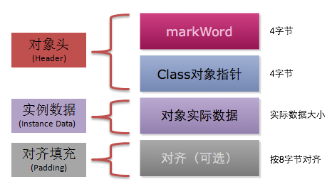
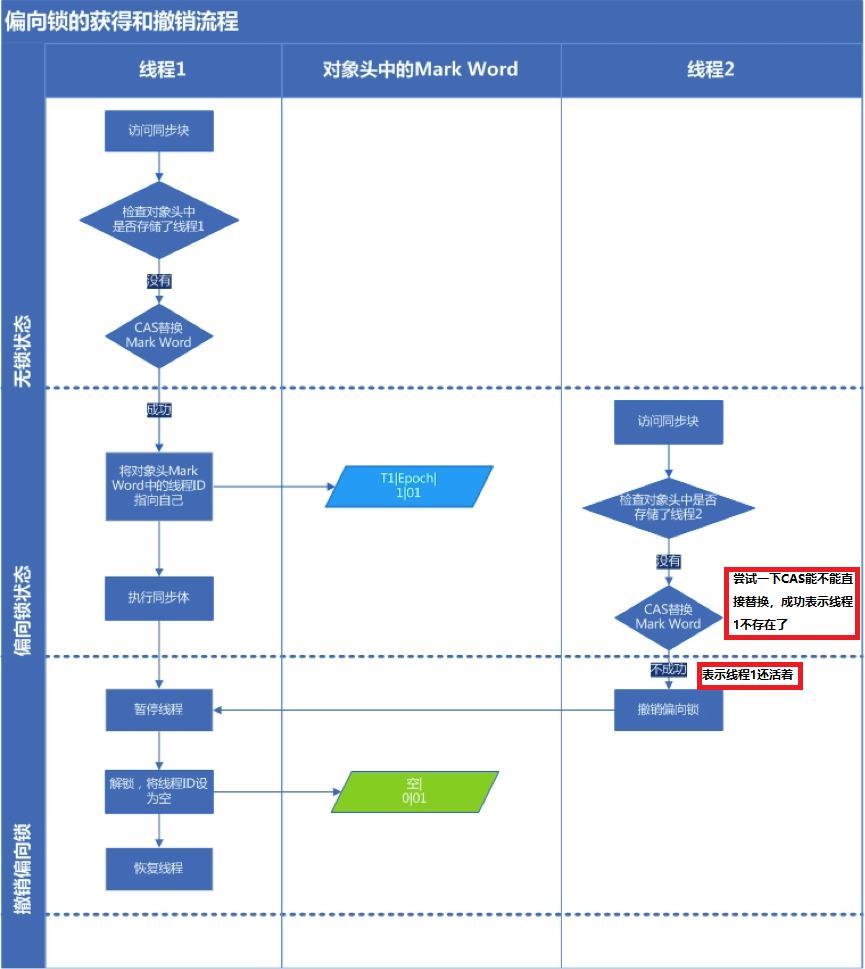
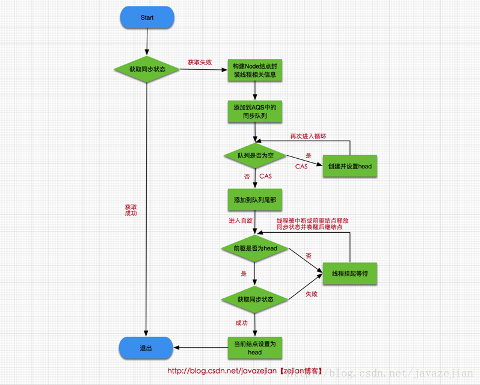

# 第七章 重排序与happens-before

## 7.1 什么是重排序？

计算机在执行程序时，为了提高性能，编译器和处理器常常会对指令做重排。

**为什么指令重排序可以提高性能？**

简单地说，每一个指令都会包含多个步骤，每个步骤可能使用不同的硬件。因此，**流水线技术**产生了，它的原理是指令1还没有执行完，就可以开始执行指令2，而不用等到指令1执行结束之后再执行指令2，这样就大大提高了效率。

但是，流水线技术最害怕**中断**，恢复中断的代价是比较大的，所以我们要想尽办法不让流水线中断。指令重排就是减少中断的一种技术。

我们分析一下下面这个代码的执行情况：

```java
a = b + c;
d = e - f ;
```

先加载b、c（**注意，即有可能先加载b，也有可能先加载c**），但是在执行add(b,c)的时候，需要等待b、c装载结束才能继续执行，也就是增加了停顿，那么后面的指令也会依次有停顿,这降低了计算机的执行效率。

为了减少这个停顿，我们可以先加载e和f,然后再去加载add(b,c),这样做对程序（串行）是没有影响的,但却减少了停顿。既然add(b,c)需要停顿，那还不如去做一些有意义的事情。

综上所述，[**指令重排对于提高CPU处理性能十分必要。虽然由此带来了乱序的问题，但是这点牺牲是值得的。**]()

指令重排一般分为以下三种：

- **编译器优化重排**

  编译器在**不改变单线程程序语义**的前提下，可以重新安排语句的执行顺序。

- **指令并行重排**

  现代处理器采用了指令级并行技术来将多条指令重叠执行。如果**不存在数据依赖性**(即后一个执行的语句无需依赖前面执行的语句的结果)，处理器可以改变语句对应的机器指令的执行顺序。

- **内存系统重排**

  由于处理器使用缓存和读写缓存冲区，这使得加载(load)和存储(store)操作看上去可能是在乱序执行，因为三级缓存的存在，导致内存与缓存的数据同步存在时间差。

[**指令重排可以保证串行语义一致，但是没有义务保证多线程间的语义也一致**。所以在多线程下，指令重排序可能会导致一些问题。]()

## 7.2 顺序一致性模型与JMM的保证

顺序一致性模型是一个**理论参考模型**，内存模型在设计的时候都会以顺序一致性内存模型作为参考。

### 7.2.1 数据竞争与顺序一致性

当程序未正确同步的时候，就可能存在数据竞争。

> 数据竞争：在一个线程中写一个变量，在另一个线程读同一个变量，并且写和读没有通过同步来排序。

如果程序中包含了数据竞争，那么运行的结果往往充满了**不确定性**，比如读发生在了写之前，可能就会读到错误的值；如果一个线程程序能够正确同步，那么就不存在数据竞争。

Java内存模型（JMM）对于正确同步多线程程序的内存一致性做了以下保证：

> **如果程序是正确同步的，程序的执行将具有顺序一致性**。 即程序的执行结果和该程序在顺序一致性模型中执行的结果相同。

这里的同步包括了使用`volatile`、`final`、`synchronized`等关键字来实现**多线程下的同步**。

如果程序员没有正确使用`volatile`、`final`、`synchronized`，那么即便是使用了同步（单线程下的同步），JMM也不会有内存可见性的保证，可能会导致你的程序出错，并且具有不可重现性，很难排查。

所以如何正确使用`volatile`、`final`、`synchronized`，是程序员应该去了解的。后面会有专门的章节介绍这几个关键字的内存语义及使用。

### 7.2.2 顺序一致性模型

顺序一致性内存模型是一个**理想化的理论参考模型**，它为程序员提供了极强的内存可见性保证。

顺序一致性模型有两大特性：

- 一个线程中的所有操作必须按照程序的顺序（即Java代码的顺序）来执行。
- 不管程序是否同步，所有线程都只能看到一个单一的操作执行顺序。即在顺序一致性模型中，每个操作必须是**原子性的，且立刻对所有线程可见**。

为了理解这两个特性，我们举个例子，假设有两个线程A和B并发执行，线程A有3个操作，他们在程序中的顺序是A1->A2->A3，线程B也有3个操作，B1->B2->B3。

假设**正确使用了同步**，A线程的3个操作执行后释放锁，B线程获取同一个锁。那么在**顺序一致性模型**中的执行效果如下所示：


操作的执行整体上有序，并且两个线程都只能看到这个执行顺序。

假设**没有使用同步**，那么在**顺序一致性模型**中的执行效果如下所示：


操作的执行整体上无序，但是两个线程都只能看到这个执行顺序。之所以可以得到这个保证，是因为顺序一致性模型中的**每个操作必须立即对任意线程可见**。

**但是JMM没有这样的保证。**

比如，在当前线程把写过的数据缓存在本地内存中，在没有刷新到主内存之前，这个写操作仅对当前线程可见；从其他线程的角度来观察，这个写操作根本没有被当前线程所执行。只有当前线程把本地内存中写过的数据刷新到主内存之后，这个写操作才对其他线程可见。在这种情况下，当前线程和其他线程看到的执行顺序是不一样的。

### 7.2.3 JMM中同步程序的顺序一致性效果

在顺序一致性模型中，所有操作完全按照程序的顺序串行执行。但是JMM中，临界区内（同步块或同步方法中）的代码可以发生重排序（但不允许临界区内的代码“逃逸”到临界区之外，因为会破坏锁的内存语义）。

虽然线程A在临界区做了重排序，但是因为锁的特性，线程B无法观察到线程A在临界区的重排序。这种重排序既提高了执行效率，又没有改变程序的执行结果。

同时，JMM会在退出临界区和进入临界区做特殊的处理，使得在临界区内程序获得与顺序一致性模型相同的内存视图。

**由此可见，JMM的具体实现方针是：在不改变（正确同步的）程序执行结果的前提下，尽量为编译期和处理器的优化打开方便之门**。

### 7.2.4 JMM中未同步程序的顺序一致性效果

对于未同步的多线程程序，JMM只提供**最小安全性**：线程读取到的值，要么是之前某个线程写入的值，要么是默认值，不会无中生有。

为了实现这个安全性，JVM在堆上分配对象时，首先会对内存空间清零，然后才会在上面分配对象（这两个操作是同步的）。

**JMM没有保证未同步程序的执行结果与该程序在顺序一致性中执行结果一致。因为如果要保证执行结果一致，那么JMM需要禁止大量的优化，对程序的执行性能会产生很大的影响。**

未同步程序在JMM和顺序一致性内存模型中的执行特性有如下差异：

1. 顺序一致性保证单线程内的操作会按程序的顺序执行；JMM不保证单线程内的操作会按程序的顺序执行。（因为重排序，但是JMM保证单线程下的重排序不影响执行结果）
2. 顺序一致性模型保证所有线程只能看到一致的操作执行顺序，而JMM不保证所有线程能看到一致的操作执行顺序。（因为JMM不保证所有操作立即可见）
3. 顺序一致性模型保证对所有的内存读写操作都具有原子性，而JMM不保证对64位的long型和double型变量的写操作具有原子性。

## 7.3 happens-before

### 7.3.1 什么是happens-before?

一方面，程序员需要JMM提供一个强的内存模型来编写代码；另一方面，编译器和处理器希望JMM对它们的束缚越少越好，这样它们就可以最可能多的做优化来提高性能，希望的是一个弱的内存模型。

JMM考虑了这两种需求，并且找到了平衡点，对编译器和处理器来说，**只要不改变程序的执行结果（单线程程序和正确同步了的多线程程序），编译器和处理器怎么优化都行。**

而对于程序员，JMM提供了**happens-before规则**（JSR-133规范），满足了程序员的需求——**简单易懂，并且提供了足够强的内存可见性保证。**换言之，程序员只要遵循happens-before规则，那他写的程序就能保证在JMM中具有强的内存可见性。

JMM使用happens-before的概念来定制两个操作之间的执行顺序。这两个操作可以在一个线程以内，也可以是不同的线程之间。因此，JMM可以通过happens-before关系向程序员提供跨线程的内存可见性保证。

happens-before关系的定义如下：

1. 如果一个操作happens-before另一个操作，那么第一个操作的执行结果将对第二个操作可见，而且第一个操作的执行顺序排在第二个操作之前。
2. **两个操作之间存在happens-before关系，并不意味着Java平台的具体实现必须要按照happens-before关系指定的顺序来执行。如果重排序之后的执行结果，与按happens-before关系来执行的结果一致，那么JMM也允许这样的重排序。**

happens-before关系本质上和as-if-serial语义是一回事。

[**as-if-serial语义保证单线程内重排序后的执行结果和程序代码本身应有的结果是一致的**]()

[**happens-before关系保证正确同步的多线程程序的执行结果不被重排序改变。**]()

总之，**如果操作A happens-before操作B，那么操作A在内存上所做的操作对操作B都是可见的，不管它们在不在一个线程。**

### 7.3.2 天然的happens-before关系

在Java中，有以下天然的happens-before关系：

- 程序顺序规则：一个线程中的每一个操作，happens-before于该线程中的任意后续操作。
- 监视器锁规则：对一个锁的解锁，happens-before于随后对这个锁的加锁。
- volatile变量规则：对一个volatile域的写，happens-before于任意后续对这个volatile域的读。
- 传递性：如果A happens-before B，且B happens-before C，那么A happens-before C。
- start规则：如果线程A执行操作ThreadB.start()启动线程B，那么A线程的ThreadB.start（）操作happens-before于线程B中的任意操作、
- join规则：如果线程A执行操作ThreadB.join（）并成功返回，那么线程B中的任意操作happens-before于线程A从ThreadB.join()操作成功返回。

举例：

```java
int a = 1; // A操作
int b = 2; // B操作
int sum = a + b;// C 操作
System.out.println(sum);
```

根据以上介绍的happens-before规则，假如只有一个线程，那么不难得出：

```
1> A happens-before B 
2> B happens-before C 
3> A happens-before C
```

注意，真正在执行指令的时候，其实JVM有可能对操作A & B进行重排序，因为无论先执行A还是B，他们都对对方是可见的，并且不影响执行结果。

如果这里发生了重排序，这在视觉上违背了happens-before原则，但是JMM是允许这样的重排序的。

所以，[**我们只需要关心happens-before规则，不用关心JVM到底是怎样执行的。只要确定操作A happens-before操作B就行了。**]()

重排序有两类，JMM对这两类重排序有不同的策略：

> - 会改变程序执行结果的重排序，比如 A -> C，JMM要求编译器和处理器都禁止这种重排序。
> - 不会改变程序执行结果的重排序，比如 A -> B，JMM对编译器和处理器不做要求，允许这种重排序。

# 第八章 volatile

```java
public class Main {
    boolean run = true;
    volatile int s = 1;

    public static void main(String[] args) throws InterruptedException {
        Main main = new Main();
        Lock lock = new ReentrantLock();
        // 本地工作内存失效的时机
        // 1.线程中释放锁
        // 2.线程切换
        // 3.CPU有空闲时间（比如线程休眠，IO操作）
        new Thread(() -> {
            while (main.run) {
                // 方法一：volatile关键字
                //int a = main.s;

                // 方法二：System.out.println内部也是加锁解锁
                //System.out.println("true");

                //lock.lock();
                //lock.unlock();

                //synchronized (main){
                //}

                // 方法三：线程休眠
                //try {
                //   Thread.sleep(1500);
                //} catch (InterruptedException e) {
                //    e.printStackTrace();
                //}
            }
            System.out.println("stop");
        }).start();

        // 线程停止后run肯定刷新回主内存，没停止前按照时间片刷新回主内存
        new Thread(() -> {
            try {
                Thread.sleep(1000);
            } catch (InterruptedException e) {
                e.printStackTrace();
            }
            while (true) {
                main.run = false;
            }
        }).start();
    }
}
```

## 8.1 几个基本概念

### 8.1.1 内存可见性

在Java内存模型那一章我们介绍了JMM有一个主内存，每个线程有自己私有的工作内存，工作内存中保存了一些变量在主内存的拷贝。

[**内存可见性，指的是线程之间的可见性，当一个线程修改了共享变量时，另一个线程可以读取到这个修改后的值**。]()

### 8.1.2 重排序

为优化程序性能，对原有的指令执行顺序进行优化重新排序。重排序可能发生在多个阶段，比如编译重排序、CPU重排序等。

### 8.1.3 happens-before规则

是一个给程序员使用的规则，只要程序员在写代码的时候遵循happens-before规则，JVM就能保证指令在多线程之间的顺序性符合程序员的预期。

## 8.2 volatile的内存语义

在Java中，volatile关键字有特殊的内存语义。volatile主要有以下两个功能：

- 保证变量的**内存可见性**
- 禁止volatile变量与普通变量**重排序**（JSR133提出，Java 5 开始才有这个“增强的volatile内存语义”）

### 8.2.1 内存可见性

以一段示例代码开始：

```java
public class VolatileExample {
    int a = 0;
    volatile boolean flag = false;

    public void writer() {
        a = 1; // step 1
        flag = true; // step 2
    }

    public void reader() {
        if (flag) { // step 3
            System.out.println(a); // step 4
        }
    }
}
```

在这段代码里，我们使用`volatile`关键字修饰了一个`boolean`类型的变量`flag`。

所谓内存可见性，指的是当一个线程对`volatile`修饰的变量进行**写操作**（比如step 2）时，JMM会立即把该线程对应的本地内存中的共享变量的值刷新到主内存；当一个线程对`volatile`修饰的变量进行**读操作**（比如step 3）时，JMM会把立即该线程对应的本地内存置为无效，从主内存中读取共享变量的值。

> 在这一点上，volatile与锁具有相同的内存效果，volatile变量的写和锁的释放具有相同的内存语义，volatile变量的读和锁的获取具有相同的内存语义。

假设在时间线上，线程A先执行方法`writer`方法，线程B后执行`reader`方法。那必然会有下图：


而如果`flag`变量**没有**用`volatile`修饰，在step 2，线程A的本地内存里面的变量就不会立即更新到主内存，那随后线程B也同样不会去主内存拿最新的值，仍然使用线程B本地内存缓存的变量的值`a = 0，flag = false`。

### 8.2.1 禁止重排序

在JSR-133之前的旧的Java内存模型中，是允许volatile变量与普通变量重排序的。那上面的案例中，可能就会被重排序成下列时序来执行：

1. 线程A写volatile变量，step 2，设置flag为true；
2. 线程B读同一个volatile，step 3，读取到flag为true；
3. 线程B读普通变量，step 4，读取到 a = 0；
4. 线程A修改普通变量，step 1，设置 a = 1；

可见，如果volatile变量与普通变量发生了重排序，虽然volatile变量能保证内存可见性，也可能导致普通变量读取错误。

所以在旧的内存模型中，volatile的写-读就不能与锁的释放-获取具有相同的内存语义了。为了提供一种比锁更轻量级的**线程间的通信机制**，**JSR-133**专家组决定增强volatile的内存语义：严格限制编译器和处理器对volatile变量与普通变量的重排序。

编译器还好说，[JVM是怎么还能限制处理器的重排序的呢？它是通过**内存屏障**来实现的。]()

什么是内存屏障？硬件层面，内存屏障分两种：读屏障（Load Barrier）和写屏障（Store Barrier）。内存屏障有两个作用：

1. 阻止屏障两侧的指令重排序；
2. 强制把写缓冲区/高速缓存中的脏数据等写回主内存，或者让缓存中相应的数据失效。

> 注意这里的缓存主要指的是CPU缓存，如L1，L2等

编译器在**生成字节码时**，会在指令序列中插入内存屏障来禁止特定类型的处理器重排序。编译器选择了一个**比较保守的JMM内存屏障插入策略**，这样可以保证在任何处理器平台，任何程序中都能得到正确的volatile内存语义。这个策略是：

- 在每个volatile写操作前插入一个StoreStore屏障；
- 在每个volatile写操作后插入一个StoreLoad屏障；
- 在每个volatile读操作后插入一个LoadLoad屏障；
- 在每个volatile读操作后再插入一个LoadStore屏障。

大概示意图是这个样子：


> 再逐个解释一下这几个屏障。注：下述Load代表读操作，Store代表写操作
>
> **LoadLoad屏障**：对于这样的语句Load1; LoadLoad; Load2，在Load2及后续读取操作要读取的数据被访问前，保证Load1要读取的数据被读取完毕。
>
> **LoadStore屏障**：对于这样的语句Load1; LoadStore; Store2，在Store2及后续写入操作被刷出前，保证Load1要读取的数据被读取完毕。
>
> **StoreStore屏障**：对于这样的语句Store1; StoreStore; Store2，在Store2及后续写入操作执行前，这个屏障会把Store1强制刷新到内存，保证Store1的写入操作对其它处理器可见。
>
> **StoreLoad屏障**：对于这样的语句Store1; StoreLoad; Load2，在Load2及后续所有读取操作执行前，保证Store1的写入对所有处理器可见。它的开销是四种屏障中最大的（冲刷写缓冲器，清空无效化队列）。在大多数处理器的实现中，这个屏障是个万能屏障，兼具其它三种内存屏障的功能

对于连续多个volatile变量读或者连续多个volatile变量写，编译器做了一定的优化来提高性能，比如：

> 第一个volatile读;
>
> LoadLoad屏障；
>
> 第二个volatile读；
>
> LoadStore屏障

再介绍一下volatile与普通变量的重排序规则:

1. 如果第一个操作是volatile读，那无论第二个操作是什么，都不能重排序；
2. 如果第二个操作是volatile写，那无论第一个操作是什么，都不能重排序；
3. 如果第一个操作是volatile写，第二个操作是volatile读，那不能重排序。

举个例子，我们在案例中step 1，是普通变量的写，step 2是volatile变量的写，那符合第2个规则，这两个steps不能重排序。而step 3是volatile变量读，step 4是普通变量读，符合第1个规则，同样不能重排序。

但如果是下列情况：第一个操作是普通变量读，第二个操作是volatile变量读，那是可以重排序的：

```java
// 声明变量
int a = 0; // 声明普通变量
volatile boolean flag = false; // 声明volatile变量

// 以下两个变量的读操作是可以重排序的
int i = a; // 普通变量读
boolean j = flag; // volatile变量读
```

## 8.3 volatile的用途

从volatile的内存语义上来看，volatile可以保证内存可见性且禁止重排序。

在保证内存可见性这一点上，volatile有着与锁相同的内存语义，所以可以作为一个“轻量级”的锁来使用。但由于volatile仅仅保证对单个volatile变量的读/写具有原子性，而锁可以保证整个**临界区代码**的执行具有原子性。所以**在功能上，锁比volatile更强大；在性能上，volatile更有优势**。

在禁止重排序这一点上，volatile也是非常有用的。比如我们熟悉的单例模式，其中有一种实现方式是“双重锁检查”，比如这样的代码：

```java
public class Singleton {

    private static Singleton instance; // 不使用volatile关键字

    // 双重锁检验
    public static Singleton getInstance() {
        if (instance == null) { // 第7行
            synchronized (Singleton.class) {
                if (instance == null) {
                    instance = new Singleton(); // 第10行
                }
            }
        }
        return instance;
    }
}
```

如果这里的变量声明不使用volatile关键字，是可能会发生错误的。它可能会被重排序：

```java
instance = new Singleton(); // 第10行

// 可以分解为以下三个步骤
1 memory=allocate();// 分配内存 相当于c的malloc
2 ctorInstanc(memory) //初始化对象
3 s=memory //设置s指向刚分配的地址

// 上述三个步骤可能会被重排序为 1-3-2，也就是：
1 memory=allocate();// 分配内存 相当于c的malloc
3 s=memory //设置s指向刚分配的地址
2 ctorInstanc(memory) //初始化对象
```

而一旦假设发生了这样的重排序，比如线程A在第10行执行了步骤1和步骤3，但是步骤2还没有执行完。这个时候另一个线程B执行到了第7行，它会判定instance不为空，然后直接返回了一个未初始化完成的instance！

所以JSR-133对volatile做了增强后，volatile的禁止重排序功能还是非常有用的。

# 第九章 synchronized与锁

首先需要明确的一点是：**Java多线程的锁都是基于对象的**，Java中的每一个对象都可以作为一个锁。

还有一点需要注意的是，我们常听到的**类锁**其实也是对象锁。

Java类只有一个Class对象（可以有多个实例对象，多个实例共享这个Class对象），而Class对象也是特殊的Java对象。所以我们常说的类锁，其实就是Class对象的锁。

## 9.1 Synchronized关键字

```java
// 关键字在实例方法上，锁为当前实例
public synchronized void instanceLock() {
    // code
}

// 关键字在静态方法上，锁为当前Class对象
public static synchronized void classLock() {
    // code
}

// 关键字在代码块上，锁为括号里面的对象
public void blockLock() {
    Object o = new Object();
    synchronized (o) {
        // code
    }
}
```

我们这里介绍一下“临界区”的概念。所谓“临界区”，指的是某一块代码区域，它同一时刻只能由一个线程执行。在上面的例子中，如果`synchronized`关键字在方法上，那临界区就是整个方法内部。而如果是使用synchronized代码块，那临界区就指的是代码块内部的区域。

通过上面的例子我们可以看到，下面这两个写法其实是等价的作用：

```java
// 关键字在实例方法上，锁为当前实例
public synchronized void instanceLock() {
    // code
}

// 关键字在代码块上，锁为括号里面的对象
public void blockLock() {
    synchronized (this) {
        // code
    }
}
```

同理，下面这两个方法也应该是等价的：

```java
// 关键字在静态方法上，锁为当前Class对象
public static synchronized void classLock() {
    // code
}

// 关键字在代码块上，锁为括号里面的对象
public void blockLock() {
    synchronized (this.getClass()) {
        // code
    }
}
```

## 9.2 几种锁

Java 6 为了减少获得锁和释放锁带来的性能消耗，引入了“偏向锁”和“轻量级锁“。在Java 6 以前，所有的锁都是”重量级“锁。所以在Java 6 及其以后，一个对象其实有四种锁状态，它们级别由低到高依次是：

1. 无锁状态
2. 偏向锁状态
3. 轻量级锁状态
4. 重量级锁状态

无锁就是没有对资源进行锁定，任何线程都可以尝试去修改它，无锁在这里不再细讲。

几种锁会随着竞争情况逐渐升级，锁的升级很容易发生，但是锁降级发生的条件会比较苛刻，[**锁降级发生在Stop The World期间，当JVM进入安全点的时候，会检查是否有闲置的锁，然后进行降级。**]()

> 关于锁降级有两点说明：
>
> 1.不同于大部分文章说锁不能降级，实际上HotSpot JVM 是支持锁降级的，文末有链接。
>
> 2.上面提到的Stop The World期间，以及安全点，这些知识是属于JVM的知识范畴，本文不做细讲。

下面分别介绍这几种锁以及它们之间的升级。

### 9.2.1 Java对象头

前面我们提到，Java的锁都是基于对象的。首先我们来看看一个对象的“锁”的信息是存放在什么地方的。

每个Java对象都有对象头。如果是非数组类型，则用2个字宽来存储对象头，如果是数组，则会用3个字宽来存储对象头。在32位处理器中，一个字宽是32位；在64位虚拟机中，一个字宽是64位。对象头的内容如下表：

| 长度     | 内容                   | 说明                         |
| -------- | ---------------------- | ---------------------------- |
| 32/64bit | Mark Word              | 存储对象的hashCode或锁信息等 |
| 32/64bit | Class Metadata Address | 存储到对象类型数据的指针     |
| 32/64bit | Array length           | 数组的长度（如果是数组）     |

在 HotSpot 虚拟机中，对象的内存布局分为以下 3 块区域：

- 对象头是由MarkWord和Klass Point(类型指针)组成，**其中Klass Point是是对象指向它的类元数据的指针，虚拟机通过这个指针来确定这个对象是哪个类的实例**，Mark Word用于存储对象自身的运行时数据。如果对象是数组对象，那么对象头占用3个字宽（Word），如果对象是非数组对象，那么对象头占用2个字宽。（1word = 2 Byte = 16 bit）
- **实例变量存储的是对象的属性信息，包括父类的属性信息**，按照4字节对齐
- 填充字符，因为虚拟机要求对象字节必须是8字节的整数倍，填充字符就是用于凑齐这个整数倍的




我们主要来看看Mark Word的格式：

| 锁状态   | 29 bit 或 61 bit             | 1 bit 是否是偏向锁？       | 2 bit 锁标志位 |
| -------- | ---------------------------- | -------------------------- | -------------- |
| 无锁     |                              | 0                          | 01             |
| 偏向锁   | 线程ID                       | 1                          | 01             |
| 轻量级锁 | 指向栈中锁记录的指针         | 此时这一位不用于标识偏向锁 | 00             |
| 重量级锁 | 指向互斥量（重量级锁）的指针 | 此时这一位不用于标识偏向锁 | 10             |
| GC标记   |                              | 此时这一位不用于标识偏向锁 | 11             |

当对象状态为偏向锁时，`Mark Word`存储的是偏向的线程ID；

当状态为轻量级锁时，`Mark Word`存储的是指向线程栈中`Lock Record`的指针；

当状态为重量级锁时，`Mark Word`为指向堆中的monitor对象的指针。

### 9.2.2 偏向锁

> [Hotspot的作者经过以往的研究发现大多数情况下**锁不仅不存在多线程竞争，而且总是由同一线程多次获得**，于是引入了偏向锁。]()

偏向锁会偏向于第一个访问锁的线程，如果在接下来的运行过程中，该锁没有被其他的线程访问，则持有偏向锁的线程将永远不需要触发同步。也就是说，**偏向锁在资源无竞争情况下消除了同步语句，连CAS操作都不做了，提高了程序的运行性能。**

> 大白话就是对锁置个变量，如果发现为true，代表资源无竞争，则无需再走各种加锁/解锁流程。如果为false，代表存在其他线程竞争资源，那么就会走后面的流程。

#### **实现原理**

一个线程在第一次进入同步块时，会在对象头和栈帧中的锁记录里存储锁的偏向的线程ID。当下次该线程进入这个同步块时，会去检查锁的Mark Word里面是不是放的自己的线程ID。

如果是，表明该线程已经获得了锁，以后该线程在进入和退出同步块时不需要花费CAS操作来加锁和解锁 ；

如果不是，就代表有另一个线程来竞争这个偏向锁。这个时候会尝试使用CAS来替换Mark Word里面的线程ID为新线程的ID，这个时候要分两种情况：

- 成功，表示之前的线程不存在了， Mark Word里面的线程ID为新线程的ID，锁不会升级，仍然为偏向锁；
- 失败，表示之前的线程仍然存在，那么暂停之前的线程，设置偏向锁标识为0，并设置锁标志位为00，升级为轻量级锁，会按照轻量级锁的方式进行竞争锁。

线程竞争偏向锁的过程如下：


图中涉及到了lock record指针指向当前堆栈中的最近一个lock record，是轻量级锁按照先来先服务的模式进行了轻量级锁的加锁。

#### 撤销偏向锁

偏向锁使用了一种**等到竞争出现才释放锁的机制**，所以当其他线程尝试竞争偏向锁时， 持有偏向锁的线程才会释放锁。

[**偏向锁升级成轻量级锁时，会暂停拥有偏向锁的线程，重置偏向锁标识，这个过程看起来容易，实则开销还是很大的**]()，大概的过程如下：

1. 在一个[**安全点（在这个时间点上没有字节码正在执行）**]()停止拥有锁的线程。
2. 遍历线程栈，如果存在锁记录的话，需要修复锁记录和Mark Word，使其变成无锁状态。
3. 唤醒被停止的线程，将当前锁升级成轻量级锁。

所以，[**如果应用程序里所有的锁通常处于竞争状态**]()，那么偏向锁就会是一种累赘，对于这种情况，我们可以一开始就把偏向锁这个默认功能给关闭：

```java
-XX:UseBiasedLocking=false。
```

下面这个经典的图总结了偏向锁的获得和撤销：



### 9.2.3 轻量级锁

[**多个线程在不同时段获取同一把锁，即不存在锁竞争的情况，也就没有线程阻塞。**]()针对这种情况，JVM采用轻量级锁来避免线程的阻塞与唤醒。

#### 轻量级锁的加锁

JVM会为每个线程在当前线程的栈帧中创建用于存储锁记录的空间，我们称为Displaced Mark Word。如果一个线程获得锁的时候发现是轻量级锁，[**会把锁的Mark Word复制到自己的Displaced Mark Word**]()里面。

然后线程尝试用CAS将锁的Mark Word替换为指向锁记录的指针。如果成功，当前线程获得锁，如果失败，表示Mark Word已经被替换成了其他线程的锁记录，说明在与其它线程竞争锁，当前线程就尝试使用自旋来获取锁。

> 自旋：不断尝试去获取锁，一般用循环来实现。

自旋是需要消耗CPU的，如果一直获取不到锁的话，那该线程就一直处在自旋状态，白白浪费CPU资源。解决这个问题最简单的办法就是[**指定自旋的次数**]()，例如让其循环10次，如果还没获取到锁就进入阻塞状态。

但是JDK采用了更聪明的方式——[**适应性自旋**]()，简单来说就是线程如果自旋成功了，则下次自旋的次数会更多，如果自旋失败了，则自旋的次数就会减少。

自旋也不是一直进行下去的，如果自旋到一定程度（和JVM、操作系统相关），依然没有获取到锁，称为自旋失败，那么这个线程会阻塞。同时这个锁就会**升级成重量级锁**。

**轻量级锁的释放：**

[**在释放锁时，当前线程会使用CAS操作将Displaced Mark Word的内容复制回锁的Mark Word里面。如果没有发生竞争，那么这个复制的操作会成功。**]()如果有其他线程因为自旋多次导致轻量级锁升级成了重量级锁，那么CAS操作会失败，此时会释放锁并唤醒被阻塞的线程。

一张图说明加锁和释放锁的过程：


### 9.2.4 重量级锁

[**重量级锁依赖于操作系统的互斥量（mutex） 实现的，而操作系统中线程间状态的转换需要相对比较长的时间，所以重量级锁效率很低，但被阻塞的线程不会消耗CPU。**]()

前面说到，每一个对象都可以当做一个锁，当多个线程同时请求某个对象锁时，对象锁会设置几种状态用来区分请求的线程：

```
Contention List：所有请求锁的线程将被首先放置到该竞争队列
Entry List：Contention List中那些有资格成为候选人的线程被移到Entry List
Wait Set：那些调用wait方法被阻塞的线程被放置到Wait Set
OnDeck：任何时刻最多只能有一个线程正在竞争锁，该线程称为OnDeck
Owner：获得锁的线程称为Owner
!Owner：释放锁的线程
```

当一个线程尝试获得锁时，如果该锁已经被占用，则会将该线程封装成一个`ObjectWaiter`对象插入到Contention List的队列的队首，然后调用`park`函数挂起当前线程。

当线程释放锁时，会从Contention List或EntryList中挑选一个线程唤醒，被选中的线程叫做`Heir presumptive`即假定继承人，假定继承人被唤醒后会尝试获得锁，但`synchronized`是非公平的，所以假定继承人不一定能获得锁。这是因为对于重量级锁，线程先自旋尝试获得锁，这样做的目的是为了减少执行操作系统同步操作带来的开销。如果自旋不成功再进入等待队列。这对那些已经在等待队列中的线程来说，稍微显得不公平，还有一个不公平的地方是自旋线程可能会抢占了Ready线程的锁。

如果线程获得锁后调用`Object.wait`方法，则会将线程加入到WaitSet中，当被`Object.notify`唤醒后，会将线程从WaitSet移动到Contention List或EntryList中去。需要注意的是，当调用一个锁对象的`wait`或`notify`方法时，**如当前锁的状态是偏向锁或轻量级锁则会先膨胀成重量级锁**。

### 9.2.5 总结锁的升级流程

每一个线程在准备获取共享资源时： 第一步，检查MarkWord里面是不是放的自己的ThreadId ,如果是，表示当前线程是处于 “偏向锁” 。

第二步，如果MarkWord不是自己的ThreadId，锁升级，这时候，用CAS来执行切换，新的线程根据MarkWord里面现有的ThreadId，通知之前线程暂停，之前线程将Markword的内容置为空。

第三步，两个线程都把锁对象的HashCode复制到自己新建的用于存储锁的记录空间，接着开始通过CAS操作， 把锁对象的MarKword的内容修改为自己新建的记录空间的地址的方式竞争MarkWord。

第四步，第三步中成功执行CAS的获得资源，失败的则进入自旋 。

第五步，自旋的线程在自旋过程中，成功获得资源(即之前获的资源的线程执行完成并释放了共享资源)，则整个状态依然处于 轻量级锁的状态，如果自旋失败 。

第六步，进入重量级锁的状态，这个时候，自旋的线程进行阻塞，等待之前线程执行完成并唤醒自己。

### 9.2.6 各种锁的优缺点对比

下表来自《Java并发编程的艺术》：

| 锁       | 优点                                                         | 缺点                                             | 适用场景                             |
| -------- | ------------------------------------------------------------ | ------------------------------------------------ | ------------------------------------ |
| 偏向锁   | 加锁和解锁不需要额外的消耗，和执行非同步方法比仅存在纳秒级的差距。 | 如果线程间存在锁竞争，会带来额外的锁撤销的消耗。 | 适用于只有一个线程访问同步块场景。   |
| 轻量级锁 | 竞争的线程不会阻塞，提高了程序的响应速度。                   | 如果始终得不到锁竞争的线程使用自旋会消耗CPU。    | 追求响应时间。同步块执行速度非常快。 |
| 重量级锁 | 线程竞争不使用自旋，不会消耗CPU。                            | 线程阻塞，响应时间缓慢。                         | 追求吞吐量。同步块执行时间较长。     |

------

# 第十章 CAS与原子操作

## 10.1 乐观锁与悲观锁的概念

锁可以从不同的角度分类。其中，乐观锁和悲观锁是一种分类方式。

**悲观锁：**

悲观锁就是我们常说的锁。对于悲观锁来说，它总是认为每次访问共享资源时会发生冲突，所以必须对每次数据操作加上锁，以保证临界区的程序同一时间只能有一个线程在执行。

**乐观锁：**

乐观锁又称为“无锁”，顾名思义，它是乐观派。乐观锁总是假设对共享资源的访问没有冲突，线程可以不停地执行，无需加锁也无需等待。而一旦多个线程发生冲突，乐观锁通常是使用一种称为CAS的技术来保证线程执行的安全性。

由于无锁操作中没有锁的存在，因此不可能出现死锁的情况，也就是说**乐观锁天生免疫死锁**。

[**乐观锁多用于“读多写少“的环境，避免频繁加锁影响性能；而悲观锁多用于”写多读少“的环境，避免频繁失败和重试影响性能。**]()

## 10.2 CAS的概念

CAS的全称是：比较并交换（Compare And Swap）。在CAS中，有这样三个值：

- V：要更新的变量(var)
- E：预期值(expected)
- N：新值(new)

比较并交换的过程如下：

判断V是否等于E，如果等于，将V的值设置为N；如果不等，说明已经有其它线程更新了V，则当前线程放弃更新，什么都不做。

所以这里的**预期值E本质上指的是“旧值”**。

我们以一个简单的例子来解释这个过程：

1. 如果有一个多个线程共享的变量`i`原本等于5，我现在在线程A中，想把它设置为新的值6;
2. 我们使用CAS来做这个事情；
3. 首先我们用i去与5对比，发现它等于5，说明没有被其它线程改过，那我就把它设置为新的值6，此次CAS成功，`i`的值被设置成了6；
4. 如果不等于5，说明`i`被其它线程改过了（比如现在`i`的值为2），那么我就什么也不做，此次CAS失败，`i`的值仍然为2。

在这个例子中，`i`就是V，5就是E，6就是N。

那有没有可能我在判断了`i`为5之后，正准备更新它的新值的时候，被其它线程更改了`i`的值呢？

不会的。[**因为CAS是一种原子操作，它是一种系统原语，是一条CPU的原子指令，从CPU层面保证它的原子性**]()

**当多个线程同时使用CAS操作一个变量时，只有一个会胜出，并成功更新，其余均会失败，但失败的线程并不会被挂起，仅是被告知失败，并且允许再次尝试，当然也允许失败的线程放弃操作。**

## 10.3 Java实现CAS的原理 - Unsafe类

前面提到，CAS是一种原子操作。那么Java是怎样来使用CAS的呢？我们知道，在Java中，如果一个方法是native的，那Java就不负责具体实现它，而是交给底层的JVM使用c或者c++去实现。

在Java中，有一个`Unsafe`类，它在`sun.misc`包中。它里面是一些`native`方法，其中就有几个关于CAS的：

```java
boolean compareAndSwapObject(Object o, long offset,Object expected, Object x);
boolean compareAndSwapInt(Object o, long offset,int expected,int x);
boolean compareAndSwapLong(Object o, long offset,long expected,long x);
```

当然，他们都是`public native`的。

Unsafe中对CAS的实现是C++写的，它的具体实现和操作系统、CPU都有关系。

Linux的X86下主要是通过`cmpxchgl`这个指令在CPU级完成CAS操作的，但在多处理器情况下必须使用`lock`指令加锁来完成。当然不同的操作系统和处理器的实现会有所不同，大家可以自行了解。

当然，Unsafe类里面还有其它方法用于不同的用途。比如支持线程挂起和恢复的`park`和`unpark`， LockSupport类底层就是调用了这两个方法。还有支持反射操作的`allocateInstance()`方法。

## 10.4 原子操作-AtomicInteger类源码简析

上面介绍了Unsafe类的几个支持CAS的方法。那Java具体是如何使用这几个方法来实现原子操作的呢？

JDK提供了一些用于原子操作的类，在`java.util.concurrent.atomic`包下面。在JDK 11中，有如下17个类：


从名字就可以看得出来这些类大概的用途：

- 原子更新基本类型
- 原子更新数组
- 原子更新引用
- 原子更新字段（属性）

这里我们以`AtomicInteger`类的`getAndAdd(int delta)`方法为例，来看看Java是如何实现原子操作的。

先看看这个方法的源码：

```java
public final int getAndAdd(int delta) {
    return U.getAndAddInt(this, VALUE, delta);
}
```

这里的U其实就是一个`Unsafe`对象：

```java
private static final jdk.internal.misc.Unsafe U = jdk.internal.misc.Unsafe.getUnsafe();
```

所以其实`AtomicInteger`类的`getAndAdd(int delta)`方法是调用`Unsafe`类的方法来实现的：

```java
@HotSpotIntrinsicCandidate
public final int getAndAddInt(Object o, long offset, int delta) {
    int v;
    do {
        v = getIntVolatile(o, offset);
    } while (!weakCompareAndSetInt(o, offset, v, v + delta));
    return v;
}
```

> 注：这个方法是在JDK 1.8才新增的。在JDK1.8之前，`AtomicInteger`源码实现有所不同，是基于for死循环的。

我们来一步步解析这段源码。首先，对象`o`是`this`，也就是一个`AtomicInteger`对象。然后`offset`是一个常量`VALUE`。这个常量是在`AtomicInteger`类中声明的：

```java
private static final long VALUE = U.objectFieldOffset(AtomicInteger.class, "value");
```

同样是调用的`Unsafe`的方法。从方法名字上来看，是得到了一个对象字段偏移量。

> [**用于获取某个字段相对Java对象的“起始地址”的偏移量。**]()
>
> 一个java对象可以看成是一段内存，各个字段都得按照一定的顺序放在这段内存里，同时考虑到对齐要求，可能这些字段不是连续放置的，
>
> 用这个方法能准确地告诉你某个字段相对于对象的起始内存地址的字节偏移量，[**因为是相对偏移量，所以它其实跟某个具体对象又没什么太大关系，跟class的定义和虚拟机的内存模型的实现细节更相关。**]()

继续看源码。前面我们讲到，CAS是“无锁”的基础，它允许更新失败。所以经常会与while循环搭配，在失败后不断去重试。

这里声明了一个v，也就是要返回的值。从`getAndAddInt`来看，它返回的应该是原来的值，而新的值的`v + delta`。

这里使用的是**do-while循环**。这种循环不多见，它的目的是**保证循环体内的语句至少会被执行一遍**。这样才能保证return 的值`v`是我们期望的值。

循环体的条件是一个CAS方法：

```java
public final boolean weakCompareAndSetInt(Object o, long offset,
                                          int expected,
                                          int x) {
    return compareAndSetInt(o, offset, expected, x);
}

public final native boolean compareAndSetInt(Object o, long offset,
                                             int expected,
                                             int x);
```

可以看到，最终其实是调用的我们之前说到了CAS `native`方法。那为什么要经过一层`weakCompareAndSetInt`呢？从JDK源码上看不出来什么。在JDK 8及之前的版本，这两个方法是一样的。

> 而在JDK 9开始，这两个方法上面增加了@HotSpotIntrinsicCandidate注解。这个注解允许HotSpot VM自己来写汇编或IR编译器来实现该方法以提供性能。也就是说虽然外面看到的在JDK9中weakCompareAndSet和compareAndSet底层依旧是调用了一样的代码，但是不排除HotSpot VM会手动来实现weakCompareAndSet真正含义的功能的可能性。

根据本文第一篇参考文章（文末链接），它跟`volatile`有关。

简单来说，`weakCompareAndSet`操作仅保留了`volatile`自身变量的特性，而除去了happens-before规则带来的内存语义。也就是说，`weakCompareAndSet`**无法保证处理操作目标的volatile变量外的其他变量的执行顺序( 编译器和处理器为了优化程序性能而对指令序列进行重新排序 )，同时也无法保证这些变量的可见性。**这在一定程度上可以提高性能。

再回到循环条件上来，可以看到它是在不断尝试去用CAS更新。如果更新失败，就继续重试。那为什么要把获取“旧值”v的操作放到循环体内呢？其实这也很好理解。前面我们说了，CAS如果旧值V不等于预期值E，它就会更新失败。说明旧的值发生了变化。那我们当然需要返回的是被其他线程改变之后的旧值了，因此放在了do循环体内。

## 10.5 CAS实现原子操作的三大问题

这里介绍一下CAS实现原子操作的三大问题及其解决方案。

### 10.5.1 ABA问题

所谓ABA问题，就是一个值原来是A，变成了B，又变回了A。这个时候使用CAS是检查不出变化的，但实际上却被更新了两次。

ABA问题的解决思路是在变量前面追加上**版本号或者时间戳**。从JDK 1.5开始，[**JDK的atomic包里提供了一个类`AtomicStampedReference`类来解决ABA问题。**]()

这个类的`compareAndSet`方法的作用是首先检查当前引用是否等于预期引用，并且检查当前标志是否等于预期标志，如果二者都相等，才使用CAS设置为新的值和标志。

```java
public boolean compareAndSet(V   expectedReference,
                             V   newReference,
                             int expectedStamp,
                             int newStamp) {
    Pair<V> current = pair;
    return
        expectedReference == current.reference &&
        expectedStamp == current.stamp &&
        ((newReference == current.reference &&
          newStamp == current.stamp) ||
         casPair(current, Pair.of(newReference, newStamp)));
}
```

### 10.5.2 循环时间长开销大

CAS多与自旋结合。如果自旋CAS长时间不成功，会占用大量的CPU资源。

> 解决思路是让JVM支持处理器提供的**pause指令**。

[**pause指令能让自旋失败时cpu睡眠一小段时间再继续自旋**]()，从而使得读操作的频率低很多,为解决内存顺序冲突而导致的CPU流水线重排的代价也会小很多。

### 10.5.3 只能保证一个共享变量的原子操作

这个问题你可能已经知道怎么解决了。有两种解决方案：

1. 使用JDK 1.5开始就提供的`AtomicReference`类保证对象之间的原子性，把多个变量放到一个对象里面进行CAS操作；
2. 使用锁。锁内的临界区代码可以保证只有当前线程能操作。

# 第十一章 AQS

## 11.1 AQS简介

**AQS**是`AbstractQueuedSynchronizer`的简称，即`抽象队列同步器`，从字面意思上理解:

- 抽象：抽象类，只实现一些主要逻辑，有些方法由子类实现；
- 队列：使用先进先出（FIFO）队列存储数据；
- 同步：实现了同步的功能。

那AQS有什么用呢？AQS是一个用来构建锁和同步器的框架，使用AQS能简单且高效地构造出应用广泛的同步器，比如我们提到的ReentrantLock，Semaphore，ReentrantReadWriteLock，SynchronousQueue，FutureTask等等皆是基于AQS的。

当然，我们自己也能利用AQS非常轻松容易地构造出符合我们自己需求的同步器，只要子类实现它的几个`protected`方法就可以了，在下文会有详细的介绍。

## 11.2 AQS的数据结构

AQS内部使用了一个volatile的变量state来作为资源的标识。同时定义了几个获取和改变state的protected方法，子类可以覆盖这些方法来实现自己的逻辑：

```java
getState()
setState()
compareAndSetState()
```

这三种叫做均是原子操作，其中compareAndSetState的实现依赖于Unsafe的compareAndSwapInt()方法。

而AQS类本身实现的是一些排队和阻塞的机制，比如具体线程等待队列的维护（如获取资源失败入队/唤醒出队等）。它内部使用了一个先进先出（FIFO）的双端队列，并使用了两个指针head和tail用于标识队列的头部和尾部。其数据结构如图：


但它并不是直接储存线程，而是储存拥有线程的Node节点。

## 11.3 资源共享模式

资源有两种共享模式，或者说两种同步方式：

- 独占模式（Exclusive）：资源是独占的，一次只能一个线程获取。如ReentrantLock。
- 共享模式（Share）：同时可以被多个线程获取，具体的资源个数可以通过参数指定。如Semaphore/CountDownLatch。

一般情况下，子类只需要根据需求实现其中一种模式，当然也有同时实现两种模式的同步类，如`ReadWriteLock`。

AQS中关于这两种资源共享模式的定义源码（均在内部类Node中）。我们来看看Node的结构：

```java
static final class Node {
    // 标记一个结点（对应的线程）在共享模式下等待
    static final Node SHARED = new Node();
    // 标记一个结点（对应的线程）在独占模式下等待
    static final Node EXCLUSIVE = null; 

    // waitStatus的值，表示该结点（对应的线程）已被取消
    static final int CANCELLED = 1; 
    // waitStatus的值，表示后继结点（对应的线程）需要被唤醒
    static final int SIGNAL = -1;
    // waitStatus的值，表示该结点（对应的线程）在等待某一条件
    static final int CONDITION = -2;
    /*waitStatus的值，表示有资源可用，新head结点需要继续唤醒后继结点（共享模式下，多线程并发释放资源，而head唤醒其后继结点后，需要把多出来的资源留给后面的结点；设置新的head结点时，会继续唤醒其后继结点）*/
    static final int PROPAGATE = -3;

    // 等待状态，取值范围，-3，-2，-1，0，1
    volatile int waitStatus;
    volatile Node prev; // 前驱结点
    volatile Node next; // 后继结点
    volatile Thread thread; // 结点对应的线程
    Node nextWaiter; // 等待队列里下一个等待条件的结点


    // 判断共享模式的方法
    final boolean isShared() {
        return nextWaiter == SHARED;
    }

    Node(Thread thread, Node mode) {     // Used by addWaiter
        this.nextWaiter = mode;
        this.thread = thread;
    }

    // 其它方法忽略，可以参考具体的源码
}

// AQS里面的addWaiter私有方法
private Node addWaiter(Node mode) {
    // 使用了Node的这个构造函数
    Node node = new Node(Thread.currentThread(), mode);
    // 其它代码省略
}
```

> 注意：通过Node我们可以实现两个队列
>
> 一是通过prev和next实现CLH队列(线程同步队列,双向队列)
>
> 二是nextWaiter实现Condition条件上的等待线程队列(单向队列)，这个Condition主要用在ReentrantLock类中。

## 11.4 AQS的主要方法源码解析

AQS的设计是基于**模板方法模式**的，它有一些方法必须要子类去实现的，它们主要有：

- isHeldExclusively()：该线程是否正在独占资源。只有用到condition才需要去实现它。
- tryAcquire(int)：独占方式。尝试获取资源，成功则返回true，失败则返回false。
- tryRelease(int)：独占方式。尝试释放资源，成功则返回true，失败则返回false。
- tryAcquireShared(int)：共享方式。尝试获取资源。负数表示失败；0表示成功，但没有剩余可用资源；正数表示成功，且有剩余资源。
- tryReleaseShared(int)：共享方式。尝试释放资源，如果释放后允许唤醒后续等待结点返回true，否则返回false。

这些方法虽然都是`protected`方法，但是它们并没有在AQS具体实现，而是直接抛出异常（这里不使用抽象方法的目的是：避免强迫子类中把所有的抽象方法都实现一遍，减少无用功，这样子类只需要实现自己关心的抽象方法即可，比如 Semaphore 只需要实现 tryAcquire 方法而不用实现其余不需要用到的模版方法）：

```java
protected boolean tryAcquire(int arg) {
    throw new UnsupportedOperationException();
}
```

而AQS实现了一系列主要的逻辑。下面我们从源码来分析一下获取和释放资源的主要逻辑：

### 11.4.1 获取资源

获取资源的入口是acquire(int arg)方法。arg是要获取的资源的个数，在独占模式下始终为1。我们先来看看这个方法的逻辑：

```java
public final void acquire(int arg) {
    if (!tryAcquire(arg) && acquireQueued(addWaiter(Node.EXCLUSIVE), arg))
        selfInterrupt();
}
```

首先调用tryAcquire(arg)尝试去获取资源。前面提到了这个方法是在子类具体实现的。

如果获取资源失败，就通过addWaiter(Node.EXCLUSIVE)方法把这个线程插入到等待队列中。其中传入的参数代表要插入的Node是独占式的。这个方法的具体实现：

```java
private Node addWaiter(Node mode) {
    // 生成该线程对应的Node节点
    Node node = new Node(Thread.currentThread(), mode);
    // 将Node插入队列中
    Node pred = tail;
    if (pred != null) {
        node.prev = pred;
        // 使用CAS尝试，如果成功就返回
        if (compareAndSetTail(pred, node)) {
            pred.next = node;
            return node;
        }
    }
    // 如果等待队列为空或者上述CAS失败，再自旋CAS插入
    enq(node);
    return node;
}

// 自旋CAS插入等待队列
private Node enq(final Node node) {
    for (;;) {
        Node t = tail;
        if (t == null) { // Must initialize
            if (compareAndSetHead(new Node()))
                tail = head;
        } else {
            node.prev = t;
            if (compareAndSetTail(t, node)) {
                t.next = node;
                return t;
            }
        }
    }
}
```

> 上面的两个函数比较好理解，就是在队列的尾部插入新的Node节点，但是需要注意的是由于AQS中会存在多个线程同时争夺资源的情况，因此肯定会出现多个线程同时插入节点的操作，在这里是通过CAS自旋的方式保证了操作的线程安全性。

OK，现在回到最开始的aquire(int arg)方法。现在通过addWaiter方法，已经把一个Node放到等待队列尾部了。[**而处于等待队列的结点是从头结点一个一个去获取资源的。**]()具体的实现我们来看看acquireQueued方法

```java
final boolean acquireQueued(final Node node, int arg) {
    boolean failed = true;
    try {
        boolean interrupted = false;
        // 自旋
        for (;;) {
            final Node p = node.predecessor();
            // 如果node的前驱结点p是head，表示node是第二个结点，就可以尝试去获取资源了
            if (p == head && tryAcquire(arg)) {
                // 拿到资源后，将head指向该结点。
                // 所以head所指的结点，就是当前获取到资源的那个结点或null。
                setHead(node); 
                p.next = null; // help GC
                failed = false;
                return interrupted;
            }
            // 如果自己可以休息了，就进入waiting状态，直到被unpark()
            if (shouldParkAfterFailedAcquire(p, node) &&
                parkAndCheckInterrupt())
                interrupted = true;
        }
    } finally {
        if (failed)
            cancelAcquire(node);
    }
}
```

> 这里parkAndCheckInterrupt方法内部使用到了LockSupport.park(this)，顺便简单介绍一下park。
>
> LockSupport类是Java 6 引入的一个类，提供了基本的线程同步原语。LockSupport实际上是调用了Unsafe类里的函数，归结到Unsafe里，只有两个函数：
>
> - park(boolean isAbsolute, long time)：阻塞当前线程
> - unpark(Thread jthread)：使给定的线程停止阻塞

所以**结点进入等待队列后，是调用park使它进入阻塞状态的。只有头结点的线程是处于活跃状态的**。

当然，获取资源的方法除了acquire外，还有以下三个：

- acquireInterruptibly：申请可中断的资源（独占模式）
- acquireShared：申请共享模式的资源
- acquireSharedInterruptibly：申请可中断的资源（共享模式）

> 可中断的意思是，在线程中断时可能会抛出`InterruptedException`

总结起来的一个流程图：


## 11.4.2 释放资源

释放资源相比于获取资源来说，会简单许多。在AQS中只有一小段实现。源码：

```java
public final boolean release(int arg) {
    if (tryRelease(arg)) {
        Node h = head;
        if (h != null && h.waitStatus != 0)
            unparkSuccessor(h);
        return true;
    }
    return false;
}

private void unparkSuccessor(Node node) {
    // 如果状态是负数，尝试把它设置为0
    int ws = node.waitStatus;
    if (ws < 0)
        compareAndSetWaitStatus(node, ws, 0);
    // 得到头结点的后继结点head.next
    Node s = node.next;
    // 如果这个后继结点为空或者状态大于0
    // 通过前面的定义我们知道，大于0只有一种可能，就是这个结点已被取消
    if (s == null || s.waitStatus > 0) {
        s = null;
        // 等待队列中所有还有用的结点，都向前移动
        for (Node t = tail; t != null && t != node; t = t.prev)
            if (t.waitStatus <= 0)
                s = t;
    }
    // 如果后继结点不为空，
    if (s != null)
        LockSupport.unpark(s.thread);
}
```

------

# 第十二章 线程池原理

## 12.1 为什么要使用线程池

使用线程池主要有以下三个原因：

1. 创建/销毁线程需要消耗系统资源，线程池可以**复用已创建的线程**。
2. **控制并发的数量**。并发数量过多，可能会导致资源消耗过多，从而造成服务器崩溃。（主要原因）
3. **可以对线程做统一管理**。

## 12.2 线程池的原理

Java中的线程池顶层接口是`Executor`接口，`ThreadPoolExecutor`是这个接口的实现类。

我们先看看`ThreadPoolExecutor`类。

### 12.2.1 ThreadPoolExecutor提供的构造方法

一共有四个构造方法：

```java
// 五个参数的构造函数
public ThreadPoolExecutor(int corePoolSize,
                          int maximumPoolSize,
                          long keepAliveTime,
                          TimeUnit unit,
                          BlockingQueue<Runnable> workQueue)

// 六个参数的构造函数-1
public ThreadPoolExecutor(int corePoolSize,
                          int maximumPoolSize,
                          long keepAliveTime,
                          TimeUnit unit,
                          BlockingQueue<Runnable> workQueue,
                          ThreadFactory threadFactory)

// 六个参数的构造函数-2
public ThreadPoolExecutor(int corePoolSize,
                          int maximumPoolSize,
                          long keepAliveTime,
                          TimeUnit unit,
                          BlockingQueue<Runnable> workQueue,
                          RejectedExecutionHandler handler)

// 七个参数的构造函数
public ThreadPoolExecutor(int corePoolSize,
                          int maximumPoolSize,
                          long keepAliveTime,
                          TimeUnit unit,
                          BlockingQueue<Runnable> workQueue,
                          ThreadFactory threadFactory,
                          RejectedExecutionHandler handler)
```

涉及到5~7个参数，我们先看看必须的5个参数是什么意思：

- **int corePoolSize**：该线程池中**核心线程数最大值**

  > 核心线程：线程池中有两类线程，核心线程和非核心线程。核心线程默认情况下会一直存在于线程池中，即使这个核心线程什么都不干（铁饭碗），而非核心线程如果长时间的闲置，就会被销毁（临时工）。

- **int maximumPoolSize**：该线程池中**线程总数最大值** 。

  > 该值等于核心线程数量 + 非核心线程数量。

- **long keepAliveTime**：**非核心线程闲置超时时长**。

  > 非核心线程如果处于闲置状态超过该值，就会被销毁。如果设置allowCoreThreadTimeOut(true)，则会也作用于核心线程。

- **TimeUnit unit**：keepAliveTime的单位。

TimeUnit是一个枚举类型 ，包括以下属性：

> NANOSECONDS ： 1微毫秒 = 1微秒 / 1000 MICROSECONDS ： 1微秒 = 1毫秒 / 1000 MILLISECONDS ： 1毫秒 = 1秒 /1000 SECONDS ： 秒 MINUTES ： 分 HOURS ： 小时 DAYS ： 天

- **BlockingQueue workQueue**：阻塞队列，维护着**等待执行的Runnable任务对象**。

  常用的几个阻塞队列：

  1. **LinkedBlockingQueue**

     链式阻塞队列，底层数据结构是链表，默认大小是`Integer.MAX_VALUE`，也可以指定大小。

  2. **ArrayBlockingQueue**

     数组阻塞队列，底层数据结构是数组，需要指定队列的大小。

  3. **SynchronousQueue**

     同步队列，内部容量为0，每个put操作必须等待一个take操作，反之亦然。

  4. **DelayQueue**

     延迟队列，该队列中的元素只有当其指定的延迟时间到了，才能够从队列中获取到该元素 。

好了，介绍完5个必须的参数之后，还有两个非必须的参数。

- **ThreadFactory threadFactory**

  创建线程的工厂 ，用于批量创建线程，统一在创建线程时设置一些参数，如是否守护线程、线程的优先级等。如果不指定，会新建一个默认的线程工厂。

```java
static class DefaultThreadFactory implements ThreadFactory {
    // 省略属性
    // 构造函数
    DefaultThreadFactory() {
        SecurityManager s = System.getSecurityManager();
        group = (s != null) ? s.getThreadGroup() :
        Thread.currentThread().getThreadGroup();
        namePrefix = "pool-" +
            poolNumber.getAndIncrement() +
            "-thread-";
    }

    // 省略
}
```

- **RejectedExecutionHandler handler**

  **拒绝处理策略**，线程数量大于最大线程数就会采用拒绝处理策略，四种拒绝处理的策略为 ：

  1. **ThreadPoolExecutor.AbortPolicy**：**默认拒绝处理策略**，丢弃任务并抛出RejectedExecutionException异常。
  2. **ThreadPoolExecutor.DiscardPolicy**：丢弃新来的任务，但是不抛出异常。
  3. **ThreadPoolExecutor.DiscardOldestPolicy**：丢弃队列头部（最旧的）的任务，然后重新尝试执行程序（如果再次失败，重复此过程）。
  4. **ThreadPoolExecutor.CallerRunsPolicy**：由调用线程处理该任务。

### 12.2.2 ThreadPoolExecutor的策略

线程池本身有一个调度线程，这个线程就是用于管理布控整个线程池里的各种任务和事务，例如创建线程、销毁线程、任务队列管理、线程队列管理等等。

故线程池也有自己的状态。`ThreadPoolExecutor`类中使用了一些`final int`常量变量来表示线程池的状态 ，分别为RUNNING、SHUTDOWN、STOP、TIDYING 、TERMINATED。

```java
// runState is stored in the high-order bits
private static final int RUNNING    = -1 << COUNT_BITS;
private static final int SHUTDOWN   =  0 << COUNT_BITS;
private static final int STOP       =  1 << COUNT_BITS;
private static final int TIDYING    =  2 << COUNT_BITS;
private static final int TERMINATED =  3 << COUNT_BITS;
```

- 线程池创建后处于**RUNNING**状态。

- 调用shutdown()方法后处于**SHUTDOWN**状态，线程池不能接受新的任务，清除一些空闲worker,会等待阻塞队列的任务完成。（不接新任务，执行完剩余任务）

- 调用shutdownNow()方法后处于**STOP**状态，线程池不能接受新的任务，中断所有线程，阻塞队列中没有被执行的任务全部丢弃。此时，poolsize=0,阻塞队列的size也为0。（不接新任务，丢弃剩余任务）

- 当所有的任务已终止，ctl记录的”任务数量”为0，线程池会变为**TIDYING**状态。接着会执行terminated()函数。

  > ThreadPoolExecutor中有一个控制状态的属性叫`ctl`，它是一个AtomicInteger类型的变量。线程池状态就是通过AtomicInteger类型的成员变量`ctl`来获取的。
  >
  > 获取的`ctl`值传入`runStateOf`方法，与`~CAPACITY`位与运算(`CAPACITY`是低29位全1的int变量)。
  >
  > `~CAPACITY`在这里相当于掩码，用来获取ctl的高3位，表示线程池状态；而另外的低29位用于表示工作线程数

- 线程池处在TIDYING状态时，**执行完terminated()方法之后**，就会由 **TIDYING -> TERMINATED**， 线程池被设置为TERMINATED状态。

### 12.2.3 线程池主要的任务处理流程

处理任务的核心方法是`execute`，我们看看 JDK 1.8 源码中`ThreadPoolExecutor`是如何处理线程任务的：

```java
// JDK 1.8 
public void execute(Runnable command) {
    if (command == null)
        throw new NullPointerException();
  
    int c = ctl.get();
  
    // 1.当前线程数小于corePoolSize,则调用addWorker创建核心线程执行任务
    if (workerCountOf(c) < corePoolSize) {
       if (addWorker(command, true))
           return;
       c = ctl.get();
    }
    // 2.如果不小于corePoolSize，则将任务添加到workQueue队列。
    if (isRunning(c) && workQueue.offer(command)) {
        int recheck = ctl.get();
      
        //二次检查
        // 2.1 如果isRunning返回false(状态检查)，则remove这个任务，然后执行拒绝策略。
        if (! isRunning(recheck) && remove(command))
            reject(command);
      
        // 2.2 线程池处于running状态，但是没有线程，则创建线程
        else if (workerCountOf(recheck) == 0)
            addWorker(null, false);
    }  
    // 3.如果放入workQueue失败，则创建非核心线程执行任务，
    // 如果这时创建非核心线程失败(当前线程总数不小于maximumPoolSize时)，就会执行拒绝策略。
    else if (!addWorker(command, false))
         reject(command);
}
```

`ctl.get()`是获取线程池状态，用`int`类型表示。第二步中，入队前进行了一次`isRunning`判断，入队之后，又进行了一次`isRunning`判断。

**为什么要二次检查线程池的状态?**

在多线程的环境下，线程池的状态是时刻发生变化的。很有可能刚获取线程池状态后线程池状态就改变了。判断是否将`command`加入`workqueue`是线程池之前的状态。倘若没有二次检查，万一线程池处于非**RUNNING**状态（在多线程环境下很有可能发生），那么`command`永远不会执行。

**总结一下处理流程**

1. 线程总数量 < corePoolSize，无论线程是否空闲，都会新建一个核心线程执行任务（让核心线程数量快速达到corePoolSize，在核心线程数量 < corePoolSize时）。**注意，这一步需要获得全局锁。**
2. 线程总数量 >= corePoolSize时，新来的线程任务会进入任务队列中等待，然后空闲的核心线程会依次去缓存队列中取任务来执行（体现了**线程复用**）。
3. 当缓存队列满了，说明这个时候任务已经多到爆棚，需要一些“临时工”来执行这些任务了。于是会创建非核心线程去执行这个任务。**注意，这一步需要获得全局锁。**
4. 缓存队列满了， 且总线程数达到了maximumPoolSize，则会采取上面提到的拒绝策略进行处理。

整个过程如图所示：


### 12.2.4 ThreadPoolExecutor如何做到线程复用的？

我们知道，一个线程在创建的时候会指定一个线程任务，当执行完这个线程任务之后，线程自动销毁。但是线程池却可以复用线程，即一个线程执行完线程任务后不销毁，继续执行另外的线程任务。**那么，线程池如何做到线程复用呢？**

原来，ThreadPoolExecutor在创建线程时，会将线程封装成**工作线程worker**,并放入**工作线程组**中（需要获取线程池全局锁），然后这个worker反复从阻塞队列中拿任务去执行。

> 1.判断线程数量是否超出阈值（core和max），超过了就返回false。
>
> 2.创建`worker`对象，并初始化一个`Thread`对象，然后启动这个线程对象。

这里的`addWorker`方法是在上面提到的`execute`方法里面调用的，先看看上半部分：

```java
// ThreadPoolExecutor.addWorker方法源码上半部分
private boolean addWorker(Runnable firstTask, boolean core) {
    retry:
    for (;;) {
        int c = ctl.get();
        int rs = runStateOf(c);

        // Check if queue empty only if necessary.
        if (rs >= SHUTDOWN &&
            ! (rs == SHUTDOWN &&
               firstTask == null &&
               ! workQueue.isEmpty()))
            return false;

        for (;;) {
            int wc = workerCountOf(c);
            if (wc >= CAPACITY ||
                // 1.如果core是ture,证明需要创建的线程为核心线程，则先判断当前线程是否大于核心线程
                // 如果core是false,证明需要创建的是非核心线程，则先判断当前线程数是否大于总线程数
                // 如果不小于，则返回false
                wc >= (core ? corePoolSize : maximumPoolSize))
                return false;
            if (compareAndIncrementWorkerCount(c))
                break retry;
            c = ctl.get();  // Re-read ctl
            if (runStateOf(c) != rs)
                continue retry;
            // else CAS failed due to workerCount change; retry inner loop
        }
    }
```

上半部分主要是判断线程数量是否超出阈值，超过了就返回false。我们继续看下半部分:

```java
    // ThreadPoolExecutor.addWorker方法源码下半部分
    boolean workerStarted = false;
    boolean workerAdded = false;
    Worker w = null;
    try {
      
        // 1.创建一个worker对象
        w = new Worker(firstTask);
        // 2.实例化一个Thread对象
        final Thread t = w.thread;
      
        if (t != null) {
            // 3.线程池全局锁
            final ReentrantLock mainLock = this.mainLock;
            mainLock.lock();
            try {
                // Recheck while holding lock.
                // Back out on ThreadFactory failure or if
                // shut down before lock acquired.
                int rs = runStateOf(ctl.get());

                if (rs < SHUTDOWN ||
                    (rs == SHUTDOWN && firstTask == null)) {
                    if (t.isAlive()) // precheck that t is startable
                        throw new IllegalThreadStateException();
                    workers.add(w);
                    int s = workers.size();
                    if (s > largestPoolSize)
                        largestPoolSize = s;
                    workerAdded = true;
                }
            } finally {
                mainLock.unlock();
            }
            if (workerAdded) {
                // 4.启动这个线程
                t.start();
                workerStarted = true;
            }
        }
    } finally {
        if (! workerStarted)
            addWorkerFailed(w);
    }
    return workerStarted;
}
```

创建`worker`对象，并初始化一个`Thread`对象，然后启动这个线程对象。

我们接着看看`Worker`类，仅展示部分源码：

```java
// Worker类部分源码
private final class Worker extends AbstractQueuedSynchronizer implements Runnable{
    final Thread thread;
    Runnable firstTask;

    Worker(Runnable firstTask) {
        setState(-1); // inhibit interrupts until runWorker
        this.firstTask = firstTask;
        this.thread = getThreadFactory().newThread(this);
    }

    public void run() {
        runWorker(this);
    }
    //其余代码略...
}
```

`Worker`类实现了`Runnable`接口，所以`Worker`也是一个线程任务。在构造方法中，创建了一个线程，线程的任务就是自己。故`addWorker`方法调用addWorker方法源码下半部分中的第4步`t.start`，会触发`Worker`类的`run`方法被JVM调用。

我们再看看`runWorker`的逻辑：

```java
// Worker.runWorker方法源代码
final void runWorker(Worker w) {
    Thread wt = Thread.currentThread();
    Runnable task = w.firstTask;
    w.firstTask = null;
    // 1.线程启动之后，通过unlock方法释放锁
    w.unlock(); // allow interrupts
    boolean completedAbruptly = true;
    try {
        // 2.Worker执行firstTask或从workQueue中获取任务，如果getTask方法不返回null,循环不退出
        while (task != null || (task = getTask()) != null) {
            // 2.1进行加锁操作，保证thread不被其他线程中断（除非线程池被中断）
            w.lock();
            // If pool is stopping, ensure thread is interrupted;
            // if not, ensure thread is not interrupted.  This
            // requires a recheck in second case to deal with
            // shutdownNow race while clearing interrupt
            // 2.2检查线程池状态，倘若线程池处于中断状态，当前线程将中断。 
            if ((runStateAtLeast(ctl.get(), STOP) ||
                 (Thread.interrupted() &&
                  runStateAtLeast(ctl.get(), STOP))) &&
                !wt.isInterrupted())
                wt.interrupt();
            try {
                // 2.3执行beforeExecute 
                beforeExecute(wt, task);
                Throwable thrown = null;
                try {
                    // 2.4执行任务
                    task.run();
                } catch (RuntimeException x) {
                    thrown = x; throw x;
                } catch (Error x) {
                    thrown = x; throw x;
                } catch (Throwable x) {
                    thrown = x; throw new Error(x);
                } finally {
                    // 2.5执行afterExecute方法 
                    afterExecute(task, thrown);
                }
            } finally {
                task = null;
                w.completedTasks++;
                // 2.6解锁操作
                w.unlock();
            }
        }
        completedAbruptly = false;
    } finally {
        processWorkerExit(w, completedAbruptly);
    }
}
```

首先去执行创建这个worker时就有的任务，当执行完这个任务后，worker的生命周期并没有结束，在`while`循环中，worker会不断地调用`getTask`方法从**阻塞队列**中获取任务然后调用`task.run()`执行任务,从而达到**复用线程**的目的。只要`getTask`方法不返回`null`,此线程就不会退出。

当然，核心线程池中创建的线程想要拿到阻塞队列中的任务，先要判断线程池的状态，如果**STOP**或者**TERMINATED**，返回`null`。

最后看看`getTask`方法的实现:

```java
// Worker.getTask方法源码
private Runnable getTask() {
    boolean timedOut = false; // Did the last poll() time out?

    for (;;) {
        int c = ctl.get();
        int rs = runStateOf(c);

        // Check if queue empty only if necessary.
        if (rs >= SHUTDOWN && (rs >= STOP || workQueue.isEmpty())) {
            decrementWorkerCount();
            return null;
        }

        int wc = workerCountOf(c);

        // Are workers subject to culling?
        // 1.allowCoreThreadTimeOut变量默认是false,核心线程即使空闲也不会被销毁
        // 如果为true,核心线程在keepAliveTime内仍空闲则会被销毁。 
        boolean timed = allowCoreThreadTimeOut || wc > corePoolSize;
        // 2.如果运行线程数超过了最大线程数，但是缓存队列已经空了，这时递减worker数量。 
　　　　 // 如果有设置允许线程超时或者线程数量超过了核心线程数量，
        // 并且线程在规定时间内均未poll到任务且队列为空则递减worker数量
        if ((wc > maximumPoolSize || (timed && timedOut))
            && (wc > 1 || workQueue.isEmpty())) {
            if (compareAndDecrementWorkerCount(c))
                return null;
            continue;
        }

        try {
            // 3.如果timed为true(想想哪些情况下timed为true),则会调用workQueue的poll方法获取任务.
            // 超时时间是keepAliveTime。如果超过keepAliveTime时长，
            // poll返回了null，上边提到的while循序就会退出，线程也就执行完了。
            // 如果timed为false（allowCoreThreadTimeOut为falsefalse
            // 且wc > corePoolSize为false），则会调用workQueue的take方法阻塞在当前。
            // 队列中有任务加入时，线程被唤醒，take方法返回任务，并执行。
            Runnable r = timed ?
                workQueue.poll(keepAliveTime, TimeUnit.NANOSECONDS) :
                workQueue.take();
            if (r != null)
                return r;
            timedOut = true;
        } catch (InterruptedException retry) {
            timedOut = false;
        }
    }
}
```

核心线程的会一直卡在`workQueue.take`方法，被阻塞并挂起，不会占用CPU资源，直到拿到`Runnable` 然后返回（当然如果**allowCoreThreadTimeOut**设置为`true`,那么核心线程就会去调用`poll`方法，因为`poll`可能会返回`null`,所以这时候核心线程满足超时条件也会被销毁）。

非核心线程会workQueue.poll(keepAliveTime, TimeUnit.NANOSECONDS) ，如果超时还没有拿到，下一次循环判断**compareAndDecrementWorkerCount**就会返回`null`,Worker对象的`run()`方法循环体的判断为`null`,任务结束，然后线程被系统回收 。

源码解析完毕，你理解的源码是否和图中的处理流程一致？如果不一致，那么就多看两遍吧，加油。

## 12.3 四种常见的线程池

`Executors`类中提供的几个静态方法来创建线程池。大家到了这一步，如果看懂了前面讲的`ThreadPoolExecutor`构造方法中各种参数的意义，那么一看到`Executors`类中提供的线程池的源码就应该知道这个线程池是干嘛的。

### 12.3.1 newCachedThreadPool

```java
public static ExecutorService newCachedThreadPool() {
    return new ThreadPoolExecutor(0, Integer.MAX_VALUE,
                                  60L, TimeUnit.SECONDS,
                                  new SynchronousQueue<Runnable>());
}
```

`CacheThreadPool`的**运行流程**如下：

1. 提交任务进线程池。
2. 因为**corePoolSize**为0的关系，不创建核心线程，线程池最大为Integer.MAX_VALUE。
3. 尝试将任务添加到**SynchronousQueue**队列。
4. 如果SynchronousQueue入列成功，等待被当前运行的线程空闲后拉取执行。如果当前没有空闲线程，那么就创建一个非核心线程，然后从SynchronousQueue拉取任务并在当前线程执行。
5. 如果SynchronousQueue已有任务在等待，入列操作将会阻塞。

当需要执行很多**短时间**的任务时，CacheThreadPool的线程复用率比较高， 会显著的**提高性能**。而且线程60s后会回收，意味着即使没有任务进来，CacheThreadPool并不会占用很多资源。

### 12.3.2 newFixedThreadPool

```java
public static ExecutorService newFixedThreadPool(int nThreads) {
        return new ThreadPoolExecutor(nThreads, nThreads,
                                      0L, TimeUnit.MILLISECONDS,
                                      new LinkedBlockingQueue<Runnable>());
}
```

核心线程数量和总线程数量相等，都是传入的参数nThreads，所以只能创建核心线程，不能创建非核心线程。因为LinkedBlockingQueue的默认大小是Integer.MAX_VALUE，故如果核心线程空闲，则交给核心线程处理；如果核心线程不空闲，则入列等待，直到核心线程空闲。

**与CachedThreadPool的区别**：

- 因为 corePoolSize == maximumPoolSize ，所以FixedThreadPool只会创建核心线程。 而CachedThreadPool因为corePoolSize=0，所以只会创建非核心线程。
- 在 getTask() 方法，如果队列里没有任务可取，线程会一直阻塞在 LinkedBlockingQueue.take() ，线程不会被回收。 CachedThreadPool会在60s后收回。
- 由于线程不会被回收，会一直卡在阻塞，所以**没有任务的情况下， FixedThreadPool占用资源更多**。
- 都几乎不会触发拒绝策略，但是原理不同。FixedThreadPool是因为阻塞队列可以很大（最大为Integer最大值），故几乎不会触发拒绝策略；CachedThreadPool是因为线程池很大（最大为Integer最大值），几乎不会导致线程数量大于最大线程数，故几乎不会触发拒绝策略。

### 12.3.3 newSingleThreadExecutor

```java
public static ExecutorService newSingleThreadExecutor() {
    return new FinalizableDelegatedExecutorService
        (new ThreadPoolExecutor(1, 1,
                                0L, TimeUnit.MILLISECONDS,
                                new LinkedBlockingQueue<Runnable>()));
}
```

有且仅有一个核心线程（ corePoolSize == maximumPoolSize=1），使用了LinkedBlockingQueue（容量很大），所以，**不会创建非核心线程**。所有任务按照**先来先执行**的顺序执行。如果这个唯一的线程不空闲，那么新来的任务会存储在任务队列里等待执行。

### 12.3.4 newScheduledThreadPool

创建一个定长线程池，支持定时及周期性任务执行。

```java
public static ScheduledExecutorService newScheduledThreadPool(int corePoolSize) {
    return new ScheduledThreadPoolExecutor(corePoolSize);
}

//ScheduledThreadPoolExecutor():
public ScheduledThreadPoolExecutor(int corePoolSize) {
    super(corePoolSize, Integer.MAX_VALUE,
          DEFAULT_KEEPALIVE_MILLIS, MILLISECONDS,
          new DelayedWorkQueue());
}
```

四种常见的线程池基本够我们使用了，但是《阿里巴巴开发手册》不建议我们直接使用Executors类中的线程池，而是通过`ThreadPoolExecutor`的方式，[**这样的处理方式让写的同学需要更加明确线程池的运行规则，规避资源耗尽的风险。**]()

但如果你及团队本身对线程池非常熟悉，又确定业务规模不会大到资源耗尽的程度（比如线程数量或任务队列长度可能达到Integer.MAX_VALUE）时，其实是可以使用JDK提供的这几个接口的，它能让我们的代码具有更强的可读性。

# 第十三章 阻塞队列

## 13.1 阻塞队列的由来

我们假设一种场景，生产者一直生产资源，消费者一直消费资源，资源存储在一个缓冲池中，生产者将生产的资源存进缓冲池中，消费者从缓冲池中拿到资源进行消费，这就是大名鼎鼎的**生产者-消费者模式**。

该模式能够简化开发过程，一方面消除了生产者类与消费者类之间的代码依赖性，另一方面将生产数据的过程与使用数据的过程解耦简化负载。

我们自己coding实现这个模式的时候，[**因为需要让多个线程操作共享变量（即资源），所以很容易引发线程安全问题，造成重复消费和死锁，尤其是生产者和消费者存在多个的情况。另外，当缓冲池空了，我们需要阻塞消费者，唤醒生产者；当缓冲池满了，我们需要阻塞生产者，唤醒消费者，这些个等待-唤醒逻辑都需要自己实现。**]()

这么容易出错的事情，JDK当然帮我们做啦，这就是阻塞队列(BlockingQueue)，**你只管往里面存、取就行，而不用担心多线程环境下存、取共享变量的线程安全问题。**

> BlockingQueue是Java util.concurrent包下重要的数据结构，区别于普通的队列，BlockingQueue提供了**线程安全的队列访问方式**，并发包下很多高级同步类的实现都是基于BlockingQueue实现的。

BlockingQueue一般用于生产者-消费者模式，生产者是往队列里添加元素的线程，消费者是从队列里拿元素的线程。**BlockingQueue就是存放元素的容器**。

## 13.2 BlockingQueue的操作方法

阻塞队列提供了四组不同的方法用于插入、移除、检查元素：

| 方法\处理方式 | 抛出异常  | 返回特殊值 |  一直阻塞  |      超时退出      |
| :-----------: | :-------: | :--------: | :--------: | :----------------: |
|   插入方法    |  add(e)   |  offer(e)  | **put(e)** | offer(e,time,unit) |
|   移除方法    | remove()  |   poll()   | **take()** |  poll(time,unit)   |
|   检查方法    | element() |   peek()   |     -      |         -          |

- 抛出异常：如果试图的操作无法立即执行，抛异常。当阻塞队列满时候，再往队列里插入元素，会抛出IllegalStateException(“Queue full”)异常。当队列为空时，从队列里获取元素时会抛出NoSuchElementException异常 。
- 返回特殊值：如果试图的操作无法立即执行，返回一个特殊值，通常是true / false。
- 一直阻塞：如果试图的操作无法立即执行，则一直阻塞或者响应中断。
- 超时退出：如果试图的操作无法立即执行，该方法调用将会发生阻塞，直到能够执行，但等待时间不会超过给定值。返回一个特定值以告知该操作是否成功，通常是 true / false。

**注意之处**

- 不能往阻塞队列中插入null,会抛出空指针异常。
- 可以访问阻塞队列中的任意元素，调用remove(o)可以将队列之中的特定对象移除，但并不高效，尽量避免使用。
- 一个 BlockingQueue 可能是有界的，如果在插入的时候，发现队列满了，那么 put 操作将会阻塞。通常，在这里我们说的无界队列也不是说真正的无界，而是它的容量是 Integer.MAX_VALUE（21亿多）。

## 13.3 BlockingQueue的实现类

### 13.3.1 **ArrayBlockingQueue**

由**数组**结构组成的**有界**阻塞队列。内部结构是数组，故具有数组的特性。

```java
public ArrayBlockingQueue(int capacity, boolean fair){
    //..省略代码
}
```

可以初始化队列大小， 且一旦初始化不能改变。构造方法中的fair表示控制对象的内部锁是否采用公平锁，默认是**非公平锁**。

### 13.3.2 **LinkedBlockingQueue**

由**链表**结构组成的**有界**阻塞队列。内部结构是链表，具有链表的特性。默认队列的大小是`Integer.MAX_VALUE`，也可以指定大小。此队列按照**先进先出**的原则对元素进行排序。

```java
// 传说中的无界队列
public LinkedBlockingQueue() {
    this(Integer.MAX_VALUE);
}
```

```java
// 传说中的有界队列
public LinkedBlockingQueue(int capacity) {
    if (capacity <= 0) throw new IllegalArgumentException();
    this.capacity = capacity;
    last = head = new Node<E>(null);
}
```

### 13.3.3 **DelayQueue**

```
该队列中的元素只有当其指定的延迟时间到了，才能够从队列中获取到该元素 。注入其中的元素必须实现 java.util.concurrent.Delayed 接口。 

DelayQueue是一个没有大小限制的队列，因此往队列中插入数据的操作（生产者）永远不会被阻塞，而只有获取数据的操作（消费者）才会被阻塞。 
```

### 13.3.4 **PriorityBlockingQueue**

```
基于优先级的无界阻塞队列（优先级的判断通过构造函数传入的Compator对象来决定），内部控制线程同步的锁采用的是非公平锁。
```

> 网上大部分博客上**PriorityBlockingQueue**为公平锁，其实是不对的，查阅源码

```java
public PriorityBlockingQueue(int initialCapacity,
                                  Comparator<? super E> comparator) {
         this.lock = new ReentrantLock(); //默认构造方法-非公平锁
         ...//其余代码略
     }
```

### 13.3.5 **SynchronousQueue**

这个队列比较特殊，**没有任何内部容量**，甚至连一个队列的容量都没有。并且[每个 put 必须等待一个 take]()，反之亦然。

需要区别容量为1的ArrayBlockingQueue、LinkedBlockingQueue。

以下方法的返回值，可以帮助理解这个队列：

- iterator() 永远返回空，因为里面没有东西
- peek() 永远返回null
- put() 往queue放进去一个element以后就一直wait直到有其他thread进来把这个element取走。
- offer() 往queue里放一个element后立即返回，如果碰巧这个element被另一个thread取走了，offer方法返回true，认为offer成功；否则返回false。
- take() 取出并且remove掉queue里的element，取不到东西他会一直等。
- poll() 取出并且remove掉queue里的element，只有到碰巧另外一个线程正在往queue里offer数据或者put数据的时候，该方法才会取到东西。否则立即返回null。
- isEmpty() 永远返回true
- remove()&removeAll() 永远返回false

**注意**

**PriorityBlockingQueue**不会阻塞数据生产者（因为队列是无界的），而只会在没有可消费的数据时，阻塞数据的消费者。因此使用的时候要特别注意，**生产者生产数据的速度绝对不能快于消费者消费数据的速度，否则时间一长，会最终耗尽所有的可用堆内存空间。**对于使用默认大小的**LinkedBlockingQueue**也是一样的。

## 13.5 阻塞队列的原理

阻塞队列的原理很简单，利用了[**AQS+Lock锁的多条件（Condition）阻塞控制**]()。

### ArrayBlockingQueue

首先是构造器，除了初始化队列的大小和是否是公平锁之外，还对同一个锁（lock）初始化了两个监视器，分别是notEmpty和notFull。这两个监视器的作用目前可以简单理解为标记分组，当该线程是put操作时，给他加上监视器notFull,标记这个线程是一个生产者；当线程是take操作时，给他加上监视器notEmpty，标记这个线程是消费者。

```java
//数据元素数组
final Object[] items;

//下一个待取出元素索引
int takeIndex;

//下一个待添加元素索引
int putIndex;

//元素个数
int count;

//内部锁
final ReentrantLock lock;

//消费者监视器
private final Condition notEmpty;

//生产者监视器
private final Condition notFull;  

public ArrayBlockingQueue(int capacity, boolean fair) {
    //..省略其他代码
    lock = new ReentrantLock(fair);
    notEmpty = lock.newCondition();
    notFull =  lock.newCondition();
}
```


> ArrayBlockingQueue 实现并发同步的原理就是，读操作和写操作都需要获取到 AQS 独占锁才能进行操作。
>
> 如果队列为空，这个时候读操作的线程进入到**读线程队列**排队，等待写线程写入新的元素，然后唤醒读线程队列的第一个等待线程。如果队列已满，这个时候写操作的线程进入到**写线程队列**排队，等待读线程将队列元素移除腾出空间，然后唤醒写线程队列的第一个等待线程。

#### put操作的源码

```java
public void put(E e) throws InterruptedException {
    checkNotNull(e);
    final ReentrantLock lock = this.lock;
    // 1.自旋拿锁
    lock.lockInterruptibly();
    try {
        // 2.判断队列是否满了
        while (count == items.length)
            // 2.1等待notFull(生产者)被唤醒，唤醒之后继续执行while循环
            notFull.await();
        enqueue(e);
    } finally {
        lock.unlock();
    }
}
private void enqueue(E x) {
    final Object[] items = this.items;
    items[putIndex] = x;
    if (++putIndex == items.length)
        putIndex = 0;
    count++;
    //4.唤醒一个等待的线程(消费者)
    notEmpty.signal();
}
```

总结put的流程：

1. 所有执行[**put操作的线程竞争lock锁**]()，拿到了lock锁的线程进入下一步，没有拿到lock锁的线程自旋竞争锁。
2. 判断阻塞队列是否满了，如果满了，则调用[**await方法**]()阻塞这个线程，并标记为notFull（生产者）线程，同时释放lock锁,等待被消费者线程唤醒。
3. 如果没有满，则调用[**enqueue方法**]()将元素put进阻塞队列。注意这一步的线程还有一种情况是第二步中阻塞的线程被唤醒且又拿到了lock锁的线程。
4. 唤醒一个标记为notEmpty（消费者）的线程。

#### take操作的源码

```java
public E take() throws InterruptedException {
    final ReentrantLock lock = this.lock;
    lock.lockInterruptibly();
    try {
        while (count == 0)
            notEmpty.await();
        return dequeue();
    } finally {
        lock.unlock();
    }
}
private E dequeue() {
    final Object[] items = this.items;
    E x = (E) items[takeIndex];
    items[takeIndex] = null;
    if (++takeIndex == items.length)
        takeIndex = 0;
    count--;
    if (itrs != null)
        itrs.elementDequeued();
    notFull.signal();
    return x;
}
```

take操作和put操作的流程是类似的，总结一下take操作的流程：

1. 所有执行[**take操作的线程竞争lock锁**]()，拿到了lock锁的线程进入下一步，没有拿到lock锁的线程自旋竞争锁。
2. 判断阻塞队列是否为空，如果是空，则调用await方法阻塞这个线程，并标记为notEmpty（消费者）线程，同时释放lock锁,等待被生产者线程唤醒。
3. 如果没有空，则调用dequeue方法。注意这一步的线程还有一种情况是第二步中阻塞的线程被唤醒且又拿到了lock锁的线程。
4. 唤醒一个标记为notFull（生产者）的线程。

**注意**

1. put和take操作都需要**先获取锁**，没有获取到锁的线程会被挡在第一道大门之外自旋拿锁，直到获取到锁。
2. 就算拿到锁了之后，也**不一定**会顺利进行put/take操作，需要判断**队列是否可用**（是否满/空），如果不可用，则会被阻塞，**并释放锁**。
3. 在第2点被阻塞的线程会被唤醒，但是在唤醒之后，**依然需要拿到锁**才能继续往下执行，否则，自旋拿锁，拿到锁了再while判断队列是否可用（这也是为什么不用if判断，而使用while判断的原因）。

### LinkedBlockingQueue

```java
// 队列容量
private final int capacity;

// 队列中的元素数量（此处是原子类与array不同，因为array只允许一个线程操作）
private final AtomicInteger count = new AtomicInteger(0);

// 队头
private transient Node<E> head;

// 队尾
private transient Node<E> last;

// take, poll, peek 等读操作的方法需要获取到这个锁
private final ReentrantLock takeLock = new ReentrantLock();

// put, offer 等写操作的方法需要获取到这个锁
private final ReentrantLock putLock = new ReentrantLock();

// 如果读操作的时候队列是空的，那么等待 notEmpty 条件
private final Condition notEmpty = takeLock.newCondition();

// 如果写操作的时候队列是满的，那么等待 notFull 条件
private final Condition notFull = putLock.newCondition();
```


```java
public LinkedBlockingQueue(int capacity) {
    if (capacity <= 0) throw new IllegalArgumentException();
    this.capacity = capacity;
    last = head = new Node<E>(null);
}
```

注意，这里会初始化一个空的头结点，那么第一个元素入队的时候，队列中就会有两个元素。读取元素时，也总是获取头节点后面的一个节点。count 的计数值不包括这个头节点。

#### put操作源码

```java
public void put(E e) throws InterruptedException {
    Node<E> node = new Node(e);
    final ReentrantLock putLock = this.putLock;
    final AtomicInteger count = this.count;
    // 必须要获取到 putLock 才可以进行插入操作
    putLock.lockInterruptibly();
    try {
      
        while (count.get() == capacity) {
            notFull.await();
        }
        enqueue(node);
        // count 原子加 1，c 还是加 1 前的值
        c = count.getAndIncrement();
        // 如果这个元素入队后，还有至少一个槽可以使用，调用 notFull.signal() 唤醒等待线程。
        if (c + 1 < capacity)
            notFull.signal();
    } finally {
        putLock.unlock();
    }
    // 如果 c == 0，那么代表队列在这个元素入队前是空的（不包括head空节点），
    // 那么所有的读线程都在等待 notEmpty 这个条件，等待唤醒，这里做一次唤醒操作
    if (c == 0)
        signalNotEmpty();
}

private void enqueue(Node<E> node) {
    last = last.next = node;
}

// 元素入队后，如果需要，调用这个方法唤醒读线程来读
private void signalNotEmpty() {
    final ReentrantLock takeLock = this.takeLock;
    takeLock.lock();
    try {
        notEmpty.signal();
    } finally {
        takeLock.unlock();
    }
}
```

#### take操作源码

```java
public E take() throws InterruptedException {
    E x;
    final AtomicInteger count = this.count;
    final ReentrantLock takeLock = this.takeLock;
    // 需要获取到 takeLock 才能进行出队操作
    takeLock.lockInterruptibly();
    try {
        // 如果队列为空，等待 notEmpty 这个条件满足再继续执行
        while (count.get() == 0) {
            notEmpty.await();
        }
        
        x = dequeue();
        c = count.getAndDecrement();
        // 如果这次出队后，队列中至少还有一个元素，那么调用 notEmpty.signal() 唤醒其他的读线程
        if (c > 1)
            notEmpty.signal();
    } finally {
        takeLock.unlock();
    }
    // 如果 c == capacity，那么说明在这个 take 方法发生的时候，队列是满的
    // 既然出队了一个，那么意味着队列不满了，唤醒写线程去写
    if (c == capacity)
        signalNotFull();
    return x;
}
// 取队头，出队
private E dequeue() {
    // 之前说了，头结点是空的
    Node<E> h = head;
    Node<E> first = h.next;
    h.next = h; // help GC
    // 设置这个为新的头结点
    head = first;
    E x = first.item;
    first.item = null;
    return x;
}
// 元素出队后，如果需要，调用这个方法唤醒写线程来写
private void signalNotFull() {
    final ReentrantLock putLock = this.putLock;
    putLock.lock();
    try {
        notFull.signal();
    } finally {
        putLock.unlock();
    }
}
```

## 13.6 示例和使用场景

### 13.6.1 生产者-消费者模型

```java
public class Test {
    private int queueSize = 10;
    private ArrayBlockingQueue<Integer> queue = new ArrayBlockingQueue<Integer>(queueSize);

    public static void main(String[] args)  {
        Test test = new Test();
        Producer producer = test.new Producer();
        Consumer consumer = test.new Consumer();

        producer.start();
        consumer.start();
    }

    class Consumer extends Thread{

        @Override
        public void run() {
            consume();
        }

        private void consume() {
            while(true){
                try {
                    queue.take();
                    System.out.println("从队列取走一个元素，队列剩余"+queue.size()+"个元素");
                } catch (InterruptedException e) {
                    e.printStackTrace();
                }
            }
        }
    }

    class Producer extends Thread{

        @Override
        public void run() {
            produce();
        }

        private void produce() {
            while(true){
                try {
                    queue.put(1);
                    System.out.println("向队列取中插入一个元素，队列剩余空间："+(queueSize-queue.size()));
                } catch (InterruptedException e) {
                    e.printStackTrace();
                }
            }
        }
    }
}
```

下面是这个例子的输出片段：

```
从队列取走一个元素，队列剩余0个元素
从队列取走一个元素，队列剩余0个元素
向队列取中插入一个元素，队列剩余空间：9
向队列取中插入一个元素，队列剩余空间：9
向队列取中插入一个元素，队列剩余空间：9
向队列取中插入一个元素，队列剩余空间：8
向队列取中插入一个元素，队列剩余空间：7
向队列取中插入一个元素，队列剩余空间：6
向队列取中插入一个元素，队列剩余空间：5
向队列取中插入一个元素，队列剩余空间：4
向队列取中插入一个元素，队列剩余空间：3
向队列取中插入一个元素，队列剩余空间：2
向队列取中插入一个元素，队列剩余空间：1
向队列取中插入一个元素，队列剩余空间：0
从队列取走一个元素，队列剩余1个元素
从队列取走一个元素，队列剩余9个元素
```

注意，这个例子中的输出结果看起来可能有问题，比如有几行在插入一个元素之后，队列的剩余空间不变。这是由于**System.out.println语句没有锁**。考虑到这样的情况：线程1在执行完put/take操作后立即失去CPU时间片，然后切换到线程2执行put/take操作，执行完毕后回到线程1的System.out.println语句并输出，发现这个时候阻塞队列的size已经被线程2改变了，所以这个时候输出的size并不是当时线程1执行完put/take操作之后阻塞队列的size，但可以确保的是size不会超过10个。实际上使用阻塞队列是没有问题的。

### 13.6.2 线程池中使用阻塞队列

```java
 public ThreadPoolExecutor(int corePoolSize,
                           int maximumPoolSize,
                           long keepAliveTime,
                           TimeUnit unit,
                           BlockingQueue<Runnable> workQueue) {
        this(corePoolSize, maximumPoolSize, keepAliveTime, unit, workQueue,
             Executors.defaultThreadFactory(), defaultHandler);
}
```

Java中的线程池就是使用阻塞队列实现的，我们在了解阻塞队列之后，无论是使用Executors类中已经提供的线程池，还是自己通过ThreadPoolExecutor实现线程池，都会更加得心应手，想要了解线程池的同学，可以看[第十二章](http://concurrent.redspider.group/article/03/12.html)：线程池原理。

> 注：上面提到了生产者-消费者模式，大家可以参考[生产者-消费者模型](http://note.youdao.com/noteshare?id=b4babef5d090f87cea8a97632f380c00)，可以更好的理解阻塞队列。

# 第十四章 锁接口和类

前面我们介绍了Java原生的锁——基于对象的锁，它一般是配合synchronized关键字来使用的。实际上，Java在`java.util.concurrent.locks`包下，还为我们提供了几个关于锁的类和接口。它们有更强大的功能或更高的性能。

## 14.1 synchronized的不足之处

我们先来看看`synchronized`有什么不足之处。

- 如果临界区是只读操作，其实可以多线程一起执行，但使用synchronized的话，**同一时间只能有一个线程执行**。
- synchronized无法知道线程有没有成功获取到锁
- 使用synchronized，如果临界区因为IO或者sleep方法等原因阻塞了，而当前线程又没有释放锁，就会导致**所有线程等待**。

而这些都是locks包下的锁可以解决的。

## 14.2 锁的几种分类

锁可以根据以下几种方式来进行分类，下面我们逐一介绍。

### 14.2.1 可重入锁和非可重入锁

所谓重入锁，顾名思义。就是支持重新进入的锁，也就是说这个锁支持一个**线程对资源重复加锁**。

synchronized关键字就是使用的重入锁。比如说，你在一个synchronized实例方法里面调用另一个本实例的synchronized实例方法，它可以重新进入这个锁，不会出现任何异常。

如果我们自己在继承AQS实现同步器的时候，没有考虑到占有锁的线程再次获取锁的场景，可能就会导致线程阻塞，那这个就是一个“非可重入锁”。

`ReentrantLock`的中文意思就是可重入锁。也是本文后续要介绍的重点类。

### 14.2.2 公平锁与非公平锁

这里的“公平”，其实通俗意义来说就是“先来后到”，也就是FIFO。如果对一个锁来说，先对锁获取请求的线程一定会先被满足，后对锁获取请求的线程后被满足，那这个锁就是公平的。反之，那就是不公平的。

一般情况下，非公平锁能提升一定的效率。但是非公平锁可能会发生[线程饥饿]()（有一些线程长时间得不到锁）的情况。所以要根据实际的需求来选择非公平锁和公平锁。

ReentrantLock支持非公平锁和公平锁两种。

### 14.2.3 读写锁和排它锁

我们前面讲到的synchronized用的锁和ReentrantLock，其实都是“排它锁”。也就是说，这些锁在同一时刻只允许一个线程进行访问。

而读写锁可以在同一时刻允许多个读线程访问。Java提供了ReentrantReadWriteLock类作为读写锁的默认实现，内部维护了两个锁：一个读锁，一个写锁。通过分离读锁和写锁，[**使得在“读多写少”的环境下，大大地提高了性能**]()。

> 注意，即使用读写锁，在写线程访问时，所有的读线程和其它写线程均被阻塞。

**可见，只是synchronized是远远不能满足多样化的业务对锁的要求的**。接下来我们介绍一下JDK中有关锁的一些接口和类。

## 14.3 JDK中有关锁的一些接口和类

众所周知，JDK中关于并发的类大多都在`java.util.concurrent`（以下简称juc）包下。而juc.locks包看名字就知道，是提供了一些并发锁的工具类的。前面我们介绍的AQS（AbstractQueuedSynchronizer）就是在这个包下。下面分别介绍一下这个包下的类和接口以及它们之间的关系。

### 14.3.1 抽象类AQS/AQLS/AOS

这三个抽象类有一定的关系，所以这里放到一起讲。

首先我们看**AQS**（AbstractQueuedSynchronizer），之前专门有章节介绍这个类，它是在JDK 1.5 发布的，提供了一个“队列同步器”的基本功能实现。而AQS里面的“资源”是用一个`int`类型的数据来表示的，有时候我们的业务需求资源的数量超出了`int`的范围，所以在JDK 1.6 中，多了一个[AQLS]()（AbstractQueuedLongSynchronizer）。它的代码跟AQS几乎一样，只是把资源的类型变成了`long`类型。

AQS和AQLS都继承了一个类叫**AOS**（AbstractOwnableSynchronizer）。这个类也是在JDK 1.6 中出现的。这个类只有几行简单的代码。从源码类上的注释可以知道，它是用于表示锁与持有者之间的关系（独占模式）。可以看一下它的主要方法：

```java
// 独占模式，锁的持有者  
private transient Thread exclusiveOwnerThread;  

// 设置锁持有者  
protected final void setExclusiveOwnerThread(Thread t) {  
    exclusiveOwnerThread = t;  
}  

// 获取锁的持有线程  
protected final Thread getExclusiveOwnerThread() {  
    return exclusiveOwnerThread;  
}
```

### 14.3.2 接口Condition/Lock/ReadWriteLock

juc.locks包下共有三个接口：`Condition`、`Lock`、`ReadWriteLock`。其中，Lock和ReadWriteLock从名字就可以看得出来，分别是锁和读写锁的意思。Lock接口里面有一些获取锁和释放锁的方法声明，而ReadWriteLock里面只有两个方法，分别返回“读锁”和“写锁”：

```java
public interface ReadWriteLock {
    Lock readLock();
    Lock writeLock();
}
```

Lock接口中有一个方法是可以获得一个`Condition`:

```java
Condition newCondition();
```

之前我们提到了每个对象都可以用继承自`Object`的**wait/notify**方法来实现**等待/通知机制**。而Condition接口也提供了类似[**Object监视器**]()的方法，通过与**Lock**配合来实现等待/通知模式。

那为什么既然有Object的监视器方法了，还要用Condition呢？这里有一个二者简单的对比：

| 对比项                                         | Object监视器                  | Condition                                                   |
| ---------------------------------------------- | ----------------------------- | ----------------------------------------------------------- |
| 前置条件                                       | 获取对象的锁                  | 调用Lock.lock获取锁，调用Lock.newCondition获取Condition对象 |
| 调用方式                                       | 直接调用，比如object.notify() | 直接调用，比如condition.await()                             |
| 等待队列的个数                                 | 一个                          | 多个                                                        |
| 当前线程释放锁进入等待状态                     | 支持                          | 支持                                                        |
| 当前线程释放锁进入等待状态，在等待状态中不中断 | 不支持                        | 支持                                                        |
| 当前线程释放锁并进入超时等待状态               | 支持                          | 支持                                                        |
| 当前线程释放锁并进入等待状态直到将来的某个时间 | 不支持                        | 支持                                                        |
| 唤醒等待队列中的一个线程                       | 支持                          | 支持                                                        |
| 唤醒等待队列中的全部线程                       | 支持                          | 支持                                                        |

Condition和Object的wait/notify基本相似。其中，Condition的await方法对应的是Object的wait方法，而Condition的**signal/signalAll**方法则对应Object的notify/notifyAll()。但Condition类似于Object的等待/通知机制的加强版。我们来看看主要的方法：

| 方法名称               | 描述                                                         |
| ---------------------- | ------------------------------------------------------------ |
| await()                | 当前线程进入等待状态直到被通知（signal）或者中断；当前线程进入运行状态并从await()方法返回的场景包括：（1）其他线程调用相同Condition对象的signal/signalAll方法，并且当前线程被唤醒；（2）其他线程调用interrupt方法中断当前线程； |
| awaitUninterruptibly() | 当前线程进入等待状态直到被通知，在此过程中对中断信号不敏感，不支持中断当前线程 |
| awaitNanos(long)       | 当前线程进入等待状态，直到被通知、中断或者超时。如果返回值小于等于0，可以认定就是超时了 |
| awaitUntil(Date)       | 当前线程进入等待状态，直到被通知、中断或者超时。如果没到指定时间被通知，则返回true，否则返回false |
| signal()               | 唤醒一个等待在Condition上的线程，被唤醒的线程在方法返回前必须获得与Condition对象关联的锁 |
| signalAll()            | 唤醒所有等待在Condition上的线程，能够从await()等方法返回的线程必须先获得与Condition对象关联的锁 |

#### 补充

[**Object 类中 wait，notify 与 notifyAll 方法**]()可以用来实现线程之间的调度，比如在阻塞队列（BlockingQueue）的实现中，如果队列为空，则所有消费者线程进行阻塞 ( wait )，如果某一个时刻队列中新添加了一个元素，则需要唤醒某个或所有阻塞状态的消费者线程( notify,notifyAll )，同理如果是队列已满，则所有生产者线程都需要阻塞，等到某个元素被消费之后又需要唤醒某个或所有正在阻塞的生产者线程

Condition 的 await，signal, singalAll 与 Object 的 wait, notify, notifyAll 都可以实现的需求，两者在使用上也是非常类似，都需要先获取某个锁之后才能调用。

> [不同的是 Object wait,notify 对应的是 synchronized 方式的锁]()
>
> [Condition await，singal 则对应的是 ReentrantLock （实现 Lock 接口的锁对象）对应的锁]()

来看下面具体的示例：使用 wait, notify 和 await, signal 方式分别实现一个简单的队列

```java
public interface SimpleQueueDemo<E> {	
	void put(E e);
	
	E take();
}
```

基于 Object wait, notify 的实现

```java
public class SynchronizedQueue<E> implements SimpleQueueDemo<E> {
	
	private Object[] array;
	private int index = 0;
	
	public SynchronizedQueue(int size) {
		array = new Object[size];
	}
	
	@Override
	public synchronized void put(E item) {
		while(isFull()) {
			try {
				this.wait();
			} catch (InterruptedException e) {
				e.printStackTrace();
			}
		}
		
		array[index++] = item;
		
		this.notifyAll();
	}
	
	@Override
	@SuppressWarnings("unchecked")
	public synchronized E take() {
		while(isEmpty()) {
			try {
				this.wait();
			} catch (InterruptedException e) {
				e.printStackTrace();
			}
		}
		
		E item = (E) array[0];
		array = Arrays.copyOfRange(array, 1, array.length + 1);
		array[array.length - 1] = null;
		index--;
		
		this.notifyAll();
		return item;
	}
	
	private boolean isFull() {
		return index >= array.length;
	}
	
	private boolean isEmpty() {
		return index <= 0;
	}

}
```

基于 await, signal 的实现

```java
public class ConditionQueue<E> implements SimpleQueueDemo<E> {

	private Object[] array;
	private int index = 0;
	
	private static ReentrantLock lock = new ReentrantLock();
	
	private static Condition notEmpty = lock.newCondition();
	private static Condition notFull = lock.newCondition();
	
	public ConditionQueue(int size) {
		this.array = new Object[size];
	}
	
	@Override
	public void put(E item) {
		lock.lock();
		try {
			while(isFull()) {
				notFull.await();
			}
			
			array[index++] = item;
			
			notEmpty.signal();
		} catch (InterruptedException e) {
			e.printStackTrace();
		} finally {
			lock.unlock();
		}
	}
	
	@Override
	@SuppressWarnings("unchecked")
	public E take() {
		lock.lock();
		try {
			while(isEmpty()) {
				notEmpty.await();
			}
			
			E item = (E) array[0];
			array = Arrays.copyOfRange(array, 1, array.length + 1);
			array[array.length - 1] = null;
			index--;
			
			notFull.signal();
			return item;
		} catch (InterruptedException e) {
			e.printStackTrace();
		} finally {
			lock.unlock();
		}
		return null;
	}
	
	private boolean isFull() {
		return index >= array.length;
	}
	
	private boolean isEmpty() {
		return index <= 0;
	}

}
```

两者在使用形式和实现的功能上都非常的类似，但这里面有一个最大的问题就是 synchronized 方式对应的 wait, notify 不能有多个谓词条件，Lock 对应的 Condition await, signal 则可以有多个谓词条件

```java
private static ReentrantLock lock = new ReentrantLock();
	
private static Condition notEmpty = lock.newCondition();
private static Condition notFull = lock.newCondition();
```

没有多个谓词条件带来的问题在于

例如队列已满，所有的生产者现场阻塞，某个时刻消费者消费了一个元素，则需要唤醒某个生产者线程，而通过 Object notify 方式唤醒的线程不能确保一定就是一个生产者线程，因为 notify 是随机唤醒某一个正在该 synchronized 对应的锁上面通过 wait 方式阻塞的线程，如果这时正好还有消费者线程也在阻塞中，则很可能唤醒的是一个消费者线程；signalAll 更是会唤醒所有在对应锁上通过 wait 方式阻塞的线程，而不管是生产者还是消费者线程。

与之不同的 Condition await, signal 方式则可以对应多个谓词条件（notEmpty, notFull），可以很方便的实现让生产者线程和消费者线程分别在不同的谓词条件上进行等待

本例中所有的生产者线程在 notEmpty 谓词条件上等待，所有的消费者线程在 notFull 谓词条件上等待，当队列是满的时候所有的生产者线程阻塞，添加元素之后则唤醒某个消费者线程，此时则不用担心会唤醒消费者线程

```java
lock.lock();
try {
	while(isFull()) {
		// 生产者线程进行阻塞
		notFull.await();
	}
	
	array[index++] = item;
	
	// 唤醒某个消费者线程
	notEmpty.signal();
} catch (InterruptedException e) {
	e.printStackTrace();
} finally {
	lock.unlock();
}
```

**1.先了解什么是监视器**

任意一个对象都拥有自己的监视器（monitor.enter–>monitor.exit对应着获取锁和释放锁），当这个对象由同步块或者这个对象的同步方法调用时，执行方法的线程必须先获取到该对象的监视器才能进入同步块或者同步方法（即获取锁），而没有获取到监视器（执行该方法）的线程将会被阻塞在同步块和同步方法的入口处，进入BLOCKED状态。


**2.object监视器的整个流程**

1）使用wait()、notify()和notifyAll()时需要先对调用对象加锁。
2）调用wait()方法后，线程状态由RUNNING变为WAITING，并将当前线程放置到对象的等待队列。
3）notify()或notifyAll()方法调用后，等待线程依旧不会从wait()返回，需要调用notify()或notifAll()的线程释放锁之后，等待线程才有机会从wait()返回。
4）notify()方法将等待队列中的一个等待线程从等待队列中移到同步队列中，而notifyAll()方法则是将等待队列中所有的线程全部移到同步队列，被移动的线程状态由WAITING变为BLOCKED。
5）从wait()方法返回的前提是获得了调用对象的锁。

这个就是[**等待通知机制**]()


以我自己的看法就是一个线程尝试着获取锁，获取失败加入同步队列，如果成功在执行中可能会触发wait()加入等待队列，之后同步队列其他线程之一执行，当遇到某一线程执行notify或者notifyAll方法，使得从等待线程进入同步队列，等线程执行完毕，同步队列线程就可以继续竞争按照算法获取锁。（即完成了notify线程对wait线程的通知）

**3.condition接口与监视器区别**

Condition接口也提供了类似Object的监视器方法，与Lock配合可以实现等待/通知模式

关键的是[**每个Condition对象都包含着一个队列**]()（以下称为等待队列），该队列是Condition对象实现等待/通知功能的关键。


使用方法：

1. Condition定义了等待/通知两种类型的方法，当前线程调用这些方法时，需要提前获取到Condition对象关联的锁。Condition对象是由Lock对象（调用Lock对象的newCondition()方法）创建出来的，换句话说，Condition是依赖Lock对象的。

2. 如果一个线程调用了Condition.await()方法，那么该线程将会释放锁、构造成节点加入等待队列并进入等待状态。当调用await()方法时，相当于同步队列的首节点（获取了锁的节点）移动到Condition的等待队列中。


3. 调用Condition的signal()方法，将会唤醒在等待队列中等待时间最长的节点（首节点），在唤醒节点之前，会将节点移到同步队列中。

   


### 14.3.3 ReentrantLock

ReentrantLock是一个非抽象类，它是Lock接口的JDK默认实现，实现了锁的基本功能。从名字上看，它是一个”可重入“锁，从源码上看，它内部有一个抽象类`Sync`，是继承了AQS，自己实现的一个同步器。同时，ReentrantLock内部有两个非抽象类`NonfairSync`和`FairSync`，它们都继承了Sync。从名字上看得出，分别是”非公平同步器“和”公平同步器“的意思。这意味着ReentrantLock可以支持”公平锁“和”非公平锁“。

通过看这两个同步器的源码可以发现，它们的实现都是”独占“的。都调用了AOS的`setExclusiveOwnerThread`方法，所以ReentrantLock的锁是”独占“的，也就是说，它的锁都是”排他锁“，不能共享。

在ReentrantLock的构造方法里，可以传入一个`boolean`类型的参数，来指定它是否是一个公平锁，默认情况下是非公平的。这个参数一旦实例化后就不能修改，只能通过`isFair()`方法来查看。

(独占，可重入锁)

#### 基于ReetrantLock分析AQS独占模式实现过程

##### ReetrantLock-非公平锁

##### lock()

```java
//默认构造，创建非公平锁NonfairSync
public ReentrantLock() {
    sync = new NonfairSync();
}
//根据传入参数创建锁类型
public ReentrantLock(boolean fair) {
    sync = fair ? new FairSync() : new NonfairSync();
}

//加锁操作
public void lock() {
     sync.lock();
}
```

```java
/**
 * 非公平锁实现
 */
static final class NonfairSync extends Sync {
    //加锁
    final void lock() {
        //执行CAS操作，获取同步状态（先尝试一次）
        if (compareAndSetState(0, 1))
          // 成功则将独占锁线程设置为当前线程  
          setExclusiveOwnerThread(Thread.currentThread());
        else
            // 否则再次请求同步状态
            acquire(1);
    }
}
```

###### acquire()

返回false后，执行 acquire(1)方法，该方法是AQS中的方法，它对中断不敏感，即使线程获取同步状态失败，进入同步队列，后续对该线程执行中断操作也不会从同步队列中移出，方法如下

```java
public final void acquire(int arg) {
    if (!tryAcquire(arg) && acquireQueued(addWaiter(Node.EXCLUSIVE), arg))
        selfInterrupt();
}
```

###### tryAcquire()

```java
//NonfairSync类
static final class NonfairSync extends Sync {
    protected final boolean tryAcquire(int acquires) {
         return nonfairTryAcquire(acquires);
     }
 }

//Sync类
abstract static class Sync extends AbstractQueuedSynchronizer {
  //nonfairTryAcquire方法
  final boolean nonfairTryAcquire(int acquires) {
      final Thread current = Thread.currentThread();
      int c = getState();
    
      //1.尝试设置同步资源
      if (c == 0) {
          if (compareAndSetState(0, acquires)) {
              setExclusiveOwnerThread(current);
              return true;
          }
      }
    
      //2.如果当前线程已获取锁，属于重入锁，再次获取锁后将status值加1
      else if (current == getExclusiveOwnerThread()) {
          int nextc = c + acquires;
          if (nextc < 0) // overflow
              throw new Error("Maximum lock count exceeded");
          setState(nextc);
          return true;
      }
      return false;
  }
}
```

此后是`acquireQueued(addWaiter(Node.EXCLUSIVE), arg)`可见AQS

###### 逻辑流程图(重要)



关于获取锁的操作，这里看看另外一种可中断的获取方式，即调用ReentrantLock类的`lockInterruptibly()`或者`tryLock()`方法，最终它们都间接调用到`doAcquireInterruptibly()`

```java
 private void doAcquireInterruptibly(int arg)
/********************************略***************************************************/
                if (shouldParkAfterFailedAcquire(p, node) &&
                    parkAndCheckInterrupt())
                    //直接抛异常，中断线程的同步状态请求
                    throw new InterruptedException();
            }
/*********************************略***************************************************/
    }
```

最大的不同是检测到线程的中断操作后，直接抛出异常，从而中断线程的同步状态请求，移除同步队列。

##### unlock()

> 1.尝试释放锁，设置state为state-1
>
> 2.唤醒后继结点

```java
//ReentrantLock类的unlock
public void unlock() {
    sync.release(1);
}

//AQS类的release()方法
public final boolean release(int arg) {
    //尝试释放锁
    if (tryRelease(arg)) {
        Node h = head;
        if (h != null && h.waitStatus != 0)
            //唤醒后继结点的线程(见AQS)
            unparkSuccessor(h);
        return true;
    }
    return false;
}

//ReentrantLock类中的内部类Sync实现的tryRelease(int releases) 
protected final boolean tryRelease(int releases) {
      int c = getState() - releases;
      if (Thread.currentThread() != getExclusiveOwnerThread())
          throw new IllegalMonitorStateException();
      boolean free = false;
      //已释放
      if (c == 0) {
          free = true;
          //设置Owner为null
          setExclusiveOwnerThread(null);
      }
      //设置更新同步状态
      setState(c);
      return free;
  }
```

##### ReetrantLock-公平锁

```java
//公平锁FairSync类中的实现
protected final boolean tryAcquire(int acquires) {
            final Thread current = Thread.currentThread();
            int c = getState();
            if (c == 0) {
                //注意！！这里先判断同步队列是否存在结点
                if (!hasQueuedPredecessors() &&
                    compareAndSetState(0, acquires)) {
                    setExclusiveOwnerThread(current);
                    return true;
                }
            }
            else if (current == getExclusiveOwnerThread()) {
                int nextc = c + acquires;
                if (nextc < 0)
                    throw new Error("Maximum lock count exceeded");
                setState(nextc);
                return true;
            }
            return false;
        }
```

> 该方法与nonfairTryAcquire(int acquires)方法唯一的不同是在使用CAS设置尝试设置state值前，调用了hasQueuedPredecessors()判断同步队列是否存在结点。
>
> [公平锁在线程请求到来时先会判断同步队列是否存在结点]()，如果存在先执行同步队列中的结点线程，当前线程将封装成node加入同步队列等待。

### 14.3.4 ReentrantReadWriteLock

这个类也是一个非抽象类，它是ReadWriteLock接口的JDK默认实现。它与ReentrantLock的功能类似，同样是可重入的，支持非公平锁和公平锁。不同的是，它还支持”读写锁“。

ReentrantReadWriteLock内部的结构大概是这样：

```java
// 内部结构
private final ReentrantReadWriteLock.ReadLock readerLock;
private final ReentrantReadWriteLock.WriteLock writerLock;
final Sync sync;
abstract static class Sync extends AbstractQueuedSynchronizer {
    // 具体实现
}
static final class NonfairSync extends Sync {
    // 具体实现
}
static final class FairSync extends Sync {
    // 具体实现
}
public static class ReadLock implements Lock, java.io.Serializable {
    private final Sync sync;
    protected ReadLock(ReentrantReadWriteLock lock) {
            sync = lock.sync;
    }
    // 具体实现
}
public static class WriteLock implements Lock, java.io.Serializable {
    private final Sync sync;
    protected WriteLock(ReentrantReadWriteLock lock) {
            sync = lock.sync;
    }
    // 具体实现
}

// 构造方法，初始化两个锁
public ReentrantReadWriteLock(boolean fair) {
    sync = fair ? new FairSync() : new NonfairSync();
    readerLock = new ReadLock(this);
    writerLock = new WriteLock(this);
}

// 获取读锁和写锁的方法
public ReentrantReadWriteLock.WriteLock writeLock() { return writerLock; }
public ReentrantReadWriteLock.ReadLock  readLock()  { return readerLock; }
```

可以看到，它同样是内部维护了两个同步器。且维护了两个Lock的实现类ReadLock和WriteLock。从源码可以发现，这两个内部类用的是外部类的同步器。

ReentrantReadWriteLock实现了读写锁，[**但它有一个小弊端，就是在“写”操作的时候，其它线程不能写也不能读**]()。我们称这种现象为“写饥饿”，将在后文的StampedLock类继续讨论这个问题。

### 14.3.5 StampedLock

`StampedLock`类是在Java 8 才发布的，也是Doug Lea大神所写，有人号称它为锁的性能之王。它没有实现Lock接口和ReadWriteLock接口，但它其实是实现了“读写锁”的功能，并且性能比ReentrantReadWriteLock更高。StampedLock还把读锁分为了“乐观读锁”和“悲观读锁”两种。

前面提到了ReentrantReadWriteLock会发生“写饥饿”的现象，但StampedLock不会。它是怎么做到的呢？它的核心思想在于，**在读的时候如果发生了写，应该通过重试的方式来获取新的值，而不应该阻塞写操作。这种模式也就是典型的无锁编程思想，和CAS自旋的思想一样**。这种操作方式决定了[**StampedLock在读线程非常多而写线程非常少的场景下非常适用，同时还避免了写饥饿情况的发生。**]()

这里篇幅有限，就不介绍StampedLock的源码了，只是分析一下官方提供的用法（在JDK源码类声明的上方或Javadoc里可以找到）。

```java
class Point {
   private double x, y;
   private final StampedLock sl = new StampedLock();

   // 写锁的使用
   void move(double deltaX, double deltaY) {
     long stamp = sl.writeLock(); // 获取写锁
     try {
       x += deltaX;
       y += deltaY;
     } finally {
       sl.unlockWrite(stamp); // 释放写锁
     }
   }

   // 乐观读锁的使用
   double distanceFromOrigin() {
     long stamp = sl.tryOptimisticRead(); // 获取乐观读锁
     double currentX = x, currentY = y;
     if (!sl.validate(stamp)) { // //检查乐观读锁后是否有其他写锁发生，有则返回false
        stamp = sl.readLock(); // 获取一个悲观读锁
        try {
          currentX = x;
          currentY = y;
        } finally {
           sl.unlockRead(stamp); // 释放悲观读锁
        }
     }
     return Math.sqrt(currentX * currentX + currentY * currentY);
   }

   // 悲观读锁以及读锁升级写锁的使用
   void moveIfAtOrigin(double newX, double newY) {
     long stamp = sl.readLock(); // 悲观读锁
     try {
       while (x == 0.0 && y == 0.0) {
         // 读锁尝试转换为写锁：转换成功后相当于获取了写锁，转换失败相当于有写锁被占用
         long ws = sl.tryConvertToWriteLock(stamp); 

         if (ws != 0L) { // 如果转换成功
           stamp = ws; // 读锁的票据更新为写锁的
           x = newX;
           y = newY;
           break;
         }
         else { // 如果转换失败
           sl.unlockRead(stamp); // 释放读锁
           stamp = sl.writeLock(); // 强制获取写锁
         }
       }
     } finally {
       sl.unlock(stamp); // 释放所有锁
     }
   }
}
```

> 乐观读锁的意思就是先假定在这个锁获取期间，共享变量不会被改变，既然假定不会被改变，那就不需要上锁。在获取乐观读锁之后进行了一些操作，然后又调用了validate方法，这个方法就是用来验证tryOptimisticRead之后，是否有写操作执行过，如果有，则获取一个悲观读锁，这里的悲观读锁和ReentrantReadWriteLock中的读锁类似，也是个共享锁。

可以看到，StampedLock获取锁会返回一个`long`类型的变量，释放锁的时候再把这个变量传进去。简单看看源码：

```java
// 用于操作state后获取stamp的值
private static final int LG_READERS = 7;
private static final long RUNIT = 1L;               //0000 0000 0001
private static final long WBIT  = 1L << LG_READERS; //0000 1000 0000
private static final long RBITS = WBIT - 1L;        //0000 0111 1111
private static final long RFULL = RBITS - 1L;       //0000 0111 1110
private static final long ABITS = RBITS | WBIT;     //0000 1111 1111
private static final long SBITS = ~RBITS;           //1111 1000 0000

// 初始化时state的值
private static final long ORIGIN = WBIT << 1;       //0001 0000 0000

// 锁共享变量state
private transient volatile long state;
// 读锁溢出时用来存储多出的读锁
private transient int readerOverflow;
```

StampedLock用这个long类型的变量的前7位（LG_READERS）来表示读锁，每获取一个悲观读锁，就加1（RUNIT），每释放一个悲观读锁，就减1。而悲观读锁最多只能装128个（7位限制），很容易溢出，所以用一个int类型的变量来存储溢出的悲观读锁。

写锁用state变量剩下的位来表示，每次获取一个写锁，就加0000 1000 0000（WBIT）。需要注意的是，**写锁在释放的时候，并不是减WBIT，而是再加WBIT**。这是为了**让每次写锁都留下痕迹**，解决CAS中的ABA问题，也为**乐观锁检查变化**validate方法提供基础。

乐观读锁就比较简单了，并没有真正改变state的值，而是在获取锁的时候记录state的写状态，在操作完成后去检查state的写状态部分是否发生变化，上文提到了，每次写锁都会留下痕迹，也是为了这里乐观锁检查变化提供方便。

[**总的来说，StampedLock的性能是非常优异的，基本上可以取代ReentrantReadWriteLock的作用。**]()

