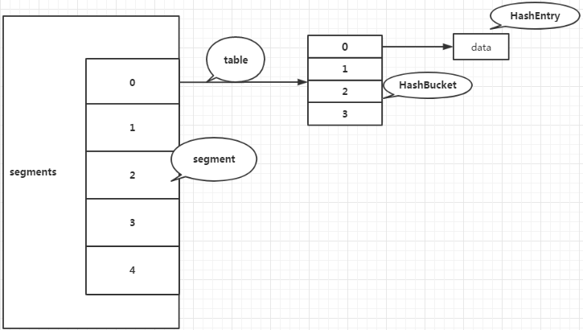
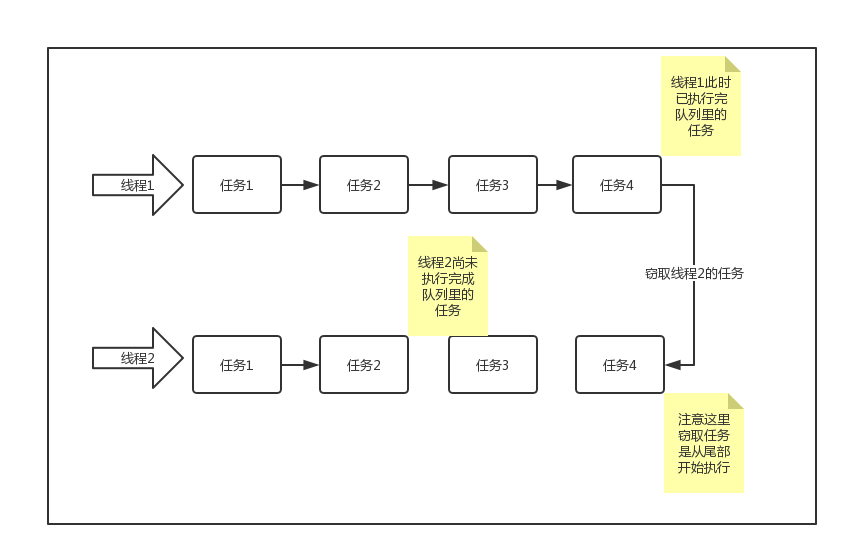
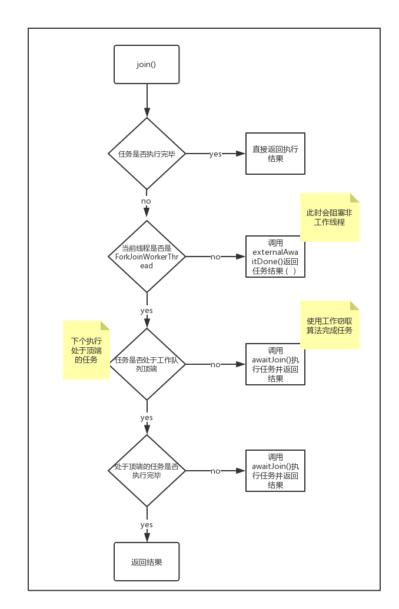

# 第十五章 并发容器集合

## 15.1 同步容器与并发容器

我们知道在java.util包下提供了一些容器类，而Vector和Hashtable是线程安全的容器类，但是这些容器实现同步的方式是通过对方法加锁(sychronized)方式实现的，这样读写均需要锁操作，导致性能低下。

而即使是Vector这样线程安全的类，在面对多线程下的复合操作的时候也是需要通过客户端加锁的方式保证原子性。如下面例子说明:

```java
public class TestVector {
    private Vector<String> vector;

    //方法一
    public  Object getLast(Vector vector) {
        int lastIndex = vector.size() - 1;
        return vector.get(lastIndex);
    }

    //方法二
    public  void deleteLast(Vector vector) {
        int lastIndex = vector.size() - 1;
        vector.remove(lastIndex);
    }

    //方法三
    public  Object getLastSysnchronized(Vector vector) {
        synchronized(vector){
            int lastIndex = vector.size() - 1;
            return vector.get(lastIndex);
        }
    }

    //方法四
    public  void deleteLastSysnchronized(Vector vector) {
        synchronized (vector){
            int lastIndex = vector.size() - 1;
            vector.remove(lastIndex);
        }
    }

}
```

如果方法一和方法二为一个组合的话。那么当方法一获取到了`vector`的size之后，方法二已经执行完毕，这样就导致程序的错误。

如果方法三与方法四组合的话。通过锁机制保证了在`vector`上的操作的原子性。

并发容器是Java 5 提供的在多线程编程下用于代替同步容器，针对不同的应用场景进行设计，提高容器的并发访问性，同时定义了线程安全的复合操作。

## 15.2 并发容器类介绍

整体架构(列举常用的容器类)

其中，阻塞队列（BlockingQueue）在[第十三章](http://concurrent.redspider.group/article/03/13.html)有介绍，CopyOnWrite容器（CopyOnWritexxx）在[第十六章](http://concurrent.redspider.group/article/03/16.html)有介绍，这里不做过多介绍。

下面分别介绍一些常用的并发容器类和接口，因篇幅原因，这里只介绍这些类的用途和基本的原理，不做过多的源码解析。

### 15.2.1 并发Map

#### ConcurrentMap接口

ConcurrentMap接口继承了Map接口，在Map接口的基础上又定义了四个方法：

```java
public interface ConcurrentMap<K, V> extends Map<K, V> {

    //插入元素
    V putIfAbsent(K key, V value);

    //移除元素
    boolean remove(Object key, Object value);

    //替换元素
    boolean replace(K key, V oldValue, V newValue);

    //替换元素
    V replace(K key, V value);

}
```

**putIfAbsent：**与原有put方法不同的是，putIfAbsent方法中如果插入的key相同，则不替换原有的value值；

**remove：**与原有remove方法不同的是，新remove方法中增加了对value的判断，如果要删除的key-value不能与Map中原有的key-value对应上，则不会删除该元素;

**replace(K,V,V)：**增加了对value值的判断，如果key-oldValue能与Map中原有的key-value对应上，才进行替换操作；

**replace(K,V)：**与上面的replace不同的是，此replace不会对Map中原有的key-value进行比较，如果key存在则直接替换；

#### ConcurrentHashMap类

ConcurrentHashMap同HashMap一样也是基于散列表的map，但是它提供了一种与Hashtable完全不同的加锁策略，提供更高效的并发性和伸缩性。

ConcurrentHashMap在JDK 1.7 和JDK 1.8中有一些区别。这里我们分开介绍一下。

**JDK 1.7**

ConcurrentHashMap在JDK 1.7中，提供了一种粒度更细的加锁机制来实现在多线程下更高的性能，这种机制叫分段锁(Lock Striping)。

提供的优点是：在并发环境下将实现更高的吞吐量，而在单线程环境下只损失非常小的性能。

可以这样理解分段锁，就是**将数据分段，对每一段数据分配一把锁**。当一个线程占用锁访问其中一个段数据的时候，其他段的数据也能被其他线程访问。

有些方法需要跨段，比如size()、isEmpty()、containsValue()，它们可能需要锁定整个表而不仅仅是某个段，这需要按顺序锁定所有段，操作完毕后，又按顺序释放所有段的锁。如下图：

ConcurrentHashMap是由Segment数组结构和HashEntry数组结构组成。Segment是一种可重入锁ReentrantLock，HashEntry则用于存储键值对数据。

一个ConcurrentHashMap里包含一个Segment数组，Segment的结构和HashMap类似，是一种数组和链表结构， 一个Segment里包含一个HashEntry数组，每个HashEntry是一个链表结构的元素， 每个Segment守护着一个HashEntry数组里的元素，当对HashEntry数组的数据进行修改时，必须首先获得它对应的Segment锁。

**JDK 1.8**

而在JDK 1.8中，ConcurrentHashMap主要做了两个优化：

- 同HashMap一样，链表也会在长度达到8的时候转化为红黑树，这样可以提升大量冲突时候的查询效率；
- 以某个位置的头结点（链表的头结点或红黑树的root结点）为锁，配合自旋+CAS避免不必要的锁开销，进一步提升并发性能。

#### ConcurrentNavigableMap接口与ConcurrentSkipListMap类

ConcurrentNavigableMap接口继承了NavigableMap接口，这个接口提供了针对给定搜索目标返回最接近匹配项的导航方法。

ConcurrentNavigableMap接口的主要实现类是ConcurrentSkipListMap类。从名字上来看，它的底层使用的是跳表（SkipList）的数据结构。关于跳表的数据结构这里不做太多介绍，它是一种”空间换时间“的数据结构，可以使用CAS来保证并发安全性。

### 15.2.2 并发Queue

JDK并没有提供线程安全的List类，因为对List来说，**很难去开发一个通用并且没有并发瓶颈的线程安全的List**。因为即使简单的读操作，拿contains() 这样一个操作来说，很难想到搜索的时候如何避免锁住整个list。

所以退一步，JDK提供了对队列和双端队列的线程安全的类：[**ConcurrentLinkedQueue**]()和[**ConcurrentLinkedDeque**]()。因为队列相对于List来说，有更多的限制。这两个类是使用CAS来实现线程安全的。

### 15.2.3 并发Set

JDK提供了[**ConcurrentSkipListSet**]()，是线程安全的有序的集合。底层是使用ConcurrentSkipListMap实现。

谷歌的guava框架实现了一个线程安全的ConcurrentHashSet：

```java
Set<String> s = Sets.newConcurrentHashSet();
```

# 第十六章 CopyOnWrite容器

## 16.1 什么是CopyOnWrite容器

在说到CopyOnWrite容器之前我们先来谈谈什么是CopyOnWrite机制，CopyOnWrite是计算机设计领域中的一种优化策略，也是一种在并发场景下常用的设计思想——写入时复制思想。

那什么是写入时复制思想呢？

> 就是当有多个调用者同时去请求一个资源数据的时候，有一个调用者出于某些原因需要对当前的数据源进行修改，这个时候系统将会复制一个当前数据源的副本给调用者修改。

> CopyOnWrite容器即**写时复制的容器**,当我们往一个容器中添加元素的时候，不直接往容器中添加，而是将当前容器进行copy，复制出来一个新的容器，然后向新容器中添加我们需要的元素，最后将原容器的引用指向新容器。

这样做的好处在于，我们可以在并发的场景下对容器进行"读操作"而不需要"加锁"，从而达到读写分离的目的。从JDK 1.5 开始Java并发包里提供了两个使用CopyOnWrite机制实现的并发容器 ，分别是CopyOnWriteArrayList和CopyOnWriteArraySet 。我们着重给大家介绍一下CopyOnWriteArrayList。

## 16.2 CopyOnWriteArrayList

**优点**： CopyOnWriteArrayList经常被用于“读多写少”的并发场景，是因为CopyOnWriteArrayList无需任何同步措施，大大增强了读的性能。在Java中遍历线程非安全的List(如：ArrayList和 LinkedList)的时候，若中途有别的线程对List容器进行修改，那么会抛出ConcurrentModificationException异常。CopyOnWriteArrayList由于其"读写分离"，遍历和修改操作分别作用在不同的List容器，所以在使用迭代器遍历的时候，则不会抛出异常。

**缺点**： 第一个缺点是CopyOnWriteArrayList每次执行写操作都会将原容器进行拷贝一份，数据量大的时候，内存会存在较大的压力，可能会引起频繁Full GC（ZGC因为没有使用Full GC）。比如这些对象占用的内存200M左右，那么再写入100M数据进去，内存就会多占用300M。

第二个缺点是CopyOnWriteArrayList由于实现的原因，写和读分别作用在不同新老容器上，在写操作执行过程中，读不会阻塞，但[**读取到的却是老容器的数据**]()。

现在我们来看一下CopyOnWriteArrayList的add操作源码，它的逻辑很清晰，就是先把原容器进行copy，然后在新的副本上进行“写操作”，最后再切换引用，在此过程中是加了锁的。

```java
public boolean add(E e) {

    // ReentrantLock加锁，保证线程安全
    final ReentrantLock lock = this.lock;
    lock.lock();
    try {
        Object[] elements = getArray();
        int len = elements.length;
        // 拷贝原容器，长度为原容器长度加一
        Object[] newElements = Arrays.copyOf(elements, len + 1);
        // 在新副本上执行添加操作
        newElements[len] = e;
        // 将原容器引用指向新副本
        setArray(newElements);
        return true;
    } finally {
        // 解锁
        lock.unlock();
    }
}
```

我们再来看一下remove操作的源码，remove的逻辑是将要remove元素之外的其他元素拷贝到新的副本中，然后再将原容器的引用指向新的副本中，因为remove操作也是“写操作”所以也是要加锁的。

```java
public E remove(int index) {

        // 加锁
        final ReentrantLock lock = this.lock;
        lock.lock();
        try {
            Object[] elements = getArray();
            int len = elements.length;
            E oldValue = get(elements, index);
            int numMoved = len - index - 1;
            if (numMoved == 0)
                // 如果要删除的是列表末端数据，拷贝前len-1个数据到新副本上，再切换引用
                setArray(Arrays.copyOf(elements, len - 1));
            else {
                // 否则，将要删除元素之外的其他元素拷贝到新副本中，并切换引用
                Object[] newElements = new Object[len - 1];
                System.arraycopy(elements, 0, newElements, 0, index);
                System.arraycopy(elements, index + 1, newElements, index,
                                 numMoved);
                setArray(newElements);
            }
            return oldValue;
        } finally {
            // 解锁
            lock.unlock();
        }
    }
```

我们再来看看CopyOnWriteArrayList效率最高的读操作的源码

```java
public E get(int index) {
    return get(getArray(), index);
}
 private E get(Object[] a, int index) {
     return (E) a[index];
 }
```

由上可见“读操作”是没有加锁，直接读取。

## 16.3 CopyOnWrite的业务中实现

接下来，我们结合具体业务场景来实现一个CopyOnWriteMap的并发容器并且使用它。

```java
import java.util.Collection;
import java.util.Map;
import java.util.Set;

public class CopyOnWriteMap<K, V> implements Map<K, V>, Cloneable {
    private volatile Map<K, V> internalMap;

    public CopyOnWriteMap() {
        internalMap = new HashMap<K, V>();
    }

    public V put(K key, V value) {
        synchronized (this) {
            Map<K, V> newMap = new HashMap<K, V>(internalMap);
            V val = newMap.put(key, value);
            internalMap = newMap;
            return val;
        }
    }

    public V get(Object key) {
        return internalMap.get(key);
    }

    public void putAll(Map<? extends K, ? extends V> newData) {
        synchronized (this) {
            Map<K, V> newMap = new HashMap<K, V>(internalMap);
            newMap.putAll(newData);
            internalMap = newMap;
        }
    }
}
```

上面就是参考CopyOnWriteArrayList实现的CopyOnWriteMap，我们可以用这个容器来做什么呢？结合我们之前说的CopyOnWrite的复制思想，它最适用于“读多写少”的并发场景。

**场景：**假如我们有一个搜索的网站需要屏蔽一些“关键字”，“黑名单”每晚定时更新，每当用户搜索的时候，“黑名单”中的关键字不会出现在搜索结果当中，并且提示用户敏感字。

```java
// 黑名单服务
public class BlackListServiceImpl {
    //　减少扩容开销。根据实际需要，初始化CopyOnWriteMap的大小，避免写时CopyOnWriteMap扩容的开销。
    private static CopyOnWriteMap<String, Boolean> blackListMap = 
        new CopyOnWriteMap<String, Boolean>(1000);

    public static boolean isBlackList(String id) {
        return blackListMap.get(id) == null ? false : true;
    }

    public static void addBlackList(String id) {
        blackListMap.put(id, Boolean.TRUE);
    }

    /**
     * 批量添加黑名单
     * (使用批量添加。因为每次添加，容器每次都会进行复制，所以减少添加次数，可以减少容器的复制次数。
     * 如使用上面代码里的addBlackList方法)
     * @param ids
     */
    public static void addBlackList(Map<String,Boolean> ids) {
        blackListMap.putAll(ids);
    }

}
```

这里需要各位小伙伴特别特别注意一个问题，此处的场景是每晚凌晨“黑名单”定时更新，原因是CopyOnWrite容器有**数据一致性**的问题，它只能保证**最终数据一致性**。

所以如果我们希望写入的数据马上能准确地读取，请不要使用CopyOnWrite容器。

# 第十七章 通信工具类

JDK中提供了一些工具类以供开发者使用。这样的话我们在遇到一些常见的应用场景时就可以使用这些工具类，而不用自己再重复造轮子了。

它们都在java.util.concurrent包下。先总体概括一下都有哪些工具类，它们有什么作用，然后再分别介绍它们的主要使用方法和原理。

| 类             | 作用                                       |
| -------------- | ------------------------------------------ |
| Semaphore      | 限制线程的数量                             |
| Exchanger      | 两个线程交换数据                           |
| CountDownLatch | 线程等待直到计数器减为0时开始工作          |
| CyclicBarrier  | 作用跟CountDownLatch类似，但是可以重复使用 |
| Phaser         | 增强的CyclicBarrier                        |

下面分别介绍这几个类。

## 17.1 Semaphore

### 17.1.1 Semaphore介绍

Semaphore翻译过来是信号的意思。顾名思义，这个工具类提供的功能就是多个线程彼此“打信号”。而这个“信号”是一个`int`类型的数据，也可以看成是一种“资源”。

可以在构造函数中传入初始资源总数，以及是否使用“公平”的同步器。默认情况下，是非公平的。

```java
// 默认情况下使用非公平
public Semaphore(int permits) {
    sync = new NonfairSync(permits);
}

public Semaphore(int permits, boolean fair) {
    sync = fair ? new FairSync(permits) : new NonfairSync(permits);
}
```

最主要的方法是acquire方法和release方法。acquire()方法会申请一个permit，而release方法会释放一个permit。当然，你也可以申请多个acquire(int permits)或者释放多个release(int permits)。

每次acquire，permits就会减少一个或者多个。如果减少到了0，再有其他线程来acquire，那就要阻塞这个线程直到有其它线程release permit为止。

### 17.1.2 Semaphore案例

Semaphore往往用于资源有限的场景中，去限制线程的数量。举个例子，我想限制同时只能有3个线程在工作：

```java
public class SemaphoreDemo {
    static class MyThread implements Runnable {

        private int value;
        private Semaphore semaphore;

        public MyThread(int value, Semaphore semaphore) {
            this.value = value;
            this.semaphore = semaphore;
        }

        @Override
        public void run() {
            try {
                semaphore.acquire(); // 获取permit
                System.out.println(String.format("当前线程是%d, 还剩%d个资源，还有%d个线程在等待",
                        value, semaphore.availablePermits(), semaphore.getQueueLength()));
                // 睡眠随机时间，打乱释放顺序
                Random random =new Random();
                Thread.sleep(random.nextInt(1000));
                System.out.println(String.format("线程%d释放了资源", value));
            } catch (InterruptedException e) {
                e.printStackTrace();
            } finally{
                semaphore.release(); // 释放permit
            }
        }
    }

    public static void main(String[] args) {
        Semaphore semaphore = new Semaphore(3);
        for (int i = 0; i < 10; i++) {
            new Thread(new MyThread(i, semaphore)).start();
        }
    }
}
```

输出：

> 当前线程是1, 还剩2个资源，还有0个线程在等待
> 当前线程是0, 还剩1个资源，还有0个线程在等待
> 当前线程是6, 还剩0个资源，还有0个线程在等待
> 线程6释放了资源
> 当前线程是2, 还剩0个资源，还有6个线程在等待
> 线程2释放了资源
> 当前线程是4, 还剩0个资源，还有5个线程在等待
> 线程0释放了资源
> 当前线程是7, 还剩0个资源，还有4个线程在等待
> 线程1释放了资源
> 当前线程是8, 还剩0个资源，还有3个线程在等待
> 线程7释放了资源
> 当前线程是5, 还剩0个资源，还有2个线程在等待
> 线程4释放了资源
> 当前线程是3, 还剩0个资源，还有1个线程在等待
> 线程8释放了资源
> 当前线程是9, 还剩0个资源，还有0个线程在等待
> 线程9释放了资源
> 线程5释放了资源
> 线程3释放了资源

可以看到，在这次运行中，最开始是1, 0, 6这三个线程获得了资源，而其它线程进入了等待队列。然后当某个线程释放资源后，就会有等待队列中的线程获得资源。

当然，Semaphore默认的acquire方法是会让线程进入等待队列，且会抛出中断异常。但它还有一些方法可以忽略中断或不进入阻塞队列：

```java
// 忽略中断
public void acquireUninterruptibly()
public void acquireUninterruptibly(int permits)

// 不进入等待队列，底层使用CAS
public boolean tryAcquire
public boolean tryAcquire(int permits)
public boolean tryAcquire(int permits, long timeout, TimeUnit unit)
        throws InterruptedException
public boolean tryAcquire(long timeout, TimeUnit unit)
```

### 17.1.3 Semaphore原理

Semaphore内部有一个继承了AQS的同步器Sync，重写了`tryAcquireShared`方法。在这个方法里，会去尝试获取资源。

如果获取失败（想要的资源数量小于目前已有的资源数量），就会返回一个负数（代表尝试获取资源失败）。然后当前线程就会进入AQS的等待队列。

## 17.2 Exchanger

Exchanger类用于两个线程交换数据。它支持泛型，也就是说你可以在两个线程之间传送任何数据。先来一个案例看看如何使用，比如两个线程之间想要传送字符串：

```java
public class ExchangerDemo {
    public static void main(String[] args) throws InterruptedException {
        Exchanger<String> exchanger = new Exchanger<>();

        new Thread(() -> {
            try {
                System.out.println("这是线程A，得到了另一个线程的数据："
                        + exchanger.exchange("这是来自线程A的数据"));
            } catch (InterruptedException e) {
                e.printStackTrace();
            }
        }).start();

        System.out.println("这个时候线程A是阻塞的，在等待线程B的数据");
        Thread.sleep(1000);

        new Thread(() -> {
            try {
                System.out.println("这是线程B，得到了另一个线程的数据："
                        + exchanger.exchange("这是来自线程B的数据"));
            } catch (InterruptedException e) {
                e.printStackTrace();
            }
        }).start();
    }
}
```

输出：

> 这个时候线程A是阻塞的，在等待线程B的数据
> 这是线程B，得到了另一个线程的数据：这是来自线程A的数据
> 这是线程A，得到了另一个线程的数据：这是来自线程B的数据

可以看到，当一个线程调用exchange方法后，它是处于阻塞状态的，只有当另一个线程也调用了exchange方法，它才会继续向下执行。看源码可以发现它是使用park/unpark来实现等待状态的切换的，但是在使用park/unpark方法之前，使用了CAS检查，估计是为了提高性能。

Exchanger一般用于两个线程之间更方便地在内存中交换数据，因为其支持泛型，所以我们可以传输任何的数据，比如IO流或者IO缓存。根据JDK里面的注释的说法，可以总结为一下特性：

- 此类提供对外的操作是同步的；
- 用于成对出现的线程之间交换数据；
- 可以视作双向的同步队列；
- 可应用于基因算法、流水线设计等场景。

Exchanger类还有一个有超时参数的方法，如果在指定时间内没有另一个线程调用exchange，就会抛出一个超时异常。

```java
public V exchange(V x, long timeout, TimeUnit unit)
```

那么问题来了，Exchanger只能是两个线程交换数据吗？那三个调用同一个实例的exchange方法会发生什么呢？答案是只有前两个线程会交换数据，第三个线程会进入阻塞状态。

需要注意的是，exchange是可以重复使用的。也就是说。两个线程可以使用Exchanger在内存中不断地再交换数据。

## 17.3 CountDownLatch

### 17.3.1 CountDownLatch介绍

先来解读一下CountDownLatch这个类名字的意义。CountDown代表计数递减，Latch是“门闩”的意思。也有人把它称为“屏障”。而CountDownLatch这个类的作用也很贴合这个名字的意义，假设某个线程在执行任务之前，需要等待其它线程完成一些前置任务，必须等所有的前置任务都完成，才能开始执行本线程的任务。

CountDownLatch的方法也很简单，如下：

```java
// 构造方法：
public CountDownLatch(int count)

public void await() // 等待
public boolean await(long timeout, TimeUnit unit) // 超时等待
public void countDown() // count - 1
public long getCount() // 获取当前还有多少count
```

### 17.3.2 CountDownLatch案例

我们知道，玩游戏的时候，在游戏真正开始之前，一般会等待一些前置任务完成，比如“加载地图数据”，“加载人物模型”，“加载背景音乐”等等。只有当所有的东西都加载完成后，玩家才能真正进入游戏。下面我们就来模拟一下这个demo。

```java
public class CountDownLatchDemo {
    // 定义前置任务线程
    static class PreTaskThread implements Runnable {

        private String task;
        private CountDownLatch countDownLatch;

        public PreTaskThread(String task, CountDownLatch countDownLatch) {
            this.task = task;
            this.countDownLatch = countDownLatch;
        }

        @Override
        public void run() {
            try {
                Random random = new Random();
                Thread.sleep(random.nextInt(1000));
                System.out.println(task + " - 任务完成");
                countDownLatch.countDown();
            } catch (InterruptedException e) {
                e.printStackTrace();
            }
        }
    }

    public static void main(String[] args) {
        // 假设有三个模块需要加载
        CountDownLatch countDownLatch = new CountDownLatch(3);

        // 主任务
        new Thread(() -> {
            try {
                System.out.println("等待数据加载...");
                System.out.println(String.format("还有%d个前置任务", countDownLatch.getCount()));
                countDownLatch.await();
                System.out.println("数据加载完成，正式开始游戏！");
            } catch (InterruptedException e) {
                e.printStackTrace();
            }
        }).start();

        // 前置任务
        new Thread(new PreTaskThread("加载地图数据", countDownLatch)).start();
        new Thread(new PreTaskThread("加载人物模型", countDownLatch)).start();
        new Thread(new PreTaskThread("加载背景音乐", countDownLatch)).start();
    }
}
```

输出：

> 等待数据加载...
> 还有3个前置任务
> 加载人物模型 - 任务完成
> 加载背景音乐 - 任务完成
> 加载地图数据 - 任务完成
> 数据加载完成，正式开始游戏！

### 17.3.3 CountDownLatch原理

其实CountDownLatch类的原理挺简单的，内部同样是一个继承了AQS的实现类Sync，且实现起来还很简单，可能是JDK里面AQS的子类中最简单的实现了，有兴趣的读者可以去看看这个内部类的源码。

需要注意的是构造器中的**计数值（count）实际上就是闭锁需要等待的线程数量**。这个值只能被设置一次，而且CountDownLatch**没有提供任何机制去重新设置这个计数值**。

## 17.4 CyclicBarrier

### 17.4.1 CyclicBarrier介绍

CyclicBarrirer从名字上来理解是“循环的屏障”的意思。前面提到了CountDownLatch一旦计数值`count`被降为0后，就不能再重新设置了，它只能起一次“屏障”的作用。而CyclicBarrier拥有CountDownLatch的所有功能，还可以使用`reset()`方法重置屏障。

### 17.4.2 CyclicBarrier Barrier被破坏

如果参与者（线程）在等待的过程中，Barrier被破坏，就会抛出BrokenBarrierException。可以用`isBroken()`方法检测Barrier是否被破坏。

1. 如果有线程已经处于等待状态，调用reset方法会导致已经在等待的线程出现BrokenBarrierException异常。并且由于出现了BrokenBarrierException，将会导致始终无法等待。
2. 如果在等待的过程中，线程被中断，会抛出InterruptedException异常，并且这个异常会传播到其他所有的线程。
3. 如果在执行屏障操作过程中发生异常，则该异常将传播到当前线程中，其他线程会抛出BrokenBarrierException，屏障被损坏。
4. 如果超出指定的等待时间，当前线程会抛出 TimeoutException 异常，其他线程会抛出BrokenBarrierException异常。

### 17.4.3 CyclicBarrier案例

我们同样用玩游戏的例子。如果玩一个游戏有多个“关卡”，那使用CountDownLatch显然不太合适，那需要为每个关卡都创建一个实例。那我们可以使用CyclicBarrier来实现每个关卡的数据加载等待功能。

```java
public class CyclicBarrierDemo {
    static class PreTaskThread implements Runnable {

        private String task;
        private CyclicBarrier cyclicBarrier;

        public PreTaskThread(String task, CyclicBarrier cyclicBarrier) {
            this.task = task;
            this.cyclicBarrier = cyclicBarrier;
        }

        @Override
        public void run() {
            // 假设总共三个关卡
            for (int i = 1; i < 4; i++) {
                try {
                    Random random = new Random();
                    Thread.sleep(random.nextInt(1000));
                    System.out.println(String.format("关卡%d的任务%s完成", i, task));
                    cyclicBarrier.await();
                } catch (InterruptedException | BrokenBarrierException e) {
                    e.printStackTrace();
                }
                cyclicBarrier.reset(); // 重置屏障
            }
        }
    }

    public static void main(String[] args) {
        CyclicBarrier cyclicBarrier = new CyclicBarrier(3, () -> {
            System.out.println("本关卡所有前置任务完成，开始游戏...");
        });

        new Thread(new PreTaskThread("加载地图数据", cyclicBarrier)).start();
        new Thread(new PreTaskThread("加载人物模型", cyclicBarrier)).start();
        new Thread(new PreTaskThread("加载背景音乐", cyclicBarrier)).start();
    }
}
```

输出：

> 关卡1的任务加载地图数据完成
> 关卡1的任务加载背景音乐完成
> 关卡1的任务加载人物模型完成
> 本关卡所有前置任务完成，开始游戏...
> 关卡2的任务加载地图数据完成
> 关卡2的任务加载背景音乐完成
> 关卡2的任务加载人物模型完成
> 本关卡所有前置任务完成，开始游戏...
> 关卡3的任务加载人物模型完成
> 关卡3的任务加载地图数据完成
> 关卡3的任务加载背景音乐完成
> 本关卡所有前置任务完成，开始游戏...

注意这里跟CountDownLatch的代码有一些不同。CyclicBarrier没有分为`await()`和`countDown()`，而是只有单独的一个`await()`方法。

一旦调用await()方法的线程数量等于构造方法中传入的任务总量（这里是3），就代表达到屏障了。CyclicBarrier允许我们在达到屏障的时候可以执行一个任务，可以在构造方法传入一个Runnable类型的对象。上述案例就是在达到屏障时，输出“本关卡所有前置任务完成，开始游戏...”。

```java
// 构造方法
public CyclicBarrier(int parties) {
    this(parties, null);
}
public CyclicBarrier(int parties, Runnable barrierAction) {
    // 具体实现
}
```

### 17.4.4 CyclicBarrier原理

CyclicBarrier虽说功能与CountDownLatch类似，但是实现原理却完全不同，CyclicBarrier内部使用的是Lock + Condition实现的等待/通知模式。详情可以查看这个方法的源码：

```java
private int dowait(boolean timed, long nanos)
```

## 17.5 Phaser

### 17.5.1 Phaser介绍

Phaser这个单词是“移相器，相位器”的意思（好吧，笔者并不懂这是什么玩意，下方资料来自百度百科）。这个类是从JDK 1.7 中出现的。

> 移相器（Phaser）能够对波的相位进行调整的一种装置。任何传输介质对在其中传导的波动都会引入相移，这是早期模拟移相器的原理；现代电子技术发展后利用A/D、D/A转换实现了数字移相，顾名思义，它是一种不连续的移相技术，但特点是移相精度高。 移相器在雷达、导弹姿态控制、加速器、通信、仪器仪表甚至于音乐等领域都有着广泛的应用

Phaser类有点复杂，这里只介绍一些基本的用法和知识点。详情可以查看JDK文档，文档里有这个类非常详尽的介绍。

前面我们介绍了CyclicBarrier，可以发现它在构造方法里传入“任务总量”`parties`之后，就不能修改这个值了，并且每次调用`await()`方法也只能消耗一个`parties`计数。但Phaser可以动态地调整任务总量！

名词解释：

- party：对应一个线程，数量可以通过register或者构造参数传入;
- arrive：对应一个party的状态，初始时是unarrived，当调用`arriveAndAwaitAdvance()`或者 `arriveAndDeregister()`进入arrive状态，可以通过`getUnarrivedParties()`获取当前未到达的数量;
- register：注册一个party，每一阶段必须所有注册的party都到达才能进入下一阶段;
- deRegister：减少一个party。
- phase：阶段，当所有注册的party都arrive之后，将会调用Phaser的`onAdvance()`方法来判断是否要进入下一阶段。

Phaser终止的两种途径，Phaser维护的线程执行完毕或者`onAdvance()`返回`true` 此外Phaser还能维护一个树状的层级关系，构造的时候new Phaser(parentPhaser)，对于Task执行时间短的场景（竞争激烈），也就是说有大量的**party**, 那可以把每个Phaser的任务量设置较小，多个Phaser共同继承一个父Phaser。

> Phasers with large numbers of parties that would otherwise experience heavy synchronization contention costs may instead be set up so that groups of sub-phasers share a common parent. This may greatly increase throughput even though it incurs greater per-operation overhead.
>
> 翻译：如果有大量的party，那许多线程可能同步的竞争成本比较高。所以可以拆分成多个子Phaser共享一个共同的父Phaser。这可能会大大增加吞吐量，即使它会带来更多的每次操作开销。

### 17.5.2 Phaser案例

还是游戏的案例。假设我们游戏有三个关卡，但只有第一个关卡有新手教程，需要加载新手教程模块。但后面的第二个关卡和第三个关卡都不需要。我们可以用Phaser来做这个需求。

代码：

```java
public class PhaserDemo {
    static class PreTaskThread implements Runnable {

        private String task;
        private Phaser phaser;

        public PreTaskThread(String task, Phaser phaser) {
            this.task = task;
            this.phaser = phaser;
        }

        @Override
        public void run() {
            for (int i = 1; i < 4; i++) {
                try {
                    // 第二次关卡起不加载NPC，跳过
                    if (i >= 2 && "加载新手教程".equals(task)) {
                        continue;
                    }
                    Random random = new Random();
                    Thread.sleep(random.nextInt(1000));
                    System.out.println(String.format("关卡%d，需要加载%d个模块，当前模块【%s】",
                            i, phaser.getRegisteredParties(), task));

                    // 从第二个关卡起，不加载NPC
                    if (i == 1 && "加载新手教程".equals(task)) {
                        System.out.println("下次关卡移除加载【新手教程】模块");
                        phaser.arriveAndDeregister(); // 移除一个模块
                    } else {
                        phaser.arriveAndAwaitAdvance();
                    }
                } catch (InterruptedException e) {
                    e.printStackTrace();
                }
            }
        }
    }

    public static void main(String[] args) {
        Phaser phaser = new Phaser(4) {
            @Override
            protected boolean onAdvance(int phase, int registeredParties) {
                System.out.println(String.format("第%d次关卡准备完成", phase + 1));
                return phase == 3 || registeredParties == 0;
            }
        };

        new Thread(new PreTaskThread("加载地图数据", phaser)).start();
        new Thread(new PreTaskThread("加载人物模型", phaser)).start();
        new Thread(new PreTaskThread("加载背景音乐", phaser)).start();
        new Thread(new PreTaskThread("加载新手教程", phaser)).start();
    }
}
```

输出：

> 关卡1，需要加载4个模块，当前模块【加载背景音乐】
> 关卡1，需要加载4个模块，当前模块【加载新手教程】
> 下次关卡移除加载【新手教程】模块
> 关卡1，需要加载3个模块，当前模块【加载地图数据】
> 关卡1，需要加载3个模块，当前模块【加载人物模型】
> 第1次关卡准备完成
> 关卡2，需要加载3个模块，当前模块【加载地图数据】
> 关卡2，需要加载3个模块，当前模块【加载背景音乐】
> 关卡2，需要加载3个模块，当前模块【加载人物模型】
> 第2次关卡准备完成
> 关卡3，需要加载3个模块，当前模块【加载人物模型】
> 关卡3，需要加载3个模块，当前模块【加载地图数据】
> 关卡3，需要加载3个模块，当前模块【加载背景音乐】
> 第3次关卡准备完成

这里要注意关卡1的输出，在“加载新手教程”线程中调用了`arriveAndDeregister()`减少一个party之后，后面的线程使用`getRegisteredParties()`得到的是已经被修改后的parties了。但是当前这个阶段(phase)，仍然是需要4个parties都arrive才触发屏障的。从下一个阶段开始，才需要3个parties都arrive就触发屏障。

另外Phaser类用来控制某个阶段的线程数量很有用，但它并在意这个阶段具体有哪些线程arrive，只要达到它当前阶段的parties值，就触发屏障。所以我这里的案例虽然制定了特定的线程（加载新手教程）来更直观地表述Phaser的功能，但是其实Phaser是没有分辨具体是哪个线程的功能的，它在意的只是数量，这一点需要读者注意。

### 17.5.3 Phaser原理

Phaser类的原理相比起来要复杂得多。它内部使用了两个基于Fork-Join框架的原子类辅助：

```java
private final AtomicReference<QNode> evenQ;
private final AtomicReference<QNode> oddQ;

static final class QNode implements ForkJoinPool.ManagedBlocker {
    // 实现代码
}
```

有兴趣的读者可以去看看JDK源代码，这里不做过多叙述。

总的来说，CountDownLatch，CyclicBarrier，Phaser是一个比一个强大，但也一个比一个复杂。根据自己的业务需求合理选择即可。

# 第十八章 Fork/Join框架

## 18.1 什么是Fork/Join

Fork/Join框架是一个实现了ExecutorService接口的多线程处理器，它专为那些可以通过递归分解成更细小的任务而设计，最大化的利用多核处理器来提高应用程序的性能。

与其他ExecutorService相关的实现相同的是，Fork/Join框架会将任务分配给线程池中的线程。而与之不同的是，Fork/Join框架在执行任务时使用了**工作窃取算法**。

**fork**在英文里有分叉的意思，**join**在英文里连接、结合的意思。顾名思义，fork就是要使一个大任务分解成若干个小任务，而join就是最后将各个小任务的结果结合起来得到大任务的结果。

Fork/Join的运行流程大致如下所示：


需要注意的是，图里的次级子任务可以一直分下去，一直分到子任务足够小为止。用伪代码来表示如下：

```pseudocode
solve(任务):
    if(任务已经划分到足够小):
        顺序执行任务
    else:
        for(划分任务得到子任务)
            solve(子任务)
        结合所有子任务的结果到上一层循环
        return 最终结合的结果
```

通过上面伪代码可以看出，我们通过递归嵌套的计算得到最终结果，这里有体现**分而治之(divide and conquer)** 的算法思想。

## 18.2 工作窃取算法

工作窃取算法指的是在多线程执行不同任务队列的过程中，某个线程执行完自己队列的任务后从其他线程的任务队列里窃取任务来执行。

工作窃取流程如下图所示：



值得注意的是，当一个线程窃取另一个线程的时候，为了减少两个任务线程之间的竞争，我们通常使用**双端队列**来存储任务。被窃取的任务线程都从双端队列的**头部**拿任务执行，而窃取其他任务的线程从双端队列的**尾部**执行任务。

另外，当一个线程在窃取任务时要是没有其他可用的任务了，这个线程会进入**阻塞状态**以等待再次“工作”。

## 18.3 Fork/Join的具体实现

前面我们说Fork/Join框架简单来讲就是对任务的分割与子任务的合并，所以要实现这个框架，先得有**任务**。在Fork/Join框架里提供了抽象类`ForkJoinTask`来实现任务。

### 18.3.1 ForkJoinTask

ForkJoinTask是一个类似普通线程的实体，但是比普通线程轻量得多。

**fork()方法**:使用线程池中的空闲线程异步提交任务

```java
// 本文所有代码都引自Java 8
public final ForkJoinTask<V> fork() {
    Thread t;
    // ForkJoinWorkerThread是执行ForkJoinTask的专有线程，由ForkJoinPool管理
    // 先判断当前线程是否是ForkJoin专有线程，如果是，则将任务push到当前线程所负责的队列里去
    if ((t = Thread.currentThread()) instanceof ForkJoinWorkerThread)
        ((ForkJoinWorkerThread)t).workQueue.push(this);
    else
         // 如果不是则将线程加入队列
        // 没有显式创建ForkJoinPool的时候走这里，提交任务到默认的common线程池中
        ForkJoinPool.common.externalPush(this);
    return this;
}
```

其实fork()只做了一件事，那就是**把任务推入当前工作线程的工作队列里**。

**join()方法**：等待处理任务的线程处理完毕，获得返回值。

来看下join()的源码：

```java
public final V join() {
    int s;
    // doJoin()方法来获取当前任务的执行状态
    if ((s = doJoin() & DONE_MASK) != NORMAL)
        // 任务异常，抛出异常
        reportException(s);
    // 任务正常完成，获取返回值
    return getRawResult();
}

/**
 * doJoin()方法用来返回当前任务的执行状态
 **/
private int doJoin() {
    int s; Thread t; ForkJoinWorkerThread wt; ForkJoinPool.WorkQueue w;
    // 先判断任务是否执行完毕，执行完毕直接返回结果（执行状态）
    return (s = status) < 0 ? s :
    // 如果没有执行完毕，先判断是否是ForkJoinWorkThread线程
    ((t = Thread.currentThread()) instanceof ForkJoinWorkerThread) ?
        // 如果是，先判断任务是否处于工作队列顶端（意味着下一个就执行它）
        // tryUnpush()方法判断任务是否处于当前工作队列顶端，是返回true
        // doExec()方法执行任务
        (w = (wt = (ForkJoinWorkerThread)t).workQueue).
        // 如果是处于顶端并且任务执行完毕，返回结果
        tryUnpush(this) && (s = doExec()) < 0 ? s :
        // 如果不在顶端或者在顶端却没未执行完毕，那就调用awitJoin()执行任务
        // awaitJoin()：使用自旋使任务执行完成，返回结果
        wt.pool.awaitJoin(w, this, 0L) :
    // 如果不是ForkJoinWorkThread线程，执行externalAwaitDone()返回任务结果
    externalAwaitDone();
}
```

我们在之前介绍过说Thread.join()会使线程阻塞，而ForkJoinPool.join()会使线程免于阻塞，下面是ForkJoinPool.join()的流程图：

**RecursiveAction和RecursiveTask**

通常情况下，在创建任务的时候我们一般不直接继承ForkJoinTask，而是继承它的子类**RecursiveAction**和**RecursiveTask**。

两个都是ForkJoinTask的子类，**RecursiveAction可以看做是无返回值的ForkJoinTask，RecursiveTask是有返回值的ForkJoinTask**。

此外，两个子类都有执行主要计算的方法compute()，当然，RecursiveAction的compute()返回void，RecursiveTask的compute()有具体的返回值。

### 18.3.2 ForkJoinPool

ForkJoinPool是用于执行ForkJoinTask任务的执行（线程）池。

ForkJoinPool管理着执行池中的线程和任务队列，此外，执行池是否还接受任务，显示线程的运行状态也是在这里处理。

我们来大致看下ForkJoinPool的源码：

```java
@sun.misc.Contended
public class ForkJoinPool extends AbstractExecutorService {
    // 任务队列
    volatile WorkQueue[] workQueues;   

    // 线程的运行状态
    volatile int runState;  

    // 创建ForkJoinWorkerThread的默认工厂，可以通过构造函数重写
    public static final ForkJoinWorkerThreadFactory defaultForkJoinWorkerThreadFactory;

    // 公用的线程池，其运行状态不受shutdown()和shutdownNow()的影响
    static final ForkJoinPool common;

    // 私有构造方法，没有任何安全检查和参数校验，由makeCommonPool直接调用
    // 其他构造方法都是源自于此方法
    // parallelism: 并行度，
    // 默认调用java.lang.Runtime.availableProcessors() 方法返回可用处理器的数量
    private ForkJoinPool(int parallelism,
                         ForkJoinWorkerThreadFactory factory, // 工作线程工厂
                         UncaughtExceptionHandler handler, // 拒绝任务的handler
                         int mode, // 同步模式
                         String workerNamePrefix) { // 线程名prefix
        this.workerNamePrefix = workerNamePrefix;
        this.factory = factory;
        this.ueh = handler;
        this.config = (parallelism & SMASK) | mode;
        long np = (long)(-parallelism); // offset ctl counts
        this.ctl = ((np << AC_SHIFT) & AC_MASK) | ((np << TC_SHIFT) & TC_MASK);
    }

}
```

#### WorkQueue

双端队列，ForkJoinTask存放在这里。

当工作线程在处理自己的工作队列时，会从队列首取任务来执行（FIFO）；如果是窃取其他队列的任务时，窃取的任务位于所属任务队列的队尾（LIFO）。

ForkJoinPool与传统线程池最显著的区别就是它维护了一个**工作队列数组**（volatile WorkQueue[] workQueues，ForkJoinPool中的**每个工作线程都维护着一个工作队列**）。

#### runState

ForkJoinPool的运行状态。**SHUTDOWN**状态用负数表示，其他用2的幂次表示。

## 18.4 Fork/Join的使用

上面我们说ForkJoinPool负责管理线程和任务，ForkJoinTask实现fork和join操作，所以要使用Fork/Join框架就离不开这两个类了，只是在实际开发中我们常用ForkJoinTask的子类RecursiveTask 和RecursiveAction来替代ForkJoinTask。

下面我们用一个计算斐波那契数列第n项的例子来看一下Fork/Join的使用：

> 斐波那契数列数列是一个线性递推数列，从第三项开始，每一项的值都等于前两项之和：
>
> 1, 1, 2, 3, 5, 8, 13, 21, 34, 55, 89······
>
> 如果设f(n）为该数列的第n项（n∈N*），那么有：f(n) = f(n-1) + f(n-2)。

```java
public class FibonacciTest {

    class Fibonacci extends RecursiveTask<Integer> {

        int n;

        public Fibonacci(int n) {
            this.n = n;
        }

        // 主要的实现逻辑都在compute()里
        @Override
        protected Integer compute() {
            // 这里先假设 n >= 0
            if (n <= 1) {
                return n;
            } else {
                // f(n-1)
                Fibonacci f1 = new Fibonacci(n - 1);
                f1.fork();
                // f(n-2)
                Fibonacci f2 = new Fibonacci(n - 2);
                f2.fork();
                // f(n) = f(n-1) + f(n-2)
                return f1.join() + f2.join();
            }
        }
    }

    @Test
    public void testFib() throws ExecutionException, InterruptedException {
        ForkJoinPool forkJoinPool = new ForkJoinPool();
        System.out.println("CPU核数：" + Runtime.getRuntime().availableProcessors());
        long start = System.currentTimeMillis();
        Fibonacci fibonacci = new Fibonacci(40);
        Future<Integer> future = forkJoinPool.submit(fibonacci);
        System.out.println(future.get());
        long end = System.currentTimeMillis();
        System.out.println(String.format("耗时：%d millis", end - start));
    }


}
```

上面例子在本机的输出：

```
CPU核数：4
计算结果：102334155
耗时：9490 millis
```

需要注意的是，上述计算时间复杂度为`O(2^n)`，随着n的增长计算效率会越来越低，这也是上面的例子中n不敢取太大的原因。

此外，也并不是所有的任务都适合Fork/Join框架，比如上面的例子任务划分过于细小反而体现不出效率，下面我们试试用普通的递归来求f(n)的值，看看是不是要比使用Fork/Join快：

```java
// 普通递归，复杂度为O(2^n)
public int plainRecursion(int n) {
    if (n == 1 || n == 2) {
        return 1;
    } else {
        return plainRecursion(n -1) + plainRecursion(n - 2);
    }
}

@Test
public void testPlain() {
    long start = System.currentTimeMillis();
    int result = plainRecursion(40);
    long end = System.currentTimeMillis();
    System.out.println("计算结果:" + result);
    System.out.println(String.format("耗时：%d millis",  end -start));
}
```

普通递归的例子输出：

```
计算结果:102334155
耗时：436 millis
```

通过输出可以很明显的看出来，使用普通递归的效率都要比使用Fork/Join框架要高很多。

这里我们再用另一种思路来计算：

```java
// 通过循环来计算，复杂度为O(n)
private int computeFibonacci(int n) {
    // 假设n >= 0
    if (n <= 1) {
        return n;
    } else {
        int first = 1;
        int second = 1;
        int third = 0;
        for (int i = 3; i <= n; i ++) {
            // 第三个数是前两个数之和
            third = first + second;
            // 前两个数右移
            first = second;
            second = third;
        }
        return third;
    }
}

@Test
public void testComputeFibonacci() {
    long start = System.currentTimeMillis();
    int result = computeFibonacci(40);
    long end = System.currentTimeMillis();
    System.out.println("计算结果:" + result);
    System.out.println(String.format("耗时：%d millis",  end -start));
}
```

上面例子在笔者所用电脑的输出为：

```
计算结果:102334155
耗时：0 millis
```

这里耗时为0不代表没有耗时，是表明这里计算的耗时几乎可以忽略不计，大家可以在自己的电脑试试，即使是n取大很多量级的数据（注意int溢出的问题）耗时也是很短的，或者可以用System.nanoTime()统计纳秒的时间。

为什么在这里普通的递归或循环效率更快呢？因为Fork/Join是使用多个线程协作来计算的，所以会有线程通信和线程切换的开销。

如果要计算的任务比较简单（比如我们案例中的斐波那契数列），那当然是直接使用单线程会更快一些。但如果要计算的东西比较复杂，计算机又是多核的情况下，就可以充分利用多核CPU来提高计算速度。

另外，Java 8 Stream的并行操作底层就是用到了Fork/Join框架，下一章我们将从源码及案例两方面介绍Java 8 Stream的并行操作。

# 第十九章 Java 8 Stream并行计算原理

## 19.1 Java 8 Stream简介

从Java 8 开始，我们可以使用`Stream`接口以及**lambda表达式**进行“流式计算”。它可以让我们对集合的操作更加简洁、更加可读、更加高效。

Stream接口有非常多用于集合计算的方法，比如判空操作empty、过滤操作filter、求最max值、查找操作findFirst和findAny等等。

## 19.2 Stream单线程串行计算

Stream接口默认是使用串行的方式，也就是说在一个线程里执行。下面举一个例子：

```java
public class StreamDemo {
    public static void main(String[] args) {
        Stream.of(1, 2, 3, 4, 5, 6, 7, 8, 9)
                .reduce((a, b) -> {
                    System.out.println(String.format("%s: %d + %d = %d",
                            Thread.currentThread().getName(), a, b, a + b));
                    return a + b;
                })
                .ifPresent(System.out::println);
    }
}
```

我们来理解一下这个方法。首先我们用整数1~9创建了一个`Stream`。这里的Stream.of(T... values)方法是Stream接口的一个静态方法，其底层调用的是Arrays.stream(T[] array)方法。

然后我们使用了`reduce`方法来计算这个集合的累加和。`reduce`方法这里做的是：从前两个元素开始，进行某种操作（我这里进行的是加法操作）后，返回一个结果，然后再拿这个结果跟第三个元素执行同样的操作，以此类推，直到最后的一个元素。

我们来打印一下当前这个reduce操作的线程以及它们被操作的元素和返回的结果以及最后所有reduce方法的结果，也就代表的是数字1到9的累加和。

> main: 1 + 2 = 3
> main: 3 + 3 = 6
> main: 6 + 4 = 10
> main: 10 + 5 = 15
> main: 15 + 6 = 21
> main: 21 + 7 = 28
> main: 28 + 8 = 36
> main: 36 + 9 = 45
> 45

可以看到，默认情况下，它是在一个单线程运行的，也就是**main**线程。然后每次reduce操作都是串行起来的，首先计算前两个数字的和，然后再往后依次计算。

## 19.3 Stream多线程并行计算

我们思考上面一个例子，是不是一定要在单线程里进行串行地计算呢？假如我的计算机是一个多核计算机，我们在理论上能否利用多核来进行并行计算，提高计算效率呢？

当然可以，比如我们在计算前两个元素1 + 2 = 3的时候，其实我们也可以同时在另一个核计算 3 + 4 = 7。然后等它们都计算完成之后，再计算 3 + 7 = 10的操作。

是不是很熟悉这样的操作手法？没错，它就是ForkJoin框架的思想。下面小小地修改一下上面的代码，增加一行代码，使Stream使用多线程来并行计算：

```java
public class StreamParallelDemo {
    public static void main(String[] args) {
        Stream.of(1, 2, 3, 4, 5, 6, 7, 8, 9)
                .parallel()
                .reduce((a, b) -> {
                    System.out.println(String.format("%s: %d + %d = %d",
                            Thread.currentThread().getName(), a, b, a + b));
                    return a + b;
                })
                .ifPresent(System.out::println);
    }
}
```

可以看到，与上一个案例的代码只有一点点区别，就是在reduce方法被调用之前，调用了parallel()方法。下面来看看这个方法的输出：

> ForkJoinPool.commonPool-worker-1: 3 + 4 = 7
> ForkJoinPool.commonPool-worker-4: 8 + 9 = 17
> ForkJoinPool.commonPool-worker-2: 5 + 6 = 11
> ForkJoinPool.commonPool-worker-3: 1 + 2 = 3
> ForkJoinPool.commonPool-worker-4: 7 + 17 = 24
> ForkJoinPool.commonPool-worker-4: 11 + 24 = 35
> ForkJoinPool.commonPool-worker-3: 3 + 7 = 10
> ForkJoinPool.commonPool-worker-3: 10 + 35 = 45
> 45

可以很明显地看到，它使用的线程是`ForkJoinPool`里面的`commonPool`里面的**worker**线程。并且它们是并行计算的，并不是串行计算的。但由于Fork/Join框架的作用，它最终能很好的协调计算结果，使得计算结果完全正确。

如果我们用Fork/Join代码去实现这样一个功能，那无疑是非常复杂的。但Java8提供了并行式的流式计算，[**大大简化了我们的代码量，使得我们只需要写很少很简单的代码就可以利用计算机底层的多核资源。**]()

## 19.4 从源码看Stream并行计算原理

上面我们通过在控制台输出线程的名字，看到了Stream的并行计算底层其实是使用的Fork/Join框架。那它到底是在哪使用Fork/Join的呢？我们从源码上来解析一下上述案例。

`Stream.of`方法就不说了，它只是生成一个简单的Stream。先来看看`parallel()`方法的源码。这里由于我的数据是`int`类型的，所以它其实是使用的`BaseStream`接口的`parallel()`方法。而`BaseStream`接口的JDK唯一实现类是一个叫`AbstractPipeline`的类。下面我们来看看这个类的`parallel()`方法的代码：

```java
public final S parallel() {
    sourceStage.parallel = true;
    return (S) this;
}
```

这个方法很简单，就是把一个标识`sourceStage.parallel`设置为`true`。然后返回实例本身。

接着我们再来看`reduce`这个方法的内部实现。

Stream.reduce()方法的具体实现是交给了`ReferencePipeline`这个抽象类，它是继承了`AbstractPipeline`这个类的:

```java
// ReferencePipeline抽象类的reduce方法
@Override
public final Optional<P_OUT> reduce(BinaryOperator<P_OUT> accumulator) {
    // 调用evaluate方法
    return evaluate(ReduceOps.makeRef(accumulator));
}

final <R> R evaluate(TerminalOp<E_OUT, R> terminalOp) {
    assert getOutputShape() == terminalOp.inputShape();
    if (linkedOrConsumed)
        throw new IllegalStateException(MSG_STREAM_LINKED);
    linkedOrConsumed = true;

    return isParallel() // 调用isParallel()判断是否使用并行模式
        ? terminalOp.evaluateParallel(this, sourceSpliterator(terminalOp.getOpFlags()))
        : terminalOp.evaluateSequential(this, sourceSpliterator(terminalOp.getOpFlags()));
}

@Override
public final boolean isParallel() {
    // 根据之前在parallel()方法设置的那个flag来判断。
    return sourceStage.parallel;
}
```

从它的源码可以知道，reduce方法调用了evaluate方法，而evaluate方法会先去检查当前的flag，是否使用并行模式，如果是则会调用`evaluateParallel`方法执行并行计算，否则，会调用`evaluateSequential`方法执行串行计算。

这里我们再看看`TerminalOp`（注意这里是字母l O，而不是数字1 0）接口的`evaluateParallel`方法。`TerminalOp`接口的实现类有这样几个内部类：

- java.util.stream.FindOps.FindOp
- java.util.stream.ForEachOps.ForEachOp
- java.util.stream.MatchOps.MatchOp
- java.util.stream.ReduceOps.ReduceOp

可以看到，对应的是Stream的几种主要的计算操作。我们这里的示例代码使用的是reduce计算，那我们就看看ReduceOp类的这个方法的源码：

```java
// java.util.stream.ReduceOps.ReduceOp.evaluateParallel
@Override
public <P_IN> R evaluateParallel(PipelineHelper<T> helper,
                                 Spliterator<P_IN> spliterator) {
    return new ReduceTask<>(this, helper, spliterator).invoke().get();
}
```

evaluateParallel方法创建了一个新的ReduceTask实例，并且调用了invoke()方法后再调用get()方法，然后返回这个结果。那这个ReduceTask是什么呢？它的invoke方法内部又是什么呢？

追溯源码我们可以发现，ReduceTask类是ReduceOps类的一个内部类，它继承了AbstractTask类，而AbstractTask类又继承了CountedCompleter类，而CountedCompleter类又继承了ForkJoinTask类！

它们的继承关系如下：

> ReduceTask -> AbstractTask -> CountedCompleter -> ForkJoinTask

这里的ReduceTask的invoke方法，其实是调用的ForkJoinTask的invoke方法，中间三层继承并没有覆盖这个方法的实现。

所以这就从源码层面解释了Stream并行的底层原理是使用了Fork/Join框架。

需要注意的是，一个Java进程的Stream并行计算任务默认共享同一个线程池，如果随意的使用并行特性可能会导致方法的吞吐量下降。我们可以通过下面这种方式来让你的某个并行Stream使用自定义的ForkJoin线程池：

```java
ForkJoinPool customThreadPool = new ForkJoinPool(4);
long actualTotal = customThreadPool
  .submit(() -> roster.parallelStream().reduce(0, Integer::sum)).get();
```

## 19.5 Stream并行计算的性能提升

我们可以在本地测试一下如果在多核情况下，Stream并行计算会给我们的程序带来多大的效率上的提升。用以下示例代码来计算一千万个随机数的和：

```java
public class StreamParallelDemo {
    public static void main(String[] args) {
        System.out.println(String.format("本计算机的核数：%d", Runtime.getRuntime().availableProcessors()));

        // 产生100w个随机数(1 ~ 100)，组成列表
        Random random = new Random();
        List<Integer> list = new ArrayList<>(1000_0000);

        for (int i = 0; i < 1000_0000; i++) {
            list.add(random.nextInt(100));
        }

        long prevTime = getCurrentTime();
        list.stream().reduce((a, b) -> a + b).ifPresent(System.out::println);
        System.out.println(String.format("单线程计算耗时：%d", getCurrentTime() - prevTime));

        prevTime = getCurrentTime();
        list.stream().parallel().reduce((a, b) -> a + b).ifPresent(System.out::println);
        System.out.println(String.format("多线程计算耗时：%d", getCurrentTime() - prevTime));

    }

    private static long getCurrentTime() {
        return System.currentTimeMillis();
    }
}
```

输出：

> 本计算机的核数：8
> 495156156
> 单线程计算耗时：223
> 495156156
> 多线程计算耗时：95

所以在多核的情况下，使用Stream的并行计算确实比串行计算能带来很大效率上的提升，并且也能保证结果计算完全准确。

本文一直在强调的“多核”的情况。其实可以看到，我的本地电脑有8核，但并行计算耗时并不是单线程计算耗时除以8，因为线程的创建、销毁以及维护线程上下文的切换等等都有一定的开销。所以如果你的服务器并不是多核服务器，那也没必要用Stream的并行计算。因为在单核的情况下，往往Stream的串行计算比并行计算更快，因为它不需要线程切换的开销。

# 第二十章 计划任务

自JDK 1.5 开始，JDK提供了`ScheduledThreadPoolExecutor`类用于计划任务（又称定时任务），这个类有两个用途：

- 在给定的延迟之后运行任务
- 周期性重复执行任务

在这之前，是使用`Timer`类来完成定时任务的，但是`Timer`有缺陷：

- Timer是**单线程**模式；
- 如果在执行任务期间某个TimerTask耗时较久，那么就会影响其它任务的调度；
- Timer的任务调度是基于绝对时间的，对**系统时间**敏感；
- Timer不会捕获执行TimerTask时所抛出的**异常**，由于Timer是单线程，所以一旦出现异常，则线程就会终止，其他任务也得不到执行。

所以JDK 1.5之后，大家就摒弃`Timer`,使用`ScheduledThreadPoolExecutor`吧。

## 20.1 使用案例

假设我有一个需求，指定时间给大家发送消息。那么我们会将消息（包含发送时间）存储在数据库中，然后想用一个定时任务，每隔1秒检查数据库在当前时间有没有需要发送的消息，那这个计划任务怎么写？下面是一个Demo:

```java
public class ThreadPool {

    private static final ScheduledExecutorService executor = new
        ScheduledThreadPoolExecutor(1, Executors.defaultThreadFactory());

    private static SimpleDateFormat df = new SimpleDateFormat("yyyy-MM-dd HH:mm:ss");

    public static void main(String[] args){
        // 新建一个固定延迟时间的计划任务
        executor.scheduleWithFixedDelay(new Runnable() {
            @Override
            public void run() {
                if (haveMsgAtCurrentTime()) {
                    System.out.println(df.format(new Date()));
                    System.out.println("大家注意了，我要发消息了");
                }
            }
        }, 1, 1, TimeUnit.SECONDS);
    }

    public static boolean haveMsgAtCurrentTime(){
        //查询数据库，有没有当前时间需要发送的消息
        //这里省略实现，直接返回true
        return true;
    }
}
```

下面截取前面的输出（这个demo会一直运行下去）：

```java
2019-01-23 16:16:48
大家注意了，我要发消息了
2019-01-23 16:16:49
大家注意了，我要发消息了
2019-01-23 16:16:50
大家注意了，我要发消息了
2019-01-23 16:16:51
大家注意了，我要发消息了
2019-01-23 16:16:52
大家注意了，我要发消息了
2019-01-23 16:16:53
大家注意了，我要发消息了
2019-01-23 16:16:54
大家注意了，我要发消息了
2019-01-23 16:16:55
大家注意了，我要发消息了
```

这就是`ScheduledThreadPoolExecutor`的一个简单运用，想要知道奥秘，接下来的东西需要仔细的看哦。

## 20.2 类结构

```java
public class ScheduledThreadPoolExecutor extends ThreadPoolExecutor
    implements ScheduledExecutorService {

    public ScheduledThreadPoolExecutor(int corePoolSize,ThreadFactory threadFactory) {
         super(corePoolSize, Integer.MAX_VALUE, 0, NANOSECONDS,
              new DelayedWorkQueue(), threadFactory);
    }
    //……
}
```

`ScheduledThreadPoolExecutor`继承了`ThreadPoolExecutor`，实现了`ScheduledExecutorService`。 线程池在之前的章节介绍过了，我们先看看`ScheduledExecutorService`。

```java
public interface ScheduledExecutorService extends ExecutorService {

    public ScheduledFuture<?> schedule(Runnable command,long delay, TimeUnit unit);

    public <V> ScheduledFuture<V> schedule(Callable<V> callable,long delay, TimeUnit unit);

    public ScheduledFuture<?> scheduleAtFixedRate(Runnable command,
                                                  long initialDelay,
                                                  long period,
                                                  TimeUnit unit);

    public ScheduledFuture<?> scheduleWithFixedDelay(Runnable command,
                                                     long initialDelay,
                                                     long delay,
                                                     TimeUnit unit);
}
```

`ScheduledExecutorService`实现了`ExecutorService` ,并增加若干定时相关的接口。 前两个方法用于单次调度执行任务，区别是有没有返回值。

重点理解一下后面两个方法：

- scheduleAtFixedRate

  该方法在`initialDelay`时长后第一次执行任务，以后每隔`period`时长，再次执行任务。注意，period是从**任务开始执行算起**的。开始执行任务后，定时器每隔period时长**检查该任务是否完成**，如果完成则再次启动任务，否则等该任务结束后才再次启动任务。

- scheduleWithFixDelay

  该方法在`initialDelay`时长后第一次执行任务，以后每当任务执行**完成后**，等待`delay`时长，再次执行任务。

## 20.3 主要方法介绍

### 20.3.1 schedule

```java
// delay时长后执行任务command，该任务只执行一次
public ScheduledFuture<?> schedule(Runnable command, long delay, TimeUnit unit) {
    if (command == null || unit == null)
        throw new NullPointerException();
    // 这里的decorateTask方法仅仅返回第二个参数
    RunnableScheduledFuture<?> t = decorateTask(command,
                                           new ScheduledFutureTask<Void>(command, null, triggerTime(delay,unit)));
    // 延时或者周期执行任务的主要方法,稍后统一说明
    delayedExecute(t);
    return t;
}
```

我们先看看里面涉及到的几个类和接口`ScheduledFuture`、 `RunnableScheduledFuture`、 `ScheduledFutureTask`的关系：


我们先看看这几个接口和类：

#### Delayed接口

```java
// 继承Comparable接口，表示该类对象支持排序
public interface Delayed extends Comparable<Delayed> {
    // 返回该对象剩余时延
    long getDelay(TimeUnit unit);
}
```

`Delayed`接口很简单，继承了`Comparable`接口，表示对象是可以比较排序的。

#### ScheduledFuture接口

```java
// 仅仅继承了Delayed和Future接口，自己没有任何代码
public interface ScheduledFuture<V> extends Delayed, Future<V> {
}
```

没有添加其他方法。

#### RunnableScheduledFuture接口

```java
public interface RunnableScheduledFuture<V> extends RunnableFuture<V>, ScheduledFuture<V> {      
    // 是否是周期任务，周期任务可被调度运行多次，非周期任务只被运行一次   
    boolean isPeriodic();
}
```

#### ScheduledFutureTask类

回到`schecule`方法中，它创建了一个`ScheduledFutureTask`的对象，由上面的关系图可知，`ScheduledFutureTask`直接或者间接实现了很多接口，一起看看`ScheduledFutureTask`里面的实现方法吧。

**构造方法**

```java
ScheduledFutureTask(Runnable r, V result, long ns, long period) {
    // 调用父类FutureTask的构造方法
    super(r, result);
    // time表示任务下次执行的时间
    this.time = ns;
    // 周期任务，正数表示按照固定速率，负数表示按照固定时延,0表示不是周期任务
    this.period = period;
    // 任务的编号
    this.sequenceNumber = sequencer.getAndIncrement();
}
```

**Delayed接口的实现**

```java
// 实现Delayed接口的getDelay方法，返回任务开始执行的剩余时间
public long getDelay(TimeUnit unit) {
    return unit.convert(time - now(), TimeUnit.NANOSECONDS);
}
```

**Comparable接口的实现**

```java
// Comparable接口的compareTo方法，比较两个任务的”大小”。
public int compareTo(Delayed other) {
    if (other == this)
      return 0;
    if (other instanceof ScheduledFutureTask) {
      ScheduledFutureTask<?> x = (ScheduledFutureTask<?>)other;
      long diff = time - x.time;
      // 小于0，说明当前任务的执行时间点早于other，要排在延时队列other的前面
      if (diff < 0)
        return -1;
      // 大于0，说明当前任务的执行时间点晚于other，要排在延时队列other的后面
      else if (diff > 0)
        return 1;
      // 如果两个任务的执行时间点一样，比较两个任务的编号，编号小的排在队列前面，编号大的排在队列后面
      else if (sequenceNumber < x.sequenceNumber)
        return -1;
      else
        return 1;
    }
    // 如果任务类型不是ScheduledFutureTask，通过getDelay方法比较
    long d = (getDelay(TimeUnit.NANOSECONDS) -
              other.getDelay(TimeUnit.NANOSECONDS));
    return (d == 0) ? 0 : ((d < 0) ? -1 : 1);
}
```

**setNextRunTime**

```java
// 任务执行完后，设置下次执行的时间
private void setNextRunTime() {
    long p = period;
    // p > 0，说明是固定速率运行的任务
    // 在原来任务开始执行时间的基础上加上p即可
    if (p > 0)
      time += p;
    // p < 0，说明是固定时延运行的任务，
    // 下次执行时间在当前时间(任务执行完成的时间)的基础上加上-p的时间
    else
      time = triggerTime(-p);
}
```

**Runnable接口实现**

```java
public void run() {
    boolean periodic = isPeriodic();
    // 如果当前状态下不能执行任务，则取消任务
    if (!canRunInCurrentRunState(periodic))
      cancel(false);
    // 不是周期性任务，执行一次任务即可，调用父类的run方法
    else if (!periodic)
      ScheduledFutureTask.super.run();
    // 是周期性任务，调用FutureTask的runAndReset方法，方法执行完成后
    // 重新设置任务下一次执行的时间，并将该任务重新入队，等待再次被调度
    else if (ScheduledFutureTask.super.runAndReset()) {
      setNextRunTime();
      reExecutePeriodic(outerTask);
    }
}
```

总结一下run方法的执行过程：

1. 如果当前线程池运行状态不可以执行任务，取消该任务，然后直接返回，否则执行步骤2；
2. 如果不是周期性任务，调用FutureTask中的run方法执行，会设置执行结果，然后直接返回，否则执行步骤3；
3. 如果是周期性任务，调用FutureTask中的runAndReset方法执行，不会设置执行结果，然后直接返回，否则执行步骤4和步骤5；
4. 计算下次执行该任务的具体时间；
5. 重复执行任务。

`runAndReset`方法是为任务多次执行而设计的。`runAndReset`方法执行完任务后不会设置任务的执行结果，也不会去更新任务的状态，维持任务的状态为初始状态（**NEW**状态），这也是该方法和`FutureTask`的`run`方法的区别。

### 20.3.2 scheduledAtFixedRate

我们看一下代码：

```java
// 注意，固定速率和固定时延，传入的参数都是Runnable，也就是说这种定时任务是没有返回值的
public ScheduledFuture<?> scheduleAtFixedRate(Runnable command,
                                                  long initialDelay,
                                                  long period,
                                                  TimeUnit unit) {
    if (command == null || unit == null)
      throw new NullPointerException();
    if (period <= 0)
      throw new IllegalArgumentException();
    // 创建一个有初始延时和固定周期的任务
    ScheduledFutureTask<Void> sft =
      new ScheduledFutureTask<Void>(command,
                                    null,
                                    triggerTime(initialDelay, unit),
                                    unit.toNanos(period));
    RunnableScheduledFuture<Void> t = decorateTask(command, sft);
    // outerTask表示将会重新入队的任务
    sft.outerTask = t;
    // 稍后说明
    delayedExecute(t);
    return t;
}
```

`scheduleAtFixedRate`这个方法和`schedule`类似，不同点是`scheduleAtFixedRate`方法内部创建的是`ScheduledFutureTask`，带有初始延时和固定周期的任务 。

### 20.3.3 scheduledAtFixedDelay

`FixedDelay`也是通过`ScheduledFutureTask`体现的，唯一不同的地方在于创建的`ScheduledFutureTask`不同 。这里不再展示源码。

### 20.3.4 delayedExecute

前面讲到的`schedule`、`scheduleAtFixedRate`和`scheduleAtFixedDelay`最后都调用了`delayedExecute`方法，该方法是定时任务执行的主要方法。 一起来看看源码：

```java
private void delayedExecute(RunnableScheduledFuture<?> task) {
    // 线程池已经关闭，调用拒绝执行处理器处理
    if (isShutdown())
      reject(task);
    else {
      // 将任务加入到等待队列
      super.getQueue().add(task);
      // 线程池已经关闭，且当前状态不能运行该任务，将该任务从等待队列移除并取消该任务
      if (isShutdown() &&
          !canRunInCurrentRunState(task.isPeriodic()) &&
          remove(task))
        task.cancel(false);
      else
        // 增加一个worker，就算corePoolSize=0也要增加一个worker
        ensurePrestart();
    }
}
```

`delayedExecute`方法的逻辑也很简单，主要就是将任务添加到等待队列，然后调用`ensurePrestart`方法。

```java
void ensurePrestart() {
    int wc = workerCountOf(ctl.get());
    if (wc < corePoolSize)
        addWorker(null, true);
    else if (wc == 0)
        addWorker(null, false);
}
```

`ensurePrestart`方法主要是调用了`addWorker`，线程池中的工作线程是通过该方法来启动并执行任务的。 具体可以查看前面讲的线程池章节。

对于`ScheduledThreadPoolExecutor`，`worker`添加到线程池后会在等待队列上等待获取任务，这点是和`ThreadPoolExecutor`一致的。**但是worker是怎么从等待队列取定时任务的？**

因为`ScheduledThreadPoolExecutor`使用了`DelayedWorkQueue`保存等待的任务，该等待队列队首应该保存的是最近将要执行的任务，如果队首任务的开始执行时间还未到，`worker`也应该继续等待。

## 20.4 DelayedWorkQueue

`ScheduledThreadPoolExecutor`使用了`DelayedWorkQueue`保存等待的任务。

该等待队列队首应该保存的是**最近将要执行的任务**，所以`worker`只关心队首任务即可，如果队首任务的开始执行时间还未到，worker也应该继续等待。

DelayedWorkQueue是一个无界优先队列，使用数组存储，底层是使用堆结构来实现优先队列的功能。我们先看看DelayedWorkQueue的声明和成员变量：

```java
static class DelayedWorkQueue extends AbstractQueue<Runnable>
implements BlockingQueue<Runnable> {
    // 队列初始容量
    private static final int INITIAL_CAPACITY = 16;
    // 数组用来存储定时任务，通过数组实现堆排序
    private RunnableScheduledFuture[] queue = new RunnableScheduledFuture[INITIAL_CAPACITY];
    // 当前在队首等待的线程
    private Thread leader = null;
    // 锁和监视器，用于leader线程
    private final ReentrantLock lock = new ReentrantLock();
    private final Condition available = lock.newCondition();
    // 其他代码，略
}
```

当一个线程成为leader，它只要等待队首任务的delay时间即可，其他线程会无条件等待。leader取到任务返回前要通知其他线程，直到有线程成为新的leader。每当队首的定时任务被其他更早需要执行的任务替换时，leader设置为null，其他等待的线程（被当前leader通知）和当前的leader重新竞争成为leader。

同时，定义了锁lock和监视器available用于线程竞争成为leader。

当一个新的任务成为队首，或者需要有新的线程成为leader时，available监视器上的线程将会被通知，然后竞争成为leader线程。 有些类似于生产者-消费者模式。

接下来看看`DelayedWorkQueue`中几个比较重要的方法

### 20.4.1 take

```java
public RunnableScheduledFuture take() throws InterruptedException {
    final ReentrantLock lock = this.lock;
    lock.lockInterruptibly();
    try {
      for (;;) {
        // 取堆顶的任务，堆顶是最近要执行的任务
        RunnableScheduledFuture first = queue[0];
        // 堆顶为空，线程要在条件available上等待
        if (first == null)
          available.await();
        else {
          // 堆顶任务还要多长时间才能执行
          long delay = first.getDelay(TimeUnit.NANOSECONDS);
          // 堆顶任务已经可以执行了，finishPoll会重新调整堆，使其满足最小堆特性，该方法设置任务在
          // 堆中的index为-1并返回该任务
          if (delay <= 0)
            return finishPoll(first);
          // 如果leader不为空，说明已经有线程成为leader并等待堆顶任务
          // 到达执行时间，此时，其他线程都需要在available条件上等待
          else if (leader != null)
            available.await();
          else {
            // leader为空，当前线程成为新的leader
            Thread thisThread = Thread.currentThread();
            leader = thisThread;
            try {
              // 当前线程已经成为leader了，只需要等待堆顶任务到达执行时间即可
              available.awaitNanos(delay);
            } finally {
              // 返回堆顶元素之前将leader设置为空
              if (leader == thisThread)
                leader = null;
            }
          }
        }
      }
    } finally {
      // 通知其他在available条件等待的线程，这些线程可以去竞争成为新的leader
      if (leader == null && queue[0] != null)
        available.signal();
      lock.unlock();
    }
}
```

`take`方法是什么时候调用的呢？在线程池的章节中，介绍了`getTask`方法，工作线程会循环地从`workQueue`中取任务。但计划任务却不同，因为如果一旦`getTask`方法取出了任务就开始执行了，而这时可能还没有到执行的时间，所以在`take`方法中，要保证只有在到指定的执行时间的时候任务才可以被取走。

总结一下流程：

1. 如果堆顶元素为空，在available条件上等待。
2. 如果堆顶任务的执行时间已到，将堆顶元素替换为堆的最后一个元素并调整堆使其满足**最小堆**特性，同时设置任务在堆中索引为-1，返回该任务。
3. 如果leader不为空，说明已经有线程成为leader了，其他线程都要在available监视器上等待。
4. 如果leader为空，当前线程成为新的leader，并等待直到堆顶任务执行时间到达。
5. take方法返回之前，将leader设置为空，并通知其他线程。

再来说一下leader的作用，这里的leader是**为了减少不必要的定时等待**，当一个线程成为leader时，它只等待下一个节点的时间间隔，但其它线程无限期等待。 leader线程必须在从`take()`或`poll()`返回之前signal其它线程，除非其他线程成为了leader。

举例来说，如果没有leader，那么在执行take时，都要执行`available.awaitNanos(delay)`，假设当前线程执行了该段代码，这时还没有signal，第二个线程也执行了该段代码，则第二个线程也要被阻塞。但只有一个线程返回队首任务，其他的线程在`awaitNanos(delay)`之后，继续执行for循环，因为队首任务已经被返回了，所以这个时候的for循环拿到的队首任务是新的，又需要重新判断时间，又要继续阻塞。

所以，为了不让多个线程频繁的做无用的定时等待，这里增加了leader，如果leader不为空，则说明队列中第一个节点已经在等待出队，这时其它的线程会一直阻塞，减少了无用的阻塞（注意，在`finally`中调用了`signal()`来唤醒一个线程，而不是`signalAll()`）。

### 20.4.2 offer

该方法往队列插入一个值，返回是否成功插入 。

```java
public boolean offer(Runnable x) {
    if (x == null)
      throw new NullPointerException();
    RunnableScheduledFuture e = (RunnableScheduledFuture)x;
    final ReentrantLock lock = this.lock;
    lock.lock();
    try {
      int i = size;
      // 队列元素已经大于等于数组的长度，需要扩容，新堆的容量是原来堆容量的1.5倍
      if (i >= queue.length)
        grow();
      // 堆中元素增加1
      size = i + 1;
      // 调整堆
      if (i == 0) {
        queue[0] = e;
        setIndex(e, 0);
      } else {
          // 调整堆，使的满足最小堆，比较大小的方式就是上文提到的compareTo方法
        siftUp(i, e);
      }
      if (queue[0] == e) {
        leader = null;
        // 通知其他在available条件上等待的线程，这些线程可以竞争成为新的leader
        available.signal();
      }
    } finally {
      lock.unlock();
    }
    return true;
}
```

在堆中插入了一个节点，这个时候堆有可能不满足最小堆的定义，`siftUp`用于将堆调整为最小堆，这属于数据结构的基本内容，本文不做介绍。

## 20.5 总结

内部使用优化的DelayQueue来实现，由于使用队列来实现定时器，有出入队调整堆等操作，所以定时并不是非常非常精确。