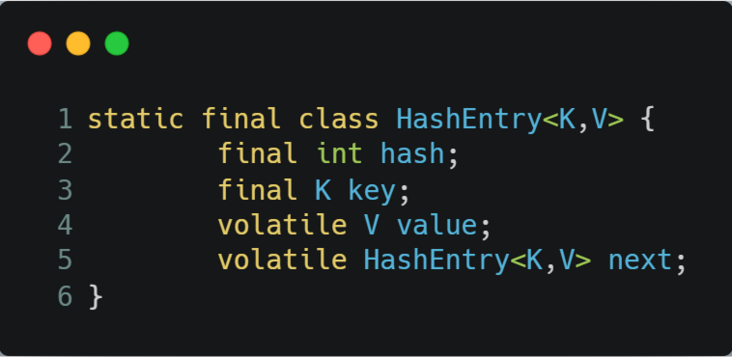
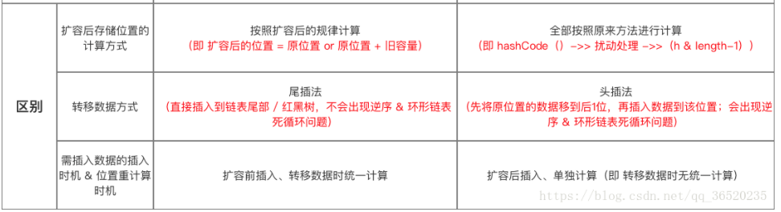
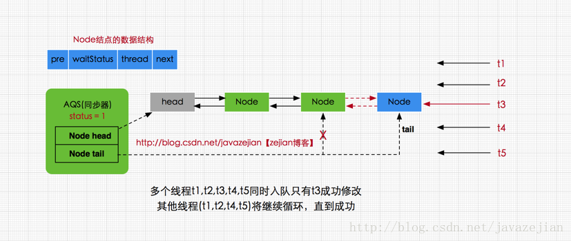
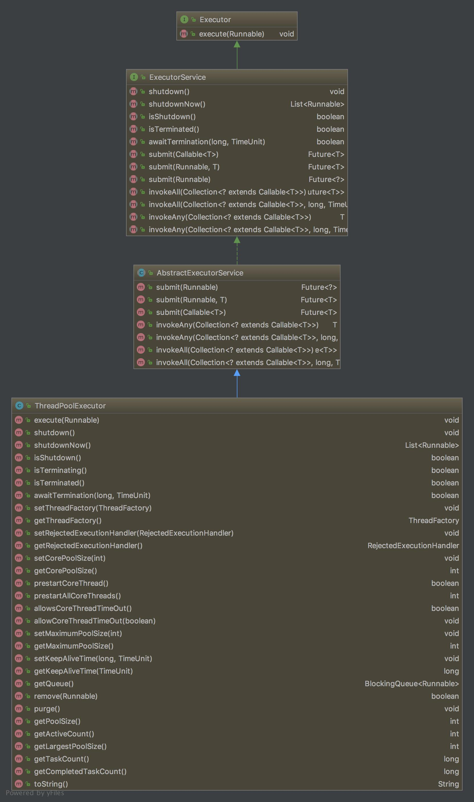
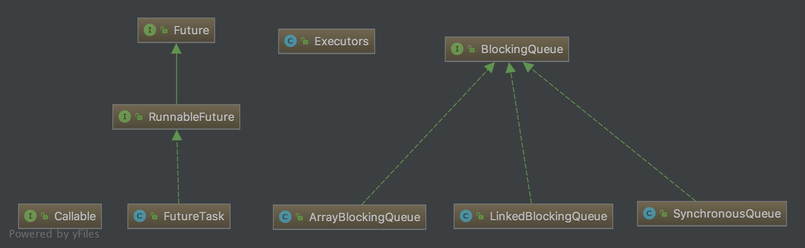
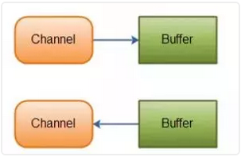

# Java并发

## 1.ThreadLocal

> threadlocal就是每个线程会单独维护一个threadlocalmap，这个map就是一个entry（key是threadlocal，value是所存的值）数组

```java
static final ThreadLocal<T> sThreadLocal = new ThreadLocal<T>();
sThreadLocal.set()
sThreadLocal.get()
```

ThreadLocal提供了**线程内存储变量的能力**，这些变量不同之处在于每一个线程读取的变量是对应的互相独立的。

```java
//set 方法
public void set(T value) {
      // 1.获取当前线程
      Thread t = Thread.currentThread();
      // 2.实际存储的数据结构类型
      ThreadLocalMap map = getMap(t);
      // 3.如果存在map就直接set，没有则创建map并set
      if (map != null)
          map.set(this, value);
      else
          createMap(t, value);
  }
  
//getMap方法
ThreadLocalMap getMap(Thread t) {
      //thread中维护了一个ThreadLocalMap
      return t.threadLocals;
 }
 
//createMap
void createMap(Thread t, T firstValue) {
      //实例化一个新的ThreadLocalMap，并赋值给线程的成员变量threadLocals
      t.threadLocals = new ThreadLocalMap(this, firstValue);
}
```

从上面代码可以看出**每个线程持有一个ThreadLocalMap对象**。每一个新的线程Thread都会实例化一个ThreadLocalMap并赋值给成员变量threadLocals，使用时若已经存在threadLocals则直接使用已经存在的对象。

#### Thread

```java
/* ThreadLocal values pertaining to this thread. This map is maintained
     * by the ThreadLocal class. */
    ThreadLocal.ThreadLocalMap threadLocals = null;
```

#### ThreadLocalMap

> ThreadLocalMap**使用线性探测法解决hash冲突**

##### set方法

```java
//Entry为ThreadLocalMap静态内部类，对ThreadLocal的弱引用
//同时让ThreadLocal和储值形成key-value的关系
static class Entry extends WeakReference<ThreadLocal<?>> {
    /** The value associated with this ThreadLocal. */
    Object value;

    Entry(ThreadLocal<?> k, Object v) {
           super(k);
            value = v;
    }
}

//ThreadLocalMap构造方法
ThreadLocalMap(ThreadLocal<?> firstKey, Object firstValue) {
        //内部成员数组，INITIAL_CAPACITY值为16的常量
        table = new Entry[INITIAL_CAPACITY];
        //位运算，结果与取模相同，计算出需要存放的位置
        int i = firstKey.threadLocalHashCode & (INITIAL_CAPACITY - 1);
  			//key就是threadlocal，value就是存的值。这是一个 table不是链表形式的
        table[i] = new Entry(firstKey, firstValue);
        size = 1;
        setThreshold(INITIAL_CAPACITY);
}
```

通过上面的代码不难看出在实例化ThreadLocalMap时创建了一个长度为16的Entry数组。通过hashCode与length位运算确定出一个索引值i，这个i就是被存储在table数组中的位置。

前面讲过每个线程Thread持有一个ThreadLocalMap类型的实例threadLocals，结合此处的构造方法可以理解成每个线程Thread都持有一个Entry型的数组table，而一切的读取过程都是通过操作这个数组table完成的。

*显然table是set和get的焦点，在看具体的set和get方法前，先看下面这段代码。*

```java
//在某一线程声明了ABC三种类型的ThreadLocal
ThreadLocal<A> sThreadLocalA = new ThreadLocal<A>();
ThreadLocal<B> sThreadLocalB = new ThreadLocal<B>();
ThreadLocal<C> sThreadLocalC = new ThreadLocal<C>();
```

由前面我们知道对于一个Thread来说只有持有一个ThreadLocalMap，所以ABC对应同一个ThreadLocalMap对象。为了管理ABC，于是将他们存储在一个数组的不同位置，而这个数组就是上面提到的Entry型的数组table。

```java
  //ThreadLocalMap中set方法。
  private void set(ThreadLocal<?> key, Object value) {

            // We don't use a fast path as with get() because it is at
            // least as common to use set() to create new entries as
            // it is to replace existing ones, in which case, a fast
            // path would fail more often than not.

            Entry[] tab = table;
            int len = tab.length;
            //获取索引值，这个地方是比较特别的地方
            int i = key.threadLocalHashCode & (len-1);

            //遍历tab如果已经存在则更新值
            for (Entry e = tab[i];
                 e != null;
                 e = tab[i = nextIndex(i, len)]) {
                ThreadLocal<?> k = e.get();

                if (k == key) {
                    e.value = value;
                    return;
                }

                if (k == null) {
                    replaceStaleEntry(key, value, i);
                    return;
                }
            }
            
            //如果上面没有遍历成功则创建新值
            tab[i] = new Entry(key, value);
            int sz = ++size;
            //满足条件数组扩容x2
            if (!cleanSomeSlots(i, sz) && sz >= threshold)
                rehash();
        }
```

在ThreadLocalMap中的set方法与构造方法能看到以下代码片段。

- `int i = key.threadLocalHashCode & (len-1)`
- `int i = firstKey.threadLocalHashCode & (INITIAL_CAPACITY - 1)`
  简而言之就是将threadLocalHashCode进行一个位运算（取模）得到索引i，threadLocalHashCode代码如下。

```java
    //ThreadLocal中threadLocalHashCode相关代码.
    
    private final int threadLocalHashCode = nextHashCode();

    /**
     * The next hash code to be given out. Updated atomically. Starts at
     * zero.
     */
    private static AtomicInteger nextHashCode = new AtomicInteger();

    /**
     * The difference between successively generated hash codes - turns
     * implicit sequential thread-local IDs into near-optimally spread
     * multiplicative hash values for power-of-two-sized tables.
     */
    private static final int HASH_INCREMENT = 0x61c88647;

    /**
     * Returns the next hash code.
     */
    private static int nextHashCode() {
        //自增
        return nextHashCode.getAndAdd(HASH_INCREMENT);
    }
```

因为static的原因，在每次`new ThreadLocal`时因为threadLocalHashCode的初始化，会使threadLocalHashCode值自增一次，增量为0x61c88647。

0x61c88647是斐波那契散列乘数,它的优点是通过它散列(hash)出来的结果分布会比较均匀，可以很大程度上避免hash冲突，已初始容量16为例，hash并与15位运算计算数组下标结果如下：

|  hashCode  | 数组下标 |
| :--------: | :------: |
| 0x61c88647 |    7     |
| 0xc3910c8e |    14    |
| 0x255992d5 |    5     |
| 0x8722191c |    12    |
| 0xe8ea9f63 |    3     |
| 0x4ab325aa |    10    |
| 0xac7babf1 |    1     |
| 0xe443238  |    8     |
| 0x700cb87f |    15    |

总结如下：

1. 对于某一ThreadLocal来讲，他的索引值i是确定的，在不同线程之间访问时访问的是不同的table数组的同一位置即都为table[i]，只不过这个不同线程之间的table是独立的。

##### get()方法

```java
//ThreadLocal中get方法
public T get() {
    Thread t = Thread.currentThread();
    ThreadLocalMap map = getMap(t);
    if (map != null) {
        ThreadLocalMap.Entry e = map.getEntry(this);
        if (e != null) {
            @SuppressWarnings("unchecked")
            T result = (T)e.value;
            return result;
        }
    }
    return setInitialValue();
}
    
//ThreadLocalMap中getEntry方法
private Entry getEntry(ThreadLocal<?> key) {
       int i = key.threadLocalHashCode & (table.length - 1);
       Entry e = table[i];
       if (e != null && e.get() == key)
            return e;
       else
            return getEntryAfterMiss(key, i, e);
   }
```

#### ThreadLocal特性

ThreadLocal和Synchronized都是为了解决多线程中相同变量的访问冲突问题，不同的点是

- Synchronized是通过线程等待，牺牲时间来解决访问冲突
- [ThreadLocal是通过每个线程单独一份存储空间，牺牲空间来解决冲突]()，并且相比于Synchronized，ThreadLocal具有线程隔离的效果，只有在线程内才能获取到对应的值，线程外则不能访问到想要的值。

正因为ThreadLocal的线程隔离特性，使他的应用场景相对来说更为特殊一些。[当某些数据是以线程为作用域并且不同线程具有不同的数据副本的时候，就可以考虑采用ThreadLocal。]()

# Java线程池

## 1.线程池的7大参数

```java
public ThreadPoolExecutor(
  int corePoolSize,   //线程池的核心线程数量
  int maximumPoolSize,//线程池的最大线程数
  long keepAliveTime, //当线程数大于核心线程数时，多余的空闲线程存活的最长时间
  TimeUnit unit,      //时间单位
  BlockingQueue<Runnable> workQueue, //任务队列，用来储存等待执行任务的队列
  ThreadFactory threadFactory,       //线程工厂，用来创建线程，一般默认即可
  RejectedExecutionHandler handler   //拒绝策略，当提交的任务过多而不能及时处理时，我们可以定制策略来处理任务
  ) 
```

**`ThreadPoolExecutor` 3 个最重要的参数：**

- **`corePoolSize` :** 核心线程数线程数定义了最小可以同时运行的线程数量。
- **`maximumPoolSize` :** 当队列中存放的任务达到队列容量的时候，当前可以同时运行的线程数量变为最大线程数。
- **`workQueue`:** 当新任务来的时候会先判断当前运行的线程数量是否达到核心线程数，如果达到的话，新任务就会被存放在队列中。

`ThreadPoolExecutor`其他常见参数:

1. **`keepAliveTime`**:当线程池中的线程数量大于 `corePoolSize` 的时候，如果这时没有新的任务提交，核心线程外的线程不会立即销毁，而是会等待，直到等待的时间超过了 `keepAliveTime`才会被回收销毁；
2. **`unit`** : `keepAliveTime` 参数的时间单位。
3. **`threadFactory`** :executor 创建新线程的时候会用到。
4. **`handler`** :饱和策略。

## 2.线程池饱和策略


## 3.线程池阻塞队列


## 4.线程池带来的好处

> - **降低资源消耗**：通过池化技术重复利用已创建的线程，降低线程创建和销毁造成的损耗。
> - **提高响应速度**：任务到达时，无需等待线程创建即可立即执行。
> - **提高线程的可管理性**：线程是稀缺资源，如果无限制创建，不仅会消耗系统资源，还会因为线程的不合理分布导致资源调度失衡，降低系统的稳定性。使用线程池可以进行统一的分配、调优和监控。
> - **提供更多更强大的功能**：线程池具备可拓展性，允许开发人员向其中增加更多的功能。比如延时定时线程池ScheduledThreadPoolExecutor，就允许任务延期执行或定期执行。

## 5.ThreadPoolExecutor是如何运行，如何同时维护线程和执行任务的呢


图2 ThreadPoolExecutor运行流程

线程池在内部实际上构建了一个[生产者消费者模型]()，将线程和任务两者解耦，并不直接关联，从而良好的缓冲任务，复用线程。线程池的运行主要分成两部分：`任务管理、线程管理`。

`任务管理`部分充当生产者的角色，当任务提交后，线程池会判断该任务后续的流转：

（1）直接申请线程执行该任务；

（2）缓冲到队列中等待线程执行；

（3）拒绝该任务。

`线程管理`部分是消费者，它们被统一维护在线程池内，根据任务请求进行线程的分配，当线程执行完任务后则会继续获取新的任务去执行，最终当线程获取不到任务的时候，线程就会被回收。

## 6.线程池提交任务的流程?


## 7.线程池任务缓冲

任务缓冲模块是线程池能够管理任务的核心部分。线程池的本质是对任务和线程的管理，而做到这一点**最关键的思想就是将任务和线程两者解耦**，不让两者直接关联，才可以做后续的分配工作。

线程池中是以生产者消费者模式，通过一个阻塞队列来实现的。阻塞队列缓存任务，工作线程从阻塞队列中获取任务。

阻塞队列(BlockingQueue)是一个支持两个附加操作的队列。这两个附加的操作是：

**在队列为空时，获取元素的线程会等待队列变为非空。**

**当队列满时，存储元素的线程会等待队列可用。**

**阻塞队列常用于生产者和消费者的场景，生产者是往队列里添加元素的线程，消费者是从队列里拿元素的线程。阻塞队列就是生产者存放元素的容器，而消费者也只从容器里拿元素。**


## 8.线程池的生命周期

线程池运行的状态，并不是用户显式设置的，而是伴随着线程池的运行，由内部来维护。线程池内部使用一个变量维护两个值：运行状态(runState)和线程数量 (workerCount)。在具体实现中，线程池将运行状态(runState)、线程数量 (workerCount)两个关键参数的维护放在了一起，如下代码所示：

```Java
private final AtomicInteger ctl = new AtomicInteger(ctlOf(RUNNING, 0));
```

`ctl`这个AtomicInteger类型，是对线程池的运行状态和线程池中有效线程的数量进行控制的一个字段， 它同时包含两部分的信息：[**线程池的运行状态** (runState)]() 和[**线程池内有效线程的数量** (workerCount)]()，`高3位保存runState，低29位保存workerCount`，两个变量之间互不干扰。

> [用一个变量去存储两个值，可避免在做相关决策时，出现不一致的情况，不必为了维护两者的一致，而占用锁资源。]()通过阅读线程池源代码也可以发现，经常出现要同时判断线程池运行状态和线程数量的情况。线程池也提供了若干方法去供用户获得线程池当前的运行状态、线程个数。这里都使用的是位运算的方式，相比于基本运算，速度也会快很多。

## 9.Worker线程

线程池为了掌握线程的状态并维护线程的生命周期，设计了线程池内的工作线程Worker。我们来看一下它的部分代码：

```Java
private final class Worker extends AbstractQueuedSynchronizer implements Runnable{
    final Thread thread;//Worker持有的线程
    Runnable firstTask;//初始化的任务，可以为null
}
```

Worker这个工作线程，实现了[Runnable接口]()，并持有一个线程thread，一个初始化的任务firstTask。thread是在调用构造方法时通过ThreadFactory来创建的线程，可以用来执行任务；firstTask用它来保存传入的第一个任务，这个任务可以有也可以为null。`如果这个值是非空的，那么线程就会在启动初期立即执行这个任务，也就对应核心线程创建时的情况；如果这个值是null，那么就需要创建一个线程去执行任务列表（workQueue）中的任务，也就是非核心线程的创建`。

Worker执行任务的模型如下图所示：


## 10.线程池线程回收

线程池需要管理线程的生命周期，需要在线程长时间不运行的时候进行回收。线程池使用一张Hash表去持有线程的引用，这样可以通过添加引用、移除引用这样的操作来控制线程的生命周期。这个时候重要的就是如何判断线程是否在运行。

Worker是通过继承AQS，使用AQS来实现独占锁这个功能。没有使用可重入锁ReentrantLock，而是[使用AQS，为的就是实现不可重入的特性去反应线程现在的执行状态。]()

```
1.lock方法一旦获取了独占锁，表示当前线程正在执行任务中。 

2.如果正在执行任务，则不应该中断线程。 

3.如果该线程现在不是独占锁的状态，也就是空闲的状态，说明它没有在处理任务，这时可以对该线程进行中断。 

4.线程池在执行shutdown方法或tryTerminate方法时会调用interruptIdleWorkers方法来中断空闲的线程，interruptIdleWorkers方法会使用tryLock方法来判断线程池中的线程是否是空闲状态；如果线程是空闲状态则可以安全回收。
```

在线程回收过程中就使用到了这种特性，回收过程如下图所示：


> 线程池中线程的销毁依赖JVM自动的回收，线程池做的工作是根据当前线程池的状态维护一定数量的线程引用，防止这部分线程被JVM回收，当线程池决定哪些线程需要回收时，只需要将其引用消除即可。
>
> [Worker被创建出来后，就会不断地进行轮询，然后获取任务去执行，核心线程可以无限等待获取任务，非核心线程要限时获取任务。当Worker无法获取到任务，也就是获取的任务为空时，循环会结束，Worker会主动消除自身在线程池内的引用。](https://mp.weixin.qq.com/s/-IPfWPS1WQMEgcIu0Ak2VQ)

```Java
try {
  while (task != null || (task = getTask()) != null) {
    //执行任务
  }
} finally {
  processWorkerExit(w, completedAbruptly);//获取不到任务时，主动回收自己
}
```

线程回收的工作是在processWorkerExit方法完成的。


图10 线程销毁流程

事实上，在这个方法中，将线程引用移出线程池就已经结束了线程销毁的部分。但由于引起线程销毁的可能性有很多，线程池还要判断是什么引发了这次销毁，是否要改变线程池的现阶段状态，是否要根据新状态，重新分配线程。

## 11.Worker线程执行任务

在Worker类中的run方法调用了runWorker方法来执行任务，runWorker方法的执行过程如下：

```
1.while循环不断地通过getTask()方法获取任务。 

2.getTask()方法从阻塞队列中取任务。

3.如果线程池正在停止，那么要保证当前线程是中断状态，否则要保证当前线程不是中断状态。 

4.执行任务。 

5.如果getTask结果为null则跳出循环，执行processWorkerExit()方法，销毁线程。
```

执行流程如下图所示：


## 12.线程池什么时候回收空闲线程？

### 1.究竟谁负责回收线程池空闲线程？

正确答案是这样的：

> 超过corePoolSize的空闲线程由线程池回收，线程池Worker启动跑第一个任务之后就一直循环遍历线程池任务队列，超过指定超时时间获取不到任务就remove Worker，最后由垃圾回收器回收。

这里面有两个概念想重新说一下，一个是Worker，另一个是任务队列。

Worker是线程池ThreadPoolExecutor的一个内部类，其有一个成员变量thread（线程），所以我们可以把一个Worker假以理解为一个线程。

任务队列是BlockingQueue，都说精通线程池了，如果熟悉这个队列的话，能不熟悉它的几个方法吗？线程池正是利用poll方法的超时时间来决定要不要回收空闲线程的。

> boolean poll(E e, long timeout, TimeUnit unit)

### 2.源码一窥究竟

讲完答案，一起看看怎么举证它，先把测试用例写起来：


定义了核心线程数为1，最大线程数为2，队列长度为2的线程池，程序运行时一次性给线程池安排4个任务，重复两次，下面是运行的结果截图：


从现象看，我们的问题复现出来了！已经复现那就好办了，可以打断点进去一看究竟了（为了便于分析理解，我就没有把debug截图出来，都是关键源码截图）！

我们再回顾下线程池的类图，要不然我们还不知道在哪里看，在哪里下手打断点是不是？


ThreadPoolExecutor至关重要，它就是我们所说的线程池了。Executors给了很多生成默认线程池的方法，但一般不建议用Executors的默认线程池，具体原因不在本文讨论范围之内，有兴趣可以先自行了解。

已经找到ThreadPoolExecutor关键类， 再上一个线程池运行任务的基本流程图


有了这图是不是就很清晰了？重点在「线程执行任务」里面，接下来我们开始看源码。

从ThreadPoolExecutor的excute方法看起，为什么从这里看起？因为我们的任务放到线程池后，是从调用execute执行开始的。

execute主体代码量很少，我特地圈出了addWorker，里面最最重要的就是初始化Worker同时启动thread。


上图是Worker作为内部类最关键的代码，非常有意思的是Worker本身也是一个Runnable，它把自己放到自己的成员变量thread里面来执行了！thread顾名思义就是线程了。

这样就明了了，Worker实现了Runnable接口，我们直接看它的run方法，看截图的③处标记，抽离出来一个runWorker方法，我们直接看runWorker方法，看下图：

①处是一个while循环，getTask方法就是从线程池队列取任务，里面就是上面我说到的调用BlockingQueue的poll方法，超时时间即是我们配置线程池事的keepAliveTime。

②处就是我们本问题真正答案之处了呀！发现没，一旦跳出while循环，即进入到processWorkExit方法，这就是回收Worker，答案终于浮出水面，看下面截图：

细心的同学可能发现了，这个回收岂不是把核心线程也会回收？

非也，这个问题的答案在getTask方法里面，来，我们再看一下getTask方法：

①处表示是否允许核心线程超时，或者线程数是否大于核心线程数。（这里说一下一个非常细的点：线程池中如果线程数低于核心线程数，就一定不会回收线程了吗？答案显然不是，allowCoreThreadTimeOut参数不就可以实现回收了么！）

②处就是从任务队列取任务了，带了timeOut参数的poll方法超时未能从任务队列获取任务即返回null，从而实现最终的线程回收。

### 3.allowCoreThreadTimeOut


要做异步任务执行队列，具体需求如下：

1. 有个线程池用于执行任务

2. 有个有界队列，用于缓存未执行的任务

3. 没有任务执行时，我希望线程池中的线程停掉

ThreadPoolExecutor多了一个**allowCoreThreadTimeOut**方法。这个方法是允许线程数低于corePoolSize时，线程也因为空闲而终止。有了这个方法，实现上面的需求就非常简单了。将corePoolSize 和 maximumPoolSize设置为相同的大小，**allowCoreThreadTimeOut**设置为true，加上一个有界队列，OK了。

# Java集合类

## 集合基础

### 1. Java 有哪些集合？

从下图可以看出，在 Java 中除了以 `Map` 结尾的类之外， 其他类都实现了 `Collection` 接口。

并且，以 `Map` 结尾的类都实现了 `Map` 接口。


### 2. 说说 List,Set,Map 三者的区别？

#### 2.1. List

- `Arraylist`： `Object[]`数组
- `Vector`：`Object[]`数组
- `LinkedList`： 双向链表(JDK1.6 之前为循环链表，JDK1.7 取消了循环)

#### 2.2. Set

- `HashSet`（无序，唯一）: 基于 `HashMap` 实现的，底层采用 `HashMap` 来保存元素
- `LinkedHashSet`：`LinkedHashSet` 是 `HashSet` 的子类，并且其内部是通过 `LinkedHashMap` 来实现的。
- `TreeSet`（有序，唯一）： 红黑树(自平衡的排序二叉树)

#### 2.3. Map

- `HashMap`： JDK1.8 之前 `HashMap` 由数组+链表组成的，数组是 `HashMap` 的主体，链表则是主要为了解决哈希冲突而存在的（“拉链法”解决冲突）。JDK1.8 以后在解决哈希冲突时有了较大的变化，当链表长度大于阈值（默认为 8）（将链表转换成红黑树前会判断，如果当前数组的长度小于 64，那么会选择先进行数组扩容，而不是转换为红黑树）时，将链表转化为红黑树，以减少搜索时间
- `LinkedHashMap`： `LinkedHashMap` 继承自 `HashMap`，所以它的底层仍然是数组和链表或红黑树组成。另外，`LinkedHashMap` 在上面结构的基础上，增加了一条双向链表，使得上面的结构可以[保持键值对的插入顺序]()。同时通过对链表进行相应的操作，实现了访问顺序相关逻辑。
- `Hashtable`： 数组+链表
- `TreeMap`： 红黑树（自平衡的排序二叉树）

#### 2.4. 为什么要使用集合？

数组的缺点是一旦声明之后，长度就不可变了；同时，声明数组时的数据类型也决定了该数组存储的数据的类型；而且，**数组存储的数据是有序的、可重复的，特点单一。** 但是**集合提高了数据存储的灵活性。**

### 3. comparable 和 Comparator 的区别

- `comparable` 接口实际上是出自`java.lang`包 它有一个 `compareTo(Object obj)`方法用来排序
- `comparator`接口实际上是出自 java.util 包它有一个`compare(Object obj1, Object obj2)`方法用来排序

一般我们需要对一个集合使用自定义排序时，我们就要重写`compareTo()`方法或`compare()`方法

#### Comparator 定制排序

```java
        ArrayList<Integer> arrayList = new ArrayList<Integer>();
        arrayList.add(-1);
        arrayList.add(3);
        arrayList.add(3);
        arrayList.add(-5);
        arrayList.add(7);
        arrayList.add(4);
        arrayList.add(-9);
        arrayList.add(-7);
        System.out.println("原始数组:");
        System.out.println(arrayList);
        // void reverse(List list)：反转
        Collections.reverse(arrayList);
        System.out.println("Collections.reverse(arrayList):");
        System.out.println(arrayList);

        // void sort(List list),按自然排序的升序排序
        Collections.sort(arrayList);
        System.out.println("Collections.sort(arrayList):");
        System.out.println(arrayList);
        // 定制排序的用法
        Collections.sort(arrayList, new Comparator<Integer>() {
            @Override
            public int compare(Integer o1, Integer o2) {
                return o2.compareTo(o1);
            }
        });
        System.out.println("定制排序后：");
        System.out.println(arrayList);
```

Output:

```
原始数组:
[-1, 3, 3, -5, 7, 4, -9, -7]
Collections.reverse(arrayList):
[-7, -9, 4, 7, -5, 3, 3, -1]
Collections.sort(arrayList):
[-9, -7, -5, -1, 3, 3, 4, 7]
定制排序后：
[7, 4, 3, 3, -1, -5, -7, -9]
```

#### 重写 compareTo 方法实现按年龄来排序

```java
// person对象没有实现Comparable接口，所以必须实现，这样才不会出错，才可以使treemap中的数据按顺序排列
// 前面一个例子的String类已经默认实现了Comparable接口，详细可以查看String类的API文档，另外其他
// 像Integer类等都已经实现了Comparable接口，所以不需要另外实现了
public  class Person implements Comparable<Person> {
    private String name;
    private int age;

    /**
     * T重写compareTo方法实现按年龄来排序
     */
    @Override
    public int compareTo(Person o) {
        if (this.age > o.getAge()) {
            return 1;
        }
        if (this.age < o.getAge()) {
            return -1;
        }
        return 0;
    }
}
    public static void main(String[] args) {
        TreeMap<Person, String> pdata = new TreeMap<Person, String>();
        pdata.put(new Person("张三", 30), "zhangsan");
        pdata.put(new Person("李四", 20), "lisi");
        pdata.put(new Person("王五", 10), "wangwu");
        pdata.put(new Person("小红", 5), "xiaohong");
        // 得到key的值的同时得到key所对应的值
        Set<Person> keys = pdata.keySet();
        for (Person key : keys) {
            System.out.println(key.getAge() + "-" + key.getName());

        }
    }
```

Output：

```
5-小红
10-王五
20-李四
30-张三
```

### 4. 同步控制

`Collections` 提供了多个`synchronizedXxx()`方法·，该方法可以将指定集合包装成线程同步的集合，从而解决多线程并发访问集合时的线程安全问题。

**最好不要用下面这些方法，效率非常低，需要线程安全的集合类型时请考虑使用 JUC 包下的并发集合。**

```java
synchronizedCollection(Collection<T>  c) //返回指定 collection 支持的同步（线程安全的）collection。
synchronizedList(List<T> list)//返回指定列表支持的同步（线程安全的）List。
synchronizedMap(Map<K,V> m) //返回由指定映射支持的同步（线程安全的）Map。
synchronizedSet(Set<T> s) //返回指定 set 支持的同步（线程安全的）set。
```

### 5.java中的clone方法

	浅拷贝:简单来说，新（拷贝产生）、旧（元对象）对象不同，但是内部如果有引用类型的变量，新、旧对象引用的都是同一引用。
	
	深拷贝：全部拷贝原对象的内容，包括内存的引用类型也进行拷贝

#### Java中对象的创建

clone顾名思义就是复制， 在Java语言中， clone方法被对象调用，所以会复制对象。所谓的复制对象，首先要分配一个和源对象同样大小的空间，在这个空间中创建一个新的对象。那么在java语言中，有几种方式可以创建对象呢？

1. 使用new操作符创建一个对象
2. 使用clone方法复制一个对象

那么这两种方式有什么相同和不同呢？ 

> new操作符的本意是分配内存。
>
> 1.程序执行到new操作符时， 首先去看new操作符后面的类型，因为知道了类型，才能知道要分配多大的内存空间。
>
> 2.分配完内存之后，再调用构造函数，填充对象的各个域，这一步叫做对象的初始化。
>
> 3.构造方法返回后，一个对象创建完毕，可以把他的引用（地址）发布到外部，在外部就可以使用这个引用操纵这个对象。

> 而clone在第一步是和new相似的， 都是分配内存，调用clone方法时，分配的内存和源对象（即调用clone方法的对象）相同，然后再使用原对象中对应的各个域，填充新对象的域， 填充完成之后，clone方法返回，一个新的相同的对象被创建，同样可以把这个新对象的引用发布到外部。
>

#### 复制对象 or 复制引用

在Java中，以下类似的代码非常常见：

```java
	Person p = new Person(23, "zhang");
	Person p1 = p;
	
	System.out.println(p);
	System.out.println(p1);
```

当Person p1 = p;执行之后， 是创建了一个新的对象吗？ 首先看打印结果：

```
com.pansoft.zhangjg.testclone.Person@2f9ee1ac
com.pansoft.zhangjg.testclone.Person@2f9ee1ac
```

可已看出，打印的地址值是相同的，既然地址都是相同的，那么肯定是同一个对象。p和p1只是引用而已，他们都指向了一个相同的对象Person(23, "zhang") 。 可以把这种现象叫做引用的复制。


而下面的代码是真真正正的克隆了一个对象。

```java
	Person p = new Person(23, "zhang");
	Person p1 = (Person) p.clone();
	System.out.println(p);
	System.out.println(p1);
```

从打印结果可以看出，两个对象的地址是不同的，也就是说创建了新的对象， 而不是把原对象的地址赋给了一个新的引用变量：

```
com.pansoft.zhangjg.testclone.Person@2f9ee1ac
com.pansoft.zhangjg.testclone.Person@67f1fba0
```


#### 深拷贝 or 浅拷贝

上面的示例代码中，Person中有两个成员变量，分别是name和age， name是String类型， age是int类型。

```java
public class Person implements Cloneable{
	
	private int age ;
	private String name;
	
	@Override
	protected Object clone() throws CloneNotSupportedException {
		return (Person)super.clone();
	}
}
```

由于age是基本数据类型， 那么对它的拷贝没有什么疑议，直接将一个4字节的整数值拷贝过来就行。

但是name是String类型的， 它只是一个引用， 指向一个真正的String对象，那么对它的拷贝有两种方式： 

- 直接将源对象中的name的引用值拷贝给新对象的name字段。
- 或者是根据原Person对象中的name指向的字符串对象创建一个新的相同的字符串对象，将这个新字符串对象的引用赋给新拷贝的Person对象的name字段。

这两种拷贝方式分别叫做浅拷贝和深拷贝。深拷贝和浅拷贝的原理如下图所示：


```java
		Person p = new Person(23, "zhang");
		Person p1 = (Person) p.clone();
		
		String result = p.getName() == p1.getName() ? "clone是浅拷贝的" : "clone是深拷贝的";
		
		System.out.println(result);
```

打印结果为：

```
clone是浅拷贝的

所以，clone方法执行的是浅拷贝， 在编写程序时要注意这个细节。
```

#### 覆盖Object中的clone方法， 实现深拷贝

现在为了要在clone对象时进行深拷贝， 那么就要Clonable接口，覆盖并实现clone方法，除了调用父类中的clone方法得到新的对象， 还要将该类中的引用变量也clone出来。如果只是用Object中默认的clone方法，是浅拷贝的，再次以下面的代码验证：

```java
static class Body implements Cloneable{
	public Head head;
 
	@Override
	protected Object clone() throws CloneNotSupportedException {
		return super.clone();
	}
	
}
static class Head /*implements Cloneable*/{
	public  Face face;
} 
}
```

如果要使Body对象在clone时进行深拷贝， 那么就要在Body的clone方法中，将源对象引用的Head对象也clone一份。

```java
static class Body implements Cloneable{
	public Head head;
 
	@Override
	protected Object clone() throws CloneNotSupportedException {
		Body newBody =  (Body) super.clone();
		newBody.head = (Head) head.clone();
		return newBody;
	}
	
}
static class Head implements Cloneable{
	public  Face face;
	@Override
	protected Object clone() throws CloneNotSupportedException {
		return super.clone();
	}
} 
public static void main(String[] args) throws CloneNotSupportedException {
	
	Body body = new Body(new Head());
	
	Body body1 = (Body) body.clone();
	
	System.out.println("body == body1 : " + (body == body1) );
	
	System.out.println("body.head == body1.head : " +  (body.head == body1.head));
	
	}
```

打印结果为：

```
body == body1 : false
body.head == body1.head : false
```

由此可见， body和body1内的head引用指向了不同的Head对象， 也就是说在clone Body对象的同时， 也拷贝了它所引用的Head对象， 进行了深拷贝。

#### 真的是深拷贝吗


那么，按照上面的结论， Body类组合了Head类， 而Head类组合了Face类，要想深拷贝Body类，必须在Body类的clone方法中将Head类也要拷贝一份，但是在拷贝Head类时，默认执行的是浅拷贝，也就是说Head中组合的Face对象并不会被拷贝。验证代码如下：

```java
	static class Body implements Cloneable{
		public Head head;
		public Body() {}
		public Body(Head head) {this.head = head;}
 
		@Override
		protected Object clone() throws CloneNotSupportedException {
			Body newBody =  (Body) super.clone();
			newBody.head = (Head) head.clone();
			return newBody;
		}
		
	}
	
	static class Head implements Cloneable{
		public  Face face;
		
		public Head() {}
		public Head(Face face){this.face = face;}
		@Override
		protected Object clone() throws CloneNotSupportedException {
			return super.clone();
		}
	} 
	
	static class Face{}
	
	public static void main(String[] args) throws CloneNotSupportedException {
		
		Body body = new Body(new Head(new Face()));
		
		Body body1 = (Body) body.clone();
		
		System.out.println("body == body1 : " + (body == body1) );
		
		System.out.println("body.head == body1.head : " +  (body.head == body1.head));
		
		System.out.println("body.head.face == body1.head.face : " +  (body.head.face == body1.head.face));
		
  }
	}
```

打印结果为：

```
body == body1 : false
body.head == body1.head : false
body.head.face == body1.head.face : true
```

内存结构图如下图所示：


那么，对Body对象来说，算是这算是深拷贝吗？其实应该算是深拷贝，因为对Body对象内所引用的其他对象（目前只有Head）都进行了拷贝，也就是说两个独立的Body对象内的head引用已经指向了独立的两个Head对象。但是，这对于两个Head对象来说，他们指向了同一个Face对象，这就说明，两个Body对象还是有一定的联系，并没有完全的独立。这应该说是一种不彻底的深拷贝。

#### 如何进行彻底的深拷贝

对于上面的例子来说，怎样才能保证两个Body对象完全独立呢？只要在拷贝Head对象的时候，也将Face对象拷贝一份就可以了。这需要让Face类也实现Cloneable接口，实现clone方法，并且在在Head对象的clone方法中，拷贝它所引用的Face对象。修改的部分代码如下：

```java
	static class Head implements Cloneable{
		public  Face face;
    
		@Override
		protected Object clone() throws CloneNotSupportedException {
			//return super.clone();
			Head newHead = (Head) super.clone();
			newHead.face = (Face) this.face.clone();
			return newHead;
		}
	} 
	
	static class Face implements Cloneable{
		@Override
		protected Object clone() throws CloneNotSupportedException {
			return super.clone();
		}
	}
```

再次运行上面的示例，得到的运行结果如下：

```
body == body1 : false
body.head == body1.head : false
body.head.face == body1.head.face : false
```


如果在拷贝一个对象时，要想让这个拷贝的对象和源对象完全彼此独立，那么在引用链上的每一级对象都要被显式的拷贝。

所以 创建彻底的深拷贝是非常麻烦的，尤其是在引用关系非常复杂的情况下， 或者在引用链的某一级上引用了一个第三方的对象， 而这个对象没有实现clone方法， 那么在它之后的所有引用的对象都是被共享的。

举例来说，如果被Head引用的Face类是第三方库中的类，并且没有实现Cloneable接口，那么在Face之后的所有对象都会被拷贝前后的两个Body对象共同引用。假设Face对象内部组合了Mouth对象，并且Mouth对象内部组合了Tooth对象， 内存结构如下图：


写在最后

clone在平时项目的开发中可能用的不是很频繁，但是区分深拷贝和浅拷贝会让我们对java内存结构和运行方式有更深的了解。至于彻底深拷贝，几乎是不可能实现的，原因已经在上一节中进行了说明。深拷贝和彻底深拷贝，在创建不可变对象时，可能对程序有着微妙的影响，可能会决定我们创建的不可变对象是不是真的不可变。[clone的一个重要的应用也是用于不可变对象的创建。]()

## List

### 1. Arraylist 和 Vector 的区别?

- `ArrayList`   `Object[ ]`存储 线程不安全 。
- `Vector`         ` Object[ ]` 存储 线程安全的。

### 2. Arraylist 与 LinkedList 区别?

1. **线程安全：**

   >  不保证线程安全

2. **底层数据结构：** 

   > `Arraylist` 底层使用的是 **`Object` 数组**；
   >
   > `LinkedList` 底层使用的是 **双向链表** 数据结构（JDK1.6 之前为循环链表，JDK1.7 取消了循环。）

3. **插入和删除是否受元素位置的影响：** 

   > ① **`ArrayList` 采用数组存储，所以插入和删除元素的时间复杂度受元素位置的影响。** 
   >
   > 如果要在指定位置 i 插入和删除元素的话（`add(int index, E element)`）时间复杂度就为 O(n-i)。 
   >
   > ② **`LinkedList` 采用链表存储，所以对于`add(E e)`方法的插入，删除元素时间复杂度不受元素位置的影响，近似 O(1)。**
   >
   > 如果是要在指定位置`i`插入和删除元素的话（`(add(int index, E element)`） 时间复杂度近似为`o(n))`因为需要先移动到指定位置再插入。

4. **快速随机访问：** 

   > `LinkedList` 不支持
   >
   > `ArrayList` 支持
   >
   > 快速随机访问就是通过元素的序号快速获取元素对象（不用遍历）

5. **内存空间占用**

   >  ArrayList： list 列表的结尾会预留一定的容量空间
   >
   >   LinkedList：每一个元素都需要消耗比 ArrayList 更多的空间（因为要存放直接后继和直接前驱以及数据）。

### 3. ArrayList 简介

`ArrayList` 的底层是数组队列，相当于动态数组。与 Java 中的数组相比，它的容量能动态增长。

> 在添加大量元素前，应用程序可以使用`ensureCapacity`操作来增加 `ArrayList` 实例的容量。这可以减少递增式再分配的数量。
>

`ArrayList`继承于 **`AbstractList`** ，实现了 **`List`**, **`RandomAccess`**, **`Cloneable`**, **`java.io.Serializable`** 这些接口。

```java
public class ArrayList<E> extends AbstractList<E>
        implements List<E>, RandomAccess, Cloneable, java.io.Serializable{
  }
```

- `RandomAccess` 是一个标志接口，表明实现这个这个接口的 List 集合是支持**快速随机访问**的。
- `ArrayList` 实现了 **`Cloneable` 接口** ，即覆盖了函数`clone()`，能被克隆。
- `ArrayList` 实现了 `java.io.Serializable `接口，这意味着`ArrayList`支持序列化，能通过序列化去传输。

```java
private static final int DEFAULT_CAPACITY = 10;
```


### 4. ArrayList 核心源码解读

#### 1.add方法

```java
public boolean add(E e) {
    ensureCapacityInternal(size + 1);  // Increments modCount!!
    elementData[size++] = e;
    return true;
}

private void ensureCapacityInternal(int minCapacity) {
    if (elementData == DEFAULTCAPACITY_EMPTY_ELEMENTDATA) {
        minCapacity = Math.max(DEFAULT_CAPACITY, minCapacity);
    }
    ensureExplicitCapacity(minCapacity);
}

private void ensureExplicitCapacity(int minCapacity) {
    modCount++;
    // overflow-conscious code
    if (minCapacity - elementData.length > 0)
        grow(minCapacity);
}

private void grow(int minCapacity) {
    // overflow-conscious code
    int oldCapacity = elementData.length;
    int newCapacity = oldCapacity + (oldCapacity >> 1);
    if (newCapacity - minCapacity < 0)
        newCapacity = minCapacity;
    if (newCapacity - MAX_ARRAY_SIZE > 0)
        newCapacity = hugeCapacity(minCapacity);
    // minCapacity is usually close to size, so this is a win:
    elementData = Arrays.copyOf(elementData, newCapacity);
}
```

#### 2.remove方法

需要调用 System.arraycopy() 将 index+1 后面的元素都复制到 index 位置上，该操作的时间复杂度为 O(N)，可以看到 ArrayList 删除元素的代价是非常高的。

```java
public E remove(int index) {
    rangeCheck(index);
    modCount++;
    E oldValue = elementData(index);
    int numMoved = size - index - 1;
    if (numMoved > 0)
        System.arraycopy(elementData, index+1, elementData, index, numMoved);
    elementData[--size] = null; // clear to let GC do its work
    return oldValue;
}
```

#### 3.序列化

ArrayList保存元素的数组不一定都会被使用，那么就没必要全部进行序列化。

保存元素的数组 elementData 使用 transient 修饰，该关键字声明数组默认不会被序列化。

```java
transient Object[] elementData; // non-private to simplify nested class access
```

ArrayList 实现了 writeObject() 和 readObject() 来控制只序列化数组中有元素填充那部分内容。（size部分）

```java
private void readObject(java.io.ObjectInputStream s)
    throws java.io.IOException, ClassNotFoundException {
    elementData = EMPTY_ELEMENTDATA;

    // Read in size, and any hidden stuff
    s.defaultReadObject();

    // Read in capacity
    s.readInt(); // ignored

    if (size > 0) {
        // be like clone(), allocate array based upon size not capacity
        ensureCapacityInternal(size);

        Object[] a = elementData;
        // Read in all elements in the proper order.
        for (int i=0; i<size; i++) {
            a[i] = s.readObject();
        }
    }
}
private void writeObject(java.io.ObjectOutputStream s)
    throws java.io.IOException{
    // Write out element count, and any hidden stuff
    int expectedModCount = modCount;
    s.defaultWriteObject();

    // Write out size as capacity for behavioural compatibility with clone()
    s.writeInt(size);

    // Write out all elements in the proper order.
    for (int i=0; i<size; i++) {
        s.writeObject(elementData[i]);
    }

    if (modCount != expectedModCount) {
        throw new ConcurrentModificationException();
    }
}
```

序列化时需要使用 ObjectOutputStream 的 writeObject() 将对象转换为字节流并输出。而 writeObject() 方法在传入的对象存在 writeObject() 的时候会去反射调用该对象的 writeObject() 来实现序列化。反序列化使用的是 ObjectInputStream 的 readObject() 方法，原理类似。

```java
ArrayList list = new ArrayList();
ObjectOutputStream oos = new ObjectOutputStream(new FileOutputStream(file));
oos.writeObject(list);
```

#### 4. Fail-Fast

modCount 用来记录 ArrayList 结构发生变化的次数。结构发生变化是指添加或者删除至少一个元素的所有操作，或者是调整内部数组的大小，仅仅只是设置元素的值不算结构发生变化。

[**在进行序列化或者迭代等操作时，需要比较操作前后 modCount 是否改变，如果改变了需要抛出 ConcurrentModificationException。**]()

### 5. ArrayList 扩容机制分析

#### 1. 先从 ArrayList 的构造函数说起

**（JDK8）ArrayList 有三种方式来初始化，构造方法源码如下：**

```java
   /**
     * 默认初始容量大小
     */
    private static final int DEFAULT_CAPACITY = 10;


    private static final Object[] DEFAULTCAPACITY_EMPTY_ELEMENTDATA = {};

    /**
     *默认构造函数，使用初始容量10构造一个空列表(无参数构造)
     */
    public ArrayList() {
        this.elementData = DEFAULTCAPACITY_EMPTY_ELEMENTDATA;
    }

    /**
     * 带初始容量参数的构造函数。（用户自己指定容量）
     */
    public ArrayList(int initialCapacity) {
        if (initialCapacity > 0) {//初始容量大于0
            this.elementData = new Object[initialCapacity];
        } else if (initialCapacity == 0) {//初始容量等于0
            this.elementData = EMPTY_ELEMENTDATA;
        } else {//初始容量小于0，抛出异常
            throw new IllegalArgumentException("Illegal Capacity: "+
                                               initialCapacity);
        }
    }


   /**
    *构造包含指定collection元素的列表，这些元素利用该集合的迭代器按顺序返回
    *如果指定的集合为null，throws NullPointerException。
    */
     public ArrayList(Collection<? extends E> c) {
        elementData = c.toArray();
        if ((size = elementData.length) != 0) {
            // c.toArray might (incorrectly) not return Object[] (see 6260652)
            if (elementData.getClass() != Object[].class)
                elementData = Arrays.copyOf(elementData, size, Object[].class);
        } else {
            // replace with empty array.
            this.elementData = EMPTY_ELEMENTDATA;
        }
    }
```

细心的同学一定会发现 ：

> **以无参数构造方法创建 ArrayList 时，实际上初始化赋值的是一个空数组。**
>
> **当真正对数组进行添加元素操作时，才真正分配容量。即向数组中添加第一个元素时，数组容量扩为 10。** 

下面在我们分析 ArrayList 扩容时会讲到这一点内容！

> **JDK7 new无参构造的ArrayList对象时，直接创建了长度是10的Object[]数组elementData 。**
>
> jdk7中的ArrayList的对象的创建**类似于单例的饿汉式**
>
> jdk8中的ArrayList的对象的创建**类似于单例的懒汉式**。

#### 2. 一步一步分析 ArrayList 扩容机制

##### 1.  add() 

```java
		public boolean add(E e) {
        ensureCapacityInternal(size + 1);  // Increments modCount!!
        elementData[size++] = e;
        return true;
    }
```

> **注意** ：JDK11 移除了 `ensureCapacityInternal()` 和 `ensureExplicitCapacity()` 方法

##### 2.  ensureCapacityInternal() 

```java
   //得到最小扩容量
    private void ensureCapacityInternal(int minCapacity) {
        if (elementData == DEFAULTCAPACITY_EMPTY_ELEMENTDATA) {
            // 获取默认的容量(10)和传入参数的较大值
            minCapacity = Math.max(DEFAULT_CAPACITY, minCapacity);
        }

        ensureExplicitCapacity(minCapacity);
    }
```

##### 3. ensureExplicitCapacity() 

```java
    //判断是否需要扩容
    private void ensureExplicitCapacity(int minCapacity) {
      	// 为了实现迭代器的快速失败机制
        modCount++;

      	//	minCapacity相当于是所需容量，elementData.length相当于是此时的容量
        if (minCapacity - elementData.length > 0)
            grow(minCapacity);
    }
```

##### 4. grow() 

```java
    /**
     * 要分配的最大数组大小
     */
    private static final int MAX_ARRAY_SIZE = Integer.MAX_VALUE - 8;

    private void grow(int minCapacity) {
      
        // oldCapacity为旧容量，newCapacity为新容量
        int oldCapacity = elementData.length;

        //	1.我们知道位运算的速度远远快于整除运算，整句运算式的结果就是将新容量更新为旧容量的1.5倍，
        int newCapacity = oldCapacity + (oldCapacity >> 1);
      
        //	2.然后检查新容量是否大于最小需要容量
        if (newCapacity - minCapacity < 0)
            newCapacity = minCapacity;
      
        //  3.如果新容量大于 MAX_ARRAY_SIZE
        //  进入hugeCapacity()方法来比较 minCapacity 和 MAX_ARRAY_SIZE
        //	如果minCapacity大于最大容量，则新容量则为Integer.MAX_VALUE
      	//  否则，新容量大小则为Integer.MAX_VALUE - 8
        if (newCapacity - MAX_ARRAY_SIZE > 0)
            newCapacity = hugeCapacity(minCapacity);
      
        //  minCapacity is usually close to size, so this is a win:
        elementData = Arrays.copyOf(elementData, newCapacity);
    }
```

##### 5. hugeCapacity() 

如果新容量大于 MAX_ARRAY_SIZE,进入(执行) `hugeCapacity()` 方法来比较 minCapacity 和 MAX_ARRAY_SIZE，如果 minCapacity 大于最大容量，则新容量则为`Integer.MAX_VALUE`，否则，新容量大小则为 MAX_ARRAY_SIZE 即为 `Integer.MAX_VALUE - 8`。

```java
    private static int hugeCapacity(int minCapacity) {
        if (minCapacity < 0) // overflow
            throw new OutOfMemoryError();
        //  对minCapacity和MAX_ARRAY_SIZE进行比较
        //  1.若minCapacity大，将Integer.MAX_VALUE作为新数组的大小
        //  2.若MAX_ARRAY_SIZE大，将MAX_ARRAY_SIZE作为新数组的大小
        return (minCapacity > MAX_ARRAY_SIZE) ?
            Integer.MAX_VALUE :
            MAX_ARRAY_SIZE;
    }
```

#### 3. Copy方法

##### 1. System.arraycopy() 

```java
		public void add(int index, E element) {
      	// 1.界限检查；
        rangeCheckForAdd(index);

        ensureCapacityInternal(size + 1);  // Increments modCount!!
      
        //	elementData:源数组;  index:源数组中的起始位置;	
      	//	elementData：目标数组；index + 1：目标数组中的起始位置； 
        //	size - index：要复制的数组元素的数量；
        System.arraycopy(elementData, index, elementData, index + 1, size - index);
      
        elementData[index] = element;
        size++;
    }
```

##### 2. Arrays.copyOf()

```java
		public Object[] toArray() {
    		//elementData：要复制的数组；size：要复制的长度
        return Arrays.copyOf(elementData, size);
    }
```

```java
public static <T,U> T[] copyOf(U[] original, int newLength, Class<? extends T[]> newType) {
    T[] copy = ((Object)newType == (Object)Object[].class)
        ? (T[]) new Object[newLength]
        : (T[]) Array.newInstance(newType.getComponentType(), newLength);
    System.arraycopy(original, 0, copy, 0, Math.min(original.length, newLength));
    return copy;
}
```

##### 3. 两者联系和区别

**联系：**

看两者源代码可以发现 `copyOf()`内部实际调用了 `System.arraycopy()` 方法

**区别：**

- `arraycopy()` 需要目标数组，将原数组拷贝到你自己定义的数组里或者原数组，而且可以选择拷贝的起点和长度以及放入新数组中的位置
- `copyOf()` 是系统**自动在内部新建一个数组，并返回该数组。**

#### 4. ensureCapacity()

ArrayList 源码中有一个 `ensureCapacity` 方法不知道大家注意到没有，这个方法 ArrayList 内部没有被调用过，所以很显然是提供给用户调用的，那么这个方法有什么作用呢？

```java
    /**
    如有必要，增加此 ArrayList 实例的容量，以确保它至少可以容纳由minimum capacity参数指定的元素数。
     * @param   minCapacity   所需的最小容量
     */
    public void ensureCapacity(int minCapacity) {
        int minExpand = (elementData != DEFAULTCAPACITY_EMPTY_ELEMENTDATA)
            // any size if not default element table
            ? 0
            // larger than default for default empty table. It's already
            // supposed to be at default size.
            : DEFAULT_CAPACITY;

        if (minCapacity > minExpand) {
            ensureExplicitCapacity(minCapacity);
        }
    }
```

> **最好在 add 大量元素之前用 `ensureCapacity` 方法，以减少增量重新分配的次数**

我们通过下面的代码实际测试以下这个方法的效果：

```java
public class EnsureCapacityTest {
    public static void main(String[] args) {
        ArrayList<Object> list = new ArrayList<Object>();
        final int N = 10000000;
        long startTime = System.currentTimeMillis();
        for (int i = 0; i < N; i++) {
            list.add(i);
        }
        long endTime = System.currentTimeMillis();
        System.out.println("使用ensureCapacity方法前："+(endTime - startTime));

    }
}
```

运行结果：

```java
使用ensureCapacity方法前：2158
public class EnsureCapacityTest {
    public static void main(String[] args) {
        ArrayList<Object> list = new ArrayList<Object>();
        final int N = 10000000;
        list = new ArrayList<Object>();
        long startTime1 = System.currentTimeMillis();
        list.ensureCapacity(N);
        for (int i = 0; i < N; i++) {
            list.add(i);
        }
        long endTime1 = System.currentTimeMillis();
        System.out.println("使用ensureCapacity方法后："+(endTime1 - startTime1));
    }
}
使用ensureCapacity方法后：1773
```

通过运行结果，我们可以看出向 ArrayList 添加大量元素之前最好先使用`ensureCapacity` 方法，以减少增量重新分配的次数。

### CopyOnWriteArrayList

#### 1. 读写分离

写操作在一个复制的数组上进行，读操作还是在原始数组中进行，读写分离，互不影响。

写操作需要加锁，防止并发写入时导致写入数据丢失。[**(ReentrantLock)**]()

写操作结束之后需要把原始数组指向新的复制数组。

```java
public boolean add(E e) {
    final ReentrantLock lock = this.lock;
    lock.lock();
    try {
        Object[] elements = getArray();
        int len = elements.length;
        Object[] newElements = Arrays.copyOf(elements, len + 1);
        newElements[len] = e;
        setArray(newElements);
        return true;
    } finally {
        lock.unlock();
    }
}

final void setArray(Object[] a) {
    array = a;
}
@SuppressWarnings("unchecked")
private E get(Object[] a, int index) {
    return (E) a[index];
}
```

#### 2. 适用场景

CopyOnWriteArrayList 在写操作的同时允许读操作，大大提高了读操作的性能，因此很适合读多写少的应用场景。

但是 CopyOnWriteArrayList 有其缺陷：

- 内存占用：在写操作时需要复制一个新的数组，使得内存占用为原来的两倍左右；
- 数据不一致：读操作不能读取实时性的数据，因为部分写操作的数据还未同步到读数组中。

所以 CopyOnWriteArrayList 不适合内存敏感以及对实时性要求很高的场景。

### LinkedList

#### 1. 概览

基于双向链表实现，使用 Node 存储链表节点信息。

```java
private static class Node<E> {
    E item;
    Node<E> next;
    Node<E> prev;
}
```

每个链表存储了 first 和 last 指针：

```java
transient Node<E> first;
transient Node<E> last;
```


## Map

### 1. HashMap 和 Hashtable 的区别

1. **线程安全：**

   >  `HashMap` 是非线程安全的
   >
   >  `HashTable` 是线程安全的,因为 `HashTable` 内部的方法基本都经过`synchronized` 修饰。

2. **效率：**

   >  因为线程安全的问题，`HashMap` 要比 `HashTable` 效率高一点。
   >
   >  另外，`HashTable` 基本被淘汰，不要在代码中使用它；

3. **对 Null key 和 Null value 的支持：** 

   > `HashMap` 可以存储 null 的 key 和 value，但 null 作为键只能有一个，null 作为值可以有多个；
   >
   > HashTable 不允许有 null 键和 null 值，否则会抛出 `NullPointerException`。

4. **初始容量大小和每次扩充容量大小的不同 ：** 

   > `Hashtable` 默认的初始大小为 11，扩容为原来的 2n+1
   >
   > `HashMap` 默认的初始化大小为 16，扩容为原来的 2n
   >
   > 创建时如果给定了容量初始值，那么 Hashtable 会直接使用你给定的大小，而 `HashMap` 会将其扩充为 2 的幂次方大小。

5. **底层数据结构：** JDK1.8 以后的 `HashMap` 在解决哈希冲突时有了较大的变化.

   > 当链表长度大于阈值（默认为 8）（将链表转换成红黑树前会判断，如果当前数组的长度小于 64，那么会选择先进行数组扩容，而不是转换为红黑树）时，将链表转化为红黑树，以减少搜索时间。
   >
   > Hashtable 没有这样的机制

### 2. HashMap 和 TreeMap 区别

`TreeMap` 和`HashMap` 都继承自`AbstractMap` ，但是需要注意的是`TreeMap`它还实现了`NavigableMap`接口和`SortedMap` 接口。


实现 `NavigableMap` 接口让 `TreeMap` 有了[对集合内元素的搜索的能力]()。

实现`SortMap`接口让 `TreeMap` 有了对集合中的元素根据键[排序的能力]()。默认是按 key 的升序排序，不过我们也可以指定排序的比较器。示例代码如下：

```java
public class Person {
    private Integer age;

    public static void main(String[] args) {
        TreeMap<Person, String> treeMap = new TreeMap<>(new Comparator<Person>() {
            @Override
            public int compare(Person person1, Person person2) {
                int num = person1.getAge() - person2.getAge();
                return Integer.compare(num, 0);
            }
        });
        treeMap.put(new Person(3), "person1");
        treeMap.put(new Person(18), "person2");
        treeMap.put(new Person(35), "person3");
        treeMap.put(new Person(16), "person4");
        treeMap.entrySet().stream().forEach(personStringEntry -> {
            System.out.println(personStringEntry.getValue());
        });
    }
}
```

输出:

```
person1
person4
person2
person3
```

可以看出，`TreeMap` 中的元素已经是按照 `Person` 的 age 字段的升序来排列了。

上面，我们是通过传入匿名内部类的方式实现的，你可以将代码替换成 Lambda 表达式实现的方式：

```java
TreeMap<Person, String> treeMap = new TreeMap<>((person1, person2) -> {
  int num = person1.getAge() - person2.getAge();
  return Integer.compare(num, 0);
});
```

**综上，相比于`HashMap`来说 `TreeMap` 主要多了对集合中的元素根据键排序的能力以及对集合内元素的搜索的能力。**

### 3. HashMap 多线程操作导致死循环问题

主要原因在于并发下的 Rehash 会造成元素之间会形成一个循环链表。不过，jdk 1.8 后解决了这个问题，但是还是不建议在多线程下使用 HashMap,因为多线程下使用 HashMap 还是会存在其他问题比如数据丢失。并发环境下推荐使用 ConcurrentHashMap 。

### 4. HashMap 有哪几种常见的遍历方式?

但每种类型下又有不同的实现方式，因此具体的遍历方式又可以分为以下 7 种：

1. 使用迭代器（Iterator）EntrySet 的方式进行遍历；
2. 使用迭代器（Iterator）KeySet 的方式进行遍历；
3. 使用 For Each EntrySet 的方式进行遍历；
4. 使用 For Each KeySet 的方式进行遍历；
5. 使用 Lambda 表达式的方式进行遍历；
6. 使用 Streams API 单线程的方式进行遍历；
7. 使用 Streams API 多线程的方式进行遍历。

接下来我们来看每种遍历方式的具体实现代码。

#### 1.迭代器 EntrySet

```java
public class HashMapTest {
    public static void main(String[] args) {
        // 创建并赋值 HashMap
        Map<Integer, String> map = new HashMap();
        map.put(1, "Java");
        map.put(2, "JDK");
        map.put(3, "Spring Framework");
        map.put(4, "MyBatis framework");
        map.put(5, "Java中文社群");
        // 遍历
        Iterator<Map.Entry<Integer, String>> iterator = map.entrySet().iterator();
        while (iterator.hasNext()) {
            Map.Entry<Integer, String> entry = iterator.next();
            System.out.print(entry.getKey());
            System.out.print(entry.getValue());
        }
    }
}
```

#### 2.迭代器 KeySet

```java
public class HashMapTest {
    public static void main(String[] args) {
        // 创建并赋值 HashMap
        Map<Integer, String> map = new HashMap();
        map.put(1, "Java");
        map.put(2, "JDK");
        map.put(3, "Spring Framework");
        map.put(4, "MyBatis framework");
        map.put(5, "Java中文社群");
        // 遍历
        Iterator<Integer> iterator = map.keySet().iterator();
        while (iterator.hasNext()) {
            Integer key = iterator.next();
            System.out.print(key);
            System.out.print(map.get(key));
        }
    }
}
```

#### 3.ForEach EntrySet

```java
public class HashMapTest {
    public static void main(String[] args) {
        // 创建并赋值 HashMap
        Map<Integer, String> map = new HashMap();
        map.put(1, "Java");
        map.put(2, "JDK");
        map.put(3, "Spring Framework");
        map.put(4, "MyBatis framework");
        map.put(5, "Java中文社群");
        // 遍历
        for (Map.Entry<Integer, String> entry : map.entrySet()) {
            System.out.print(entry.getKey());
            System.out.print(entry.getValue());
        }
    }
}
```

#### 4.ForEach KeySet

```java
public class HashMapTest {
    public static void main(String[] args) {
        // 创建并赋值 HashMap
        Map<Integer, String> map = new HashMap();
        map.put(1, "Java");
        map.put(2, "JDK");
        map.put(3, "Spring Framework");
        map.put(4, "MyBatis framework");
        map.put(5, "Java中文社群");
        // 遍历
        for (Integer key : map.keySet()) {
            System.out.print(key);
            System.out.print(map.get(key));
        }
    }
}
```

#### 5.Lambda

```java
public class HashMapTest {
    public static void main(String[] args) {
        // 创建并赋值 HashMap
        Map<Integer, String> map = new HashMap();
        map.put(1, "Java");
        map.put(2, "JDK");
        map.put(3, "Spring Framework");
        map.put(4, "MyBatis framework");
        map.put(5, "Java中文社群");
        // 遍历
        map.forEach((key, value) -> {
            System.out.print(key);
            System.out.print(value);
        });
    }
}
```

#### 6.Streams API 单线程

```java
public class HashMapTest {
    public static void main(String[] args) {
        // 创建并赋值 HashMap
        Map<Integer, String> map = new HashMap();
        map.put(1, "Java");
        map.put(2, "JDK");
        map.put(3, "Spring Framework");
        map.put(4, "MyBatis framework");
        map.put(5, "Java中文社群");
        // 遍历
        map.entrySet().stream().forEach((entry) -> {
            System.out.print(entry.getKey());
            System.out.print(entry.getValue());
        });
    }
}
```

### 5. ConcurrentHashMap 和 Hashtable 的区别

`ConcurrentHashMap` 和 `Hashtable` 的区别主要体现在实现线程安全的方式上不同。

**底层数据结构：** 

> JDK1.7 的 `ConcurrentHashMap` 底层采用 **分段的数组+链表** 实现
>
> JDK1.8 采用的数据结构跟 `HashMap1.8` 的结构一样，数组+链表/红黑二叉树。
>
> `Hashtable` 采用 **数组+链表** 

**实现线程安全的方式（重要）：** 

> **在 JDK1.7 的时候，`ConcurrentHashMap`（分段锁）** 对整个桶数组进行了分割分段(`Segment`)，每一把锁只锁容器其中一部分数据，多线程访问容器里不同数据段的数据，就不会存在锁竞争，提高并发访问率。 可重入锁ReentrantLock
>
> JDK1.8 的时候已经摒弃了 `Segment` 的概念，而是直接用 `Node` 数组+链表+红黑树的数据结构来实现，并发控制使用 `synchronized` 和 CAS 来操作。（JDK1.6 以后 对 `synchronized` 锁做了很多优化）

**`Hashtable`(同一把锁)** :使用 `synchronized` 来保证线程安全，效率非常低下。

> 当一个线程访问同步方法时，其他线程也访问同步方法，可能会进入阻塞或轮询状态，如使用 put 添加元素，另一个线程不能使用 put 添加元素，也不能使用 get，竞争会越来越激烈效率越低。

**两者的对比图：**

**HashTable:**


**JDK1.7 的 ConcurrentHashMap：**


**JDK1.8 的 ConcurrentHashMap：**


JDK1.8 的 `ConcurrentHashMap` 不在是 **Segment 数组 + HashEntry 数组 + 链表**，而是 **Node 数组 + 链表 / 红黑树**。不过，Node 只能用于链表的情况，红黑树的情况需要使用 **`TreeNode`**。当冲突链表达到一定长度时，链表会转换成红黑树。

### 6.ConcurrentHashMap常见问题

#### 1.ConcurrentHashMap 的实现原理是什么？ 

ConcurrentHashMap 在 JDK1.7 和 JDK1.8 的实现方式是不同的。

**先来看下JDK1.7**

JDK1.7 中的 ConcurrentHashMap 是由 `Segment` 数组结构和 `HashEntry` 数组结构组成，即 ConcurrentHashMap 把哈希桶数组切分成小数组（Segment ），每个小数组有 n 个 HashEntry 组成。

如下图所示，首先将数据分为一段一段的存储，然后给每一段数据配一把锁，当一个线程占用锁访问其中一段数据时，其他段的数据也能被其他线程访问，实现了真正的并发访问。


Segment 是 ConcurrentHashMap 的一个内部类，主要的组成如下：


[Segment 继承了 `ReentrantLock`]()，所以 Segment 是一种可重入锁，扮演锁的角色。Segment 默认为 16，也就是并发度为 16。

存放元素的 HashEntry，也是一个静态内部类，主要的组成如下：



其中，用 `volatile` 修饰了 HashEntry 的数据 value 和 下一个节点 next，保证了多线程环境下数据获取时的**可见性**！

**再来看下JDK1.8**

在数据结构上， JDK1.8 中的ConcurrentHashMap 选择了与 HashMap 相同的**Node数组+链表+红黑树**结构；在锁的实现上，抛弃了原有的 Segment 分段锁，[采用` CAS + synchronized`实现更加细粒度的锁]()。

将锁的级别控制在了更细粒度的哈希桶数组元素级别，也就是说[只需要锁住这个链表头节点（红黑树的根节点）]()，就不会影响其他的哈希桶数组元素的读写，大大提高了并发度。


#### 2.JDK1.8 中为什么使用内置锁 synchronized替换 可重入锁 ReentrantLock？

- **在 JDK1.6 中，对 synchronized 锁的实现引入了大量的优化**，并且 synchronized 有多种锁状态，会从无锁 -> 偏向锁 -> 轻量级锁 -> 重量级锁一步步转换。
- **减少内存开销** 。**假设使用可重入锁来获得同步支持，那么每个节点都需要通过继承 AQS 来获得同步支持。**但并不是每个节点都需要获得同步支持的，只有链表的头节点（红黑树的根节点）需要同步，这无疑带来了巨大内存浪费。

#### 3. put 方法执行逻辑是什么？

**先来看JDK1.7**


先定位到相应的 Segment ，然后再进行 put 操作。

源代码如下：


**首先会尝试获取锁，如果获取失败肯定就有其他线程存在竞争，则利用 `scanAndLockForPut()` 自旋获取锁。**

1. 尝试自旋获取锁。
2. 如果重试的次数达到了 `MAX_SCAN_RETRIES` 则改为阻塞锁获取，保证能获取成功。

**再来看JDK1.8**

大致可以分为以下步骤：

1. 根据 key 计算出 hash 值；
2. 判断是否需要进行初始化；
3. 定位到 Node，拿到首节点 f，判断首节点 f：
   - **如果为 null ，则通过 CAS 的方式尝试添加；**
   - 如果为 `f.hash = MOVED = -1` ，说明其他线程在扩容，参与一起扩容；
   - 如果都不满足 ，**synchronized 锁住 f 节点**，判断是链表还是红黑树，遍历插入；
4. 当在链表长度达到 8 的时候，数组扩容或者将链表转换为红黑树。

源代码如下：


#### 4. get 方法执行逻辑是什么？

同样，**先来看JDK1.7**

首先，根据 key 计算出 hash 值定位到具体的 Segment ，再根据 hash 值获取定位 HashEntry 对象，并对 HashEntry 对象进行链表遍历，找到对应元素。

**由于 HashEntry 涉及到的共享变量都使用 volatile 修饰，volatile 可以保证内存可见性，所以每次获取时都是最新值。**

源代码如下：


**再来看JDK1.8**

大致可以分为以下步骤：

1. 根据 key 计算出 hash 值，判断数组是否为空；
2. 如果是首节点，就直接返回；
3. 如果是红黑树结构，就从红黑树里面查询；
4. 如果是链表结构，循环遍历判断。

源代码如下：


#### 5.get 方法是否要加锁，为什么？

> **get 方法不需要加锁。**
>
> **因为 Node 的元素 value 和指针 next 是用 volatile 修饰的，在多线程环境下线程A修改节点的 value 或者新增节点的时候是对线程B可见的。**

这也是它比其他并发集合比如 Hashtable、用 Collections.synchronizedMap()包装的 HashMap 效率高的原因之一。


#### 6.get 方法不需要加锁与 volatile 修饰的哈希桶数组有关吗？

没有关系。[哈希桶数组`table`用 volatile 修饰主要是保证在数组扩容的时候保证可见性]()。


#### 7.ConcurrentHashMap 不支持 key 或者 value 为 null 的原因？

我们先来说value为什么不能为 null。因为 ConcurrentHashMap 是用于多线程的 ，[如果`ConcurrentHashMap.get(key)`得到了 null ，这就无法判断，是映射的value是 null ，还是没有找到对应的key而为 null]() ，就有了二义性。

而用于单线程状态的 HashMap 却可以用`containsKey(key)` 去判断到底是否包含了这个 null 。

我们用**反证法**来推理：

[假设 ConcurrentHashMap 允许存放值为 null 的 value]()，这时有A、B两个线程。

1.线程A调用`ConcurrentHashMap.get(key)`方法，返回为 null ，我们不知道这个 null 是没有映射的 null ，还是存的值就是 null 。

2.假设此时，返回为 null 的真实情况是没有找到对应的 key。那么，我们可以用 `ConcurrentHashMap.containsKey(key)`来验证我们的假设是否成立，我们期望的结果是返回 false 。

3.但是在我们调用 `ConcurrentHashMap.get(key)`方法之后，`containsKey`方法之前，线程B执行了`ConcurrentHashMap.put(key, null)`的操作。那么我们调用`containsKey`方法返回的就是 true 了，这就与我们的假设的真实情况不符合了，这就有了二义性。

至于 ConcurrentHashMap 中的 key 为什么也不能为 null 的问题，源码就是这样写的，哈哈。如果面试官不满意，就回答因为作者Doug不喜欢 null ，所以在设计之初就不允许了 null 的 key 存在。

#### 8.ConcurrentHashMap 的并发度是什么？

> 并发度可以理解为程序运行时能够同时更新 ConccurentHashMap且不产生锁竞争的最大线程数。

**在JDK1.7中，实际上就是ConcurrentHashMap中的分段锁个数，即Segment[]的数组长度，默认是16，这个值可以在构造函数中设置。**

**如果自己设置了并发度，ConcurrentHashMap 会使用大于等于该值的最小的2的幂指数作为实际并发度**，也就是比如你设置的值是17，那么实际并发度是32。

如果并发度设置的过小，会带来严重的锁竞争问题；

如果并发度设置的过大，原本位于同一个Segment内的访问会扩散到不同的Segment中，CPU cache命中率会下降，从而引起程序性能下降。

> 在JDK1.8中，已经摒弃了Segment的概念，选择了Node数组+链表+红黑树结构，**并发度大小依赖于数组的大小**。
>

#### 9.ConcurrentHashMap 迭代器是强一致性还是弱一致性？

与 HashMap 迭代器是强一致性不同，ConcurrentHashMap 迭代器是弱一致性。

ConcurrentHashMap 的迭代器创建后，就会按照哈希表结构遍历每个元素，但在遍历过程中，内部元素可能会发生变化。

> 如果变化发生在已遍历过的部分，迭代器就不会反映出来，而如果变化发生在未遍历过的部分，迭代器就会发现并反映出来，这就是弱一致性。

这样迭代器线程可以使用原来老的数据，而写线程也可以并发的完成改变，更重要的，这保证了多个线程并发执行的连续性和扩展性，是性能提升的关键。

#### 10.JDK1.7 与 JDK1.8 中ConcurrentHashMap 的区别？

- 数据结构：取消了 Segment 分段锁的数据结构，取而代之的是数组+链表+红黑树的结构。
- 保证线程安全机制：JDK1.7 采用 Segment 的分段锁机制实现线程安全，其中 Segment 继承自 ReentrantLock 。JDK1.8 采用`CAS+synchronized `保证线程安全。
- 锁的粒度：JDK1.7 是对需要进行数据操作的 Segment 加锁，JDK1.8 调整为对每个数组元素加锁（Node）。
- 链表转化为红黑树：定位节点的 hash 算法简化会带来弊端，hash 冲突加剧，因此在链表节点数量大于 8（且数据总量大于等于 64）时，会将链表转化为红黑树进行存储。
- 查询时间复杂度：从 JDK1.7的遍历链表O(n)， JDK1.8 变成遍历红黑树O(logN)。

#### 11.具体说一下Hashtable的锁机制 

Hashtable 是使用 synchronized来实现线程安全的，给整个哈希表加了一把大锁，多线程访问时候，只要有一个线程访问或操作该对象，那其他线程只能阻塞等待需要的锁被释放，在竞争激烈的多线程场景中性能就会非常差！


#### 12.多线程下安全的操作 map还有其他方法吗？

还可以使用`Collections.synchronizedMap`方法，对方法进行加同步锁。


如果传入的是 HashMap 对象，其实也是对 HashMap 做的方法做了一层包装，里面使用对象锁来保证多线程场景下，线程安全，本质也是对 HashMap 进行全表锁。**在竞争激烈的多线程环境下性能依然也非常差，不推荐使用！**

#### 13.ConcurrentHashMap(JDK1.8)为什么要使用synchronized而不是如ReentranLock这样的可重入锁？

**锁的粒度**
		首先锁的粒度并没有变粗，甚至变得更细了。每当扩容一次，ConcurrentHashMap的并发度就扩大一倍。
**Hash冲突**
		JDK1.7中，[ConcurrentHashMap从过二次hash的方式（Segment -> HashEntry）能够快速的找到查找的元素。]()在1.8中通过链表加红黑树的形式弥补了put、get时的性能差距。

下面是我对面试中的那个问题的一下看法：

为什么是synchronized，而不是可重入锁

1. [减少内存开销]()
   假设使用可重入锁来获得同步支持，那么每个节点都需要通过继承AQS来获得同步支持。但并不是每个节点都需要获得同步支持的，只有链表的头节点（红黑树的根节点）需要同步，这无疑带来了巨大内存浪费。
2. [获得JVM的支持]()
   可重入锁毕竟是API这个级别的，后续的性能优化空间很小。
   synchronized则是JVM直接支持的，JVM能够在运行时作出相应的优化措施：锁粗化、锁消除、锁自旋等等。这就使得synchronized能够随着JDK版本的升级而不改动代码的前提下获得性能上的提升。

### 7.HashMap相关问题


#### Hash源码

https://blog.csdn.net/v123411739/article/details/78996181

##### 1.get

```java
public V get(Object key) {
    Node<K,V> e;
    return (e = getNode(hash(key), key)) == null ? null : e.value;
}
 
final Node<K,V> getNode(int hash, Object key) {
    Node<K,V>[] tab; Node<K,V> first, e; int n; K k;
  
    //  1.table不为空 table长度大于0 头节点不为空
    if ((tab = table) != null && (n = tab.length) > 0 &&
        (first = tab[(n - 1) & hash]) != null) {
      
        // 2.头节点
        if (first.hash == hash && // always check first node
            ((k = first.key) == key || (key != null && key.equals(k))))
            return first;
      
        // 3.头节点不是
        if ((e = first.next) != null) {
            if (first instanceof TreeNode)
                return ((TreeNode<K,V>)first).getTreeNode(hash, key);
            do {
                if (e.hash == hash &&
                    ((k = e.key) == key || (key != null && key.equals(k))))
                    return e;
            } while ((e = e.next) != null);
        }
    }
    return null;
}

static final int hash(Object key) {
    int h;
    return (key == null) ? 0 : (h = key.hashCode()) ^ (h >>> 16);
}
```

##### 2.put

```java
public V put(K key, V value) {
    return putVal(hash(key), key, value, false, true);
}

/**
 * @param onlyIfAbsent  只有当前位置不存在才会替换
 * @param evict  表是否在创建模式，如果为false，则表是在创建模式。
 */
final V putVal(int hash, K key, V value, boolean onlyIfAbsent, boolean evict) {
    Node<K,V>[] tab; Node<K,V> p; int n, i;
  
    // 1.是否需要初始化
    if ((tab = table) == null || (n = tab.length) == 0)
        n = (tab = resize()).length;
  
    // 2.头节点为空
    if ((p = tab[i = (n - 1) & hash]) == null)
        tab[i] = newNode(hash, key, value, null);
    else {
        Node<K,V> e; K k;
        // 3.头节点是否是要找的结点
        if (p.hash == hash &&
            ((k = p.key) == key || (key != null && key.equals(k))))
            e = p;
        // 4.红黑树
        else if (p instanceof TreeNode)
            e = ((TreeNode<K,V>)p).putTreeVal(this, tab, hash, key, value);
        else {
            // 5.普通链表
            for (int binCount = 0; ; ++binCount) {
                // 6.如果p的next节点为空时，则代表找不到目标节点，则新增一个节点并插入链表尾部
                if ((e = p.next) == null) {
                    p.next = newNode(hash, key, value, null);
                    // 7.减一是因为循环是从p节点的下一个节点开始的
                    if (binCount >= TREEIFY_THRESHOLD - 1)
                        treeifyBin(tab, hash);
                    break;
                }
              
                // 8.如果e节点存在hash值和key值都与传入的相同，则e节点即为目标节点，跳出循环
                if (e.hash == hash &&
                    ((k = e.key) == key || (key != null && key.equals(k))))
                    break;
                p = e;  // 将p指向下一个节点
            }
        }
      
        // 9.使用传入的value覆盖该节点的value，并返回oldValue
        if (e != null) {
            V oldValue = e.value;
            if (!onlyIfAbsent || oldValue == null)
                e.value = value;
            return oldValue;
        }
    }
    ++modCount;
    // 10.是否需要扩容
    if (++size > threshold)
        resize();
  
    return null;
}
```

```java
public V remove(Object key) {
    Node<K,V> e;
    return (e = removeNode(hash(key), key, null, false, true)) == null ?
        null : e.value;
}
 
final Node<K,V> removeNode(int hash, Object key, Object value,
                           boolean matchValue, boolean movable) {
    Node<K,V>[] tab; Node<K,V> p; int n, index;
  
    // 1.头节点不为空
    if ((tab = table) != null && (n = tab.length) > 0 &&
        (p = tab[index = (n - 1) & hash]) != null) {
        Node<K,V> node = null, e; K k; V v;
      
        // 2.是头节点
        if (p.hash == hash &&
            ((k = p.key) == key || (key != null && key.equals(k))))
            node = p;
        else if ((e = p.next) != null) {
            // 3.1 红黑树
            if (p instanceof TreeNode)
                node = ((TreeNode<K,V>)p).getTreeNode(hash, key);
            else {
                // 3.2 链表
                do {
                    // 找到了
                    if (e.hash == hash &&
                        ((k = e.key) == key ||
                         (key != null && key.equals(k)))) {
                        node = e;	// 赋值给node, 并跳出循环
                        break;
                    }
                    p = e;  // p节点赋值为本次结束的e，在下一次循环中，e为p的next节点
                } while ((e = e.next) != null); // e指向下一个节点
            }
        }
      
        // 4.如果node不为空
        if (node != null && (!matchValue || (v = node.value) == value ||
                             (value != null && value.equals(v)))) {
            // 4.1 红黑树
            if (node instanceof TreeNode)
                ((TreeNode<K,V>)node).removeTreeNode(this, tab, movable);
            // 4.2 如果是头节点
            else if (node == p)
                tab[index] = node.next;
            // 4.3 移除
            else
                p.next = node.next;
          
            ++modCount;
            --size;
            return node;
        }
    }
    return null;
}
```

##### 3.resize

```java
final Node<K,V>[] resize() {
    Node<K,V>[] oldTab = table;
    int oldCap = (oldTab == null) ? 0 : oldTab.length;
    int oldThr = threshold;
    int newCap, newThr = 0;
  
    // 1.老表容量>0，即老表不为空
    if (oldCap > 0) {
        // 1.1 判断老表的容量是否超过最大容量值
        if (oldCap >= MAXIMUM_CAPACITY) {
            threshold = Integer.MAX_VALUE;
            return oldTab;
        }
      
        // 1.2 将newCap赋值为oldCap的2倍
        else if ((newCap = oldCap << 1) < MAXIMUM_CAPACITY &&
                 oldCap >= DEFAULT_INITIAL_CAPACITY)
            newThr = oldThr << 1; // double threshold
    }
    // 2.老表容量=0, 老表阈值>0, 是因为初始容量被放入阈值，则将新表的容量设置为老表的阈值
    else if (oldThr > 0)
        newCap = oldThr;
    // 3.老表容量=0, 老表阈值=0，这种情况是没有传初始容量的new方法创建的空表
    else {
        newCap = DEFAULT_INITIAL_CAPACITY;
        newThr = (int)(DEFAULT_LOAD_FACTOR * DEFAULT_INITIAL_CAPACITY);
    }
  
  
    // 4.如果新表的阈值为空
    if (newThr == 0) {
        float ft = (float)newCap * loadFactor;
        newThr = (newCap < MAXIMUM_CAPACITY && ft < (float)MAXIMUM_CAPACITY ?
                  (int)ft : Integer.MAX_VALUE);
    }
    // 5.将当前阈值设置为刚计算出来的新的阈值，定义新表，容量为刚计算出来的新容量，将table设置为新定义的表。
    threshold = newThr;
    Node<K,V>[] newTab = (Node<K,V>[])new Node[newCap];
    table = newTab;
  
  /*************************前面是确定cap和threshold,扩容数组****************************/
  
    // 6.如果老表不为空，则需遍历所有节点，将节点赋值给新表
    if (oldTab != null) {
        for (int j = 0; j < oldCap; ++j) {
            Node<K,V> e;
            if ((e = oldTab[j]) != null) {  
                oldTab[j] = null; //以便垃圾收集器回收空间
                // 7.只有一个结点
                if (e.next == null)
                    newTab[e.hash & (newCap - 1)] = e;
              
                // 8.红黑树
                else if (e instanceof TreeNode)
                    ((TreeNode<K,V>)e).split(this, newTab, j, oldCap);
                // 9.普通链表
                else {
                    // 原索引位置
                    Node<K,V> loHead = null, loTail = null; 
                    // 原索引位置+oldCap
                    Node<K,V> hiHead = null, hiTail = null; 
                    Node<K,V> next;
                    do {
                        next = e.next;
                        // 9.1 计算结果为0
                        if ((e.hash & oldCap) == 0) {
                            if (loTail == null) // 如果loTail为空, 代表该节点为第一个节点
                                loHead = e; // 则将loHead赋值为第一个节点
                            else
                                loTail.next = e;    // 否则将节点添加在loTail后面
                            loTail = e; // 并将loTail赋值为新增的节点
                        }
                        // 9.2 计算结果非0
                        else {
                            // 第一个节点
                            if (hiTail == null) 
                                hiHead = e; 
                            // 尾插法
                            else
                                hiTail.next = e;
                            hiTail = e; 
                        }
                    } while ((e = next) != null);
                  
                    // 10.将新表上索引位置为“原索引位置”的节点设置为对应的头节点
                    if (loTail != null) {
                        loTail.next = null;
                        newTab[j] = loHead;
                    }
                    // 11.将新表上索引位置为“原索引+oldCap”的节点设置为对应的头节点
                    if (hiTail != null) {
                        hiTail.next = null;
                        newTab[j + oldCap] = hiHead;
                    }
                }
            }
        }
    }

    return newTab;
}
```

#### 1.HashMap的成员变量

HashMap类中有以下主要成员变量：

- transient int size;
  - [**KV对的个数**]()
- loadFactor
  - [**装载因子**]()，用来衡量HashMap满的程度。loadFactor的默认值为0.75f。
- int threshold;
  - [**临界值**]()，当实际KV个数超过threshold时，HashMap会将容量扩容，threshold＝容量*装载因子
- capacity
  - [**容量**]()，如果不指定，默认容量是16(`static final int DEFAULT_INITIAL_CAPACITY = 1 << 4;`)

容量×装载因子=临界值 < kv对个数

#### 2.HashMap扩容条件

> loadFactor是装载因子，当Map中元素个数超过`loadFactor* capacity`的值时，会触发扩容。
>

#### 3.Hash方法 In Java 7

在具体实现上，由两个方法`int hash(Object k)`和`int indexFor(int h, int length)`来实现。但是考虑到效率等问题，HashMap的实现会稍微复杂一点。

> hash ：该方法主要是将Object转换成一个整型。
>
> indexFor ：该方法主要是将hash生成的整型转换成链表数组中的下标。

##### HashMap In Java 7

```java
final int hash(Object k) {
    int h = hashSeed;
    if (0 != h && k instanceof String) {
        return sun.misc.Hashing.stringHash32((String) k);
    }

    h ^= k.hashCode();
    h ^= (h >>> 20) ^ (h >>> 12);
    return h ^ (h >>> 7) ^ (h >>> 4);
}

static int indexFor(int h, int length) {
    return h & (length-1);
}
```

前面我说过，`indexFor`方法其实主要是将hash生成的整型转换成链表数组中的下标。那么`return h & (length-1);`是什么意思呢？其实，他就是取模。Java之所有使用位运算(&)来代替取模运算(%)，最主要的考虑就是效率。**位运算(&)效率要比代替取模运算(%)高很多，主要原因是位运算直接对内存数据进行操作，不需要转成十进制，因此处理速度非常快。**

那么，为什么可以使用位运算(&)来实现取模运算(%)呢？这实现的原理如下：

> X % 2^n = X & (2^n - 1)
>
> 2^n表示2的n次方，也就是说，一个数对2^n取模 == 一个数和(2^n - 1)做按位与运算 。

**扰动方法（解决hash分布不均匀）**

其中的主要代码部分如下：

```java
h ^= k.hashCode();
h ^= (h >>> 20) ^ (h >>> 12);
return h ^ (h >>> 7) ^ (h >>> 4);
```

主要是就是异或运算，这段代码是为了对key的hashCode进行扰动计算，防止不同hashCode的高位不同但低位相同导致的hash冲突。简单点说，**就是为了把高位的特征和低位的特征组合起来，降低哈希冲突的概率**，也就是说，尽量做到任何一位的变化都能对最终得到的结果产生影响。

##### HashTable In Java 7

以下是Java 7中HashTable的hash方法的实现。

```java
private int hash(Object k) {
    // hashSeed will be zero if alternative hashing is disabled.
    return hashSeed ^ k.hashCode();
}
```

我们可以发现，很简单，相当于只是对k做了个简单的hash，取了一下其hashCode。而HashTable中也没有`indexOf`方法，取而代之的是这段代码：`int index = (hash & 0x7FFFFFFF) % tab.length;`。也就是说，HashMap和HashTable对于计算数组下标这件事，采用了两种方法。HashMap采用的是位运算，而HashTable采用的是直接取模。

##### ConcurrentHashMap In Java 7

```java
private int hash(Object k) {
    int h = hashSeed;

    if ((0 != h) && (k instanceof String)) {
        return sun.misc.Hashing.stringHash32((String) k);
    }

    h ^= k.hashCode();

    // Spread bits to regularize both segment and index locations,
    // using variant of single-word Wang/Jenkins hash.
    h += (h <<  15) ^ 0xffffcd7d;
    h ^= (h >>> 10);
    h += (h <<   3);
    h ^= (h >>>  6);
    h += (h <<   2) + (h << 14);
    return h ^ (h >>> 16);
}

int j = (hash >>> segmentShift) & segmentMask;
```

上面这段关于ConcurrentHashMap的hash实现其实和HashMap如出一辙。都是通过位运算代替取模，然后再对hashcode进行扰动。区别在于，ConcurrentHashMap 使用了一种变种的Wang/Jenkins 哈希算法，其主要目的也是为了把高位和低位组合在一起，避免发生冲突。至于为啥不和HashMap采用同样的算法进行扰动，我猜这只是程序员自由意志的选择吧。至少我目前没有办法证明哪个更优。

#### 4.Hash方法 In Java 8

##### HashMap In Java 7

原理和Java 7中基本类似。Java 8中这一步做了优化，[**只做一次16位右位移异或混合**]()。

```java
static final int hash(Object key) {
    int h;
    return (key == null) ? 0 : (h = key.hashCode()) ^ (h >>> 16);
}
```

##### HashTable In Java 8

```java
    int hash = key.hashCode();
    int index = (hash & 0x7FFFFFFF) % tab.length;
```

##### ConcurrentHashMap In Java 8

Java 8 里面的求hash的方法从hash改为了spread。实现方式如下：

```java
static final int spread(int h) {
    return (h ^ (h >>> 16)) & HASH_BITS;
}
```

> Java 8的ConcurrentHashMap作者认为引入红黑树后，即使哈希冲突比较严重，寻址效率也足够高，所以作者并未在哈希值的计算上做过多设计，只是将Key的hashCode值与其高16位作异或[**并保证最高位为0**]()（从而保证最终结果为正整数）。

#### 5.为什么HashMap的默认容量设置成16？

这应该就是个**经验值**。

太小了就有可能频繁发生扩容，影响效率。太大了又浪费空间，不划算。

#### 6.初始化容量

HashMap根据用户传入的初始化容量，利用[**无符号右移和按位或运算**]()等方式计算出第一个大于该数的2的幂。

```java
static final int tableSizeFor(int cap) {
    int n = cap - 1;
    n |= n >>> 1;
    n |= n >>> 2;
    n |= n >>> 4;
    n |= n >>> 8;
    n |= n >>> 16;
    return (n < 0) ? 1 : (n >= MAXIMUM_CAPACITY) ? MAXIMUM_CAPACITY : n + 1;
}
```


这5个公式会通过最高位的1，拿到2个1、4个1、8个1、16个1、32个1。当然，有多少个1，取决于我们的入参有多大，但我们肯定的是经过这5个计算，得到的值是一个低位全是1的值，最后返回的时候 +1，则会得到1个比n 大的 2 的N次方。

计算机底层是二进制的，`移位`和`或运算`是非常快的，所以这个方法的效率很高。

#### 7.为什么默认loadFactory是0.75

**为了避免哈希碰撞**，HashMap需要在合适的时候进行扩容。那就是当其中的元素个数达到临界值的时候，而这个临界值前面说过和loadFactory有关，换句话说，设置一个合理的loadFactory，可以有效的避免哈希冲突。

那么，到底loadFactory设置成多少算合适呢？

一般来说，默认的负载因子(0.75)在时间和空间成本之间提供了很好的权衡。更高的值减少了空间开销，但增加了查找成本(反映在HashMap类的大多数操作中，包括get和put)。

试想一下，如果我们把负载因子设置成1，容量使用默认初始值16，那么表示一个HashMap需要在"满了"之后才会进行扩容。

#### 8.HashMap初始化容量设置多少合适

这里我们可以参考JDK8中putAll方法中的实现的，这个实现在guava（21.0版本）也被采用。

这个值的计算方法就是：

```java
return (int) ((float) expectedSize / 0.75F + 1.0F);
```

比如我们计划向HashMap中放入7个元素的时候，我们通过expectedSize / 0.75F + 1.0F计算，7/0.75 + 1 = 10 ,10经过JDK处理之后，会被设置成16，这就大大的减少了扩容的几率。

> 当HashMap内部维护的哈希表的容量达到75%时（默认情况下），会触发rehash，而rehash的过程是比较耗费时间的。所以初始化容量要设置成expectedSize/0.75 + 1的话，可以有效的减少冲突也可以减小误差。（大家结合这个公式，好好理解下这句话）

#### 9.为什么HashMap不用B+树？

```
B+树在数据库中被应用的原因就是B+树比B树更加“矮胖”，B+树的非叶子结点不存储数据，所以每个结点能存储的关键字更多。所以B+树更能应对大量数据的情况。
jdk1.7中的HashMap本来是数组+链表的形式，链表由于其查找慢的特点，所以需要被查找效率更高的树结构来替换。
如果用B+树的话，在数据量不是很多的情况下，数据都会“挤在”一个结点里面。这个时候遍历效率就退化成了链表。
```

##### 为什么不使用AVI树？

[**二叉查找树**]()

> 若任意节点的左子树不空，则左子树上所有结点的值均小于它的根结点的值；
> 若任意节点的右子树不空，则右子树上所有结点的值均大于它的根结点的值；
> 任意节点的左、右子树也分别为二叉查找树。
> 没有键值相等的节点（no duplicate nodes）。
>
> 因为一棵由n个结点随机构造的二叉查找树的高度为lgn，所以顺理成章，二叉查找树的一般操作的执行时间为O(lgn)。但二叉查找树若退化成了一棵具有n个结点的线性链后，则这些操作最坏情况运行时间为O(n)。
>

[**avl树即平衡树**]()

> 对二叉树做了改进，在我们每插入一个节点的时候，必须保证每个节点对应的左子树和右子树的树高度差不超过1。如果超过了就对其进行调平衡，具体的调平衡操作就不在这里讲了，无非就是四个操作——左旋，左旋再右旋，右旋再左旋。


[**红黑树**]()

红黑树虽然本质上是一棵二叉查找树，但它在二叉查找树的基础上增加了着色和相关的性质[**使得红黑树相对平衡**]()，从而保证了红黑树的查找、插入、删除的时间复杂度最坏为O(log n)。加快检索速率。

红黑树的5个性质：

```
1.每个结点要么是红的要么是黑的。
2.根结点是黑的。
3.每个叶结点（叶结点即指树尾端NIL指针或NULL结点）都是黑的。
4.如果一个结点是红的，那么它的两个儿子都是黑的。
5.对于任意结点而言，其到叶结点树尾端NIL指针的每条路径都包含相同数目的黑结点。
```

```
红黑树还可以描述成：
⑴红链接均为左链接。
⑵没有任何一个结点同时和两条红链接相连。
⑶该树是完美黑色平衡的，即任意空链接到根结点的路径上的黑链接数量相同。
这里节点之间的连接分为红连接和黑连接，取代了红节点和黑节点的定义（本质是一样的），将之前的黑高度相等定义为了黑连接数相等。更为直观。
而如图所示，其实红黑树的每一步操作都对应了二三树的操作，如果是二节点就是黑连接，三节点的话里面的两个数之间就是红连接。
```

> 红黑树相比avl树，在检索的时候效率其实差不多，都是通过平衡来二分查找。
>
> 但对于插入删除等操作效率提高很多。[红黑树不像avl树一样追求绝对的平衡，他允许局部很少的不完全平衡，这样对于效率影响不大，但省去了很多没有必要的调平衡操作，avl树调平衡有时候代价较大]()，所以效率不如红黑树。

#### 10.链表转红黑树是链表长度达到阈值，为什么阈值为8？

链表转红黑树是链表长度达到阈值是8，红黑树转链表阈值为6。

红黑树节点大小约为链表节点的2倍，在节点太少时，红黑树的查找性能优势并不明显，付出2倍空间的代价作者觉得不值得。

> 因为经过计算，在hash函数设计合理的情况下，发生hash碰撞8次的几率为百万分之6，用概率证明。因为8够用了，至于为什么转回来是6，因为如果hash碰撞次数在8附近徘徊，会一直发生链表和红黑树的互相转化，为了预防这种情况的发生，设置为6

#### 11.JDK1.7和JDK1.8 HashMap的区别

##### 1.链表插入方式

JDK1.7用的是头插法，而JDK1.8及之后使用的都是尾插法。

因为JDK1.7是用单链表进行的纵向延伸，当采用头插法时会容易出现逆序且环形链表死循环问题。但是在JDK1.8之后是因为加入了红黑树使用尾插法，能够避免出现逆序且链表死循环的问题。

##### 2.扩容后数据存储位置的计算方式




#### 12.哈希表如何解决Hash冲突？


#### 13.为什么HashMap具备下述特点：键-值（key-value）都允许为空、线程不安全、不保证有序、存储位置随时间变化


#### 14.threshold 除了用于存放扩容阈值还有其他作用吗？

在我们新建 HashMap 对象时， threshold 还会被用来存初始化时的容量。HashMap 直到我们第一次插入节点时，才会对 table 进行初始化，避免不必要的空间浪费。 

#### 15.HashMap为什么线程不安全？

https://mp.weixin.qq.com/s/VtIpj-uuxFj5Bf6TmTJMTw

> 1.在jdk1.7中，在多线程环境下，扩容时会造成环形链或数据丢失。
>
> 2.在jdk1.8中，在多线程环境下，会发生数据覆盖的情况。

##### 环形链表

```java
 1 void resize(int newCapacity) {   //传入新的容量
 2     Entry[] oldTable = table;    //引用扩容前的Entry数组
 3     int oldCapacity = oldTable.length;         
 4     if (oldCapacity == MAXIMUM_CAPACITY) {  //扩容前的数组大小如果已经达到最大(2^30)了
 5         threshold = Integer.MAX_VALUE; //修改阈值为int的最大值(2^31-1)，这样以后就不会扩容了
 6         return;
 7     }
 8  
 9     Entry[] newTable = new Entry[newCapacity];  //初始化一个新的Entry数组
10     transfer(newTable);                         //！！将数据转移到新的Entry数组里
11     table = newTable;                           //HashMap的table属性引用新的Entry数组
12     threshold = (int)(newCapacity * loadFactor);//修改阈值
13 }
```

这里就是使用一个容量更大的数组来代替已有的容量小的数组，transfer()方法将原有Entry数组的元素拷贝到新的Entry数组里。

```java
 1 void transfer(Entry[] newTable) {
 2     Entry[] src = table;                   //src引用了旧的Entry数组
 3     int newCapacity = newTable.length;
 4     for (int j = 0; j < src.length; j++) { //遍历旧的Entry数组
 5         Entry<K,V> e = src[j];             //取得旧Entry数组的每个元素
 6         if (e != null) {
 7             src[j] = null;//释放旧Entry数组的对象引用（for循环后，旧的Entry数组不再引用任何对象）
 8             do {
 9                 Entry<K,V> next = e.next;/*****此行断点*******/
   
10                 int i = indexFor(e.hash, newCapacity); //重新计算每个元素在数组中的位置
11                 e.next = newTable[i]; //标记[1]
12                 newTable[i] = e;      //将元素放在数组上
13                 e = next;             //访问下一个Entry链上的元素
14             } while (e != null);
15         }
16     }
17 } 
```

```java
public class HashMapInfiniteLoop {  
    private static HashMap<Integer,String> map = new HashMap<Integer,String>(2，0.75f);  
    public static void main(String[] args) {  
        map.put(5， "C");  

        new Thread("Thread1") {  
            public void run() {  
                map.put(7, "B");  
                System.out.println(map);  
            };  
        }.start();  
        new Thread("Thread2") {  
            public void run() {  
                map.put(3, "A);  
                System.out.println(map);  
            };  
        }.start();        
    }  
} 
```

通过设置断点让线程1和线程2同时debug到transfer方法的首行。注意此时两个线程已经成功添加数据。放开thread1的断点至transfer方法的“`Entry next = e.next`;” 这一行；然后放开线程2的的断点，让线程2进行resize。结果如下图。


注意，Thread1的 e 指向了key(3)，而next指向了key(7)，其在线程二rehash后，指向了线程二重组后的链表。

线程一被调度回来执行，先是执行 newTalbe[i] = e， 然后是e = next，导致了e指向了key(7)，而下一次循环的next = e.next导致了next指向了key(3)。


e.next = newTable[i] 导致 key(3).next 指向了 key(7)。注意：此时的key(7).next 已经指向了key(3)， 环形链表就这样出现了。


于是，当我们用线程一调用map.get(11)时，悲剧就出现了——Infinite Loop。

##### 数据覆盖

```java
if((p = tab[i = (n - 1) & hash]) == null) // 如果没有hash碰撞则直接插入元素
  tab[i] = newNode(hash, key, value, null);
```

这是jdk1.8中HashMap中put操作的主函数，如果没有hash碰撞则会直接插入元素。如果线程A和线程B同时进行put操作，刚好这两条不同的数据hash值一样，并且该位置数据为null，所以这线程A、B都会进入第6行代码中。假设一种情况，线程A进入后还未进行数据插入时挂起，而线程B正常执行，从而正常插入数据，然后线程A获取CPU时间片，此时线程A不用再进行hash判断了，问题出现：线程A会把线程B插入的数据给**覆盖**，发生线程不安全。

## Set

### 1.比较 HashSet、LinkedHashSet 和 TreeSet 三者的异同

`HashSet` ：`HashSet` 的底层是 `HashMap`，线程不安全的，可以存储 null 值；

`LinkedHashSet` ： `HashSet` 的子类，能够按照添加的顺序遍历；

`TreeSet` ：底层使用[红黑树]()，能够按照添加元素的顺序进行遍历，排序的方式有自然排序和定制排序。

### 2. HashSet 如何检查重复

> 1.当你把对象加入`HashSet`时，`HashSet` 会先计算对象的`hashcode`值来判断对象加入的位置，同时也会与其他加入的对象的 `hashcode` 值作比较，如果没有相符的 `hashcode`，`HashSet` 会假设对象没有重复出现。
>
> 2.但是如果发现有相同 `hashcode` 值的对象，这时会调用`equals()`方法来检查 `hashcode` 相等的对象是否真的相同。如果两者相同，`HashSet` 就不会让加入操作成功。

**`hashCode()`与 `equals()` 的相关规定：**

1. 如果两个对象相等，则 `hashcode` 一定也是相同的
2. 两个对象相等,对两个 `equals()` 方法返回 true
3. 两个对象有相同的 `hashcode` 值，它们也不一定是相等的
4. 综上，`equals()` 方法被覆盖过，则 `hashCode()` 方法也必须被覆盖
5. `hashCode() `的默认行为是对堆上的对象产生独特值。如果没有重写 `hashCode()`，则该 class 的两个对象无论如何都不会相等（即使这两个对象指向相同的数据）。

# Java锁机制

## 1.Synchronized 和Lock区别

### 1.synchronized实现原理

Java中每一个对象都可以作为锁，这是synchronized实现同步的基础：[(重要)]()

> 1. 普通同步方法，锁是当前实例对象
> 2. 静态同步方法，锁是当前类的class对象
> 3. 同步方法块，锁是括号里面的对象
>

当一个线程访问同步代码块时，它首先是需要得到锁，当退出或者抛出异常时必须要释放锁，那么它是如何来实现这个机制的呢？我们先看一段简单的代码：

```java
public class SynchronizedTest {

    public synchronized void test1(){

    }
    public void test2(){
        synchronized (this){

        }
    }
}
```

利用javap工具（javap是java编译之后的class文件的分解器）查看生成的class文件信息来分析Synchronized的实现


从上面可以看出，

> 同步代码块是使用monitorenter和monitorexit指令实现的
>
> 同步方法依靠的是方法修饰符上的ACC_SYNCHRONIZED实现。

**同步代码块**：monitorenter指令是在编译后插入到同步代码块的开始位置，monitorexit指令插入到同步代码块的结束位置，JVM需要保证每一个monitorenter都有一个monitorexit与之相对应。[任何对象都有一个monitor与之相关联，当一个monitor被持有之后，他将处于锁定状态。线程执行到monitorenter指令时，将会尝试获取对象所对应的monitor所有权，即尝试获取对象的锁；]()

> monitorenter和monitorexit
>
> 当一条线程进行执行的遇到monitorenter指令的时候，它会去尝试获得锁
>
> 如果获得锁那么锁计数+1（为什么会加一呢，因为它是一个可重入锁，所以需要用这个锁计数判断锁的情况）
>
> 如果没有获得锁，那么阻塞。当它遇到monitorexit的时候，锁计数器-1，当计数器为0，那么就释放锁。
>
> 那图上有2个monitorexit呀？
>
> synchronized锁释放有两种机制
>
> 一种就是执行完释放；另外一种就是发送异常，虚拟机释放。
>
> 图中第二个monitorexit就是发生异常时执行的流程，这就是我开头说的“会有2个流程存在“。而且，从图中我们也可以看到在第13行，有一个goto指令，也就是说如果正常运行结束会跳转到19行执行。

**同步方法**：synchronized方法则会被翻译成普通的方法调用和返回指令如:invokevirtual、areturn指令，在JVM字节码层面并没有任何特别的指令来实现被synchronized修饰的方法，而是在Class文件的方法表中将该方法的access_flags字段中的synchronized标志位置1，[表示该方法是同步方法并使用调用该方法的对象或该方法所属的Class在JVM的内部对象表示Klass做为锁对象。]()

### 2.synchronized和lock的区别


区别如下：

1. 来源：

   > lock是一个接口，而synchronized是java的一个关键字，synchronized是内置的语言实现；

2. 异常是否释放锁

   > synchronized在发生异常时候会自动释放占有的锁，因此不会出现死锁；
   >
   > 而lock发生异常时候，不会主动释放占有的锁，必须手动unlock来释放锁，可能引起死锁的发生。（所以最好将同步代码块用try catch包起来，finally中写入unlock，避免死锁的发生。）

3. 是否响应中断

   > synchronized只能等待锁的释放，不能响应中断；
   >
   > lock等待锁过程中可以用interrupt来中断等待

4. 是否知道获取锁

   > Lock可以通过trylock来知道有没有获取锁
   >
   > synchronized不能

5. Lock可以提高多个线程进行[读操作]()的效率。（可以通过readwritelock实现读写分离）

6. 在性能上来说

   > 如果竞争资源不激烈，两者的性能是差不多的。
   >
   > [当竞争资源非常激烈时（即有大量线程同时竞争），此时Lock的性能要远远优于synchronized]()。所以说，在具体使用时要根据适当情况选择。

7. 调度

   > synchronized使用Object对象本身的wait 、notify、notifyAll调度机制
   >
   > Lock可以使用Condition进行线程之间的调度

```java
//Condition定义了等待/通知两种类型的方法
Lock lock=new ReentrantLock();
Condition condition=lock.newCondition();
...
condition.await();
...
condition.signal();
condition.signalAll();
```

### 3.用法区别

> synchronized：在需要同步的对象中加入此控制，synchronized可以加在方法上，也可以加在特定代码块中，括号中表示需要锁的对象。
>
> lock：一般使用ReentrantLock类做为锁。在加锁和解锁处需要通过lock()和unlock()显示指出。所以一般会在finally块中写unlock()以防死锁。

### 4.性能区别

在Java1.5中，synchronize是性能低效的。因为这是一个重量级操作，需要调用操作接口，导致有可能加锁消耗的系统时间比加锁以外的操作还多。相比之下使用Java提供的Lock对象，性能更高一些。

但是到了Java1.6，发生了变化。synchronize在语义上很清晰，可以进行很多优化，有适应自旋，锁消除，锁粗化，轻量级锁，偏向锁等等。导致在Java1.6上synchronize的性能并不比Lock差。官方也表示，他们也更支持synchronize，在未来的版本中还有优化余地。

2种机制的具体区别：

> **synchronized原始采用的是CPU悲观锁机制，即线程获得的是独占锁。**独占锁意味着其他线程只能依靠阻塞来等待线程释放锁。而在CPU转换线程阻塞时会引起线程上下文切换，当有很多线程竞争锁的时候，会引起CPU频繁的上下文切换导致效率很低。
>
> **而Lock用的是乐观锁方式。所谓乐观锁就是，每次不加锁而是假设没有冲突而去完成某项操作，如果因为冲突失败就重试，直到成功为止。乐观锁实现的机制就是CAS操作**（Compare and Swap）。我们可以进一步研究ReentrantLock的源代码，会发现其中比较重要的获得锁的一个方法是compareAndSetState。这里其实就是调用的CPU提供的特殊指令。

现代的CPU提供了指令，可以自动更新共享数据，而且能够检测到其他线程的干扰，而 compareAndSet() 就用这些代替了锁定。这个算法称作非阻塞算法，意思是一个线程的失败或者挂起不应该影响其他线程的失败或挂起的算法。

### 5.用途区别

synchronized原语和ReentrantLock在一般情况下没有什么区别，但是在非常复杂的同步应用中，请考虑使用ReentrantLock，特别是遇到下面2种需求的时候。

> 1.某个线程在等待一个锁的控制权的这段时间需要中断
>
> 2.需要分开处理一些wait-notify，ReentrantLock里面的Condition应用，能够控制notify哪个线程
>
> 3.具有公平锁功能，每个到来的线程都将排队等候

先说第一种情况，ReentrantLock的lock机制有2种，忽略中断锁和响应中断锁，这给我们带来了很大的灵活性。

比如：如果A、B 2个线程去竞争锁，A线程得到了锁，B线程等待，但是A线程这个时候实在有太多事情要处理，就是一直不返回，B线程可能就会等不及了，想中断自己，不再等待这个锁了，转而处理其他事情。这个时候**ReentrantLock就提供了2种机制：可中断/可不中断**

> 第一，B线程中断自己（或者别的线程中断它），但是ReentrantLock不去响应，继续让B线程等待，你再怎么中断，我全当耳边风（synchronized原语就是如此）；
> 第二，B线程中断自己（或者别的线程中断它），ReentrantLock处理了这个中断，并且不再等待这个锁的到来，完全放弃。

### 6.选择


在JDK 1.6之后，虚拟机对于synchronized关键字进行整体优化后，在性能上synchronized与ReentrantLock已没有明显差距，因此在使用选择上，需要根据场景而定。

> 大部分情况下我们依然建议是synchronized关键字，原因之一是使用方便，语义清晰，二是性能上虚拟机已为我们自动优化。
>
> 而ReentrantLock提供了**多样化的同步特性**，如超时获取锁、可以被中断获取锁（synchronized的同步是不能中断的）、等待唤醒机制的多个条件变量(Condition)等，因此当我们确实需要使用到这些功能是，可以选择ReentrantLock

## 2.synchronized的可重入性

一个线程得到一个对象锁后再次请求该对象锁，是允许的，这就是synchronized的可重入性。如下：

```java
public class AccountingSync implements Runnable{
    static AccountingSync instance=new AccountingSync();
    static int i=0;
    static int j=0;
    @Override
    public void run() {
        for(int j=0;j<1000000;j++){

            //this,当前实例对象锁
            synchronized(this){
                i++;
                increase();//synchronized的可重入性
            }
        }
    }

    public synchronized void increase(){
        j++;
    }


    public static void main(String[] args) throws InterruptedException {
        Thread t1=new Thread(instance);
        Thread t2=new Thread(instance);
        t1.start();t2.start();
        t1.join();t2.join();
        System.out.println(i);
    }
}
```

正如代码所演示的，在获取当前实例对象锁后进入synchronized代码块执行同步代码，并在代码块中调用了当前实例对象的另外一个synchronized方法，再次请求当前实例锁时，将被允许，进而执行方法体代码，这就是重入锁最直接的体现，需要特别注意另外一种情况，当子类继承父类时，子类也是可以通过可重入锁调用父类的同步方法。注意由于synchronized是基于monitor实现的，因此每次重入，monitor中的计数器仍会加1。

## 3.线程中断与synchronized

### 线程中断

正如中断二字所表达的意义，在线程运行(run方法)中间打断它，在Java中，提供了以下3个有关线程中断的方法

```java
//中断线程（实例方法）
public void Thread.interrupt();

//判断线程是否被中断（实例方法）
public boolean Thread.isInterrupted();

//判断是否被中断并清除当前中断状态（静态方法）
public static boolean Thread.interrupted();
```

当一个线程处于被阻塞状态或者试图执行一个阻塞操作时，使用Thread.interrupt()方式中断该线程，注意此时将会抛出一个InterruptedException的异常，同时中断状态将会被复位(由中断状态改为非中断状态)，如下代码将演示该过程：

```java
public class InterruputSleepThread3 {
    public static void main(String[] args) throws InterruptedException {
        Thread t1 = new Thread() {
            @Override
            public void run() {
                //while在try中，通过异常中断就可以退出run循环
                try {
                    while (true) {
                        //当前线程处于阻塞状态，异常必须捕捉处理，无法往外抛出
                        TimeUnit.SECONDS.sleep(2);
                    }
                } catch (InterruptedException e) {
                    System.out.println("Interruted When Sleep");
                    boolean interrupt = this.isInterrupted();
                    //中断状态被复位
                    System.out.println("interrupt:"+interrupt);
                }
            }
        };
        t1.start();
        TimeUnit.SECONDS.sleep(2);
        //中断处于阻塞状态的线程
        t1.interrupt();

        /**
         * 输出结果:
           Interruted When Sleep
           interrupt:false
         */
    }
}
```

如上述代码所示，我们创建一个线程，并在线程中调用了sleep方法从而使用线程进入阻塞状态，启动线程后，调用线程实例对象的interrupt方法中断阻塞异常，并抛出InterruptedException异常，此时中断状态也将被复位。

除了阻塞中断的情景，我们还可能会遇到处于运行期且非阻塞的状态的线程，这种情况下，直接调用Thread.interrupt()中断线程是不会得到任响应的，如下代码，将无法中断非阻塞状态下的线程：

```java
public class InterruputThread {
    public static void main(String[] args) throws InterruptedException {
        Thread t1=new Thread(){
            @Override
            public void run(){
                while(true){
                    System.out.println("未被中断");
                }
            }
        };
        t1.start();
        TimeUnit.SECONDS.sleep(2);
        t1.interrupt();

        /**
         * 输出结果(无限执行):
             未被中断
             未被中断
             未被中断
             ......
         */
    }
}
```

虽然我们调用了interrupt方法，但线程t1并未被中断，因为处于非阻塞状态的线程需要我们手动进行中断检测并结束程序，改进后代码如下：

```java
public class InterruputThread {
    public static void main(String[] args) throws InterruptedException {
        Thread t1=new Thread(){
            @Override
            public void run(){
                while(true){
                    //判断当前线程是否被中断
                    if (this.isInterrupted()){
                        System.out.println("线程中断");
                        break;
                    }
                }

                System.out.println("已跳出循环,线程中断!");
            }
        };
        t1.start();
        TimeUnit.SECONDS.sleep(2);
        t1.interrupt();

        /**
         * 输出结果:
            线程中断
            已跳出循环,线程中断!
         */
    }
}
```

是的，我们在代码中使用了实例方法isInterrupted判断线程是否已被中断，如果被中断将跳出循环以此结束线程,注意非阻塞状态调用interrupt()并不会导致中断状态重置。

综合所述，可以简单总结一下中断两种情况，

> 一种是当线程处于阻塞状态或者试图执行一个阻塞操作时，我们可以使用实例方法interrupt()进行线程中断，执行中断操作后将会抛出interruptException异常(该异常必须捕捉无法向外抛出)并将中断状态复位.
>
> 另外一种是当线程处于运行状态时，我们也可调用实例方法interrupt()进行线程中断，但同时必须手动判断中断状态，并编写中断线程的代码(其实就是结束run方法体的代码)。

有时我们在编码时可能需要兼顾以上两种情况，那么就可以如下编写：

```java
public void run(){
    try {
    //判断当前线程是否已中断,注意interrupted方法是静态的,执行后会对中断状态进行复位
    while (!Thread.interrupted()) {
        TimeUnit.SECONDS.sleep(2);
    }
    } catch (InterruptedException e) {

    }
}
```

在Core Java中有这样一句话：”**没有任何语言方面的需求要求一个被中断的程序应该终止。中断一个线程只是为了引起该线程的注意，被中断线程可以决定如何应对中断** “。好好体会这句话的含义，看看下面的代码：

```java
		//Interrupted的经典使用代码    
    public void run(){    
            try{    
                 ....    
                 while(!Thread.currentThread().isInterrupted()&& more work to do){    
                        // do more work;    
                 }    
            }catch(InterruptedException e){    
                        // thread was interrupted during sleep or wait    
            }    
            finally{    
                       // cleanup, if required    
            }    
    }    
```

### 中断与synchronized

[事实上线程的中断操作对于正在等待获取的锁对象的synchronized方法或者代码块并不起作用。]()也就是对于synchronized来说，如果一个线程在等待锁，那么结果只有两种，要么它获得这把锁继续执行，要么它就保存等待，即使调用中断线程的方法，也不会生效。

演示代码如下

```java
public class SynchronizedBlocked implements Runnable{

    public synchronized void f() {
        System.out.println("Trying to call f()");
        while(true) // Never releases lock
            Thread.yield();
    }

    /**
     * 在构造器中创建新线程并启动获取对象锁
     */
    public SynchronizedBlocked() {
        //该线程已持有当前实例锁
        new Thread() {
            public void run() {
                f(); // Lock acquired by this thread
            }
        }.start();
    }
  
  	@Ovirided
    public void run() {
        //中断判断
        while (true) {
            if (Thread.interrupted()) {
                System.out.println("中断线程!!");
                break;
            } else {
                f();
            }
        }
    }


    public static void main(String[] args) throws InterruptedException {
        SynchronizedBlocked sync = new SynchronizedBlocked();
        Thread t = new Thread(sync);
        //启动后调用f()方法,无法获取当前实例锁处于等待状态
        t.start();
        TimeUnit.SECONDS.sleep(1);
        //中断线程,无法生效
        t.interrupt();
    }
}
```


我们在SynchronizedBlocked构造函数中创建一个新线程并启动获取调用f()获取到当前实例锁，由于SynchronizedBlocked自身也是线程，启动后在其run方法中也调用了f()，但由于对象锁被其他线程占用，导致t线程只能等到锁，此时我们调用了t.interrupt();但并不能中断线程。

### 等待唤醒机制与synchronized

所谓等待唤醒机制本篇主要指的是notify/notifyAll和wait方法，在使用这3个方法时，必须处于synchronized代码块或者synchronized方法中，否则就会抛出IllegalMonitorStateException异常，这是因为调用这几个方法前必须拿到当前对象的监视器monitor对象，也就是说[notify/notifyAll和wait方法依赖于monitor对象.](notify/notifyAll和wait方法依赖于monitor对象.)

在前面的分析中，我们知道monitor 存在于对象头的Mark Word 中(存储monitor引用指针)，而synchronized关键字可以获取 monitor ，这也就是为什么notify/notifyAll和wait方法必须在synchronized代码块或者synchronized方法调用的原因。

```java
synchronized (obj) {
       obj.wait();
       obj.notify();
       obj.notifyAll();         
 }
```

需要特别理解的一点是，与sleep方法不同的是wait方法调用完成后，线程将被暂停，wait方法将会释放当前持有的监视器锁(monitor)，直到有线程调用notify/notifyAll方法后方能继续执行，而sleep方法只让线程休眠并不释放锁。

### sleep和wait的不同

1)  原理不同

> sleep()方法是Thread类的静态方法，是线程用来控制自身流程的，他会使此线程暂停执行一段时间，而把执行机会让给其他线程，等到计时时间一到，此线程会自动苏醒。例如，当线程执行报时功能时，每一秒钟打印出一个时间，那么此时就需要在打印方法前面加一个sleep()方法，以便让自己每隔一秒执行一次。
>
> wait()方法是object类的方法，用于线程间通信，这个方法会使当前拥有该对象锁的进程等待，直到其他线程调用notify（）方法或者notifyAll（）时才醒来，不过开发人员也可以给他指定一个时间，自动醒来。

2)  对锁的处理机制不同。

> 由于sleep()方法的主要作用是让线程暂停执行一段时间，时间一到则自动恢复，不涉及线程间的通信，因此，调用sleep()方法并不会释放锁。
>
> 当调用wait()方法后，线程会释放掉他所占用的锁，从而使线程所在对象中的其他synchronized数据可以被其他线程使用。

3)  使用区域不同。

> `wait()方法必须放在同步控制方法和同步代码块中使用`，sleep()方法则可以放在任何地方使用。
>
> sleep()方法必须捕获异常
>
> wait()、notify（）、notifyAll（）不需要捕获异常
>
> 在sleep的过程中，有可能被其他对象调用他的interrupt（），产生InterruptedException。由于sleep不会释放锁标志，容易导致死锁问题的发生，因此一般情况下，推荐使用wait（）方法。
> 

## 4.AQS+Lock+Condition

### Lock接口

synchronized属于隐式锁，即锁的持有与释放都是隐式的，我们无需干预，而本篇我们要讲解的是显式锁，即锁的持有和释放都必须由我们手动编写。在Java 1.5中，官方在concurrent并发包中加入了Lock接口，该接口中提供了lock()方法和unLock()方法对显式加锁和显式释放锁操作进行支持，简单了解一下代码编写，如下：

```java
Lock lock = new ReentrantLock();
lock.lock();
try{
    //临界区......
}finally{
    lock.unlock();
}
```

```java
public interface Lock {
    //加锁
    void lock();

    //解锁
    void unlock();

    //可中断获取锁，与lock()不同之处在于可响应中断操作，即在获
    //取锁的过程中可中断，注意synchronized在获取锁时是不可中断的
    void lockInterruptibly() throws InterruptedException;

    //尝试非阻塞获取锁，调用该方法后立即返回结果，如果能够获取则返回true，否则返回false
    boolean tryLock();

    //根据传入的时间段获取锁，在指定时间内没有获取锁则返回false，如果在指定时间内当前线程未被中并断获取到锁则返回true
    boolean tryLock(long time, TimeUnit unit) throws InterruptedException;

    //获取等待通知组件，该组件与当前锁绑定，当前线程只有获得了锁
    //才能调用该组件的wait()方法，而调用后，当前线程将释放锁。
    Condition newCondition();
}
```

### 可重入锁ReetrantLock

重入锁ReetrantLock，JDK 1.5新增的类，实现了Lock接口，作用与synchronized关键字相当，但比synchronized更加灵活。ReetrantLock本身也是一种支持重入的锁，也支持公平锁与非公平锁。

一般而言，非公平锁机制的效率往往会胜过公平锁的机制，但在某些场景下，可能更注重时间先后顺序，那么公平锁自然是很好的选择。需要注意的是ReetrantLock支持对同一线程重加锁，但是加锁多少次，就必须解锁多少次，这样才可以成功释放锁。下面看看ReetrantLock的简单使用案例：

```java
import java.util.concurrent.locks.ReentrantLock;

public class ReenterLock implements Runnable{
    public static ReentrantLock lock=new ReentrantLock();
  
    public static int i=0;
    @Override
    public void run() {
        for(int j=0;j<10000000;j++){
            lock.lock();
            //支持重入锁
            lock.lock();
            try{
                i++;
            }finally{
                //执行两次解锁
                lock.unlock();
                lock.unlock();
            }
        }
    }
    public static void main(String[] args) throws InterruptedException {
        ReenterLock tl=new ReenterLock();
        Thread t1=new Thread(tl);
        Thread t2=new Thread(tl);
        t1.start();t2.start();
        t1.join();t2.join();
        //输出结果：20000000
        System.out.println(i);
    }
}
```

代码非常简单，我们使用两个线程同时操作临界资源i，执行自增操作，使用ReenterLock进行加锁，解决线程安全问题，这里进行了两次重复加锁，由于ReenterLock支持重入，因此这样是没有问题的，需要注意的是在finally代码块中，需执行两次解锁操作才能真正成功地让当前执行线程释放

ReenterLock其他方法说明如下

```java
//查询当前线程保持此锁的次数。
int getHoldCount() 

//返回目前拥有此锁的线程，如果此锁不被任何线程拥有，则返回 null。      
protected  Thread   getOwner(); 

//返回一个 collection，它包含可能正等待获取此锁的线程，其内部维持一个队列，这点稍后会分析。      
protected  Collection<Thread>   getQueuedThreads(); 

//返回正等待获取此锁的线程估计数。   
int getQueueLength();

// 返回一个 collection，它包含可能正在等待与此锁相关给定条件的那些线程。
protected  Collection<Thread>   getWaitingThreads(Condition condition); 

//返回等待与此锁相关的给定条件的线程估计数。       
int getWaitQueueLength(Condition condition);

// 查询给定线程是否正在等待获取此锁。     
boolean hasQueuedThread(Thread thread); 

//查询是否有些线程正在等待获取此锁。     
boolean hasQueuedThreads();

//查询是否有些线程正在等待与此锁有关的给定条件。     
boolean hasWaiters(Condition condition); 

//如果此锁的公平设置为 true，则返回 true。     
boolean isFair() 

//查询当前线程是否保持此锁。      
boolean isHeldByCurrentThread() 

//查询此锁是否由任意线程保持。        
boolean isLocked()       
```

### 并发基础组件AQS与ReetrantLock

#### AQS工作原理概要

> AbstractQueuedSynchronizer又称为[抽象队列同步器]()(后面简称AQS)，它是用来构建锁或其他同步组件的基础框架.

1. 内部通过一个int类型的成员变量state来控制同步状态

   > 当state=0时，则说明没有任何线程占有共享资源的锁
   >
   > 当state=1时，则说明有线程目前正在使用共享变量，其他线程必须加入同步队列进行等待

2. AQS内部通过内部类Node构成FIFO的同步队列来完成线程获取锁的排队工作

3. 利用内部类ConditionObject构建等待队列

   > 当Condition调用wait()方法后，线程将会加入等待队列中
   >
   > 当Condition调用signal()方法后，线程将从等待队列转移动同步队列中进行锁竞争。
   >
   > 当线程请求锁而等待后将加入同步队列等待
   >
   > 通过Condition调用await()方法释放锁后，将加入等待队列。

```java
/**
 * AQS抽象类
 */
public abstract class AbstractQueuedSynchronizer extends AbstractOwnableSynchronizer{
		//指向同步队列队头
		private transient volatile Node head;

		//指向同步的队尾
		private transient volatile Node tail;

		//同步状态，0代表锁未被占用，1代表锁已被占用
		private volatile int state;

		//省略其他代码......
}
```


head和tail分别是AQS中的变量，其中head指向同步队列的头部，注意head为空结点，不存储信息。而tail则是同步队列的队尾，同步队列采用的是[双向链表]()的结构这样可方便队列进行结点增删操作。

state变量则是代表同步状态，执行当线程调用lock方法进行加锁后，如果此时state的值为0，则说明当前线程可以获取到锁，同时将state设置为1，表示获取成功。如果state已为1，也就是当前锁已被其他线程持有，那么当前执行线程将被封装为Node结点加入同步队列等待。

其中[Node结点是对每一个访问同步代码的线程的封装]()，从图中的Node的数据结构也可看出，其包含了需要同步的线程本身以及线程的状态，如是否被阻塞，是否等待唤醒，是否已经被取消等。每个Node结点内部关联其前继结点prev和后继结点next，这样可以方便线程释放锁后快速唤醒下一个在等待的线程，Node是AQS的内部类，其数据结构如下：

```java
static final class Node {
    //共享模式
    static final Node SHARED = new Node();
    //独占模式
    static final Node EXCLUSIVE = null;

    // 标识线程已处于结束状态
    static final int CANCELLED =  1;
    // 等待被唤醒状态
    static final int SIGNAL    = -1;
    // 条件状态，
    static final int CONDITION = -2;
    //在共享模式中使用表示获得的同步状态会被传播
    static final int PROPAGATE = -3;

    //等待状态,存在CANCELLED、SIGNAL、CONDITION、PROPAGATE 4种
    volatile int waitStatus;

    //同步队列中前驱结点
    volatile Node prev;

    //同步队列中后继结点
    volatile Node next;

    //请求锁的线程
    volatile Thread thread;

    //等待队列中的后继结点，这个与Condition有关，稍后会分析
    Node nextWaiter;

    //判断是否为共享模式
    final boolean isShared() {
        return nextWaiter == SHARED;
    }

    //获取前驱结点
    final Node predecessor() throws NullPointerException {
        Node p = prev;
        if (p == null)
            throw new NullPointerException();
        else
            return p;
    }

    //.....
}
```

[SHARED和EXCLUSIVE常量分别代表共享模式和独占模式，所谓共享模式是一个锁允许多条线程同时操作]()

> 如信号量Semaphore采用的就是基于AQS的共享模式实现的，而独占模式则是同一个时间段只能有一个线程对共享资源进行操作，多余的请求线程需要排队等待，如ReentranLock。

[waitStatus则表示当前被封装成Node结点的等待状态]()，共有4种取值CANCELLED、SIGNAL、CONDITION、PROPAGATE。

> CANCELLED：值为1，在同步队列中等待的线程等待超时或被中断，需要从同步队列中取消该Node的结点，其结点的waitStatus为CANCELLED，即结束状态，进入该状态后的结点将不会再变化。
>
> SIGNAL：值为-1，被标识为该等待唤醒状态的后继结点，当其前继结点的线程释放了同步锁或被取消，将会通知该后继结点的线程执行。[说白了，就是处于唤醒状态，只要前继结点释放锁，就会通知标识为SIGNAL状态的后继结点的线程执行。]()
>
> CONDITION：值为-2，与Condition相关，该标识的结点处于等待队列中，结点的线程等待在Condition上，当其他线程调用了Condition的signal()方法后，CONDITION状态的结点将从等待队列转移到同步队列中，等待获取同步锁。
>
> PROPAGATE：值为-3，与共享模式相关，在共享模式中，该状态标识结点的线程处于可运行状态。
>
> 0状态：值为0，代表初始化状态。
>

```
AQS作为基础组件，对于锁的实现存在两种不同的模式，即共享模式(如Semaphore)和独占模式(如ReetrantLock)，无论是共享模式还是独占模式的实现类，其内部都是基于AQS实现的，也都维持着一个虚拟的同步队列.
当请求锁的线程超过现有模式的限制时，会将线程包装成Node结点并将线程当前必要的信息存储到node结点中，然后加入同步队列等待获取锁，而这系列操作都有AQS协助我们完成，这也是作为基础组件的原因，无论是Semaphore还是ReetrantLock，其内部绝大多数方法都是间接调用AQS完成的
```

下面是AQS整体类图结构


```java
AbstractOwnableSynchronizer：抽象类，定义了存储独占当前锁的线程和获取的方法

AbstractQueuedSynchronizer：抽象类，AQS框架核心类，其内部以虚拟队列的方式管理线程的锁获取与锁释放，其中获取锁(tryAcquire方法)和释放锁(tryRelease方法)并没有提供默认实现，需要子类重写这两个方法实现具体逻辑，目的是使开发人员可以自由定义获取锁以及释放锁的方式。

Node：AbstractQueuedSynchronizer 的内部类，用于构建虚拟队列(链表双向链表)，管理需要获取锁的线程。

Sync：抽象类，是ReentrantLock的内部类，继承自AbstractQueuedSynchronizer，实现了释放锁的操作(tryRelease()方法)，并提供了lock抽象方法，由其子类实现。

NonfairSync：是ReentrantLock的内部类，继承自Sync，非公平锁的实现类。

FairSync：是ReentrantLock的内部类，继承自Sync，公平锁的实现类。

ReentrantLock：实现了Lock接口的，其内部类有Sync、NonfairSync、FairSync，在创建时可以根据fair参数决定创建NonfairSync(默认非公平锁)还是FairSync。
```

ReentrantLock内部存在3个实现类，分别是Sync、NonfairSync、FairSync，其中Sync继承自AQS实现了解锁tryRelease()方法，而NonfairSync(非公平锁)、 FairSync(公平锁)则继承自Sync，实现了获取锁的tryAcquire()方法，ReentrantLock的所有方法调用都通过间接调用AQS和Sync类及其子类来完成的。

从上述类图可以看出AQS是一个抽象类，这是因为[AQS只是作为一个基础组件，并不希望直接作为直接操作类对外输出，而更倾向于作为基础组件，为真正的实现类提供基础设施，如**构建同步队列，控制同步状态**等]().

事实上，从设计模式角度来看，AQS采用的[模板模式]()的方式构建的，其内部除了提供并发操作核心方法以及同步队列操作外，还[提供了一些模板方法让子类自己实现]()，如加锁操作以及解锁操作，为什么这么做？

这是因为AQS作为基础组件，封装的是核心并发操作，但是实现上分为两种模式，即共享模式与独占模式，而这两种模式的加锁与解锁实现方式是不一样的，[但AQS只关注内部公共方法实现并不关心外部不同模式的实现]()，所以提供了模板方法给子类使用，也就是说实现独占锁，如ReentrantLock需要自己实现tryAcquire()方法和tryRelease()方法，而实现共享模式的Semaphore，则需要实现tryAcquireShared()方法和tryReleaseShared()方法

> 这样做的好处是显而易见的，无论是共享模式还是独占模式，其基础的实现都是同一套组件(AQS)，只不过是加锁解锁的逻辑不同罢了，更重要的是如果我们需要自定义锁的话，也变得非常简单，只需要选择不同的模式实现不同的加锁和解锁的模板方法即可.

AQS提供给独占模式和共享模式的模板方法如下

```java
//AQS中提供的主要模板方法，由子类实现。
public abstract class AbstractQueuedSynchronizer extends AbstractOwnableSynchronizer{

    //独占模式下获取锁的方法
    protected boolean tryAcquire(int arg) {
        throw new UnsupportedOperationException();
    }

    //独占模式下解锁的方法
    protected boolean tryRelease(int arg) {
        throw new UnsupportedOperationException();
    }

    //共享模式下获取锁的方法
    protected int tryAcquireShared(int arg) {
        throw new UnsupportedOperationException();
    }

    //共享模式下解锁的方法
    protected boolean tryReleaseShared(int arg) {
        throw new UnsupportedOperationException();
    }
    //判断是否为持有独占锁
    protected boolean isHeldExclusively() {
        throw new UnsupportedOperationException();
    }

}
```

#### 基于ReetrantLock分析AQS独占模式实现过程

##### ReetrantLock-非公平锁

> AQS同步器的实现依赖于内部的同步队列(FIFO的双向链表队列)完成对同步状态(state)的管理，当前线程获取锁(同步状态)失败时，AQS会将该线程以及相关等待信息包装成一个节点(Node)并将其加入同步队列，同时会阻塞当前线程，当同步状态释放时，会将头结点head中的线程唤醒，让其尝试获取同步状态。

###### lock()

```java
//默认构造，创建非公平锁NonfairSync
public ReentrantLock() {
    sync = new NonfairSync();
}
//根据传入参数创建锁类型
public ReentrantLock(boolean fair) {
    sync = fair ? new FairSync() : new NonfairSync();
}

//加锁操作
public void lock() {
     sync.lock();
}
```

```java
/**
 * 非公平锁实现
 */
static final class NonfairSync extends Sync {
    //加锁
    final void lock() {
        //执行CAS操作，获取同步状态
        if (compareAndSetState(0, 1))
          //成功则将独占锁线程设置为当前线程  
          setExclusiveOwnerThread(Thread.currentThread());
        else
            //否则再次请求同步状态
            acquire(1);
    }
}
```

这里获取锁时，首先对同步状态执行CAS操作，尝试把state的状态从0设置为1，如果返回true则代表获取同步状态成功，也就是当前线程获取锁成功。如果返回false，则表示已有线程持有该同步状态(其值为1)，获取锁失败，注意这里存在并发的情景，也就是可能同时存在多个线程设置state变量，因此是CAS操作保证了state变量操作的原子性。

###### acquire()

返回false后，执行 acquire(1)方法，该方法是AQS中的方法，它对中断不敏感，即使线程获取同步状态失败，进入同步队列，后续对该线程执行中断操作也不会从同步队列中移出，方法如下

```java
public final void acquire(int arg) {
    //再次尝试获取同步状态
    if (!tryAcquire(arg) && acquireQueued(addWaiter(Node.EXCLUSIVE), arg))
        selfInterrupt();
}
```

这里传入参数arg表示要获取同步状态后设置的值(即要设置state的值)，因为要获取锁，而status为0时是释放锁，1则是获取锁，所以这里一般传递参数为1，进入方法后首先会执行tryAcquire(arg)方法，在前面分析过该方法在AQS中并没有具体实现，而是交由子类实现，因此该方法是由ReetrantLock类内部实现的

###### tryAcquire()

```java
//NonfairSync类
static final class NonfairSync extends Sync {

    protected final boolean tryAcquire(int acquires) {
         return nonfairTryAcquire(acquires);
     }
 }

//Sync类
abstract static class Sync extends AbstractQueuedSynchronizer {

  //nonfairTryAcquire方法
  final boolean nonfairTryAcquire(int acquires) {
      final Thread current = Thread.currentThread();
      int c = getState();
      //判断同步状态是否为0，并尝试再次获取同步状态
      if (c == 0) {
          //执行CAS操作
          if (compareAndSetState(0, acquires)) {
              setExclusiveOwnerThread(current);
              return true;
          }
      }
      //如果当前线程已获取锁，属于重入锁，再次获取锁后将status值加1
      else if (current == getExclusiveOwnerThread()) {
          int nextc = c + acquires;
          if (nextc < 0) // overflow
              throw new Error("Maximum lock count exceeded");
          //设置当前同步状态，当前只有一个线程持有锁，因为不会发生线程安全问题，可以直接执行 setState(nextc);
          setState(nextc);
          return true;
      }
      return false;
  }
  //省略其他代码
}
```

从代码执行流程可以看出，这里做了两件事

> 一是尝试再次获取同步状态，如果获取成功则将当前线程设置为OwnerThread，否则失败
>
> 二是判断当前线程current是否为OwnerThread，如果是则属于重入锁，state自增1，并获取锁成功，返回true，反之失败，返回false，也就是tryAcquire(arg)执行失败，返回false。

接着看之前的方法acquire(int arg)

```java
public final void acquire(int arg) {
    //再次尝试获取同步状态
    if (!tryAcquire(arg) && acquireQueued(addWaiter(Node.EXCLUSIVE), arg))
        selfInterrupt();
}
```

###### addWaiter()

如果tryAcquire(arg)返回true，acquireQueued自然不会执行，这是最理想的，因为毕竟当前线程已获取到锁，如果tryAcquire(arg)返回false，则会执行[addWaiter(Node.EXCLUSIVE)进行入队操作](),由于ReentrantLock属于独占锁，因此结点类型为Node.EXCLUSIVE，下面看看addWaiter方法具体实现

```java
private Node addWaiter(Node mode) {
    //将请求同步状态失败的线程封装成结点
    Node node = new Node(Thread.currentThread(), mode);

    Node pred = tail;
    //如果是第一个结点加入肯定为空，跳过。
    //如果非第一个结点则直接执行CAS入队操作，尝试在尾部快速添加
    if (pred != null) {
        node.prev = pred;
        //使用CAS执行尾部结点替换，尝试在尾部快速添加
        if (compareAndSetTail(pred, node)) {
            pred.next = node;
            return node;
        }
    }
    //如果第一次加入或者CAS操作没有成功执行enq入队操作
    enq(node);
    return node;
}
```

创建了一个Node.EXCLUSIVE类型Node结点用于封装线程及其相关信息，其中tail是AQS的成员变量，指向队尾(这点前面的我们分析过AQS维持的是一个双向的链表结构同步队列)，如果是第一个结点，则为tail肯定为空，那么将执行enq(node)操作，如果非第一个结点即tail指向不为null，直接尝试执行CAS操作加入队尾，如果CAS操作失败还是会执行enq(node)，继续看enq(node)：

```java
private Node enq(final Node node) {
    //死循环
    for (;;) {
         Node t = tail;
         //如果队列为null，即没有头结点
         if (t == null) { // Must initialize
             //创建并使用CAS设置头结点
             if (compareAndSetHead(new Node()))
                 tail = head;
         } else {//队尾添加新结点
             node.prev = t;
             if (compareAndSetTail(t, node)) {
                 t.next = node;
                 return t;
             }
         }
     }
    }
```

这个方法使用一个死循环进行CAS操作，可以解决多线程并发问题。这里做了两件事.

> 一是如果还没有初始同步队列则创建新结点并使用compareAndSetHead设置头结点，tail也指向head
>
> 二是队列已存在，则将新结点node添加到队尾。
>
> 注意这两个步骤都存在同一时间多个线程操作的可能，如果有一个线程修改head和tail成功，那么其他线程将继续循环，直到修改成功，这里使用CAS原子操作进行头结点设置和尾结点tail替换可以保证线程安全
>
> 从这里也可以看出head结点本身不存在任何数据，它只是作为一个牵头结点，而tail永远指向尾部结点(前提是队列不为null)。
> 



添加到同步队列后，结点就会进入一个自旋过程，即[每个结点都在观察时机待条件满足获取同步状态，然后从同步队列退出并结束自旋，回到之前的`acquire()`方法]()，自旋过程是在`acquireQueued(addWaiter(Node.EXCLUSIVE), arg))`方法中执行的，代码如下

###### acquireQueued()

```java
final boolean acquireQueued(final Node node, int arg) {
    boolean failed = true;
    try {
        boolean interrupted = false;
        //自旋，死循环
        for (;;) {
            // 获取前驱结点
            final Node p = node.predecessor();
            // 当且仅当p为头结点才尝试获取同步状态
            if (p == head && tryAcquire(arg)) {
                //将node设置为头结点
                setHead(node);
                //清空原来头结点的引用便于GC
                p.next = null; // help GC
                failed = false;
                return interrupted;
            }
            // 如果前驱结点不是head，判断是否挂起线程
            if (shouldParkAfterFailedAcquire(p, node) && parkAndCheckInterrupt())
                interrupted = true;
        }
    } finally {
        if (failed)
            //最终都没能获取同步状态，结束该线程的请求
            cancelAcquire(node);
    }
}
```

[当前线程在自旋(死循环)中获取同步状态，当且仅当前驱结点为头结点才尝试获取同步状态，这符合FIFO的规则]()，即先进先出，其次head是当前获取同步状态的线程结点，只有当head释放同步状态唤醒后继结点，后继结点才有可能获取到同步状态，因此后继结点在其前继结点为head时，才进行尝试获取同步状态，其他时刻将被挂起。进入if语句后调用setHead(node)方法，将当前线程结点设置为head

```java
//设置为头结点
private void setHead(Node node) {
        head = node;
        //清空结点数据
        node.thread = null;
        node.prev = null;
}
```

设置为node结点被设置为head后，其thread信息和前驱结点将被清空，因为该线程已获取到同步状态(锁)，正在执行了，也就没有必要存储相关信息了，head只有保存指向后继结点的指针即可，便于head结点释放同步状态后唤醒后继结点，执行结果如下图


从图可知更新head结点的指向，将后继结点的线程唤醒并获取同步状态，调用`setHead(node)`将其替换为head结点，清除相关无用数据。

###### shouldParkAfterFailedAcquire()

当然如果前驱结点不是head，那么执行如下

```java
//如果前驱结点不是head，判断是否挂起线程
if (shouldParkAfterFailedAcquire(p, node) && parkAndCheckInterrupt())
      interrupted = true;
}

private static boolean shouldParkAfterFailedAcquire(Node pred, Node node) {
        //获取当前结点的等待状态
        int ws = pred.waitStatus;
        //如果为等待唤醒（SIGNAL）状态则返回true
        if (ws == Node.SIGNAL)
            return true;
        //如果ws>0 则说明是结束状态，
        //遍历前驱结点直到找到没有结束状态的结点
        if (ws > 0) {
            do {
                node.prev = pred = pred.prev;
            } while (pred.waitStatus > 0);
            pred.next = node;
        } else {
            //如果ws小于0又不是SIGNAL状态，
            //则将其设置为SIGNAL状态，代表该结点的线程正在等待唤醒。
            compareAndSetWaitStatus(pred, ws, Node.SIGNAL);
        }
        return false;
    }

private final boolean parkAndCheckInterrupt() {
        //将当前线程挂起
        LockSupport.park(this);
        //获取线程中断状态,interrupted()是判断当前中断状态，
        //并非中断线程，因此可能true也可能false,并返回
        return Thread.interrupted();
}
```

shouldParkAfterFailedAcquire()方法的作用

> 1.判断当前结点的前驱结点是否为SIGNAL状态(即等待唤醒状态)，如果是则返回true。
>
> 2.如果结点的ws为CANCELLED状态(值为1>0),即结束状态，则说明该前驱结点已没有用应该从同步队列移除，执行while循环，直到寻找到非CANCELLED状态的结点。
>
> 3.倘若前驱结点的ws值不为CANCELLED，也不为SIGNAL(当从Condition的条件等待队列转移到同步队列时，结点状态为CONDITION因此需要转换为SIGNAL)，那么将其转换为SIGNAL状态，等待被唤醒。

若shouldParkAfterFailedAcquire()方法返回true，即前驱结点为SIGNAL状态同时又不是head结点，那么使用parkAndCheckInterrupt()方法挂起当前线程，称为WAITING状态，需要等待一个unpark()操作来唤醒它.

到此ReetrantLock内部间接通过AQS的FIFO的同步队列就完成了lock()操作

###### 逻辑流程图(重要)


关于获取锁的操作，这里看看另外一种可中断的获取方式，即调用ReentrantLock类的`lockInterruptibly()`或者`tryLock()`方法，最终它们都间接调用到`doAcquireInterruptibly()`

```java
 private void doAcquireInterruptibly(int arg)
        throws InterruptedException {
        final Node node = addWaiter(Node.EXCLUSIVE);
        boolean failed = true;
        try {
            for (;;) {
                final Node p = node.predecessor();
                if (p == head && tryAcquire(arg)) {
                    setHead(node);
                    p.next = null; // help GC
                    failed = false;
                    return;
                }
                if (shouldParkAfterFailedAcquire(p, node) &&
                    parkAndCheckInterrupt())
                    //直接抛异常，中断线程的同步状态请求
                    throw new InterruptedException();
            }
        } finally {
            if (failed)
                cancelAcquire(node);
        }
    }
```

```java
if (shouldParkAfterFailedAcquire(p, node) && parkAndCheckInterrupt())
     //直接抛异常，中断线程的同步状态请求
       throw new InterruptedException();
```

最大的不同是检测到线程的中断操作后，直接抛出异常，从而中断线程的同步状态请求，移除同步队列，ok~,加锁流程到此。

###### unlock()

> 1.尝试释放锁，设置state为state-1
>
> 2.唤醒后继结点

```java
//ReentrantLock类的unlock
public void unlock() {
    sync.release(1);
}

//AQS类的release()方法
public final boolean release(int arg) {
    //尝试释放锁
    if (tryRelease(arg)) {
        Node h = head;
        if (h != null && h.waitStatus != 0)
            //唤醒后继结点的线程
            unparkSuccessor(h);
        return true;
    }
    return false;
}

//ReentrantLock类中的内部类Sync实现的tryRelease(int releases) 
protected final boolean tryRelease(int releases) {
      int c = getState() - releases;
      if (Thread.currentThread() != getExclusiveOwnerThread())
          throw new IllegalMonitorStateException();
      boolean free = false;
      //判断状态是否为0，如果是则说明已释放同步状态
      if (c == 0) {
          free = true;
          //设置Owner为null
          setExclusiveOwnerThread(null);
      }
      //设置更新同步状态
      setState(c);
      return free;
  }
```

释放同步状态的操作相对简单些，tryRelease(int releases)方法是ReentrantLock类中内部类自己实现的，因为AQS对于释放锁并没有提供具体实现，必须由子类自己实现。

释放同步状态后会使用unparkSuccessor(h)唤醒后继结点的线程，这里看看unparkSuccessor(h)

```java
private void unparkSuccessor(Node node) {
    //这里，node一般为当前线程所在的结点。
    int ws = node.waitStatus;
    if (ws < 0)//置零当前线程所在的结点状态，允许失败。
        compareAndSetWaitStatus(node, ws, 0);

    Node s = node.next;//找到下一个需要唤醒的结点s
    if (s == null || s.waitStatus > 0) {//如果为空或已取消
        s = null;
        for (Node t = tail; t != null && t != node; t = t.prev)
            if (t.waitStatus <= 0)//从这里可以看出，<=0的结点，都是还有效的结点。
                s = t;
    }
    if (s != null)
        LockSupport.unpark(s.thread);//唤醒
}
```

从代码执行操作来看，这里主要作用是用unpark()唤醒同步队列中最前边未放弃线程(也就是状态为CANCELLED的线程结点s)。

> 此时，回忆前面分析进入自旋的函数acquireQueued()，s结点的线程被唤醒后，会进入acquireQueued()函数的if (p == head && tryAcquire(arg))的判断，如果p!=head也不会有影响，因为它会执行shouldParkAfterFailedAcquire()，由于s通过unparkSuccessor()操作后已是同步队列中最前边未放弃的线程结点，那么通过shouldParkAfterFailedAcquire()内部对结点状态的调整，s也必然会成为head的next结点，因此再次自旋时p==head就成立了，然后s把自己设置成head结点，表示自己已经获取到资源了，最终acquire()也返回了，这就是独占锁释放的过程。

> 总之，在AQS同步器中维护着一个同步队列，当线程获取同步状态失败后，将会被封装成Node结点，加入到同步队列中并进行自旋操作，当当前线程结点的前驱结点为head时，将尝试获取同步状态，获取成功将自己设置为head结点。
>
> 在释放同步状态时，则通过调用子类(ReetrantLock中的Sync内部类)的tryRelease(int releases)方法释放同步状态，释放成功则唤醒后继结点的线程。

#### ReetrantLock-公平锁

与非公平锁不同的是，在获取锁的时，公平锁的获取顺序是完全遵循时间上的FIFO规则，也就是说先请求的线程一定会先获取锁，后来的线程肯定需要排队，这点与前面我们分析非公平锁的nonfairTryAcquire(int acquires)方法实现有锁不同，下面是公平锁中tryAcquire()方法的实现

```java
//公平锁FairSync类中的实现
protected final boolean tryAcquire(int acquires) {
            final Thread current = Thread.currentThread();
            int c = getState();
            if (c == 0) {
                //注意！！这里先判断同步队列是否存在结点
                if (!hasQueuedPredecessors() &&
                    compareAndSetState(0, acquires)) {
                    setExclusiveOwnerThread(current);
                    return true;
                }
            }
            else if (current == getExclusiveOwnerThread()) {
                int nextc = c + acquires;
                if (nextc < 0)
                    throw new Error("Maximum lock count exceeded");
                setState(nextc);
                return true;
            }
            return false;
        }
```

> 该方法与nonfairTryAcquire(int acquires)方法唯一的不同是在使用CAS设置尝试设置state值前，调用了hasQueuedPredecessors()判断同步队列是否存在结点。
>
> 如果存在必须先执行完同步队列中结点的线程，当前线程进入等待状态。这就是非公平锁与公平锁最大的区别，即公平锁在线程请求到来时先会判断同步队列是否存在结点，如果存在先执行同步队列中的结点线程，当前线程将封装成node加入同步队列等待。

> 而非公平锁呢，当线程请求到来时，不管同步队列是否存在线程结点，直接尝试获取同步状态，获取成功直接访问共享资源，但请注意在绝大多数情况下，非公平锁才是我们理想的选择，毕竟从效率上来说非公平锁总是胜于公平锁。

​    以上便是ReentrantLock的内部实现原理，这里我们简单进行小结，重入锁ReentrantLock，是一个基于AQS并发框架的并发控制类，其内部实现了3个类，分别是Sync、NoFairSync以及FairSync类，其中Sync继承自AQS，实现了释放锁的模板方法tryRelease(int)，而NoFairSync和FairSync都继承自Sync，实现各种获取锁的方法tryAcquire(int)。ReentrantLock的所有方法实现几乎都间接调用了这3个类，因此当我们在使用ReentrantLock时，大部分使用都是在间接调用AQS同步器中的方法，这就是ReentrantLock的内部实现原理,最后给出张类图结构


### Condition

https://blog.csdn.net/javazejian/article/details/75043422

## 5.Java锁机制

### 前言


### 1. 乐观锁 VS 悲观锁

#### Synchronized + Lock VS CAS

乐观锁与悲观锁是一种广义上的概念，体现了看待线程同步的不同角度。在Java和数据库中都有此概念对应的实际应用。

先说概念。对于同一个数据的并发操作，

```
悲观锁认为自己在使用数据的时候一定有别的线程来修改数据，因此在获取数据的时候会先加锁，确保数据不会被别的线程修改。Java中，synchronized关键字和Lock的实现类都是悲观锁。

而乐观锁认为自己在使用数据时不会有别的线程修改数据，所以不会添加锁，只是在更新数据的时候去判断之前有没有别的线程更新了这个数据。如果这个数据没有被更新，当前线程将自己修改的数据成功写入。如果数据已经被其他线程更新，则根据不同的实现方式执行不同的操作（例如报错或者自动重试）。

乐观锁在Java中是通过使用无锁编程来实现，最常采用的是CAS算法，Java原子类中的递增操作就通过CAS自旋实现的。
```


根据从上面的概念描述我们可以发现：

- 悲观锁适合写操作多的场景，先加锁可以保证写操作时数据正确。
- 乐观锁适合读操作多的场景，不加锁的特点能够使其读操作的性能大幅提升。

在乐观锁与悲观锁的选择上面，主要看下两者的区别以及适用场景就可以了。
 1️⃣响应效率：如果需要非常高的响应速度，建议采用乐观锁方案，成功就执行，不成功就失败，不需要等待其他并发去释放锁。乐观锁并未真正加锁，效率高。一旦锁的粒度掌握不好，更新失败的概率就会比较高，容易发生业务失败。
 2️⃣冲突频率：如果冲突频率非常高，建议采用悲观锁，保证成功率。冲突频率大，选择乐观锁会需要多次重试才能成功，代价比较大。
 3️⃣重试代价：如果重试代价大，建议采用悲观锁。悲观锁依赖数据库锁，效率低。更新失败的概率比较低。
 4️⃣乐观锁如果有人在你之前更新了，你的更新应当是被拒绝的，可以让用户从新操作。悲观锁则会等待前一个更新完成。这也是区别。

光说概念有些抽象，我们来看下乐观锁和悲观锁的调用方式示例：

```Java
// ------------------------- 悲观锁的调用方式 -------------------------
// synchronized
public synchronized void testMethod() {
	// 操作同步资源
}
// ReentrantLock
private ReentrantLock lock = new ReentrantLock(); // 需要保证多个线程使用的是同一个锁
public void modifyPublicResources() {
	lock.lock();
	// 操作同步资源
	lock.unlock();
}

// ------------------------- 乐观锁的调用方式 -------------------------
private AtomicInteger atomicInteger = new AtomicInteger();  // 需要保证多个线程使用的是同一个AtomicInteger
atomicInteger.incrementAndGet(); //执行自增1
```

通过调用方式示例，我们可以发现悲观锁基本都是在显式的锁定之后再操作同步资源，而乐观锁则直接去操作同步资源。那么，为何乐观锁能够做到不锁定同步资源也可以正确的实现线程同步呢？我们通过介绍乐观锁的主要实现方式 “CAS” 的技术原理来为大家解惑。

> CAS全称 Compare And Swap（比较与交换），是一种无锁算法。在不使用锁（没有线程被阻塞）的情况下**实现多线程之间的变量同步**。java.util.concurrent包中的原子类就是通过CAS来实现了乐观锁。

CAS算法涉及到三个操作数：

- 需要读写的内存值 V。
- 进行比较的值 A。
- 要写入的新值 B。

当且仅当 V 的值等于 A 时，CAS通过原子方式用新值B来更新V的值（“比较+更新”整体是一个原子操作），否则不会执行任何操作。一般情况下，“更新”是一个不断重试的操作。

之前提到java.util.concurrent包中的原子类，就是通过CAS来实现了乐观锁，那么我们进入原子类AtomicInteger的源码，看一下AtomicInteger的定义：


根据定义我们可以看出各属性的作用：

> - unsafe： 获取并操作内存的数据。
> - valueOffset： 存储value在AtomicInteger中的偏移量。
> - value： 存储AtomicInteger的int值，该属性需要借助volatile关键字保证其在线程间是可见的。

接下来，我们查看AtomicInteger的自增函数incrementAndGet()的源码时，发现自增函数底层调用的是unsafe.getAndAddInt()。但是由于JDK本身只有Unsafe.class，只通过class文件中的参数名，并不能很好的了解方法的作用，所以我们通过OpenJDK 8 来查看Unsafe的源码：

```Java
// ------------------------- JDK 8 -------------------------
// AtomicInteger 自增方法
public final int incrementAndGet() {
  return unsafe.getAndAddInt(this, valueOffset, 1) + 1;
}

// Unsafe.class
public final int getAndAddInt(Object var1, long var2, int var4) {
  int var5;
  do {
      var5 = this.getIntVolatile(var1, var2);
  } while(!this.compareAndSwapInt(var1, var2, var5, var5 + var4));
  return var5;
}

// ------------------------- OpenJDK 8 -------------------------
// Unsafe.java
public final int getAndAddInt(Object o, long offset, int delta) {
   int v;
   do {
       v = getIntVolatile(o, offset);
   } while (!compareAndSwapInt(o, offset, v, v + delta));
   return v;
}
```

根据OpenJDK 8的源码我们可以看出，getAndAddInt()循环获取给定对象o中的偏移量处的值v，然后判断内存值是否等于v。如果相等则将内存值设置为 v + delta，否则返回false，继续循环进行重试，直到设置成功才能退出循环，并且将旧值返回。整个“比较+更新”操作封装在compareAndSwapInt()中，在JNI里是借助于一个CPU指令完成的，属于原子操作，**可以保证多个线程都能够看到同一个变量的修改值。**

> 后续[JDK通过CPU的cmpxchg指令，去比较寄存器中的 A 和 内存中的值 V。如果相等，就把要写入的新值 B 存入内存中。如果不相等，就将内存值 V 赋值给寄存器中的值 A。]()然后通过Java代码中的while循环再次调用cmpxchg指令进行重试，直到设置成功为止。

CAS虽然很高效，但是它也存在三大问题，这里也简单说一下：

1. **[ABA问题]()**

   CAS需要在操作值的时候检查内存值是否发生变化，没有发生变化才会更新内存值。但是如果内存值原来是A，后来变成了B，然后又变成了A，那么CAS进行检查时会发现值没有发生变化，但是实际上是有变化的。

   ABA问题的解决思路就是在变量前面添加版本号，[每次变量更新的时候都把版本号加一]()，这样变化过程就从“A－B－A”变成了“1A－2B－3A”。

   - JDK从1.5开始提供了AtomicStampedReference类来解决ABA问题，具体操作封装在compareAndSet()中。compareAndSet()首先检查当前引用和当前标志与预期引用和预期标志是否相等，如果都相等，则以原子方式将引用值和标志的值设置为给定的更新值。

2. [**循环时间长开销大**]()。CAS操作如果长时间不成功，会导致其一直自旋，给CPU带来非常大的开销。

3. **[只能保证一个共享变量的原子操作]()**

   对一个共享变量执行操作时，CAS能够保证原子操作，但是对多个共享变量操作时，CAS是无法保证操作的原子性的。

   - Java从1.5开始JDK提供了AtomicReference类来保证引用对象之间的原子性，可以把多个变量放在一个对象里来进行CAS操作。

ABA问题


### 2. 自旋锁 VS 适应性自旋锁

在介绍自旋锁前，我们需要介绍一些前提知识来帮助大家明白自旋锁的概念。

> 阻塞或唤醒一个Java线程需要操作系统切换CPU状态来完成，这种状态转换需要耗费处理器时间。如果同步代码块中的内容过于简单，状态转换消耗的时间有可能比用户代码执行的时间还要长。
>
> 在许多场景中，同步资源的锁定时间很短，为了这一小段时间去切换线程，线程挂起和恢复现场的花费可能会让系统得不偿失。**如果物理机器有多个处理器，能够让两个或以上的线程同时并行执行，我们就可以让后面那个请求锁的线程不放弃CPU的执行时间，看看持有锁的线程是否很快就会释放锁。**

而为了让当前线程“稍等一下”，我们需让当前线程进行自旋，如果在自旋完成后前面锁定同步资源的线程已经释放了锁，那么当前线程就可以不必阻塞而是直接获取同步资源，从而避免切换线程的开销。这就是自旋锁。


> 自旋锁本身是有缺点的，它不能代替阻塞。**自旋等待虽然避免了线程切换的开销，但它要占用处理器时间。如果锁被占用的时间很短，自旋等待的效果就会非常好。反之，如果锁被占用的时间很长，那么自旋的线程只会白浪费处理器资源。**所以，自旋等待的时间必须要有一定的限度，如果自旋超过了限定次数（默认是10次，可以使用-XX:PreBlockSpin来更改）没有成功获得锁，就应当挂起线程。

自旋锁的实现原理同样也是CAS，AtomicInteger中调用unsafe进行自增操作的源码中的do-while循环就是一个自旋操作，如果修改数值失败则通过循环来执行自旋，直至修改成功。


自旋锁在JDK1.4.2中引入，使用-XX:+UseSpinning来开启。JDK 6中变为默认开启，并且引入了自适应的自旋锁（适应性自旋锁）。

> 自适应意味着自旋的时间（次数）不再固定，**而是由前一次在同一个锁上的自旋时间及锁的拥有者的状态来决定。**如果在同一个锁对象上，自旋等待刚刚成功获得过锁，并且持有锁的线程正在运行中，那么虚拟机就会认为这次自旋也是很有可能再次成功，进而它将允许自旋等待持续相对更长的时间。如果对于某个锁，自旋很少成功获得过，那在以后尝试获取这个锁时将**可能省略掉自旋过程，直接阻塞线程，避免浪费处理器资源。**

在自旋锁中 另有三种常见的锁形式:TicketLock、CLHlock和MCSlock，本文中仅做名词介绍，不做深入讲解，感兴趣的同学可以自行查阅相关资料。

### 3. 无锁 VS 偏向锁 VS 轻量级锁 VS 重量级锁（直接看java对象头2）

这四种锁是指锁的状态，专门针对synchronized的。在介绍这四种锁状态之前还需要介绍一些额外的知识。

首先为什么Synchronized能实现线程同步？

在回答这个问题之前我们需要了解两个重要的概念：“Java对象头”、“Monitor”。

#### Java对象头

synchronized是悲观锁，在操作同步资源之前需要给同步资源先加锁，这把锁就是存在Java对象头里的，而Java对象头又是什么呢？

我们以Hotspot虚拟机为例，Hotspot的对象头主要包括两部分数据：Mark Word（标记字段）、Klass Pointer（类型指针）。

**Mark Word**：默认存储对象的HashCode，分代年龄和锁标志位信息。这些信息都是与对象自身定义无关的数据，所以Mark Word被设计成一个非固定的数据结构以便在极小的空间内存存储尽量多的数据。它会根据对象的状态复用自己的存储空间，也就是说在运行期间Mark Word里存储的数据会随着锁标志位的变化而变化。

**Klass Point**：对象指向它的类元数据的指针，虚拟机通过这个指针来确定这个对象是哪个类的实例。

#### Monitor

Monitor可以理解为一个同步工具或一种同步机制，通常被描述为一个对象**。每一个Java对象就有一把看不见的锁，称为内部锁或者Monitor锁。**

> [Monitor是线程私有的数据结构]()，每一个线程都有一个可用monitor record列表，同时还有一个全局的可用列表。
>
> **每一个被锁住的对象都会和一个monitor关联，同时monitor中有一个Owner字段存放拥有该锁的线程的唯一标识，表示该锁被这个线程占用。**

现在话题回到synchronized，synchronized通过Monitor来实现线程同步，[Monitor是依赖于底层的操作系统的Mutex Lock（互斥锁）来实现的线程同步]()。

如同我们在自旋锁中提到的**“阻塞或唤醒一个Java线程需要操作系统切换CPU状态来完成，这种状态转换需要耗费处理器时间。如果同步代码块中的内容过于简单，状态转换消耗的时间有可能比用户代码执行的时间还要长”**。这种方式就是synchronized最初实现同步的方式，这就是JDK 6之前synchronized效率低的原因。这种依赖于操作系统Mutex Lock所实现的锁我们称之为“重量级锁”，JDK 6中为了减少获得锁和释放锁带来的性能消耗，引入了“偏向锁”和“轻量级锁”。

所以目前锁一共有4种状态，级别从低到高依次是：无锁、偏向锁、轻量级锁和重量级锁。锁状态只能升级不能降级。

通过上面的介绍，我们对synchronized的加锁机制以及相关知识有了一个了解，那么下面我们给出四种锁状态对应的的Mark Word内容，然后再分别讲解四种锁状态的思路以及特点：

| 锁状态   | 存储内容                                                | 存储内容 |
| :------- | :------------------------------------------------------ | :------- |
| 无锁     | 对象的hashCode、对象分代年龄、是否是偏向锁（0）         | 01       |
| 偏向锁   | 偏向线程ID、偏向时间戳、对象分代年龄、是否是偏向锁（1） | 01       |
| 轻量级锁 | 指向栈中锁记录的指针                                    | 00       |
| 重量级锁 | 指向互斥量（重量级锁）的指针                            | 10       |

**无锁**

无锁没有对资源进行锁定，所有的线程都能访问并修改同一个资源，但同时只有一个线程能修改成功。

无锁的特点就是修改操作在循环内进行，线程会不断的尝试修改共享资源。如果没有冲突就修改成功并退出，否则就会继续循环尝试。如果有多个线程修改同一个值，必定会有一个线程能修改成功，而其他修改失败的线程会不断重试直到修改成功。上面我们介绍**的CAS原理及应用即是无锁的实现**。无锁无法全面代替有锁，但无锁在某些场合下的性能是非常高的。

**偏向锁**

> 偏向锁是指一段同步代码一直被一个线程所访问，那么该线程会自动获取锁，降低获取锁的代价。

> 在大多数情况下，锁总是由同一线程多次获得，不存在多线程竞争，所以出现了偏向锁。其目标就是在只有一个线程执行同步代码块时能够提高性能。

当一个线程访问同步代码块并获取锁时，会在Mark Word里存储锁偏向的线程ID。在**线程进入和退出同步块时不再通过CAS操作来加锁和解锁，而是检测Mark Word里是否存储着指向当前线程的偏向锁。**引入偏向锁是为了在无多线程竞争的情况下尽量减少不必要的轻量级锁执行路径，因为轻量级锁的获取及释放依赖多次CAS原子指令，而偏向锁只需要在置换ThreadID的时候依赖一次CAS原子指令即可。

**偏向锁只有遇到其他线程尝试竞争偏向锁时，持有偏向锁的线程才会释放锁，线程不会主动释放偏向锁。**偏向锁的撤销，需要等待全局安全点（在这个时间点上没有字节码正在执行），它会首先暂停拥有偏向锁的线程，判断锁对象是否处于被锁定状态。撤销偏向锁后恢复到无锁（标志位为“01”）或轻量级锁（标志位为“00”）的状态。

偏向锁在JDK 6及以后的JVM里是默认启用的。可以通过JVM参数关闭偏向锁：-XX:-UseBiasedLocking=false，关闭之后程序默认会进入轻量级锁状态。

**轻量级锁**

是指当锁是偏向锁的时候，被另外的线程所访问，偏向锁就会升级为轻量级锁，其他线程会通过自旋的形式尝试获取锁，不会阻塞，从而提高性能。

在代码进入同步块的时候，如果同步对象锁状态为无锁状态（锁标志位为“01”状态，是否为偏向锁为“0”），**虚拟机首先将在当前线程的栈帧中建立一个名为锁记录（Lock Record）的空间，用于存储锁对象目前的Mark Word的拷贝，然后拷贝对象头中的Mark Word复制到锁记录中。**

拷贝成功后，虚拟机将使用CAS操作尝试将对象的Mark Word更新为指向Lock Record的指针，并将Lock Record里的owner指针指向对象的Mark Word。

如果这个更新动作成功了，那么这个线程就拥有了该对象的锁，并且对象Mark Word的锁标志位设置为“00”，表示此对象处于轻量级锁定状态。

如果轻量级锁的更新操作失败了，虚拟机首先会检查对象的Mark Word是否指向当前线程的栈帧，如果是就说明当前线程已经拥有了这个对象的锁，那就可以直接进入同步块继续执行，否则说明多个线程竞争锁。

若当前只有一个等待线程，则该线程通过自旋进行等待。

但是当自旋超过一定的次数，或者一个线程在持有锁，一个在自旋，又有第三个来访时，轻量级锁升级为重量级锁。

**重量级锁**

升级为重量级锁时，锁标志的状态值变为“10”，此时Mark Word中存储的是指向重量级锁的指针，此时等待锁的线程都会进入阻塞状态。

整体的锁状态升级流程如下：


综上，

偏向锁通过对比Mark Word解决加锁问题，避免执行CAS操作。

而轻量级锁是通过用CAS操作和自旋来解决加锁问题，避免线程阻塞和唤醒而影响性能。

重量级锁是将除了拥有锁的线程以外的线程都阻塞。

#### Java对象头2

首先，我们要知道对象在内存中的布局：

已知对象是存放在堆内存中的，对象大致可以分为三个部分，分别是对象头、实例变量和填充字节。

- [**对象头**](review/)，由MarkWord和Klass Point(类型指针)组成，**其中Klass Point是对象指向它的类元数据的指针，虚拟机通过这个指针来确定这个对象是哪个类的实例**，Mark Word用于存储对象自身的运行时数据。如果对象是数组对象，那么对象头占用3个字宽（Word），如果对象是非数组对象，那么对象头占用2个字宽。（1word = 2 Byte = 16 bit）
- [**实例变量**](review/)，存储的是对象的属性信息，包括父类的属性信息，按照4字节对齐
- [**填充字符**](review/)，因为虚拟机要求对象字节必须是8字节的整数倍，填充字符就是用于凑齐这个整数倍的


通过第一部分可以知道，Synchronized不论是修饰方法还是代码块，都是通过持有修饰对象的锁来实现同步，那么Synchronized锁对象是存在哪里的呢？答案是存在锁对象的对象头的MarkWord中。那么MarkWord在对象头中到底长什么样，也就是它到底存储了什么呢？

在32位的虚拟机中：


在64位的虚拟机中：


#### Synchronized在JVM中的实现原理

重量级锁对应的锁标志位是10，存储了指向重量级监视器锁的指针，在Hotspot中，对象的监视器（monitor）锁对象由ObjectMonitor对象实现（C++），其跟同步相关的数据结构如下：

```java
ObjectMonitor() {
    _count        = 0; //用来记录该对象被线程获取锁的次数
    _waiters      = 0;
    _recursions   = 0; //锁的重入次数
    _owner        = NULL; //指向持有ObjectMonitor对象的线程 
    _WaitSet      = NULL; //处于wait状态的线程，会被加入到_WaitSet
    _WaitSetLock  = 0 ;
    _EntryList    = NULL ; //处于等待锁block状态的线程，会被加入到该列表
  }
```

光看这些数据结构对监视器锁的工作机制还是一头雾水，那么我们首先看一下线程在获取锁的几个状态的转换：


线程的生命周期存在5个状态，start、running、waiting、blocking和dead

```
对于一个synchronized修饰的方法(代码块)来说：

1. 当多个线程同时访问该方法，那么这些线程会先被放进_EntryList队列，此时线程处于blocking状态

2. 当一个线程获取到了实例对象的监视器（monitor）锁，那么就可以进入running状态，执行方法，此时，ObjectMonitor对象的_owner指向当前线程，_count加1表示当前对象锁被一个线程获取

3. 当running状态的线程调用wait()方法，那么当前线程释放monitor对象，进入waiting状态，ObjectMonitor对象的_owner变为null，_count减1，同时线程进入_WaitSet队列，直到有线程调用notify()方法唤醒该线程，则该线程重新获取monitor对象进入_Owner区

4. 如果当前线程执行完毕，那么也释放monitor对象，进入waiting状态，ObjectMonitor对象的_owner变为null，_count减1
```

#### 代码块/方法如何获取monitor对象的呢？

在JVM规范里可以看到，[不管是方法同步还是代码块同步都是基于进入和退出monitor对象来实现]()，然而二者在具体实现上又存在很大的区别。通过javap对class字节码文件反编译可以得到反编译后的代码。

**（1）Synchronized修饰代码块：**

Synchronized代码块同步**在需要同步的代码块开始的位置插入monitorenter指令，在同步结束的位置或者异常出现的位置插入monitorexit指令；**JVM要保证monitorentry和monitorexit都是成对出现的，任何对象都有一个monitor与之对应，当这个对象的monitor被持有以后，它将处于锁定状态。

例如，同步代码块如下：

```java
public class SyncCodeBlock {
   public int i;
   public void syncTask(){
       synchronized (this){
           i++;
       }
   }
}
```

对同步代码块编译后的class字节码文件反编译，结果如下（仅保留方法部分的反编译内容）：

```java
  public void syncTask();
    descriptor: ()V
    flags: ACC_PUBLIC
    Code:
      stack=3, locals=3, args_size=1
         0: aload_0
         1: dup
         2: astore_1
         3: monitorenter  //注意此处，进入同步方法
         4: aload_0
         5: dup
         6: getfield      #2             // Field i:I
         9: iconst_1
        10: iadd
        11: putfield      #2            // Field i:I
        14: aload_1
        15: monitorexit   //注意此处，退出同步方法
        16: goto          24
        19: astore_2
        20: aload_1
        21: monitorexit //注意此处，退出同步方法
        22: aload_2
        23: athrow
        24: return
      Exception table:
      //省略其他字节码.......
```

可以看出同步方法块在进入代码块时插入了monitorentry语句，在退出代码块时插入了monitorexit语句，**为了保证不论是正常执行完毕（第15行）还是异常跳出代码块（第21行）都能执行monitorexit语句，因此会出现两句monitorexit语句。**

**（2）Synchronized修饰方法：**

Synchronized方法同步不再是通过插入monitorentry和monitorexit指令实现，而是由方法调用指令来读取运行时常量池中的ACC_SYNCHRONIZED标志隐式实现的.

> 如果方法表结构（method_info Structure）中的ACC_SYNCHRONIZED标志被设置，那么线程在执行方法前会先去获取对象的monitor对象，如果获取成功则执行方法代码，执行完毕后释放monitor对象，如果monitor对象已经被其它线程获取，那么当前线程被阻塞。

同步方法代码如下：

```java
public class SyncMethod {
   public int i;
   public synchronized void syncTask(){
           i++;
   }
}
```

对同步方法编译后的class字节码反编译，结果如下（仅保留方法部分的反编译内容）：

```java
public synchronized void syncTask();
    descriptor: ()V
    //方法标识ACC_PUBLIC代表public修饰，ACC_SYNCHRONIZED指明该方法为同步方法
    flags: ACC_PUBLIC, ACC_SYNCHRONIZED
    Code:
      stack=3, locals=1, args_size=1
         0: aload_0
         1: dup
         2: getfield      #2                  // Field i:I
         5: iconst_1
         6: iadd
         7: putfield      #2                  // Field i:I
        10: return
      LineNumberTable:
        line 12: 0
        line 13: 10
}
```

可以看出方法开始和结束的地方都没有出现monitorentry和monitorexit指令，但是出现的ACC_SYNCHRONIZED标志位。

#### 锁升级

锁的4中状态：无锁状态、偏向锁状态、轻量级锁状态、重量级锁状态（级别从低到高）

**（1）偏向锁(无锁争用)**

为什么要引入偏向锁？

> 因为经过HotSpot的作者大量的研究发现，大**多数时候是不存在锁竞争的，常常是一个线程多次获得同一个锁，因此如果每次都要竞争锁会增大很多没有必要付出的代价，为了降低获取锁的代价，才引入的偏向锁。**

偏向锁的升级

> 当线程1访问代码块并获取锁对象时，会在java对象头和栈帧中记录偏向锁的threadID。
>
> 因为**偏向锁不会主动释放锁**，因此以后线程1再次获取锁的时候，需要[**比较当前线程的threadID和Java对象头中的threadID是否一致**。]()
>
> 如果一致（还是线程1获取锁对象），则无需使用CAS来加锁、解锁；
>
> 如果不一致（其他线程，如线程2要竞争锁对象，而偏向锁不会主动释放。因此还是存储的线程1的threadID），那么需要**查看Java对象头中记录的线程1是否存活**。
>
> 如果没有存活，那么锁对象被重置为无锁状态，其它线程（线程2）可以竞争将其设置为偏向锁；
>
> 如果存活，那么立刻**查找该线程（线程1）的栈帧信息，如果还是需要继续持有这个锁对象**，那么暂停当前线程1，撤销偏向锁，升级为轻量级锁，如果线程1 不再使用该锁对象，那么将锁对象状态设为无锁状态，重新偏向新的线程。

总结一下：也就是会CAS替换对象头，如果成功说明无锁竞争。失败则升级成轻量级锁。


偏向锁的取消：

> 偏向锁是默认开启的，而且开始时间一般是比应用程序启动慢几秒，如果不想有这个延迟，那么可以使用-XX:BiasedLockingStartUpDelay=0；
>
> 如果不想要偏向锁，那么可以通过-XX:-UseBiasedLocking = false来设置；

**（2）轻量级锁（CAS）**

为什么要引入轻量级锁？

> **轻量级锁考虑的是竞争锁对象的线程不多，而且线程持有锁的时间也不长的情景。
>
> [**因为阻塞线程需要CPU从用户态转到内核态，代价较大**]()，如果刚刚阻塞不久这个锁就被释放了，那这个代价就有点得不偿失了，因此这个时候就干脆不阻塞这个线程，让它自旋这等待锁释放。

轻量级锁什么时候升级为重量级锁？

> **线程1获取轻量级锁时**
>
> **1.先把锁对象的对象头MarkWord复制一份到线程1的栈帧中创建的用于存储锁记录的空间（称为DisplacedMarkWord）**
>
> **2.然后使用[CAS把对象头中的内容替换为线程1存储的锁记录]()（DisplacedMarkWord）的地址；**
>
> 如果在线程1复制对象头的同时（在线程1CAS之前），线程2也准备获取锁，复制了对象头到线程2的锁记录空间中，但是在线程2CAS的时候，发现线程1已经把对象头换了，线程2的CAS失败，那么线程2就尝试使用自旋锁来等待线程1释放锁。
>
> 但是如果自旋的时间太长也不行，因为自旋是要消耗CPU的，因此自旋的次数是有限制的，比如10次或者100次，**如果自旋次数到了线程1还没有释放锁，或者线程1还在执行，线程2还在自旋等待，这时又有一个线程3过来竞争这个锁对象，那么这个时候轻量级锁就会膨胀为重量级锁。重量级锁把除了拥有锁的线程都阻塞，防止CPU空转。**
>
> **注意：**为了避免无用的自旋，轻量级锁一旦膨胀为重量级锁就不会再降级为轻量级锁了；偏向锁升级为轻量级锁也不能再降级为偏向锁。一句话就是锁可以升级不可以降级，但是偏向锁状态可以被重置为无锁状态。

（3）这几种锁的优缺点（偏向锁、轻量级锁、重量级锁）


#### 锁粗化

> 按理来说，同步块的作用范围应该尽可能小，仅在共享数据的实际作用域中才进行同步，这样做的目的是为了使需要同步的操作数量尽可能缩小，缩短阻塞时间，如果存在锁竞争，那么等待锁的线程也能尽快拿到锁。 
>
> 但是加锁解锁也需要消耗资源，如果存在一系列的连续加锁解锁操作，可能会导致不必要的性能损耗。 
>
> 锁粗化就是将多个连续的加锁、解锁操作连接在一起，扩展成一个范围更大的锁，避免频繁的加锁解锁操作。

#### 锁消除

> Java虚拟机在JIT编译时(可以简单理解为当某段代码即将第一次被执行时进行编译，又称即时编译)，通过对运行上下文的扫描，经过逃逸分析，去除不可能存在共享资源竞争的锁，通过这种方式消除没有必要的锁，可以节省毫无意义的请求锁时间

### 4. 公平锁 VS 非公平锁

#### ReentrantLock

> 公平锁是指多个线程按照申请锁的顺序来获取锁，线程直接进入队列中排队，队列中的第一个线程才能获得锁。
>
> 公平锁的**优点是等待锁的线程不会饿死。**
>
> 缺点是整体吞吐效率相对非公平锁要低，等待队列中除第一个线程以外的所有线程都会阻塞，CPU唤醒阻塞线程的开销比非公平锁大。

> 非公平锁是多个线程加锁时直接尝试获取锁，获取不到才会到等待队列的队尾等待。但如果此时锁刚好可用，那么这个线程可以无需阻塞直接获取到锁，所以非公平锁有可能出现后申请锁的线程先获取锁的场景。
>
> **非公平锁的优点是可以减少唤起线程的开销，整体的吞吐效率高，因为线程有几率不阻塞直接获得锁，CPU不必唤醒所有线程。**
>
> 缺点**是处于等待队列中的线程可能会饿死，或者等很久才会获得锁。**

直接用语言描述可能有点抽象，这里作者用从别处看到的一个例子来讲述一下公平锁和非公平锁。


如上图所示，假设有一口水井，有管理员看守，管理员有一把锁，只有拿到锁的人才能够打水，打完水要把锁还给管理员。每个过来打水的人都要管理员的允许并拿到锁之后才能去打水，如果前面有人正在打水，那么这个想要打水的人就必须排队。管理员会查看下一个要去打水的人是不是队伍里排最前面的人，如果是的话，才会给你锁让你去打水；如果你不是排第一的人，就必须去队尾排队，这就是公平锁。

但是对于非公平锁，管理员对打水的人没有要求。即使等待队伍里有排队等待的人，但如果在上一个人刚打完水把锁还给管理员而且管理员还没有允许等待队伍里下一个人去打水时，刚好来了一个插队的人，这个插队的人是可以直接从管理员那里拿到锁去打水，不需要排队，原本排队等待的人只能继续等待。如下图所示：


接下来我们通过ReentrantLock的源码来讲解公平锁和非公平锁。


根据代码可知，ReentrantLock里面有一个内部类Sync，Sync继承AQS（AbstractQueuedSynchronizer），添加锁和释放锁的大部分操作实际上都是在Sync中实现的。它有公平锁FairSync和非公平锁NonfairSync两个子类。ReentrantLock默认使用非公平锁，也可以通过构造器来显示的指定使用公平锁。

下面我们来看一下公平锁与非公平锁的加锁方法的源码:


通过上图中的源代码对比，我们可以明显的看出公平锁与非公平锁的lock()方法唯一的区别就在于公平锁在获取同步状态时多了一个限制条件：hasQueuedPredecessors()。


**再进入hasQueuedPredecessors()，可以看到该方法主要做一件事情：主要是判断当前线程是否位于同步队列中的第一个。如果是则返回true，否则返回false。**

综上，公平锁就是通过同步队列来实现多个线程按照申请锁的顺序来获取锁，从而实现公平的特性。非公平锁加锁时不考虑排队等待问题，直接尝试获取锁，所以存在后申请却先获得锁的情况。

### 5. 可重入锁 VS 非可重入锁

#### ReentrantLock + synchronized VS NonReentrantLock

可重入锁又名递归锁，是指在同一个线程在外层方法获取锁的时候，再进入该线程的内层方法会自动获取锁（前提锁对象得是同一个对象或者class），不会因为之前已经获取过还没释放而阻塞。Java中ReentrantLock和synchronized都是可重入锁，可重入锁的一个优点是可一定程度避免死锁。下面用示例代码来进行分析：

```Java
public class Widget {
    public synchronized void doSomething() {
        System.out.println("方法1执行...");
        doOthers();
    }

    public synchronized void doOthers() {
        System.out.println("方法2执行...");
    }
}
```

在上面的代码中，类中的两个方法都是被内置锁synchronized修饰的，doSomething()方法中调用doOthers()方法。因为内置锁是可重入的，所以同一个线程在调用doOthers()时可以直接获得当前对象的锁，进入doOthers()进行操作。

如果是一个不可重入锁，那么当前线程在调用doOthers()之前需要将执行doSomething()时获取当前对象的锁释放掉，实际上该对象锁已被当前线程所持有，且无法释放。所以此时会出现死锁。

而为什么可重入锁就可以在嵌套调用时可以自动获得锁呢？我们通过图示和源码来分别解析一下。

还是打水的例子，有多个人在排队打水，此时管理员允许锁和同一个人的多个水桶绑定。这个人用多个水桶打水时，第一个水桶和锁绑定并打完水之后，第二个水桶也可以直接和锁绑定并开始打水，所有的水桶都打完水之后打水人才会将锁还给管理员。这个人的所有打水流程都能够成功执行，后续等待的人也能够打到水。这就是可重入锁。


但如果是非可重入锁的话，此时管理员只允许锁和同一个人的一个水桶绑定。第一个水桶和锁绑定打完水之后并不会释放锁，导致第二个水桶不能和锁绑定也无法打水。当前线程出现死锁，整个等待队列中的所有线程都无法被唤醒。


**之前我们说过ReentrantLock和synchronized都是重入锁**，那么我们通过重入锁ReentrantLock以及非可重入锁NonReentrantLock的源码来对比分析一下为什么非可重入锁在重复调用同步资源时会出现死锁。

首先ReentrantLock和NonReentrantLock都继承父类AQS，其父类AQS中维护了一个同步状态status来计数重入次数，status初始值为0。

当线程尝试获取锁时，可重入锁先尝试获取并更新status值，如果status == 0表示没有其他线程在执行同步代码，则把status置为1，当前线程开始执行。**如果status != 0，则判断当前线程是否是获取到这个锁的线程，如果是的话执行status+1，且当前线程可以再次获取锁。**

而非可重入锁是直接去获取并尝试更新当前status的值，如果status != 0的话会导致其获取锁失败，当前线程阻塞。

释放锁时，可重入锁同样先获取当前status的值，在当前线程是持有锁的线程的前提下。如果status-1 == 0，则表示当前线程所有重复获取锁的操作都已经执行完毕，然后该线程才会真正释放锁。而非可重入锁则是在确定当前线程是持有锁的线程之后，直接将status置为0，将锁释放。


### 6. 独享锁 VS 共享锁

#### ReentrantLock VS ReentrantReadWriteLock

独享锁和共享锁同样是一种概念。我们先介绍一下具体的概念，然后通过ReentrantLock和ReentrantReadWriteLock的源码来介绍独享锁和共享锁。

> 独享锁也叫排他锁，是指该锁一次只能被一个线程所持有。如果线程T对数据A加上排它锁后，则其他线程不能再对A加任何类型的锁。获得排它锁的线程即能读数据又能修改数据。JDK中的synchronized和JUC中Lock的实现类就是互斥锁。

> 共享锁是指该锁可被多个线程所持有。如果线程T对数据A加上共享锁后，则其他线程只能对A再加共享锁，不能加排它锁。获得共享锁的线程只能读数据，不能修改数据。

独享锁与共享锁也是通过AQS来实现的，通过实现不同的方法，来实现独享或者共享。

下图为ReentrantReadWriteLock的部分源码：


我们看到ReentrantReadWriteLock有两把锁：ReadLock和WriteLock，由词知意，一个读锁一个写锁，合称“读写锁”。再进一步观察可以发现ReadLock和WriteLock是靠内部类Sync实现的锁。Sync是AQS的一个子类，这种结构在CountDownLatch、ReentrantLock、Semaphore里面也都存在。

在ReentrantReadWriteLock里面，读锁和写锁的锁主体都是Sync，但[**读锁和写锁的加锁方式不一样。读锁是共享锁，写锁是独享锁。读锁的共享锁可保证并发读非常高效，而读写、写读、写写的过程互斥，因为读锁和写锁是分离的。所以ReentrantReadWriteLock的并发性相比一般的互斥锁有了很大提升。**]()

那读锁和写锁的具体加锁方式有什么区别呢？在了解源码之前我们需要回顾一下其他知识。 在最开始提及AQS的时候我们也提到了state字段（int类型，32位），该字段用来描述有多少线程获持有锁。

在独享锁中这个值通常是0或者1（如果是重入锁的话state值就是重入的次数），在共享锁中state就是持有锁的数量。但是在ReentrantReadWriteLock中有读、写两把锁，所以需要在一个整型变量state上分别描述读锁和写锁的数量（或者也可以叫状态）。于是将state变量“按位切割”切分成了两个部分，高16位表示读锁状态（读锁个数），低16位表示写锁状态（写锁个数）。如下图所示：


了解了概念之后我们再来看代码，先看写锁的加锁源码：

```Java
protected final boolean tryAcquire(int acquires) {
	Thread current = Thread.currentThread();
	int c = getState(); // 取到当前锁的个数
	int w = exclusiveCount(c); // 取写锁的个数w
	if (c != 0) { // 如果已经有线程持有了锁(c!=0)
    // (Note: if c != 0 and w == 0 then shared count != 0)
		if (w == 0 || current != getExclusiveOwnerThread()) // 如果写线程数（w）为0（换言之存在读锁） 或者持有锁的线程不是当前线程就返回失败
			return false;
		if (w + exclusiveCount(acquires) > MAX_COUNT)    // 如果写入锁的数量大于最大数（65535，2的16次方-1）就抛出一个Error。
      throw new Error("Maximum lock count exceeded");
		// Reentrant acquire
    setState(c + acquires);
    return true;
  }
  if (writerShouldBlock() || !compareAndSetState(c, c + acquires)) // 如果当且写线程数为0，并且当前线程需要阻塞那么就返回失败；或者如果通过CAS增加写线程数失败也返回失败。
		return false;
	setExclusiveOwnerThread(current); // 如果c=0，w=0或者c>0，w>0（重入），则设置当前线程或锁的拥有者
	return true;
}
```

- 这段代码首先取到当前锁的个数c，然后再通过c来获取写锁的个数w。因为写锁是低16位，所以取低16位的最大值与当前的c做与运算（ int w = exclusiveCount©; ），高16位和0与运算后是0，剩下的就是低位运算的值，同时也是持有写锁的线程数目。
- 在取到写锁线程的数目后，首先判断是否已经有线程持有了锁。如果已经有线程持有了锁(c!=0)，则查看当前写锁线程的数目，如果写线程数为0（即此时存在读锁）或者持有锁的线程不是当前线程就返回失败（涉及到公平锁和非公平锁的实现）。
- 如果写入锁的数量大于最大数（65535，2的16次方-1）就抛出一个Error。
- 如果当且写线程数为0（那么读线程也应该为0，因为上面已经处理c!=0的情况），并且当前线程需要阻塞那么就返回失败；如果通过CAS增加写线程数失败也返回失败。
- 如果c=0,w=0或者c>0,w>0（重入），则设置当前线程或锁的拥有者，返回成功！

tryAcquire()除了重入条件（当前线程为获取了写锁的线程）之外，增加了一个读锁是否存在的判断。如果存在读锁，则写锁不能被获取，原因在于：必须确保写锁的操作对读锁可见，如果允许读锁在已被获取的情况下对写锁的获取，那么正在运行的其他读线程就无法感知到当前写线程的操作。

因此，只有等待其他读线程都释放了读锁，写锁才能被当前线程获取，而写锁一旦被获取，则其他读写线程的后续访问均被阻塞。写锁的释放与ReentrantLock的释放过程基本类似，每次释放均减少写状态，当写状态为0时表示写锁已被释放，然后等待的读写线程才能够继续访问读写锁，同时前次写线程的修改对后续的读写线程可见。

接着是读锁的代码：

```Java
protected final int tryAcquireShared(int unused) {
    Thread current = Thread.currentThread();
    int c = getState();
    if (exclusiveCount(c) != 0 &&
        getExclusiveOwnerThread() != current)
        return -1;                                   // 如果其他线程已经获取了写锁，则当前线程获取读锁失败，进入等待状态
    int r = sharedCount(c);
    if (!readerShouldBlock() &&
        r < MAX_COUNT &&
        compareAndSetState(c, c + SHARED_UNIT)) {
        if (r == 0) {
            firstReader = current;
            firstReaderHoldCount = 1;
        } else if (firstReader == current) {
            firstReaderHoldCount++;
        } else {
            HoldCounter rh = cachedHoldCounter;
            if (rh == null || rh.tid != getThreadId(current))
                cachedHoldCounter = rh = readHolds.get();
            else if (rh.count == 0)
                readHolds.set(rh);
            rh.count++;
        }
        return 1;
    }
    return fullTryAcquireShared(current);
}
```

可以看到在tryAcquireShared(int unused)方法中，如果其他线程已经获取了写锁，则当前线程获取读锁失败，进入等待状态。如果当前线程获取了写锁或者写锁未被获取，则当前线程（线程安全，依靠CAS保证）增加读状态，成功获取读锁。读锁的每次释放（线程安全的，可能有多个读线程同时释放读锁）均减少读状态，减少的值是“1<<16”。所以读写锁才能实现读读的过程共享，而读写、写读、写写的过程互斥。

此时，我们再回头看一下互斥锁ReentrantLock中公平锁和非公平锁的加锁源码：


我们发现在ReentrantLock虽然有公平锁和非公平锁两种，但是它们添加的都是独享锁。根据源码所示，当某一个线程调用lock方法获取锁时，如果同步资源没有被其他线程锁住，那么当前线程在使用CAS更新state成功后就会成功抢占该资源。而如果公共资源被占用且不是被当前线程占用，那么就会加锁失败。所以可以确定ReentrantLock无论读操作还是写操作，添加的锁都是都是独享锁。

### 结语

本文Java中常用的锁以及常见的锁的概念进行了基本介绍，并从源码以及实际应用的角度进行了对比分析。限于篇幅以及个人水平，没有在本篇文章中对所有内容进行深层次的讲解。

其实Java本身已经对锁本身进行了良好的封装，降低了研发同学在平时工作中的使用难度。但是研发同学也需要熟悉锁的底层原理，不同场景下选择最适合的锁。而且源码中的思路都是非常好的思路，也是值得大家去学习和借鉴的。

## 6.Synchronized方法锁、对象锁、类锁区别

synchronized，这个东西我们一般称之为”同步锁“，他在修饰代码块的时候需要传入一个引用对象作为“锁”的对象。

- **在修饰方法的时候，默认是当前对象作为锁的对象**
- **在修饰类时，默认是当前类的Class对象作为所的对象**
- **故存在着方法锁、对象锁、类锁 这样的概念**

那么我们来大致看一下这三种锁

### 方法锁（普通方法）

> synchronized 方法锁控制对类成员变量的访问：
> 每个类实例对应一把锁
> 每个synchronized方法都必须获得调用该方法的类实例的”锁“方能执行，否则所属线程阻塞。

方法一旦执行，就会独占该锁，一直到从该方法返回时才将锁释放，此后被阻塞的线程方能获得该锁，从而重新进入可执行状态。

这种机制确保了同一时刻对于每一个类的实例，[其所有声明为synchronized的成员函数中至多只有一个处于可执行状态]()，从而有效避免了类成员变量的访问冲突。

```java
public class Main2 {
    static int ticket = 1000;

    public synchronized void add() {
        while (true) {
            System.out.println(Thread.currentThread().getName() + "  " + ticket--);
            try {
                Thread.sleep(1000);
            } catch (InterruptedException e) {
                e.printStackTrace();
            }
        }
    }

    public synchronized void slow() {
        while (true) {
            System.out.println(Thread.currentThread().getName() + "  " + ticket++);
            try {
                Thread.sleep(1000);
            } catch (InterruptedException e) {
                e.printStackTrace();
            }
        }
    }

    public static void main(String[] args) {
        Main2 main2 = new Main2();
        Thread thread = new Thread(new Runnable() {
            @Override
            public void run() {
                main2.add();
            }
        });
        Thread thread1 = new Thread(new Runnable() {
            @Override
            public void run() {
                main2.slow();
            }
        });
        thread.start();
        thread1.start();
    }
}
```


### 1.对象锁（方法或代码块this）

当一个对象中有synchronized method 或synchronized block 的时候，调用此对象的同步方法或进入其同步区域时，就必须先获得对象锁。

如果此对象的对象锁已被其他调用者占用，则需要等待此锁被释放。（方法锁也是对象锁）

java的所有对象都含有一个互斥锁，这个锁由jvm自动获取和释放。

**线程进入synchronized 方法的时候获取该对象的锁，当然如果已经有线程获取了这个对象的锁，那么当前线程会等待；**

**synchronized方法正常返回或者抛异常而终止，jvm会自动释放对象锁。这里也体现了用synchronized来加锁的一个好处，即 ：方法抛异常的时候，锁仍然可以由jvm来自动释放**

对象锁的两种方式
1、方法锁


 

2、代码块形式


 

### 2.类锁（静态方法或者代码块.class）

> **由于一个class不论被实例化多少次，其中的静态方法和静态变量在内存中都只有一份。所以，一旦一个静态的方法被声明为synchronized。此类所有的实例对象在调用此方法，共用同一把锁，我们称之为类锁。**

前方高能：重点：要考的哦

**对象锁是用来控制实例方法之间的同步，而类锁是用来控制静态方法（或者静态变量互斥体）之间的同步的。**

**类锁只是一个概念上的东西，并不是真实存在的，他只是用来帮助我们理解锁定实例方法和静态方法的区别的。**

> **java类可能会有很多对象，但是只有一个Class(字节码)对象，也就是说类的不同实例之间共享该类的Class对象。Class对象其实也仅仅是1个java对象，只不过有点特殊而已。**

**由于每个java对象都有1个互斥锁，而类的静态方法是需要Class对象。所以所谓的类锁，只不过是Class对象的锁而已。**
**获取类的Class对象的方法有好几种，最简单的是[类名.class]的方式。**

来看下类锁的两种方式
方式1：


 

方式2：


# 深度解读 java 线程池设计思想及源码实现

## 总览

下图是 java 线程池几个相关类的继承结构：



先简单说说这个继承结构，Executor 位于最顶层，也是最简单的，就一个 execute(Runnable runnable) 接口方法定义。

ExecutorService 也是接口，在 Executor 接口的基础上添加了很多的接口方法，所以**一般来说我们会使用这个接口**。

然后再下来一层是 AbstractExecutorService，从名字我们就知道，这是抽象类，这里实现了非常有用的一些方法供子类直接使用。

然后才到我们的重点部分 ThreadPoolExecutor 类，这个类提供了关于线程池所需的非常丰富的功能。


另外，我们还涉及到下图中的这些类：



同在并发包中的 Executors 类，类名中带字母 s，我们猜到这个是工具类，里面的方法都是静态方法，如以下我们最常用的用于生成 ThreadPoolExecutor 的实例的一些方法：

```java
public static ExecutorService newCachedThreadPool() {
    return new ThreadPoolExecutor(0, Integer.MAX_VALUE,
                                  60L, TimeUnit.SECONDS,
                                  new SynchronousQueue<Runnable>());
}
public static ExecutorService newFixedThreadPool(int nThreads) {
    return new ThreadPoolExecutor(nThreads, nThreads,
                                  0L, TimeUnit.MILLISECONDS,
                                  new LinkedBlockingQueue<Runnable>());
}
```

另外，由于线程池支持**获取线程执行的结果**，所以，引入了 Future 接口，RunnableFuture 继承自此接口，然后我们最需要关心的就是它的实现类 FutureTask。到这里，记住这个概念，在线程池的使用过程中，我们是往线程池提交任务（task），使用过线程池的都知道，[**我们提交的每个任务是实现了 Runnable 接口的，其实就是先将 Runnable 的任务包装成 FutureTask，然后再提交到线程池**]()。这样，读者才能比较容易记住 FutureTask 这个类名：它首先是一个任务（Task），然后具有 Future 接口的语义，即可以在将来（Future）得到执行的结果。

当然，线程池中的 BlockingQueue 也是非常重要的概念，如果线程数达到 corePoolSize，我们的每个任务会提交到等待队列中，等待线程池中的线程来取任务并执行。

> 还有一个很重要的类，就是定时任务实现类 ScheduledThreadPoolExecutor，它继承自本文要重点讲解的 ThreadPoolExecutor，用于实现定时执行。

## Executor 接口

```java
public interface Executor {
    void execute(Runnable command);
}
```

我们可以看到 Executor 接口非常简单，就一个 `void execute(Runnable command)` 方法，代表提交一个任务。为了让大家理解 java 线程池的整个设计方案，我会按照 Doug Lea 的设计思路来多说一些相关的东西。

我们经常这样启动一个线程：

```java
new Thread(new Runnable(){
  // do something
}).start();
```

用了线程池 Executor 后就可以像下面这么使用：

```java
Executor executor = anExecutor;
executor.execute(new RunnableTask1());
executor.execute(new RunnableTask2());
```

如果我们希望线程池同步执行每一个任务，我们可以这么实现这个接口：

```java
class DirectExecutor implements Executor {
    public void execute(Runnable r) {
        r.run();// 这里不是用的new Thread(r).start()，也就是说没有启动任何一个新的线程。
    }
}
```

我们希望每个任务提交进来后，直接启动一个新的线程来执行这个任务，我们可以这么实现：

```java
class ThreadPerTaskExecutor implements Executor {
    public void execute(Runnable r) {
        new Thread(r).start();  // 每个任务都用一个新的线程来执行
    }
}
```

我们再来看下怎么组合两个 Executor 来使用，下面这个实现是将所有的任务都加到一个 queue 中，然后从 queue 中取任务，交给真正的执行器执行，这里采用 synchronized 进行并发控制：

```java
class SerialExecutor implements Executor {
    // 任务队列
    final Queue<Runnable> tasks = new ArrayDeque<Runnable>();
    // 这个才是真正的执行器
    final Executor executor;
    // 当前正在执行的任务
    Runnable active;

    // 初始化的时候，指定执行器
    SerialExecutor(Executor executor) {
        this.executor = executor;
    }

    // 添加任务到线程池: 将任务添加到任务队列，scheduleNext 触发执行器去任务队列取任务
    public synchronized void execute(final Runnable r) {
        tasks.offer(new Runnable() {
            public void run() {
                try {
                    r.run();
                } finally {
                    scheduleNext();
                }
            }
        });
        if (active == null) {
            scheduleNext();
        }
    }

    protected synchronized void scheduleNext() {
        if ((active = tasks.poll()) != null) {
            // 具体的执行转给真正的执行器 executor
            executor.execute(active);
        }
    }
}
```

当然了，Executor 这个接口只有提交任务的功能，太简单了，我们想要更丰富的功能，比如我们想知道执行结果、我们想知道当前线程池有多少个线程活着、已经完成了多少任务等等，这些都是这个接口的不足的地方。接下来我们要介绍的是继承自 `Executor` 接口的 `ExecutorService` 接口，这个接口提供了比较丰富的功能，也是我们最常使用到的接口。

## ExecutorService

一般我们定义一个线程池的时候，往往都是使用这个接口：

```java
ExecutorService executor = Executors.newFixedThreadPool(args...);
ExecutorService executor = Executors.newCachedThreadPool(args...);
```

因为这个接口中定义的一系列方法大部分情况下已经可以满足我们的需要了。

那么我们简单初略地来看一下这个接口中都有哪些方法：

```java
public interface ExecutorService extends Executor {

    // 关闭线程池，已提交的任务继续执行，不接受继续提交新任务
    void shutdown();

    // 关闭线程池，尝试停止正在执行的所有任务，不接受继续提交新任务
    // 它和前面的方法相比，加了一个单词“now”，区别在于它会去停止当前正在进行的任务
    List<Runnable> shutdownNow();

    // 线程池是否已关闭
    boolean isShutdown();

    // 如果调用了 shutdown() 或 shutdownNow() 方法后，所有任务结束了，那么返回true
    // 这个方法必须在调用shutdown或shutdownNow方法之后调用才会返回true
    boolean isTerminated();

    // 等待所有任务完成，并设置超时时间
    // 我们这么理解，实际应用中是，先调用 shutdown 或 shutdownNow，
    // 然后再调这个方法等待所有的线程真正地完成，返回值意味着有没有超时
    boolean awaitTermination(long timeout, TimeUnit unit)
            throws InterruptedException;

    // 提交一个 Callable 任务
    <T> Future<T> submit(Callable<T> task);

    // 提交一个 Runnable 任务，第二个参数将会放到 Future 中，作为返回值，
    // 因为 Runnable 的 run 方法本身并不返回任何东西
    <T> Future<T> submit(Runnable task, T result);

    // 提交一个 Runnable 任务
    Future<?> submit(Runnable task);

    // 执行所有任务，返回 Future 类型的一个 list
    <T> List<Future<T>> invokeAll(Collection<? extends Callable<T>> tasks)
            throws InterruptedException;

    // 也是执行所有任务，但是这里设置了超时时间
    <T> List<Future<T>> invokeAll(Collection<? extends Callable<T>> tasks,
                                  long timeout, TimeUnit unit)
            throws InterruptedException;

    // 只有其中的一个任务结束了，就可以返回，返回执行完的那个任务的结果
    <T> T invokeAny(Collection<? extends Callable<T>> tasks)
            throws InterruptedException, ExecutionException;

    // 同上一个方法，只有其中的一个任务结束了，就可以返回，返回执行完的那个任务的结果，
    // 不过这个带超时，超过指定的时间，抛出 TimeoutException 异常
    <T> T invokeAny(Collection<? extends Callable<T>> tasks,
                    long timeout, TimeUnit unit)
            throws InterruptedException, ExecutionException, TimeoutException;
}
```

这些方法都很好理解，一个简单的线程池主要就是这些功能，能提交任务，能获取结果，能关闭线程池，这也是为什么我们经常用这个接口的原因。

## FutureTask

在继续往下层介绍 ExecutorService 的实现类之前，我们先来说说相关的类 FutureTask。

```java
Future      Runnable
   \           /
    \         /
   RunnableFuture
          |
          |
      FutureTask

FutureTask 通过 RunnableFuture 间接实现了 Runnable 接口，
所以每个 Runnable 通常都先包装成 FutureTask，
然后调用 executor.execute(Runnable command) 将其提交给线程池
```

我们知道，Runnable 的 void run() 方法是没有返回值的，所以，通常，如果我们需要的话，会在 submit 中指定第二个参数作为返回值：

```java
<T> Future<T> submit(Runnable task, T result);
```

其实到时候会通过这两个参数，将其包装成 Callable。它和 Runnable 的区别在于 run() 没有返回值，而 Callable 的 call() 方法有返回值，同时，如果运行出现异常，call() 方法会抛出异常。

```java
public interface Callable<V> {
    V call() throws Exception;
}
```

下面，我们来看看 `ExecutorService` 的抽象实现 `AbstractExecutorService` 。

## AbstractExecutorService

AbstractExecutorService 抽象类派生自 ExecutorService 接口，然后在其基础上实现了几个实用的方法，这些方法提供给子类进行调用。

这个抽象类实现了 invokeAny 方法和 invokeAll 方法，这里的两个 newTaskFor 方法也比较有用，用于将任务包装成 FutureTask。定义于最上层接口 Executor中的 `void execute(Runnable command)` 由于不需要获取结果，不会进行 FutureTask 的包装。

> 需要获取结果（FutureTask），用 submit 方法，不需要获取结果，可以用 execute 方法。

下面，我将一行一行源码地来分析这个类，跟着源码来看看其实现吧：

> Tips: invokeAny 和 invokeAll 方法占了这整个类的绝大多数篇幅，读者可以选择适当跳过，因为它们可能在你的实践中使用的频次比较低，而且它们不带有承前启后的作用，不用担心会漏掉什么导致看不懂后面的代码。

```java
public abstract class AbstractExecutorService implements ExecutorService {

    // RunnableFuture 是用于获取执行结果的，我们常用它的子类 FutureTask
    // 下面两个 newTaskFor 方法用于将我们的任务包装成 FutureTask 提交到线程池中执行
    protected <T> RunnableFuture<T> newTaskFor(Runnable runnable, T value) {
        return new FutureTask<T>(runnable, value);
    }

    protected <T> RunnableFuture<T> newTaskFor(Callable<T> callable) {
        return new FutureTask<T>(callable);
    }

    // 提交任务
    public Future<?> submit(Runnable task) {
        if (task == null) throw new NullPointerException();
        // 1. 将任务包装成 FutureTask
        RunnableFuture<Void> ftask = newTaskFor(task, null);
        // 2. 交给执行器执行，execute 方法由具体的子类来实现
        // 前面也说了，FutureTask 间接实现了Runnable 接口。
        execute(ftask);
        return ftask;
    }

    public <T> Future<T> submit(Runnable task, T result) {
        if (task == null) throw new NullPointerException();
        // 1. 将任务包装成 FutureTask
        RunnableFuture<T> ftask = newTaskFor(task, result);
        // 2. 交给执行器执行
        execute(ftask);
        return ftask;
    }

    public <T> Future<T> submit(Callable<T> task) {
        if (task == null) throw new NullPointerException();
        // 1. 将任务包装成 FutureTask
        RunnableFuture<T> ftask = newTaskFor(task);
        // 2. 交给执行器执行
        execute(ftask);
        return ftask;
    }

    // 此方法目的：将 tasks 集合中的任务提交到线程池执行，任意一个线程执行完后就可以结束了
    // 第二个参数 timed 代表是否设置超时机制，超时时间为第三个参数，
    // 如果 timed 为 true，同时超时了还没有一个线程返回结果，那么抛出 TimeoutException 异常
    private <T> T doInvokeAny(Collection<? extends Callable<T>> tasks,
                            boolean timed, long nanos)
        throws InterruptedException, ExecutionException, TimeoutException {
        if (tasks == null)
            throw new NullPointerException();
        // 任务数
        int ntasks = tasks.size();
        if (ntasks == 0)
            throw new IllegalArgumentException();
        // 
        List<Future<T>> futures= new ArrayList<Future<T>>(ntasks);

        // ExecutorCompletionService 不是一个真正的执行器，参数 this 才是真正的执行器
        // 它对执行器进行了包装，每个任务结束后，将结果保存到内部的一个 completionQueue 队列中
        // 这也是为什么这个类的名字里面有个 Completion 的原因吧。
        ExecutorCompletionService<T> ecs =
            new ExecutorCompletionService<T>(this);
        try {
            // 用于保存异常信息，此方法如果没有得到任何有效的结果，那么我们可以抛出最后得到的一个异常
            ExecutionException ee = null;
            long lastTime = timed ? System.nanoTime() : 0;
            Iterator<? extends Callable<T>> it = tasks.iterator();

            // 首先先提交一个任务，后面的任务到下面的 for 循环一个个提交
            futures.add(ecs.submit(it.next()));
            // 提交了一个任务，所以任务数量减 1
            --ntasks;
            // 正在执行的任务数(提交的时候 +1，任务结束的时候 -1)
            int active = 1;

            for (;;) {
                // ecs 上面说了，其内部有一个 completionQueue 用于保存执行完成的结果
                // BlockingQueue 的 poll 方法不阻塞，返回 null 代表队列为空
                Future<T> f = ecs.poll();
                // 为 null，说明刚刚提交的第一个线程还没有执行完成
                // 在前面先提交一个任务，加上这里做一次检查，也是为了提高性能
                if (f == null) {
                    if (ntasks > 0) {
                        --ntasks;
                        futures.add(ecs.submit(it.next()));
                        ++active;
                    }
                    // 这里是 else if，不是 if。这里说明，没有任务了，同时 active 为 0 说明
                    // 任务都执行完成了。其实我也没理解为什么这里做一次 break？
                    // 因为我认为 active 为 0 的情况，必然从下面的 f.get() 返回了

                    //  这里的 active == 0，说明所有的任务都执行失败，那么这里是 for 循环出口
                    else if (active == 0)
                        break;
                    // 这里也是 else if。这里说的是，没有任务了，但是设置了超时时间，这里检测是否超时
                    else if (timed) {
                        // 带等待的 poll 方法
                        f = ecs.poll(nanos, TimeUnit.NANOSECONDS);
                        // 如果已经超时，抛出 TimeoutException 异常，这整个方法就结束了
                        if (f == null)
                            throw new TimeoutException();
                        long now = System.nanoTime();
                        nanos -= now - lastTime;
                        lastTime = now;
                    }
                    // 这里是 else。说明，没有任务需要提交，但是池中的任务没有完成，还没有超时(如果设置了超时)
                    // take() 方法会阻塞，直到有元素返回，说明有任务结束了
                    else
                        f = ecs.take();
                }
                /*
                 * 我感觉上面这一段并不是很好理解，这里简单说下。
                 * 1. 首先，这在一个 for 循环中，我们设想每一个任务都没那么快结束，
                 *     那么，每一次都会进到第一个分支，进行提交任务，直到将所有的任务都提交了
                 * 2. 任务都提交完成后，如果设置了超时，那么 for 循环其实进入了“一直检测是否超时”
                       这件事情上
                 * 3. 如果没有设置超时机制，那么不必要检测超时，那就会阻塞在 ecs.take() 方法上，
                       等待获取第一个执行结果
                 * 4. 如果所有的任务都执行失败，也就是说 future 都返回了，
                       但是 f.get() 抛出异常，那么从 active == 0 分支出去(感谢 newmicro 提出)
                         // 当然，这个需要看下面的 if 分支。
                 */


                // 有任务结束了
                if (f != null) {
                    --active;
                    try {
                        // 返回执行结果，如果有异常，都包装成 ExecutionException
                        return f.get();
                    } catch (ExecutionException eex) {
                        ee = eex;
                    } catch (RuntimeException rex) {
                        ee = new ExecutionException(rex);
                    }
                }
            }// 注意看 for 循环的范围，一直到这里

            if (ee == null)
                ee = new ExecutionException();
            throw ee;

        } finally {
            // 方法退出之前，取消其他的任务
            for (Future<T> f : futures)
                f.cancel(true);
        }
    }

    public <T> T invokeAny(Collection<? extends Callable<T>> tasks)
        throws InterruptedException, ExecutionException {
        try {
            return doInvokeAny(tasks, false, 0);
        } catch (TimeoutException cannotHappen) {
            assert false;
            return null;
        }
    }

    public <T> T invokeAny(Collection<? extends Callable<T>> tasks,
                           long timeout, TimeUnit unit)
        throws InterruptedException, ExecutionException, TimeoutException {
        return doInvokeAny(tasks, true, unit.toNanos(timeout));
    }

    // 执行所有的任务，返回任务结果。
    // 先不要看这个方法，我们先想想，其实我们自己提交任务到线程池，也是想要线程池执行所有的任务
    // 只不过，我们是每次 submit 一个任务，这里以一个集合作为参数提交
    public <T> List<Future<T>> invokeAll(Collection<? extends Callable<T>> tasks)
        throws InterruptedException {
        if (tasks == null)
            throw new NullPointerException();
        List<Future<T>> futures = new ArrayList<Future<T>>(tasks.size());
        boolean done = false;
        try {
            // 这个很简单
            for (Callable<T> t : tasks) {
                // 包装成 FutureTask
                RunnableFuture<T> f = newTaskFor(t);
                futures.add(f);
                // 提交任务
                execute(f);
            }
            for (Future<T> f : futures) {
                if (!f.isDone()) {
                    try {
                        // 这是一个阻塞方法，直到获取到值，或抛出了异常
                        // 这里有个小细节，其实 get 方法签名上是会抛出 InterruptedException 的
                        // 可是这里没有进行处理，而是抛给外层去了。此异常发生于还没执行完的任务被取消了
                        f.get();
                    } catch (CancellationException ignore) {
                    } catch (ExecutionException ignore) {
                    }
                }
            }
            done = true;
            // 这个方法返回，不像其他的场景，返回 List<Future>，其实执行结果还没出来
            // 这个方法返回是真正的返回，任务都结束了
            return futures;
        } finally {
            // 为什么要这个？就是上面说的有异常的情况
            if (!done)
                for (Future<T> f : futures)
                    f.cancel(true);
        }
    }

    // 带超时的 invokeAll，我们找不同吧
    public <T> List<Future<T>> invokeAll(Collection<? extends Callable<T>> tasks,
                                         long timeout, TimeUnit unit)
        throws InterruptedException {
        if (tasks == null || unit == null)
            throw new NullPointerException();
        long nanos = unit.toNanos(timeout);
        List<Future<T>> futures = new ArrayList<Future<T>>(tasks.size());
        boolean done = false;
        try {
            for (Callable<T> t : tasks)
                futures.add(newTaskFor(t));

            long lastTime = System.nanoTime();

            Iterator<Future<T>> it = futures.iterator();
            // 每提交一个任务，检测一次是否超时
            while (it.hasNext()) {
                execute((Runnable)(it.next()));
                long now = System.nanoTime();
                nanos -= now - lastTime;
                lastTime = now;
                // 超时
                if (nanos <= 0)
                    return futures;
            }

            for (Future<T> f : futures) {
                if (!f.isDone()) {
                    if (nanos <= 0)
                        return futures;
                    try {
                        // 调用带超时的 get 方法，这里的参数 nanos 是剩余的时间，
                        // 因为上面其实已经用掉了一些时间了
                        f.get(nanos, TimeUnit.NANOSECONDS);
                    } catch (CancellationException ignore) {
                    } catch (ExecutionException ignore) {
                    } catch (TimeoutException toe) {
                        return futures;
                    }
                    long now = System.nanoTime();
                    nanos -= now - lastTime;
                    lastTime = now;
                }
            }
            done = true;
            return futures;
        } finally {
            if (!done)
                for (Future<T> f : futures)
                    f.cancel(true);
        }
    }

}
```

到这里，我们发现，这个抽象类包装了一些基本的方法，可是像 submit、invokeAny、invokeAll 等方法，它们都没有真正开启线程来执行任务，[**它们都只是包装了task，在方法内部调用了 execute 方法**]()，所以最重要的 execute(Runnable runnable) 方法还没出现，需要等具体执行器来实现这个最重要的部分，这里我们要说的就是 ThreadPoolExecutor 类了。

## ThreadPoolExecutor

ThreadPoolExecutor 是 JDK 中的线程池实现，这个类实现了一个线程池需要的各个方法，它实现了任务提交、线程管理、监控等等方法。

我们可以基于它来进行业务上的扩展，以实现我们需要的其他功能，比如实现定时任务的类 ScheduledThreadPoolExecutor 就继承自 ThreadPoolExecutor。

首先，我们来看看线程池实现中的几个概念和处理流程。

我们先回顾下提交任务的几个方法：

```java
public Future<?> submit(Runnable task) {
    if (task == null) throw new NullPointerException();
    RunnableFuture<Void> ftask = newTaskFor(task, null);
    execute(ftask);
    return ftask;
}
public <T> Future<T> submit(Runnable task, T result) {
    if (task == null) throw new NullPointerException();
    RunnableFuture<T> ftask = newTaskFor(task, result);
    execute(ftask);
    return ftask;
}
public <T> Future<T> submit(Callable<T> task) {
    if (task == null) throw new NullPointerException();
    RunnableFuture<T> ftask = newTaskFor(task);
    execute(ftask);
    return ftask;
}
```

一个最基本的概念是，submit 方法中，参数是 Runnable 类型（也有Callable 类型），这个参数不是用于 new Thread(**runnable**).start() 中的，此处的这个参数不是用于启动线程的，这里指的是**任务**，任务要做的事情是 run() 方法里面定义的或 Callable 中的 call() 方法里面定义的。

初学者往往会搞混这个，因为 Runnable 总是在各个地方出现，经常把一个 Runnable 包到另一个 Runnable 中。请把它想象成有个 Task 接口，这个接口里面有一个 run() 方法。

我们回过神来继续往下看，我画了一个简单的示意图来描述线程池中的一些主要的构件：


当然，上图没有考虑队列是否有界，提交任务时队列满了怎么办？什么情况下会创建新的线程？提交任务时线程池满了怎么办？空闲线程怎么关掉？这些问题下面我们会一一解决。

我们经常会使用 `Executors` 这个工具类来快速构造一个线程池，对于初学者而言，这种工具类是很有用的，开发者不需要关注太多的细节，只要知道自己需要一个线程池，仅仅提供必需的参数就可以了，其他参数都采用作者提供的默认值。

```java
public static ExecutorService newFixedThreadPool(int nThreads) {
    return new ThreadPoolExecutor(nThreads, nThreads,
                                  0L, TimeUnit.MILLISECONDS,
                                  new LinkedBlockingQueue<Runnable>());
}
public static ExecutorService newCachedThreadPool() {
    return new ThreadPoolExecutor(0, Integer.MAX_VALUE,
                                  60L, TimeUnit.SECONDS,
                                  new SynchronousQueue<Runnable>());
}
```

这里先不说有什么区别，它们最终都会导向这个构造方法：

```java
    public ThreadPoolExecutor(int corePoolSize,
                              int maximumPoolSize,
                              long keepAliveTime,
                              TimeUnit unit,
                              BlockingQueue<Runnable> workQueue,
                              ThreadFactory threadFactory,
                              RejectedExecutionHandler handler) {
        if (corePoolSize < 0 ||
            maximumPoolSize <= 0 ||
            maximumPoolSize < corePoolSize ||
            keepAliveTime < 0)
            throw new IllegalArgumentException();
        // 这几个参数都是必须要有的
        if (workQueue == null || threadFactory == null || handler == null)
            throw new NullPointerException();

        this.corePoolSize = corePoolSize;
        this.maximumPoolSize = maximumPoolSize;
        this.workQueue = workQueue;
        this.keepAliveTime = unit.toNanos(keepAliveTime);
        this.threadFactory = threadFactory;
        this.handler = handler;
    }
```

基本上，上面的构造方法中列出了我们最需要关心的几个属性了，下面逐个介绍下构造方法中出现的这几个属性：

- keepAliveTime

  > 空闲线程的保活时间，如果某线程的空闲时间超过这个值都没有任务给它做，那么可以被关闭了。
  >
  > 注意这个值并不会对所有线程起作用，如果线程池中的线程数少于等于核心线程数 corePoolSize，那么这些线程不会因为空闲太长时间而被关闭，当然，也可以通过调用 `allowCoreThreadTimeOut(true)`使核心线程数内的线程也可以被回收。

- threadFactory

  > 用于生成线程，一般我们可以用默认的就可以了。通常，我们可以通过它将我们的线程的名字设置得比较可读一些，如 Message-Thread-1， Message-Thread-2 类似这样。

- handler：

  > 当线程池已经满了，但是又有新的任务提交的时候，该采取什么策略由这个来指定。有几种方式可供选择，像抛出异常、直接拒绝然后返回等，也可以自己实现相应的接口实现自己的逻辑，这个之后再说。

Doug Lea 采用一个 32 位的整数来存放线程池的状态和当前池中的线程数，其中高 3 位用于存放线程池状态，低 29 位表示线程数（即使只有 29 位，也已经不小了，大概 5 亿多，现在还没有哪个机器能起这么多线程的吧）。我们知道，java 语言在整数编码上是统一的，都是采用补码的形式，下面是简单的移位操作和布尔操作，都是挺简单的。

```java
private final AtomicInteger ctl = new AtomicInteger(ctlOf(RUNNING, 0));

// 这里 COUNT_BITS 设置为 29(32-3)，意味着前三位用于存放线程状态，后29位用于存放线程数
private static final int COUNT_BITS = Integer.SIZE - 3;

// 000 11111111111111111111111111111
// 这里得到的是 29 个 1，也就是说线程池的最大线程数是 2^29-1=536870911
private static final int CAPACITY   = (1 << COUNT_BITS) - 1;

// 我们说了，线程池的状态存放在高 3 位中
// 运算结果为 111跟29个0：111 00000000000000000000000000000
private static final int RUNNING    = -1 << COUNT_BITS;
// 000 00000000000000000000000000000
private static final int SHUTDOWN   =  0 << COUNT_BITS;
// 001 00000000000000000000000000000
private static final int STOP       =  1 << COUNT_BITS;
// 010 00000000000000000000000000000
private static final int TIDYING    =  2 << COUNT_BITS;
// 011 00000000000000000000000000000
private static final int TERMINATED =  3 << COUNT_BITS;

// 将整数 c 的低 29 位修改为 0，就得到了线程池的状态
private static int runStateOf(int c)     { return c & ~CAPACITY; }
// 将整数 c 的高 3 为修改为 0，就得到了线程池中的线程数
private static int workerCountOf(int c)  { return c & CAPACITY; }

private static int ctlOf(int rs, int wc) { return rs | wc; }

/*
 * Bit field accessors that don't require unpacking ctl.
 * These depend on the bit layout and on workerCount being never negative.
 */

private static boolean runStateLessThan(int c, int s) {
    return c < s;
}

private static boolean runStateAtLeast(int c, int s) {
    return c >= s;
}

private static boolean isRunning(int c) {
    return c < SHUTDOWN;
}
```

上面就是对一个整数的简单的位操作，几个操作方法将会在后面的源码中一直出现，所以读者最好把方法名字和其代表的功能记住，看源码的时候也就不需要来来回回翻了。

在这里，介绍下线程池中的各个状态和状态变化的转换过程：

- RUNNING：这个没什么好说的，这是最正常的状态：接受新的任务，处理等待队列中的任务
- SHUTDOWN：不接受新的任务提交，但是会继续处理等待队列中的任务
- STOP：不接受新的任务提交，不再处理等待队列中的任务，中断正在执行任务的线程
- TIDYING：所有的任务都销毁了，workCount 为 0。线程池的状态在转换为 TIDYING 状态时，会执行钩子方法 terminated()
- TERMINATED：terminated() 方法结束后，线程池的状态就会变成这个

> RUNNING 定义为 -1，SHUTDOWN 定义为 0，其他的都比 0 大，所以等于 0 的时候不能提交任务，大于 0 的话，连正在执行的任务也需要中断。

看了这几种状态的介绍，读者大体也可以猜到十之八九的状态转换了，各个状态的转换过程有以下几种：

- RUNNING -> SHUTDOWN：当调用了 shutdown() 后，会发生这个状态转换，这也是最重要的
- (RUNNING or SHUTDOWN) -> STOP：当调用 shutdownNow() 后，会发生这个状态转换，这下要清楚 shutDown() 和 shutDownNow() 的区别了
- SHUTDOWN -> TIDYING：当任务队列和线程池都清空后，会由 SHUTDOWN 转换为 TIDYING
- STOP -> TIDYING：当任务队列清空后，发生这个转换
- TIDYING -> TERMINATED：这个前面说了，当 terminated() 方法结束后

上面的几个记住核心的就可以了，尤其第一个和第二个。

另外，我们还要看看一个内部类 Worker，因为 Doug Lea 把线程池中的线程包装成了一个个 Worker，就是线程池中做任务的线程。所以到这里，我们知道**任务是 Runnable（内部变量名叫 task 或 command），线程是 Worker**。

Worker 这里又用到了抽象类 AbstractQueuedSynchronizer。题外话，AQS 在并发中真的是到处出现，而且非常容易使用，写少量的代码就能实现自己需要的同步方式。

```java
private final class Worker
    extends AbstractQueuedSynchronizer
    implements Runnable
{
    private static final long serialVersionUID = 6138294804551838833L;

    // 这个是真正的线程，任务靠你啦
    final Thread thread;

    // 前面说了，这里的 Runnable 是任务。为什么叫 firstTask？因为在创建线程的时候，如果同时指定了
    // 这个线程起来以后需要执行的第一个任务，那么第一个任务就是存放在这里的(线程可不止执行这一个任务)
    // 当然了，也可以为 null，这样线程起来了，自己到任务队列（BlockingQueue）中取任务（getTask 方法）就行了
    Runnable firstTask;

    // 用于存放此线程完成的任务数，注意了，这里用了 volatile，保证可见性
    volatile long completedTasks;

    // Worker 只有这一个构造方法，传入 firstTask，也可以传 null
    Worker(Runnable firstTask) {
        setState(-1); // inhibit interrupts until runWorker
        this.firstTask = firstTask;
        // 调用 ThreadFactory 来创建一个新的线程
        this.thread = getThreadFactory().newThread(this);
    }

    // 这里调用了外部类的 runWorker 方法
    public void run() {
        runWorker(this);
    }

    ...// 其他几个方法没什么好看的，就是用 AQS 操作，来获取这个线程的执行权，用了独占锁
}
```

前面虽然啰嗦，但是简单。有了上面的这些基础后，我们终于可以看看 ThreadPoolExecutor 的 execute 方法了，前面源码分析的时候也说了，各种方法都最终依赖于 execute 方法：

```java
public void execute(Runnable command) {
    if (command == null)
        throw new NullPointerException();

    // 前面说的那个表示 “线程池状态” 和 “线程数” 的整数
    int c = ctl.get();

    // 如果当前线程数少于核心线程数，那么直接添加一个 worker 来执行任务，
    // 创建一个新的线程，并把当前任务 command 作为这个线程的第一个任务(firstTask)
    if (workerCountOf(c) < corePoolSize) {
        // 添加任务成功，那么就结束了。提交任务嘛，线程池已经接受了这个任务，这个方法也就可以返回了
        // 至于执行的结果，到时候会包装到 FutureTask 中。
        // 返回 false 代表线程池不允许提交任务
        if (addWorker(command, true))
            return;
        c = ctl.get();
    }
    // 到这里说明，要么当前线程数大于等于核心线程数，要么刚刚 addWorker 失败了

    // 如果线程池处于 RUNNING 状态，把这个任务添加到任务队列 workQueue 中
    if (isRunning(c) && workQueue.offer(command)) {
        /* 这里面说的是，如果任务进入了 workQueue，我们是否需要开启新的线程
         * 因为线程数在 [0, corePoolSize) 是无条件开启新的线程
         * 如果线程数已经大于等于 corePoolSize，那么将任务添加到队列中，然后进到这里
         */
        int recheck = ctl.get();
        // 如果线程池已不处于 RUNNING 状态，那么移除已经入队的这个任务，并且执行拒绝策略
        if (! isRunning(recheck) && remove(command))
            reject(command);
        // 如果线程池还是 RUNNING 的，并且线程数为 0，那么开启新的线程
        // 到这里，我们知道了，这块代码的真正意图是：担心任务提交到队列中了，但是线程都关闭了
        else if (workerCountOf(recheck) == 0)
            addWorker(null, false);
    }
    // 如果 workQueue 队列满了，那么进入到这个分支
    // 以 maximumPoolSize 为界创建新的 worker，
    // 如果失败，说明当前线程数已经达到 maximumPoolSize，执行拒绝策略
    else if (!addWorker(command, false))
        reject(command);
}
```

> 对创建线程的错误理解：如果线程数少于 corePoolSize，创建一个线程，如果线程数在 [corePoolSize, maximumPoolSize] 之间那么可以创建线程或复用空闲线程，keepAliveTime 对这个区间的线程有效。
>
> 从上面的几个分支，我们就可以看出，上面的这段话是错误的。

这个方法非常重要 addWorker(Runnable firstTask, boolean core) 方法，我们看看它是怎么创建新的线程的：

```java
// 第一个参数是准备提交给这个线程执行的任务，之前说了，可以为 null
// 第二个参数为 true 代表使用核心线程数 corePoolSize 作为创建线程的界限，也就说创建这个线程的时候，
//         如果线程池中的线程总数已经达到 corePoolSize，那么不能响应这次创建线程的请求
//         如果是 false，代表使用最大线程数 maximumPoolSize 作为界限
private boolean addWorker(Runnable firstTask, boolean core) {
    retry:
    for (;;) {
        int c = ctl.get();
        int rs = runStateOf(c);

        // 这个非常不好理解
        // 如果线程池已关闭，并满足以下条件之一，那么不创建新的 worker：
        // 1. 线程池状态大于 SHUTDOWN，其实也就是 STOP, TIDYING, 或 TERMINATED
        // 2. firstTask != null
        // 3. workQueue.isEmpty()
        // 简单分析下：
        // 还是状态控制的问题，当线程池处于 SHUTDOWN 的时候，不允许提交任务，但是已有的任务继续执行
        // 当状态大于 SHUTDOWN 时，不允许提交任务，且中断正在执行的任务
        // 多说一句：如果线程池处于 SHUTDOWN，但是 firstTask 为 null，且 workQueue 非空，那么是允许创建 worker 的
        // 这是因为 SHUTDOWN 的语义：不允许提交新的任务，但是要把已经进入到 workQueue 的任务执行完，所以在满足条件的基础上，是允许创建新的 Worker 的
        if (rs >= SHUTDOWN &&
            ! (rs == SHUTDOWN &&
               firstTask == null &&
               ! workQueue.isEmpty()))
            return false;

        for (;;) {
            int wc = workerCountOf(c);
            if (wc >= CAPACITY ||
                wc >= (core ? corePoolSize : maximumPoolSize))
                return false;
            // 如果成功，那么就是所有创建线程前的条件校验都满足了，准备创建线程执行任务了
            // 这里失败的话，说明有其他线程也在尝试往线程池中创建线程
            if (compareAndIncrementWorkerCount(c))
                break retry;
            // 由于有并发，重新再读取一下 ctl
            c = ctl.get();
            // 正常如果是 CAS 失败的话，进到下一个里层的for循环就可以了
            // 可是如果是因为其他线程的操作，导致线程池的状态发生了变更，如有其他线程关闭了这个线程池
            // 那么需要回到外层的for循环
            if (runStateOf(c) != rs)
                continue retry;
            // else CAS failed due to workerCount change; retry inner loop
        }
    }

    /* 
     * 到这里，我们认为在当前这个时刻，可以开始创建线程来执行任务了，
     * 因为该校验的都校验了，至于以后会发生什么，那是以后的事，至少当前是满足条件的
     */

    // worker 是否已经启动
    boolean workerStarted = false;
    // 是否已将这个 worker 添加到 workers 这个 HashSet 中
    boolean workerAdded = false;
    Worker w = null;
    try {
        final ReentrantLock mainLock = this.mainLock;
        // 把 firstTask 传给 worker 的构造方法
        w = new Worker(firstTask);
        // 取 worker 中的线程对象，之前说了，Worker的构造方法会调用 ThreadFactory 来创建一个新的线程
        final Thread t = w.thread;
        if (t != null) {
            // 这个是整个线程池的全局锁，持有这个锁才能让下面的操作“顺理成章”，
            // 因为关闭一个线程池需要这个锁，至少我持有锁的期间，线程池不会被关闭
            mainLock.lock();
            try {

                int c = ctl.get();
                int rs = runStateOf(c);

                // 小于 SHUTTDOWN 那就是 RUNNING，这个自不必说，是最正常的情况
                // 如果等于 SHUTDOWN，前面说了，不接受新的任务，但是会继续执行等待队列中的任务
                if (rs < SHUTDOWN ||
                    (rs == SHUTDOWN && firstTask == null)) {
                    // worker 里面的 thread 可不能是已经启动的
                    if (t.isAlive())
                        throw new IllegalThreadStateException();
                    // 加到 workers 这个 HashSet 中
                    workers.add(w);
                    int s = workers.size();
                    // largestPoolSize 用于记录 workers 中的个数的最大值
                    // 因为 workers 是不断增加减少的，通过这个值可以知道线程池的大小曾经达到的最大值
                    if (s > largestPoolSize)
                        largestPoolSize = s;
                    workerAdded = true;
                }
            } finally {
                mainLock.unlock();
            }
            // 添加成功的话，启动这个线程
            if (workerAdded) {
                // 启动线程
                t.start();
                workerStarted = true;
            }
        }
    } finally {
        // 如果线程没有启动，需要做一些清理工作，如前面 workCount 加了 1，将其减掉
        if (! workerStarted)
            addWorkerFailed(w);
    }
    // 返回线程是否启动成功
    return workerStarted;
}
```

简单看下 addWorkFailed 的处理：

```java
// workers 中删除掉相应的 worker
// workCount 减 1
private void addWorkerFailed(Worker w) {
    final ReentrantLock mainLock = this.mainLock;
    mainLock.lock();
    try {
        if (w != null)
            workers.remove(w);
        decrementWorkerCount();
        // rechecks for termination, in case the existence of this worker was holding up termination
        tryTerminate();
    } finally {
        mainLock.unlock();
    }
}
```

回过头来，继续往下走。我们知道，worker 中的线程 start 后，其 run 方法会调用 runWorker 方法：

```java
// Worker 类的 run() 方法
public void run() {
    runWorker(this);
}
```

继续往下看 runWorker 方法：

```java
// 此方法由 worker 线程启动后调用，这里用一个 while 循环来不断地从等待队列中获取任务并执行
// 前面说了，worker 在初始化的时候，可以指定 firstTask，那么第一个任务也就可以不需要从队列中获取
final void runWorker(Worker w) {
    // 
    Thread wt = Thread.currentThread();
    // 该线程的第一个任务(如果有的话)
    Runnable task = w.firstTask;
    w.firstTask = null;
    w.unlock(); // allow interrupts
    boolean completedAbruptly = true;
    try {
        // 循环调用 getTask 获取任务
        while (task != null || (task = getTask()) != null) {
            w.lock();          
            // 如果线程池状态大于等于 STOP，那么意味着该线程也要中断
            if ((runStateAtLeast(ctl.get(), STOP) ||
                 (Thread.interrupted() &&
                  runStateAtLeast(ctl.get(), STOP))) &&
                !wt.isInterrupted())
                wt.interrupt();
            try {
                // 这是一个钩子方法，留给需要的子类实现
                beforeExecute(wt, task);
                Throwable thrown = null;
                try {
                    // 到这里终于可以执行任务了
                    task.run();
                } catch (RuntimeException x) {
                    thrown = x; throw x;
                } catch (Error x) {
                    thrown = x; throw x;
                } catch (Throwable x) {
                    // 这里不允许抛出 Throwable，所以转换为 Error
                    thrown = x; throw new Error(x);
                } finally {
                    // 也是一个钩子方法，将 task 和异常作为参数，留给需要的子类实现
                    afterExecute(task, thrown);
                }
            } finally {
                // 置空 task，准备 getTask 获取下一个任务
                task = null;
                // 累加完成的任务数
                w.completedTasks++;
                // 释放掉 worker 的独占锁
                w.unlock();
            }
        }
        completedAbruptly = false;
    } finally {
        // 如果到这里，需要执行线程关闭：
        // 1. 说明 getTask 返回 null，也就是说，队列中已经没有任务需要执行了，执行关闭
        // 2. 任务执行过程中发生了异常
        // 第一种情况，已经在代码处理了将 workCount 减 1，这个在 getTask 方法分析中会说
        // 第二种情况，workCount 没有进行处理，所以需要在 processWorkerExit 中处理
        // 限于篇幅，我不准备分析这个方法了，感兴趣的读者请自行分析源码
        processWorkerExit(w, completedAbruptly);
    }
}
```

我们看看 getTask() 是怎么获取任务的，这个方法写得真的很好，每一行都很简单，组合起来却所有的情况都想好了：

```java
// 此方法有三种可能：
// 1. 阻塞直到获取到任务返回。我们知道，默认 corePoolSize 之内的线程是不会被回收的，
//      它们会一直等待任务
// 2. 超时退出。keepAliveTime 起作用的时候，也就是如果这么多时间内都没有任务，那么应该执行关闭
// 3. 如果发生了以下条件，此方法必须返回 null:
//    - 池中有大于 maximumPoolSize 个 workers 存在(通过调用 setMaximumPoolSize 进行设置)
//    - 线程池处于 SHUTDOWN，而且 workQueue 是空的，前面说了，这种不再接受新的任务
//    - 线程池处于 STOP，不仅不接受新的线程，连 workQueue 中的线程也不再执行
private Runnable getTask() {
    boolean timedOut = false; // Did the last poll() time out?

    retry:
    for (;;) {
        int c = ctl.get();
        int rs = runStateOf(c);
        // 两种可能
        // 1. rs == SHUTDOWN && workQueue.isEmpty()
        // 2. rs >= STOP
        if (rs >= SHUTDOWN && (rs >= STOP || workQueue.isEmpty())) {
            // CAS 操作，减少工作线程数
            decrementWorkerCount();
            return null;
        }

        boolean timed;      // Are workers subject to culling?
        for (;;) {
            int wc = workerCountOf(c);
            // 允许核心线程数内的线程回收，或当前线程数超过了核心线程数，那么有可能发生超时关闭
            timed = allowCoreThreadTimeOut || wc > corePoolSize;

            // 这里 break，是为了不往下执行后一个 if (compareAndDecrementWorkerCount(c))
            // 两个 if 一起看：如果当前线程数 wc > maximumPoolSize，或者超时，都返回 null
            // 那这里的问题来了，wc > maximumPoolSize 的情况，为什么要返回 null？
            //    换句话说，返回 null 意味着关闭线程。
            // 那是因为有可能开发者调用了 setMaximumPoolSize() 将线程池的 maximumPoolSize 调小了，那么多余的 Worker 就需要被关闭
            if (wc <= maximumPoolSize && ! (timedOut && timed))
                break;
            if (compareAndDecrementWorkerCount(c))
                return null;
            c = ctl.get();  // Re-read ctl
            // compareAndDecrementWorkerCount(c) 失败，线程池中的线程数发生了改变
            if (runStateOf(c) != rs)
                continue retry;
            // else CAS failed due to workerCount change; retry inner loop
        }
        // wc <= maximumPoolSize 同时没有超时
        try {
            // 到 workQueue 中获取任务
            Runnable r = timed ?
                workQueue.poll(keepAliveTime, TimeUnit.NANOSECONDS) :
                workQueue.take();
            if (r != null)
                return r;
            timedOut = true;
        } catch (InterruptedException retry) {
            // 如果此 worker 发生了中断，采取的方案是重试
            // 解释下为什么会发生中断，这个读者要去看 setMaximumPoolSize 方法。

            // 如果开发者将 maximumPoolSize 调小了，导致其小于当前的 workers 数量，
            // 那么意味着超出的部分线程要被关闭。重新进入 for 循环，自然会有部分线程会返回 null
            timedOut = false;
        }
    }
}
```

到这里，基本上也说完了整个流程，读者这个时候应该回到 execute(Runnable command) 方法，看看各个分支，我把代码贴过来一下：

```java
public void execute(Runnable command) {
    if (command == null)
        throw new NullPointerException();

    // 前面说的那个表示 “线程池状态” 和 “线程数” 的整数
    int c = ctl.get();

    // 如果当前线程数少于核心线程数，那么直接添加一个 worker 来执行任务，
    // 创建一个新的线程，并把当前任务 command 作为这个线程的第一个任务(firstTask)
    if (workerCountOf(c) < corePoolSize) {
        // 添加任务成功，那么就结束了。提交任务嘛，线程池已经接受了这个任务，这个方法也就可以返回了
        // 至于执行的结果，到时候会包装到 FutureTask 中。
        // 返回 false 代表线程池不允许提交任务
        if (addWorker(command, true))
            return;
        c = ctl.get();
    }
    // 到这里说明，要么当前线程数大于等于核心线程数，要么刚刚 addWorker 失败了

    // 如果线程池处于 RUNNING 状态，把这个任务添加到任务队列 workQueue 中
    if (isRunning(c) && workQueue.offer(command)) {
        /* 这里面说的是，如果任务进入了 workQueue，我们是否需要开启新的线程
         * 因为线程数在 [0, corePoolSize) 是无条件开启新的线程
         * 如果线程数已经大于等于 corePoolSize，那么将任务添加到队列中，然后进到这里
         */
        int recheck = ctl.get();
        // 如果线程池已不处于 RUNNING 状态，那么移除已经入队的这个任务，并且执行拒绝策略
        if (! isRunning(recheck) && remove(command))
            reject(command);
        // 如果线程池还是 RUNNING 的，并且线程数为 0，那么开启新的线程
        // 到这里，我们知道了，这块代码的真正意图是：担心任务提交到队列中了，但是线程都关闭了
        else if (workerCountOf(recheck) == 0)
            addWorker(null, false);
    }
    // 如果 workQueue 队列满了，那么进入到这个分支
    // 以 maximumPoolSize 为界创建新的 worker，
    // 如果失败，说明当前线程数已经达到 maximumPoolSize，执行拒绝策略
    else if (!addWorker(command, false))
        reject(command);
}
```

上面各个分支中，有两种情况会调用 reject(command) 来处理任务，因为按照正常的流程，线程池此时不能接受这个任务，所以需要执行我们的拒绝策略。接下来，我们说一说 ThreadPoolExecutor 中的拒绝策略。

```java
final void reject(Runnable command) {
    // 执行拒绝策略
    handler.rejectedExecution(command, this);
}
```

此处的 handler 我们需要在构造线程池的时候就传入这个参数，它是 RejectedExecutionHandler 的实例。

RejectedExecutionHandler 在 ThreadPoolExecutor 中有四个已经定义好的实现类可供我们直接使用，当然，我们也可以实现自己的策略，不过一般也没有必要。

```java
// 只要线程池没有被关闭，那么由提交任务的线程自己来执行这个任务。
public static class CallerRunsPolicy implements RejectedExecutionHandler {
    public CallerRunsPolicy() { }
    public void rejectedExecution(Runnable r, ThreadPoolExecutor e) {
        if (!e.isShutdown()) {
            r.run();
        }
    }
}

// 不管怎样，直接抛出 RejectedExecutionException 异常
// 这个是默认的策略，如果我们构造线程池的时候不传相应的 handler 的话，那就会指定使用这个
public static class AbortPolicy implements RejectedExecutionHandler {
    public AbortPolicy() { }
    public void rejectedExecution(Runnable r, ThreadPoolExecutor e) {
        throw new RejectedExecutionException("Task " + r.toString() +
                                             " rejected from " +
                                             e.toString());
    }
}

// 不做任何处理，直接忽略掉这个任务
public static class DiscardPolicy implements RejectedExecutionHandler {
    public DiscardPolicy() { }
    public void rejectedExecution(Runnable r, ThreadPoolExecutor e) {
    }
}

// 这个相对霸道一点，如果线程池没有被关闭的话，
// 把队列队头的任务(也就是等待了最长时间的)直接扔掉，然后提交这个任务到等待队列中
public static class DiscardOldestPolicy implements RejectedExecutionHandler {
    public DiscardOldestPolicy() { }
    public void rejectedExecution(Runnable r, ThreadPoolExecutor e) {
        if (!e.isShutdown()) {
            e.getQueue().poll();
            e.execute(r);
        }
    }
}
```

到这里，ThreadPoolExecutor 的源码算是分析结束了。单纯从源码的难易程度来说，ThreadPoolExecutor 的源码还算是比较简单的，只是需要我们静下心来好好看看罢了。


## Executors

这节其实也不是分析 Executors 这个类，因为它仅仅是工具类，它的所有方法都是 static 的。

- 生成一个固定大小的线程池：

```java
public static ExecutorService newFixedThreadPool(int nThreads) {
    return new ThreadPoolExecutor(nThreads, nThreads,
                                  0L, TimeUnit.MILLISECONDS,
                                  new LinkedBlockingQueue<Runnable>());
}
```

最大线程数设置为与核心线程数相等，此时 keepAliveTime 设置为 0（因为这里它是没用的，即使不为 0，线程池默认也不会回收 corePoolSize 内的线程），任务队列采用 LinkedBlockingQueue，无界队列。

过程分析：刚开始，每提交一个任务都创建一个 worker，当 worker 的数量达到 nThreads 后，不再创建新的线程，而是把任务提交到 LinkedBlockingQueue 中，而且之后线程数始终为 nThreads。

- 生成只有**一个线程**的固定线程池，这个更简单，和上面的一样，只要设置线程数为 1 就可以了：

```java
public static ExecutorService newSingleThreadExecutor() {
    return new FinalizableDelegatedExecutorService
        (new ThreadPoolExecutor(1, 1,
                                0L, TimeUnit.MILLISECONDS,
                                new LinkedBlockingQueue<Runnable>()));
}
```

- 生成一个需要的时候就创建新的线程，同时可以复用之前创建的线程（如果这个线程当前没有任务）的线程池：

```java
public static ExecutorService newCachedThreadPool() {
    return new ThreadPoolExecutor(0, Integer.MAX_VALUE,
                                  60L, TimeUnit.SECONDS,
                                  new SynchronousQueue<Runnable>());
}
```

核心线程数为 0，最大线程数为 Integer.MAX_VALUE，keepAliveTime 为 60 秒，任务队列采用 SynchronousQueue。

这种线程池对于任务可以比较快速地完成的情况有比较好的性能。如果线程空闲了 60 秒都没有任务，那么将关闭此线程并从线程池中移除。所以如果线程池空闲了很长时间也不会有问题，因为随着所有的线程都会被关闭，整个线程池不会占用任何的系统资源。

过程分析：我把 execute 方法的主体黏贴过来，让大家看得明白些。鉴于 corePoolSize 是 0，那么提交任务的时候，直接将任务提交到队列中，由于采用了 SynchronousQueue，所以如果是第一个任务提交的时候，offer 方法肯定会返回 false，因为此时没有任何 worker 对这个任务进行接收，那么将进入到最后一个分支来创建第一个 worker。之后再提交任务的话，取决于是否有空闲下来的线程对任务进行接收，如果有，会进入到第二个 if 语句块中，否则就是和第一个任务一样，进到最后的 else if 分支创建新线程。

```java
int c = ctl.get();
// corePoolSize 为 0，所以不会进到这个 if 分支
if (workerCountOf(c) < corePoolSize) {
    if (addWorker(command, true))
        return;
    c = ctl.get();
}
// offer 如果有空闲线程刚好可以接收此任务，那么返回 true，否则返回 false
if (isRunning(c) && workQueue.offer(command)) {
    int recheck = ctl.get();
    if (! isRunning(recheck) && remove(command))
        reject(command);
    else if (workerCountOf(recheck) == 0)
        addWorker(null, false);
}
else if (!addWorker(command, false))
    reject(command);
```

> SynchronousQueue 是一个比较特殊的 BlockingQueue，其本身不储存任何元素，它有一个虚拟队列（或虚拟栈），不管读操作还是写操作，如果当前队列中存储的是与当前操作相同模式的线程，那么当前操作也进入队列中等待；如果是相反模式，则配对成功，从当前队列中取队头节点。具体的信息，可以看我的另一篇关于 BlockingQueue 的文章。


## 总结

我一向不喜欢写总结，因为我把所有需要表达的都写在正文中了，写小篇幅的总结并不能真正将话说清楚，本文的总结部分为准备面试的读者而写，希望能帮到面试者或者没有足够的时间看完全文的读者。

1. java 线程池有哪些关键属性？

   > corePoolSize，maximumPoolSize，workQueue，keepAliveTime，rejectedExecutionHandler
   >
   > corePoolSize 到 maximumPoolSize 之间的线程会被回收，当然 corePoolSize 的线程也可以通过设置而得到回收（allowCoreThreadTimeOut(true)）。
   >
   > workQueue 用于存放任务，添加任务的时候，如果当前线程数超过了 corePoolSize，那么往该队列中插入任务，线程池中的线程会负责到队列中拉取任务。
   >
   > keepAliveTime 用于设置空闲时间，如果线程数超出了 corePoolSize，并且有些线程的空闲时间超过了这个值，会执行关闭这些线程的操作
   >
   > rejectedExecutionHandler 用于处理当线程池不能执行此任务时的情况，默认有**抛出 RejectedExecutionException 异常**、**忽略任务**、**使用提交任务的线程来执行此任务**和**将队列中等待最久的任务删除，然后提交此任务**这四种策略，默认为抛出异常。

2. 说说线程池中的线程创建时机？

   > 1. 如果当前线程数少于 corePoolSize，那么提交任务的时候创建一个新的线程，并由这个线程执行这个任务；
   > 2. 如果当前线程数已经达到 corePoolSize，那么将提交的任务添加到队列中，等待线程池中的线程去队列中取任务；
   > 3. 如果队列已满，那么创建新的线程来执行任务，需要保证池中的线程数不会超过 maximumPoolSize，如果此时线程数超过了 maximumPoolSize，那么执行拒绝策略。

   \* 注意：如果将队列设置为无界队列，那么线程数达到 corePoolSize 后，其实线程数就不会再增长了。因为后面的任务直接往队列塞就行了，此时 maximumPoolSize 参数就没有什么意义。

3. Executors.newFixedThreadPool(…) 和 Executors.newCachedThreadPool() 构造出来的线程池有什么差别？

   > 细说太长，往上滑一点点，在 Executors 的小节进行了详尽的描述。

4. 任务执行过程中发生异常怎么处理？

   > 如果某个任务执行出现异常，那么执行任务的线程会被关闭，而不是继续接收其他任务。然后会启动一个新的线程来代替它。

5. 什么时候会执行拒绝策略？

   > 1. workers 的数量达到了 corePoolSize（任务此时需要进入任务队列），任务入队成功，与此同时线程池被关闭了，而且关闭线程池并没有将这个任务出队，那么执行拒绝策略。这里说的是非常边界的问题，入队和关闭线程池并发执行，读者仔细看看 execute 方法是怎么进到第一个 reject(command) 里面的。
   > 2. workers 的数量大于等于 corePoolSize，将任务加入到任务队列，可是队列满了，任务入队失败，那么准备开启新的线程，可是线程数已经达到 maximumPoolSize，那么执行拒绝策略。

因为本文实在太长了，所以我没有说执行结果是怎么获取的，也没有说关闭线程池相关的部分，这个就留给读者吧。

# IO

## 37. Java 中 IO 流分为几种?

> - 按照流的流向分，可以分为输入流和输出流；
> - 按照操作单元划分，可以划分为字节流和字符流；
> - 按照流的角色划分为节点流和处理流。

Java Io 流共涉及 40 多个类，这些类看上去很杂乱，但实际上很有规则，而且彼此之间存在非常紧密的联系， Java I0 流的 40 多个类都是从如下 4 个抽象类基类中派生出来的。

> - InputStream/Reader: 所有的输入流的基类，前者是字节输入流，后者是字符输入流。
> - OutputStream/Writer: 所有输出流的基类，前者是字节输出流，后者是字符输出流。

按操作方式分类结构图：

[](https://camo.githubusercontent.com/77d37587f21dae01f02785c69549b3ef02b37a4ab1ab6f17fe44a737b17a4ee0/68747470733a2f2f6d792d626c6f672d746f2d7573652e6f73732d636e2d6265696a696e672e616c6979756e63732e636f6d2f323031392d362f494f2d2545362539332538442545342542442539432545362539362542392545352542432538462545352538382538362545372542312542422e706e67)

按操作对象分类结构图：

[](https://camo.githubusercontent.com/d95148a933c9e1c7b7659f83863ce3ae2a4c483e023667125700081c5e18e377/68747470733a2f2f6d792d626c6f672d746f2d7573652e6f73732d636e2d6265696a696e672e616c6979756e63732e636f6d2f323031392d362f494f2d2545362539332538442545342542442539432545352541462542392545382542312541312545352538382538362545372542312542422e706e67)

## 38. 既然有了字节流,为什么还要有字符流?

字符流是由 Java 虚拟机将字节转换成字符是非常耗时的，并且，如果我们不知道编码类型就很容易出现乱码问题。所以， I/O 流就干脆提供了一个直接操作字符的接口，方便我们平时对字符进行流操作。如果音频文件、图片等媒体文件用字节流比较好，如果涉及到字符的话使用字符流比较好。

## 39. BIO,NIO,AIO 有什么区别?

- **BIO (Blocking I/O):**  同步阻塞 I/O 模式，数据的读取写入必须阻塞在一个线程内等待其完成。

  在活动连接数不是特别高（小于单机 1000）的情况下，这种模型是比较不错的，可以让每一个连接专注于自己的 I/O 并且编程模型简单，也不用过多考虑系统的过载、限流等问题。

  

- **NIO (Non-blocking/New I/O):**  同步非阻塞的 I/O 模型

  在 Java 1.4 中引入了 NIO 框架，对应 java.nio 包，提供了 Channel , Selector，Buffer 等抽象。NIO 中的 N 可以理解为 Non-blocking，不单纯是 New。它支持面向缓冲的，**基于通道的 I/O 操作方法**。 NIO 提供了与传统 BIO 模型中的 `Socket` 和 `ServerSocket` 相对应的 `SocketChannel` 和 `ServerSocketChannel` 两种不同的套接字通道实现,两种通道都支持阻塞和非阻塞两种模式。

  **对于低负载、低并发的应用程序，可以使用同步阻塞 I/O 来提升开发速率和更好的维护性；对于高负载、高并发的（网络）应用，应使用 NIO 的非阻塞模式来开发**

  

- **AIO (Asynchronous I/O):** 在 Java 7 中引入了 NIO 的改进版 NIO 2,它是异步非阻塞的 IO 模型。

  异步 IO 是基于事件和回调机制实现的，也就是应用操作之后会直接返回，不会堵塞在那里，当后台处理完成，操作系统会通知相应的线程进行后续的操作。AIO 是异步 IO 的缩写，虽然 NIO 在网络操作中，提供了非阻塞的方法，但是 NIO 的 IO 行为还是同步的。对于 NIO 来说，我们的业务线程是在 IO 操作准备好时，得到通知，接着就由这个线程自行进行 IO 操作，IO 操作本身是同步的。

## 40.I/O（具体可以看CS-Notes的socket）

### 何为 I/O?

I/O（**I**nput/**O**utpu） 即**输入／输出** 。

**我们先从计算机结构的角度来解读一下 I/O。**

根据冯.诺依曼结构，计算机结构分为 5 大部分：运算器、控制器、存储器、输入设备、输出设备。

[](https://img-blog.csdnimg.cn/20190624122126398.jpeg?x-oss-process=image/watermark,type_ZmFuZ3poZW5naGVpdGk,shadow_10,text_aHR0cHM6Ly9pcy1jbG91ZC5ibG9nLmNzZG4ubmV0,size_16,color_FFFFFF,t_70)

输入设备（比如键盘）和输出设备（比如鼠标）都属于外部设备。网卡、硬盘这种既可以属于输入设备，也可以属于输出设备。

输入设备向计算机输入数据，输出设备接收计算机输出的数据。

> **从计算机结构的视角来看的话， I/O 描述了计算机系统与外部设备之间通信的过程。**

**我们再先从应用程序的角度来解读一下 I/O。**

根据大学里学到的操作系统相关的知识：为了保证操作系统的稳定性和安全性，一个进程的地址空间划分为 **用户空间（User space）** 和 **内核空间（Kernel space ）** 。

像我们平常运行的应用程序都是运行在用户空间，只有内核空间才能进行系统态级别的资源有关的操作，比如如文件管理、进程通信、内存管理等等。也就是说，我们想要进行 IO 操作，一定是要依赖内核空间的能力。

并且，用户空间的程序不能直接访问内核空间。

当想要执行 IO 操作时，由于没有执行这些操作的权限，只能发起系统调用请求操作系统帮忙完成。

因此，用户进程想要执行 IO 操作的话，必须通过 **系统调用** 来间接访问内核空间

我们在平常开发过程中接触最多的就是 **磁盘 IO（读写文件）** 和 **网络 IO（网络请求和相应）**。

**从应用程序的视角来看的话，我们的应用程序对操作系统的内核发起 IO 调用（系统调用），操作系统负责的内核执行具体的 IO 操作。也就是说，我们的应用程序实际上只是发起了 IO 操作的调用而已，具体 IO 的执行是由操作系统的内核来完成的。**

当应用程序发起 I/O 调用后，会经历两个步骤：

1. 内核等待 I/O 设备准备好数据
2. 内核将数据从内核空间拷贝到用户空间。

### 有哪些常见的 IO 模型?

Unix 有五种 I/O 模型：

- 阻塞式 I/O
- 非阻塞式 I/O
- I/O 复用（select 和 poll）
- 信号驱动式 I/O（SIGIO）
- 异步 I/O（AIO）

### Java 中 3 种常见 IO 模型

#### BIO (Blocking I/O)

**BIO 属于同步阻塞 IO 模型** 。

同步阻塞 IO 模型中，应用程序发起 read 调用后，会一直阻塞，直到在内核把数据拷贝到用户空间。


在客户端连接数量不高的情况下，是没问题的。但是，当面对十万甚至百万级连接的时候，传统的 BIO 模型是无能为力的。因此，我们需要一种更高效的 I/O 处理模型来应对更高的并发量。

#### NIO (Non-blocking/New I/O)

Java 中的 NIO 于 Java 1.4 中引入，对应 `java.nio` 包，提供了 `Channel` , `Selector`，`Buffer` 等抽象。NIO 中的 N 可以理解为 Non-blocking，不单纯是 New。它支持面向缓冲的，基于通道的 I/O 操作方法。 对于高负载、高并发的（网络）应用，应使用 NIO 。

Java 中的 NIO 可以看作是 **I/O 多路复用模型**。也有很多人认为，Java 中的 NIO 属于同步非阻塞 IO 模型。

我们先来看看 **同步非阻塞 IO 模型**。


同步非阻塞 IO 模型中，应用程序会一直发起 read 调用，等待数据从内核空间拷贝到用户空间的这段时间里，线程依然是阻塞的，直到在内核把数据拷贝到用户空间。

相比于同步阻塞 IO 模型，同步非阻塞 IO 模型确实有了很大改进。通过轮询操作，避免了一直阻塞。

但是，这种 IO 模型同样存在问题：**应用程序不断进行 I/O 系统调用轮询数据是否已经准备好的过程是十分消耗 CPU 资源的。**

这个时候，**I/O 多路复用模型** 就上场了。


IO 多路复用模型中，线程首先发起 select 调用，询问内核数据是否准备就绪，等内核把数据准备好了，用户线程再发起 read 调用。read 调用的过程（数据从内核空间->用户空间）还是阻塞的。

> 目前支持 IO 多路复用的系统调用，有 select，epoll 等等。select 系统调用，是目前几乎在所有的操作系统上都有支持
>
> - **select 调用** ：内核提供的系统调用，它支持一次查询多个系统调用的可用状态。几乎所有的操作系统都支持。
> - **epoll 调用** ：linux 2.6 内核，属于 select 调用的增强版本，优化了 IO 的执行效率。

**IO 多路复用模型，通过减少无效的系统调用，减少了对 CPU 资源的消耗。**

Java 中的 NIO ，有一个非常重要的**选择器 ( Selector )** 的概念，也可以被称为 **多路复用器**。通过它，只需要一个线程便可以管理多个客户端连接。当客户端数据到了之后，才会为其服务。

[](https://p3-juejin.byteimg.com/tos-cn-i-k3u1fbpfcp/0f483f2437ce4ecdb180134270a00144~tplv-k3u1fbpfcp-watermark.image)

#### AIO (Asynchronous I/O)

AIO 也就是 NIO 2。Java 7 中引入了 NIO 的改进版 NIO 2,它是异步 IO 模型。

异步 IO 是基于事件和回调机制实现的，也就是应用操作之后会直接返回，不会堵塞在那里，当后台处理完成，操作系统会通知相应的线程进行后续的操作。


目前来说 AIO 的应用还不是很广泛。Netty 之前也尝试使用过 AIO，不过又放弃了。这是因为，Netty 使用了 AIO 之后，在 Linux 系统上的性能并没有多少提升。

最后，来一张图，简单总结一下 Java 中的 BIO、NIO、AIO。


##  Java NIO：Buffer、Channel 和 Selector

本文将介绍 Java NIO 中三大组件 **Buffer、Channel、Selector** 的使用。

### Buffer

一个 Buffer 本质上是内存中的一块，我们可以将数据写入这块内存，之后从这块内存获取数据。

java.nio 定义了以下几个 Buffer 的实现


其实核心是最后的 **ByteBuffer**，前面的一大串类只是包装了一下它而已，我们使用最多的通常也是 ByteBuffer。

我们应该将 Buffer 理解为一个数组，IntBuffer、CharBuffer、DoubleBuffer 等分别对应 int[]、char[]、double[] 等。

MappedByteBuffer 用于实现内存映射文件，也不是本文关注的重点。

我觉得操作 Buffer 和操作数组、类集差不多，只不过大部分时候我们都把它放到了 NIO 的场景里面来使用而已。下面介绍 Buffer 中的几个重要属性和几个重要方法。

#### position、limit、capacity

就像数组有数组容量，每次访问元素要指定下标，Buffer 中也有几个重要属性：position、limit、capacity。


最好理解的当然是 capacity，它代表这个缓冲区的容量，一旦设定就不可以更改。比如 capacity 为 1024 的 IntBuffer，代表其一次可以存放 1024 个 int 类型的值。一旦 Buffer 的容量达到 capacity，需要清空 Buffer，才能重新写入值。

position 和 limit 是变化的，我们分别看下读和写操作下，它们是如何变化的。

**position** 的初始值是 0，每往 Buffer 中写入一个值，position 就自动加 1，代表下一次的写入位置。读操作的时候也是类似的，每读一个值，position 就自动加 1。

从写操作模式到读操作模式切换的时候（**flip**），position 都会归零，这样就可以从头开始读写了。

**Limit**：写操作模式下，limit 代表的是最大能写入的数据，这个时候 limit 等于 capacity。写结束后，切换到读模式，此时的 limit 等于 Buffer 中实际的数据大小，因为 Buffer 不一定被写满了。


#### 初始化 Buffer

每个 Buffer 实现类都提供了一个静态方法 `allocate(int capacity)` 帮助我们快速实例化一个 Buffer。如：

```java
ByteBuffer byteBuf = ByteBuffer.allocate(1024);
IntBuffer intBuf = IntBuffer.allocate(1024);
LongBuffer longBuf = LongBuffer.allocate(1024);
// ...
```

另外，我们经常使用 wrap 方法来初始化一个 Buffer。

```java
public static ByteBuffer wrap(byte[] array) {
    ...
}
```

#### 填充 Buffer

各个 Buffer 类都提供了一些 put 方法用于将数据填充到 Buffer 中，如 ByteBuffer 中的几个 put 方法：

```java
// 填充一个 byte 值
public abstract ByteBuffer put(byte b);
// 在指定位置填充一个 int 值
public abstract ByteBuffer put(int index, byte b);
// 将一个数组中的值填充进去
public final ByteBuffer put(byte[] src) {...}
public ByteBuffer put(byte[] src, int offset, int length) {...}
```

上述这些方法需要自己控制 Buffer 大小，不能超过 capacity，超过会抛 java.nio.BufferOverflowException 异常。

对于 Buffer 来说，另一个常见的操作中就是，我们要将来自 Channel 的数据填充到 Buffer 中，在系统层面上，这个操作我们称为**读操作**，因为数据是从外部（文件或网络等）读到内存中。

```java
int num = channel.read(buf);
```

上述方法会返回从 Channel 中读入到 Buffer 的数据大小。

#### 提取 Buffer 中的值

前面介绍了写操作，每写入一个值，position 的值都需要加 1，所以 position 最后会指向最后一次写入的位置的后面一个，如果 Buffer 写满了，那么 position 等于 capacity（position 从 0 开始）。

如果要读 Buffer 中的值，需要切换模式，从写入模式切换到读出模式。

> 注意，通常在说 NIO 的读操作的时候，我们说的是从 Channel 中读数据到 Buffer 中，对应的是对 Buffer 的写入操作，初学者需要理清楚这个。

调用 Buffer 的 **flip()** 方法，可以从写入模式切换到读取模式。其实这个方法也就是设置了一下 position 和 limit 值罢了。

```java
public final Buffer flip() {
    limit = position; // 将 limit 设置为实际写入的数据数量
    position = 0; // 重置 position 为 0
    mark = -1; // mark 之后再说
    return this;
}
```

对应写入操作的一系列 put 方法，读操作提供了一系列的 get 方法：

```java
// 根据 position 来获取数据
public abstract byte get();
// 获取指定位置的数据
public abstract byte get(int index);
// 将 Buffer 中的数据写入到数组中
public ByteBuffer get(byte[] dst)
```

附一个经常使用的方法：

```java
new String(buffer.array()).trim();
```

当然了，除了将数据从 Buffer 取出来使用，更常见的操作是将我们写入的数据传输到 Channel 中，如通过 FileChannel 将数据写入到文件中，通过 SocketChannel 将数据写入网络发送到远程机器等。对应的，这种操作，我们称之为**写操作**。

```java
int num = channel.write(buf);
```

#### mark() & reset()

除了 position、limit、capacity 这三个基本的属性外，还有一个常用的属性就是 mark。

mark 用于临时保存 position 的值，每次调用 mark() 方法都会将 mark 设值为当前的 position，便于后续需要的时候使用。

```java
public final Buffer mark() {
    mark = position;
    return this;
}
```

那到底什么时候用呢？考虑以下场景，我们在 position 为 5 的时候，先 mark() 一下，然后继续往下读，读到第 10 的时候，我想重新回到 position 为 5 的地方重新来一遍，那只要调一下 reset() 方法，position 就回到 5 了。

```java
public final Buffer reset() {
    int m = mark;
    if (m < 0)
        throw new InvalidMarkException();
    position = m;
    return this;
}
```

#### rewind() & clear() & compact()

**rewind()**：会重置 position 为 0，通常用于重新从头读写 Buffer。

```java
public final Buffer rewind() {
    position = 0;
    mark = -1;
    return this;
}
```

**clear()**：有点重置 Buffer 的意思，相当于重新实例化了一样。

通常，我们会先填充 Buffer，然后从 Buffer 读取数据，之后我们再重新往里填充新的数据，我们一般在重新填充之前先调用 clear()。

```java
public final Buffer clear() {
    position = 0;
    limit = capacity;
    mark = -1;
    return this;
}
```

**compact()**：和 clear() 一样的是，它们都是在准备往 Buffer 填充新的数据之前调用。

前面说的 clear() 方法会重置几个属性，但是我们要看到，clear() 方法并不会将 Buffer 中的数据清空，只不过后续的写入会覆盖掉原来的数据，也就相当于清空了数据了。

而 compact() 方法有点不一样，调用这个方法以后，会先处理还没有读取的数据，也就是 position 到 limit 之间的数据（还没有读过的数据），先将这些数据移到左边，然后在这个基础上再开始写入。很明显，此时 limit 还是等于 capacity，position 指向原来数据的右边。

### Channel

所有的 NIO 操作始于通道，通道是数据来源或数据写入的目的地，主要地，我们将关心 java.nio 包中实现的以下几个 Channel：


- FileChannel：文件通道，用于文件的读和写
- DatagramChannel：用于 UDP 连接的接收和发送
- SocketChannel：把它理解为 TCP 连接通道，简单理解就是 TCP 客户端
- ServerSocketChannel：TCP 对应的服务端，用于监听某个端口进来的请求

**这里不是很理解这些也没关系，后面介绍了代码之后就清晰了。还有，我们最应该关注，也是后面将会重点介绍的是 SocketChannel 和 ServerSocketChannel。**

Channel 经常翻译为通道，类似 IO 中的流，用于读取和写入。它与前面介绍的 Buffer 打交道，读操作的时候将 Channel 中的数据填充到 Buffer 中，而写操作时将 Buffer 中的数据写入到 Channel 中。


至少读者应该记住一点，这两个方法都是 channel 实例的方法。

#### FileChannel

我想文件操作对于大家来说应该是最熟悉的，不过我们在说 NIO 的时候，其实 FileChannel 并不是关注的重点。而且后面我们说非阻塞的时候会看到，[**FileChannel 是不支持非阻塞的**]()。

**这里算是简单介绍下常用的操作吧，感兴趣的读者瞄一眼就是了。**

**初始化：**

```java
FileInputStream inputStream = new FileInputStream(new File("/data.txt"));
FileChannel fileChannel = inputStream.getChannel();
```

当然了，我们也可以从 RandomAccessFile#getChannel 来得到 FileChannel。

**读取文件内容：**

```java
ByteBuffer buffer = ByteBuffer.allocate(1024);

int num = fileChannel.read(buffer);
```

前面我们也说了，所有的 Channel 都是和 Buffer 打交道的。

**写入文件内容：**

```java
ByteBuffer buffer = ByteBuffer.allocate(1024);
buffer.put("随机写入一些内容到 Buffer 中".getBytes());
// Buffer 切换为读模式
buffer.flip();
while(buffer.hasRemaining()) {
    // 将 Buffer 中的内容写入文件
    fileChannel.write(buffer);
}
```

#### SocketChannel

我们前面说了，我们可以将 SocketChannel 理解成一个 TCP 客户端。虽然这么理解有点狭隘，因为我们在介绍 ServerSocketChannel 的时候会看到另一种使用方式。

打开一个 TCP 连接：

```java
SocketChannel socketChannel = SocketChannel.open(new InetSocketAddress("https://www.javadoop.com", 80));
```

当然了，上面的这行代码等价于下面的两行：

```java
// 打开一个通道
SocketChannel socketChannel = SocketChannel.open();
// 发起连接
socketChannel.connect(new InetSocketAddress("https://www.javadoop.com", 80));
```

SocketChannel 的读写和 FileChannel 没什么区别，就是操作缓冲区。

```java
// 读取数据
socketChannel.read(buffer);

// 写入数据到网络连接中
while(buffer.hasRemaining()) {
    socketChannel.write(buffer);   
}
```

不要在这里停留太久，先继续往下走。

#### ServerSocketChannel

之前说 SocketChannel 是 TCP 客户端，这里说的 ServerSocketChannel 就是对应的服务端。

ServerSocketChannel 用于监听机器端口，管理从这个端口进来的 TCP 连接。

```java
// 实例化
ServerSocketChannel serverSocketChannel = ServerSocketChannel.open();
// 监听 8080 端口
serverSocketChannel.socket().bind(new InetSocketAddress(8080));

while (true) {
    // 一旦有一个 TCP 连接进来，就对应创建一个 SocketChannel 进行处理
    SocketChannel socketChannel = serverSocketChannel.accept();
}
```

> 这里我们可以看到 SocketChannel 的第二个实例化方式

到这里，我们应该能理解 SocketChannel 了，它不仅仅是 TCP 客户端，它代表的是一个网络通道，可读可写。

ServerSocketChannel 不和 Buffer 打交道了，因为它并不实际处理数据，它一旦接收到请求后，实例化 SocketChannel，之后在这个连接通道上的数据传递它就不管了，因为它需要继续监听端口，等待下一个连接。

#### DatagramChannel

UDP 和 TCP 不一样，DatagramChannel 一个类处理了服务端和客户端。

> 科普一下，UDP 是面向无连接的，不需要和对方握手，不需要通知对方，就可以直接将数据包投出去，至于能不能送达，它是不知道的

**监听端口：**

```java
DatagramChannel channel = DatagramChannel.open();
channel.socket().bind(new InetSocketAddress(9090));
ByteBuffer buf = ByteBuffer.allocate(48);

channel.receive(buf);
```

**发送数据：**

```java
String newData = "New String to write to file..."
                    + System.currentTimeMillis();

ByteBuffer buf = ByteBuffer.allocate(48);
buf.put(newData.getBytes());
buf.flip();

int bytesSent = channel.send(buf, new InetSocketAddress("jenkov.com", 80));
```

### Selector

NIO 三大组件就剩 Selector 了，Selector 建立在非阻塞的基础之上，大家经常听到的 **多路复用** 在 Java 世界中指的就是它，用于实现一个线程管理多个 Channel。

读者在这一节不能消化 Selector 也没关系，因为后续在介绍非阻塞 IO 的时候还得说到这个，这里先介绍一些基本的接口操作。

1. 首先，我们开启一个 Selector。你们爱翻译成**选择器**也好，**多路复用器**也好。

   ```java
   Selector selector = Selector.open();
   ```

2. 将 Channel 注册到 Selector 上。前面我们说了，[**Selector 建立在非阻塞模式之上，所以注册到 Selector 的 Channel 必须要支持非阻塞模式**]()，**FileChannel 不支持非阻塞**，我们这里讨论最常见的 SocketChannel 和 ServerSocketChannel。

   ```java
   // 将通道设置为非阻塞模式，因为默认都是阻塞模式的
   channel.configureBlocking(false);
   // 注册
   SelectionKey key = channel.register(selector, SelectionKey.OP_READ);
   ```

   register 方法的第二个 int 型参数（使用二进制的标记位）用于表明需要监听哪些感兴趣的事件，共以下四种事件：

   - SelectionKey.OP_READ

     > 对应 00000001，通道中有数据可以进行读取

   - SelectionKey.OP_WRITE

     > 对应 00000100，可以往通道中写入数据

   - SelectionKey.OP_CONNECT

     > 对应 00001000，成功建立 TCP 连接

   - SelectionKey.OP_ACCEPT

     > 对应 00010000，接受 TCP 连接

   我们可以同时监听一个 Channel 中的发生的多个事件，比如我们要监听 ACCEPT 和 READ 事件，那么指定参数为二进制的 000**1**000**1** 即十进制数值 17 即可。

   注册方法返回值是 **SelectionKey** 实例，它包含了 Channel 和 Selector 信息，也包括了一个叫做 Interest Set 的信息，即我们设置的我们感兴趣的正在监听的事件集合。

3. 调用 select() 方法获取通道信息。用于判断是否有我们感兴趣的事件已经发生了。

Selector 的操作就是以上 3 步，这里来一个简单的示例，大家看一下就好了。之后在介绍非阻塞 IO 的时候，会演示一份可执行的示例代码。

```java
Selector selector = Selector.open();

channel.configureBlocking(false);

SelectionKey key = channel.register(selector, SelectionKey.OP_READ);

while(true) {
  // 判断是否有事件准备好
  int readyChannels = selector.select();
  if(readyChannels == 0) continue;

  // 遍历
  Set<SelectionKey> selectedKeys = selector.selectedKeys();
  Iterator<SelectionKey> keyIterator = selectedKeys.iterator();
  while(keyIterator.hasNext()) {
    SelectionKey key = keyIterator.next();

    if(key.isAcceptable()) {
        // a connection was accepted by a ServerSocketChannel.

    } else if (key.isConnectable()) {
        // a connection was established with a remote server.

    } else if (key.isReadable()) {
        // a channel is ready for reading

    } else if (key.isWritable()) {
        // a channel is ready for writing
    }

    keyIterator.remove();
  }
}
```

对于 Selector，我们还需要非常熟悉以下几个方法：

1. **select()**

   调用此方法，会将**上次 select 之后的**准备好的 channel 对应的 SelectionKey 复制到 selected set 中。如果没有任何通道准备好，这个方法会阻塞，直到至少有一个通道准备好。

2. **selectNow()**

   功能和 select 一样，区别在于如果没有准备好的通道，那么此方法会立即返回 0。

3. **select(long timeout)**

   看了前面两个，这个应该很好理解了，如果没有通道准备好，此方法会等待一会

4. **wakeup()**

   这个方法是用来唤醒等待在 select() 和 select(timeout) 上的线程的。如果 wakeup() 先被调用，此时没有线程在 select 上阻塞，那么之后的一个 select() 或 select(timeout) 会立即返回，而不会阻塞，当然，它只会作用一次。

### 小结

到此为止，介绍了 Buffer、Channel 和 Selector 的常见接口。

Buffer 和数组差不多，它有 position、limit、capacity 几个重要属性。put() 一下数据、flip() 切换到读模式、然后用 get() 获取数据、clear() 一下清空数据、重新回到 put() 写入数据。

Channel 基本上只和 Buffer 打交道，最重要的接口就是 channel.read(buffer) 和 channel.write(buffer)。

Selector 用于实现非阻塞 IO，这里仅仅介绍接口使用，后续请关注非阻塞 IO 的介绍。

##  Java 非阻塞 IO 和异步 IO

上一篇文章介绍了 Java NIO 中 Buffer、Channel 和 Selector 的基本操作，主要是一些接口操作，比较简单。

本文会先介绍并演示阻塞模式，然后引入非阻塞模式来对阻塞模式进行优化，最后再介绍 JDK7 引入的异步 IO，由于网上关于异步 IO 的介绍相对较少，所以这部分内容我会介绍得具体一些。

希望看完本文，读者可以对非阻塞 IO 和异步 IO 的迷雾看得更清晰些，或者为初学者解开一丝丝疑惑也是好的。

### 阻塞模式 IO

我们已经介绍过使用 Java NIO 包组成一个简单的**客户端-服务端**网络通讯所需要的 ServerSocketChannel、SocketChannel 和 Buffer，我们这里整合一下它们，给出一个完整的可运行的例子：

```java
public class Server {

    public static void main(String[] args) throws IOException {

        ServerSocketChannel serverSocketChannel = ServerSocketChannel.open();

        // 监听 8080 端口进来的 TCP 链接
        serverSocketChannel.socket().bind(new InetSocketAddress(8080));

        while (true) {

            // 这里会阻塞，直到有一个请求的连接进来
            SocketChannel socketChannel = serverSocketChannel.accept();

            // 开启一个新的线程来处理这个请求，然后在 while 循环中继续监听 8080 端口
            SocketHandler handler = new SocketHandler(socketChannel);
            new Thread(handler).start();
        }
    }
}
```

这里看一下新的线程需要做什么，SocketHandler：

```java
public class SocketHandler implements Runnable {

    private SocketChannel socketChannel;

    public SocketHandler(SocketChannel socketChannel) {
        this.socketChannel = socketChannel;
    }

    @Override
    public void run() {

        ByteBuffer buffer = ByteBuffer.allocate(1024);
        try {
            // 将请求数据读入 Buffer 中
            int num;
            while ((num = socketChannel.read(buffer)) > 0) {
                // 读取 Buffer 内容之前先 flip 一下
                buffer.flip();

                // 提取 Buffer 中的数据
                byte[] bytes = new byte[num];
                buffer.get(bytes);

                String re = new String(bytes, "UTF-8");
                System.out.println("收到请求：" + re);

                // 回应客户端
                ByteBuffer writeBuffer = ByteBuffer.wrap(("我已经收到你的请求，你的请求内容是：" + re).getBytes());
                socketChannel.write(writeBuffer);

                buffer.clear();
            }
        } catch (IOException e) {
            IOUtils.closeQuietly(socketChannel);
        }
    }
}
```

最后，贴一下客户端 SocketChannel 的使用，客户端比较简单：

```java
public class SocketChannelTest {
    public static void main(String[] args) throws IOException {
        SocketChannel socketChannel = SocketChannel.open();
        socketChannel.connect(new InetSocketAddress("localhost", 8080));

        // 发送请求
        ByteBuffer buffer = ByteBuffer.wrap("1234567890".getBytes());
        socketChannel.write(buffer);

        // 读取响应
        ByteBuffer readBuffer = ByteBuffer.allocate(1024);
        int num;
        if ((num = socketChannel.read(readBuffer)) > 0) {
            readBuffer.flip();

            byte[] re = new byte[num];
            readBuffer.get(re);

            String result = new String(re, "UTF-8");
            System.out.println("返回值: " + result);
        }
    }
}
```

上面介绍的阻塞模式的代码应该很好理解：来一个新的连接，我们就新开一个线程来处理这个连接，之后的操作全部由那个线程来完成。

那么，这个模式下的性能瓶颈在哪里呢？

1. 首先，每次来一个连接都开一个新的线程这肯定是不合适的。当活跃连接数在几十几百的时候当然是可以这样做的，但如果活跃连接数是几万几十万的时候，这么多线程明显就不行了。每个线程都需要一部分内存，内存会被迅速消耗，同时，线程切换的开销非常大。
2. 其次，阻塞操作在这里也是一个问题。首先，accept() 是一个阻塞操作，当 accept() 返回的时候，代表有一个连接可以使用了，我们这里是马上就新建线程来处理这个 SocketChannel 了，但是，但是这里不代表对方就将数据传输过来了。所以，SocketChannel#read 方法将阻塞，等待数据，明显这个等待是不值得的。同理，write 方法也需要等待通道可写才能执行写入操作，这边的阻塞等待也是不值得的。


### 非阻塞 IO

说完了阻塞模式的使用及其缺点以后，我们这里就可以介绍非阻塞 IO 了。

非阻塞 IO 的核心在于使用一个 Selector 来管理多个通道，可以是 SocketChannel，也可以是 ServerSocketChannel，将各个通道注册到 Selector 上，指定监听的事件。

之后可以只用一个线程来轮询这个 Selector，看看上面是否有通道是准备好的，当通道准备好可读或可写，然后才去开始真正的读写，这样速度就很快了。我们就完全没有必要给每个通道都起一个线程。

NIO 中 Selector 是对底层操作系统实现的一个抽象，管理通道状态其实都是底层系统实现的，这里简单介绍下在不同系统下的实现。

**select**：上世纪 80 年代就实现了，它支持注册 FD_SETSIZE(1024) 个 socket，在那个年代肯定是够用的，不过现在嘛，肯定是不行了。

**poll**：1997 年，出现了 poll 作为 select 的替代者，最大的区别就是，poll 不再限制 socket 数量。

select 和 poll 都有一个共同的问题，那就是**它们都只会告诉你有几个通道准备好了，但是不会告诉你具体是哪几个通道**。所以，一旦知道有通道准备好以后，自己还是需要进行一次扫描，显然这个不太好，通道少的时候还行，一旦通道的数量是几十万个以上的时候，扫描一次的时间都很可观了，时间复杂度 O(n)。所以，后来才催生了以下实现。

**epoll**：2002 年随 Linux 内核 2.5.44 发布，epoll 能直接返回具体的准备好的通道，时间复杂度 O(1)。

除了 Linux 中的 epoll，2000 年 FreeBSD 出现了 **Kqueue**，还有就是，Solaris 中有 **/dev/poll**。

> 前面说了那么多实现，但是没有出现 Windows，Windows 平台的非阻塞 IO 使用 select，我们也不必觉得 Windows 很落后，在 Windows 中 IOCP 提供的异步 IO 是比较强大的。

我们回到 Selector，毕竟 JVM 就是这么一个屏蔽底层实现的平台，**我们面向 Selector 编程就可以了**。

之前在介绍 Selector 的时候已经了解过了它的基本用法，这边来一个可运行的实例代码，大家不妨看看：

```java
public class SelectorServer {

    public static void main(String[] args) throws IOException {
        Selector selector = Selector.open();

        ServerSocketChannel server = ServerSocketChannel.open();
        server.socket().bind(new InetSocketAddress(8080));

        // 将其注册到 Selector 中，监听 OP_ACCEPT 事件
        server.configureBlocking(false);
        server.register(selector, SelectionKey.OP_ACCEPT);

        while (true) {
            int readyChannels = selector.select();
            if (readyChannels == 0) {
                continue;
            }
            Set<SelectionKey> readyKeys = selector.selectedKeys();
            // 遍历
            Iterator<SelectionKey> iterator = readyKeys.iterator();
            while (iterator.hasNext()) {
                SelectionKey key = iterator.next();
                iterator.remove();

                if (key.isAcceptable()) {
                    // 有已经接受的新的到服务端的连接
                    SocketChannel socketChannel = server.accept();

                    // 有新的连接并不代表这个通道就有数据，
                    // 这里将这个新的 SocketChannel 注册到 Selector，监听 OP_READ 事件，等待数据
                    socketChannel.configureBlocking(false);
                    socketChannel.register(selector, SelectionKey.OP_READ);
                } else if (key.isReadable()) {
                    // 有数据可读
                    // 上面一个 if 分支中注册了监听 OP_READ 事件的 SocketChannel
                    SocketChannel socketChannel = (SocketChannel) key.channel();
                    ByteBuffer readBuffer = ByteBuffer.allocate(1024);
                    int num = socketChannel.read(readBuffer);
                    if (num > 0) {
                        // 处理进来的数据...
                        System.out.println("收到数据：" + new String(readBuffer.array()).trim());
                        ByteBuffer buffer = ByteBuffer.wrap("返回给客户端的数据...".getBytes());
                        socketChannel.write(buffer);
                    } else if (num == -1) {
                        // -1 代表连接已经关闭
                        socketChannel.close();
                    }
                }
            }
        }
    }
}
```

至于客户端，大家可以继续使用上一节介绍阻塞模式时的客户端进行测试。

### NIO.2 异步 IO

More New IO，或称 NIO.2，随 JDK 1.7 发布，包括了引入异步 IO 接口和 Paths 等文件访问接口。

异步这个词，我想对于绝大多数开发者来说都很熟悉，很多场景下我们都会使用异步。

通常，我们会有一个线程池用于执行异步任务，提交任务的线程将任务提交到线程池就可以立马返回，不必等到任务真正完成。如果想要知道任务的执行结果，通常是通过传递一个回调函数的方式，任务结束后去调用这个函数。

同样的原理，Java 中的异步 IO 也是一样的，都是由一个线程池来负责执行任务，然后使用回调或自己去查询结果。

大部分开发者都知道为什么要这么设计了，这里再啰嗦一下。异步 IO 主要是为了控制线程数量，减少过多的线程带来的内存消耗和 CPU 在线程调度上的开销。

**在 Unix/Linux 等系统中，JDK 使用了并发包中的线程池来管理任务**，具体可以查看 AsynchronousChannelGroup 的源码。

在 Windows 操作系统中，提供了一个叫做 [I/O Completion Ports](https://msdn.microsoft.com/en-us/library/windows/desktop/aa365198.aspx) 的方案，通常简称为 **IOCP**，操作系统负责管理线程池，其性能非常优异，所以**在 Windows 中 JDK 直接采用了 IOCP 的支持**，使用系统支持，把更多的操作信息暴露给操作系统，也使得操作系统能够对我们的 IO 进行一定程度的优化。

> 在 Linux 中其实也是有异步 IO 系统实现的，但是限制比较多，性能也一般，所以 JDK 采用了自建线程池的方式。

本文还是以实用为主，想要了解更多信息请自行查找其他资料，下面对 Java 异步 IO 进行实践性的介绍。

总共有三个类需要我们关注，分别是 **AsynchronousSocketChannel**，**AsynchronousServerSocketChannel** 和 **AsynchronousFileChannel**，只不过是在之前介绍的 FileChannel、SocketChannel 和 ServerSocketChannel 的类名上加了个前缀 **Asynchronous**。

Java 异步 IO 提供了两种使用方式，分别是返回 Future 实例和使用回调函数。

#### 1、返回 Future 实例

返回 java.util.concurrent.Future 实例的方式我们应该很熟悉，JDK 线程池就是这么使用的。Future 接口的几个方法语义在这里也是通用的，这里先做简单介绍。

- future.isDone();

  判断操作是否已经完成，包括了**正常完成、异常抛出、取消**

- future.cancel(true);

  取消操作，方式是中断。参数 true 说的是，即使这个任务正在执行，也会进行中断。

- future.isCancelled();

  是否被取消，只有在任务正常结束之前被取消，这个方法才会返回 true

- future.get(); 

  这是我们的老朋友，获取执行结果，阻塞。

- future.get(10, TimeUnit.SECONDS);

  如果上面的 get() 方法的阻塞你不满意，那就设置个超时时间。

#### 2、提供 CompletionHandler 回调函数

java.nio.channels.CompletionHandler 接口定义：

```java
public interface CompletionHandler<V,A> {

    void completed(V result, A attachment);

    void failed(Throwable exc, A attachment);
}
```

> 注意，参数上有个 attachment，虽然不常用，我们可以在各个支持的方法中传递这个参数值

```java
AsynchronousServerSocketChannel listener = AsynchronousServerSocketChannel.open().bind(null);

// accept 方法的第一个参数可以传递 attachment
listener.accept(attachment, new CompletionHandler<AsynchronousSocketChannel, Object>() {
    public void completed(
      AsynchronousSocketChannel client, Object attachment) {
          // 
      }
    public void failed(Throwable exc, Object attachment) {
          // 
      }
});
```

#### AsynchronousFileChannel

首先，我们就来关注异步的文件 IO，前面我们说了，文件 IO 在所有的操作系统中都不支持非阻塞模式，但是我们可以对文件 IO 采用异步的方式来提高性能。

下面，我会介绍 AsynchronousFileChannel 里面的一些重要的接口，都很简单，读者要是觉得无趣，直接滑到下一个标题就可以了。

实例化：

```java
AsynchronousFileChannel channel = AsynchronousFileChannel.open(Paths.get("/Users/hongjie/test.txt"));
```

一旦实例化完成，我们就可以着手准备将数据读入到 Buffer 中：

```java
ByteBuffer buffer = ByteBuffer.allocate(1024);
Future<Integer> result = channel.read(buffer, 0);
```

> 异步文件通道的读操作和写操作都需要提供一个文件的开始位置，文件开始位置为 0

除了使用返回 Future 实例的方式，也可以采用回调函数进行操作，接口如下：

```java
public abstract <A> void read(ByteBuffer dst,
                              long position,
                              A attachment,
                              CompletionHandler<Integer,? super A> handler);
```

顺便也贴一下写操作的两个版本的接口：

```java
public abstract Future<Integer> write(ByteBuffer src, long position);

public abstract <A> void write(ByteBuffer src,
                               long position,
                               A attachment,
                               CompletionHandler<Integer,? super A> handler);
```

我们可以看到，AIO 的读写主要也还是与 Buffer 打交道，这个与 NIO 是一脉相承的。

另外，还提供了用于将内存中的数据刷入到磁盘的方法：

```java
public abstract void force(boolean metaData) throws IOException;
```

> 因为我们对文件的写操作，操作系统并不会直接针对文件操作，系统会缓存，然后周期性地刷入到磁盘。如果希望将数据及时写入到磁盘中，以免断电引发部分数据丢失，可以调用此方法。参数如果设置为 true，意味着同时也将文件属性信息更新到磁盘。

还有，还提供了对文件的锁定功能，我们可以锁定文件的部分数据，这样可以进行排他性的操作。

```java
public abstract Future<FileLock> lock(long position, long size, boolean shared);
```

> position 是要锁定内容的开始位置，size 指示了要锁定的区域大小，shared 指示需要的是共享锁还是排他锁

当然，也可以使用回调函数的版本：

```java
public abstract <A> void lock(long position,
                              long size,
                              boolean shared,
                              A attachment,
                              CompletionHandler<FileLock,? super A> handler);
```

文件锁定功能上还提供了 tryLock 方法，此方法会快速返回结果：

```java
public abstract FileLock tryLock(long position, long size, boolean shared)
    throws IOException;
```

> 这个方法很简单，就是尝试去获取锁，如果该区域已被其他线程或其他应用锁住，那么立刻返回 null，否则返回  FileLock 对象。

AsynchronousFileChannel 操作大体上也就以上介绍的这些接口，还是比较简单的，这里就少一些废话早点结束好了。

#### AsynchronousServerSocketChannel

这个类对应的是非阻塞 IO 的 ServerSocketChannel，大家可以类比下使用方式。

我们就废话少说，用代码说事吧：

```java
package com.javadoop.aio;

import java.io.IOException;
import java.net.InetSocketAddress;
import java.net.SocketAddress;
import java.nio.ByteBuffer;
import java.nio.channels.AsynchronousServerSocketChannel;
import java.nio.channels.AsynchronousSocketChannel;
import java.nio.channels.CompletionHandler;

public class Server {

    public static void main(String[] args) throws IOException {

          // 实例化，并监听端口
        AsynchronousServerSocketChannel server =
                AsynchronousServerSocketChannel.open().bind(new InetSocketAddress(8080));

        // 自己定义一个 Attachment 类，用于传递一些信息
        Attachment att = new Attachment();
        att.setServer(server);

        server.accept(att, new CompletionHandler<AsynchronousSocketChannel, Attachment>() {
            @Override
            public void completed(AsynchronousSocketChannel client, Attachment att) {
                try {
                    SocketAddress clientAddr = client.getRemoteAddress();
                    System.out.println("收到新的连接：" + clientAddr);

                    // 收到新的连接后，server 应该重新调用 accept 方法等待新的连接进来
                    att.getServer().accept(att, this);

                    Attachment newAtt = new Attachment();
                    newAtt.setServer(server);
                    newAtt.setClient(client);
                    newAtt.setReadMode(true);
                    newAtt.setBuffer(ByteBuffer.allocate(2048));

                    // 这里也可以继续使用匿名实现类，不过代码不好看，所以这里专门定义一个类
                    client.read(newAtt.getBuffer(), newAtt, new ChannelHandler());
                } catch (IOException ex) {
                    ex.printStackTrace();
                }
            }

            @Override
            public void failed(Throwable t, Attachment att) {
                System.out.println("accept failed");
            }
        });
        // 为了防止 main 线程退出
        try {
            Thread.currentThread().join();
        } catch (InterruptedException e) {
        }
    }
}
```

看一下 ChannelHandler 类：

```java
package com.javadoop.aio;

import java.io.IOException;
import java.nio.ByteBuffer;
import java.nio.channels.CompletionHandler;
import java.nio.charset.Charset;

public class ChannelHandler implements CompletionHandler<Integer, Attachment> {

    @Override
    public void completed(Integer result, Attachment att) {
        if (att.isReadMode()) {
            // 读取来自客户端的数据
            ByteBuffer buffer = att.getBuffer();
            buffer.flip();
            byte bytes[] = new byte[buffer.limit()];
            buffer.get(bytes);
            String msg = new String(buffer.array()).toString().trim();
            System.out.println("收到来自客户端的数据: " + msg);

            // 响应客户端请求，返回数据
            buffer.clear();
            buffer.put("Response from server!".getBytes(Charset.forName("UTF-8")));
            att.setReadMode(false);
            buffer.flip();
            // 写数据到客户端也是异步
            att.getClient().write(buffer, att, this);
        } else {
            // 到这里，说明往客户端写数据也结束了，有以下两种选择:
            // 1. 继续等待客户端发送新的数据过来
//            att.setReadMode(true);
//            att.getBuffer().clear();
//            att.getClient().read(att.getBuffer(), att, this);
            // 2. 既然服务端已经返回数据给客户端，断开这次的连接
            try {
                att.getClient().close();
            } catch (IOException e) {
            }
        }
    }

    @Override
    public void failed(Throwable t, Attachment att) {
        System.out.println("连接断开");
    }
}
```

顺便再贴一下自定义的 Attachment 类：

```java
public class Attachment {
    private AsynchronousServerSocketChannel server;
    private AsynchronousSocketChannel client;
    private boolean isReadMode;
    private ByteBuffer buffer;
    // getter & setter
}
```

这样，一个简单的服务端就写好了，接下来可以接收客户端请求了。上面我们用的都是回调函数的方式，读者要是感兴趣，可以试试写个使用 Future 的。

#### AsynchronousSocketChannel

其实，说完上面的 AsynchronousServerSocketChannel，基本上读者也就知道怎么使用 AsynchronousSocketChannel 了，和非阻塞 IO 基本类似。

这边做个简单演示，这样读者就可以配合之前介绍的 Server 进行测试使用了。

```java
package com.javadoop.aio;

import java.io.IOException;
import java.net.InetSocketAddress;
import java.nio.ByteBuffer;
import java.nio.channels.AsynchronousSocketChannel;
import java.nio.charset.Charset;
import java.util.concurrent.ExecutionException;
import java.util.concurrent.Future;

public class Client {

    public static void main(String[] args) throws Exception {
        AsynchronousSocketChannel client = AsynchronousSocketChannel.open();
          // 来个 Future 形式的
        Future<?> future = client.connect(new InetSocketAddress(8080));
        // 阻塞一下，等待连接成功
        future.get();

        Attachment att = new Attachment();
        att.setClient(client);
        att.setReadMode(false);
        att.setBuffer(ByteBuffer.allocate(2048));
        byte[] data = "I am obot!".getBytes();
        att.getBuffer().put(data);
        att.getBuffer().flip();

        // 异步发送数据到服务端
        client.write(att.getBuffer(), att, new ClientChannelHandler());

        // 这里休息一下再退出，给出足够的时间处理数据
        Thread.sleep(2000);
    }
}
```

往里面看下 ClientChannelHandler 类：

```java
package com.javadoop.aio;

import java.io.IOException;
import java.nio.ByteBuffer;
import java.nio.channels.CompletionHandler;
import java.nio.charset.Charset;

public class ClientChannelHandler implements CompletionHandler<Integer, Attachment> {

    @Override
    public void completed(Integer result, Attachment att) {
        ByteBuffer buffer = att.getBuffer();
        if (att.isReadMode()) {
            // 读取来自服务端的数据
            buffer.flip();
            byte[] bytes = new byte[buffer.limit()];
            buffer.get(bytes);
            String msg = new String(bytes, Charset.forName("UTF-8"));
            System.out.println("收到来自服务端的响应数据: " + msg);

            // 接下来，有以下两种选择:
            // 1. 向服务端发送新的数据
//            att.setReadMode(false);
//            buffer.clear();
//            String newMsg = "new message from client";
//            byte[] data = newMsg.getBytes(Charset.forName("UTF-8"));
//            buffer.put(data);
//            buffer.flip();
//            att.getClient().write(buffer, att, this);
            // 2. 关闭连接
            try {
                att.getClient().close();
            } catch (IOException e) {
            }
        } else {
            // 写操作完成后，会进到这里
            att.setReadMode(true);
            buffer.clear();
            att.getClient().read(buffer, att, this);
        }
    }

    @Override
    public void failed(Throwable t, Attachment att) {
        System.out.println("服务器无响应");
    }
}
```

以上代码都是可以运行调试的，如果读者碰到问题，请在评论区留言。

#### Asynchronous Channel Groups

为了知识的完整性，有必要对 group 进行介绍，其实也就是介绍 AsynchronousChannelGroup 这个类。之前我们说过，异步 IO 一定存在一个线程池，这个线程池负责接收任务、处理 IO 事件、回调等。这个线程池就在 group 内部，group 一旦关闭，那么相应的线程池就会关闭。

AsynchronousServerSocketChannels 和     AsynchronousSocketChannels 是属于 group 的，当我们调用 AsynchronousServerSocketChannel 或 AsynchronousSocketChannel 的 open() 方法的时候，相应的 channel 就属于默认的 group，这个 group 由 JVM 自动构造并管理。

如果我们想要配置这个默认的 group，可以在 JVM 启动参数中指定以下系统变量：

- java.nio.channels.DefaultThreadPool.threadFactory

  此系统变量用于设置 ThreadFactory，它应该是 java.util.concurrent.ThreadFactory 实现类的全限定类名。一旦我们指定了这个 ThreadFactory 以后，group 中的线程就会使用该类产生。

- java.nio.channels.DefaultThreadPool.initialSize

  此系统变量也很好理解，用于设置线程池的初始大小。

可能你会想要使用自己定义的 group，这样可以对其中的线程进行更多的控制，使用以下几个方法即可：

- AsynchronousChannelGroup.withCachedThreadPool(ExecutorService executor, int initialSize)
- AsynchronousChannelGroup.withFixedThreadPool(int nThreads, ThreadFactory threadFactory)
- AsynchronousChannelGroup.withThreadPool(ExecutorService executor)

熟悉线程池的读者对这些方法应该很好理解，它们都是 AsynchronousChannelGroup 中的静态方法。

至于 group 的使用就很简单了，代码一看就懂：

```java
AsynchronousChannelGroup group = AsynchronousChannelGroup
        .withFixedThreadPool(10, Executors.defaultThreadFactory());
AsynchronousServerSocketChannel server = AsynchronousServerSocketChannel.open(group);
AsynchronousSocketChannel client = AsynchronousSocketChannel.open(group);
```

**AsynchronousFileChannels 不属于 group**。但是它们也是关联到一个线程池的，如果不指定，会使用系统默认的线程池，如果想要使用指定的线程池，可以在实例化的时候使用以下方法：

```java
public static AsynchronousFileChannel open(Path file,
                                           Set<? extends OpenOption> options,
                                           ExecutorService executor,
                                           FileAttribute<?>... attrs) {
    ...
}
```

到这里，异步 IO 就算介绍完成了。

### 小结

我想，本文应该是说清楚了非阻塞 IO 和异步 IO 了，对于异步 IO，由于网上的资料比较少，所以不免篇幅多了些。

我们也要知道，看懂了这些，确实可以学到一些东西，多了解一些知识，但是我们还是很少在工作中将这些知识变成工程代码。一般而言，我们需要在网络应用中使用 NIO 或 AIO 来提升性能，但是，在工程上，绝不是了解了一些概念，知道了一些接口就可以的，需要处理的细节还非常多。

这也是为什么 Netty/Mina 如此盛行的原因，因为它们帮助封装好了很多细节，提供给我们用户友好的接口，后面有时间我也会对 Netty 进行介绍。

## BIO、NIO和AIO的区别、三种IO的用法与原理

**[同步、异步]()**

同步与异步描述的是被调用者的。

如A调用B：

如果是同步，B在接到A的调用后，会立即执行要做的事。A的本次调用可以得到结果。

如果是异步，B在接到A的调用后，不保证会立即执行要做的事，但是保证会去做，B在做好了之后会通知A。A的本次调用得不到结果，但是B执行完之后会通知A。

[**阻塞，非阻塞**]()

阻塞、非阻塞，是描述调用方的。

同步不一定阻塞，异步也不一定非阻塞。没有必然关系。


举个简单的例子，老张烧水。 

1 老张把水壶放到火上，一直在水壶旁等着水开。（同步阻塞） 

2 老张把水壶放到火上，去客厅看电视，时不时去厨房看看水开没有。（同步非阻塞） 

3 老张把响水壶放到火上，一直在水壶旁等着水开。（异步阻塞）

4 老张把响水壶放到火上，去客厅看电视，水壶响之前不再去看它了，响了再去拿壶。（异步非阻塞）

1和2的区别是，调用方在得到返回之前所做的事情不一样。 1和3的区别是，被调用方对于烧水的处理不一样。

### IO

什么是IO? 它是指计算机与外部世界或者一个程序与计算机的其余部分之间的接口。它对于任何计算机系统都非常关键，因而所有 I/O 的主体实际上是内置在操作系统中的。单独的程序一般是让系统为它们完成大部分的工作。

在 Java 编程中，直到最近一直使用 流 的方式完成 I/O。所有 I/O 都被视为单个的字节的移动，通过一个称为 Stream 的对象一次移动一个字节。流 I/O 用于与外部世界接触。它也在内部使用，用于将对象转换为字节，然后再转换回对象。

### BIO

Java BIO即Block I/O ， 同步并阻塞的IO。

BIO就是传统的java.io包下面的代码实现。

### NIO

什么是NIO? NIO 与原来的 I/O 有同样的作用和目的, 他们之间最重要的区别是数据打包和传输的方式。原来的 I/O 以流的方式处理数据，而 NIO 以块的方式处理数据。

面向流 的 I/O 系统一次一个字节地处理数据。一个输入流产生一个字节的数据，一个输出流消费一个字节的数据。为流式数据创建过滤器非常容易。链接几个过滤器，以便每个过滤器只负责单个复杂处理机制的一部分，这样也是相对简单的。不利的一面是，面向流的 I/O 通常相当慢。

一个 面向块 的 I/O 系统以块的形式处理数据。每一个操作都在一步中产生或者消费一个数据块。按块处理数据比按(流式的)字节处理数据要快得多。但是面向块的 I/O 缺少一些面向流的 I/O 所具有的优雅性和简单性。

### AIO

Java AIO即Async非阻塞，是异步非阻塞的IO。

### 区别及联系

BIO （Blocking I/O）：同步阻塞I/O模式，数据的读取写入必须阻塞在一个线程内等待其完成。这里假设一个烧开水的场景，有一排水壶在烧开水，BIO的工作模式就是， 叫一个线程停留在一个水壶那，直到这个水壶烧开，才去处理下一个水壶。但是实际上线程在等待水壶烧开的时间段什么都没有做。

NIO （New I/O）：同时支持阻塞与非阻塞模式，但这里我们以其同步非阻塞I/O模式来说明，那么什么叫做同步非阻塞？如果还拿烧开水来说，NIO的做法是叫一个线程不断地轮询每个水壶的状态，看看是否有水壶的状态发生了改变，从而进行下一步的操作。

AIO （ Asynchronous I/O）：异步非阻塞I/O模型。异步非阻塞与同步非阻塞的区别在哪里？异步非阻塞无需一个线程去轮询所有IO操作的状态改变，在相应的状态改变后，系统会通知对应的线程来处理。对应到烧开水中就是，为每个水壶上面装了一个开关，水烧开之后，水壶会自动通知我水烧开了。

### 各自适用场景

BIO方式适用于连接数目比较小且固定的架构，这种方式对服务器资源要求比较高，并发局限于应用中，JDK1.4以前的唯一选择，但程序直观简单易理解。

NIO方式适用于连接数目多且连接比较短（轻操作）的架构，比如聊天服务器，并发局限于应用中，编程比较复杂，JDK1.4开始支持。

AIO方式适用于连接数目多且连接比较长（重操作）的架构，比如相册服务器，充分调用OS参与并发操作，编程比较复杂，JDK7开始支持。

### 使用方式

#### 使用BIO实现文件的读取和写入

```java
       //Initializes The Object
        User1 user = new User1();
        user.setName("hollis");
        user.setAge(23);
        System.out.println(user);

        //Write Obj to File
        ObjectOutputStream oos = null;
        try {
            oos = new ObjectOutputStream(new FileOutputStream("tempFile"));
            oos.writeObject(user);
        } catch (IOException e) {
            e.printStackTrace();
        } finally {
            IOUtils.closeQuietly(oos);
        }

        //Read Obj from File
        File file = new File("tempFile");
        ObjectInputStream ois = null;
        try {
            ois = new ObjectInputStream(new FileInputStream(file));
            User1 newUser = (User1) ois.readObject();
            System.out.println(newUser);
        } catch (IOException e) {
            e.printStackTrace();
        } catch (ClassNotFoundException e) {
            e.printStackTrace();
        } finally {
            IOUtils.closeQuietly(ois);
            try {
                FileUtils.forceDelete(file);
            } catch (IOException e) {
                e.printStackTrace();
            }
        }
```

#### 使用NIO实现文件的读取和写入

```java
static void readNIO() {
        String pathname = "C:\\Users\\adew\\Desktop\\jd-gui.cfg";
        FileInputStream fin = null;
        try {
            fin = new FileInputStream(new File(pathname));
            FileChannel channel = fin.getChannel();

            int capacity = 100;// 字节
            ByteBuffer bf = ByteBuffer.allocate(capacity);
            System.out.println("限制是：" + bf.limit() + "容量是：" + bf.capacity()
                    + "位置是：" + bf.position());
            int length = -1;

            while ((length = channel.read(bf)) != -1) {
                /*
                 * 注意，读取后，将位置置为0，将limit置为容量, 以备下次读入到字节缓冲中，从0开始存储
                 */
                bf.clear();
                byte[] bytes = bf.array();
                System.out.write(bytes, 0, length);
                System.out.println();

                System.out.println("限制是：" + bf.limit() + "容量是：" + bf.capacity()
                        + "位置是：" + bf.position());

            }

            channel.close();

        } catch (FileNotFoundException e) {
            e.printStackTrace();
        } catch (IOException e) {
            e.printStackTrace();
        } finally {
            if (fin != null) {
                try {
                    fin.close();
                } catch (IOException e) {
                    e.printStackTrace();
                }
            }
        }
    }

    static void writeNIO() {
        String filename = "out.txt";
        FileOutputStream fos = null;
        try {

            fos = new FileOutputStream(new File(filename));
            FileChannel channel = fos.getChannel();
            ByteBuffer src = Charset.forName("utf8").encode("你好你好你好你好你好");
            // 字节缓冲的容量和limit会随着数据长度变化，不是固定不变的
            System.out.println("初始化容量和limit：" + src.capacity() + ","
                    + src.limit());
            int length = 0;

            while ((length = channel.write(src)) != 0) {
                /*
                 * 注意，这里不需要clear，将缓冲中的数据写入到通道中后 第二次接着上一次的顺序往下读
                 */
                System.out.println("写入长度:" + length);
            }

        } catch (FileNotFoundException e) {
            e.printStackTrace();
        } catch (IOException e) {
            e.printStackTrace();
        } finally {
            if (fos != null) {
                try {
                    fos.close();
                } catch (IOException e) {
                    e.printStackTrace();
                }
            }
        }
    }
```

#### 使用AIO实现文件的读取和写入

```java
public class ReadFromFile {
  public static void main(String[] args) throws Exception {
    Path file = Paths.get("/usr/a.txt");
    AsynchronousFileChannel channel = AsynchronousFileChannel.open(file);

    ByteBuffer buffer = ByteBuffer.allocate(100_000);
    Future<Integer> result = channel.read(buffer, 0);

    while (!result.isDone()) {
      ProfitCalculator.calculateTax();
    }
    Integer bytesRead = result.get();
    System.out.println("Bytes read [" + bytesRead + "]");
  }
}
class ProfitCalculator {
  public ProfitCalculator() {
  }
  public static void calculateTax() {
  }
}

public class WriteToFile {

  public static void main(String[] args) throws Exception {
    AsynchronousFileChannel fileChannel = AsynchronousFileChannel.open(
        Paths.get("/asynchronous.txt"), StandardOpenOption.READ,
        StandardOpenOption.WRITE, StandardOpenOption.CREATE);
    CompletionHandler<Integer, Object> handler = new CompletionHandler<Integer, Object>() {

      @Override
      public void completed(Integer result, Object attachment) {
        System.out.println("Attachment: " + attachment + " " + result
            + " bytes written");
        System.out.println("CompletionHandler Thread ID: "
            + Thread.currentThread().getId());
      }

      @Override
      public void failed(Throwable e, Object attachment) {
        System.err.println("Attachment: " + attachment + " failed with:");
        e.printStackTrace();
      }
    };

    System.out.println("Main Thread ID: " + Thread.currentThread().getId());
    fileChannel.write(ByteBuffer.wrap("Sample".getBytes()), 0, "First Write",
        handler);
    fileChannel.write(ByteBuffer.wrap("Box".getBytes()), 0, "Second Write",
        handler);

  }
}
```

## Java NIO浅析

NIO（Non-blocking I/O，在Java领域，也称为New I/O），是一种同步非阻塞的I/O模型，也是I/O多路复用的基础，已经被越来越多地应用到大型应用服务器，成为解决高并发与大量连接、I/O处理问题的有效方式。

那么NIO的本质是什么样的呢？它是怎样与事件模型结合来解放线程、提高系统吞吐的呢？

本文会从传统的阻塞I/O和线程池模型面临的问题讲起，然后对比几种常见I/O模型，一步步分析NIO怎么利用事件模型处理I/O，解决线程池瓶颈处理海量连接，包括利用面向事件的方式编写服务端/客户端程序。最后延展到一些高级主题，如Reactor与Proactor模型的对比、Selector的唤醒、Buffer的选择等。

注：本文的代码都是伪代码，主要是为了示意，不可用于生产环境。

让我们先回忆一下传统的服务器端同步阻塞I/O处理（也就是BIO，Blocking I/O）的经典编程模型：

```java
{
 ExecutorService executor = Excutors.newFixedThreadPollExecutor(100);//线程池

 ServerSocket serverSocket = new ServerSocket();
 serverSocket.bind(8088);
 while(!Thread.currentThread.isInturrupted()){//主线程死循环等待新连接到来
 		Socket socket = serverSocket.accept();
 		executor.submit(new ConnectIOnHandler(socket));//为新的连接创建新的线程
 }

class ConnectIOnHandler extends Thread{
    private Socket socket;
    public ConnectIOnHandler(Socket socket){
       this.socket = socket;
    }
    public void run(){
      // 死循环处理读写事件
      while(!Thread.currentThread.isInturrupted()&&!socket.isClosed()){
          String someThing = socket.read()....//读取数据
          if(someThing!=null){
             ......//处理数据
             socket.write()....//写数据
          }

      }
    }
}
```

这是一个经典的每连接每线程的模型，之所以使用多线程，主要原因在于socket.accept()、socket.read()、socket.write()三个主要函数都是同步阻塞的，当一个连接在处理I/O的时候，系统是阻塞的，如果是单线程的话必然就挂死在那里；但CPU是被释放出来的，开启多线程，就可以让CPU去处理更多的事情。

> 其实这也是所有使用多线程的本质： 1. 利用多核。 2. 当I/O阻塞系统，但CPU空闲的时候，可以利用多线程使用CPU资源。

现在的多线程一般都使用线程池，可以让线程的创建和回收成本相对较低。在活动连接数不是特别高（小于单机1000）的情况下，这种模型是比较不错的，可以让每一个连接专注于自己的I/O并且编程模型简单，也不用过多考虑系统的过载、限流等问题。线程池本身就是一个天然的漏斗，可以缓冲一些系统处理不了的连接或请求。

不过，[**这个模型最本质的问题在于，严重依赖于线程。但线程是很”贵”的资源**]()，主要表现在： 

1. 线程的创建和销毁成本很高，在Linux这样的操作系统中，线程本质上就是一个进程。创建和销毁都是重量级的系统函数。
2. 线程本身占用较大内存，像Java的线程栈，一般至少分配512K～1M的空间，如果系统中的线程数过千，恐怕整个JVM的内存都会被吃掉一半。
3. 线程的切换成本是很高的。操作系统发生线程切换的时候，需要保留线程的上下文，然后执行系统调用。如果线程数过高，可能执行线程切换的时间甚至会大于线程执行的时间，这时候带来的表现往往是系统load偏高、CPU sy使用率特别高（超过20%以上)，导致系统几乎陷入不可用的状态。 
4. 容易造成锯齿状的系统负载。因为系统负载是用活动线程数或CPU核心数，一旦线程数量高但外部网络环境不是很稳定，就很容易造成大量请求的结果同时返回，激活大量阻塞线程从而使系统负载压力过大。

所以，当面对十万甚至百万级连接的时候，传统的BIO模型是无能为力的。随着移动端应用的兴起和各种网络游戏的盛行，百万级长连接日趋普遍，此时，必然需要一种更高效的I/O处理模型。

很多刚接触NIO的人，第一眼看到的就是Java相对晦涩的API，比如：Channel，Selector，Socket什么的；然后就是一坨上百行的代码来演示NIO的服务端Demo……瞬间头大有没有？

我们不管这些，抛开现象看本质，先分析下NIO是怎么工作的。

### 常见I/O模型对比

所有的系统I/O都分为两个阶段：等待就绪和操作。举例来说，读函数，分为等待系统可读和真正的读；同理，写函数分为等待网卡可以写和真正的写。

需要说明的是等待就绪的阻塞是不使用CPU的，是在“空等”；而真正的读写操作的阻塞是使用CPU的，真正在”干活”，而且这个过程非常快，属于memory copy，带宽通常在1GB/s级别以上，可以理解为基本不耗时。

下图是几种常见I/O模型的对比：

以socket.read()为例子：

传统的BIO里面socket.read()，如果TCP RecvBuffer里没有数据，函数会一直阻塞，直到收到数据，返回读到的数据。

对于NIO，如果TCP RecvBuffer有数据，就把数据从网卡读到内存，并且返回给用户；反之则直接返回0，永远不会阻塞。

最新的AIO(Async I/O)里面会更进一步：不但等待就绪是非阻塞的，就连数据从网卡到内存的过程也是异步的。

换句话说，BIO里用户最关心“我要读”，NIO里用户最关心”我可以读了”，在AIO模型里用户更需要关注的是“读完了”。

NIO一个重要的特点是：socket主要的读、写、注册和接收函数，**在等待就绪阶段都是非阻塞的**，真正的I/O操作是同步阻塞的（消耗CPU但性能非常高）。

### 如何结合事件模型使用NIO同步非阻塞特性

回忆BIO模型，之所以需要多线程，是因为在进行I/O操作的时候，一是没有办法知道到底能不能写、能不能读，只能”傻等”，即使通过各种估算，算出来操作系统没有能力进行读写，也没法在socket.read()和socket.write()函数中返回，这两个函数无法进行有效的中断。所以除了多开线程另起炉灶，没有好的办法利用CPU。

[NIO的读写函数可以立刻返回，这就给了我们不开线程利用CPU的最好机会]()：如果一个连接不能读写（socket.read()返回0或者socket.write()返回0），我们可以把这件事记下来，记录的方式通常是在Selector上注册标记位，然后切换到其它就绪的连接（channel）继续进行读写。

下面具体看下如何利用事件模型单线程处理所有I/O请求：

[**NIO的主要事件有几个：读就绪、写就绪、有新连接到来。**]()

我们首先需要注册当这几个事件到来的时候所对应的处理器。然后在合适的时机告诉事件选择器：我对这个事件感兴趣。对于写操作，就是写不出去的时候对写事件感兴趣；对于读操作，就是完成连接和系统没有办法承载新读入的数据的时；对于accept，一般是服务器刚启动的时候；而对于connect，一般是connect失败需要重连或者直接异步调用connect的时候。

其次，用一个死循环选择就绪的事件，会执行系统调用（Linux 2.6之前是select、poll，2.6之后是epoll，Windows是IOCP），还会阻塞的等待新事件的到来。新事件到来的时候，会在selector上注册标记位，标示可读、可写或者有连接到来。

注意，select是阻塞的，无论是通过操作系统的通知（epoll）还是不停的轮询(select，poll)，这个函数是阻塞的。所以你可以放心大胆地在一个while(true)里面调用这个函数而不用担心CPU空转。

所以我们的程序大概的模样是：

```java
   interface ChannelHandler{
      void channelReadable(Channel channel);
      void channelWritable(Channel channel);
   }

   class Channel{
     Socket socket;
     Event event;//读，写或者连接
   }

   //IO线程主循环:
   class IoThread extends Thread{
     public void run(){
     Channel channel;
     while(channel=Selector.select()){//选择就绪的事件和对应的连接
       if(channel.event==accept){
         registerNewChannelHandler(channel);//如果是新连接，则注册一个新的读写处理器
       }
       if(channel.event==write){
         getChannelHandler(channel).channelWritable(channel);//如果可以写，则执行写事件
       }
       if(channel.event==read){
         getChannelHandler(channel).channelReadable(channel);//如果可以读，则执行读事件
       }
     }
   }
   Map<Channel，ChannelHandler> handlerMap;//所有channel的对应事件处理器
  }
```

这个程序很简短，也是最简单的Reactor模式：注册所有感兴趣的事件处理器，单线程轮询选择就绪事件，执行事件处理器。

### 优化线程模型

由上面的示例我们大概可以总结出NIO是怎么解决掉线程的瓶颈并处理海量连接的：

[**NIO由原来的阻塞读写（占用线程）变成了单线程轮询事件**]()，找到可以进行读写的网络描述符进行读写。除了事件的轮询是阻塞的（没有可干的事情必须要阻塞），剩余的I/O操作都是纯CPU操作，没有必要开启多线程。

并且由于线程的节约，连接数大的时候因为线程切换带来的问题也随之解决，进而为处理海量连接提供了可能。

单线程处理I/O的效率确实非常高，没有线程切换，只是拼命的读、写、选择事件。但现在的服务器，一般都是多核处理器，如果能够利用多核心进行I/O，无疑对效率会有更大的提高。

仔细分析一下我们需要的线程，其实主要包括以下几种： 

> 1. **事件分发器**，单线程选择就绪的事件。 
>
> 2. **I/O处理器**，包括connect、read、write等，这种纯CPU操作，一般开启CPU核心个线程就可以。 
>
> 3. **业务线程**，在处理完I/O后，业务一般还会有自己的业务逻辑，有的还会有其他的阻塞I/O，如DB操作，RPC等。只要有阻塞，就需要单独的线程。

Java的Selector对于Linux系统来说，[**有一个致命限制：同一个channel的select不能被并发的调用**]()。因此，如果有多个I/O线程，必须保证：一个socket只能属于一个IoThread，而一个IoThread可以管理多个socket。

另外连接的处理和读写的处理通常可以选择分开，这样对于海量连接的注册和读写就可以分发。虽然read()和write()是比较高效无阻塞的函数，但毕竟会占用CPU，如果面对更高的并发则无能为力。


通过上面的分析，可以看出NIO在服务端对于解放线程，优化I/O和处理海量连接方面，确实有自己的用武之地。那么在客户端上，NIO又有什么使用场景呢?

常见的客户端BIO+连接池模型，可以建立n个连接，然后当某一个连接被I/O占用的时候，可以使用其他连接来提高性能。

但多线程的模型面临和服务端相同的问题：如果指望增加连接数来提高性能，则连接数又受制于线程数、线程很贵、无法建立很多线程，则性能遇到瓶颈。

### 每连接顺序请求的Redis(之后未读懂)

对于Redis来说，由于服务端是全局串行的，能够保证同一连接的所有请求与返回顺序一致。

这样可以使用单线程＋队列，把请求数据缓冲。然后pipeline发送，返回future，然后channel可读时，直接在队列中把future取回来，done()就可以了。

伪代码如下：

```java
class RedisClient implements ChannelHandler{
  
  private BlockingQueue CmdQueue;
  private EventLoop eventLoop;
  private Channel channel;
  
  class Cmd{
    String cmd;
    Future result;
  }
  public Future get(String key){
    Cmd cmd= new Cmd(key);
    queue.offer(cmd);
    eventLoop.submit(new Runnable(){
        List list = new ArrayList();
        queue.drainTo(list);
        if(channel.isWritable()){
         channel.writeAndFlush(list);
        }
    });
  }
  public void ChannelReadFinish(Channel channel，Buffer Buffer){
    List result = handleBuffer();//处理数据
    //从cmdQueue取出future，并设值，future.done();
  }
  public void ChannelWritable(Channel channel){
    channel.flush();
  }
}
```

这样做，能够充分的利用pipeline来提高I/O能力，同时获取异步处理能力。

### 多连接短连接的HttpClient

类似于竞对抓取的项目，往往需要建立无数的HTTP短连接，然后抓取，然后销毁，当需要单机抓取上千网站线程数又受制的时候，怎么保证性能呢?

何不尝试NIO，单线程进行连接、写、读操作？如果连接、读、写操作系统没有能力处理，简单的注册一个事件，等待下次循环就好了。

如何存储不同的请求/响应呢？由于http是无状态没有版本的协议，又没有办法使用队列，好像办法不多。比较笨的办法是对于不同的socket，直接存储socket的引用作为map的key。

### 常见的RPC框架，如Thrift，Dubbo

这种框架内部一般维护了请求的协议和请求号，可以维护一个以请求号为key，结果的result为future的map，结合NIO+长连接，获取非常不错的性能。

### Proactor与Reactor

一般情况下，I/O 复用机制需要事件分发器（event dispatcher）。 事件分发器的作用，即将那些读写事件源分发给各读写事件的处理者，就像送快递的在楼下喊: 谁谁谁的快递到了， 快来拿吧！开发人员在开始的时候需要在分发器那里注册感兴趣的事件，并提供相应的处理者（event handler)，或者是回调函数；事件分发器在适当的时候，会将请求的事件分发给这些handler或者回调函数。

涉及到事件分发器的两种模式称为：Reactor和Proactor。 Reactor模式是基于同步I/O的，而Proactor模式是和异步I/O相关的。在Reactor模式中，事件分发器等待某个事件或者可应用或个操作的状态发生（比如文件描述符可读写，或者是socket可读写），事件分发器就把这个事件传给事先注册的事件处理函数或者回调函数，由后者来做实际的读写操作。

而在Proactor模式中，事件处理者（或者代由事件分发器发起）直接发起一个异步读写操作（相当于请求），而实际的工作是由操作系统来完成的。发起时，需要提供的参数包括用于存放读到数据的缓存区、读的数据大小或用于存放外发数据的缓存区，以及这个请求完后的回调函数等信息。事件分发器得知了这个请求，它默默等待这个请求的完成，然后转发完成事件给相应的事件处理者或者回调。举例来说，在Windows上事件处理者投递了一个异步IO操作（称为overlapped技术），事件分发器等IO Complete事件完成。这种异步模式的典型实现是基于操作系统底层异步API的，所以我们可称之为“系统级别”的或者“真正意义上”的异步，因为具体的读写是由操作系统代劳的。

举个例子，将有助于理解Reactor与Proactor二者的差异，以读操作为例（写操作类似）。

#### 在Reactor中实现读

- 注册读就绪事件和相应的事件处理器。
- 事件分发器等待事件。
- 事件到来，激活分发器，分发器调用事件对应的处理器。
- 事件处理器完成实际的读操作，处理读到的数据，注册新的事件，然后返还控制权。

#### 在Proactor中实现读：

- 处理器发起异步读操作（注意：操作系统必须支持异步IO）。在这种情况下，处理器无视IO就绪事件，它关注的是完成事件。
- 事件分发器等待操作完成事件。
- 在分发器等待过程中，操作系统利用并行的内核线程执行实际的读操作，并将结果数据存入用户自定义缓冲区，最后通知事件分发器读操作完成。
- 事件分发器呼唤处理器。
- 事件处理器处理用户自定义缓冲区中的数据，然后启动一个新的异步操作，并将控制权返回事件分发器。

可以看出，两个模式的相同点，都是对某个I/O事件的事件通知（即告诉某个模块，这个I/O操作可以进行或已经完成)。在结构上，两者也有相同点：事件分发器负责提交IO操作（异步)、查询设备是否可操作（同步)，然后当条件满足时，就回调handler；不同点在于，异步情况下（Proactor)，当回调handler时，表示I/O操作已经完成；同步情况下（Reactor)，回调handler时，表示I/O设备可以进行某个操作（can read 或 can write)。

下面，我们将尝试应对为Proactor和Reactor模式建立可移植框架的挑战。在改进方案中，我们将Reactor原来位于事件处理器内的Read/Write操作移至分发器（不妨将这个思路称为“模拟异步”），以此寻求将Reactor多路同步I/O转化为模拟异步I/O。以读操作为例子，改进过程如下： - 注册读就绪事件和相应的事件处理器。并为分发器提供数据缓冲区地址，需要读取数据量等信息。 - 分发器等待事件（如在select()上等待）。 - 事件到来，激活分发器。分发器执行一个非阻塞读操作（它有完成这个操作所需的全部信息），最后调用对应处理器。 - 事件处理器处理用户自定义缓冲区的数据，注册新的事件（当然同样要给出数据缓冲区地址，需要读取的数据量等信息），最后将控制权返还分发器。 如我们所见，通过对多路I/O模式功能结构的改造，可将Reactor转化为Proactor模式。改造前后，模型实际完成的工作量没有增加，只不过参与者间对工作职责稍加调换。没有工作量的改变，自然不会造成性能的削弱。对如下各步骤的比较，可以证明工作量的恒定：

#### 标准/典型的Reactor：

- 步骤1：等待事件到来（Reactor负责）。
- 步骤2：将读就绪事件分发给用户定义的处理器（Reactor负责）。
- 步骤3：读数据（用户处理器负责）。
- 步骤4：处理数据（用户处理器负责）。

#### 改进实现的模拟Proactor：

- 步骤1：等待事件到来（Proactor负责）。
- 步骤2：得到读就绪事件，执行读数据（现在由Proactor负责）。
- 步骤3：将读完成事件分发给用户处理器（Proactor负责）。
- 步骤4：处理数据（用户处理器负责）。

对于不提供异步I/O API的操作系统来说，这种办法可以隐藏Socket API的交互细节，从而对外暴露一个完整的异步接口。借此，我们就可以进一步构建完全可移植的，平台无关的，有通用对外接口的解决方案。

代码示例如下：

```java
interface ChannelHandler{
      void channelReadComplate(Channel channel，byte[] data);
      void channelWritable(Channel channel);
   }
   class Channel{
     Socket socket;
     Event event;//读，写或者连接
   }

   //IO线程主循环：
   class IoThread extends Thread{
   public void run(){
   Channel channel;
   while(channel=Selector.select()){//选择就绪的事件和对应的连接
      if(channel.event==accept){
         registerNewChannelHandler(channel);//如果是新连接，则注册一个新的读写处理器
         Selector.interested(read);
      }
      if(channel.event==write){
         getChannelHandler(channel).channelWritable(channel);//如果可以写，则执行写事件
      }
      if(channel.event==read){
          byte[] data = channel.read();
          if(channel.read()==0)//没有读到数据，表示本次数据读完了
          {
          getChannelHandler(channel).channelReadComplate(channel，data;//处理读完成事件
          }
          if(过载保护){
          Selector.interested(read);
          }

      }
     }
    }
   Map<Channel，ChannelHandler> handlerMap;//所有channel的对应事件处理器
   }
```

### Selector.wakeup()

#### 主要作用

解除阻塞在Selector.select()/select(long)上的线程，立即返回。

两次成功的select之间多次调用wakeup等价于一次调用。

如果当前没有阻塞在select上，则本次wakeup调用将作用于下一次select——“记忆”作用。

为什么要唤醒？

注册了新的channel或者事件。

channel关闭，取消注册。

优先级更高的事件触发（如定时器事件），希望及时处理。

#### 原理

Linux上利用pipe调用创建一个管道，Windows上则是一个loopback的tcp连接。这是因为win32的管道无法加入select的fd set，将管道或者TCP连接加入select fd set。

wakeup往管道或者连接写入一个字节，阻塞的select因为有I/O事件就绪，立即返回。可见，wakeup的调用开销不可忽视。

## Buffer的选择

通常情况下，操作系统的一次写操作分为两步： 

1. 将数据从用户空间拷贝到系统空间。 
2. 从系统空间往网卡写。

同理，读操作也分为两步： ① 将数据从网卡拷贝到系统空间； ② 将数据从系统空间拷贝到用户空间。

对于NIO来说，缓存的使用可以使用DirectByteBuffer和HeapByteBuffer。如果使用了DirectByteBuffer，一般来说可以减少一次系统空间到用户空间的拷贝。但Buffer创建和销毁的成本更高，更不宜维护，通常会用内存池来提高性能。

如果数据量比较小的中小应用情况下，可以考虑使用heapBuffer；反之可以用directBuffer。

使用NIO != 高性能，当连接数<1000，并发程度不高或者局域网环境下NIO并没有显著的性能优势。

NIO并没有完全屏蔽平台差异，它仍然是基于各个操作系统的I/O系统实现的，差异仍然存在。使用NIO做网络编程构建事件驱动模型并不容易，陷阱重重。

推荐大家使用成熟的NIO框架，如Netty，MINA等。解决了很多NIO的陷阱，并屏蔽了操作系统的差异，有较好的性能和编程模型。

最后总结一下到底NIO给我们带来了些什么：

> - 事件驱动模型
> - 避免多线程
> - 单线程处理多任务
> - 非阻塞I/O，I/O读写不再阻塞，而是返回0
> - 基于block的传输，通常比基于流的传输更高效
> - 更高级的IO函数，zero-copy
> - IO多路复用大大提高了Java网络应用的可伸缩性和实用性

# BIO,NIO,AIO 总结

Java 中的 BIO、NIO和 AIO 理解为是 Java 语言对操作系统的各种 IO 模型的封装。程序员在使用这些 API 的时候，不需要关心操作系统层面的知识，也不需要根据不同操作系统编写不同的代码。只需要使用Java的API就可以了。

在讲 BIO,NIO,AIO 之前先来回顾一下这样几个概念：同步与异步，阻塞与非阻塞。

**同步与异步**

- **同步：** 同步就是发起一个调用后，被调用者未处理完请求之前，调用不返回。
- **异步：** 异步就是发起一个调用后，立刻得到被调用者的回应表示已接收到请求，但是被调用者并没有返回结果，此时我们可以处理其他的请求，被调用者通常依靠事件，回调等机制来通知调用者其返回结果。

同步和异步的区别最大在于异步的话调用者不需要等待处理结果，被调用者会通过回调等机制来通知调用者其返回结果。

**阻塞和非阻塞**

- **阻塞：** 阻塞就是发起一个请求，调用者一直等待请求结果返回，也就是当前线程会被挂起，无法从事其他任务，只有当条件就绪才能继续。
- **非阻塞：** 非阻塞就是发起一个请求，调用者不用一直等着结果返回，可以先去干其他事情。

**那么同步阻塞、同步非阻塞和异步非阻塞又代表什么意思呢？**

举个生活中简单的例子，你妈妈让你烧水，小时候你比较笨啊，在哪里傻等着水开（**同步阻塞**）。等你稍微再长大一点，你知道每次烧水的空隙可以去干点其他事，然后只需要时不时来看看水开了没有（**同步非阻塞**）。后来，你们家用上了水开了会发出声音的壶，这样你就只需要听到响声后就知道水开了，在这期间你可以随便干自己的事情，你需要去倒水了（**异步非阻塞**）。

## 1. BIO (Blocking I/O)

同步阻塞I/O模式，数据的读取写入必须阻塞在一个线程内等待其完成。

### 1.1 传统 BIO

BIO通信（一请求一应答）模型图如下：


采用 **BIO 通信模型** 的服务端，通常由一个独立的 Acceptor 线程负责监听客户端的连接。我们一般通过在 `while(true)` 循环中服务端会调用 `accept()` 方法等待接收客户端的连接的方式监听请求，请求一旦接收到一个连接请求，就可以建立通信套接字在这个通信套接字上进行读写操作，此时不能再接收其他客户端连接请求，只能等待同当前连接的客户端的操作执行完成， 不过可以通过多线程来支持多个客户端的连接，如上图所示。

如果要让 **BIO 通信模型** 能够同时处理多个客户端请求，就必须使用多线程（主要原因是 `socket.accept()`、 `socket.read()`、 `socket.write()` 涉及的三个主要函数都是同步阻塞的），也就是说它在接收到客户端连接请求之后为每个客户端创建一个新的线程进行链路处理，处理完成之后，通过输出流返回应答给客户端，线程销毁。这就是典型的 **一请求一应答通信模型** 。我们可以设想一下如果这个连接不做任何事情的话就会造成不必要的线程开销，不过可以通过 **线程池机制** 改善，线程池还可以让线程的创建和回收成本相对较低。使用`FixedThreadPool` 可以有效的控制了线程的最大数量，保证了系统有限的资源的控制，实现了N(客户端请求数量):M(处理客户端请求的线程数量)的伪异步I/O模型（N 可以远远大于 M），下面一节"伪异步 BIO"中会详细介绍到。

**我们再设想一下当客户端并发访问量增加后这种模型会出现什么问题？**

在 Java 虚拟机中，线程是宝贵的资源，线程的创建和销毁成本很高，除此之外，线程的切换成本也是很高的。尤其在 Linux 这样的操作系统中，线程本质上就是一个进程，创建和销毁线程都是重量级的系统函数。如果并发访问量增加会导致线程数急剧膨胀可能会导致线程堆栈溢出、创建新线程失败等问题，最终导致进程宕机或者僵死，不能对外提供服务。

### 1.2 伪异步 IO

为了解决同步阻塞I/O面临的一个链路需要一个线程处理的问题，后来有人对它的线程模型进行了优化一一一后端通过一个线程池来处理多个客户端的请求接入，形成客户端个数M：线程池最大线程数N的比例关系，其中M可以远远大于N.通过线程池可以灵活地调配线程资源，设置线程的最大值，防止由于海量并发接入导致线程耗尽。

伪异步IO模型图(图源网络，原出处不明)：


采用线程池和任务队列可以实现一种叫做伪异步的 I/O 通信框架，它的模型图如上图所示。当有新的客户端接入时，将客户端的 Socket 封装成一个Task（该任务实现java.lang.Runnable接口）投递到后端的线程池中进行处理，JDK 的线程池维护一个消息队列和 N 个活跃线程，对消息队列中的任务进行处理。由于线程池可以设置消息队列的大小和最大线程数，因此，它的资源占用是可控的，无论多少个客户端并发访问，都不会导致资源的耗尽和宕机。

伪异步I/O通信框架采用了线程池实现，因此避免了为每个请求都创建一个独立线程造成的线程资源耗尽问题。不过因为它的底层任然是同步阻塞的BIO模型，因此无法从根本上解决问题。

### 1.3 代码示例

下面代码中演示了BIO通信（一请求一应答）模型。我们会在客户端创建多个线程依次连接服务端并向其发送"当前时间+:hello world"，服务端会为每个客户端线程创建一个线程来处理。

**客户端**

```java
 
/**
*
* @author 闪电侠
* @date 2018年10月14日
* @Description:客户端
*/
 
public class IOClient {
 

 
   public static void main(String[] args) {
 
       // TODO 创建多个线程，模拟多个客户端连接服务端
 
       new Thread(() -> {
 
           try {
 
               Socket socket = new Socket("127.0.0.1", 3333);
 
               while (true) {
 
                   try {
 
                       socket.getOutputStream().write((new Date() + ": hello world").getBytes());
 
                       Thread.sleep(2000);
 
                   } catch (Exception e) {
 
                   }
 
               }
 
           } catch (IOException e) {
 
           }
 
       }).start();
 
 
 
   }
 
 
 
}
```

**服务端**

```java
/**
* @author 闪电侠
* @date 2018年10月14日
* @Description: 服务端
*/
 
public class IOServer {
 
 
 
   public static void main(String[] args) throws IOException {
 
       // TODO 服务端处理客户端连接请求
 
       ServerSocket serverSocket = new ServerSocket(3333);
 
 
 
       // 接收到客户端连接请求之后为每个客户端创建一个新的线程进行链路处理
 
       new Thread(() -> {
 
           while (true) {
 
               try {
 
                   // 阻塞方法获取新的连接
 
                   Socket socket = serverSocket.accept();
 
 
 
                   // 每一个新的连接都创建一个线程，负责读取数据
 
                   new Thread(() -> {
 
                       try {
 
                           int len;
 
                           byte[] data = new byte[1024];
 
                           InputStream inputStream = socket.getInputStream();
 
                           // 按字节流方式读取数据
 
                           while ((len = inputStream.read(data)) != -1) {
 
                               System.out.println(new String(data, 0, len));
 
                           }
 
                       } catch (IOException e) {
 
                       }
 
                   }).start();
 
 
 
               } catch (IOException e) {
 
               }
 
 
 
           }
 
       }).start();
 
 
 
   }
 
 
 
}
```

### 1.4 总结

在活动连接数不是特别高（小于单机1000）的情况下，这种模型是比较不错的，可以让每一个连接专注于自己的 I/O 并且编程模型简单，也不用过多考虑系统的过载、限流等问题。线程池本身就是一个天然的漏斗，可以缓冲一些系统处理不了的连接或请求。但是，当面对十万甚至百万级连接的时候，传统的 BIO 模型是无能为力的。因此，我们需要一种更高效的 I/O 处理模型来应对更高的并发量。

## 2. NIO (New I/O)

### 2.1 NIO 简介

NIO是一种同步非阻塞的I/O模型，在Java 1.4 中引入了NIO框架，对应 java.nio 包，提供了 Channel , Selector，Buffer等抽象。

NIO中的N可以理解为Non-blocking，不单纯是New。它支持面向缓冲的，基于通道的I/O操作方法。 NIO提供了与传统BIO模型中的 `Socket` 和 `ServerSocket` 相对应的 `SocketChannel` 和 `ServerSocketChannel` 两种不同的套接字通道实现,两种通道都支持阻塞和非阻塞两种模式。阻塞模式使用就像传统中的支持一样，比较简单，但是性能和可靠性都不好；非阻塞模式正好与之相反。对于低负载、低并发的应用程序，可以使用同步阻塞I/O来提升开发速率和更好的维护性；对于高负载、高并发的（网络）应用，应使用 NIO 的非阻塞模式来开发。

### 2.2 NIO的特性/NIO与IO区别

如果是在面试中回答这个问题，我觉得首先肯定要从 NIO 流是非阻塞 IO 而 IO 流是阻塞 IO 说起。然后，可以从 NIO 的3个核心组件/特性为 NIO 带来的一些改进来分析。如果，你把这些都回答上了我觉得你对于 NIO 就有了更为深入一点的认识，面试官问到你这个问题，你也能很轻松的回答上来了。

1)Non-blocking IO（非阻塞IO）

**IO流是阻塞的，NIO流是不阻塞的。**

Java NIO使我们可以进行非阻塞IO操作。比如说，单线程中从通道读取数据到buffer，同时可以继续做别的事情，当数据读取到buffer中后，线程再继续处理数据。写数据也是一样的。另外，非阻塞写也是如此。一个线程请求写入一些数据到某通道，但不需要等待它完全写入，这个线程同时可以去做别的事情。

Java IO的各种流是阻塞的。这意味着，当一个线程调用 `read()` 或 `write()` 时，该线程被阻塞，直到有一些数据被读取，或数据完全写入。该线程在此期间不能再干任何事情了

2)Buffer(缓冲区)

**IO 面向流(Stream oriented)，而 NIO 面向缓冲区(Buffer oriented)。**

Buffer是一个对象，它包含一些要写入或者要读出的数据。在NIO类库中加入Buffer对象，体现了新库与原I/O的一个重要区别。在面向流的I/O中·可以将数据直接写入或者将数据直接读到 Stream 对象中。虽然 Stream 中也有 Buffer 开头的扩展类，但只是流的包装类，还是从流读到缓冲区，而 NIO 却是直接读到 Buffer 中进行操作。

在NIO厍中，所有数据都是用缓冲区处理的。在读取数据时，它是直接读到缓冲区中的; 在写入数据时，写入到缓冲区中。任何时候访问NIO中的数据，都是通过缓冲区进行操作。

最常用的缓冲区是 ByteBuffer,一个 ByteBuffer 提供了一组功能用于操作 byte 数组。除了ByteBuffer,还有其他的一些缓冲区，事实上，每一种Java基本类型（除了Boolean类型）都对应有一种缓冲区。

3)Channel (通道)

NIO 通过Channel（通道） 进行读写。

通道是双向的，可读也可写，而流的读写是单向的。无论读写，通道只能和Buffer交互。因为 Buffer，通道可以异步地读写。

4)Selectors(选择器)

NIO有选择器，而IO没有。

选择器用于使用单个线程处理多个通道。因此，它需要较少的线程来处理这些通道。线程之间的切换对于操作系统来说是昂贵的。 因此，为了提高系统效率选择器是有用的。


### 2.3 NIO 读数据和写数据方式

通常来说NIO中的所有IO都是从 Channel（通道） 开始的。

- 从通道进行数据读取 ：创建一个缓冲区，然后请求通道读取数据。
- 从通道进行数据写入 ：创建一个缓冲区，填充数据，并要求通道写入数据。

数据读取和写入操作图示：



### 2.4 NIO核心组件简单介绍

NIO 包含下面几个核心的组件：

- Channel(通道)
- Buffer(缓冲区)
- Selector(选择器)

整个NIO体系包含的类远远不止这三个，只能说这三个是NIO体系的“核心API”。我们上面已经对这三个概念进行了基本的阐述，这里就不多做解释了。

### 2.5 代码示例

代码示例出自闪电侠的博客，原地址如下：

https://www.jianshu.com/p/a4e03835921a

客户端 IOClient.java 的代码不变，我们对服务端使用 NIO 进行改造。以下代码较多而且逻辑比较复杂，大家看看就好。

```java
/**
*
* @author 闪电侠
* @date 2019年2月21日
* @Description: NIO 改造后的服务端
*/
 
public class NIOServer {
 
   public static void main(String[] args) throws IOException {
 
       // 1. serverSelector负责轮询是否有新的连接，服务端监测到新的连接之后，不再创建一个新的线程，
 
       // 而是直接将新连接绑定到clientSelector上，这样就不用 IO 模型中 1w 个 while 循环在死等
 
       Selector serverSelector = Selector.open();
 
       // 2. clientSelector负责轮询连接是否有数据可读
 
       Selector clientSelector = Selector.open();
 
 
 
       new Thread(() -> {
 
           try {
 
               // 对应IO编程中服务端启动
 
               ServerSocketChannel listenerChannel = ServerSocketChannel.open();
 
               listenerChannel.socket().bind(new InetSocketAddress(3333));
 
               listenerChannel.configureBlocking(false);
 
               listenerChannel.register(serverSelector, SelectionKey.OP_ACCEPT);
 
 
 
               while (true) {
 
                   // 监测是否有新的连接，这里的1指的是阻塞的时间为 1ms
 
                   if (serverSelector.select(1) > 0) {
 
                       Set<SelectionKey> set = serverSelector.selectedKeys();
 
                       Iterator<SelectionKey> keyIterator = set.iterator();
 
 
 
                       while (keyIterator.hasNext()) {
 
                           SelectionKey key = keyIterator.next();
 
 
 
                           if (key.isAcceptable()) {
 
                               try {
 
                                   // (1)
 
                                   // 每来一个新连接，不需要创建一个线程，而是直接注册到clientSelector
 
                                   SocketChannel clientChannel = ((ServerSocketChannel) key.channel()).accept();
 
                                   clientChannel.configureBlocking(false);
 
                                   clientChannel.register(clientSelector, SelectionKey.OP_READ);
 
                               } finally {
 
                                   keyIterator.remove();
 
                               }
 
                           }
 
 
 
                       }
 
                   }
 
               }
 
           } catch (IOException ignored) {
 
           }
 
       }).start();
 
       new Thread(() -> {
 
           try {
 
               while (true) {
 
                   // (2) 批量轮询是否有哪些连接有数据可读，这里的1指的是阻塞的时间为 1ms
 
                   if (clientSelector.select(1) > 0) {
 
                       Set<SelectionKey> set = clientSelector.selectedKeys();
 
                       Iterator<SelectionKey> keyIterator = set.iterator();
 
 
 
                       while (keyIterator.hasNext()) {
 
                           SelectionKey key = keyIterator.next();
 
 
 
                           if (key.isReadable()) {
 
                               try {
 
                                   SocketChannel clientChannel = (SocketChannel) key.channel();
 
                                   ByteBuffer byteBuffer = ByteBuffer.allocate(1024);
 
                                   // (3) 面向 Buffer
 
                                   clientChannel.read(byteBuffer);
 
                                   byteBuffer.flip();
 
                                   System.out.println(
 
                                           Charset.defaultCharset().newDecoder().decode(byteBuffer).toString());
 
                               } finally {
 
                                   keyIterator.remove();
 
                                   key.interestOps(SelectionKey.OP_READ);
 
                               }
 
                           }
 
 
 
                       }
 
                   }
 
               }
 
           } catch (IOException ignored) {
 
           }
 
       }).start();
 
 
 
   }
 
}
```

为什么大家都不愿意用 JDK 原生 NIO 进行开发呢？从上面的代码中大家都可以看出来，是真的难用！除了编程复杂、编程模型难之外，它还有以下让人诟病的问题：

- JDK 的 NIO 底层由 epoll 实现，该实现饱受诟病的空轮询 bug 会导致 cpu 飙升 100%
- 项目庞大之后，自行实现的 NIO 很容易出现各类 bug，维护成本较高，上面这一坨代码我都不能保证没有 bug

Netty 的出现很大程度上改善了 JDK 原生 NIO 所存在的一些让人难以忍受的问题。

## 3. AIO (Asynchronous I/O)

AIO 也就是 NIO 2。在 Java 7 中引入了 NIO 的改进版 NIO 2,它是异步非阻塞的IO模型。异步 IO 是基于事件和回调机制实现的，也就是应用操作之后会直接返回，不会堵塞在那里，当后台处理完成，操作系统会通知相应的线程进行后续的操作。

AIO 是异步IO的缩写，虽然 NIO 在网络操作中，提供了非阻塞的方法，但是 NIO 的 IO 行为还是同步的。对于 NIO 来说，我们的业务线程是在 IO 操作准备好时，得到通知，接着就由这个线程自行进行 IO 操作，IO操作本身是同步的。（除了 AIO 其他的 IO 类型都是同步的，这一点可以从底层IO线程模型解释，推荐一篇文章：[《漫话：如何给女朋友解释什么是Linux的五种IO模型？》](https://mp.weixin.qq.com/s?__biz=Mzg3MjA4MTExMw==&mid=2247484746&idx=1&sn=c0a7f9129d780786cabfcac0a8aa6bb7&source=41&scene=21#wechat_redirect) ）
