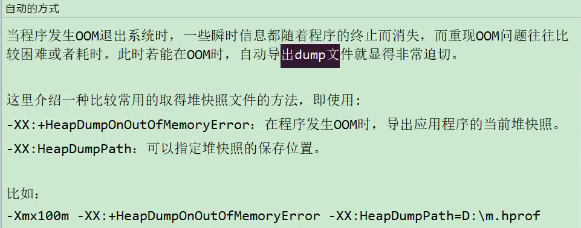
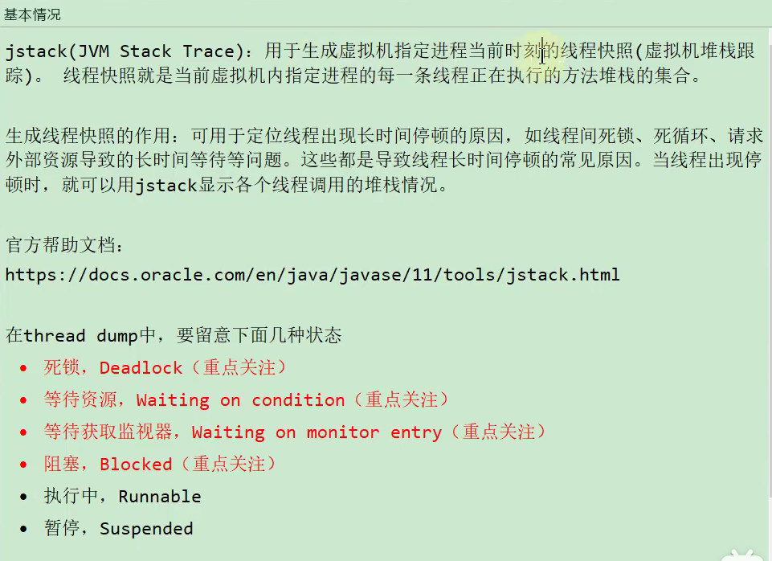
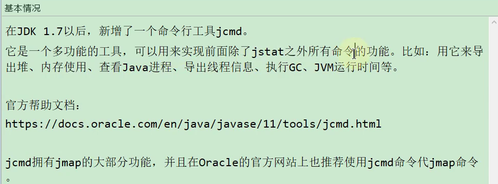
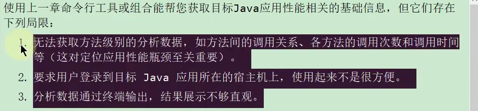
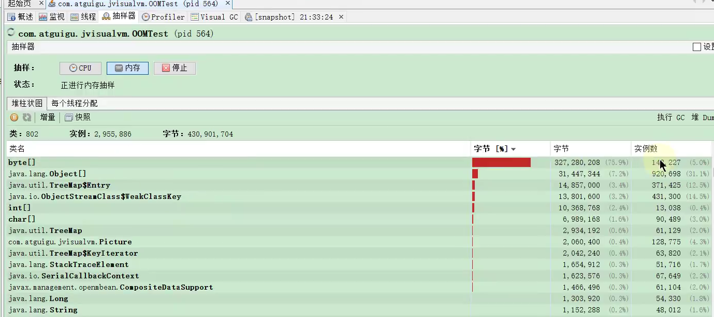
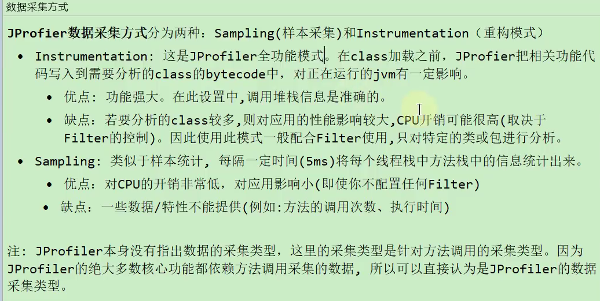
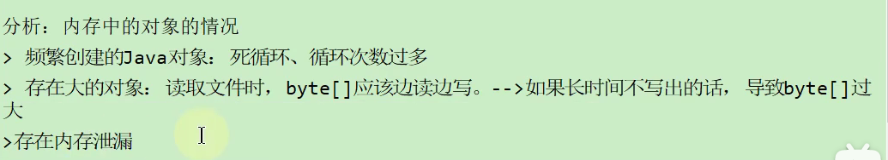

# 1.概述篇


# 2.JVM监控和诊断工具-命令行工具


## jps


## jstat


## jinfo


## jmap


```
format=b也就是说生成的文件是标准文件
```




heap没有jinfo好用，jinfo可以近似实时的展示。jmap只能展示一瞬间


## jhat


## jstack

**打印线程快照**




死锁


死锁位置


线程sleep的状态和在sycnronized状态


## jcmd




# 3.JVM监控和诊断工具-GUI




## jconsole


## visual vm


[**实时**]()


[**线程的状态明确**]()


[**dump**]()


**生成之后，另存为，保存**


[**线程dump**]()


[**抽样器**]()




## JProfiler







## Arthas


**火焰图**


# 4.常用的JVM参数


## jvm参数选项类型

### 标准


### -X


### -XX


#### PrintFlagsFinal


## 常用的jvm参数选项


### 堆栈方法区等内存大小设置


```
-XX:+UseAdaptivePolicy  默认是开启的，虽然你的默认比例是8:1:1，但是自动调整就会导致比例是6:1:1
而当你显式地设置了survivorratio=8，比例就会是8:1:1
```


### OutofMemory相关


### 垃圾回收器相关选项


### GC日志相关


不常用


### 其他参数


# 5.分析GC日志

## GC日志分析工具

### GCEasy

各种GC的信息，吞吐量啥的


