# 从实际案例聊聊Java应用的GC优化

[**当Java程序性能达不到既定目标，且其他优化手段都已经穷尽时**]()，通常需要调整垃圾回收器来进一步提高性能，称为GC优化。但GC算法复杂，影响GC性能的参数众多，且参数调整又依赖于应用各自的特点，这些因素很大程度上增加了GC优化的难度。即便如此，GC调优也不是无章可循，仍然有一些通用的思考方法。

本篇会介绍这些通用的GC优化策略和相关实践案例，主要包括如下内容：

- 优化前准备: 简单回顾JVM相关知识、介绍GC优化的一些通用策略。 

- 优化方法: 介绍调优的一般流程：明确优化目标→优化→跟踪优化结果。 

- 优化案例: 简述笔者所在团队遇到的GC问题以及优化方案。


## 一、优化前的准备

### GC优化需知

1. GC优化不能解决一切性能问题，它是最后的调优手段。

### JVM基础回顾

#### JVM内存结构

当代主流虚拟机（Hotspot VM）的垃圾回收都采用“分代回收”的算法。“分代回收”是基于这样一个事实：对象的生命周期不同，所以针对不同生命周期的对象可以采取不同的回收方式，以便提高回收效率。

Hotspot VM将内存划分为不同的物理区，就是“分代”思想的体现。如图所示，JVM内存主要由新生代、老年代、永久代构成。


① 新生代（Young Generation）：大多数对象在新生代中被创建，其中很多对象的生命周期很短。每次新生代的垃圾回收（又称Minor GC）后只有少量对象存活，所以选用复制算法，只需要少量的复制成本就可以完成回收。

② 老年代（Old Generation）：在新生代中经历了N次垃圾回收后仍然存活的对象，就会被放到年老代，该区域中对象存活率高。老年代的垃圾回收（又称Major GC）通常使用“标记-清理”或“标记-整理”算法。整堆包括新生代和老年代的垃圾回收称为Full GC（HotSpot VM里，除了CMS之外，其它能收集老年代的GC都会同时收集整个GC堆，包括新生代）。

③ 永久代（Perm Generation）：主要存放元数据，例如Class、Method的元信息，与垃圾回收要回收的Java对象关系不大。相对于新生代和年老代来说，该区域的划分对垃圾回收影响比较小。

#### 常见垃圾回收器

不同的垃圾回收器，适用于不同的场景。常用的垃圾回收器：

- 串行（Serial）回收器是单线程的一个回收器，简单、易实现、效率高。
- 并行（ParNew）回收器是Serial的多线程版，可以充分的利用CPU资源，减少回收的时间。
- 吞吐量优先（Parallel Scavenge）回收器，侧重于吞吐量的控制。
- 并发标记清除（CMS，Concurrent Mark Sweep）回收器是一种以获取最短回收停顿时间为目标的回收器，该回收器是基于“标记-清除”算法实现的。

#### GC日志

每一种回收器的日志格式都是由其自身的实现决定的，换而言之，每种回收器的日志格式都可以不一样。但虚拟机设计者为了方便用户阅读，将各个回收器的日志都维持一定的共性。[JavaGC日志](http://blog.csdn.net/wanglha/article/details/48713217) 中简单介绍了这些共性。

### 参数基本策略

各分区的大小对GC的性能影响很大。如何将各分区调整到合适的大小，[**分析活跃数据的大小**]()是很好的切入点。

**活跃数据的大小**是指，应用程序稳定运行时长期存活对象在堆中占用的空间大小，也就是Full GC后堆中老年代占用空间的大小。可以通过GC日志中Full GC之后老年代数据大小得出，比较准确的方法是在程序稳定后，多次获取GC数据，通过取平均值的方式计算活跃数据的大小。活跃数据和各分区之间的比例关系如下：

| 空间   | 倍数                                    |
| :----- | :-------------------------------------- |
| 总大小 | **3-4** 倍活跃数据的大小                |
| 新生代 | **1-1.5** 活跃数据的大小                |
| 老年代 | **2-3** 倍活跃数据的大小                |
| 永久代 | **1.2-1.5** 倍Full GC后的永久代空间占用 |

例如，根据GC日志获得老年代的活跃数据大小为300M，那么各分区大小可以设为：

> 总堆：1200MB = 300MB × 4* 
>
> 新生代：450MB = 300MB × 1.5* 
>
> 老年代： 750MB = 1200MB - 450MB*

这部分设置仅仅是堆大小的初始值，后面的优化中，可能会调整这些值，具体情况取决于应用程序的特性和需求。

## 二、优化步骤

GC优化一般步骤可以概括为：确定目标、优化参数、验收结果。

### 确定目标

明确应用程序的系统需求是性能优化的基础，系统的需求是指应用程序运行时某方面的要求，譬如： 

> -高可用，可用性达到几个9。 
>
> -低延迟，请求必须多少毫秒内完成响应。 
>
> -高吞吐，每秒完成多少次事务。

明确系统需求之所以重要，是因为上述性能指标间可能冲突。比如通常情况下，缩小延迟的代价是降低吞吐量或者消耗更多的内存或者两者同时发生。

由于笔者所在团队主要关注高可用和低延迟两项指标，所以接下来分析，如何量化GC时间和频率对于响应时间和可用性的影响。通过这个量化指标，可以计算出当前GC情况对服务的影响，也能评估出GC优化后对响应时间的收益，这两点对于低延迟服务很重要。

举例：假设单位时间T内发生一次持续25ms的GC，接口平均响应时间为50ms，且请求均匀到达，根据下图所示：


那么有(50ms+25ms)/T比例的请求会受GC影响，其中GC前的50ms内到达的请求都会增加25ms，GC期间的25ms内到达的请求，会增加0-25ms不等，如果时间T内发生N次GC，**受GC影响请求占比=(接口响应时间+GC时间)×N/T** 。可见无论[**降低单次GC时间还是降低GC次数N**]()都可以有效减少GC对响应时间的影响。

### 优化

通过收集GC信息，结合系统需求，确定优化方案，例如[**选用合适的GC回收器、重新设置内存比例、调整JVM参数**]()等。

进行调整后，将不同的优化方案分别应用到多台机器上，然后比较这些机器上GC的性能差异，有针对性的做出选择，再通过不断的试验和观察，找到最合适的参数。

### 验收优化结果

将修改应用到所有服务器，判断优化结果是否符合预期，总结相关经验。

接下来，我们通过三个案例来实践以上的优化流程和基本原则（本文中三个案例使用的垃圾回收器均为ParNew+CMS，CMS失败时Serial Old替补)。

## 三、GC优化案例

### 案例一 Major GC和Minor GC频繁

#### 确定目标

服务情况：Minor GC每分钟100次 ，Major GC每4分钟一次，单次Minor GC耗时25ms，单次Major GC耗时200ms，接口响应时间50ms。

由于这个服务要求低延时高可用，结合上文中提到的GC对服务响应时间的影响，计算可知由于Minor GC的发生，12.5%的请求响应时间会增加，其中8.3%的请求响应时间会增加25ms，可见当前GC情况对响应时间影响较大。

*（50ms+25ms）× 100次/60000ms = 12.5%，50ms × 100次/60000ms = 8.3%* 。

优化目标：降低TP99、TP90时间。

#### 优化

首先优化Minor GC频繁问题。通常情况下，由于新生代空间较小，Eden区很快被填满，就会导致频繁Minor GC，因此[**可以通过增大新生代空间来降低Minor GC的频率。**]()例如在相同的内存分配率的前提下，新生代中的Eden区增加一倍，Minor GC的次数就会减少一半。

这时很多人有这样的疑问，扩容Eden区虽然可以减少Minor GC的次数，但会增加单次Minor GC时间么？根据上面公式，如果单次Minor GC时间也增加，很难保证最后的优化效果。我们结合下面情况来分析，单次Minor GC时间主要受哪些因素影响？是否和新生代大小存在线性关系？ 

首先，单次Minor GC时间由以下两部分组成：T1（扫描新生代）和 T2（复制存活对象到Survivor区）如下图。（注：这里为了简化问题，我们认为T1只扫描新生代判断对象是否存活的时间，其实该阶段还需要扫描部分老年代，后面案例中有详细描述。）


- 扩容前：新生代容量为R ，假设对象A的存活时间为750ms，Minor GC间隔500ms，那么本次Minor GC时间= T1（扫描新生代R）+T2（复制对象A到S）。
- 扩容后：新生代容量为2R ，对象A的生命周期为750ms，那么Minor GC间隔增加为1000ms，此时Minor GC对象A已不再存活，不需要把它复制到Survivor区，那么本次GC时间 = 2 × T1（扫描新生代R），没有T2复制时间。

可见，扩容后，Minor GC时增加了T1（扫描时间），但省去T2（复制对象）的时间，更重要的是对于虚拟机来说，复制对象的成本要远高于扫描成本，所以，单次**Minor GC时间更多取决于GC后存活对象的数量，而非Eden区的大小**。因此如果堆中短期对象很多，那么扩容新生代，单次Minor GC时间不会显著增加。下面需要确认下服务中对象的生命周期分布情况：


通过上图GC日志中两处红色框标记内容可知： 

1. new threshold = 2（动态年龄判断，对象的晋升年龄阈值为2），对象仅经历2次Minor GC后就晋升到老年代，这样老年代会迅速被填满，直接导致了频繁的Major GC。 

2. Major GC后老年代使用空间为300M+，意味着此时绝大多数(86% = 2G/2.3G)的对象已经不再存活，也就是说生命周期长的对象占比很小。

由此可见，[**服务中存在大量短期临时对象，扩容新生代空间后，Minor GC频率降低，对象在新生代得到充分回收，只有生命周期长的对象才进入老年代。这样老年代增速变慢，Major GC频率自然也会降低。**]()

#### 优化结果

通过扩容新生代为为原来的三倍，单次Minor GC时间增加小于5ms，频率下降了60%，服务响应时间TP90，TP99都下降了10ms+，服务可用性得到提升。

调整前：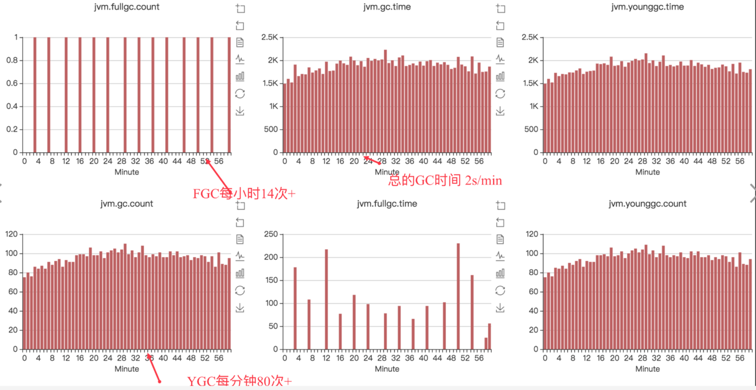

调整后：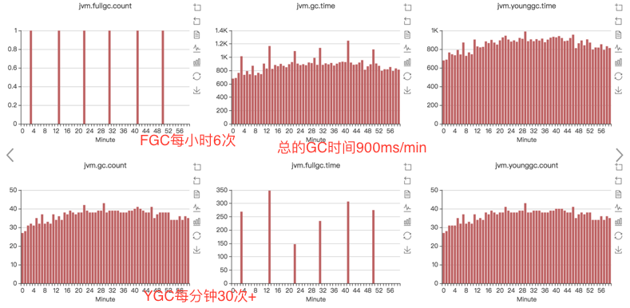

#### 小结

如何选择各分区大小应该依赖应用程序中**对象生命周期的分布情况：**

**[如果应用存在大量的短期对象，应该选择较大的年轻代；]()**

[**如果存在相对较多的持久对象，老年代应该适当增大。**]()

#### 更多思考

关于上文中提到晋升年龄阈值为2，很多同学有疑问，为什么设置了MaxTenuringThreshold=15，对象仍然仅经历2次Minor GC，就晋升到老年代？这里涉及到“动态年龄计算”的概念。

[**动态年龄计算**：]()Hotspot遍历所有对象时，按照年龄从小到大对其所占用的大小进行累积，当累积的某个年龄大小超过了survivor区的一半时，[**取这个年龄和MaxTenuringThreshold中更小的一个值**]()，作为新的晋升年龄阈值。

在本案例中，调优前：Survivor区 = 64M，desired survivor = 32M，此时Survivor区中age<=2的对象累计大小为41M，41M大于32M，所以晋升年龄阈值被设置为2，下次Minor GC时将年龄超过2的对象被晋升到老年代。

[**JVM引入动态年龄计算，主要基于如下两点考虑：**]()

1. 如果固定按照MaxTenuringThreshold设定的阈值作为晋升条件： a）MaxTenuringThreshold设置的过大，原本应该晋升的对象一直停留在Survivor区，直到Survivor区溢出，一旦溢出发生，Eden+Svuvivor中对象将不再依据年龄全部提升到老年代，这样[**对象老化的机制就失效了**]()。 b）MaxTenuringThreshold设置的过小，“过早晋升”即对象不能在新生代充分被回收，大量短期对象被晋升到老年代，老年代空间迅速增长，引起频繁的Major GC。[**分代回收失去了意义**]()，严重影响GC性能。
2. [**相同应用在不同时间的表现不同**]()：特殊任务的执行或者流量成分的变化，都会导致对象的生命周期分布发生波动，那么固定的阈值设定，因为无法动态适应变化，会造成和上面相同的问题。

总结来说，为了更好的适应不同程序的内存情况，虚拟机并不总是要求对象年龄必须达到Maxtenuringthreshhold再晋级老年代。

### 案例二 请求高峰期发生GC，导致服务可用性下降

#### 确定目标

GC日志显示，高峰期**CMS在重标记（Remark）阶段**耗时1.39s。Remark阶段是Stop-The-World（以下简称为STW）的，即在执行垃圾回收时，Java应用程序中除了垃圾回收器线程之外其他所有线程都被挂起，意味着在此期间，用户正常工作的线程全部被暂停下来，这是低延时服务不能接受的。本次优化目标是降低Remark时间。


#### 优化

解决问题前，先回顾一下CMS的四个主要阶段，以及各个阶段的工作内容。

下图展示了CMS各个阶段可以标记的对象，用不同颜色区分。 

1. Init-mark初始标记(STW) ，该阶段进行可达性分析，标记GC ROOT能直接关联到的对象，所以很快。 

2. Concurrent-mark并发标记，由前阶段标记过的绿色对象出发，所有可到达的对象都在本阶段中标记。 

3. Remark重标记(STW) ，暂停所有用户线程，重新扫描堆中的对象，进行可达性分析，标记活着的对象。因为并发标记阶段是和用户线程并发执行的过程，所以该过程中可能有用户线程修改某些活跃对象的字段，指向了一个未标记过的对象，如下图中红色对象在并发标记开始时不可达，但是并行期间引用发生变化，变为对象可达，这个阶段需要重新标记出此类对象，防止在下一阶段被清理掉，这个过程也是需要STW的。特别需要注意一点，这个阶段是以新生代中对象为根来判断对象是否存活的。

4. 并发清理，进行并发的垃圾清理。


可见，Remark阶段主要是通过扫描堆来判断对象是否存活。那么准确判断对象是否存活，需要扫描哪些对象？CMS对老年代做回收，Remark阶段仅扫描老年代是否可行？结论是不可行，原因如下：

如果仅扫描老年代中对象，即以老年代中对象为根，判断对象是否存在引用，上图中，对象A因为引用存在新生代中，它在Remark阶段就不会被修正标记为可达，GC时会被错误回收。 新生代对象持有老年代中对象的引用，这种情况称为**“跨代引用”**。因它的存在，[**Remark阶段必须扫描整个堆来判断对象是否存活，包括图中灰色的不可达对象**]()。

灰色对象已经不可达，但仍然需要扫描的原因：**新生代GC和老年代的GC是各自分开独立进行的**，只有Minor GC时才会使用根搜索算法，标记新生代对象是否可达，也就是说虽然一些对象已经不可达，但在Minor GC发生前不会被标记为不可达，CMS也无法辨认哪些对象存活，只能全堆扫描（新生代+老年代）。由此可见[**堆中对象的数目影响了Remark阶段耗时。**]() 分析GC日志可以得出同样的规律，Remark耗时>500ms时，新生代使用率都在75%以上。这样降低Remark阶段耗时问题转换成如何减少新生代对象数量。

新生代中对象的特点是“朝生夕灭”，这样如果Remark前执行一次Minor GC，大部分对象就会被回收。CMS就采用了这样的方式，[**在Remark前增加了一个可中断的并发预清理（CMS-concurrent-abortable-preclean）**]()，该阶段主要工作仍然是并发标记对象是否存活，只是这个过程可被中断。此阶段在Eden区使用超过2M时启动，当然2M是默认的阈值，可以通过参数修改。如果此阶段执行时等到了Minor GC，那么上述灰色对象将被回收，Reamark阶段需要扫描的对象就少了。

除此之外CMS为了避免这个阶段没有等到Minor GC而陷入无限等待，提供了参数CMSMaxAbortablePrecleanTime ，默认为5s，含义是如果可中断的预清理执行超过5s，不管发没发生Minor GC，都会中止此阶段，进入Remark。 根据GC日志红色标记2处显示，可中断的并发预清理执行了5.35s，超过了设置的5s被中断，期间没有等到Minor GC ，所以Remark时新生代中仍然有很多对象。

对于这种情况，CMS提供CMSScavengeBeforeRemark参数，用来保证Remark前强制进行一次Minor GC。

#### 优化结果

经过增加CMSScavengeBeforeRemark参数，单次执行时间>200ms的GC停顿消失，从监控上观察，GCtime和业务波动保持一致，不再有明显的毛刺。

#### 小结

通过案例分析了解到，由于跨代引用的存在，CMS在Remark阶段必须扫描整个堆，同时为了避免扫描时新生代有很多对象，增加了可中断的预清理阶段用来等待Minor GC的发生。只是该阶段有时间限制，如果超时等不到Minor GC，Remark时新生代仍然有很多对象，我们的调优策略是，通过参数强制Remark前进行一次Minor GC，从而降低Remark阶段的时间。

#### 更多思考

案例中只涉及老年代GC，其实新生代GC存在同样的问题，即老年代可能持有新生代对象引用，所以Minor GC时也必须扫描老年代。

[**JVM是如何避免Minor GC时扫描全堆的？**]() 

经过统计信息显示，老年代持有新生代对象引用的情况不足1%，根据这一特性JVM引入了卡表（card table）来实现这一目的。如下图所示：


**卡表**的具体策略是将老年代的空间分成大小为512B的若干张卡（card）。卡表本身是单字节数组，数组中的每个元素对应着一张卡，当发生老年代引用新生代时，虚拟机将该卡对应的卡表元素设置为适当的值。如上图所示，卡表3被标记为脏（**卡表还有另外的作用，标识并发标记阶段哪些块被修改过**），之后Minor GC时通过扫描卡表就可以很快的识别哪些卡中存在老年代指向新生代的引用。这样虚拟机通过空间换时间的方式，避免了全堆扫描。

总结来说，CMS的设计聚焦在获取最短的时延，为此它“不遗余力”地做了很多工作，包括尽量让应用程序和GC线程并发、增加可中断的并发预清理阶段、引入卡表等，虽然这些操作牺牲了一定吞吐量但获得了更短的回收停顿时间。

### 案例三 发生Stop-The-World的GC

#### 确定目标

GC日志如下图（在GC日志中，Full GC是用来说明这次垃圾回收的停顿类型，代表STW类型的GC，并不特指老年代GC），根据GC日志可知本次Full GC耗时1.23s。这个在线服务同样要求低时延高可用。本次优化目标是降低单次STW回收停顿时间，提高可用性。


#### 优化

首先，什么时候可能会触发STW的Full GC呢？ 

1. Perm空间不足； 

2. CMS GC时出现promotion failed和concurrent mode failure（concurrent mode failure发生的原因一般是CMS正在进行，但是由于老年代空间不足，需要尽快回收老年代里面的不再被使用的对象，这时停止所有的线程，同时终止CMS，直接进行Serial Old GC）；

3. 统计得到的Young GC晋升到老年代的平均大小大于老年代的剩余空间；

4. 主动触发Full GC（执行jmap -histo:live [pid]）来避免碎片问题。

然后，我们来逐一分析一下： - 排除原因2：如果是原因2中两种情况，日志中会有特殊标识，目前没有。 - 排除原因3：根据GC日志，当时老年代使用量仅为20%，也不存在大于2G的大对象产生。 - 排除原因4：因为当时没有相关命令执行。 - 锁定原因1：根据日志发现Full GC后，Perm区变大了，推断是由于永久代空间不足容量扩展导致的。

找到原因后解决方法有两种： 

1. 通过把-XX:PermSize参数和-XX:MaxPermSize设置成一样，强制虚拟机在启动的时候就把永久代的容量固定下来，避免运行时自动扩容。 

2. CMS默认情况下不会回收Perm区，通过参数CMSPermGenSweepingEnabled、CMSClassUnloadingEnabled ，可以让CMS在Perm区容量不足时对其回收。

由于该服务没有生成大量动态类，回收Perm区收益不大，所以我们采用方案1，启动时将Perm区大小固定，避免进行动态扩容。

#### 优化结果

调整参数后，服务不再有Perm区扩容导致的STW GC发生。

#### 小结

对于性能要求很高的服务，建议将MaxPermSize和MinPermSize设置成一致（JDK8开始，Perm区完全消失，转而使用元空间。而元空间是直接存在内存中，不在JVM中），[**Xms和Xmx也设置为相同，这样可以减少内存自动扩容和收缩带来的性能损失。**]()虚拟机启动的时候就会把参数中所设定的内存全部化为私有，即使扩容前有一部分内存不会被用户代码用到，这部分内存在虚拟机中被标识为虚拟内存，也不会交给其他进程使用。

## 四、总结

结合上述GC优化案例做个总结： 

1. 首先再次声明，在进行GC优化之前，需要确认项目的架构和代码等已经没有优化空间。我们不能指望一个系统架构有缺陷或者代码层次优化没有穷尽的应用，通过GC优化令其性能达到一个质的飞跃。 

2. 其次，通过上述分析，可以看出虚拟机内部已有很多优化来保证应用的稳定运行，所以不要为了调优而调优，不当的调优可能适得其反。 

3. 最后，GC优化是一个系统而复杂的工作，没有万能的调优策略可以满足所有的性能指标。GC优化必须建立在我们深入理解各种垃圾回收器的基础上，才能有事半功倍的效果。

# Java中9种常见的CMS GC问题分析与解决

## 1. 写在前面

### 1.1 引言

自 Sun 发布 Java 语言以来，开始使用 GC 技术来进行内存自动管理，避免了手动管理带来的悬挂指针（Dangling Pointer）问题，很大程度上提升了开发效率，从此 GC 技术也一举成名。GC 有着非常悠久的历史，1960 年有着“Lisp 之父”和“人工智能之父”之称的 John McCarthy 就在论文中发布了 GC 算法，60 年以来， GC 技术的发展也突飞猛进，但不管是多么前沿的收集器也都是基于三种基本算法的组合或应用，也就是说 GC 要解决的根本问题这么多年一直都没有变过。笔者认为，在不太远的将来， GC 技术依然不会过时，比起日新月异的新技术，GC 这门古典技术更值得我们学习。

GC 问题处理能力能不能系统性掌握？一些影响因素都是**互为因果**的问题该怎么分析？比如一个服务 RT 突然上涨，有 GC 耗时增大、线程 Block 增多、慢查询增多、CPU 负载高四个表象，到底哪个是诱因？如何判断 GC 有没有问题？使用 CMS 有哪些常见问题？如何判断根因是什么？如何解决或避免这些问题？阅读完本文，相信你将会对 CMS GC 的问题处理有一个系统性的认知，更能游刃有余地解决这些问题，下面就让我们开始吧！

### 1.2 概览

想要系统性地掌握 GC 问题处理，笔者这里给出一个学习路径，整体文章的框架也是按照这个结构展开，主要分四大步。


- **建立知识体系：** 从 JVM 的内存结构到垃圾收集的算法和收集器，学习 GC 的基础知识，掌握一些常用的 GC 问题分析工具。
- **确定评价指标：** 了解基本 GC 的评价方法，摸清如何设定独立系统的指标，以及在业务场景中判断 GC 是否存在问题的手段。
- **场景调优实践：** 运用掌握的知识和系统评价指标，分析与解决九种 CMS 中常见 GC 问题场景。
- **总结优化经验：** 对整体过程做总结并提出笔者的几点建议，同时将总结到的经验完善到知识体系之中。

## 2. GC 基础

### 2.1 基础概念

- **GC：** GC 本身有三种语义，下文需要根据具体场景带入不同的语义：
  - **Garbage Collection**：垃圾收集技术，名词。
  - **Garbage Collector**：垃圾收集器，名词。
  - **Garbage Collecting**：垃圾收集动作，动词。
- **Mutator：** 生产垃圾的角色，也就是我们的应用程序，垃圾制造者，通过 Allocator 进行 allocate 和 free。
- **TLAB：** Thread Local Allocation Buffer 的简写，基于 CAS 的独享线程（Mutator Threads）可以优先将对象分配在 Eden 中的一块内存，因为是 Java 线程独享的内存区没有锁竞争，所以分配速度更快，每个 TLAB 都是一个线程独享的。
- **Card Table：** 中文翻译为卡表，主要是用来标记卡页的状态，每个卡表项对应一个卡页。当卡页中一个对象引用有写操作时，写屏障将会标记对象所在的卡表状态改为 dirty，卡表的本质是用来解决跨代引用的问题。

### 2.2 JVM 内存划分

从 JCP（Java Community Process）的官网中可以看到，目前 Java 版本最新已经到了 Java 16，未来的 Java 17 以及现在的 Java 11 和 Java 8 是 LTS 版本，JVM 规范也在随着迭代在变更，由于本文主要讨论 CMS，此处还是放 Java 8 的内存结构。


GC 主要工作在 Heap 区和 MetaSpace 区（上图蓝色部分），在 Direct Memory 中，如果使用的是 DirectByteBuffer，那么在分配内存不够时则是 GC 通过 `Cleaner#clean` 间接管理。

任何自动内存管理系统都会面临的步骤：为新对象分配空间，然后收集垃圾对象空间，下面我们就展开介绍一下这些基础知识。

### 2.3 分配对象

Java 中对象地址操作主要使用 Unsafe 调用了 C 的 allocate 和 free 两个方法，分配方法有两种：

- **空闲链表（free list）：** 通过额外的存储记录空闲的地址，将随机 IO 变为顺序 IO，但带来了额外的空间消耗。
- **碰撞指针（bump pointer）：** 通过一个指针作为分界点，需要分配内存时，仅需把指针往空闲的一端移动与对象大小相等的距离，分配效率较高，但使用场景有限。

### 2.4 收集对象

#### 2.4.1 识别垃圾

- **引用计数法（Reference Counting）：** 对每个对象的引用进行计数，每当有一个地方引用它时计数器 +1、引用失效则 -1，引用的计数放到对象头中，大于 0 的对象被认为是存活对象。[**虽然循环引用的问题可通过 Recycler 算法解决，但是在多线程环境下，引用计数变更也要进行昂贵的同步操作，性能较低**]()，早期的编程语言会采用此算法。
- **可达性分析，又称引用链法（Tracing GC）：** 从 GC Root 开始进行对象搜索，可以被搜索到的对象即为可达对象，此时还不足以判断对象是否存活/死亡，需要经过多次标记才能更加准确地确定，整个连通图之外的对象便可以作为垃圾被回收掉。目前 Java 中主流的虚拟机均采用此算法。

备注：引用计数法是可以处理循环引用问题的，下次面试时不要再这么说啦~ ~

#### 2.4.2 收集算法

自从有自动内存管理出现之时就有的一些收集算法，不同的收集器也是在不同场景下进行组合。

- **Mark-Sweep（标记-清除）：** 回收过程主要分为两个阶段，第一阶段为追踪（Tracing）阶段，即从 GC Root 开始遍历对象图，并标记（Mark）所遇到的每个对象，第二阶段为清除（Sweep）阶段，即回收器检查堆中每一个对象，并将所有未被标记的对象进行回收，整个过程不会发生对象移动。整个算法在不同的实现中会使用三色抽象（Tricolour Abstraction）、位图标记（BitMap）等技术来提高算法的效率，存活对象较多时较高效。
- **Mark-Compact （标记-整理）：** 这个算法的主要目的就是解决在非移动式回收器中都会存在的碎片化问题，也分为两个阶段，第一阶段与 Mark-Sweep 类似，第二阶段则会对存活对象按照整理顺序（Compaction Order）进行整理。主要实现有双指针（Two-Finger）回收算法、滑动回收（Lisp2）算法和引线整理（Threaded Compaction）算法等。
- **Copying（复制）：** 将空间分为两个大小相同的 From 和 To 两个半区，同一时间只会使用其中一个，每次进行回收时将一个半区的存活对象通过复制的方式转移到另一个半区。有递归（Robert R. Fenichel 和 Jerome C. Yochelson提出）和迭代（Cheney 提出）算法，以及解决了前两者递归栈、缓存行等问题的近似优先搜索算法。复制算法可以通过碰撞指针的方式进行快速地分配内存，但是也存在着空间利用率不高的缺点，另外就是存活对象比较大时复制的成本比较高。

三种算法在是否移动对象、空间和时间方面的一些对比，假设存活对象数量为 *L*、堆空间大小为 *H*，则：


把 mark、sweep、compaction、copying 这几种动作的耗时放在一起看，大致有这样的关系：

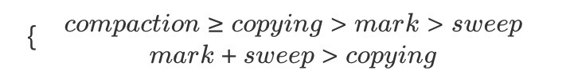

虽然 compaction 与 copying 都涉及移动对象，但取决于具体算法，compaction 可能要先计算一次对象的目标地址，然后修正指针，最后再移动对象。copying 则可以把这几件事情合为一体来做，所以可以快一些。另外，还需要留意 GC 带来的开销不能只看 Collector 的耗时，还得看 Allocator 。

如果能保证内存没碎片，分配就可以用 pointer bumping 方式，只需要挪一个指针就完成了分配，非常快。而如果内存有碎片就得用 freelist 之类的方式管理，分配速度通常会慢一些。

### 2.5 收集器

目前在 Hotspot VM 中主要有分代收集和分区收集两大类，具体可以看下面的这个图，不过未来会逐渐向分区收集发展。在美团内部，有部分业务尝试用了 ZGC（感兴趣的同学可以学习下这篇文章 [新一代垃圾回收器ZGC的探索与实践](https://tech.meituan.com/2020/08/06/new-zgc-practice-in-meituan.html)），其余基本都停留在 CMS 和 G1 上。另外在 JDK11 后提供了一个不执行任何垃圾回收动作的回收器 Epsilon（A No-Op Garbage Collector）用作性能分析。


#### 2.5.1 分代收集器

- **ParNew：** 一款多线程的收集器，采用复制算法，主要工作在 Young 区，可以通过 `-XX:ParallelGCThreads` 参数来控制收集的线程数，整个过程都是 STW 的，常与 CMS 组合使用。
- **CMS：** 以获取最短回收停顿时间为目标，采用“标记-清除”算法，分 4 大步进行垃圾收集，其中初始标记和重新标记会 STW ，多数应用于互联网站或者 B/S 系统的服务器端上，JDK9 被标记弃用，JDK14 被删除

#### 2.5.2 分区收集器

- **G1：** 一种服务器端的垃圾收集器，应用在多处理器和大容量内存环境中，在实现高吞吐量的同时，尽可能地满足垃圾收集暂停时间的要求。
- **ZGC：** JDK11 中推出的一款[**低延迟垃圾回收器**]()，适用于大内存低延迟服务的内存管理和回收，SPECjbb 2015 基准测试，在 128G 的大堆下，最大停顿时间才 1.68 ms，停顿时间远胜于 G1 和 CMS。
- **Shenandoah：** 由 Red Hat 的一个团队负责开发，与 G1 类似，基于 Region 设计的垃圾收集器，但不需要 Remember Set 或者 Card Table 来记录跨 Region 引用，停顿时间和堆的大小没有任何关系。停顿时间与 ZGC 接近，下图为与 CMS 和 G1 等收集器的 benchmark。


#### 2.5.3 常用收集器

目前使用最多的是 CMS 和 G1 收集器，二者都有分代的概念，主要内存结构如下：


### 2.6 常用工具

#### 2.6.1 命令行终端

- 标准终端类：jps、jinfo、jstat、jstack、jmap
- 功能整合类：jcmd、vjtools、arthas、greys

#### 2.6.2 可视化界面

- 简易：JConsole、JVisualvm、HA、GCHisto、GCViewer
- 进阶：MAT、JProfiler

命令行推荐 arthas ，可视化界面推荐 JProfiler，此外还有一些在线的平台 [gceasy](https://gceasy.io/)、[heaphero](https://heaphero.io/)、[fastthread](https://fastthread.io/) ，美团内部的 Scalpel（一款自研的 JVM 问题诊断工具，暂时未开源）也比较好用。

## 3. GC 问题判断

在做 GC 问题排查和优化之前，我们需要先来明确下到底是不是 GC 直接导致的问题，或者应用代码导致的 GC 异常，最终出现问题。

### 3.1 判断 GC 有没有问题？

#### 3.1.1 设定评价标准

评判 GC 的两个核心指标：

- **延迟（Latency）：** 也可以理解为最大停顿时间，即垃圾收集过程中一次 STW 的最长时间，越短越好，一定程度上可以接受频次的增大，GC 技术的主要发展方向。
- **吞吐量（Throughput）：** 应用系统的生命周期内，由于 GC 线程会占用 Mutator 当前可用的 CPU 时钟周期，吞吐量即为 Mutator 有效花费的时间占系统总运行时间的百分比，例如系统运行了 100 min，GC 耗时 1 min，则系统吞吐量为 99%，吞吐量优先的收集器可以接受较长的停顿。

目前各大互联网公司的系统基本都更追求低延时，避免一次 GC 停顿的时间过长对用户体验造成损失，衡量指标需要结合一下应用服务的 SLA，主要如下两点来判断：


简而言之，即为**一次停顿的时间不超过应用服务的 TP9999，GC 的吞吐量不小于 99.99%**。举个例子，假设某个服务 A 的 TP9999 为 80 ms，平均 GC 停顿为 30 ms，那么该服务的最大停顿时间最好不要超过 80 ms，GC 频次控制在 5 min 以上一次。如果满足不了，那就需要调优或者通过更多资源来进行并联冗余。（大家可以先停下来，看看监控平台上面的 gc.meantime 分钟级别指标，如果超过了 6 ms 那单机 GC 吞吐量就达不到 4 个 9 了。）

备注：除了这两个指标之外还有 Footprint（资源量大小测量）、反应速度等指标，互联网这种实时系统追求低延迟，而很多嵌入式系统则追求 Footprint。

#### 3.1.2 读懂 GC Cause

拿到 GC 日志，我们就可以简单分析 GC 情况了，通过一些工具，我们可以比较直观地看到 Cause 的分布情况，如下图就是使用 gceasy 绘制的图表：


如上图所示，我们很清晰的就能知道是什么原因引起的 GC，以及每次的时间花费情况，但是要分析 GC 的问题，先要读懂 GC Cause，即 JVM 什么样的条件下选择进行 GC 操作。

重点需要关注的几个GC Cause：

- **System.gc()：** 手动触发GC操作。
- **CMS：** CMS GC 在执行过程中的一些动作，重点关注 CMS Initial Mark 和 CMS Final Remark 两个 STW 阶段。
- **Promotion Failure：** Old 区没有足够的空间分配给 Young 区晋升的对象（即使总可用内存足够大）。
- **Concurrent Mode Failure：** CMS GC 运行期间，Old 区预留的空间不足以分配给新的对象，此时收集器会发生退化，严重影响 GC 性能，下面的一个案例即为这种场景。
- **GCLocker Initiated GC：** 如果线程执行在 JNI 临界区时，刚好需要进行 GC，此时 GC Locker 将会阻止 GC 的发生，同时阻止其他线程进入 JNI 临界区，直到最后一个线程退出临界区时触发一次 GC。

### 3.2 判断是不是 GC 引发的问题？

到底是结果（现象）还是原因，在一次 GC 问题处理的过程中，如何判断是 GC 导致的故障，还是系统本身引发 GC 问题。这里继续拿在本文开头提到的一个 Case：“GC 耗时增大、线程 Block 增多、慢查询增多、CPU 负载高等四个表象，如何判断哪个是根因？”，笔者这里根据自己的经验大致整理了四种判断方法供参考：

- **时序分析：** 先发生的事件是根因的概率更大，通过监控手段分析各个指标的异常时间点，还原事件时间线，如先观察到 CPU 负载高（要有足够的时间 Gap），那么整个问题影响链就可能是：CPU 负载高 -> 慢查询增多 -> GC 耗时增大 -> 线程Block增多 -> RT 上涨。
- **概率分析：** 使用统计概率学，结合历史问题的经验进行推断，由近到远按类型分析，如过往慢查的问题比较多，那么整个问题影响链就可能是：慢查询增多 -> GC 耗时增大 -> CPU 负载高 -> 线程 Block 增多 -> RT上涨。
- **实验分析：** 通过故障演练等方式对问题现场进行模拟，触发其中部分条件（一个或多个），观察是否会发生问题，如只触发线程 Block 就会发生问题，那么整个问题影响链就可能是：线程Block增多 -> CPU 负载高 -> 慢查询增多 -> GC 耗时增大 -> RT 上涨。
- **反证分析：** 对其中某一表象进行反证分析，即判断表象的发不发生跟结果是否有相关性，例如我们从整个集群的角度观察到某些节点慢查和 CPU 都正常，但也出了问题，那么整个问题影响链就可能是：GC 耗时增大 -> 线程 Block 增多 -> RT 上涨。

不同的根因，后续的分析方法是完全不同的。[**如果是 CPU 负载高那可能需要用火焰图看下热点、如果是慢查询增多那可能需要看下 DB 情况、如果是线程 Block 引起那可能需要看下锁竞争的情况**]()，最后如果各个表象证明都没有问题，那可能 GC 确实存在问题，可以继续分析 GC 问题了。

### 3.3 问题分类导读

#### 3.3.1 Mutator 类型

Mutator 的类型根据对象存活时间比例图来看主要分为两种，在弱分代假说中也提到类似的说法，如下图所示 “Survival Time” 表示对象存活时间，“Rate” 表示对象分配比例：

- **IO 交互型：** 互联网上目前大部分的服务都属于该类型，例如分布式 RPC、MQ、HTTP 网关服务等，对内存要求并不大，大部分对象在 TP9999 的时间内都会死亡， Young 区越大越好。
- **MEM 计算型：** 主要是分布式数据计算 Hadoop，分布式存储 HBase、Cassandra，自建的分布式缓存等，对内存要求高，对象存活时间长，Old 区越大越好。

当然，除了二者之外还有介于两者之间的场景，本篇文章主要讨论第一种情况。对象 Survival Time 分布图，对我们设置 GC 参数有着非常重要的指导意义，如下图就可以简单推算分代的边界。


#### 3.3.2 GC 问题分类

笔者选取了九种不同类型的 GC 问题，覆盖了大部分场景，如果有更好的场景，欢迎在评论区给出。

- **Unexpected GC：** 意外发生的 GC，实际上不需要发生，我们可以通过一些手段去避免。
  - **Space Shock：** 空间震荡问题，参见“场景一：动态扩容引起的空间震荡”。
  - **Explicit GC：** 显示执行 GC 问题，参见“场景二：显式 GC 的去与留”。
- **Partial GC：** 部分收集操作的 GC，只对某些分代/分区进行回收。
  - **Young GC：** 分代收集里面的 Young 区收集动作，也可以叫做 Minor GC。
    - **ParNew：** Young GC 频繁，参见“场景四：过早晋升”。
  - **Old GC：** 分代收集里面的 Old 区收集动作，也可以叫做 Major GC，有些也会叫做 Full GC，但其实这种叫法是不规范的，在 CMS 发生 Foreground GC 时才是 Full GC，CMSScavengeBeforeRemark 参数也只是在 Remark 前触发一次Young GC。
    - **CMS：** Old GC 频繁，参见“场景五：CMS Old GC 频繁”。
    - **CMS：** Old GC 不频繁但单次耗时大，参见“场景六：单次 CMS Old GC 耗时长”。
- **Full GC：** 全量收集的 GC，对整个堆进行回收，STW 时间会比较长，一旦发生，影响较大，也可以叫做 Major GC，参见“场景七：内存碎片&收集器退化”。
- **MetaSpace：** 元空间回收引发问题，参见“场景三：MetaSpace 区 OOM”。
- **Direct Memory：** 直接内存（也可以称作为堆外内存）回收引发问题，参见“场景八：堆外内存 OOM”。
- **JNI：** 本地 Native 方法引发问题，参见“场景九：JNI 引发的 GC 问题”。

#### 3.3.3 排查难度

以下 GC 问题场景，排查难度从上到下依次递增。

## 4. 常见场景分析与解决

### 4.1 场景一：动态扩容引起的空间震荡

#### 4.1.1 现象

服务**刚刚启动时 GC 次数较多**，最大空间剩余很多但是依然发生 GC，这种情况我们可以通过观察 GC 日志或者通过监控工具来观察堆的空间变化情况即可。GC Cause 一般为 Allocation Failure，且在 GC 日志中会观察到经历一次 GC ，堆内各个空间的大小会被调整，如下图所示：


#### 4.1.2 原因

在 JVM 的参数中 `-Xms` 和 `-Xmx` 设置的不一致，在初始化时只会初始 `-Xms` 大小的空间存储信息，每当空间不够用时再向操作系统申请，这样的话必然要进行一次 GC。

另外，如果空间剩余很多时也会进行缩容操作，JVM 通过 `-XX:MinHeapFreeRatio` 和 `-XX:MaxHeapFreeRatio` 来控制扩容和缩容的比例，调节这两个值也可以控制伸缩的时机。

整个伸缩的模型理解可以看这个图，当 committed 的空间大小超过了低水位/高水位的大小，capacity 也会随之调整：


#### 4.1.3 策略

**定位**：观察 CMS GC 触发时间点 Old/MetaSpace 区的 committed 占比是不是一个固定的值，或者像上文提到的观察总的内存使用率也可以。

**解决**：[尽量**将成对出现的空间大小配置参数设置成固定的**]()，如 `-Xms` 和 `-Xmx`，`-XX:MaxNewSize` 和 `-XX:NewSize`，`-XX:MetaSpaceSize` 和 `-XX:MaxMetaSpaceSize` 等。

#### 4.1.4 小结

一般来说，我们需要保证 Java 虚拟机的堆是稳定的，确保 `-Xms` 和 `-Xmx` 设置的是一个值（即初始值和最大值一致），获得一个稳定的堆，同理在 MetaSpace 区也有类似的问题。不过在不追求停顿时间的情况下震荡的空间也是有利的，可以动态地伸缩以节省空间，例如作为富客户端的 Java 应用。

这个问题虽然初级，但是发生的概率还真不小，尤其是在一些规范不太健全的情况下。

### 4.2 场景二：显式 GC 的去与留

#### 4.2.1 现象

除了扩容缩容会触发 CMS GC 之外，还有 Old 区达到回收阈值、MetaSpace 空间不足、Young 区晋升失败、大对象担保失败等几种触发条件，如果这些情况都没有发生却触发了 GC ？这种情况有可能是代码中手动调用了 System.gc 方法，此时可以找到 GC 日志中的 GC Cause 确认下。那么这种 GC 到底有没有问题，翻看网上的一些资料，有人说可以添加 `-XX:+DisableExplicitGC` 参数来避免这种 GC，也有人说不能加这个参数，加了就会影响 Native Memory 的回收。先说结论，笔者这里建议保留 System.gc，那为什么要保留？我们一起来分析下。

#### 4.2.2 原因

找到 System.gc 在 Hotspot 中的源码，可以发现增加 `-XX:+DisableExplicitGC` 参数后，这个方法变成了一个空方法，如果没有加的话便会调用 `Universe::heap()::collect` 方法，继续跟进到这个方法中，发现 System.gc 会引发一次 STW 的 Full GC，对整个堆做收集。

**保留 System.gc**

此处补充一个知识点，**CMS GC 共分为 Background 和 Foreground 两种模式**，前者就是我们常规理解中的并发收集，可以不影响正常的业务线程运行，但 Foreground Collector 却有很大的差异，他会进行一次压缩式 GC。此压缩式 GC 使用的是跟 Serial Old GC 一样的 Lisp2 算法，其使用 Mark-Compact 来做 Full GC，一般称之为 MSC（Mark-Sweep-Compact），它收集的范围是 Java 堆的 Young 区和 Old 区以及 MetaSpace。由上面的算法章节中我们知道 compact 的代价是巨大的，那么使用 Foreground Collector 时将会带来非常长的 STW。如果在应用程序中 System.gc 被频繁调用，那就非常危险了。

**去掉 System.gc**

如果禁用掉的话就会带来另外一个内存泄漏问题，此时就需要说一下 DirectByteBuffer，它有着零拷贝等特点，被 Netty 等各种 NIO 框架使用，会使用到堆外内存。堆内存由 JVM 自己管理，堆外内存必须要手动释放，DirectByteBuffer 没有 Finalizer，它的 Native Memory 的清理工作是通过 `sun.misc.Cleaner` 自动完成的，是一种基于 PhantomReference 的清理工具，比普通的 Finalizer 轻量些。

为 DirectByteBuffer 分配空间过程中会显式调用 System.gc ，希望通过 Full GC 来强迫已经无用的 DirectByteBuffer 对象释放掉它们关联的 Native Memory。

HotSpot VM 只会在 Old GC 的时候才会对 Old 中的对象做 Reference Processing，而在 Young GC 时只会对 Young 里的对象做 Reference Processing。Young 中的 DirectByteBuffer 对象会在 Young GC 时被处理，也就是说，做 CMS GC 的话会对 Old 做 Reference Processing，进而能触发 Cleaner 对已死的 DirectByteBuffer 对象做清理工作。

但如果很长一段时间里没做过 GC 或者只做了 Young GC 的话则不会在 Old 触发 Cleaner 的工作，那么就可能让本来已经死亡，但已经晋升到 Old 的 DirectByteBuffer 关联的 Native Memory 得不到及时释放。

这几个实现特征使得依赖于 System.gc 触发 GC 来保证 DirectByteMemory 的清理工作能及时完成。如果打开了 `-XX:+DisableExplicitGC`，清理工作就可能得不到及时完成，于是就有发生 Direct Memory 的 OOM。

#### 4.2.3 策略

通过上面的分析看到，无论是保留还是去掉都会有一定的风险点，不过目前互联网中的 RPC 通信会大量使用 NIO，所以笔者在这里建议保留。此外 JVM 还提供了 `-XX:+ExplicitGCInvokesConcurrent` 和 `-XX:+ExplicitGCInvokesConcurrentAndUnloadsClasses` 参数来将 System.gc 的触发类型从 Foreground 改为 Background，同时 Background 也会做 Reference Processing，这样的话就能大幅降低了 STW 开销，同时也不会发生 NIO Direct Memory OOM。

#### 4.2.4 小结

不止 CMS，在 G1 或 ZGC中开启 `ExplicitGCInvokesConcurrent` 模式，都会采用高性能的并发收集方式进行收集，不过还是建议在代码规范方面也要做好约束，规范好 System.gc 的使用。

P.S. HotSpot 对 System.gc 有特别处理，最主要的地方体现在一次 System.gc 是否与普通 GC 一样会触发 GC 的统计/阈值数据的更新，HotSpot 里的许多 GC 算法都带有自适应的功能，会根据先前收集的效率来决定接下来的 GC 中使用的参数，但 System.gc 默认不更新这些统计数据，避免用户强行 GC 对这些自适应功能的干扰（可以参考 -XX:+UseAdaptiveSizePolicyWithSystemGC 参数，默认是 false）。

### 4.3 场景三：MetaSpace 区 OOM

#### 4.3.1 现象

JVM 在启动后或者某个时间点开始，**MetaSpace 的已使用大小在持续增长，同时每次 GC 也无法释放，调大 MetaSpace 空间也无法彻底解决**。

#### 4.3.2 原因

在讨论为什么会 OOM 之前，我们先来看一下这个区里面会存什么数据，Java7 之前字符串常量池被放到了 Perm 区，所有被 intern 的 String 都会被存在这里，由于 String.intern 是不受控的，所以 `-XX:MaxPermSize` 的值也不太好设置，经常会出现 `java.lang.OutOfMemoryError: PermGen space` 异常，所以在 Java7 之后[**常量池等字面量（Literal）、类静态变量（Class Static）、符号引用（Symbols Reference）等几项被移到 Heap**](http://blog.alipay.com) 中。而 Java8 之后 PermGen 也被移除，取而代之的是 MetaSpace。

在最底层，JVM 通过 mmap 接口向操作系统申请内存映射，每次申请 2MB 空间，这里是虚拟内存映射，不是真的就消耗了主存的 2MB，只有之后在使用的时候才会真的消耗内存。申请的这些内存放到一个链表中 VirtualSpaceList，作为其中的一个 Node。

在上层，MetaSpace 主要由 Klass Metaspace 和 NoKlass Metaspace 两大部分组成。

- **Klass MetaSpace：** 就是用来存 Klass 的，就是 Class 文件在 JVM 里的运行时数据结构，这部分默认放在 Compressed Class Pointer Space 中，是一块连续的内存区域，紧接着 Heap。Compressed Class Pointer Space 不是必须有的，如果设置了 `-XX:-UseCompressedClassPointers`，或者 `-Xmx` 设置大于 32 G，就不会有这块内存，这种情况下 Klass 都会存在 NoKlass Metaspace 里。
- **NoKlass MetaSpace：** 专门来存 Klass 相关的其他的内容，比如 Method，ConstantPool 等，可以由多块不连续的内存组成。虽然叫做 NoKlass Metaspace，但是也其实可以存 Klass 的内容，上面已经提到了对应场景。

MetaSpace 的对象为什么无法释放，我们看下面两点：

- **MetaSpace 内存管理：** 类和其元数据的生命周期与其对应的类加载器相同，只要类的类加载器是存活的，在 Metaspace 中的类元数据也是存活的，不能被回收。每个加载器有单独的存储空间，通过 ClassLoaderMetaspace 来进行管理 SpaceManager* 的指针，相互隔离的。
- **MetaSpace 弹性伸缩：** 由于 MetaSpace 空间和 Heap 并不在一起，所以这块的空间可以不用设置或者单独设置，一般情况下避免 MetaSpace 耗尽 VM 内存都会设置一个 MaxMetaSpaceSize，在运行过程中，如果实际大小小于这个值，JVM 就会通过 `-XX:MinMetaspaceFreeRatio` 和 `-XX:MaxMetaspaceFreeRatio` 两个参数动态控制整个 MetaSpace 的大小，这个方法会在 CMSCollector 和 G1CollectorHeap 等几个收集器执行 GC 时调用。这个里面会根据 `used_after_gc`，`MinMetaspaceFreeRatio` 和 `MaxMetaspaceFreeRatio` 这三个值计算出来一个新的 `_capacity_until_GC` 值（水位线）。然后根据实际的 `_capacity_until_GC` 值使用 `MetaspaceGC::inc_capacity_until_GC()` 和 `MetaspaceGC::dec_capacity_until_GC()` 进行 expand 或 shrink，这个过程也可以参照场景一中的伸缩模型进行理解。

由场景一可知，为[**了避免弹性伸缩带来的额外 GC 消耗**](http://blog.alipay.com)，我们会将 `-XX:MetaSpaceSize` 和 `-XX:MaxMetaSpaceSize` 两个值设置为固定的，但是这样也会导致在空间不够的时候无法扩容，然后频繁地触发 GC，最终 OOM。所以关键原因就是 ClassLoader 不停地在内存中 load 了新的 Class ，一般这种问题都发生在动态类加载等情况上。

#### 4.3.3 策略

了解大概什么原因后，如何定位和解决就很简单了，可以 dump 快照之后通过 JProfiler 或 MAT 观察 Classes 的 Histogram（直方图） 即可，或者直接通过命令即可定位， jcmd 打几次 Histogram 的图，看一下具体是哪个包下的 Class 增加较多就可以定位了。不过有时候也要结合InstBytes、KlassBytes、Bytecodes、MethodAll 等几项指标综合来看下。如下图便是笔者使用 jcmd 排查到一个 Orika 的问题。

```shell
jcmd <PID> GC.class_stats|awk '{print$13}'|sed  's/\(.*\)\.\(.*\)/\1/g'|sort |uniq -c|sort -nrk1
```


如果无法从整体的角度定位，可以添加 `-XX:+TraceClassLoading` 和 `-XX:+TraceClassUnLoading` 参数观察详细的类加载和卸载信息。

#### 4.3.4 小结

原理理解比较复杂，但定位和解决问题会比较简单，经常会出问题的几个点有 Orika 的 classMap、JSON 的 ASMSerializer、Groovy 动态加载类等，基本都集中在反射、Javasisit 字节码增强、CGLIB 动态代理、OSGi 自定义类加载器等的技术点上。另外就是及时给 MetaSpace 区的使用率加一个监控，如果指标有波动提前发现并解决问题。

### 4.4 场景四：过早晋升 *

#### 4.4.1 现象

这种场景主要发生在分代的收集器上面，专业的术语称为“Premature Promotion”。90% 的对象朝生夕死，只有在 Young 区经历过几次 GC 的洗礼后才会晋升到 Old 区，每经历一次 GC 对象的 GC Age 就会增长 1，最大通过 `-XX:MaxTenuringThreshold` 来控制。

过早晋升一般不会直接影响 GC，[**总会伴随着浮动垃圾、大对象担保失败等问题**](http://blog.alipay.com)，但这些问题不是立刻发生的，我们可以观察以下几种现象来判断是否发生了过早晋升。

**分配速率接近于晋升速率**，对象晋升年龄较小。

GC 日志中出现“Desired survivor size 107347968 bytes, **new threshold 1(max 6)**”等信息，说明此时经历过一次 GC 就会放到 Old 区。

[**Full GC 比较频繁**，且经历过一次 GC 之后 Old 区的**变化比例非常大**。](http://blog.alipay.com)

比如说 Old 区触发的回收阈值是 80%，经历过一次 GC 之后下降到了 10%，这就说明 Old 区的 70% 的对象存活时间其实很短，如下图所示，Old 区大小每次 GC 后从 2.1G 回收到 300M，也就是说回收掉了 1.8G 的垃圾，只有 **300M 的活跃对象**。整个 Heap 目前是 4G，活跃对象只占了不到十分之一。


过早晋升的危害：

- Young GC 频繁，总的吞吐量下降。
- Full GC 频繁，可能会有较大停顿。

#### 4.4.2 原因

主要的原因有以下两点：

- [**Young/Eden 区过小：**](http://blog.alipay.com) 过小的直接后果就是 Eden 被装满的时间变短，本应该回收的对象参与了 GC 并晋升，Young GC 采用的是复制算法，由基础篇我们知道 copying 耗时远大于 mark，也就是 Young GC 耗时本质上就是 copy 的时间（CMS 扫描 Card Table 或 G1 扫描 Remember Set 出问题的情况另说），没来及回收的对象增大了回收的代价，所以 Young GC 时间增加，同时又无法快速释放空间，Young GC 次数也跟着增加。
- [**分配速率过大：**](http://blog.alipay.com) 可以观察出问题前后 Mutator 的分配速率，如果有明显波动可以尝试观察网卡流量、存储类中间件慢查询日志等信息，看是否有大量数据被加载到内存中。

同时无法 GC 掉对象还会带来另外一个问题，引发动态年龄计算：JVM 通过 `-XX:MaxTenuringThreshold` 参数来控制晋升年龄，每经过一次 GC，年龄就会加一，达到最大年龄就可以进入 Old 区，最大值为 15（因为 JVM 中使用 4 个比特来表示对象的年龄）。设定固定的 MaxTenuringThreshold 值作为晋升条件：

- MaxTenuringThreshold 如果设置得过大，原本应该晋升的对象一直停留在 Survivor 区，直到 Survivor 区溢出，一旦溢出发生，Eden + Survivor 中对象将不再依据年龄全部提升到 Old 区，这样对象老化的机制就失效了。
- MaxTenuringThreshold 如果设置得过小，过早晋升即对象不能在 Young 区充分被回收，大量短期对象被晋升到 Old 区，Old 区空间迅速增长，引起频繁的 Major GC，分代回收失去了意义，严重影响 GC 性能。

相同应用在不同时间的表现不同，特殊任务的执行或者流量成分的变化，都会导致对象的生命周期分布发生波动，那么固定的阈值设定，因为无法动态适应变化，会造成和上面问题，所以 Hotspot 会使用动态计算的方式来调整晋升的阈值。

可以看到 Hotspot 遍历所有对象时，从所有年龄为 0 的对象占用的空间开始累加，如果加上年龄等于 n 的所有对象的空间之后，使用 Survivor 区的条件值（TargetSurvivorRatio / 100，TargetSurvivorRatio 默认值为 50）进行判断，若大于这个值则结束循环，将 n 和 MaxTenuringThreshold 比较，若 n 小，则阈值为 n，若 n 大，则只能去设置最大阈值为 MaxTenuringThreshold。**动态年龄触发后导致更多的对象进入了 Old 区，造成资源浪费**。

#### 4.4.3 策略

知道问题原因后我们就有解决的方向，如果是 **Young/Eden 区过小**，我们可以在总的 Heap 内存不变的情况下适当增大 Young 区，具体怎么增加？一般情况下 Old 的大小应当为活跃对象的 2~3 倍左右，考虑到浮动垃圾问题最好在 3 倍左右，剩下的都可以分给 Young 区。

拿笔者的一次[**典型过早晋升优化来看，原配置为 Young 1.2G + Old 2.8G，通过观察 CMS GC 的情况找到存活对象大概为 300~400M，于是调整 Old 1.5G 左右，剩下 2.5G 分给 Young 区。仅仅调了一个 Young 区大小参数（`-Xmn`）**](http://blog.alipay.com)，整个 JVM 一分钟 Young GC 从 26 次降低到了 11 次，单次时间也没有增加，总的 GC 时间从 1100ms 降低到了 500ms，CMS GC 次数也从 40 分钟左右一次降低到了 7 小时 30 分钟一次。

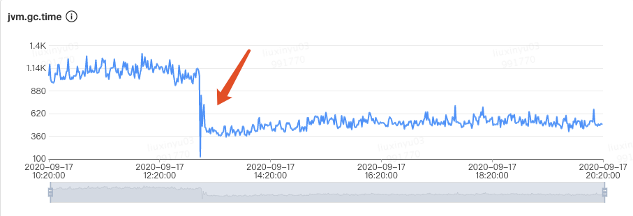

如果是分配速率过大：

- **偶发较大**：通过内存分析工具找到问题代码，从业务逻辑上做一些优化。
- **一直较大**：当前的 Collector 已经不满足 Mutator 的期望了，这种情况要么扩容 Mutator 的 VM，要么调整 GC 收集器类型或加大空间。

#### 4.4.4 小结

过早晋升问题一般不会特别明显，但日积月累之后可能会爆发一波收集器退化之类的问题，所以我们还是要提前避免掉的，可以看看自己系统里面是否有这些现象，如果比较匹配的话，可以尝试优化一下。一行代码优化的 ROI 还是很高的。

如果在观察 Old 区前后比例变化的过程中，发现可以回收的比例非常小，如从 80% 只回收到了 60%，说明我们大部分对象都是存活的，Old 区的空间可以适当调大些。

#### 4.4.5 加餐

关于在调整 Young 与 Old 的比例时，如何选取具体的 NewRatio 值，这里将问题抽象成为一个蓄水池模型，找到以下关键衡量指标，大家可以根据自己场景进行推算。


- NewRatio 的值 r 与 va、vp、vyc、voc、rs 等值存在一定函数相关性（rs 越小 r 越大、r 越小 vp 越小，…，之前尝试使用 NN 来辅助建模，但目前还没有完全算出具体的公式，有想法的同学可以在评论区给出你的答案）。
- 总停顿时间 T 为 Young GC 总时间 Tyc 和 Old GC 总时间 Toc 之和，其中 Tyc 与 vyc 和 vp 相关，Toc 与 voc相关。
- 忽略掉 GC 时间后，两次 Young GC 的时间间隔要大于 TP9999 时间，这样尽量让对象在 Eden 区就被回收，可以减少很多停顿。

### 4.5 场景五：CMS Old GC 频繁*

#### 4.5.1 现象

Old 区频繁的做 CMS GC，但是每次耗时不是特别长，整体最大 STW 也在可接受范围内，但由于 GC 太频繁导致吞吐下降比较多。

#### 4.5.2 原因

这种情况比较常见，基本都是一次 Young GC 完成后，负责处理 CMS GC 的一个后台线程 concurrentMarkSweepThread 会不断地轮询，使用 `shouldConcurrentCollect()` 方法做一次检测，判断是否达到了回收条件。如果达到条件，使用 `collect_in_background()` 启动一次 Background 模式 GC。轮询的判断是使用 `sleepBeforeNextCycle()` 方法，间隔周期为 `-XX:CMSWaitDuration` 决定，默认为2s。

分析其中逻辑判断是否触发 GC，分为以下几种情况：

- **触发 CMS GC：** 通过调用 `_collector->collect_in_background()` 进行触发 Background GC 。
  - CMS 默认采用 JVM 运行时的统计数据判断是否需要触发 CMS GC，如果需要根据 `-XX:CMSInitiatingOccupancyFraction` 的值进行判断，需要设置参数 `-XX:+UseCMSInitiatingOccupancyOnly`。
  - 如果开启了 `-XX:UseCMSInitiatingOccupancyOnly` 参数，判断当前 Old 区使用率是否大于阈值，则触发 CMS GC，该阈值可以通过参数 `-XX:CMSInitiatingOccupancyFraction` 进行设置，如果没有设置，默认为 92%。
  - 如果之前的 Young GC 失败过，或者下次 Young 区执行 Young GC 可能失败，这两种情况下都需要触发 CMS GC。
  - [**CMS 默认不会对 MetaSpace 或 Perm 进行垃圾收集**](http://blog.alipay.com)，如果希望对这些区域进行垃圾收集，需要设置参数 `-XX:+CMSClassUnloadingEnabled`。
- **触发 Full GC：** 直接进行 Full GC，这种情况到场景七中展开说明。
  - 如果 `_full_gc_requested` 为真，说明有明确的需求要进行 GC，比如调用 System.gc。
  - 在 Eden 区为对象或 TLAB 分配内存失败，导致一次 Young GC，在 `GenCollectorPolicy` 类的 `satisfy_failed_allocation()` 方法中进行判断。

大家可以看一下源码中的日志打印，通过日志我们就可以比较清楚地知道具体的原因，然后就可以着手分析了。

#### 4.5.3 策略

我们这里还是拿最常见的达到回收比例这个场景来说，与过早晋升不同的是这些对象确实存活了一段时间，Survival Time 超过了 TP9999 时间，但是又达不到长期存活，如各种数据库、网络链接，带有失效时间的缓存等。

处理这种常规内存泄漏问题基本是一个思路，主要步骤如下：

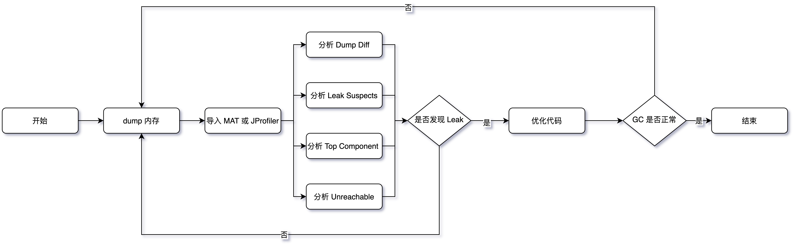

Dump Diff 和 Leak Suspects 比较直观就不介绍了，这里说下其它几个关键点：

- **内存 Dump：** 使用 jmap、arthas 等 dump 堆进行快照时记得摘掉流量，同时**分别在 CMS GC 的发生前后分别 dump 一次**。
- **分析 Top Component：** 要记得按照对象、类、类加载器、包等多个维度观察 Histogram，同时使用 outgoing 和 incoming 分析关联的对象，另外就是 Soft Reference 和 Weak Reference、Finalizer 等也要看一下。
- **分析 Unreachable：** 重点看一下这个，关注下 Shallow 和 Retained 的大小。如下图所示，笔者之前一次 GC 优化，就根据 Unreachable Objects 发现了 Hystrix 的滑动窗口问题。

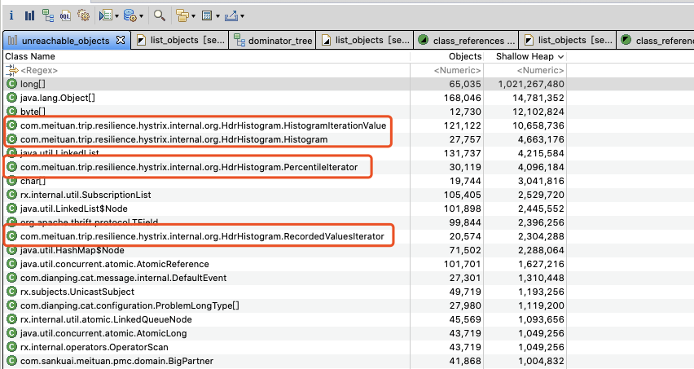

#### 4.5.4 小结

经过整个流程下来基本就能定位问题了，不过在优化的过程中记得使用**控制变量**的方法来优化，防止一些会加剧问题的改动被掩盖。

### 4.6 场景六：单次 CMS Old GC 耗时长*

#### 4.6.1 现象

CMS GC 单次 STW 最大超过 1000ms，不会频繁发生，如下图所示最长达到了 8000ms。某些场景下会引起“雪崩效应”，这种场景非常危险，我们应该尽量避免出现。


#### 4.6.2 原因

CMS 在回收的过程中，STW 的阶段主要是 Init Mark 和 Final Remark 这两个阶段，也是导致 CMS Old GC 最多的原因，另外有些情况就是在 STW 前等待 Mutator 的线程到达 SafePoint 也会导致时间过长，但这种情况较少，我们在此处主要讨论前者。发生收集器退化或者碎片压缩的场景请看场景七。

想要知道这两个阶段为什么会耗时，我们需要先看一下这两个阶段都会干什么。

- CMS Init Mark执行步骤：


整个过程比较简单，从 GC Root 出发标记 Old 中的对象，处理完成后借助 BitMap 处理下 Young 区对 Old 区的引用，整个过程基本都比较快，很少会有较大的停顿。

- CMS Final Remark 执行步骤：


Final Remark 是最终的第二次标记，这种情况只有在 Background GC 执行了 InitialMarking 步骤的情形下才会执行，如果是 Foreground GC 执行的 InitialMarking 步骤则不需要再次执行 FinalRemark。Final Remark 的开始阶段与 Init Mark 处理的流程相同，但是[**后续多了 Card Table 遍历、Reference 实例的清理并将其加入到 Reference 维护的 `pend_list` 中，如果要收集元数据信息，还要清理 SystemDictionary、CodeCache、SymbolTable、StringTable 等组件中不再使用的资源**](http://blog.alipay.com)。

#### 4.6.3 策略

知道了两个 STW 过程执行流程，我们分析解决就比较简单了，由于大部分问题都出在 Final Remark 过程，这里我们也拿这个场景来举例，主要步骤：

- **【方向】** 观察详细 GC 日志，找到出问题时 Final Remark 日志，分析下 Reference 处理和元数据处理 real 耗时是否正常，详细信息需要通过 `-XX:+PrintReferenceGC` 参数开启。**基本在日志里面就能定位到大概是哪个方向出了问题，耗时超过 10% 的就需要关注**。

```java
2019-02-27T19:55:37.920+0800: 516952.915: [GC (CMS Final Remark) 516952.915: [ParNew516952.939: [SoftReference, 0 refs, 0.0003857 secs]516952.939: [WeakReference, 1362 refs, 0.0002415 secs]516952.940: [FinalReference, 146 refs, 0.0001233 secs]516952.940: [PhantomReference, 0 refs, 57 refs, 0.0002369 secs]516952.940: [JNI Weak Reference, 0.0000662 secs]
[class unloading, 0.1770490 secs]516953.329: [scrub symbol table, 0.0442567 secs]516953.373: [scrub string table, 0.0036072 secs][1 CMS-remark: 1638504K(2048000K)] 1667558K(4352000K), 0.5269311 secs] [Times: user=1.20 sys=0.03, real=0.53 secs]
```

- **【根因】** 有了具体的方向我们就可以进行深入的分析，一般来说最容易出问题的地方就是 Reference 中的 FinalReference 和元数据信息处理中的 scrub symbol table 两个阶段，想要找到具体问题代码就需要内存分析工具 MAT 或 JProfiler 了，注意要 dump 即将开始 CMS GC 的堆。在用 MAT 等工具前也可以先用命令行看下对象 Histogram，有可能直接就能定位问题。
  - 对 FinalReference 的分析主要观察 `java.lang.ref.Finalizer` 对象的 dominator tree，找到泄漏的来源。经常会出现问题的几个点有 Socket 的 `SocksSocketImpl` 、Jersey 的 `ClientRuntime`、MySQL 的 `ConnectionImpl` 等等。
  - scrub symbol table 表示清理元数据符号引用耗时，符号引用是 Java 代码被编译成字节码时，方法在 JVM 中的表现形式，生命周期一般与 Class 一致，当 `_should_unload_classes` 被设置为 true 时在 `CMSCollector::refProcessingWork()` 中与 Class Unload、String Table 一起被处理。

- **【策略】** 知道 GC 耗时的根因就比较好处理了，这种问题不会大面积同时爆发，不过有很多时候单台 STW 的时间会比较长，如果业务影响比较大，及时摘掉流量，具体后续优化策略如下：
  - FinalReference：找到内存来源后通过优化代码的方式来解决，如果短时间无法定位可以增加 `-XX:+ParallelRefProcEnabled` 对 Reference 进行并行处理。
  - symbol table：观察 MetaSpace 区的历史使用峰值，以及每次 GC 前后的回收情况，一般没有使用动态类加载或者 DSL 处理等，MetaSpace 的使用率上不会有什么变化，这种情况可以通过 `-XX:-CMSClassUnloadingEnabled` 来避免 MetaSpace 的处理，JDK8 会默认开启 CMSClassUnloadingEnabled，这会使得 CMS 在 CMS-Remark 阶段尝试进行类的卸载。

#### 4.6.4 小结

正常情况进行的 Background CMS GC，出现问题基本都集中在 Reference 和 Class 等元数据处理上，在 Reference 类的问题处理方面，不管是 FinalReference，还是 SoftReference、WeakReference 核心的手段就是找准时机 dump 快照，然后用内存分析工具来分析。Class 处理方面目前除了关闭类卸载开关，没有太好的方法。

在 G1 中同样有 Reference 的问题，可以观察日志中的 Ref Proc，处理方法与 CMS 类似。

### 4.7 场景七：内存碎片&收集器退化

#### 4.7.1 现象

并发的 CMS GC 算法，退化为 Foreground 单线程串行 GC 模式，STW 时间超长，有时会长达十几秒。其中 CMS 收集器退化后单线程串行 GC 算法有两种：

- 带压缩动作的算法，称为 MSC，上面我们介绍过，使[**用标记-清理-压缩，单线程全暂停的方式，对整个堆进行垃圾收集，也就是真正意义上的 Full GC，暂停时间要长于普通 CMS**]()。
- 不带压缩动作的算法，收集 Old 区，和普通的 CMS 算法比较相似，暂停时间相对 MSC 算法短一些。

#### 4.7.2 原因

CMS 发生收集器退化主要有以下几种情况：

**晋升失败（Promotion Failed）**

顾名思义，晋升失败就是指在进行 Young GC 时，Survivor 放不下，对象只能放入 Old，但此时 Old 也放不下。直觉上乍一看这种情况可能会经常发生，但其实因为有 concurrentMarkSweepThread 和担保机制的存在，发生的条件是很苛刻的，除非是短时间将 Old 区的剩余空间迅速填满，例如上文中说的动态年龄判断导致的过早晋升（见下文的增量收集担保失败）。**另外还有一种情况就是内存碎片导致的 Promotion Failed**，Young GC 以为 Old 有足够的空间，结果到分配时，晋级的大对象找不到连续的空间存放。

使用 CMS 作为 GC 收集器时，运行过一段时间的 Old 区如下图所示，清除算法导致内存出现多段的不连续，出现大量的内存碎片。


碎片带来了两个问题：

- **空间分配效率较低**：上文已经提到过，如果是连续的空间 JVM 可以通过使用 pointer bumping 的方式来分配，而对于这种有大量碎片的空闲链表则需要逐个访问 freelist 中的项来访问，查找可以存放新建对象的地址。
- **空间利用效率变低**：Young 区晋升的对象大小大于了连续空间的大小，那么将会触发 Promotion Failed ，即使整个 Old 区的容量是足够的，但由于其不连续，也无法存放新对象，也就是本文所说的问题。

**增量收集担保失败**

分配内存失败后，会判断统计得到的 Young GC 晋升到 Old 的平均大小，以及当前 Young 区已使用的大小也就是最大可能晋升的对象大小，是否大于 Old 区的剩余空间。只要 CMS 的剩余空间比前两者的任意一者大，CMS 就认为晋升还是安全的，反之，则代表不安全，不进行Young GC，直接触发Full GC。

**显式 GC**

这种情况参见场景二。

**并发模式失败（Concurrent Mode Failure）**

最后一种情况，也是发生概率较高的一种，在 GC 日志中经常能看到 Concurrent Mode Failure 关键字。这种是由于并发 Background CMS GC 正在执行，同时又有 Young GC 晋升的对象要放入到了 Old 区中，而此时 Old 区空间不足造成的。

为什么 CMS GC 正在执行还会导致收集器退化呢？主要是由于 CMS 无法处理浮动垃圾（Floating Garbage）引起的。[**CMS 的并发清理阶段，Mutator 还在运行，因此不断有新的垃圾产生，而这些垃圾不在这次清理标记的范畴里**]()，无法在本次 GC 被清除掉，这些就是浮动垃圾，除此之外在 Remark 之前那些断开引用脱离了读写屏障控制的对象也算浮动垃圾。所以 Old 区回收的阈值不能太高，否则预留的内存空间很可能不够，从而导致 Concurrent Mode Failure 发生。

#### 4.7.3 策略

分析到具体原因后，我们就可以针对性解决了，具体思路还是从根因出发，具体解决策略：

- **内存碎片：** 通过配置 `-XX:UseCMSCompactAtFullCollection=true` 来控制 Full GC的过程中是否进行空间的整理（默认开启，注意是Full GC，不是普通CMS GC），以及 `-XX: CMSFullGCsBeforeCompaction=n` 来控制多少次 Full GC 后进行一次压缩。
- **增量收集：** 降低触发 CMS GC 的阈值，即参数 `-XX:CMSInitiatingOccupancyFraction` 的值，让 CMS GC 尽早执行，以保证有足够的连续空间，也减少 Old 区空间的使用大小，另外需要使用 `-XX:+UseCMSInitiatingOccupancyOnly` 来配合使用，不然 JVM 仅在第一次使用设定值，后续则自动调整。
- **浮动垃圾：** 视情况控制每次晋升对象的大小，或者缩短每次 CMS GC 的时间，必要时可调节 NewRatio 的值。另外就是使用 `-XX:+CMSScavengeBeforeRemark` 在过程中提前触发一次 Young GC，防止后续晋升过多对象。

#### 4.7.4 小结

正常情况下触发并发模式的 CMS GC，停顿非常短，对业务影响很小，但 CMS GC 退化后，影响会非常大，建议发现一次后就彻底根治。只要能定位到内存碎片、浮动垃圾、增量收集相关等具体产生原因，还是比较好解决的，关于内存碎片这块，如果 `-XX:CMSFullGCsBeforeCompaction` 的值不好选取的话，可以使用 `-XX:PrintFLSStatistics` 来观察内存碎片率情况，然后再设置具体的值。

最后就是在编码的时候也要[**避免需要连续地址空间的大对象的产生，如过长的字符串，用于存放附件、序列化或反序列化的 byte 数组等，还有就是过早晋升问题尽量在爆发问题前就避免掉**]()。

### 4.8 场景八：堆外内存 OOM

#### 4.8.1 现象

内存使用率不断上升，甚至开始使用 SWAP 内存，同时可能出现 GC 时间飙升，线程被 Block 等现象，**通过 top 命令发现 Java 进程的 RES 甚至超过了 `-Xmx` 的大小**。出现这些现象时，基本可以确定是出现了堆外内存泄漏。

#### 4.8.2 原因

JVM 的堆外内存泄漏，主要有两种的原因：

- 通过 `UnSafe#allocateMemory`，`ByteBuffer#allocateDirect` 主动申请了堆外内存而没有释放，常见于 NIO、Netty 等相关组件。
- 代码中有通过 JNI 调用 Native Code 申请的内存没有释放。

#### 4.8.3 策略

哪种原因造成的堆外内存泄漏？

首先，我们需要确定是哪种原因导致的堆外内存泄漏。这里可以使用 NMT（[NativeMemoryTracking](https://docs.oracle.com/javase/8/docs/technotes/guides/troubleshoot/tooldescr007.html)） 进行分析。在项目中添加 `-XX:NativeMemoryTracking=detail` JVM参数后重启项目（需要注意的是，打开 NMT 会带来 5%~10% 的性能损耗）。使用命令 `jcmd pid VM.native_memory detail` 查看内存分布。重点观察 total 中的 committed，因为 jcmd 命令显示的内存包含堆内内存、Code 区域、通过 `Unsafe.allocateMemory` 和 `DirectByteBuffer` 申请的内存，但是不包含其他 Native Code（C 代码）申请的堆外内存。

如果 total 中的 committed 和 top 中的 RES 相差不大，则应为主动申请的堆外内存未释放造成的，如果相差较大，则基本可以确定是 JNI 调用造成的。

**原因一：主动申请未释放**

JVM 使用 `-XX:MaxDirectMemorySize=size` 参数来控制可申请的堆外内存的最大值。在 Java8 中，如果未配置该参数，默认和 `-Xmx` 相等。

NIO 和 Netty 都会取 `-XX:MaxDirectMemorySize` 配置的值，来限制申请的堆外内存的大小。NIO 和 Netty 中还有一个计数器字段，用来计算当前已申请的堆外内存大小，NIO 中是 `java.nio.Bits#totalCapacity`、Netty 中 `io.netty.util.internal.PlatformDependent#DIRECT_MEMORY_COUNTER`。

当申请堆外内存时，NIO 和 Netty 会比较计数器字段和最大值的大小，如果计数器的值超过了最大值的限制，会抛出 OOM 的异常。

NIO 中是：`OutOfMemoryError: Direct buffer memory`。

Netty 中是：`OutOfDirectMemoryError: failed to allocate capacity byte(s) of direct memory (used: usedMemory , max: DIRECT_MEMORY_LIMIT )`。

我们可以检查代码中是如何使用堆外内存的，NIO 或者是 Netty，通过反射，获取到对应组件中的计数器字段，并在项目中对该字段的数值进行打点，即可准确地监控到这部分堆外内存的使用情况。

此时，可以通过 Debug 的方式确定使用堆外内存的地方是否正确执行了释放内存的代码。另外，需要检查 JVM 的参数是否有 `-XX:+DisableExplicitGC` 选项，如果有就去掉，因为该参数会使 System.gc 失效。（场景二：显式 GC 的去与留）

**原因二：通过 JNI 调用的 Native Code 申请的内存未释放**

这种情况排查起来比较困难，我们可以通过 Google perftools + Btrace 等工具，帮助我们分析出问题的代码在哪里。

gperftools 是 Google 开发的一款非常实用的工具集，它的原理是在 Java 应用程序运行时，当调用 malloc 时换用它的 libtcmalloc.so，这样就能对内存分配情况做一些统计。我们使用 gperftools 来追踪分配内存的命令。如下图所示，通过 gperftools 发现 `Java_java_util_zip_Inflater_init` 比较可疑。


接下来可以使用 Btrace，尝试定位具体的调用栈。Btrace 是 Sun 推出的一款 Java 追踪、监控工具，可以在不停机的情况下对线上的 Java 程序进行监控。如下图所示，通过 Btrace 定位出项目中的 `ZipHelper` 在频繁调用 `GZIPInputStream` ，在堆外内存分配对象。


最终定位到是，项目中对 `GIPInputStream` 的使用错误，没有正确的 close()。


除了项目本身的原因，还可能有外部依赖导致的泄漏，如 Netty 和 Spring Boot，详细情况可以学习下这两篇文章，[Spring Boot引起的“堆外内存泄漏”排查及经验总结](https://tech.meituan.com/2019/01/03/spring-boot-native-memory-leak.html)、[Netty堆外内存泄露排查盛宴](https://tech.meituan.com/2018/10/18/netty-direct-memory-screening.html)。

#### 4.8.4 小结

首先可以使用 NMT + jcmd 分析泄漏的堆外内存是哪里申请，确定原因后，使用不同的手段，进行原因定位。


### 4.9 场景九：JNI 引发的 GC 问题

#### 4.9.1 现象

在 GC 日志中，出现 GC Cause 为 GCLocker Initiated GC。

```
2020-09-23T16:49:09.727+0800: 504426.742: [GC (GCLocker Initiated GC) 504426.742: [ParNew (promotion failed): 209716K->6042K(1887488K), 0.0843330 secs] 1449487K->1347626K(3984640K), 0.0848963 secs] [Times: user=0.19 sys=0.00, real=0.09 secs]
2020-09-23T16:49:09.812+0800: 504426.827: [Full GC (GCLocker Initiated GC) 504426.827: [CMS: 1341583K->419699K(2097152K), 1.8482275 secs] 1347626K->419699K(3984640K), [Metaspace: 297780K->297780K(1329152K)], 1.8490564 secs] [Times: user=1.62 sys=0.20, real=1.85 secs]
```

#### 4.9.2 原因

JNI（Java Native Interface）意为 Java 本地调用，它允许 Java 代码和其他语言写的 Native 代码进行交互。

JNI 如果需要获取 JVM 中的 String 或者数组，有两种方式：

- 拷贝传递。
- 共享引用（指针），性能更高。

由于 Native 代码直接使用了 JVM 堆区的指针，如果这时发生 GC，就会导致数据错误。因此，在发生此类 JNI 调用时，禁止 GC 的发生，同时阻止其他线程进入 JNI 临界区，直到最后一个线程退出临界区时触发一次 GC。

GC Locker 实验：

```java
public class GCLockerTest {

  static final int ITERS = 100;
  static final int ARR_SIZE =  10000;
  static final int WINDOW = 10000000;

  static native void acquire(int[] arr);
  static native void release(int[] arr);

  static final Object[] window = new Object[WINDOW];

  public static void main(String... args) throws Throwable {
    System.loadLibrary("GCLockerTest");
    int[] arr = new int[ARR_SIZE];

    for (int i = 0; i < ITERS; i++) {
      acquire(arr);
      System.out.println("Acquired");
      try {
        for (int c = 0; c < WINDOW; c++) {
          window[c] = new Object();
        }
      } catch (Throwable t) {
        // omit
      } finally {
        System.out.println("Releasing");
        release(arr);
      }
    }
  }
}
```

------

```c++
#include <jni.h>
#include "GCLockerTest.h"

static jbyte* sink;

JNIEXPORT void JNICALL Java_GCLockerTest_acquire(JNIEnv* env, jclass klass, jintArray arr) {
sink = (*env)->GetPrimitiveArrayCritical(env, arr, 0);
}

JNIEXPORT void JNICALL Java_GCLockerTest_release(JNIEnv* env, jclass klass, jintArray arr) {
(*env)->ReleasePrimitiveArrayCritical(env, arr, sink, 0);
}
```

运行该 JNI 程序，可以看到发生的 GC 都是 GCLocker Initiated GC，并且注意在 “Acquired” 和 “Released” 时不可能发生 GC。


GC Locker 可能导致的不良后果有：

- 如果此时是 Young 区不够 Allocation Failure 导致的 GC，由于无法进行 Young GC，会将对象直接分配至 Old 区。
- 如果 Old 区也没有空间了，则会等待锁释放，导致线程阻塞。
- 可能触发额外不必要的 Young GC，JDK 有一个 Bug，有一定的几率，本来只该触发一次 GCLocker Initiated GC 的 Young GC，实际发生了一次 Allocation Failure GC 又紧接着一次 GCLocker Initiated GC。是因为 GCLocker Initiated GC 的属性被设为 full，导致两次 GC 不能收敛。

#### 4.9.3 策略

- 添加 `-XX+PrintJNIGCStalls` 参数，可以打印出发生 JNI 调用时的线程，进一步分析，找到引发问题的 JNI 调用。
- JNI 调用需要谨慎，不一定可以提升性能，反而可能造成 GC 问题。
- 升级 JDK 版本到 14，避免 [JDK-8048556](https://bugs.openjdk.java.net/browse/JDK-8048556) 导致的重复 GC。


#### 4.9.4 小结

JNI 产生的 GC 问题较难排查，需要谨慎使用。

## 5. 总结

在这里，我们把整个文章内容总结一下，方便大家整体地理解回顾。

### 5.1 处理流程（SOP）

下图为整体 GC 问题普适的处理流程，重点的地方下面会单独标注，其他的基本都是标准处理流程，此处不再赘述，最后在整个问题都处理完之后有条件的话建议做一下复盘。


- **制定标准：** 这块内容其实非常重要，但大部分系统都是缺失的，笔者过往面试的同学中只有不到一成的同学能给出自己的系统 GC 标准到底什么样，其他的都是用的统一指标模板，缺少预见性，具体指标制定可以参考 3.1 中的内容，需要结合应用系统的 TP9999 时间和延迟、吞吐量等设定具体的指标，而不是被问题驱动。
- **保留现场：** 目前线上服务基本都是分布式服务，某个节点发生问题后，如果条件允许一定不要直接操作重启、回滚等动作恢复，优先通过摘掉流量的方式来恢复，这样我们可以将堆、栈、GC 日志等关键信息保留下来，不然错过了定位根因的时机，后续解决难度将大大增加。当然除了这些，应用日志、中间件日志、内核日志、各种 Metrics 指标等对问题分析也有很大帮助。
- **因果分析：** 判断 GC 异常与其他系统指标异常的因果关系，可以参考笔者在 3.2 中介绍的时序分析、概率分析、实验分析、反证分析等 4 种因果分析法，避免在排查过程中走入误区。
- **根因分析：** 确实是 GC 的问题后，可以借助上文提到的工具并通过 5 why 根因分析法以及跟第三节中的九种常见的场景进行逐一匹配，或者直接参考下文的根因鱼骨图，找出问题发生根因，最后再选择优化手段。

### 5.2 根因鱼骨图

送上一张问题根因鱼骨图，一般情况下我们在处理一个 GC 问题时，只要能定位到问题的“病灶”，有的放矢，其实就相当于解决了 80%，如果在某些场景下不太好定位，大家可以借助这种根因分析图通过**排除法**去定位。


### 5.3 调优建议

- **Trade Off：** 与 CAP 注定要缺一角一样，GC 优化要在延迟（Latency）、吞吐量（Throughput）、容量（Capacity）三者之间进行权衡。
- **最终手段：** GC 发生问题不是一定要对 JVM 的 GC 参数进行调优，大部分情况下是通过 GC 的情况找出一些业务问题，切记上来就对 GC 参数进行调整，当然有明确配置错误的场景除外。
- **控制变量：** 控制变量法是在蒙特卡洛（Monte Carlo）方法中用于减少方差的一种技术方法，我们调优的时候尽量也要使用，每次调优过程尽可能只调整一个变量。
- **善用搜索：** 理论上 99.99% 的 GC 问题基本都被遇到了，我们要学会使用搜索引擎的高级技巧，重点关注 StackOverFlow、Github 上的 Issue、以及各种论坛博客，先看看其他人是怎么解决的，会让解决问题事半功倍。能看到这篇文章，你的搜索能力基本过关了~
- **调优重点：** 总体上来讲，我们开发的过程中遇到的问题类型也基本都符合正态分布，太简单或太复杂的基本遇到的概率很低，笔者这里将中间最重要的三个场景添加了“*”标识，希望阅读完本文之后可以观察下自己负责的系统，是否存在上述问题。
- **GC 参数：** 如果堆、栈确实无法第一时间保留，一定要保留 GC 日志，这样我们最起码可以看到 GC Cause，有一个大概的排查方向。关于 GC 日志相关参数，最基本的 `-XX:+HeapDumpOnOutOfMemoryError` 等一些参数就不再提了，笔者建议添加以下参数，可以提高我们分析问题的效率。


- **其他建议：** 上文场景中没有提到，但是对 GC 性能也有提升的一些建议。
  - **主动式 GC：** 也有另开生面的做法，通过监控手段监控观测 Old 区的使用情况，即将到达阈值时将应用服务摘掉流量，手动触发一次 Major GC，减少 CMS GC 带来的停顿，但随之系统的健壮性也会减少，如非必要不建议引入。
  - **禁用偏向锁：** 偏向锁在只有一个线程使用到该锁的时候效率很高，但是在竞争激烈情况会升级成轻量级锁，此时就需要先**消除偏向锁，这个过程是 STW** 的。如果每个同步资源都走这个升级过程，开销会非常大，所以在已知并发激烈的前提下，一般会禁用偏向锁 `-XX:-UseBiasedLocking` 来提高性能。
  - **虚拟内存：** 启动初期有些操作系统（例如 Linux）并没有真正分配物理内存给 JVM ，而是在虚拟内存中分配，使用的时候才会在物理内存中分配内存页，这样也会导致 GC 时间较长。这种情况可以添加 `-XX:+AlwaysPreTouch` 参数，让 VM 在 commit 内存时跑个循环来强制保证申请的内存真的 commit，避免运行时触发缺页异常。在一些大内存的场景下，有时候能将前几次的 GC 时间降一个数量级，但是添加这个参数后，启动的过程可能会变慢。

## 6. 写在最后

最后，再说笔者个人的一些小建议，遇到一些 GC 问题，如果有精力，一定要探本穷源，找出最深层次的原因。另外，在这个信息泛滥的时代，有一些被“奉为圭臬”的经验可能都是错误的，尽量养成看源码的习惯，有一句话说到“源码面前，了无秘密”，也就意味着遇到搞不懂的问题，我们可以从源码中一窥究竟，某些场景下确有奇效。但也不是只靠读源码来学习，如果硬啃源码但不理会其背后可能蕴含的理论基础，那很容易“捡芝麻丢西瓜”，“只见树木，不见森林”，让“了无秘密”变成了一句空话，我们还是要结合一些实际的业务场景去针对性地学习。

**你的时间在哪里，你的成就就会在哪里**。笔者也是在前两年才开始逐步地在 GC 方向上不断深入，查问题、看源码、做总结，每个 Case 形成一个小的闭环，目前初步摸到了 GC 问题处理的一些门道，同时将经验总结应用于生产环境实践，慢慢地形成一个良性循环。

本篇文章主要是介绍了 CMS GC 的一些常见场景分析，另外一些，如 CodeCache 问题导致 JIT 失效、SafePoint 就绪时间长、Card Table 扫描耗时等问题不太常见就没有花太多篇幅去讲解。

Java GC 是在“分代”的思想下内卷了很多年才突破到了“分区”，目前在美团也已经开始使用 G1 来替换使用了多年的 CMS，虽然在小的堆方面 G1 还略逊色于 CMS，但这是一个趋势，短时间无法升级到 ZGC，所以未来遇到的 G1 的问题可能会逐渐增多。目前已经收集到 Remember Set 粗化、Humongous 分配、Ergonomics 异常、Mixed GC 中 Evacuation Failure 等问题，除此之外也会给出 CMS 升级到 G1 的一些建议，接下来笔者将继续完成这部分文章整理，敬请期待。

“防火”永远要胜于“救火”，**不放过任何一个异常的小指标**（一般来说，任何**不平滑的曲线**都是值得怀疑的） ，就有可能避免一次故障的发生。作为 Java 程序员基本都会遇到一些 GC 的问题，独立解决 GC 问题是我们必须迈过的一道坎。开篇中也提到过 GC 作为经典的技术，非常值得我们学习，一些 GC 的学习材料，如《The Garbage Collection Handbook》《深入理解Java虚拟机》等也是常读常新，赶紧动起来，苦练 GC 基本功吧。

最后的最后，再多啰嗦一句，目前所有 GC 调优相关的文章，第一句讲的就是“不要过早优化”，使得很多同学对 GC 优化望而却步。在这里笔者提出不一样的观点，熵增定律（在一个孤立系统里，如果没有外力做功，其总混乱度（即熵）会不断增大）在计算机系统同样适用，**如果不主动做功使熵减，系统终究会脱离你的掌控**，在我们对业务系统和 GC 原理掌握得足够深的时候，可以放心大胆地做优化，因为我们基本可以预测到每一个操作的结果，放手一搏吧，少年！

# Java Hotspot G1 GC的一些关键技术

## 前言

G1 GC，全称Garbage-First Garbage Collector，通过-XX:+UseG1GC参数来启用，作为体验版随着JDK 6u14版本面世，在JDK 7u4版本发行时被正式推出，相信熟悉JVM的同学们都不会对它感到陌生。

在JDK 9中，G1被提议设置为默认垃圾收集器（JEP 248）。

从官网的描述中，我们知道G1是一种服务器端的垃圾收集器，应用在多处理器和大容量内存环境中，在实现高吞吐量的同时，尽可能的满足垃圾收集暂停时间的要求。

它是专门针对以下应用场景设计的: 

* 像CMS收集器一样，能与应用程序线程并发执行。 
* 整理空闲空间更快。 
* 需要GC停顿时间更好预测。 
* 不希望牺牲大量的吞吐性能。 
* 不需要更大的Java Heap。

G1收集器的设计目标是取代CMS收集器，它同CMS相比，在以下方面表现的更出色： 

- G1是一个有整理内存过程的垃圾收集器，不会产生很多内存碎片。 

- G1的Stop The World(STW)更可控，G1在停顿时间上添加了预测机制，用户可以指定期望停顿时间。

## G1中几个重要概念

在G1的实现过程中，引入了一些新的概念，对于实现高吞吐、没有内存碎片、收集时间可控等功能起到了关键作用。下面我们就一起看一下G1中的这几个重要概念。

### Region

传统的GC收集器将连续的内存空间划分为新生代、老年代和永久代（JDK 8去除了永久代，引入了元空间Metaspace），这种划分的特点是各代的存储地址（逻辑地址，下同）是连续的。如下图所示：


传统GC内存布局

而G1的各代存储地址是不连续的，每一代都使用了n个不连续的大小相同的Region，每个Region占有一块连续的虚拟内存地址。如下图所示：


g1 GC内存布局

在上图中，我们注意到还有一些Region标明了H，它代表[**Humongous**]()，这表示这些Region存储的是巨大对象（humongous object，H-obj），[**即大小大于等于region一半的对象**]()。H-obj有如下几个特征： 

* H-obj直接分配到了old gen(也就是把Humongous看作是old区来对待)，防止了反复拷贝移动。 
* H-obj在global concurrent marking阶段的cleanup 和 full GC阶段回收。 
* 在分配H-obj之前先检查是否超过 initiating heap occupancy percent和the marking threshold, 如果超过的话，就启动global concurrent marking，为的是提早回收，防止 evacuation failures 和 full GC。

为了减少连续H-objs分配对GC的影响，需要把大对象变为普通的对象，建议增大Region size。

一个Region的大小可以通过参数-XX:G1HeapRegionSize设定，取值范围从1M到32M，且是2的指数。如果不设定，那么G1会根据Heap大小自动决定。

### SATB

全称是Snapshot-At-The-Beginning，由字面理解，[**是GC开始时活着的对象的一个快照。它是通过Root Tracing得到的，作用是维持并发GC的正确性**]()。 那么它是怎么维持并发GC的正确性的呢？根据三色标记算法，我们知道对象存在三种状态： * 白：对象没有被标记到，标记阶段结束后，会被当做垃圾回收掉。 * 灰：对象被标记了，但是它的field还没有被标记或标记完。 * 黑：对象被标记了，且它的所有field也被标记完了。

由于并发阶段的存在，Mutator和Garbage Collector线程同时对对象进行修改，就会出现白对象漏标的情况，这种情况发生的前提是： * Mutator赋予一个黑对象该白对象的引用。 * Mutator删除了所有从灰对象到该白对象的直接或者间接引用。

对于第一个条件，在并发标记阶段，如果该白对象是new出来的，并没有被灰对象持有，那么它会不会被漏标呢？Region中有两个top-at-mark-start（TAMS）指针，分别为prevTAMS和nextTAMS。在TAMS以上的对象是新分配的，这是一种隐式的标记。对于在GC时已经存在的白对象，如果它是活着的，它必然会被另一个对象引用，即条件二中的灰对象。如果灰对象到白对象的直接引用或者间接引用被替换了，或者删除了，白对象就会被漏标，从而导致被回收掉，这是非常严重的错误，所以SATB破坏了第二个条件。也就是说，一个对象的引用被替换时，可以通过write barrier 将旧引用记录下来。

[**SATB也是有副作用的**]()，如果被替换的白对象就是要被收集的垃圾，这次的标记会让它躲过GC，这就是float garbage。因为SATB的做法精度比较低，所以造成的float garbage也会比较多。

### RSet

全称是Remembered Set，是辅助GC过程的一种结构，典型的空间换时间工具，和Card Table有些类似。

还有一种数据结构也是辅助GC的：Collection Set（CSet），它记录了GC要收集的Region集合，集合里的Region可以是任意年代的。

在GC的时候，对于old->young和old->old的跨代对象引用，只要扫描对应的CSet中的RSet即可。 

逻辑上说每个Region都有一个RSet，RSet记录了其他Region中的对象引用本Region中对象的关系，属于points-into结构（谁引用了我的对象）。而Card Table则是一种points-out（我引用了谁的对象）的结构，每个Card 覆盖一定范围的Heap（一般为512Bytes）。G1的RSet是在Card Table的基础上实现的：每个Region会记录下别的Region有指向自己的指针，并标记这些指针分别在哪些Card的范围内。 

这个RSet其实是一个Hash Table，Key是别的Region的起始地址，Value是一个集合，里面的元素是Card Table的Index。

下图表示了RSet、Card和Region的关系（[出处](http://www.infoq.com/articles/tuning-tips-G1-GC)）：


Remembered Sets

上图中有三个Region，每个Region被分成了多个Card，在不同Region中的Card会相互引用，Region1中的Card中的对象引用了Region2中的Card中的对象，蓝色实线表示的就是points-out的关系，而在Region2的RSet中，记录了Region1的Card，即红色虚线表示的关系，这就是points-into。 而维系RSet中的引用关系靠post-write barrier和Concurrent refinement threads来维护。

post-write barrier记录了跨Region的引用更新，更新日志缓冲区则记录了那些包含更新引用的Cards。一旦缓冲区满了，Post-write barrier就停止服务了，会由Concurrent refinement threads处理这些缓冲区日志。 

RSet究竟是怎么辅助GC的呢？在做YGC的时候，只需要选定young generation region的RSet作为根集，这些RSet记录了old->young的跨代引用，避免了扫描整个old generation。 而mixed gc的时候，old generation中记录了old->old的RSet，young->old的引用由扫描全部young generation region得到，这样也不用扫描全部old generation region。所以RSet的引入大大减少了GC的工作量。

### Pause Prediction Model

Pause Prediction Model 即停顿预测模型。它在G1中的作用是： >G1 uses a pause prediction model to meet a user-defined pause time target and selects the number of regions to collect based on the specified pause time target.

G1 GC是一个响应时间优先的GC算法，它与CMS最大的不同是，用户可以设定整个GC过程的期望停顿时间，参数-XX:MaxGCPauseMillis指定一个G1收集过程目标停顿时间，默认值200ms，不过它不是硬性条件，只是期望值。那么G1怎么满足用户的期望呢？就需要这个停顿预测模型了。

G1根据这个模型统计计算出来的历史数据来预测本次收集需要选择的Region数量，从而尽量满足用户设定的目标停顿时间。 停顿预测模型是以衰减标准偏差为理论基础实现的：

```c++
//  share/vm/gc_implementation/g1/g1CollectorPolicy.hpp
double get_new_prediction(TruncatedSeq* seq) {
    return MAX2(seq->davg() + sigma() * seq->dsd(),
                seq->davg() * confidence_factor(seq->num()));
}
```

在这个预测计算公式中：davg表示衰减均值，sigma()返回一个系数，表示信赖度，dsd表示衰减标准偏差，confidence_factor表示可信度相关系数。而方法的参数TruncateSeq，顾名思义，是一个截断的序列，它只跟踪了序列中的最新的n个元素。

在G1 GC过程中，每个可测量的步骤花费的时间都会记录到TruncateSeq（继承了AbsSeq）中，用来计算衰减均值、衰减变量，衰减标准偏差等。

比如要预测一次GC过程中，RSet的更新时间，这个操作主要是将Dirty Card加入到RSet中，具体原理参考前面的RSet。每个Dirty Card的时间花费通过_cost_per_card_ms_seq来记录，具体预测代码如下：

```c++
//  share/vm/gc_implementation/g1/g1CollectorPolicy.hpp

 double predict_rs_update_time_ms(size_t pending_cards) {
    return (double) pending_cards * predict_cost_per_card_ms();
 }
 double predict_cost_per_card_ms() {
    return get_new_prediction(_cost_per_card_ms_seq);
 }
```

get_new_prediction就是我们开头说的方法，现在大家应该基本明白停顿预测模型的实现原理了。

## GC过程

### G1 GC模式

G1提供了两种GC模式，Young GC和Mixed GC，两种都是完全Stop The World的。 

* Young GC：选定所有年轻代里的Region。通过控制年轻代的region个数，即年轻代内存大小，来控制young GC的时间开销。 
* Mixed GC：选定所有年轻代里的Region，外加根据global concurrent marking统计得出收集收益高的若干老年代Region。在用户指定的开销目标范围内尽可能选择收益高的老年代Region。

由上面的描述可知，Mixed GC不是full GC，它只能回收部分老年代的Region，如果mixed GC实在无法跟上程序分配内存的速度，导致老年代填满无法继续进行Mixed GC，就会[**使用serial old GC（full GC）来收集整个GC heap**]()。所以我们可以知道，G1是不提供full GC的。

上文中，多次提到了global concurrent marking，它的执行过程类似CMS，但是不同的是，在G1 GC中，它主要是为Mixed GC提供标记服务的，并不是一次GC过程的一个必须环节。global concurrent marking的执行过程分为四个步骤： 

* 初始标记（initial mark，STW）。它标记了从GC Root开始直接可达的对象。 
* 并发标记（Concurrent Marking）。这个阶段从GC Root开始对heap中的对象标记，标记线程与应用程序线程并行执行，并且收集各个Region的存活对象信息。 
* 最终标记（Remark，STW）。标记那些在并发标记阶段发生变化的对象，将被回收。 
* 清除垃圾（Cleanup）。清除空Region（没有存活对象的），加入到free list。

第一阶段initial mark是共用了Young GC的暂停，这是因为他们可以复用root scan操作，所以可以说global concurrent marking是伴随Young GC而发生的。第四阶段Cleanup只是回收了没有存活对象的Region，所以它并不需要STW。

Young GC发生的时机大家都知道，那什么时候发生Mixed GC呢？其实是由一些参数控制着的，另外也控制着哪些老年代Region会被选入CSet。 

* G1HeapWastePercent：在global concurrent marking结束之后，我们可以知道old gen regions中有多少空间要被回收，在每次YGC之后和再次发生Mixed GC之前，会检查垃圾占比是否达到此参数，只有达到了，下次才会发生Mixed GC。 
* G1MixedGCLiveThresholdPercent：old generation region中的存活对象的占比，只有在此参数之下，才会被选入CSet。 
* G1MixedGCCountTarget：一次global concurrent marking之后，最多执行Mixed GC的次数。 
* G1OldCSetRegionThresholdPercent：一次Mixed GC中能被选入CSet的最多old generation region数量。

除了以上的参数，G1 GC相关的其他主要的参数有：

| 参数                               | 含义                                                         |
| :--------------------------------- | :----------------------------------------------------------- |
| -XX:G1HeapRegionSize=n             | 设置Region大小，并非最终值                                   |
| -XX:MaxGCPauseMillis               | 设置G1收集过程目标时间，默认值200ms，不是硬性条件            |
| -XX:G1NewSizePercent               | 新生代最小值，默认值5%                                       |
| -XX:G1MaxNewSizePercent            | 新生代最大值，默认值60%                                      |
| -XX:ParallelGCThreads              | STW期间，并行GC线程数                                        |
| -XX:ConcGCThreads=n                | 并发标记阶段，并行执行的线程数                               |
| -XX:InitiatingHeapOccupancyPercent | 设置触发标记周期的 Java 堆占用率阈值。默认值是45%。这里的java堆占比指的是non_young_capacity_bytes，包括old+humongous |

### GC日志

G1收集器的日志与其他收集器有很大不同，源于G1独立的体系架构和数据结构，下面这两段日志来源于美团点评的CRM系统线上生产环境。

#### Young GC日志

我们先来看看Young GC的日志：

```java
{Heap before GC invocations=12 (full 1):
 garbage-first heap   total 3145728K, used 336645K [0x0000000700000000, 0x00000007c0000000, 0x00000007c0000000)
  region size 1024K, 172 young (176128K), 13 survivors (13312K)
 Metaspace       used 29944K, capacity 30196K, committed 30464K, reserved 1077248K
  class space    used 3391K, capacity 3480K, committed 3584K, reserved 1048576K
2014-11-14T17:57:23.654+0800: 27.884: [GC pause (G1 Evacuation Pause) (young)
Desired survivor size 11534336 bytes, new threshold 15 (max 15)
- age   1:    5011600 bytes,    5011600 total
 27.884: [G1Ergonomics (CSet Construction) start choosing CSet, _pending_cards: 1461, predicted base time: 35.25 ms, remaining time: 64.75 ms, target pause time: 100.00 ms]
 27.884: [G1Ergonomics (CSet Construction) add young regions to CSet, eden: 159 regions, survivors: 13 regions, predicted young region time: 44.09 ms]
 27.884: [G1Ergonomics (CSet Construction) finish choosing CSet, eden: 159 regions, survivors: 13 regions, old: 0 regions, predicted pause time: 79.34 ms, target pause time: 100.00 ms]
, 0.0158389 secs]
   [Parallel Time: 8.1 ms, GC Workers: 4]
      [GC Worker Start (ms): Min: 27884.5, Avg: 27884.5, Max: 27884.5, Diff: 0.1]
      [Ext Root Scanning (ms): Min: 0.4, Avg: 0.8, Max: 1.2, Diff: 0.8, Sum: 3.1]
      [Update RS (ms): Min: 0.0, Avg: 0.3, Max: 0.6, Diff: 0.6, Sum: 1.4]
         [Processed Buffers: Min: 0, Avg: 2.8, Max: 5, Diff: 5, Sum: 11]
      [Scan RS (ms): Min: 0.0, Avg: 0.1, Max: 0.1, Diff: 0.1, Sum: 0.3]
      [Code Root Scanning (ms): Min: 0.0, Avg: 0.1, Max: 0.2, Diff: 0.2, Sum: 0.6]
      [Object Copy (ms): Min: 4.9, Avg: 5.1, Max: 5.2, Diff: 0.3, Sum: 20.4]
      [Termination (ms): Min: 0.0, Avg: 0.0, Max: 0.0, Diff: 0.0, Sum: 0.0]
      [GC Worker Other (ms): Min: 0.0, Avg: 0.4, Max: 1.3, Diff: 1.3, Sum: 1.4]
      [GC Worker Total (ms): Min: 6.4, Avg: 6.8, Max: 7.8, Diff: 1.4, Sum: 27.2]
      [GC Worker End (ms): Min: 27891.0, Avg: 27891.3, Max: 27892.3, Diff: 1.3]
   [Code Root Fixup: 0.5 ms]
   [Code Root Migration: 1.3 ms]
   [Code Root Purge: 0.0 ms]
   [Clear CT: 0.2 ms]
   [Other: 5.8 ms]
      [Choose CSet: 0.0 ms]
      [Ref Proc: 5.0 ms]
      [Ref Enq: 0.1 ms]
      [Redirty Cards: 0.0 ms]
      [Free CSet: 0.2 ms]
   [Eden: 159.0M(159.0M)->0.0B(301.0M) Survivors: 13.0M->11.0M Heap: 328.8M(3072.0M)->167.3M(3072.0M)]
Heap after GC invocations=13 (full 1):
 garbage-first heap   total 3145728K, used 171269K [0x0000000700000000, 0x00000007c0000000, 0x00000007c0000000)
  region size 1024K, 11 young (11264K), 11 survivors (11264K)
 Metaspace       used 29944K, capacity 30196K, committed 30464K, reserved 1077248K
  class space    used 3391K, capacity 3480K, committed 3584K, reserved 1048576K
}
 [Times: user=0.05 sys=0.01, real=0.02 secs]
```

每个过程的作用如下： 

* garbage-first heap total 3145728K, used 336645K [0x0000000700000000, 0x00000007c0000000, 0x00000007c0000000) 这行表示使用了G1垃圾收集器，total heap 3145728K，使用了336645K。
* region size 1024K, 172 young (176128K), 13 survivors (13312K) Region大小为1M，青年代占用了172个（共176128K），幸存区占用了13个（共13312K）。 
* Metaspace used 29944K, capacity 30196K, committed 30464K, reserved 1077248K class space used 3391K, capacity 3480K, committed 3584K, reserved 1048576K java 8的新特性，去掉永久区，添加了元数据区，这块不是本文重点，不再赘述。需要注意的是，之所以有committed和reserved，是因为没有设置MetaspaceSize=MaxMetaspaceSize。
* [GC pause (G1 Evacuation Pause) (young) GC原因，新生代minor GC。
* [G1Ergonomics (CSet Construction) start choosing CSet, _pending_cards: 1461, predicted base time: 35.25 ms, remaining time: 64.75 ms, target pause time: 100.00 ms] 发生minor GC和full GC时，所有相关region都是要回收的。而发生并发GC时，会根据目标停顿时间动态选择部分垃圾对并多的Region回收，这一步就是选择Region。_pending_cards是关于RSet的Card Table。predicted base time是预测的扫描card table时间。 
* [G1Ergonomics (CSet Construction) add young regions to CSet, eden: 159 regions, survivors: 13 regions, predicted young region time: 44.09 ms] 这一步是添加Region到collection set，新生代一共159个Region，13个幸存区Region，这也和之前的（172 young (176128K), 13 survivors (13312K)）吻合。预计收集时间是44.09 ms。
* [G1Ergonomics (CSet Construction) finish choosing CSet, eden: 159 regions, survivors: 13 regions, old: 0 regions, predicted pause time: 79.34 ms, target pause time: 100.00 ms] 这一步是对上面两步的总结。预计总收集时间79.34ms。
* [Parallel Time: 8.1 ms, GC Workers: 4] 由于收集过程是多线程并行（并发）进行，这里是4个线程，总共耗时8.1ms（wall clock time）
* [GC Worker Start (ms): Min: 27884.5, Avg: 27884.5, Max: 27884.5, Diff: 0.1] 收集线程开始的时间，使用的是相对时间，Min是最早开始时间，Avg是平均开始时间，Max是最晚开始时间，Diff是Max-Min（此处的0.1貌似有问题）
* [Ext Root Scanning (ms): Min: 0.4, Avg: 0.8, Max: 1.2, Diff: 0.8, Sum: 3.1] 扫描Roots花费的时间，Sum表示total cpu time，下同。 * [Update RS (ms): Min: 0.0, Avg: 0.3, Max: 0.6, Diff: 0.6, Sum: 1.4] [Processed Buffers: Min: 0, Avg: 2.8, Max: 5, Diff: 5, Sum: 11] Update RS (ms)是每个线程花费在更新Remembered Set上的时间。
* [Scan RS (ms): Min: 0.0, Avg: 0.1, Max: 0.1, Diff: 0.1, Sum: 0.3] 扫描CS中的region对应的RSet，因为RSet是points-into，所以这样实现避免了扫描old generadion region，但是会产生float garbage。
* [Code Root Scanning (ms): Min: 0.0, Avg: 0.1, Max: 0.2, Diff: 0.2, Sum: 0.6] 扫描code root耗时。code root指的是经过JIT编译后的代码里，引用了heap中的对象。引用关系保存在RSet中。
* [Object Copy (ms): Min: 4.9, Avg: 5.1, Max: 5.2, Diff: 0.3, Sum: 20.4] 拷贝活的对象到新region的耗时。
* [Termination (ms): Min: 0.0, Avg: 0.0, Max: 0.0, Diff: 0.0, Sum: 0.0] 线程结束，在结束前，它会检查其他线程是否还有未扫描完的引用，如果有，则”偷”过来，完成后再申请结束，这个时间是线程之前互相同步所花费的时间。
* [GC Worker Other (ms): Min: 0.0, Avg: 0.4, Max: 1.3, Diff: 1.3, Sum: 1.4] 花费在其他工作上（未列出）的时间。 
* [GC Worker Total (ms): Min: 6.4, Avg: 6.8, Max: 7.8, Diff: 1.4, Sum: 27.2] 每个线程花费的时间和。 
* [GC Worker End (ms): Min: 27891.0, Avg: 27891.3, Max: 27892.3, Diff: 1.3] 每个线程结束的时间。
* [Code Root Fixup: 0.5 ms] 用来将code root修正到正确的evacuate之后的对象位置所花费的时间。
* [Code Root Migration: 1.3 ms] 更新code root 引用的耗时，code root中的引用因为对象的evacuation而需要更新。
* [Code Root Purge: 0.0 ms] 清除code root的耗时，code root中的引用已经失效，不再指向Region中的对象，所以需要被清除。 
* [Clear CT: 0.2 ms] 清除card table的耗时。
* [Other: 5.8 ms] [Choose CSet: 0.0 ms] [Ref Proc: 5.0 ms] [Ref Enq: 0.1 ms] [Redirty Cards: 0.0 ms] [Free CSet: 0.2 ms] 其他事项共耗时5.8ms，其他事项包括选择CSet，处理已用对象，引用入ReferenceQueues，释放CSet中的region到free list。
* [Eden: 159.0M(159.0M)->0.0B(301.0M) Survivors: 13.0M->11.0M Heap: 328.8M(3072.0M)->167.3M(3072.0M)] 新生代清空了，下次扩容到301MB。

#### global concurrent marking 日志

对于global concurrent marking过程，它的日志如下所示：

```java
66955.252: [G1Ergonomics (Concurrent Cycles) request concurrent cycle initiation, reason: occupancy higher than threshold, occupancy: 1449132032 bytes, allocation request: 579608 bytes, threshold: 1449
551430 bytes (45.00 %), source: concurrent humongous allocation]
2014-12-10T11:13:09.532+0800: 66955.252: Application time: 2.5750418 seconds
 66955.259: [G1Ergonomics (Concurrent Cycles) request concurrent cycle initiation, reason: requested by GC cause, GC cause: G1 Humongous Allocation]
{Heap before GC invocations=1874 (full 4):
 garbage-first heap   total 3145728K, used 1281786K [0x0000000700000000, 0x00000007c0000000, 0x00000007c0000000)
  region size 1024K, 171 young (175104K), 27 survivors (27648K)
 Metaspace       used 116681K, capacity 137645K, committed 137984K, reserved 1171456K
  class space    used 13082K, capacity 16290K, committed 16384K, reserved 1048576K
 66955.259: [G1Ergonomics (Concurrent Cycles) initiate concurrent cycle, reason: concurrent cycle initiation requested]
2014-12-10T11:13:09.539+0800: 66955.259: [GC pause (G1 Humongous Allocation) (young) (initial-mark)
…….
2014-12-10T11:13:09.597+0800: 66955.317: [GC concurrent-root-region-scan-start]
2014-12-10T11:13:09.597+0800: 66955.318: Total time for which application threads were stopped: 0.0655753 seconds
2014-12-10T11:13:09.610+0800: 66955.330: Application time: 0.0127071 seconds
2014-12-10T11:13:09.614+0800: 66955.335: Total time for which application threads were stopped: 0.0043882 seconds
2014-12-10T11:13:09.625+0800: 66955.346: [GC concurrent-root-region-scan-end, 0.0281351 secs]
2014-12-10T11:13:09.625+0800: 66955.346: [GC concurrent-mark-start]
2014-12-10T11:13:09.645+0800: 66955.365: Application time: 0.0306801 seconds
2014-12-10T11:13:09.651+0800: 66955.371: Total time for which application threads were stopped: 0.0061326 seconds
2014-12-10T11:13:10.212+0800: 66955.933: [GC concurrent-mark-end, 0.5871129 secs]
2014-12-10T11:13:10.212+0800: 66955.933: Application time: 0.5613792 seconds
2014-12-10T11:13:10.215+0800: 66955.935: [GC remark 66955.936: [GC ref-proc, 0.0235275 secs], 0.0320865 secs]
 [Times: user=0.05 sys=0.00, real=0.03 secs]
2014-12-10T11:13:10.247+0800: 66955.968: Total time for which application threads were stopped: 0.0350098 seconds
2014-12-10T11:13:10.248+0800: 66955.968: Application time: 0.0001691 seconds
2014-12-10T11:13:10.250+0800: 66955.970: [GC cleanup 1178M->632M(3072M), 0.0060632 secs]
 [Times: user=0.02 sys=0.00, real=0.01 secs]
2014-12-10T11:13:10.256+0800: 66955.977: Total time for which application threads were stopped: 0.0088462 seconds
2014-12-10T11:13:10.257+0800: 66955.977: [GC concurrent-cleanup-start]
2014-12-10T11:13:10.259+0800: 66955.979: [GC concurrent-cleanup-end, 0.0024743 secs
```


这次发生global concurrent marking的原因是：humongous allocation，上面提过在巨大对象分配之前，会检测到old generation 使用占比是否超过了 initiating heap occupancy percent（45%），因为 1449132032(used)+ 579608(allocation request:) > 1449551430(threshold)，所以触发了本次global concurrent marking。对于具体执行过程，上面的表格已经详细讲解了。值得注意的是上文中所说的initial mark往往伴随着一次YGC，在日志中也有体现：GC pause (G1 Humongous Allocation) (young) (initial-mark)。

# 新一代垃圾回收器ZGC的探索与实践

[ZGC](https://wiki.openjdk.java.net/display/zgc/Main)（The Z Garbage Collector）是JDK 11中推出的一款低延迟垃圾回收器，它的设计目标包括：

- 停顿时间不超过10ms；
- 停顿时间不会随着堆的大小，或者活跃对象的大小而增加；
- 支持8MB~4TB级别的堆（未来支持16TB）。

从设计目标来看，我们知道ZGC适用于大内存低延迟服务的内存管理和回收。本文主要介绍ZGC在低延时场景中的应用和卓越表现，文章内容主要分为四部分：

- **GC之痛**：介绍实际业务中遇到的GC痛点，并分析CMS收集器和G1收集器停顿时间瓶颈；
- **ZGC原理**：分析ZGC停顿时间比G1或CMS更短的本质原因，以及背后的技术原理；
- **ZGC调优实践**：重点分享对ZGC调优的理解，并分析若干个实际调优案例；
- **升级ZGC效果**：展示在生产环境应用ZGC取得的效果。

## GC之痛

很多低延迟高可用Java服务的系统可用性经常受GC停顿的困扰。GC停顿指垃圾回收期间STW（Stop The World），当STW时，所有应用线程停止活动，等待GC停顿结束。以美团风控服务为例，部分上游业务要求风控服务65ms内返回结果，并且可用性要达到99.99%。但因为GC停顿，我们未能达到上述可用性目标。

当时使用的是CMS垃圾回收器，单次Young GC 40ms，一分钟10次，接口平均响应时间30ms。通过计算可知，有（40ms + 30ms) * 10次 / 60000ms = 1.12%的请求的响应时间会增加0 ~ 40ms不等，其中30ms * 10次 / 60000ms = 0.5%的请求响应时间会增加40ms。可见，GC停顿对响应时间的影响较大。为了降低GC停顿对系统可用性的影响，我们从降低单次GC时间和降低GC频率两个角度出发进行了调优，还测试过G1垃圾回收器，但这三项措施均未能降低GC对服务可用性的影响。

### CMS与G1停顿时间瓶颈

在介绍ZGC之前，首先回顾一下CMS和G1的GC过程以及停顿时间的瓶颈。CMS新生代的Young GC、G1和ZGC都基于[**标记-复制算法**]()[**，但算法具体实现的不同就导致了巨大的性能差异**]()。

标记-复制算法应用在CMS新生代（ParNew是CMS默认的新生代垃圾回收器）和G1垃圾回收器中。标记-复制算法可以分为三个阶段：

- 标记阶段，即从GC Roots集合开始，标记活跃对象；
- 转移阶段，即把活跃对象复制到新的内存地址上；
- 重定位阶段，因为转移导致对象的地址发生了变化，在重定位阶段，所有指向对象旧地址的指针都要调整到对象新的地址上。

下面以G1为例，通过G1中标记-复制算法过程（G1的Young GC和Mixed GC均采用该算法），分析G1停顿耗时的主要瓶颈。G1垃圾回收周期如下图所示：


G1的混合回收过程可以分为标记阶段、清理阶段和复制阶段。

**标记阶段停顿分析**

- 初始标记阶段：初始标记阶段是指从GC Roots出发标记全部直接子节点的过程，该阶段是STW的。由于GC Roots数量不多，通常该阶段耗时非常短。
- 并发标记阶段：并发标记阶段是指从GC Roots开始对堆中对象进行可达性分析，找出存活对象。该阶段是并发的，即应用线程和GC线程可以同时活动。并发标记耗时相对长很多，但因为不是STW，所以我们不太关心该阶段耗时的长短。
- 再标记阶段：重新标记那些在并发标记阶段发生变化的对象。该阶段是STW的。

**清理阶段停顿分析**

- 清理阶段清点出有存活对象的分区和没有存活对象的分区，该阶段不会清理垃圾对象，也不会执行存活对象的复制。该阶段是STW的。

**复制阶段停顿分析**

- 复制算法中的转移阶段需要分配新内存和复制对象的成员变量。转移阶段是STW的，其中内存分配通常耗时非常短，但对象成员变量的复制耗时有可能较长，这是因为复制耗时与存活对象数量与对象复杂度成正比。对象越复杂，复制耗时越长。

四个STW过程中，初始标记因为只标记GC Roots，耗时较短。再标记因为对象数少，耗时也较短。清理阶段因为内存分区数量少，耗时也较短。[**转移阶段要处理所有存活的对象，耗时会较长。**]()因此，G1停顿时间的瓶颈主要是标记-复制中的转移阶段STW。为什么转移阶段不能和标记阶段一样并发执行呢？[**主要是G1未能解决转移过程中准确定位对象地址的问题。**]()

G1的Young GC和CMS的Young GC（ParNew是CMS默认的新生代垃圾回收器），[**其标记-复制全过程STW**]()，这里不再详细阐述。

## ZGC原理

### 全并发的ZGC

与CMS中的ParNew和G1类似，ZGC也采用标记-复制算法，不过ZGC对该算法做了重大改进：[**ZGC在标记、转移和重定位阶段几乎都是并发的，这是ZGC实现停顿时间小于10ms目标的最关键原因。**]()

ZGC垃圾回收周期如下图所示：


ZGC只有三个STW阶段：**初始标记**，**再标记**，**初始转移**。其中，初始标记和初始转移分别都只需要扫描所有GC Roots，其处理时间和GC Roots的数量成正比，一般情况耗时非常短；再标记阶段STW时间很短，最多1ms，超过1ms则再次进入并发标记阶段。即，[**ZGC几乎所有暂停都只依赖于GC Roots集合大小，停顿时间不会随着堆的大小或者活跃对象的大小而增加。**]()与ZGC对比，G1的转移阶段完全STW的，且停顿时间随存活对象的大小增加而增加。

### ZGC关键技术

[**ZGC通过着色指针和读屏障技术，解决了转移过程中准确访问对象的问题，实现了并发转移。**]()

大致原理描述如下：并发转移中“并发”意味着GC线程在转移对象的过程中，应用线程也在不停地访问对象。假设对象发生转移，但对象地址未及时更新，那么应用线程可能访问到旧地址，从而造成错误。而[**在ZGC中，应用线程访问对象将触发“读屏障”，如果发现对象被移动了，那么“读屏障”会把读出来的指针更新到对象的新地址上**]()，这样应用线程始终访问的都是对象的新地址。

那么，JVM是如何判断对象被移动过呢？就是利用对象引用的地址，即着色指针。

下面介绍着色指针和读屏障技术细节。

**着色指针**

> 着色指针是一种将信息存储在指针中的技术。

ZGC仅支持64位系统，它把64位虚拟地址空间划分为多个子空间，如下图所示：


其中，[0~4TB) 对应Java堆，[4TB ~ 8TB) 称为M0地址空间，[8TB ~ 12TB) 称为M1地址空间，[12TB ~ 16TB) 预留未使用，[16TB ~ 20TB) 称为Remapped空间。

当应用程序创建对象时，首先在堆空间申请一个虚拟地址，但该虚拟地址并不会映射到真正的物理地址。ZGC同时会为该对象在M0、M1和Remapped地址空间分别申请一个虚拟地址，且这三个虚拟地址对应同一个物理地址，但这三个空间在同一时间有且只有一个空间有效。ZGC之所以设置三个虚拟地址空间，是因为它使用“空间换时间”思想，去降低GC停顿时间。**“空间换时间”中的空间是虚拟空间，而不是真正的物理空间**。后续章节将详细介绍这三个空间的切换过程。

与上述地址空间划分相对应，ZGC实际仅使用64位地址空间的第0~41位，而第42~45位存储元数据，第47~63位固定为0。


ZGC将对象存活信息存储在42~45位中，这与传统的垃圾回收并将对象存活信息放在对象头中完全不同。

**读屏障**

> [**读屏障是JVM向应用代码插入一小段代码的技术。**]()当应用线程从堆中读取对象引用时，就会执行这段代码。需要注意的是，仅“从堆中读取对象引用”才会触发这段代码。

读屏障示例：

```Java
Object o = obj.FieldA   // 从堆中读取引用，需要加入屏障
<Load barrier>
Object p = o  // 无需加入屏障，因为不是从堆中读取引用
o.dosomething() // 无需加入屏障，因为不是从堆中读取引用
int i =  obj.FieldB  //无需加入屏障，因为不是对象引用
```

ZGC中读屏障的代码作用：[**在对象标记和转移过程中，用于确定对象的引用地址是否满足条件，并作出相应动作。**]()

### ZGC并发处理演示

接下来详细介绍ZGC一次垃圾回收周期中地址视图的切换过程：

- **初始化**：ZGC初始化之后，整个内存空间的地址视图被设置为Remapped。程序正常运行，在内存中分配对象，满足一定条件后垃圾回收启动，此时进入标记阶段。
- **并发标记阶段**：第一次进入标记阶段时视图为M0，如果对象被GC标记线程或者应用线程访问过，那么就将对象的地址视图从Remapped调整为M0。所以，在标记阶段结束之后，对象的地址要么是M0视图，要么是Remapped。如果对象的地址是M0视图，那么说明对象是活跃的；如果对象的地址是Remapped视图，说明对象是不活跃的。
- **并发转移阶段**：标记结束后就进入转移阶段，此时地址视图再次被设置为Remapped。如果对象被GC转移线程或者应用线程访问过，那么就将对象的地址视图从M0调整为Remapped。

其实，在标记阶段存在两个地址视图M0和M1，上面的过程显示只用了一个地址视图。之所以设计成两个，是为了区别前一次标记和当前标记。也即，第二次进入并发标记阶段后，地址视图调整为M1，而非M0。

着色指针和读屏障技术不仅应用在并发转移阶段，还应用在并发标记阶段：将对象设置为已标记，传统的垃圾回收器需要进行一次内存访问，并将对象存活信息放在对象头中；

而在ZGC中，只需要设置指针地址的第42~45位即可，并且因为是寄存器访问，所以速度比访问内存更快。


## ZGC调优实践（未看）

ZGC不是“银弹”，需要根据服务的具体特点进行调优。网络上能搜索到实战经验较少，调优理论需自行摸索，我们在此阶段也耗费了不少时间，最终才达到理想的性能。本文的一个目的是列举一些使用ZGC时常见的问题，帮助大家使用ZGC提高服务可用性。

### 调优基础知识

**理解ZGC重要配置参数**

以我们服务在生产环境中ZGC参数配置为例，说明各个参数的作用：

重要参数配置样例：

```Shell
-Xms10G -Xmx10G 
-XX:ReservedCodeCacheSize=256m -XX:InitialCodeCacheSize=256m 
-XX:+UnlockExperimentalVMOptions -XX:+UseZGC 
-XX:ConcGCThreads=2 -XX:ParallelGCThreads=6 
-XX:ZCollectionInterval=120 -XX:ZAllocationSpikeTolerance=5 
-XX:+UnlockDiagnosticVMOptions -XX:-ZProactive 
-Xlog:safepoint,classhisto*=trace,age*,gc*=info:file=/opt/logs/logs/gc-%t.log:time,tid,tags:filecount=5,filesize=50m 
```

**-Xms -Xmx**：堆的最大内存和最小内存，这里都设置为10G，程序的堆内存将保持10G不变。 **-XX:ReservedCodeCacheSize -XX:InitialCodeCacheSize**：设置CodeCache的大小， JIT编译的代码都放在CodeCache中，一般服务64m或128m就已经足够。我们的服务因为有一定特殊性，所以设置的较大，后面会详细介绍。 **-XX:+UnlockExperimentalVMOptions -XX:+UseZGC**：启用ZGC的配置。 **-XX:ConcGCThreads**：并发回收垃圾的线程。默认是总核数的12.5%，8核CPU默认是1。调大后GC变快，但会占用程序运行时的CPU资源，吞吐会受到影响。 **-XX:ParallelGCThreads**：STW阶段使用线程数，默认是总核数的60%。 **-XX:ZCollectionInterval**：ZGC发生的最小时间间隔，单位秒。 **-XX:ZAllocationSpikeTolerance**：ZGC触发自适应算法的修正系数，默认2，数值越大，越早的触发ZGC。 **-XX:+UnlockDiagnosticVMOptions -XX:-ZProactive**：是否启用主动回收，默认开启，这里的配置表示关闭。 **-Xlog**：设置GC日志中的内容、格式、位置以及每个日志的大小。

**理解ZGC触发时机**

相比于CMS和G1的GC触发机制，ZGC的GC触发机制有很大不同。ZGC的核心特点是并发，GC过程中一直有新的对象产生。如何保证在GC完成之前，新产生的对象不会将堆占满，是ZGC参数调优的第一大目标。因为在ZGC中，当垃圾来不及回收将堆占满时，会导致正在运行的线程停顿，持续时间可能长达秒级之久。

ZGC有多种GC触发机制，总结如下：

- 阻塞内存分配请求触发：当垃圾来不及回收，垃圾将堆占满时，会导致部分线程阻塞。我们应当避免出现这种触发方式。日志中关键字是“Allocation Stall”。
- 基于分配速率的自适应算法：最主要的GC触发方式，其算法原理可简单描述为”ZGC根据近期的对象分配速率以及GC时间，计算出当内存占用达到什么阈值时触发下一次GC”。自适应算法的详细理论可参考彭成寒《新一代垃圾回收器ZGC设计与实现》一书中的内容。通过ZAllocationSpikeTolerance参数控制阈值大小，该参数默认2，数值越大，越早的触发GC。我们通过调整此参数解决了一些问题。日志中关键字是“Allocation Rate”。
- 基于固定时间间隔：通过ZCollectionInterval控制，适合应对突增流量场景。流量平稳变化时，自适应算法可能在堆使用率达到95%以上才触发GC。流量突增时，自适应算法触发的时机可能会过晚，导致部分线程阻塞。我们通过调整此参数解决流量突增场景的问题，比如定时活动、秒杀等场景。日志中关键字是“Timer”。
- 主动触发规则：类似于固定间隔规则，但时间间隔不固定，是ZGC自行算出来的时机，我们的服务因为已经加了基于固定时间间隔的触发机制，所以通过-ZProactive参数将该功能关闭，以免GC频繁，影响服务可用性。 日志中关键字是“Proactive”。
- 预热规则：服务刚启动时出现，一般不需要关注。日志中关键字是“Warmup”。
- 外部触发：代码中显式调用System.gc()触发。 日志中关键字是“System.gc()”。
- 元数据分配触发：元数据区不足时导致，一般不需要关注。 日志中关键字是“Metadata GC Threshold”。

**理解ZGC日志**

一次完整的GC过程，需要注意的点已在图中标出。


注意：该日志过滤了进入安全点的信息。正常情况，在一次GC过程中还穿插着进入安全点的操作。

GC日志中每一行都注明了GC过程中的信息，关键信息如下：

- **Start**：开始GC，并标明的GC触发的原因。上图中触发原因是自适应算法。
- **Phase-Pause Mark Start**：初始标记，会STW。
- **Phase-Pause Mark End**：再次标记，会STW。
- **Phase-Pause Relocate Start**：初始转移，会STW。
- **Heap信息**：记录了GC过程中Mark、Relocate前后的堆大小变化状况。High和Low记录了其中的最大值和最小值，我们一般关注High中Used的值，如果达到100%，在GC过程中一定存在内存分配不足的情况，需要调整GC的触发时机，更早或者更快地进行GC。
- **GC信息统计**：可以定时的打印垃圾收集信息，观察10秒内、10分钟内、10个小时内，从启动到现在的所有统计信息。利用这些统计信息，可以排查定位一些异常点。

日志中内容较多，关键点已用红线标出，含义较好理解，更详细的解释大家可以自行在网上查阅资料。


**理解ZGC停顿原因**

我们在实战过程中共发现了6种使程序停顿的场景，分别如下：

- **GC时，初始标记**：日志中Pause Mark Start。
- **GC时，再标记**：日志中Pause Mark End。
- **GC时，初始转移**：日志中Pause Relocate Start。
- **内存分配阻塞**：当内存不足时线程会阻塞等待GC完成，关键字是”Allocation Stall”。

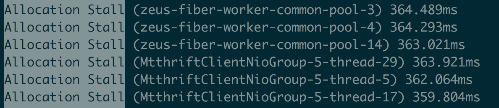

- **安全点**：所有线程进入到安全点后才能进行GC，ZGC定期进入安全点判断是否需要GC。先进入安全点的线程需要等待后进入安全点的线程直到所有线程挂起。
- **dump线程、内存**：比如jstack、jmap命令。

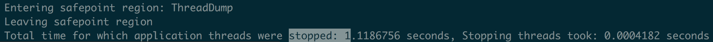

### 调优案例

我们维护的服务名叫Zeus，它是美团的规则平台，常用于风控场景中的规则管理。规则运行是基于开源的表达式执行引擎[Aviator](https://github.com/killme2008/aviator)。Aviator内部将每一条表达式转化成Java的一个类，通过调用该类的接口实现表达式逻辑。

Zeus服务内的规则数量超过万条，且每台机器每天的请求量几百万。这些客观条件导致Aviator生成的类和方法会产生很多的ClassLoader和CodeCache，这些在使用ZGC时都成为过GC的性能瓶颈。接下来介绍两类调优案例。

**内存分配阻塞，系统停顿可达到秒级**

**案例一：秒杀活动中流量突增，出现性能毛刺**

**日志信息**：对比出现性能毛刺时间点的GC日志和业务日志，发现JVM停顿了较长时间，且停顿时GC日志中有大量的“Allocation Stall”日志。

**分析**：这种案例多出现在“自适应算法”为主要GC触发机制的场景中。ZGC是一款并发的垃圾回收器，GC线程和应用线程同时活动，在GC过程中，还会产生新的对象。GC完成之前，新产生的对象将堆占满，那么应用线程可能因为申请内存失败而导致线程阻塞。当秒杀活动开始，大量请求打入系统，但自适应算法计算的GC触发间隔较长，导致GC触发不及时，引起了内存分配阻塞，导致停顿。

**解决方法：**

（1）开启”基于固定时间间隔“的GC触发机制：-XX:ZCollectionInterval。比如调整为5秒，甚至更短。
（2）增大修正系数-XX:ZAllocationSpikeTolerance，更早触发GC。ZGC采用正态分布模型预测内存分配速率，模型修正系数ZAllocationSpikeTolerance默认值为2，值越大，越早的触发GC，Zeus中所有集群设置的是5。

**案例二：压测时，流量逐渐增大到一定程度后，出现性能毛刺**

**日志信息**：平均1秒GC一次，两次GC之间几乎没有间隔。

**分析**：GC触发及时，但内存标记和回收速度过慢，引起内存分配阻塞，导致停顿。

**解决方法**：增大-XX:ConcGCThreads， 加快并发标记和回收速度。ConcGCThreads默认值是核数的1/8，8核机器，默认值是1。该参数影响系统吞吐，如果GC间隔时间大于GC周期，不建议调整该参数。

**GC Roots 数量大，单次GC停顿时间长**

**案例三： 单次GC停顿时间30ms，与预期停顿10ms左右有较大差距**

**日志信息**：观察ZGC日志信息统计，“Pause Roots ClassLoaderDataGraph”一项耗时较长。

**分析**：dump内存文件，发现系统中有上万个ClassLoader实例。我们知道ClassLoader属于GC Roots一部分，且ZGC停顿时间与GC Roots成正比，GC Roots数量越大，停顿时间越久。再进一步分析，ClassLoader的类名表明，这些ClassLoader均由Aviator组件生成。分析Aviator源码，发现Aviator对每一个表达式新生成类时，会创建一个ClassLoader，这导致了ClassLoader数量巨大的问题。在更高Aviator版本中，该问题已经被修复，即仅创建一个ClassLoader为所有表达式生成类。

**解决方法**：升级Aviator组件版本，避免生成多余的ClassLoader。

**案例四：服务启动后，运行时间越长，单次GC时间越长，重启后恢复**

**日志信息**：观察ZGC日志信息统计，“Pause Roots CodeCache”的耗时会随着服务运行时间逐渐增长。

**分析**：CodeCache空间用于存放Java热点代码的JIT编译结果，而CodeCache也属于GC Roots一部分。通过添加-XX:+PrintCodeCacheOnCompilation参数，打印CodeCache中的被优化的方法，发现大量的Aviator表达式代码。定位到根本原因，每个表达式都是一个类中一个方法。随着运行时间越长，执行次数增加，这些方法会被JIT优化编译进入到Code Cache中，导致CodeCache越来越大。

**解决方法**：JIT有一些参数配置可以调整JIT编译的条件，但对于我们的问题都不太适用。我们最终通过业务优化解决，删除不需要执行的Aviator表达式，从而避免了大量Aviator方法进入CodeCache中。

值得一提的是，我们并不是在所有这些问题都解决后才全量部署所有集群。即使开始有各种各样的毛刺，但计算后发现，有各种问题的ZGC也比之前的CMS对服务可用性影响小。所以从开始准备使用ZGC到全量部署，大概用了2周的时间。在之后的3个月时间里，我们边做业务需求，边跟进这些问题，最终逐个解决了上述问题，从而使ZGC在各个集群上达到了一个更好表现。

## 升级ZGC效果

### 延迟降低

> [**TP(Top Percentile)是一项衡量系统延迟的指标**]()：TP999表示99.9%请求都能被响应的最小耗时；TP99表示99%请求都能被响应的最小耗时。

在Zeus服务不同集群中，ZGC在低延迟（TP999 < 200ms）场景中收益较大：

- **TP999**：下降12~142ms，下降幅度18%~74%。
- **TP99**：下降5~28ms，下降幅度10%~47%。

超低延迟（TP999 < 20ms）和高延迟（TP999 > 200ms）服务收益不大，原因是这些服务的响应时间瓶颈不是GC，而是外部依赖的性能。

### 吞吐下降

对吞吐量优先的场景，ZGC可能并不适合。例如，Zeus某离线集群原先使用CMS，升级ZGC后，系统吞吐量明显降低。究其原因有二：

- 第一，ZGC是单代垃圾回收器，而CMS是分代垃圾回收器。单代垃圾回收器每次处理的对象更多，更耗费CPU资源；
- 第二，ZGC使用读屏障，读屏障操作需耗费额外的计算资源。

## 总结

ZGC作为下一代垃圾回收器，性能非常优秀。ZGC垃圾回收过程几乎全部是并发，实际STW停顿时间极短，不到10ms。这得益于其采用的着色指针和读屏障技术。

Zeus在升级JDK 11+ZGC中，通过将风险和问题分类，然后各个击破，最终顺利实现了升级目标，GC停顿也几乎不再影响系统可用性。

最后推荐大家升级ZGC，Zeus系统因为业务特点，遇到了较多问题，而风控其他团队在升级时都非常顺利。

## 附录

### 如何使用新技术

在生产环境升级JDK 11，使用ZGC，大家最关心的可能不是效果怎么样，而是这个新版本用的人少，网上实践也少，靠不靠谱，稳不稳定。其次是升级成本会不会很大，万一不成功岂不是白白浪费时间。所以，在使用新技术前，首先要做的是评估收益、成本和风险。

**评估收益**

对于JDK这种世界关注的程序，大版本升级所引入的新技术一般已经在理论上经过验证。我们要做的事情就是确定当前系统的瓶颈是否是新版本JDK可解决的问题，切忌问题未诊断清楚就采取措施。评估完收益之后再评估成本和风险，收益过大或者过小，其他两项影响权重就会小很多。

以本文开头提到的案例为例，假设GC次数不变（10次/分钟)，且单次GC时间从40ms降低10ms。通过计算，一分钟内有100/60000 = 0.17%的时间在进行GC，且期间所有请求仅停顿10ms，GC期间影响的请求数和因GC增加的延迟都有所减少。

**评估成本**

这里主要指升级所需要的人力成本。此项相对比较成熟，根据新技术的使用手册判断改动点。跟做其他项目区别不大，不再具体细说。

在我们的实践中，两周时间完成线上部署，达到安全稳定运行的状态。后续持续迭代3个月，根据业务场景对ZGC进行了更契合的优化适配。

**评估风险**

升级JDK的风险可以分为三类：

- **兼容性风险**：Java程序JAR包依赖很多，升级JDK版本后程序是否能运行起来。例如我们的服务是从JDK 7升级到JDK 11，需要解决较多JAR包不兼容的问题。
- **功能风险**：运行起来后，是否会有一些组件逻辑变更，影响现有功能的逻辑。
- **性能风险**：功能如果没有问题，性能是否稳定，能稳定的在线上运行。

经过分类后，每类风险的应对转化成了常见的测试问题，不再属于未知风险。风险是指不确定的事情，如果不确定的事情都能转化成可确定的事情，意味着风险已消除。

### 升级JDK 11

选择JDK 11，是因为在JDK 11中首次支持ZGC，而且JDK 11属于长期支持（Long Term Support，LTS）版本，至少会被维护三年，普通版本（如JDK 12、JDK 13和JDK 14）只有6个月的维护周期，不建议使用。

**本地测试环境安装**

从两个源[OpenJDK](https://jdk.java.net/archive/)和[OracleJDK](https://www.oracle.com/java/technologies/javase-jdk11-downloads.html) 下载JDK 11，二个版本的JDK主要区别是长时期的免费和付费，短期内都免费。注意JDK 11版本中的ZGC不支持Mac OS系统，在Mac OS系统上使用JDK 11只能用其他垃圾回收器，如G1。

**生产环境安装**

升级JDK 11不仅仅是升级自己项目的JDK版本，还需要编译、发布部署、运行、监控、性能内存分析工具等项目支持。美团内部的实践：

**编译打包**：美团发布系统支持选择JDK 11进行编译打包。 **线上运行 & 全量部署**：要求线上机器已安装JDK11，有3种方式：

1.新申请默认安装JDK 11的虚拟机：试用JDK 11时可用这种方式；全量部署时，如果新申请机器数量过多，可能没有足够机器资源。 2.通过手写脚本给存量虚拟机安装JDK 11：不推荐，业务同学过多参与到运维当中。 3.使用容器提供的镜像部署功能，在打包镜像时安装JDK 11：推荐方式，不需要新申请资源。

**监控指标**：主要是GC的时间和频率，我们通过美团的CAT监控系统支持ZGC数据的收集（[CAT已开源](https://tech.meituan.com/2018/11/01/cat-in-depth-java-application-monitoring.html)）。 **性能内存分析**：线上遇到性能问题时，还需要借助Profiling工具，美团的性能诊断优化平台Scalpel已支持JDK 11的性能内存分析。如果你的公司没有相关工具，推荐使用JProfier。

**解决组件兼容性**

我们的项目包含二十多万行代码，需要从JDK 7升级到JDK 11，依赖组件众多。虽然看起来升级会比较复杂，但实际只花了两天时间即解决了兼容性问题。具体过程如下：

1.编译，需要修改pom文件中的build配置，根据报错作修改，主要有两类：

a.一些类被删除：比如“sun.misc.BASE64Encoder”，找到替换类java.util.Base64即可。

b.组件依赖版本不兼容JDK 11问题：找到对应依赖组件，搜索最新版本，一般都支持JDK 11。

2.编译成功后，启动运行，此时仍有可能组件依赖版本问题，按照编译时的方式处理即可。

升级所修改的依赖：

```XML
<dependency>
    <groupId>javax.annotation</groupId>
    <artifactId>javax.annotation-api</artifactId>
    <version>1.3.2</version>
</dependency>
<dependency>
    <groupId>javax.validation</groupId>
    <artifactId>validation-api</artifactId>
    <version>2.0.1.Final</version>
</dependency>
<dependency>
    <groupId>org.projectlombok</groupId>
    <artifactId>lombok</artifactId>
    <version>1.18.4</version>
</dependency>
<dependency>
    <groupId>org.hibernate.validator</groupId>
    <artifactId>hibernate-validator-parent</artifactId>
    <version>6.0.16.Final</version>
</dependency>
<dependency>
    <groupId>com.sankuai.inf</groupId>
    <artifactId>patriot-sdk</artifactId>
    <version>1.2.1</version>
</dependency>
<dependency>
    <groupId>org.apache.commons</groupId>
    <artifactId>commons-lang3</artifactId>
    <version>3.9</version>
</dependency>
<dependency>
    <groupId>commons-lang</groupId>
    <artifactId>commons-lang</artifactId>
    <version>2.6</version>
</dependency>
<dependency>
    <groupId>io.netty</groupId>
    <artifactId>netty-all</artifactId>
    <version>4.1.39.Final</version>
</dependency>
<dependency>
    <groupId>junit</groupId>
    <artifactId>junit</artifactId>
    <version>4.12</version>
</dependency>
```

JDK 11已经出来两年，常见的依赖组件都有兼容性版本。但是，如果是公司内部提供的公司级组件，可能会不兼容JDK 11，需要推动相关组件进行升级。如果对方升级较为困难，可以考虑拆分功能，将依赖这些组件的功能单独部署，继续使用低版本JDK。随着JDK11的卓越性能被大家悉知，相信会有更多团队会用JDK 11解决GC问题，使用者越多，各个组件升级的动力也会越大。

**验证功能正确性**

通过完备的单测、集成和回归测试，保证功能正确性。

# ZGC

现代垃圾收集器的演进大部分都是往减少停顿方向发展。像 CMS 就是分离出一些阶段使得应用线程可以和垃圾回收线程并发，当然还有利用回收线程的并行来减少停顿的时间。

基本上 STW 阶段都是利用多线程并行来减少停顿时间，而并发阶段不会有太多的回收线程工作，这是为了不和应用线程争抢 CPU，反正都并发了慢就慢点（不过还是得考虑内存分配速率）。

而 G1 可以认为是打开了另一个方向的大门： 只回收部分垃圾来减少停顿时间。

不过为了达到只回收部分 reigon，每个 region 都需要 RememberSet 来记录各 region 之间的引用。这个内存的开销其实还是挺大的，可能会占据整堆的20%或以上。并且 G1 还有写屏障的开销，虽说用了 logging wtire barrier，但也还是有开销的。当然 CMS 也用了写屏障，不过逻辑比较简单，啥都没判断就单纯的记录。

其实 G1 相对于 CMS 只有在大堆的场景下才有优势，CMS 比较伤的是 remark 阶段，如果堆太大需要扫描的东西太多。

而 G1 在大堆的时候可以选择部分收集，所以停顿时间有优势。

今天的主角 ZGC 和 G1 一样是基于 reigon 的， 几乎所有阶段都是并发的，整堆扫描，部分收集。而且 ZGC 还不分代，就是没分新生代和老年代。


## ZGC 的目标

所以我们先看看 ZGC 的目标：


可以看到它的 目标就是低延迟，保证最大停顿时间在几毫秒之内，不管你堆多大或者存活的对象有多少。可以处理 8MB-16TB 的堆。

咱们就按 openjdk 的 wiki 来展开今天的内容。


关键字：并发、基于Region、整理内存、支持NUMA、用了染色指针、用了读屏障，对了 ZGC 用的是 STAB。

## Concurrent

这个 Concurrent 的意思是和应用线程并发执行，ZGC 一共分了 10 个阶段，只有 3 个很短暂的阶段是 STW 的。


可以看到只有[**初始标记、再标记、初始转移阶段**]()是 STW 的。

初始标记就扫描 GC Roots 直接可达的，耗时很短，重新标记一般而言也很短， 如果超过 1ms 会再次进入并发标记阶段再来一遍，所以影响不大。初始转移阶段也是扫描 GC Roots 也很短，所以可以认为 ZGC 几乎是并发的。

而且之所以说停顿时间不会随着堆的大小和存活对象的数量增加而增加，是因为 [**STW 几乎只和 GC Roots 集合大小有关，和堆大小没啥关系**]()。

这其实就是 ZGC 超过 G1 很关键的一个地方， [**G1 的对象转移需要 STW 所以堆大需要转移对象多，停顿的时间就长了**]()， 而 ZGC 有并发转移。

不过并发回收有个情况就是回收的时候应用线程还是在产生新的对象，所以需要预留一些空间给并发时候生成的新对象。

如果对象分配过快导致内存不够，在 CMS 中是发生 Full gc，而 ZGC 则是阻塞应用线程。所以要注意 ZGC 触发的时间。

ZGC 有自适应算法来触发也有固定时间触发，所以可以根据实际场景来修改 ZGC 触发时间，防止过晚触发而内存分配过快导致线程阻塞。

还有设置 ParallelGCThreads 和 ConcGCThreads，分别是 STW 并行时候的线程数和并发阶段的线程数来加快回收的速度。不过 ConcGCThreads 数量需要注意， 因为此阶段是和应用线程并发，如果线程数过多会影响应用线程。

其实 ZGC 的每个阶段都是串行的，所以理论上其实可以不需要分两类线程，那为什么分了这两类线程？

就是为了灵活设置。分成两类就可以通过配置来调优，达到性能最大值。

对了上面提到 ZGC 的 STW 和 GC Roots 集合大小有关系，所以[**如果在会生成很多线程、动态加载很多 ClassLoader 等情况下会增加 ZGC 的停顿时间**]()。这点需要注意。

## Region-based

为了能更细粒度的控制内存的分配，和 G1 一样 ZGC 也将堆划分成很多分区。

分了三种：2MB、32MB 和 X*MB（受操作系统控制）。

下图为源码中的注释：


对于回收的策略是优先收集小区，中、大区尽量不回收。

## Compacting

和 G1 一样都分区了所以肯定从整体来看像是标记-复制算法，所以也是会整理的。因此 ZGC 也不会产生内存碎片。

## NUMA-aware

以前的 G1 是不支持的，不过在 JDK14 G1 也支持了。


在早期处理器都是单核的，因为根据 摩尔定律，处理器的性能每隔一段时间就可以成指数型增长。而近年来这个增长的速度逐渐变缓，于是很多厂商就推出了双核多核的计算机。早期 CPU 通过前端总线到北桥到内存总线然后才访问到内存。


这个架构被称为 SMP （Symmetric Multi-Processor），因为任一个 CPU 对内存的访问速度是一致的，不用考虑不同内存地址之间的差异，所以也称一致内存访问（Uniform Memory Access， UMA ）。

这个核心越加越多，渐渐的 总线和北桥就成为瓶颈，那不能够啊，于是就想了个办法。

把 CPU 和内存集成到一个单元上，这个就是非一致内存访问 （Non-Uniform Memory Access，NUMA）。


简单的说就是把内存分一分，每个 CPU 访问自己的本地的内存比较快，访问别人的远程内存就比较慢。

当然也可以多个 CPU 享受一块内存或者多块，如下图所示：


但是因为内存被切分为本地内存和远程内存，当某个模块比较“热”的时候，就可能产生本地内存爆满，而远程内存都很空闲的情况。

比如 64G 内存一分为二，模块一的内存用了31G，而另一个模块的内存用了5G，且模块一只能用本地内存，这就产生了内存不平衡问题。

如果有些策略规定不能访问远程内存的时候，就会出现明明还有很多内存却产生 SWAP(将部分内存置换到硬盘中) 的情况。

即使允许访问远程内存那也比本地内存访问速率相差较大，这是使用 NUMA 需要考虑的问题。

> ZGC 对 NUMA 的支持是小分区分配时会优先从本地内存分配，如果本地内存不足则从远程内存分配。对于中、大分区的话就交由操作系统决定。

上述做法的原因是生成的绝大部分都是小分区对象，因此优先本地分配速度较快，而且也不易造成内存不平衡的情况。

而中、大分区对象较大，如果都从本地分配则可能会导致内存不平衡的情况。

## Using colored pointers

染色指针其实就是从 64 位的指针中，拿几位来标识对象此时的情况，分别表示 Marked0、Marked1、Remapped、Finalizable。


我们再来看下源码中的注释，非常的清晰直观：


0-41 这 42 位就是正常的地址，所以说 ZGC 最大支持 4TB (理论上可以16TB)的内存，因为就 42 位用来表示地址。

也因此 ZGC 不支持 32 位指针，也不支持指针压缩。

然后用 42-45 位来作为标志位，[**其实不管这个标志位是啥指向的都是同一个对象**]()。

这是通过 多重映射来做的，很简单就是 多个虚拟地址指向同一个物理地址，不过对象地址是 0001.... 还是0010....还是0100..... 对应的都是同一个物理地址即可。

具体这几个标记位怎么用的，待下文回收流程分析再解释。

不过这里先提个问题， 为什么就支持 4TB，不是还有很多位没用吗？

首先 [**X86_64 的地址总线只有 48 条**]() ，所以最多其实只能用 48 位，指令集是 64 位没错，但是硬件层面就支持 48 位。

因为基本上没有多少系统支持这么大的内存，那支持 64 位就没必要了，所以就支持到 48 位。

那现在对象地址就用了 42 位，染色指针用了 4 位，不是还有 2 位可以用吗？

是的，[**理论上可以支持 16 TB，不过暂时认为 4TB 够了，所以暂做保留，仅此而已没啥特别的含义**]()。

## Using load barriers

[**在 CMS 和 G1 中都用到了写屏障，而 ZGC 用到了读屏障。**]()

写屏障是在对象引用赋值时候的 AOP，而读屏障是在读取引用时的 AOP。

比如 Object a = obj.foo; ，这个过程就会触发读屏障。

也正是用了读屏障，ZGC 可以并发转移对象，而 G1 用的是写屏障，所以转移对象时候只能 STW。

简单的说就是 [**GC 线程转移对象之后，应用线程读取对象时，可以利用读屏障通过指针上的标志来判断对象是否被转移。**]()

如果是的话修正对象的引用，按照上面的例子，不仅 a 能得到最新的引用地址，obj.foo 也会被更新，这样下次访问的时候一切都是正常的，就没有消耗了。

下图展示了[**读屏障的效果，其实就是转移的时候找地方记一下即 forwardingTable，然后读的时候触发引用的修正。**]()


这种也称之为“自愈”，不仅赋值的引用时最新的，自身引用也修正了。

染色指针和读屏障是 ZGC 能实现并发转移的关键所在。

## ZGC 回收流程解析

ZGC 的步骤大致可分为三大阶段分别是标记、转移、重定位。

- 标记：从根开始标记所有存活对象
- 转移：选择部分活跃对象转移到新的内存空间上
- 重定位：因为对象地址变了，所以之前指向老对象的指针都要换到新对象地址上。

并且这三个阶段都是并发的。

这是意识上的阶段， 具体的实现上重定位其实是糅合在标记阶段的。

在标记的时候如果发现引用的还是老的地址则会修正成新的地址，然后再进行标记。

简单的说就是从第一个 GC 开始经历了标记，然后转移了对象，这个时候不会重定位，只会记录对象都转移到哪里了。

在第二个 GC 开始标记的时候发现这个对象是被转移了，然后发现引用还是老的，则进行重定位，即修改成新的引用。

所以说重定位是糅合在下一步的标记阶段中。


我再简单说一下十个步骤。

不过步骤里有些不影响整体回收流程的，我就不多加分析了。

### 1.初始标记

这个阶段其实大家应该很熟悉，CMS、G1 都有这个阶段， 这个阶段是 STW 的，仅标记根直接可达的对象，压到标记栈中。当然还有其他动作，比如重置 TLAB、判断是否要清除软引用等等，不做具体分析。

### 2.并发标记

就是根据初始标记的对象开始并发遍历对象图，还会统计每个 region 的存活对象的数量。

这个并发标记其实有个细节，[**标记栈其实只有一个，但是并发标记的线程有多个。**]()

为了减少之间的竞争每个线程其实会分到不同的标记带来执行。你就理解为标记栈被分割为好几块，每个线程负责其中的一块进行遍历标记对象，就和1.7 Hashmap 的segment 一样。

那肯定有的线程标记的快，有的标记的慢，那么 先空闲下来的线程会去窃取别人的任务来执行，从而实现负载均衡。

看到这有没有想到啥？没错就是 ForkJoinPool 的工作窃取机制！

### 3.再标记阶段

这一阶段是 STW 的，因为并发阶段应用线程还是在运行的，所以会修改对象的引用导致漏标的情况。因此需要个再标记阶段来标记漏标的那些对象。

如果这个阶段执行的时间过长，就会再次进入到并发标记阶段，因为 ZGC 的目标就是低延迟，所以一有高延迟的苗头就得扼制。

这个阶段还会做非强根并行标记，非强根指的是：系统字典、JVMTI、JFR、字符串表。

有些非强根可以并发，有些不行，具体不做分析。

### 4.非强引用并发标记和引用并发处理

就是上一步非强根的遍历，然后引用就软引用、弱引用、虚引用的一些处理。

这个阶段是并发的。

### 5.重置转移集

还记得标记时候的重定位么？在写读屏障时候提到的 forwardingTable 就是个映射集，你可以理解为 key 就是对象转移前的地址，value 是对象转移后的地址。

不过这个映射集在标记阶段已经用了，也就是说标记的时候已经重定位完了，所以现在没用了。

但新一轮的垃圾回收需要还是要用到这个映射集的。

因此在这个阶段对那些转移分区的地址映射集做一个复位的操作。

### 6.回收无效分区

回收那些物理内存已经被释放的无效的虚拟内存页面。

就是在内存紧张的时候会释放物理内存，如果同时释放虚拟空间的话也不能释放分区，因为 分区需要在新一轮标记完成之后才能释放。

所以就会有无效的虚拟内存页面存在，在这个阶段回收。

### 7.选择待回收的分区

这和 G1 一样，因为会有很多可以回收的分区，会筛选垃圾较多的分区，来作为这次回收的分区集合。

### 8.初始化待转移集合的转移表

这一步就是初始化待回收的分区的 forwardingTable。

### 9.初始转移

这个阶段其实就是从根集合出发，如果对象在转移的分区集合中，则在新的分区分配对象空间。

如果不在转移分区集合中，则将对象标记为 Remapped。

注意这个阶段是 STW，只转移根直接可达的对象。

### 10.并发转移

这个阶段和并发标记阶段就很类似了，从上一步转移的对象开始遍历，做并发转移。

这一步很关键。

G1 的转移对象整体都需要 STW，而 ZGC 做到了并发转移，所以延迟会低很多。

## 染色指针的标记位

来分析下几个标记位，M0、M1、Remapped。

先来介绍个名词， [**地址视图：指的就是此时地址指针的标记位。**]()

比如标记位现在是 M0，那么此时的视图就是 M0 视图。

在垃圾回收开始前视图是 Remapped 。

### 在进入标记标记时

地址视图被置为 M0

标记线程访问发现对象地址视图是 Remapped 这时候将指针标记为 M0，即将地址视图置为 M0，表示活跃对象。

如果扫描到对象地址视图是 M0 则说明这个对象是标记开始之后新分配的或者已经标记过的对象，所以无需处理。

应用线程如果创建新对象，则将其地址视图置为 M0，如果访问的对象地址视图是 Remapped 则将其置为 M0，并且递归标记其引用的对象。

如果访问到的是 M0 ，则无需操作。

标记阶段结束后，ZGC 会使用一个对象活跃表来存储这些对象地址，此时活跃的对象地址视图是 M0。

### 并发转移阶段

地址视图被置为 Remapped 

也就是说 GC 线程如果访问到对象，此时对象地址视图是 M0，并且存在或活跃表中，则将其转移，并将地址视图置为 Remapped 。

如果在活跃表中，但是地址视图已经是 Remapped 说明已经被转移了，不做处理。

应用线程此时创建新对象，地址视图会设为 Remapped 。

如果地址视图为 M0，则说明还未转移，则需要转移，并将其地址视图置为 Remapped 。

如果访问到的对象不在活跃表中，则不做处理。

### 那 M1 什么用？

> M1 是在下一次 GC 时候用的，下一次的 GC 就用 M1来标记，不用 M0。再下一次再换过来。

简单的说就是 M1 标识本次垃圾回收中活跃的对象

而 M0 是上一次回收被标记的对象，但是没有被转移，在本次回收中也没有被标记活跃的对象。

其实从上面的分析以及得知，如果没有被转移就会停留在 M0 这个地址视图。

而下一次 GC 如果还是用 M0 来标识那混淆了这两种对象。所以搞了个 M1。


## 最后

简单的总结下，ZGC 就是通过多阶段的并发和几个短暂的 STW 阶段来达到低延迟的特性。

利用指针染色技术和读屏障实现并发转移对象，利用 STAB 保证并发阶段不会漏标对象。

ZGC 的不分代其实是它的缺点，因为分代比较难实现，不过以后应该会加上吧。

其实从现代垃圾收集器的演进可以看出就是往并发上面靠，目标就是减少停顿的时间。

不过并发需要注意内存分配的速率，因为并发导致一次垃圾回收总的时间变长了。

如果内存分配过快那就回收不过来了，因此都需要预留内存空间或者说要更大的内存空间来应对快速的分配速率。

# JVM优化概述

## 一、简介

JVM性能优化其实就是针对JVM内存分配、参数设置进行优化，目的是减少GC次数，避免对象频繁进入老年代。所以，我们来先来回顾下新生代和老年代的垃圾回收过程，并看下可能会引发的各种JVM性能问题。

在正式开始之前，我先给出一份JVM调优模板，这份模板基本上涵盖了JVM调优所需的所有核心参数，后续我们所有的调优也会围绕它展开：

**-Xms4096M -Xmx4096M -Xmn3072M -Xss1M -XX:MetaspaceSize=256M -XX:MaxMetaspaceSize=256M -XX:+UseParNewGC -XX:+UseConcMarkSweepGC -XX:CMSInitiatingOccupancyFaction=92 -XX:UseCMSCompactAtFullCollection -XX:CMSFullGCsBeforeCompaction=0 -XX:CMSParallellInitialMarkEnabled -XX:CMSScavengeBeforeRemark -XX:DisableExplicitGC -XX:PrintGCDetail -Xloggc:gc.log -XX:+HeapDumpOnOutOfMemoryError -XX:HeapDumpPath:/usr/local/app/oom.hprof**

首先，JVM中各块内存区域大小的分配是根据系统运行模型来配置的，然后是ParNew和CMS这两种垃圾回收器的配置，特别注意CMS的一些参数，主要是提升CMS的效率和性能。还有就是打印GC日志，日志可以借助后续章节会讲到的jstat工具进行分析，最后两个参数是在发生内存溢出异常时，自动dump出内存快照，然后就可以通过MAT等工具进行分析了。

## 二、JVM性能问题

### 2.1 新生代GC

随着系统的不断运行，新生代中的对象会越来越多，直到快被塞满。此时会根据GC Roots去寻找存活的对象。GC Roots一般是类静态变量或方法的局部变量。由于我们创建对象最多的地方是在方法内，方法运行完毕，局部变量就没有了，所以新生代中这种对象其实占了99%，这也是新生代对象存活率低的原因。


新生代进行Minor GC时，会采用复制算法，将Eden区和一块Survivor区的存活对象复制到另一块Survivor区，然后清空Eden和之前的Survivor。同时，新生代GC期间会”Stop the World“，即只允许GC线程进行回收工作，其它工作线程都会被挂起。


假设一次新生代的GC需要20ms，那么此时对于用户发送的请求，这20ms内是无法处理的，系统会卡顿20ms。但是新生代的GC速度非常快，所以只要不频繁GC，其实对系统是没什么影响的。所以，新生代GC其实没什么好调优的，只要多分配点堆内存，保证Survivor区空间充足，那么低峰时期一般几小时才有一次新生代GC，高峰期也最多几分钟一次新生代GC。

那么，什么时候新生代GC会对系统产生很大的影响呢？

当系统部署在大内存机器上时，比如32核64G的机器，新生代的Eden区可能有32G以上的内存。

此时，如果系统的负载特别高（比如部署了Kafka、Elasticsearch每秒处理上万的请求），那么可能导致Eden区的几十G空间在短短几分钟内被塞满。而此时进行新生代GC会停止系统的运行，由于新生代空间非常大，GC时间会很长，可能长达数秒钟。

对于一个高负载高并发的系统，每隔几分钟就停顿几秒去进行新生代GC，是不可接受的。

解决方案一般就是使用G1垃圾回收器，因为G1可以设置一个预期停顿时间（比如20ms），那么G1基于它的Region内存划分原理，就可以在运行一段时间之后，回收一部分Region，控制时间在20ms内，然后再运行再回收。

所以，[**G1天生就适合在这种大内存的机器上运行，可以完美解决大内存垃圾回收时间过长的问题**]()。

### 2.2 老年代GC

之前给大家讲过新生代中对象晋升到老年代的几个可能条件：

- 年龄太大
- 符合动态年龄判断规则
- 大对象
- 新生代GC后存活的对象放不下Survivor区

上述条件中，关键是动态年龄判断和对象放不下Survivor区，从而导致大量对象频繁进入老年代：


老年代GC非常耗时，无论是CMS还是G1。通常老年代GC要比新生代GC慢十倍以上，所以针对老年代GC的优化还是要先从新生代GC入手，合理分配内存和设置JVM参数，尽量让对象不要频繁进入老年代。

## 三、各种GC分类

### 3.1 Minor GC/Young GC

当新生代的Eden区域被占满后，实际就需要触发新生代的GC，这就是所谓的”Minor GC“，也可以称之为”Young GC“。

触发时机：新生代的Eden区域被占满后。

### 3.2 Full GC/Old GC

Old GC是仅仅针对老年代区域进行垃圾回收。而Full GC则是针对新生代、老年代、永久代的全体内存空间进行垃圾回收。

触发时机：老年代空间不够。具体时机可细分为以下几种：

1. 进行Young GC之前：如果老年代的连续可用内存空间 < 新生代历次晋升的平均大小，此时先触发一次Old GC清理老年代，然后再执行Young GC。
2. 进行Young GC之后：如果存活对象要进入老年代，但是老年代的连续可用内存空间 < 存放对象的大小，此时必须触发一次Old GC。
3. 老年代的内存使用率超过了92%，此时也会触发Old GC。

> 在很多JVM的实现机制里，当上述几种条件达到时，实际触发的其实是Full GC，这个Full GC会包含Young GC、Old GC和永久代GC。

### 3.3 Mixed GC

Mixed GC是G1垃圾回收器中特有的概念，在G1中，[**一旦老年代占据了Java堆内存的45%，就会触发Mixed GC，此时对新生代和老年代都进行垃圾回收。**]()

触发时机：G1特有，老年代空间占据到Java堆内存的45%。

### 3.4 永久代GC

永久代一般存放着类信息、常量池等等。在进行Full GC的时候，会顺带对永久代进行GC，一般来说永久代里的东西是不需要回收的，如果永久代真的满了，回收之后也没腾出足够的空间来，就会抛出OOM异常。

# Young GC调优

## 一、简介

新生代调优最简单的思路就是扩Survivor区，本章示例的调优思路也是一脉相承。

### 1.1 案例背景

假设生产环境有一个商户BI系统，用于商户日常经营数据的分析和报表输出，其大致运行逻辑如下：

1. 商户会在业务平台上进行运营，产生各种各样的业务数据；
2. Hadoop、Spark等会对这些业务数据进行计算，然后放入MySQL、HBase之类的存储中；
3. 最后，我们的BI系统会把各种存储好的数据暴露给前端，允许前端基于各种搜索条件筛选和展示。


系统刚上线时，商户数量只有几万家，生产机器配置是4核8G，新生代分配1.5G，Eden区有1G：


### 1.2 内存使用模型估算

每个商户的主页，前端每隔几秒钟就会发送一个请求给BI系统，用于生成一种实时报表。每台机器差不多每秒抗500个请求，由于报表需要的数据量比较大，一般每个请求需要加载约100KB的数据到内存中，每秒500个请求总共就是50MB数据，每次Young GC过后存活对象也就几十MB：


## 二、Young GC调优

根据上述内存使用模型的估算，每秒需加载50MB数据到Eden区，那3分钟左右就会将Eden区占满，触发Young GC。在1G的内存空间中进行Young GC的效率是很高的，基本上10ms左右就可以搞定，所以BI系统每运行几分钟就会出现10ms左右的卡顿，但是对终端用户和系统运行基本没有影响：

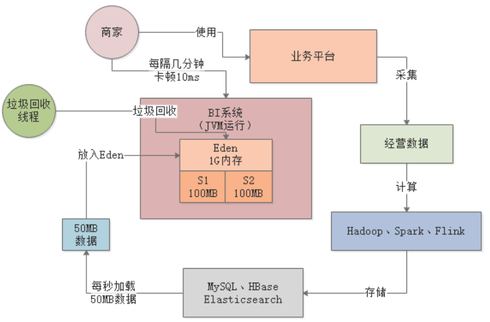

### 2.1 采用大内存

针对这样的业务场景，几万商户数量级基本没有什么影响，但是当商户数量达到百万级以上就会出现问题。所以，最简单的优化思路就是提升机器配置，比如采用16核32G的机器，这样每台机器可以抗几千个请求，部署20~30台就差不多了。

32G内存的机器，新生代分配20G，其中Eden区占16G。此时每秒几千请求的话，大概每秒会加载几百MB数据到Eden区，最多1分钟就会填满Eden区。

此时，Young GC从原来只需回收1G的内存变成了回收16G，速度会慢很多，从商户的体验上看就是每隔1分钟，系统就要卡1s左右：

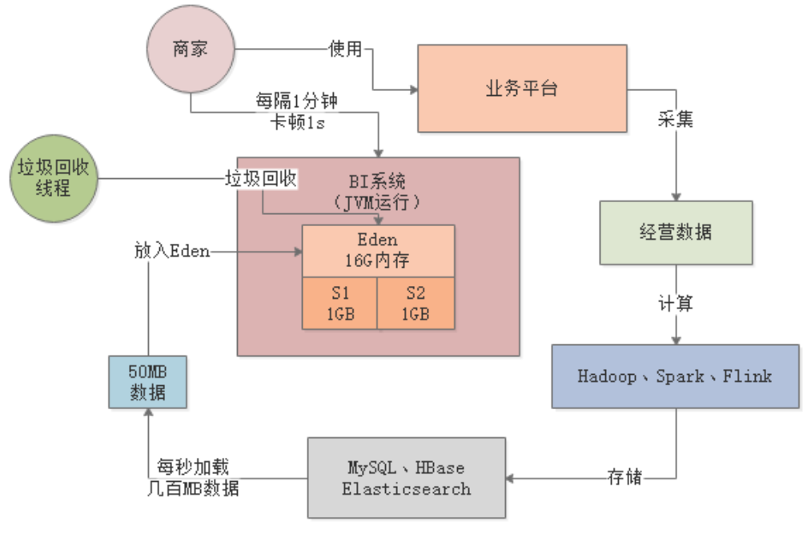

> 卡顿时间过长，会导致大量请求排队，严重时导致系统时不时就出现请求超时的现象。

### 2.2 采用G1

既然是大内存的机器，其实采用G1才是正确的思路。对G1设置一个合理的预期停顿时间，比如100ms，让G1保证每次Young GC的时候最多停顿100ms，避免影响终端用户的使用。

## 三、总结

在系统内存不是很大的情况下，可以通过提升Eden和Survivor的空间，来容纳更多的新生代对象。

但是，当新生代的内存空间太大时，需要考虑每次Young GC的时间成本，传统的ParNew回收器不太适合这种大内存场景，所以针对大内存机器建议使用G1进行垃圾回收。

另外，通过本文示例也可以看到，即使Young GC频繁些，但是只要保证每次GC时间很短（控制在几十毫秒内），对系统基本不会有什么影响。

# Full GC调优

## 一、简介

> 1.考虑扩展survivor
>
> 2.考虑采用大内存
>
> 3.根据实际场景是否需要使用G1

### 1.1 案例背景

假设现在生产环境有一套“数据计算系统”，不停地从MySQL等各类数据源提取数据到内存中进行计算，系统是分布式的。

每个节点（机器）每分钟执行100次操作（提取数据并计算，每次操作耗时10s），每次操作1万条数据，每条数据大小为1KB左右，每次操作的数据大小就是10MB：


> 每台机器的配置是4核8G，JVM分配4G内存，其中新生代1.5G，老年代1.5G。

### 1.2 内存使用模型估算

每次操作会在Eden区分配10MB对象，以1分钟100次操作来算，那么Eden区1分钟内就会被占满：


## 二、Full GC调优

每个计算任务处理1万条数据耗时10s，假设此时80个计算任务都结束了，还有20个计算任务共计200MB正在计算中，那么此时200MB对象是存活的，不会被Young GC回收掉：


### 2.1 扩Survivor

由于任何一块Survivor区只有100MB，所以新生代中这存活的200MB对象会晋升到老年代，然后清空Eden：


如此反复，大约经过7分钟后，也就是经历了7次Young GC，此时大概有1.4G对象在老年代中：


再经过1分钟，也就是第8分钟结束时，新生代又满了，此时发现老年代可用空间已经不足（剩余100MB），比历代平均的晋升对象大小（200MB）要小，所以会直接触发一次Full GC。

Full GC会先把老年代的垃圾回收了（假设能全部回收），然后执行一次Young GC，此时Eden区存活的对象会进入老年代：


按照这种情况，每隔8分钟左右就会发生一次Full GC。Full GC的性能是很差的，所以必须进行优化，最基本的优化思路就是扩大Survivor区的内存，比如扩到200MB。这样基本就能避免对象频繁进入老年代，将Full GC频率降低到几个小时一次。

### 2.2 采用大内存

上述的示例，是假设系统每天的负载是1亿请求，如果请求量再扩大十倍呢？

参照首节的内存使用模型来估算，每秒中会有100MB左右的数据进入Eden，那么Eden会在10s内就被塞满，触发Young GC。

计算任务本身就耗时10s左右，所以直接后果就是，即使进行了Young GC，可能也只能回收掉几百MB数据。那每隔10s，就有1G左右的数据进入老年代，那下一个10s又来1G数据，就会触发Full GC。最终的结果就是每分钟触发好几次Full GC，对于系统来说就是灾难。

所以，针对这个问题，首先要做的显然就是扩内存，比如换成16核32G的机器，Eden分配16G，Survivor各分配2G。那么按每秒加载100MB数据进内存来算，需要2分钟左右才会触发一次YoungGC，而每次Young GC的存活对象也就是几百MB，Survivor区足够容纳。这就避免了对象频繁进入老年代，触发Full GC。

那么，针对这种大内存的机器，我们是否需要用G1作为垃圾回收器呢？

对于本示例中的系统是不需要的，因为这种数据计算系统一般都是离线的，也就是说不和用户直接交互，所以哪怕每隔2分钟进行一次Young GC，每次Young GC耗时1s也没什么影响。

# 模拟Young GC

## 一、简介

本章，我们将通过示例代码演示Young GC是如何发生的。同时，我们会讲解如何通过JVM参数去配置打印GC日志，然后通过GC日志分析JVM中的GC到底是如何运行的。

### 1.1 JVM内存参数

我们的示例程序基于JDK1.8，JVM参数如下：

```java
-XX:NewSize=5242880 -XX:MaxNewSize=5242880 新生代大小5MB
-XX:InitialHeapSize=10485760 -XX:MaxHeapSize=10485760 Java堆内存10MB
-XX:SurvivorRatio=8 
-XX:PretenureSizeThreshold=10485760 大对象阈值10MB
-XX:+UseParNewGC -XX:+UseConcMarkSweepGC 新生代使用ParNew，老年代使用CMS
```


### 1.2 GC日志参数

我们需要在系统的JVM参数中加入GC日志的打印选型：

```java
-XX:+PrintGCDetails：打印详细的GC日志

-XX:+PrintGCTimeStamps：打印每次GC发生的时间

-Xloggc:gc.log：设置将GC日志写入一个磁盘文件
```

## 二、示例程序

### 2.1 程序源码

示例程序代码如下：

```java
public class Demo1 {
    public static void main(String[] args) {
        byte[] array1 = new byte[1024 * 1024];
        array1 = new byte[1024 * 1024];
        array1 = new byte[1024 * 1024];
        array1 = null;
        byte[] array2 = new byte[2 * 1024 * 1024];
    }
}
```

### 2.2 JVM内存模型

我们根据上述代码来分析下对象是如何在Eden区分配的。

首先，main方法里的第一行代码会为Eden区创建一个1MB的byte数组，第2-3行代码array1局部变量重新赋值引用：


第4行代码array1=null，这时之前的3个数组对象都失去了引用：


第5行代码byte[] array2 = new byte[2 * 1024 * 1024]，尝试创建一个2MB的对象放入Eden区，但是Eden区已经空间不足了，所以这时就会触发新生代的Young GC。

### 2.3 程序执行

当使用IDE执行程序时，我们先要进行JVM参数配置，以IDEA为例，配置如下：


## 三、日志分析

### 3.1 GC情况概览

我们先来看下日志中的如下行，这是本次GC情况的概要说明：

```java
0.091: [GC (Allocation Failure) 0.091: [ParNew: 3759K->512K(4608K), 0.0013092 secs] 3759K->1720K(9728K), 0.0013658 secs] [Times: user=0.00 sys=0.00, real=0.00 secs] 
```

GC (Allocation Failure) ：

> 说明了为啥发生GC，因为[**对象分配失败**]()，也就是上述的Eden区空间不足了；

0.091：

> 系统运行了0.091秒以后，发生了本次GC；

ParNew: 3759K->512K(4608K), 0.0013092 secs

> 使用ParNew进行新生代的GC，GC前新生代使用了3759K，GC完成后新生代使用了512K，4608K表示年轻代的总空间（Eden+1个Survivor），本次GC耗时0.0013092 秒；

3759K->1720K(9728K), 0.0013658 secs：

> Java堆内存的总空间为9728K，GC前使用了3759K，GC后使用了1720K；

Times: user=0.05 sys=0.02, real=0.00 secs：

> 本次GC消耗的时间，与元数据区有关。

根据GC日志可以看出，本轮Young GC有512K对象存活下来了，从Eden区转移到了Survivor区：


### 3.2 JVM退出时堆内存

我们接着看下面的GC日志，这是JVM退出时当前Java堆内存的使用情况：

```java
Heap
 par new generation   total 4608K, used 3746K [0x00000000ff600000, 0x00000000ffb00000, 0x00000000ffb00000)
  eden space 4096K,  78% used [0x00000000ff600000, 0x00000000ff928988, 0x00000000ffa00000)
  from space 512K, 100% used [0x00000000ffa80000, 0x00000000ffb00000, 0x00000000ffb00000)
  to   space 512K,   0% used [0x00000000ffa00000, 0x00000000ffa00000, 0x00000000ffa80000)
```

```java
Heap
 par new generation   total 4608K, used 3702K [0x00000000ff600000, 0x00000000ffb00000, 0x00000000ffb00000)
  eden space 4096K,  77% used [0x00000000ff600000, 0x00000000ff91d978, 0x00000000ffa00000)
  from space 512K, 100% used [0x00000000ffa80000, 0x00000000ffb00000, 0x00000000ffb00000)
  to   space 512K,   0% used [0x00000000ffa00000, 0x00000000ffa00000, 0x00000000ffa80000)
```

**par new generation total 4608K, used 3746K：**

> ParNew负责的新生代总共有4608K内存，目前使用了3746K；

**eden space 4096K, 78% used：**

> Eden总共使用了4096K

**from space 512K, 100% used：** 

> From Survivor区使用了100%（存放转移过来的未知存活对象）

**to space 512K, 0% used：**

> To Survivor区未使用

我们接着看：

```java
concurrent mark-sweep generation total 5120K, used 1208K [0x00000000ffb00000, 0x0000000100000000, 0x0000000100000000)
 Metaspace       used 3247K, capacity 4496K, committed 4864K, reserved 1056768K
  class space    used 353K, capacity 388K, committed 512K, reserved 1048576K
```

**concurrent mark-sweep generation total 5120K, used 1208K：**

> 使用CMS管理的老年代总空间为5210K，已使用1208K

**Metaspace used 3247K, capacity 4496K, committed 4864K, reserved 1056768K：**

> 元数据区的空间信息

**class space used 387K, capacity 390K, committed 512K, reserved 1048576K：**

> Class空间信息
>
> JDK1.8开始，取消了方法区，取而代之的是Metaspace。Metaspace直接使用本地内存。默认情况下，其大小会根据使用情况动态调整，也可以使用-XX:MaxMetaspaceSize来控制最大内存。

# 模拟对象晋升

## 一、简介

本章我们来看看对象是如何从新生代进入老年代的。

- 躲过15次GC
- 符合动态年龄判断规则
- Young GC后存活对象放不进Survivor
- 大对象直接进入老年代

本章，我们通过示例代码模拟最常见的一种场景——Young GC后存活对象放不进Survivor。

### 1.1 JVM内存参数

我们的示例程序基于JDK1.8，JVM参数如下：

```java
-XX:NewSize=10485760 -XX:MaxNewSize=10485760 
-XX:InitialHeapSize=20971520 -XX:MaxHeapSize=20971520 
-XX:SurvivorRatio=8 
-XX:MaxTenuringThreshold=15 
-XX:PretenureSizeThreshold=10485760 
-XX:+UseParNewGC -XX:+UseConcMarkSweepGC 
-XX:+PrintGCDetails -XX:+PrintGCTimeStamps
```

上述给新生代分配了10MB空间，老年代也是10MB，参数注意两点：

- -XX:PretenureSizeThreshold=10485760：超过10MB的大对象直接进入老年代
- -XX:MaxTenuringThreshold=15：对象年龄到达15时进入老年代


## 二、示例程序

### 2.1 程序源码

示例程序代码如下：

```java
public class Demo1 {
    public static void main(String[] args) {
        byte[] array1 = new byte[2 * 1024 * 1024];
        array1 = new byte[2 * 1024 * 1024];
        array1 = new byte[2 * 1024 * 1024];

        byte[] array2 = new byte[128 * 1024];
        array2 = null;

        byte[] array3 = new byte[2 * 1024 * 1024];
    }
}
```

### 2.2 JVM内存模型

我们根据上述代码来分析下内存中的对象分配。首先连续创建了三个2MB的数组对象，将array1指向最后一个数组对象，然后创建了一个128KB的数组，将array2赋null：


注意，Eden区里会有一些“未知对象”，根据[模拟Young GC](https://www.tpvlog.com/article/100)一文中的分析，对象大小在500KB左右，我们后续会通过工具分析这些“未知对象”到底是什么。

然后，执行代码byte[] array3 = new byte[2 * 1024 * 1024]，希望在Eden区继续创建一个2MB的数组。显然，Eden区的空间不足了，此时就会触发Young GC。

### 2.3 程序执行

我们执行程序，得到以下GC日志：


## 三、日志分析

我们先来看下日志中的下面这行，这是本次GC情况的概要说明：

```java
0.087: [GC (Allocation Failure) 0.087: [ParNew: 8147K->666K(9216K), 0.0010583 secs] 8147K->2716K(19456K), 0.0011155 secs] [Times: user=0.00 sys=0.00, real=0.00 secs] 
```

ParNew: 8106K->623K(9216K)：可以看到，本次Young GC后，新生代只剩下了666K（未知对象）。但是明明array1还引用着一个2MB的数组：


我们注意下Survivor的大小，只有1MB，是容纳不下2MB数组和未知对象的。根据“Young GC后存活对象放不进Survivor会进入老年代”规则，ParNew会将2MB数组转移到老年代，未知对象转移到Survivor：


通过观察GC日志，也印证了这一点：

```java
  from space 1024K,  65% used [0x00000000ff500000, 0x00000000ff5a6ba0, 0x00000000ff600000)
  to   space 1024K,   0% used [0x00000000ff400000, 0x00000000ff400000, 0x00000000ff500000)
 concurrent mark-sweep generation total 10240K, used 2050K [0x00000000ff600000, 0x0000000100000000, 0x0000000100000000)
```

from space 1024K,  65% used：

> Survivor中有600多KB的数据，就是未知对象；

concurrent mark-sweep generation total 10240K, used 2050K：

> 老年代中的2MB对象就是array3引用的数组对象。

# 模拟Full GC

## 一、简介

本章我们来看看老年代的GC是如何触发的。

### 1.1 JVM内存参数

```java
-XX:NewSize=10485760 -XX:MaxNewSize=10485760 
-XX:InitialHeapSize=20971520 -XX:MaxHeapSize=20971520 
-XX:SurvivorRatio=8 
-XX:MaxTenuringThreshold=15 
-XX:PretenureSizeThreshold=3145728 
-XX:+UseParNewGC -XX:+UseConcMarkSweepGC 
-XX:+PrintGCDetails -XX:+PrintGCTimeStamps 
```

上述给新生代分配了10MB空间，老年代也是10MB，参数注意一点：

- -XX:PretenureSizeThreshold=3145728：超过3MB的大对象直接进入老年代


## 二、示例程序

### 2.1 程序源码

示例程序代码如下：

```java
public class Demo1 {
    public static void main(String[] args) {
        byte[] array1 = new byte[4 * 1024 * 1024];
        array1 = null;

        byte[] array2 = new byte[2 * 1024 * 1024];
        byte[] array3 = new byte[2 * 1024 * 1024];
        byte[] array4 = new byte[2 * 1024 * 1024];
        byte[] array5 = new byte[128 * 1024];

        byte[] array6 = new byte[2 * 1024 * 1024];
    }
}
```

### 2.2 JVM内存模型

我们根据上述代码来分析下内存中的对象分配。首先创建4MB的数组对象，由于超过大对象阈值3MB，所以直接进入老年代：


接着array1失去引用，然后在Eden区分配3个2MB数组和1个128KB数组：


然后，执行代码byte[] array6 = new byte[2 * 1024 * 1024]，希望在Eden区继续创建一个2MB的数组。显然，Eden区的空间不足了，此时即将触发Young GC。

### 2.3 程序执行

我们执行程序，得到以下GC日志：

> ```
> 0.090: [GC (Allocation Failure) 0.090: 
> [ParNew (promotion failed): 8147K->8941K(9216K), 0.0020695 secs]
> 0.092: [CMS: 8194K->6877K(10240K), 0.0023578 secs] 
> 12243K->6877K(19456K), [Metaspace: 3285K->3285K(1056768K)], 0.0045245 secs] 
> [Times: user=0.00 sys=0.00, real=0.01 secs] 
> ```


## 三、日志分析

我们先来看下日志中的下面这行，这是本轮GC情况的概要说明：

```java
0.090: [GC (Allocation Failure) 0.090: 
[ParNew (promotion failed): 8147K->8941K(9216K), 0.0020695 secs]
0.092: [CMS: 8194K->6877K(10240K), 0.0023578 secs] 
12243K->6877K(19456K), [Metaspace: 3285K->3285K(1056768K)], 0.0045245 secs] 
[Times: user=0.00 sys=0.00, real=0.01 secs] 
```

ParNew (promotion failed): 8142K->8797K(9216K), 0.0035404 secs：

> 空间分配担保失败，survivor和eden的存活对象大小比old连续空间要大

[CMS: 8194K->6772K(10240K), 0.0064863 secs] 12238K->6772K(19456K), [Metaspace: 3227K->3227K(1056768K)], 0.0103195 secs：

> 从这里可以看到，CMS垃圾回收器执行了Full GC，Full GC会对老年代进行Old GC，和上面的Young GC关联的，同时还会对元数据区（永久代）进行回收。

进行一次Old GC（[CMS: 8194K->6772K(10240K), 0.0064863 secs] ），可以看到老年代空间最终变成了6772KB。

因为CMS进行Old GC时先对老年代清理，回收掉没有引用的那个4MB数组，然后将新生代中的2MB数组和128KB数组转移到老年代：


最后，Full GC完毕后，byte[] array6 = new byte[2 * 1024 * 1024]这行代码对应的2MB数组被成功分配到Eden区：


## 四、总结

本章通过GC日志分析了一个触发老年代GC的案例，即新生代存活对象太多，放不进Survivor区，同时也放不进老年代，此时就会触发CMS的Full GC。
当然，触发老年代GC的另一种情况就是：当老年代内存占用达到一定的比例，通过 -XX:CMSInitiatingOccupancyFaction参数可以设置这个比例，JDK1.6中默认是92%。

# JVM调优工具概述

## 一、简介

**jstat(JVM statistics Monitoring)：**

> 用于监视JVM运行时状态信息的命令，它可以显示出虚拟机进程中的类装载、内存、垃圾收集、JIT编译等运行数据。

**jmap(JVM Memory Map)：**

> 用于生成heap dump文件，jmap可以查询当前Java堆内存的详细信息，比如当前各个区域使用率（总容量、已使用、未使用）、当前使用的是哪种收集器等。

**jhat(JVM Heap Analysis Tool)：**

> 一般与jmap搭配使用，用来分析jmap生成的dump文件，jhat内置了一个微型的HTTP/HTML服务器，生成dump的分析结果后，可以在浏览器中查看。

当然，除了上述介绍的最基本的工具外，还有很多图形化的工具，比如VisualVM、MAT等等。我们的目的是介绍使用这些工具进行调优的思路，在理解了思想之后，运用任何工具，都可以轻松把JVM的运行情况分析清楚，一通百通。

## 二、jstat

jstat可以检查JVM的整体运行情况，包括JVM内的Eden、Survivor、老年代的内存使用情况，以及Young GC和Full GC的频率及耗时。

通过这些指标，我们可以分析当前系统的运行状况，判断当前系统的内存使用压力、GC频次是否太高、内存分配是否合理。

### 2.1 基本用法

jstat的基本用法如下：

**jstat [option] LVMID [interval] [count]**

- [option]：操作参数
- LVMID：JVM进程ID
- [interval]：连续输出的时间间隔
- [count]：连续输出的次数

接下来，我们就介绍jstat的一些常用命令。

### 2.2 jstat -gc PID

**jstat -gc PID**，该命令可以查看JVM的内存和GC情况，PID就是JVM的进程ID。运行命令后可以看到如下信息：

```
S0C: From Survivor区的总大小
S1C：To Survivor区的总大小
S0U：From Survivor区目前已使用空间
S1U：To Survivor区目前已使用空间

EC：Eden区的总大小
EU：Eden区目前已使用空间

OC：老年代的总大小
OU：老年代目前已使用空间

MC：方法区（永久代、元数据区）的总大小
MU：方法区（永久代、元数据区）目前已使用空间

YGC：系统运行迄今为止的Young GC次数
YGCT：系统运行迄今为止的Young GC总耗时

FGC：系统运行迄今为止的Full GC次数
FGCT：系统运行迄今为止的Full GC总耗时

GCT：系统运行迄今为止的所有GC总耗时
```

> jstat -gc PID是最常用的命令，基本足够我们分析JVM的运行情况，jstat还有许多其它命令，读者可以参考Oracle官方文档： https://docs.oracle.com/javase/8/docs/technotes/tools/unix/jstat.html 。

### 2.3 分析思路

当我们使用jstat来分析JVM的运行情况时，我们最关注以下信息：

- 新生代对象的增长速率
- Young GC的触发频率
- Young GC的耗时
- 每次Young GC后的新生代存活对象大小
- 每次Young GC后的晋升老年代对象大小
- 老年代对象的增长速率
- Full GC的触发频率
- Full GC的耗时

只要知道了这些信息，就可以结合前几章的分析方法对JVM优化：合理分配内存空间，减少新生代对象频繁进入老年代，避免频繁Full GC。

#### 新生代对象的增长速率

根据前面几章的案例分析，我们首先需要对系统的内存使用模型进行估算，也就是分析每秒钟会在Eden分配多少对象。

可以通过**jstat -gc PID 1000 10**进行分析，即每隔1s更新一行jstat统计信息，一共执行10次。

举个例子：

> 假如执行这个命令后，第1s先显示出来Eden区使用了200MB内存，第2s显示出来的那行统计信息里，发现Eden区使用了205MB，第3s显示出来的那行，发现Eden区使用了209MB内存。
>
> 以此类推，可以推断出，系统大概每秒新增5MB左右的对象。

另外，一般系统有高峰和日常两种状态，高峰时期执行上述命令可以看到高峰期的对象增长速率。非高峰期可能系统负载比较低，不一定每秒都有请求，所以可以把上面的1秒钟调整成1分钟，甚至10分钟。

按照上述思路，基本可以对线上系统的高峰和日常两个时段内的对象增长速率有很清晰的了解。

#### Young GC的触发频率

通过新生代对象的增长速率，可以很容易推测出Young GC的触发频率。

> 比如Eden区总共有800MB内存，高峰期每秒新增5MB对象，那么高峰期大概3分钟就会触发一次Young GC。日常期以次类推。

#### Young GC耗时

jstat -gc会告诉我们从JVM启动至今一共发生了多少次Young GC以及总耗时。

> 比如系统运行了24小时后共发生了260次Young GC，总耗时20s。那么平均下来，每次Young GC大概就耗时几十毫秒的时间。

#### Young GC存活/晋升对象大小

每次Young GC过后，有多少对象会存活下来，这个没法直接看出来，但是可以根据Young GC的触发频率推断出来。

比如，我们可以每隔3分钟统计一次（jstsat -g PID 180000 ），此时可以观察，Eden、Survivor、老年代的已使用空间的变化情况。正常来说，Eden区在经历Young GC后会从接近占满到变得很少，Survivor区会放入一些存活对象，老年代可能会增长一些对象占用。

> 所以，每次Young GC过后的存活对象大小，就是Survivor区的对象大小和本次老年代增长的大小；晋升对象的大小就是本次老年代增长的大小。

#### Full GC的触发频率/耗时

只要知道了老年代的增长速率，那么Full GC的触发时机就可以推断出来。

> 比如，老年代总共800MB内存，每隔3分钟新增50MB，那么大概1小时触发一次Full GC，这就是Full的触发频率。

至于Full GC的平均耗时，可以通过jstat命令打印出来的JVM启动以来的Full GC次数和总耗时计算出来。比如迄今一共执行了10次Full GC，总耗时30s，那么Full GC平均耗时就是3s左右。

## 三、jmap

如果只是需要了解JVM的运行情况，然后进行JVM GC优化，那jstat完全够用了。但是有时候，我们会发现JVM新增对象的速度很快，然后就想看看，到底什么对象占据了那么多的内存。比如，我们之前的模拟对象晋升一章中，总有几百KB的未知对象占据着空间，jmap就可以帮助我们解决这个问题。

### 3.1 基本用法

jmap（JVM Memory Map），用于生成heap dump文件，可以查询当前Java堆的详细信息，比如当前各个区域使用率（总容量、已使用、未使用）、当前使用的是哪种收集器等。其基本用法如下：

**jmap [option] LVMID**

**[options]**命令参数：

- dump：生成堆转储快照
- finalizerinfo：显示在F-Queue队列等待Finalizer线程执行finalizer方法的对象
- heap：显示Java堆详细信息
- histo：显示堆中对象的统计信息
- permstat：打印永久代（元数据区、方法区）中的
- F：当dump没有响应时，强制生成dump快照

### 3.2 jmap -heap PID

该命令用于显示Java堆内存的详细信息，比如Eden区总容量、已使用的容量、剩余容量，两个Survivor区的总容量、已使用容量、剩余容量，老年代的总容量、已使用容量、剩余容量。

但是，这些信息一般jstat命令就可以显示，所以一般不会用jmap去看这些信息。

### 3.3 jmap -histo PID

> 当前JVM中的对象占用情况（按空间占用从大到小排序）：


所以，通过该命令可以了解到当前内存里到底是哪个对象占用了大量空间

### 3.4 jmap -dump PID

jmap -dump可以生成一个Java堆转储快照。比如jmap -dump:live,format=b,file=dump.hprof PID，这个命令会在当前目录下生成一个dump.hprof二进制文件，它会把这一时刻Java堆内存中的所有对象的快照放到文件中去，供后续分析。

## 四、jhat

jhat（JVM Heap Analysis Tool），一般与jmap搭配使用，用来分析jmap生成的Java堆转储快照文件。

jhat内置了一个微型的HTTP/HTML服务器，生成dump的分析结果后，可以在浏览器中查看。

> 一般不会直接在服务器上进行分析，因为jhat是一个耗时并且耗费硬件资源的过程，一般把服务器生成的dump文件复制到本地或其他机器上进行分析。另外，分析同样一个dump快照，MAT需要的额外内存比jhat要小的多的多，所以建议使用MAT来进行分析，当然也看个人偏好。

### 4.1 基本用法

jstat的基本用法如下：

**jhat [dumpfile]**

比如，可以使用命令jhat dump.hprof -port 7000启动jhat服务器，当通过浏览器访问7000端口时，就可以通过图形化的方式去分析堆内存里的对象分布情况了。

## 五、总结

本章，我们介绍了**jstat、jmap、jhat**这三种命令行工具的基本用法。系统开发完毕后，一般要经过预估性优化、压测优化、线上监控这三个过程。

**预估性优化** ：本质就是估算系统内存使用模型，然后合理分配Java堆内存，尽量让每次Young GC后的存活对象小于Survivor区，避免存活对象频繁进入老年代引发Full GC。

**压测优化** ：是对预估性优化的检验，通常这个环境会使用一些压测工具模拟高并发的访问，看看系统能否撑住请求压力、响应延时是否在正常范围内，保持稳定运行。压测环节需要借助jstat等工具分析JVM运行情况，然后合理调整堆内存分布。

**线上监控** ：是系统上线之后对JVM的监控，最简单的方式是在每天的高峰期和日常期，用jstat、jmap、jhat等命令查看JVM情况。更常见的做法是引入专门的监控系统，比如Zabbix、OpenFalcon、Ganglia等。业务系统会将JVM统计项发给这些监控系统，然后监控系统会进行分析并以图形化方式动态展现，还可以制定监控规则，让其对频繁GC的情况进行告警。

# jstat实战

## 一、简介

### 1.1 案例背景

假设生产环境有一个商户BI系统，用于商户日常经营数据的分析和报表输出，其大致运行逻辑如下：

1. 商户会在业务平台上进行运营，产生各种各样的业务数据；
2. Hadoop、Spark等会对这些业务数据进行计算，然后放入MySQL、HBase之类的存储中；
3. 最后，我们的BI系统会把各种存储好的数据暴露给前端，允许前端基于各种搜索条件筛选和展示。


系统刚上线时，商户数量只有几万家，生产机器配置是4核8G，新生代分配1.5G，Eden区有1G：


### 1.2 内存使用模型估算

每个商户的主页，前端每隔几秒钟就会发送一个请求给BI系统，用于生成一种实时报表。每台机器差不多每秒抗500个请求，由于报表需要的数据量比较大，一般每个请求需要加载约100KB的数据到内存中，每秒500个请求总共就是50MB数据，每次Young GC过后存活对象也就几十MB：


根据上述内存使用模型的估算，每秒需加载50MB数据到Eden区，那3分钟左右就会将Eden区占满，触发Young GC。在1G的内存空间中进行Young GC的效率是很高的，基本上10ms左右就可以搞定，所以BI系统每运行几分钟就会出现10ms左右的卡顿，但是对终端用户和系统运行基本没有影响：


## 二、代码示例

我们通过一段代码来模拟下上述情况，先来看下JVM参数配置。

### 2.1 JVM内存参数

```java
-XX:NewSize=104857600 -XX:MaxNewSize=104857600 
-XX:InitialHeapSize=209715200 
-XX:MaxHeapSize=209715200 
-XX:SurvivorRatio=8 
-XX:MaxTenuringThreshold=15 
-XX:PretenureSizeThreshold=3145728 
-XX:+UseParNewGC -XX:+UseConcMarkSweepGC 
-XX:+PrintGCDetails -XX:+PrintGCTimeStamps 
```

上述，我们把Java堆内存设置为200MB，其中年轻代100MB，Eden占80MB，Survivor各占10MB，老年代100MB。

### 2.2 程序源码

```java
public class Demo1 {
    public static void main(String[] args) throws InterruptedException {
        Thread.sleep(30000);     // main线程休眠30s，以便jstat命令通过PID观察
        while (true) {
            loadData();
        }
    }
    private static void loadData() throws InterruptedException {
        byte[] data = null;
        for (int i = 0; i < 50; i++) {
            data = new byte[100 * 1024];    // 100KB
        }
        data = null;
        Thread.sleep(1000);         // 模拟上述操作全部发生在1s内
    }
}
```

上述程序代码中，while(true)用来模拟每秒50次请求，每次请求加载100KB数据，也就是每秒5MB数据。

### 2.3 jstat分析

当我们启动程序后，main线程会阻塞30s，此时我们可以先通过jps命令查找当前JVM的进程ID——2236：


然后在30s内执行下述命令，统计JVM状态，每隔1s打印一次，共打印1000次：

```
jstat -gc 2236 1000 1000
```

我们来看下输出结果：


首先，看下EU那列，表示Eden区的内存使用情况，刚开始一直都是6MB多的使用量，此时main线程还在阻塞中：


之后，线程恢复运行，Eden区的使用空间每秒钟都在增长，根据差值计算大概就是每秒5MB，与我们的代码逻辑吻合：
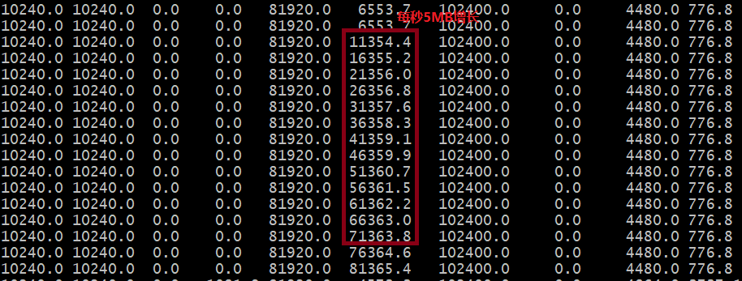

当Eden区使用接近80MB时，再要分配就失败了，此时触发了一次Young GC，Eden区的使用空间降低到4573.3KB：


针对上述示例，我们可以通过jstat命令清晰的看出，新生代对象增速为5MB/s左右，大约十几秒就会触发一次Young GC，每次Young GC回收大约70MB空间，耗时1ms，所以Young GC的速度是很快的，即使回收800MB空间，也就耗时10ms左右。

## 三、总结

本章，我们通过jstat命令分析了BI系统中新生代对象的GC情况。通过jstat命令，我们清晰的看到虽然系统每隔十几秒就会进行一次Young GC，但是Young GC耗时很小，而且没有存活对象进入老年代，所以系统运行的效率还是挺高的。

# jstat实战（2）

## 一、简介

### 1.1 案例背景

假设现在生产环境有一套“数据计算系统”，不停地从MySQL等各类数据源提取数据到内存中进行计算，系统是分布式的。

每个节点（机器）每分钟执行100次操作（提取数据并计算，每次操作耗时10s），每次操作1万条数据，每条数据大小为1KB左右，那么每次操作的数据大小就是10MB：


> 每台机器的配置是4核8G，JVM分配4G内存，其中新生代1.5G，老年代1.5G。

### 1.2 内存使用模型估算

每次操作会在Eden区分配10MB对象，以1分钟100次操作来算，那么Eden区1分钟内就会被占满：


每个计算任务处理1万条数据耗时10s，假设此时80个计算任务都结束了，还有20个计算任务共计200MB正在计算中，那么此时200MB对象是存活的，不会被Young GC回收掉：

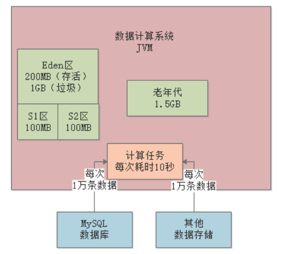

由于任何一块Survivor区只有100MB，所以新生代中这存活的200MB对象会晋升到老年代，然后清空Eden：


如此反复，大约经过7分钟后，也就是经历了7次Young GC，此时大概有1.4G对象在老年代中：


再经过1分钟，也就是第8分钟结束时，新生代又满了，此时发现老年代可用空间已经不足（剩余100MB），比历代平均的晋升对象大小（200MB）要小，所以会直接触发一次Full GC。

Full GC会先把老年代的垃圾回收了（假设能全部回收），然后执行一次Young GC，此时Eden区存活的对象会进入老年代：


按照这种情况，每隔8分钟左右就会发生一次Full GC。Full GC的性能是很差的，所以必须进行优化，最基本的优化思路就是扩大Survivor区的内存，比如扩到200MB。这样基本就能避免对象频繁进入老年代，将Full GC频率降低到几个小时一次。

## 二、代码示例

我们通过一段代码来模拟下上述情况，先来看下JVM参数配置。

### 2.1 JVM内存参数

```java
-XX:NewSize=104857600 -XX:MaxNewSize=104857600 
-XX:InitialHeapSize=209715200 -XX:MaxHeapSize=209715200 
-XX:SurvivorRatio=8 
-XX:MaxTenuringThreshold=15 
-XX:PretenureSizeThreshold=20971520 
-XX:+UseParNewGC -XX:+UseConcMarkSweepGC
-XX:+PrintGCDetails -XX:+PrintGCTimeStamps
```

上述，我们把Java堆内存设置为200MB，其中年轻代100MB，Eden占80MB，Survivor各占10MB，老年代100MB，大对象阈值为20MB。

### 2.2 程序源码

```java
public class Demo1 {
    public static void main(String[] args) throws InterruptedException {
        Thread.sleep(30000);     // main线程休眠30s，以便jstat命令通过PID观察
        while (true) {
            loadData();
        }
    }

    private static void loadData() throws InterruptedException {
        byte[] data = null;
        for (int i = 0; i < 4; i++) {
            data = new byte[10 * 1024 * 1024];    // 10MB
        }
        data = null;

        byte[] data1 = new byte[10 * 1024 * 1024];
        byte[] data2 = new byte[10 * 1024 * 1024];

        byte[] data3 = new byte[10 * 1024 * 1024];
        data3 = new byte[10 * 1024 * 1024];

        Thread.sleep(1000);         // 模拟上述操作全部发生在1s内
    }
}
```

上述程序代码中，每秒都会执行一次loadData()，它会首先分配4个10MB数组对象，但是立马变成垃圾；然后会有data1和data2两个10MB的数组对象被创建并一直被引用；最后，data3指向两个新创建的10MB数组对象。

总之，loadData()的目的就是为了模拟1s内创建接近80MB对象，触发Young GC的。

### 2.3 jstat分析

当我们启动程序后，main线程会阻塞30s，此时我们可以先通过jps命令查找当前JVM的进程ID——13740：


然后在30s内执行下述命令，统计JVM状态，每隔1s打印一次，共打印1000次：
jstat -gc 13740 1000 1000

我们来看下输出结果：
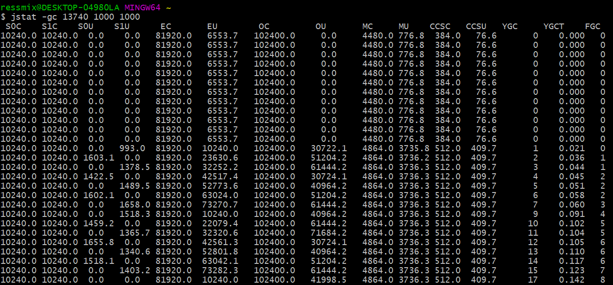

首先，看下EU那列，表示Eden区的内存使用情况，刚开始一直都是6MB多的使用量，此时main线程还在阻塞中，当main线程恢复后，1秒钟就发生一次Young GC，因为Eden区只有80MB。

通过OU列，明显可以看到老年代新增了30MB对象，这就是程序中data1、data2、data3引用的存活对象，因为Eden区放不下，所以触发了Young GC，然后又发现存活对象在Survivor区也放不下，所以将转移到了老年代：


可以看到，Young GC和Full GC都特别频繁，Full GC几乎两三秒就会出现一次，而且从耗时看，Full GC平均耗时2ms左右，但是Young GC竟然又7ms，比Full GC还高：


> 因为上述的每次Full GC都是由Young GC的，Young GC时发现存活对象放不进Survivor，先尝试转移到老年代，但当老年代空间也不足时就会联动触发Full GC[**必须等到Full GC完成后，才能将存活对象转移过去，Young GC才算完成。**]()

## 三、优化

我们来对上述示例进行下优化，主要就是调整Survivor区的大小：

```java
-XX:NewSize=209715200 -XX:MaxNewSize=209715200 
-XX:InitialHeapSize=314572800 -XX:MaxHeapSize=314572800 
-XX:SurvivorRatio=2 
-XX:MaxTenuringThreshold=15 
-XX:PretenureSizeThreshold=20971520 
-XX:+UseParNewGC -XX:+UseConcMarkSweepGC 
-XX:+PrintGCDetails -XX:+PrintGCTimeStamps
```

上述JVM参数，我们把Java堆内存调整为300MB，新生代占200MB，其中Eden区100MB，Survivor区各50MB，老年代100MB。

### 3.1 jstat分析

我们根据上述JVM参数再重新运行程序，输出结果如下：


可以看到，Young GC频率每秒1次，每次存活对象大小约20MB，Survivor区足够容纳，所以没有触发过Full GC。而且15次Young GC耗时才120ms，也就是平均每次8ms，所以对系统的运行几乎没有影响。

## 四、总结

本章，我们通过一个示例引出频繁Full GC的问题，并通过jstat命令观察JVM运行情况，然后对JVM进行调优，最后再通过jstat观察优化后的JVM运行情况，将系统的运行效率提升了，避免了频繁Full GC。

 

# jmap和MAT实战

## 一、简介

我们通过jstat进行分析，发现Full GC非常频繁，基本上每隔两分钟就会执行一次，而且每次Full GC的时间长达10秒。

### 1.1 案例背景

系统的JVM内存模型如下，当时给Java堆内存分配了20G，其中年轻代10G，老年代10G：


事实上，虽然分配了那么大的内存空间给年轻代和老年代，但是通过jstat分析发现，Eden区大概1分钟就会被占满，然后触发一次Young GC，而且Young GC过后有几个G的对象都会存活并进入老年代：


这说明系统代码运行时会产生大量对象，经常在1分钟过后就塞满Eden，然后会触发Young GC，但是由于程序处理极慢，导致大量存活对象Survivor区无法容纳，从而进入老年代。

由于老年代的内存有10GB，所以在没有采用G1的情况下，一次Full GC的回收速度很慢，长达10s，这就直接导致了工作线程无法正常运行，对于用户来说就是系统卡死。

## 二、JVM优化

### 2.1 优化思路

通过上述分析，我们可以判断一定是程序代码的某处在不断生成各种对象，导致系统加载过多数据到内存中。所以，要对这个案例进行优化，就必须分析到底是程序哪里在源源不断地创建对象。

我们可以先通过jmap生成一个JVM内存快照文件，然后通过MAT进行分析。下面我们通过一段示例代码来排查：

```java
public class Demo1{
    public static void main(String[] args){
        List<Data> datas = new ArrayList<>();
        for(int i=0; i<10000; i++){
            datas.add(new Data());
        }
        Thread.sleep(1 * 60 * 60 * 1000);
    }
}
```

### 2.2 生成JVM内存快照

首先执行上述这段程序，通过jps获取JVM进程ID——1177：


然后执行jmap命令导出JVM内存快照：

```java
jmap -dump:live,format=b,file=dump.hprof 1177
```

### 2.3 MAT分析

线上dump出来的内存快照一般都有几个G，比如我们上述的程序就有8个多G的内存快照，所以运行MAT时，务必将MemoryAnalyzer.ini中的启动堆大小设置为8G以上：


启动MAT后，选择“Leak Suspects”，也就是内存泄漏分析，接着我们会看到下面的图：


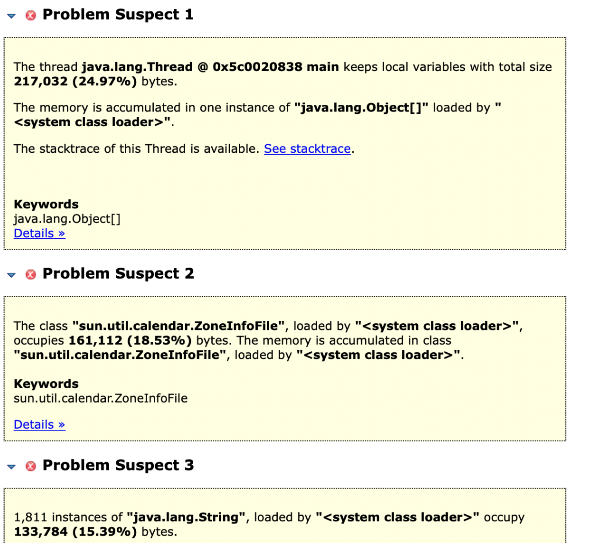

“Problem Suspect1”告诉我们：main线程通过局部变量引用占据内存24.97%的对象，而且占据内存的是一个java.lang.Object[]数组。

我们可以通过“Detail”链接进去查看这个数组到底是什么，通过这个详细说明，我们可以看到mian线程中引用的是一个java.util.ArrayList，里面的每个元素都是Demo1$Data对象：


然后，知道了这些不断创建的对象是什么后，我们还希望知道程序是在哪段代码创建了这些对象。如下图所示，先点击页面中的“See stacktrace”链接，就会进入一个线程执行代码堆栈的调用链：


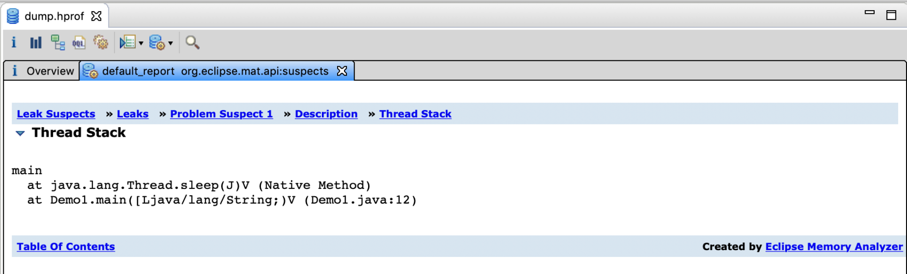

可以看到，问题定位到了Demo1类的main方法内的第12行，最终发现是这个线程执行了String.split()方法导致产生了大量的对象。

### 2.4 问题解决

为什么String.split()方法会造成内存泄漏呢？

在JDK1.6以前，String.split()方法对于“Hello World Ressmix”这种字符串，底层是基于一个数组来存放的，比如[H,e,l,l,o, ,W,o,r,l,d, ,R,e,s,s,m,i,x]，当基于空格切割时，比如“Hello”，不会存到一个新的数组中，而是采用偏移量来表明是对应原数组中的那一段。

但是JDK1.7以后，每个切割出来的子字符串都对应一个全新的数组。

所以，上述案例中程序的问题就是加载了大量数据出来，可能一次几十万条，然后通过split对这些字符串进行切割，导致字符串数组对象暴增几十倍，这就是为什么系统会频繁产生大量对象的原因。

解决方案就是对String.split()处的代码进行优化，避免同时加载大量数据并进行切割。

## 三、总结

本章通过一个内存泄漏的案例，讲解了分析此类问题的思路和解决方法。jmap和MAT经常组合在一起使用，用于线上问题此类的排查。

# 内存碎片优化

## 一、案例背景

本案例的背景是一个高峰期每秒十万QPS的社交APP，这类APP流量最大的模块就是个人主页模块，会有大量的用户在一个集中的时间段内（比如晚上）频繁访问各种个人主页数据，而且个人主页的数据量通常比较大，在几MB左右：


### 1.1 存在问题

上述案例，由于高峰期的每秒并发量太高，所以新生代的Eden区会被迅速占满，频发触发Young GC。而在Young GC的时候，下一秒的请求又来了，导致很多请求是还没来得及处理完的，导致每次Young GC的时候很多对象需要存活下来，因此在高峰期经常会出现存活对象太多，导致Survivor区放不下的问题：

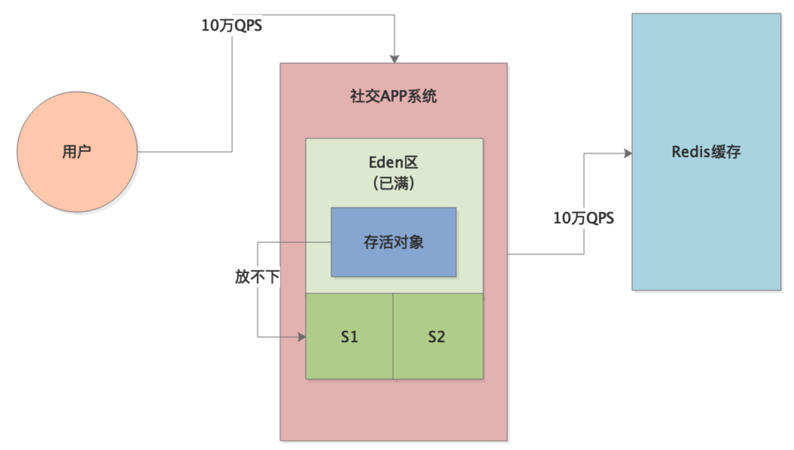

所以，此时就会有大量对象频繁进入老年代，从而频繁触发老年代的GC：


## 二、内存碎片

### 2.1 优化前

我们先来看下系统优化前的一些关键JVM参数：

```java
-XX:UseCMSCompactAtFullCollection -XX:CMSFullGCsBeforeCompaction=5
```

上述采用CMS对老年代进行垃圾回收，默认为标记-清除算法，所以每次GC后都会出现许多内存碎片。
我们来看下整个流程，首先老年代中有许多垃圾对象：

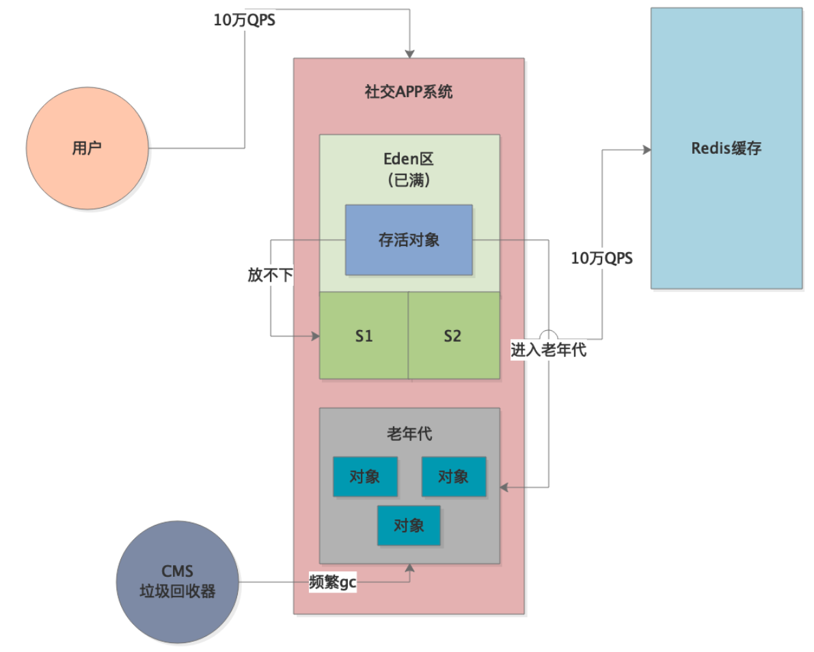

CMS回收掉一些垃圾对象后，就会出现内存碎片，由于-XX:CMSFullGCsBeforeCompaction=5，所以5次Full GC之后才会进行[**内存碎片整理**]()：


但是，大家考虑一个场景，一次Full GC之后，老年代中有一部分内存里都是大量的内存碎片，只有部分可用的连续空间。这时候，随着大量对象进入老年代，一旦连续可用空间不足以容纳这些对象，就会导致立马触发下一次Full GC。

这样，随着一次次Full GC，导致老年代产生更多的内存碎片，触发下一次Full GC的速度也会越来越快，直到5次Full GC之后才会去整理内存碎片。

### 2.2 优化后

这个案例的优化，其实非常简单。

首先，可以用jstat分析下JVM的运行情况，[**判断出每次Young GC后存活对象的大小，然后增加Survivor区的大小，避免存活对象频繁进入老年代。**]()

另外，优化后部分对象还是慢慢会进入老年代，毕竟系统的负载很高，所以调优后每小时还是会有一次Full GC。

第二个优化点就是针对CMS内存碎片问题进行优化。在降低了Full GC的频率后，务必设置以下参数，使得每次Full GC后都进行内存碎片整理：

```java
-XX:UseCMSCompactAtFullCollection -XX:CMSFullGCsBeforeCompaction=0
```

这样虽然每次Full GC的内存碎片整理需要消耗更多的时间，但是跟频繁Full GC的时间消耗相比，效率会提升很多。

# 大对象优化

## 一、案例背景

本章将介绍一个因为大对象而导致的频繁GC问题，其本质也是开发童鞋在写程序代码时存在bug，进而导致出现JVM性能问题。

首先，这个系统上线之后发现一天的Full GC次数多达几十次，通常来说，我们建议的一个比较良好的JVM性能，应该是Full GC几天才发生一次，或者最多一天发生几次而已。

生产环境这个系统部署在2核4G的机器上，JVM参数如下：

```java
-Xms=1536M -Xmx=1536M -Xmn=512M -Xss=256K 
-XX:SurvivorRatio=5 
-XX:+UseParNewGC -XX:+UseConcMarkSweepGC 
-XX:CMSInitiatingOccupancyFraction=68 
-XX:CMSParallelRemarkEnable 
-XX:UseCMSInitiatingOccupancyOnly 
-XX:+PrintGCDetails -XX:+PrintGCTimeStamps
```

比较关键的几个设置是：

- -XX:SurvivorRatio=5：表示Eden:Survivor:Survivor=5:1:1
- -XX:CMSInitiatingOccupancyFraction=68：表示一旦老年代内存使用达到68%，就会触发Full GC
- -XX:UseCMSInitiatingOccupancyOnly :使用手动定义初始化定义开始CMS收集

此时，整个系统对应的JVM内存模型如下：


### 1.1 存在问题

我们通过jstat进行分析，统计出的JVM性能如下：

- 系统运行时间：6天
- 6天内的Full GC次数和总耗时：250次，70秒
- 6天内的Young GC次数和总耗时：26000次，1400秒

也就是说，平均每20s触发一次Young GC，每30分钟触发一次Full GC。根据Eden区和老年代的空间可以估算，系统每秒钟会产生约20MB对象进入Eden，每30分钟会有约600MB对象进入老年代：


根据参数-XX:CMSInitiatingOccupancyFraction=68，老年代内存使用达到68%，就会触发Full GC，一次Full GC时间约300ms。

## 二、大对象

### 2.1 优化前

通过上述的案例背景介绍，我们首先想到的是会不会因为Survivor区太小，导致Young GC后的存活对象太多，放不下Survivor了，所以就一直有对象流入老年代，进而导致30分钟后触发Full GC？

但这只是推论，[**因为对象进入老年代也可能是因为动态年龄判断规则**]()，所以我们就需要通过工具在高峰期观察JVM的内存使用情况。

事实上，我们观察到每次 Young GC后进入老年代的对象非常少，而且一次Young GC的存活对象也就是几十MB，Survior区可以容纳，偶尔触发动态年龄判断规则时，才有几十MB对象进入老年代：


因此，分析到这里就很奇怪了，因为通过jstat追踪，并不是每次Young GC后都有几十MB对象进入老年代，而是偶尔才有对象进入老年代，记住，是偶尔。

那么老年代里面到底为什么会有那么多对象呢？

我们观察发现，系统运行一段时间后，突然间老年代中的对象就会增加五六百MB。

答案已经很明显了——大对象！一定是系统运行时，每隔一段时间就会产生几百兆的大对象，直接进入老年代，不会走年轻代的Eden区，然后配合年轻代还偶尔会有几十MB对象进入老年代，所以才30分钟触发一次Full GC：


### 2.2 优化后

了解了问题的所在，我们就开始针对这个案例进行优化。首先，就是要确定这个大对象到底是什么？

我们采用jmap工具导出一份JVM内存快照，然后通过jhat或者Visual VM之类的可视化工具进行分析，发现那几百兆大对象就是从数据库中查出的记录，然后对SQL进行排查，发现某个SQL在一种特殊场景下会执行类似SELECT * FROM的语句，导致一次性从数据库中查出几十万条数据。

针对该问题，主要做以下几点优化：

1. [**解决程序bug，不允许全表查询，这样就避免了大对象直接进入老年代的问题；**]()
2. [**Survivor区明显不够，70MB的空间很容易触发动态年龄判断，所以为其分配更多空间。**]()

优化后的JVM参数如下：

```java
-Xms=1536M -Xmx=1536M -Xmn=1024M -Xss=256K 
-XX:SurvivorRatio=5 
-XX:PermSize=256M -XX:MaxPermSize=256M 
-XX:+UseParNewGC -XX:+UseConcMarkSweepGC 
-XX:CMSInitiatingOccupancyFraction=92 
-XX:CMSParallelRemarkEnable -XX:UseCMSInitiatingOccupancyOnly 
-XX:+PrintGCDetails -XX:+PrintGCTimeStamps 
```

可以看到，新生代直接分配1G空间，其中Survivor各占150MB左右，此时Young GC过后的几十MB存活对象一般就不会进入老年代了。

同时，调整参数-XX:CMSInitiatingOccupancyFraction=92，将比例提高至92%，避免老年代仅占62%就触发Full GC。

最后，还设置永久代大小为256MB，因为默认永久代就几十MB，如果程序使用了反射等机制，很容
易被占满。

经过上述优化，系统基本上每分钟一次Young GC，几天才会发生一个Full GC。

## 三、总结

本章，我们通过示例分析了大对象导致的频繁Full GC问题，并一步一步展现了发现问题、分析问题、解决问题的思路。当我们发现Young GC过后并不是每次都有很多存活对象进入老年代的时候，就要从别的角度考虑下到底为什么会有那么多存活对象进入老年代。

# 元数据区优化

## 一、案例背景

本章介绍的案例比较特殊，是由于人为设置JVM参数错误，而导致的JVM性能问题。

首先，生产环境有一个新上线的系统，频繁触发Full GC告警。通过GC日志，我们发现日志中有大量以下字样：
**【Full GC(Metadata GC Threshold) xxxxx,xxxxx】**

从这里就知道，频繁的Full GC是因为Metadata区域（JDK1.8+）被占满。

### 1.1 存在问题

Metadata区域，也就是元数据区，一般存放着类信息，为什么会被频繁占满，进而触发Full GC呢？我们通过工具分析元数据区的内存占用情况，发现元数据区域的内存使用波动曲线类似于下面这样：


也就是说，元数据区的内存占用不断增加，当达到一个顶点后（快占满）就会触发Full GC，Full GC会对元数据区域进行垃圾回收，所以接下来元数据区的内存占用就又变小了。

## 二、元数据区占满

### 2.1 优化前

通过上述的案例背景介绍，已经可以很明显的看出，系统的问题就是不断有新的类被加载到元数据区，导致不断地触发Full GC：


那到底是什么类在不断地被加载呢？

我们可以通过在JVM启动参数中加上以下配置，然后观察GC日志：

```
-XX:TraceClassLoading -XX:TraceClassUnloading
```

这两个参数，用来追踪类加载和类卸载的情况，GC日志中会打印出JVM加载了哪些类、卸载了哪些类：

```
Loaded sun.reflect.GeneratedSerializationConstructorAccessor from _JVM_Defined_Class
```

可以看到，JVM在运行期间不断地加载了大量的“`GeneratedSerializationConstructorAccessor`”类到元数据区，这些类是在程序中使用Java的反射时加载的，比如像下面这样：

```java
Method method = XXX.class.getDeclaredMethod(xxx, xxx);
method.invoke(target, params);
```

在执行这类反射代码时，JVM会动态生成一些类放入元数据区：


那 JVM又为什么会不停的创建这些类对象呢？

首先，我们要明白Class对象都是SoftRefence（软引用），软引用在正常情况下不会被回收。JVM在GC时判断是否回收软引用对象时，采用了一个公式：
$$
**clock-timestamp ≤ freespace \* SoftRefLRUPolicyMSPerMB**
$$
这个公式的意思是说：clock-timestamp表示对象最近一次被访问距当前的时间差，freespace表示JVM中的空闲内存大小，SoftRefLRUPolicyMSPerMB表示每1MB空间可以允许SoftReference对象存活多久。

举个例子，假如JVM中的空闲内存大小为3000MB，SoftRefLRUPolicyMSPerMB设置为1000ms，那么Class对象就可以存活：3000*1000=3000秒，也就是50分钟。

SoftRefLRUPolicyMSPerMB可以通过JVM启动参数配置，在上述案例中，这个值被配置成了0，于是freespace * SoftRefLRUPolicyMSPerMB=0。这就导致程序通过反射创建出Class对象后，立马被回收了，接着JVM在反射代码的执行过程中，继续创建这种反射代理类，在JVM的机制下，这种类对象会越来越多，直到将元数据区占满。


> 这里其实大家会有个疑问，为什么软引用的class对象被回收后，就会导致JVM不断的创建更多的新class对象。其实这是JDK内部的一个缺陷，需要分析JDK源码，不再赘述。

### 2.2 优化后

了解了问题的所在，我们就开始针对这个案例进行优化，其实非常简单，之所以出现元数据区的频繁GC就是因为JVM参数设置不合理，只要把-XX:SoftRefLRUPolicyMSPerMB=0这个参数的值设置大一点就可以了，比如1000、2000、5000。

提高这个数值，就是让反射过程中JVM自动创建的软引用的一些class对象不要被随便回收，那元数据区中的内存占用也就基本稳定了。

## 三、总结

本章，我们通过示例分析了元数据区被占满导致的频繁Full GC问题，通过参数-XX:SoftRefLRUPolicyMSPerMB可以配置软引用对象的平均存活时间，从而避免了元数据区频繁被占满。

# SystemGC

## 一、案例背景

本章将介绍一个因为程序员同学不懂JVM的GC机制而导致的系统卡死的案例。

首先，这个系统上线之后，平时都还算正常，结果有一次大促活动的时候，系统直接卡死不动了。这个时候，我们首先想到的是可不可能是因为频繁Full GC导致Stop the World，正常工作线程无法执行。

### 1.1 存在问题

我们通过jstat进行分析，发现JVM中各个区域的内存使用都正常，新生代对象增长也不快，老年代也才使用了10%左右的空间，永久代也就使用了20%。

但是，jstat日志显示，JVM竟然每秒执行一次Full GC，每次都耗时几百毫秒。

既然Java堆内存都正常，为啥会频繁Full GC？这是我们立马想到，是不是有开发人员在代码中写了System.gc()这种代码，结果通过代码走查，发现确实如此。

## 二、System.gc方法

### 2.1 优化前

开发同学写System.gc()这行代码的思路是这样的：某段代码会一下子加载了好多数据，处理完成后这批数据就不用了，占用太多内存，所以就干脆显示调用GC方法把它们回收掉吧。

结果在平时没什么问题，因为流量很低。但是大促期间，访问量很高，System.gc()方法被频繁调用，因此频繁触发Full GC，从而导致了上述问题。

### 2.2 优化后

针对这个问题，解决方案就是禁止在代码中显式调用System.gc()方法，GC完全交由JVM自己去处理，可以通过配置JVM参数-XX:+DisableExplicitGC来强制屏蔽。

## 三、总结

针对本章案例中的问题，我们平时自己写代码时，不要自己去调用System.gc()方法随便触发GC，一方面可以通过在JVM参数中加入-XX:+DisableExplicitGC显示禁止代码中的GC操作，另一方面也要加强对开发人员的JVM相关知识的培训。

# 内存溢出概述

## 一、简介

从本章开始，我们将介绍JVM中的内存溢出异常——Out of Memory。我们运行Java程序时，本质是创建了一个JVM进程，然后在里面执行Java字节码。既然是进程，就一定有内存限制，当Java程序使用的内存空间超过限制时，就可能发生内存溢出异常。

在JVM中，一共有三种可能出现OOM的地方：方法区（元数据区）、Java栈内存、Java堆内存。

## 二、方法区溢出

在JVM内存模型中，我们介绍过JVM内存模型，JVM中有一块区域叫“方法区”，里面主要保存着从”.class“文件里加载进来的类，包括类的名称、方法信息、字段信息、静态变量、常量以及编译器编译后的代码等。

> JDK1.8及以后这块区域叫做“元数据区"，元数据区直接使用本地内存。默认情况下，元数据区会根据使用情况动态调整，避免了在JDK1.8以前由于加载类过多从而出现 java.lang.OutOfMemoryError: PermGen。但也不能无限扩展，因此可以使用-XX:MaxMetaspaceSize来控制最大内存。

既然元数据区有大小，那这里就可能发生内存溢出。

### 2.1 溢出原因

元数据区中对象一般是不会被回收的，JVM进行Full GC时，会尝试对元数据区中的垃圾对象进行回收。但是元数据区中的对象回收的条件是相当苛刻的：比如加载这个类的类加载器先要被回收、这个类的所有对象实例都要被回收等等。所以，即使Full GC针对元数据区进行垃圾回收，也未必能够回收掉很多垃圾对象。

JVM启动时，元数据区默认情况只会分配几十MB空间，所以生产环境一定要显式指定该区域的大小，一般512MB就足够了：

--XX:MetaspaceSize=512m --XX:MaxMetaspaceSize=512m

[**针对元数据区，避免内存溢出的最好办法就是预估系统运行模型，然后合理分配Metaspace区域的内存大小，同时避免无限制的通过动态代理生成类。**]()

## 三、栈溢出

JVM中，每个线程都有自己的虚拟机栈，就是所谓的栈内存。线程只要执行某个方法，就会为该方法创建一个栈帧，然后将栈帧入栈到虚拟机栈中。这个栈帧中存放着方法的各种局部变量。

我们通过参数JVM启动的-Xss参数设置栈内存的大小，比如我们之前的示例中，一般栈内存大小都指定为1MB——-Xss1M。所以，既然栈内存有大小，那这里也可能发生内存溢出，我们通过示例来看下。

### 3.1 溢出原因

Java虚拟机栈的内存大小是有限的，如果一个线程不停的层层调用方法，每次调用就会创建栈帧入栈，因为栈帧是有大小的，所以当虚拟机栈满了以后，就会出现栈内存溢出。

一般来说，除非是一些递归调用，否则线程不会一直只入栈不出栈，而且1MB的栈大小也足够容纳递归调用所需的栈内存。所以，[**引发栈内存溢出的往往都是程序bug，比如递归调用时没有终结条件等**]()。

## 四、堆溢出

Java堆内存，应该是我们进行JVM调优接触最多的一部分区域了。这里存放着我们程序代码里创建的各种各样的对象。一般来说，我们给Java堆内存分配空间时，是固定的大小，所以这里也是最容易出现内存溢出的区域。

### 4.1 溢出原因

我们知道，Young GC过后的存活对象首先会先尝试进行一块Survivor区，如果Survivor区无法容纳，则尝试进入老年代，如果此时老年代也满了就会触发Full GC。但是，如果Full GC之后，老年代的空间还是不够呢？这时只能抛出内存溢出异常了。

所以，堆内存溢出的原因，总结起来就是一句话：有限的内存中放了过多的对象，而且大多数对象是存活的，此时要继续放入更多对象已经不可能了，只能抛出内存溢出异常。

通常，能引发堆内存溢出的场景主要有两种：

- 系统承载高并发请求，因为[**请求量过大，导致大量对象都是存活的**]()，所以要继续放入新的对象实在是不行了，只能抛OOM。
- 程序存在bug导致内存泄漏，这[**即使触发GC也无法回收掉这些泄漏的对象**]()，导致内存占用越来越多，直到OOM。

## 五、总结

针对各类内存溢出问题，生产环境的系统需要有配套的监控系统对OS、JVM的状态进行监控，重点关注CPU、内存、JVM的GC频率这三个指标，一般来说成熟的公司都会有Zabbix、Open-Falcon之类的监控平台，小型公司则可以通过日志结合jhat进行内存快照分析的方式来排查。

# 模拟Metaspace内存溢出

## 一、简介

我们回顾下Metaspace区发生内存溢出的一个场景：程序不停的动态生成类，然后不停的加载类到Metaspace区域，而且这些动态生成的类必须得是不能被回收的，一旦Metaspace区满了，就会触发Full GC，而由于Metaspace区中的对象无法被回收，此时就触发了Metaspace内存溢出。

## 二、示例程序

我们的示例程序采用CGLIB来动态生成类。

### 2.1 程序源码

```java
public class Demo1 {
    public static void main(String[] args) {
        long count = 0L;
        while (true) {
            Enhancer enhancer = new Enhancer();
            enhancer.setSuperclass(Car.class);
            enhancer.setUseCache(false);
            enhancer.setCallback(new MethodInterceptor() {
                public Object intercept(Object o, Method method, Object[] objects, MethodProxy methodProxy) throws Throwable {
                    if (method.getName().equals("run")) {
                        System.out.println("Before run, security checking...");
                        return methodProxy.invokeSuper(o, objects);
                    } else {
                        return methodProxy.invokeSuper(o, objects);
                    }
                }
            });

            Car car = (Car) enhancer.create();
            car.run();

            System.out.println("Created " + ++count +" Car.");
        }
    }

    static class Car {
        public void run() {
            System.out.println("Car is running...");
        }
    }

    static class SafeCar extends Car{
        @Override
        public void run() {
            System.out.println("Car is running...");
            super.run();
        }
    }
}
```

上述代码，通过CGLIB的Enhancer生成了一个Car的代理子类：

```java
Enhancer enhancer = new Enhancer();
enhancer.setSuperclass(Car.class);
enhancer.setUseCache(false);
```

既然是Car的子类，就会有Car的所有方法，然后我们在调用子类的run方法时做了点手脚：

```java
enhancer.setCallback(new MethodInterceptor() {
    public Object intercept(Object o, Method method, Object[] objects, MethodProxy methodProxy) throws Throwable {
        if (method.getName().equals("run")) {
            System.out.println("Before run, security checking...");
            return methodProxy.invokeSuper(o, objects);
        } else {
            return methodProxy.invokeSuper(o, objects);
        }
    }
});
```

上述这段代码的意思是：如果调用了Car子类对象的方法，会先被这里的MethodInterceptor拦截，拦截后判断如果是run方法，则先做一些额外的工作——汽车安全检查，最后再执行父类的run方法。效果等同于：

```java
static class SubCar extends Car {
    @Override
    public void run() {
        System.out.println("Before run, security checking...");
        super.run();
    }
}
```

### 2.2 JVM参数

接着，我们需要通过JVM参数限制下Metaspace区域的大小，我们把它设置为10MB，然后开启内存溢出时自动dump内存快照：

```
-XX:MetaspaceSize=10m -XX:MaxMetaspaceSize=10m 
-XX:+UseParNewGC -XX:+UseConcMarkSweepGC 
-XX:+PrintGCDetails 
-XX:+HeapDumpOnOutOfMemoryError 
-XX:HeapDumpPath=./
```

使用该参数执行程序，可以看到如下所示的打印输出，当创建到第258辆Car时，Metaspace区的内存被耗尽了，导致**java.lang.OutOfMemoryError: Metaspace**：

> ```
> Created 258 Car.
> java.lang.OutOfMemoryError: Metaspace
> Dumping heap to ./\java_pid11836.hprof ...
> Heap dump file created [3470456 bytes in 0.120 secs]
> Exception in thread "main" net.sf.cglib.core.CodeGenerationException: java.lang.reflect.InvocationTargetException-->null
>     at net.sf.cglib.core.AbstractClassGenerator.generate(AbstractClassGenerator.java:348)
>     at net.sf.cglib.proxy.Enhancer.generate(Enhancer.java:492)
>     at net.sf.cglib.core.AbstractClassGenerator$ClassLoaderData.get(AbstractClassGenerator.java:117)
>     at net.sf.cglib.core.AbstractClassGenerator.create(AbstractClassGenerator.java:294)
>     at net.sf.cglib.proxy.Enhancer.createHelper(Enhancer.java:480)
>     at net.sf.cglib.proxy.Enhancer.create(Enhancer.java:305)
>     at com.ressmix.jvm.Demo1.main(Demo1.java:27)
> Caused by: java.lang.reflect.InvocationTargetException
>     at sun.reflect.GeneratedMethodAccessor1.invoke(Unknown Source)
>     at sun.reflect.DelegatingMethodAccessorImpl.invoke(DelegatingMethodAccessorImpl.java:43)
>     at java.lang.reflect.Method.invoke(Method.java:498)
>     at net.sf.cglib.core.ReflectUtils.defineClass(ReflectUtils.java:459)
>     at net.sf.cglib.core.AbstractClassGenerator.generate(AbstractClassGenerator.java:339)
>     ... 6 more
> Caused by: java.lang.OutOfMemoryError: Metaspace
>     at java.lang.ClassLoader.defineClass1(Native Method)
>     at java.lang.ClassLoader.defineClass(ClassLoader.java:763)
>     ... 11 more
> ```


## 三、问题分析

上述程序执行完后，会在程序根目录生成两个文件：gc.log是JVM运行时信息，java_pid11836.hprof就是内存快照。

### 3.1 GC日志分析

我们先来分析下gc.log：

```
1.218: [GC (Allocation Failure) 1.276: [ParNew: 52480K->2051K(59008K), 0.0160380 secs] 52480K->2051K(190080K), 0.0745051 secs] [Times: user=0.05 sys=0.00, real=0.08 secs] 
1.631: [GC (Allocation Failure) 1.631: [ParNew: 54531K->2855K(59008K), 0.0025661 secs] 54531K->2855K(190080K), 0.0026505 secs] [Times: user=0.00 sys=0.00, real=0.00 secs] 
1.881: [Full GC (Metadata GC Threshold) 1.881: [CMS: 0K->2708K(131072K), 0.0464583 secs] 36239K->2708K(190080K), [Metaspace: 9885K->9885K(1058816K)], 0.0467198 secs] [Times: user=0.05 sys=0.01, real=0.05 secs] 
1.927: [Full GC (Last ditch collection) 1.927: [CMS: 2708K->1749K(131072K), 0.0104116 secs] 2708K->1749K(190144K), [Metaspace: 9885K->9885K(1058816K)], 0.0104936 secs] [Times: user=0.02 sys=0.00, real=0.01 secs] 
2.012: [GC (CMS Initial Mark) [1 CMS-initial-mark: 1749K(131072K)] 1749K(190144K), 0.0001810 secs] [Times: user=0.00 sys=0.00, real=0.00 secs] 
2.012: [CMS-concurrent-mark-start]
2.022: [CMS-concurrent-mark: 0.011/0.011 secs] [Times: user=0.05 sys=0.00, real=0.01 secs] 
2.057: [CMS-concurrent-preclean-start]
2.058: [CMS-concurrent-preclean: 0.001/0.001 secs] [Times: user=0.00 sys=0.00, real=0.00 secs] 
Heap
 par new generation   total 59072K, used 1363K [0x0000000701a00000, 0x0000000705a10000, 0x00000007166c0000)
  eden space 52544K,   2% used [0x0000000701a00000, 0x0000000701b54c68, 0x0000000704d50000)
  from space 6528K,   0% used [0x0000000704d50000, 0x0000000704d50000, 0x00000007053b0000)
  to   space 6528K,   0% used [0x00000007053b0000, 0x00000007053b0000, 0x0000000705a10000)
 concurrent mark-sweep generation total 131072K, used 1749K [0x00000007166c0000, 0x000000071e6c0000, 0x00000007c0000000)
 Metaspace       used 9912K, capacity 10090K, committed 10240K, reserved 1058816K
  class space    used 890K, capacity 913K, committed 1024K, reserved 1048576K
2.063: [GC (CMS Final Remark) [YG occupancy: 1363 K (59072 K)]2.063: [Rescan (parallel) , 0.0002642 secs]2.063: [weak refs processing, 0.0000124 secs]2.063: [class unloading, 0.0012829 secs]2.065: [scrub symbol table, 0.0005776 secs]2.065: [scrub string table, 0.0001698 secs][1 CMS-remark: 1749K(131072K)] 3112K(190144K), 0.0024292 secs] [Times: user=0.00 sys=0.00, real=0.00 secs]
```

先触发了两次Young GC，主要是因为不断创建Car对象，最终Eden区无法容纳。我们关键看下Full GC，第一次Full GC如下：

```
1.881: [Full GC (Metadata GC Threshold) 1.881: [CMS: 0K->2708K(131072K), 0.0464583 secs] 36239K->2708K(190080K), [Metaspace: 9885K->9885K(1058816K)], 0.0467198 secs] [Times: user=0.05 sys=0.01, real=0.05 secs]
```

Metadata GC Threshold告诉我们是因为Metasapce区空间不足而引起Full GC。可以看到，Metasapce区的对象已经快占满了10MB了——[Metaspace: 9885K->9885K(1058816K)]，经过这次Full GC，里面的对象并没有被回收掉，接着就进行下一次Full GC，这是最后的拯救机会（Last ditch collection）：

```
1.927: [Full GC (Last ditch collection) 1.927: [CMS: 2708K->1749K(131072K), 0.0104116 secs] 2708K->1749K(190144K), [Metaspace: 9885K->9885K(1058816K)], 0.0104936 secs] [Times: user=0.02 sys=0.00, real=0.01 secs]
```

结果还是一样，Metaspace区中的对象依旧无法回收，也不够容纳新创建的类对象，所以JVM直接终止运行，并打印出最后的堆内存的情况。

### 3.2 内存快照分析

我们通过MAT工具来对内存快照java_pid11836.hprof进行分析：


可以看到，大量的AppClassLoader占用了内存，点击Details继续看，发现里面有一大堆Car$$EnhancerByCGLIB对象，正是因为CGLIB动态生成的这些类导致了Metaspace被占满：

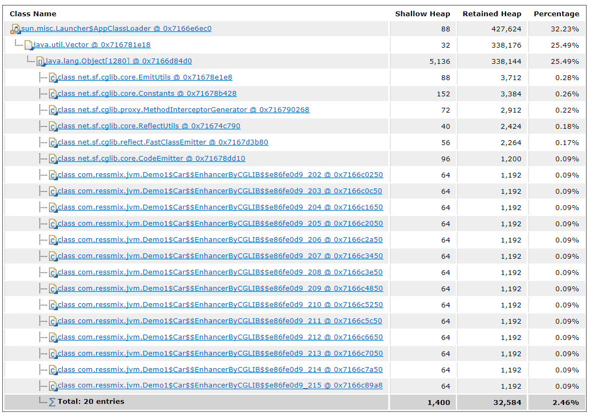

于是我们排查代码，看到底是哪里不断的动态创建类对象，发现Enhancer对象没有做缓存，所以只要加上缓存，不要无限制去生成类就可以了。

## 四、总结

本章，我们通过一个程序示例，不断利用CGLIB生成动态代理类的方式，模拟了Metaspace区内存溢出的场景。下一章，我们将模拟Java虚拟机栈内存溢出。

